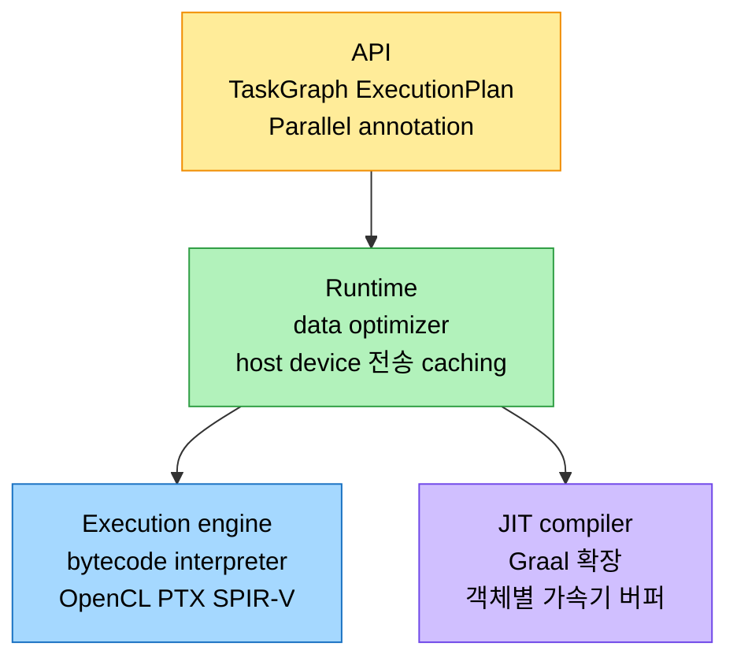
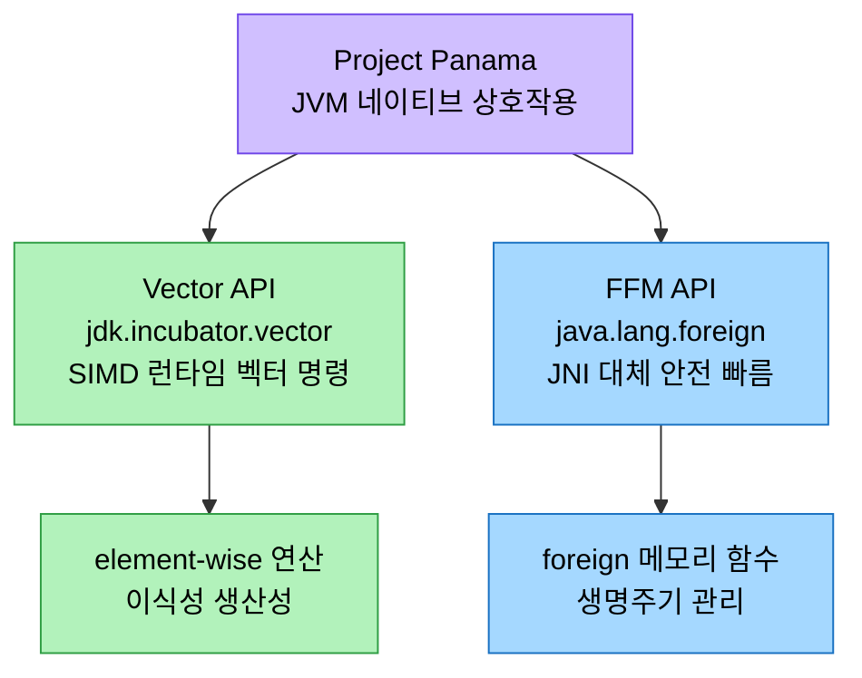

# 케이스 스터디와 Project Panama

## 1. 들어가며 — 다섯 시도와 한 미래

> JVM이 exotic hardware를 끌어안으려 한 시도는 한 줄로 이어진다. JNI로 네이티브를 부르던 LWJGL에서, bytecode를 OpenCL로 번역한 Aparapi와 GPU에 직접 offload하려던 Sumatra를 거쳐, 런타임 재컴파일의 TornadoVM과 JNI를 대체하는 Project Panama에 이른다.

이 장은 LWJGL·Aparapi·Project Sumatra·CUDA4J·TornadoVM·Project Panama를 케이스 스터디로 든다. 각 프로젝트는 가속기가 던지는 도전과 기회를 다른 각도에서 비춘다. LWJGL이 JNI로 네이티브 API를 부르는 baseline을 보이고, Aparapi와 Sumatra가 bytecode를 GPU로 옮기는 두 방식을 보이며, TornadoVM이 런타임 재컴파일을, Project Panama가 JNI를 잇는 새 인터페이스를 보인다.

## 2. LWJGL — JNI baseline

LWJGL(Lightweight Java Game Library)은 Java가 graphics(OpenGL·Vulkan)·audio(OpenAL)·parallel computation(OpenCL)의 네이티브 API에 접근하게 하는 성숙한 라이브러리다. Java 애플리케이션이 LWJGL 메서드를 부르면 LWJGL이 JNI(네이티브 코드를 Java에서 부르는 표준 메커니즘)로 `OpenGL.dll` 같은 네이티브 라이브러리의 함수를 호출한다. 그 사이에 Java와 C 변수를 변환하고 네이티브 라이브러리를 부르는 JNI Wrapper, 곧 glue code가 놓인다.

JNI는 양면이 있다. 광범위한 네이티브 API에 접근하게 해 JVM이 직접 지원하지 않는 가속기 능력을 빌리게 하지만, 네이티브 호출이 Java 호출보다 느려 오버헤드가 있고 glue code가 복잡하고 오류가 잦다. Oracle architect Gary Frost가 짚은 도전은 셋이다. **메모리 관리 불일치** — JVM은 자동 GC로 메모리를 제어하는데, GPU API는 비동기라 데이터 이동·kernel dispatch 요청이 즉시 반환되고 실제 연산은 큐에 쌓인다. 이 latency-hiding이 peak 성능에 중요하지만, 언제든 객체를 재배치하는 GC와 충돌해 JNI로 넘긴 포인터가 연산 중 무효가 될 수 있다. `GetPrimitiveArrayCritical`로 객체를 "pin"하지만 JNI 호출이 반환될 때까지만이라, Java 앱이 데이터 전송 완료까지 인위적으로 기다려야 해 비동기의 이점이 깎인다. **성능 오버헤드** — JNI 전환은 데이터 타입 변환과 calling convention 탓에 순수 Java보다 느려, 네이티브 API에 크게 기대는 작업에서 병목이 된다. **복잡성·유지보수** — Java와 C/C++를 모두 알아야 하고 glue code를 짜야 해 디버깅과 유지보수가 어렵다. 이 메모리 불일치는 LWJGL만이 아니라 Aparapi·TornadoVM도 겪는다.

## 3. Aparapi와 Project Sumatra

> Aparapi는 bytecode를 *OpenCL로 번역*해 GPU에 offload하고, Sumatra는 Java 8 Stream API를 *GPU에 직접 offload*하려 했다. 둘 다 Java 메모리 모델을 GPU에 매핑하는 벽에 부딪혔다.

Aparapi("A PARallel API")는 Java와 OpenCL을 잇는다. annotation과 클래스로 병렬 태스크를 정의하면 Aparapi가 Java bytecode를 OpenCL로 번역해 GPU에서 실행한다. 천문학의 adaptive optics(망원경 거울 보정)를 예로, `Kernel`을 상속해 `run()`에서 `getGlobalId(0)`·`getGlobalId(1)`로 work item을 식별하고 `Range.create2D(...)`로 실행한다. 다만 OpenCL 프로그래밍 모델을 이해해야 하고, GPU는 메모리를 flatten하므로 2D Java 배열이 직접 지원되지 않을 수 있으며, 순차 Java처럼 실행되지 않는다. Aparapi의 한계는 CPU↔GPU 데이터 전송 병목(array access type 지정으로 완화), OpenCL의 명시적 메모리 관리와 동적 할당 미지원, constant·local 메모리를 못 쓰는 점(TornadoVM은 JIT로 자동 활용), 그리고 Java의 일부만 지원하는 subset이다. Gary Frost는 Java 문법으로 "의도"를 표현하되 JVM이 그 bytecode를 실행하지 않는 이 방식을 anti-pattern이라 부른다.

Project Sumatra는 JVM이 GPU 등에 데이터 병렬 태스크를 직접 offload하게 하려던 선구적 시도다. HSA(Heterogeneous System Architecture)와 그 중간 언어 HSAIL(런타임에 하드웨어 ISA로 finalize)을 도입해 GPU용 최적 네이티브 코드를 동적 생성했고, HSA의 CPU-GPU 캐시 coherency 덕에 시스템 버스로 데이터를 옮길 필요가 없었다. Graal JIT 컴파일러가 Java bytecode에서 HSAIL을 생성해 GPU에서 실행했다. 목표는 `wavefronts.parallelStream().map(w -> w.correct()).collect(...)` 같은 Java 8 Stream API 연산을 GPU에 offload하는 것이었는데, AMD APU 같은 HSA 호환 하드웨어가 필요했다. Java 메모리 모델과 exception을 GPU에 매핑하는 복잡성, HSA 종속성 탓에 결국 중단됐지만, Tom Deneau·Eric Caspole·Gary Frost가 GPU thread-local 할당 같은 진전을 냈고 그 교훈이 Vector API·Value Types·Project Panama에 "ripples"로 남았다.

## 4. TornadoVM — 가속기 특화 JVM

TornadoVM은 OpenJDK·GraalVM 플러그인으로 Java를 이종·특수 하드웨어에서 돌린다. Dr. Fumero에 따르면 단순 컴파일을 넘어 코드와 성능의 이식성을 함께 노리며, 컴파일뿐 아니라 데이터 관리와 thread 스케줄링까지 다룬다. API는 연산을 정의하는 `TaskGraph`, 실행 파라미터를 정하는 `TornadoExecutionPlan`, 가속기 offload 메서드를 표시하는 `@Parallel`로 짜인다.



`TaskGraph("s0").transferToDevice(...).task("t0", ...).transferToHost(...)`로 데이터 전송과 연산 순서를 정하고, `snapshot()`으로 `ImmutableTaskGraph`를 얻어 `TornadoExecutionPlan`을 만들어 `execute()`한다. Runtime의 data optimizer가 host(CPU)↔device(GPU) 데이터 이동을 최적화하며, data descriptor(크기·shape·type)로 전송을 관리하고 device 데이터가 최신이면 전송을 건너뛰는 caching을 한다. Execution engine은 가속기 실행용 bytecode를 생성하는 게 아니라 host 쪽에서 앱 전체를 orchestrate해 동적 task migration·batch 같은 런타임 최적화 여지를 남긴다. JIT는 Graal을 확장해 GPU 코드를 만드는데, 각 Java 객체가 가속기에 개별 메모리 버퍼를 가져 여러 앱이 단일 GPU를 공유하게 해 클라우드에 알맞다. Aparapi처럼 사용자 정의 객체를 지원하지 않고 GC 탓에 GPU nonblocking 관리가 어렵다는 도전을 공유한다.

## 5. Project Panama — Vector API와 FFM API

> Project Panama는 JVM과 네이티브 함수·데이터의 상호작용을 개선한다. Vector API는 SIMD를 표현하고, FFM API는 JNI를 대체하는 안전한 네이티브 인터페이스다.



### Vector API

Vector API는 같은 타입 값의 시퀀스인 벡터에 대한 연산을 표현하고, 런타임에 호환 CPU의 최적 벡터 하드웨어 명령으로 컴파일한다. SIMD(Single Instruction Multiple Data)를 써서 한 연산을 여러 데이터에 동시에 적용하므로 그래픽 처리처럼 같은 연산을 큰 데이터에 반복하는 작업에 알맞다. JDK 21의 `jdk.incubator.vector` 모듈에 있으며, 벡터 연산을 element-wise로 표현하고, 같은 Java 코드가 수정 없이 다양한 CPU의 벡터 명령을 쓰게 하며(이식성), 고수준 연산이 intrinsic으로 저수준 SIMD 명령에 직접 대응해(생산성) 성능을 끌어올린다.

```java
public static void applyFilter(float[] shrekPixels, float factor) {
    var species = FloatVector.SPECIES_PREFERRED;
    for (int i = 0; i < shrekPixels.length; i += species.length()) {
        var musicalVector = FloatVector.fromArray(species, shrekPixels, i);
        var result = musicalVector.mul(factor);
        result.intoArray(shrekPixels, i);
    }
}
```

`FloatVector.SPECIES_PREFERRED`는 가장 넓은 벡터 레지스터를 써서 필터가 여러 CPU 아키텍처에 확장되게 하고, `mul` 연산이 각 픽셀에 필터를 적용해 밝기를 조정한다. incubator 단계라 Maven `pom.xml`에 `--add-modules jdk.incubator.vector`를 더해야 한다.

### FFM API

FFM(Foreign Function and Memory) API는 Java 코드가 네이티브 라이브러리와 glue 없이 상호운용하게 한다. JVM의 메서드 핸들링·링킹과 통합돼 foreign 함수를 직접 부르며, 더 robust하고 Java 중심인 모델로 JNI를 대체하려 한다. JDK 21의 `java.lang.foreign` 모듈에 있고, Java heap 밖 메모리 할당, 구조화된 foreign 메모리 접근, foreign 자원의 생명주기 관리(누수 방지), foreign 함수 직접 호출을 제공한다. 비기능 이점으로는 JNI 오버헤드를 우회하는 성능, 안전한 메모리 접근, 더 높은 신뢰성, pure-Java 개발 모델의 편의가 있다.

```java
public static void adjustMirror(float[] secondaryMirrorAdjustments) {
    var lookup = Linker.nativeLinker().defaultLookup();
    var adjustMirrorSymbol = lookup.find("adjustMirror").get();
    var adjustmentArray = MemorySegment.ofArray(secondaryMirrorAdjustments);
    var function = FunctionDescriptor.ofVoid(ValueLayout.ADDRESS);
    var adjustMirror = Linker.nativeLinker().downcallHandle(adjustMirrorSymbol, function);
    try {
        adjustMirror.invokeExact(adjustmentArray.address());
    } catch (Throwable ex) { /* 로깅 */ }
}
```

JDK 21에서 preview(third preview)라 Maven에 `--enable-preview`와 `release 21`이 필요하다. JDK 19에서 21로 오며 `SegmentAllocator` 대신 Java 배열을 메모리 세그먼트로 직접 바꾸는 `MemorySegment.ofArray()`로 단순해졌다. Panama가 풀어야 할 과제로는 하드웨어·소프트웨어 진화 속도를 따라가는 것, on-heap을 전제한 Java 메모리 모델에 off-heap을 통합하며 메모리 안전과 GC를 보장하는 것이 있다.

## 6. 미래 — Panama·Babylon·HAT

Project Panama가 그리는 미래에서는 고수준 JVM-언어 API가 NVIDIA RAPIDS(CUDA 기반 GPU 데이터 과학 라이브러리) 같은 네이티브 API와 직접 연결돼, 저수준 하드웨어 전문성이 없는 개발자도 가속기를 쓰게 한다. Vector API는 Apache Spark나 벡터 데이터베이스 같은 벡터화 데이터 처리 시스템과 만나 데이터 벡터 전체를 동시에 연산하고, Parquet columnar 포맷의 처리도 가속할 수 있다. accelerator descriptor는 데이터 접근·캐싱·포맷을 표준화하는 메타데이터로, JVM이 가속기별 특성에 맞춰 데이터 연산을 fine-tune하도록 돕는다.

JVMLS 2023에서 그 미래가 이미 모습을 드러냈다. Gary Frost의 HAT(Hardware Accelerator Toolkit)는 FFM API 위에 ndrange API와 벤더별 런타임 추상화를 얹어 여러 환경에서 가속기를 쓰게 하고, ndrange는 TornadoVM에서 영감을 받았다. Project Babylon은 code reflection으로 Java 코드를 표준화·변환해 GPU·SQL 같은 다양한 프로그래밍 모델에서 실행하게 해 Panama를 보완한다. Dr. Fumero의 TornadoVM Hybrid API는 네이티브 코드와 JIT 컴파일된 코드를 매끄럽게 합쳐 속도 중심의 벤더 최적 라이브러리를 쓰게 한다. 핵심 균형은 JVM의 범용성을 지키면서 현대 하드웨어에 최적화하는 것으로, 이것이 Panama와 JVM 커뮤니티의 과제다.

## 7. 면접 대비 요약

### 한 줄 정의

LWJGL(JNI)·Aparapi(bytecode→OpenCL)·Sumatra(Stream→HSAIL)·TornadoVM(런타임 재컴파일)이 JVM에서 가속기를 쓰는 다른 길을 보였고, Project Panama의 Vector API(SIMD)와 FFM API(JNI 대체)가 그 미래를 잇는다.

### 핵심 포인트 3가지

1. **공통의 벽은 메모리 모델** — LWJGL·Aparapi·Sumatra·TornadoVM 모두 JVM의 자동 GC와 GPU의 비동기·수동 메모리 관리가 충돌하는 문제를 겪는다. GC의 객체 재배치가 GPU에 넘긴 포인터를 무효로 만든다.
2. **번역 vs 직접 offload vs 런타임 재컴파일** — Aparapi는 bytecode를 OpenCL로 번역하고, Sumatra는 Stream API를 HSAIL로 GPU에 직접 offload하려 했으며, TornadoVM은 런타임에 하드웨어별로 동적 재컴파일한다.
3. **Panama의 두 축** — Vector API는 SIMD 연산을 런타임에 최적 벡터 명령으로 컴파일하고, FFM API는 JNI를 대체해 안전하고 빠른 네이티브 상호운용을 준다.

### 면접에서 받을 만한 질문

1. JNI의 메모리 관리 불일치 문제와 `GetPrimitiveArrayCritical`의 한계는?
2. Aparapi와 TornadoVM이 bytecode를 다루는 방식은 어떻게 다른가?
3. Project Sumatra의 HSAIL과 HSA cache coherency가 무엇을 가능케 했나?
4. Vector API가 SIMD를 활용하면서 이식성을 유지하는 방법은?
5. FFM API가 JNI보다 나은 점 네 가지는?

## 정답 (자답 후 펼치기)

### 정답 1 — JNI 메모리 불일치

JVM은 GC가 언제든 객체를 재배치하는데, GPU API는 비동기라 데이터 이동과 kernel dispatch가 즉시 반환되고 연산은 큐에 쌓인다. 그 사이 GC가 객체를 옮기면 JNI로 넘긴 포인터가 무효가 된다. `GetPrimitiveArrayCritical`로 객체를 pin해 못 움직이게 하지만, JNI 호출이 반환될 때까지만 유효하다. 그래서 Java 앱이 데이터 전송이 끝날 때까지 인위적으로 기다려야 해, GPU의 비동기 latency-hiding 이점이 깎인다.

### 정답 2 — Aparapi vs TornadoVM

Aparapi는 Java bytecode를 런타임에 OpenCL로 번역해 GPU에서 실행하지만, constant·local 메모리를 못 쓰고 동적 메모리 할당을 지원하지 않는다. TornadoVM은 Graal JIT를 확장해 OpenCL·CUDA·SPIR-V 등으로 하드웨어별 동적 재컴파일을 하며, JIT 최적화로 constant·local 메모리를 자동 활용하고 각 객체에 가속기 버퍼를 둬 여러 앱이 GPU를 공유하게 한다.

### 정답 3 — HSAIL과 HSA coherency

HSAIL(HSA Intermediate Language)은 런타임에 하드웨어 ISA로 finalize되는 이식 가능한 중간 언어로, GPU용 최적 네이티브 코드를 동적으로 생성하게 했다. HSA의 CPU-GPU 캐시 coherency는 CPU와 GPU가 일관된 메모리 뷰를 가져, 데이터를 시스템 버스로 가속기에 옮길 필요를 없앴다. 둘이 합쳐져 Java 8 Stream API 연산을 GPU에 offload하는 길을 열었지만, AMD APU 같은 HSA 호환 하드웨어를 요구했다.

### 정답 4 — Vector API의 SIMD와 이식성

Vector API는 벡터 연산을 element-wise로 표현하되, 그 연산을 런타임에 실행 중인 CPU의 가장 효율적인 벡터 하드웨어 명령으로 컴파일한다. `SPECIES_PREFERRED`처럼 그 CPU의 가장 넓은 벡터 레지스터를 골라 쓰므로, 같은 Java 코드가 수정 없이 AVX-512든 SVE든 각 CPU의 SIMD를 활용한다. 고수준 연산이 intrinsic으로 저수준 SIMD 명령에 직접 대응해 추상화 수준을 유지하면서 성능을 얻는다.

### 정답 5 — FFM vs JNI

성능(foreign 함수 직접 호출로 JNI 오버헤드 우회), 안전성(JNI와 달리 안전한 foreign 메모리 접근으로 메모리 오류·보안 취약점 위험 감소), 신뢰성(robust 인터페이스로 크래시·런타임 오류 완화), 개발 편의(glue code 없는 pure-Java 모델로 작성·디버깅·유지보수가 쉬움) 네 가지다.

## 책을 마치며

이 노트로 《JVM Performance Engineering》(Monica Beckwith) 전권 9장이 끝난다. 1장의 Java·JVM 성능 진화사에서 출발해 타입 시스템(2장)·모듈성(3장)·통합 로깅(4장)·성능 엔지니어링과 JMH(5장)·고급 메모리 관리와 GC(6장)·런타임 최적화(7장)·시동 가속(8장)을 거쳐, 마지막 9장은 GPU·FPGA 같은 exotic hardware로 JVM의 미래를 내다봤다. 저자가 강조하듯 그 미래의 핵심은 JVM의 범용성을 지키면서 현대 하드웨어 가속기를 온전히 활용하는 균형이며, Project Panama가 그 다리를 놓고 있다.

## 관련 문서

- [`./01-01.Exotic Hardware와 JVM — 클라우드·툴체인`](./01-01.Exotic%20Hardware와%20JVM%20—%20클라우드·툴체인.md) — 같은 장 전반부: exotic HW 개관·클라우드 도전·언어/툴체인
- [`../ch14_jpe-evolution/01-01.Java와 JVM의 성능 진화사`](../ch14_jpe-evolution/01-01.Java와%20JVM의%20성능%20진화사.md) — invokedynamic·JIT 등 JVM 진화 기초
- [`../ch15_jpe-type-system/01-01.타입 시스템의 진화와 성능`](../ch15_jpe-type-system/01-01.타입%20시스템의%20진화와%20성능.md) — Vector API와 Value Types(Valhalla)
- [`../ch04_compilation-optimization/03-01.시동 가속 — CDS·AOT·Leyden·GraalVM·CRaC`](../ch04_compilation-optimization/03-01.시동%20가속%20—%20CDS·AOT·Leyden·GraalVM·CRaC.md) — TornadoVM·Sumatra가 쓴 Graal JIT
- [`../README`](../README.md) — JVM 학습 인덱스
