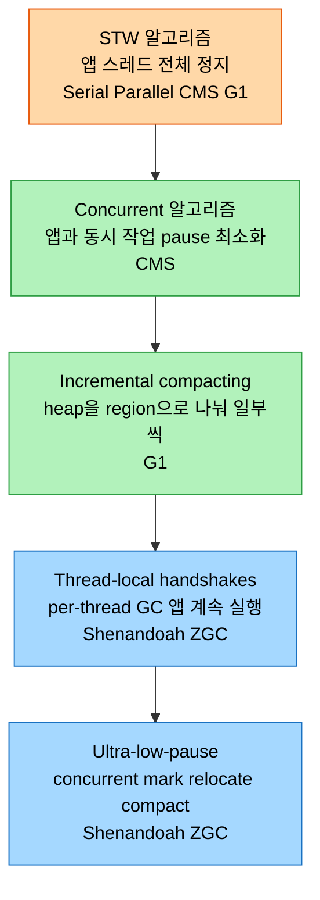
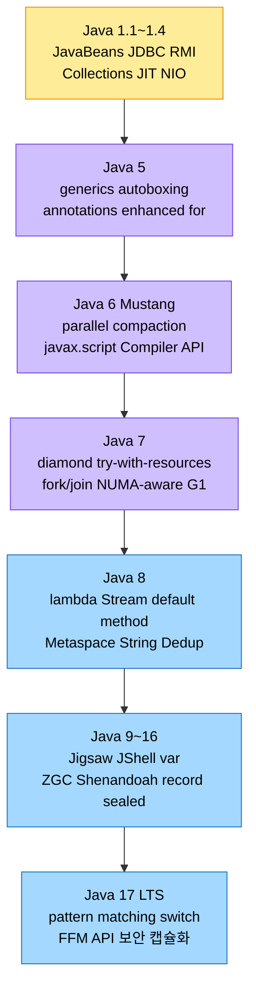

# Java와 JVM의 성능 진화사

## 1. 들어가며 — 왜 진화의 맥락을 보는가

> HotSpot VM의 최적화 전략과 GC 알고리즘은 진공에서 나오지 않았다. 언어가 새 기능을 들일 때마다 VM은 그 기능을 효율적으로 실행하려 실행 전략을 바꿔 왔다. 진화의 맥락을 알면 개별 옵션이 *왜* 그렇게 동작하는지 이해된다.

30여 년 전 프로그래밍 언어 지형은 C와 그 객체지향 확장인 C++가 지배했다. 메인프레임에서 미니컴퓨터로 컴퓨팅이 옮겨가던 시기였고, Unix에 적합한 C와 클래스로 객체지향 설계를 들여온 C++가 그 변화의 선두에 있었다.

그러나 마이크로컨트롤러·마이크로컴퓨터처럼 더 특화되고 저렴한 시스템으로 산업이 이동하면서 새로운 난제가 생겼다. 애플리케이션의 코드 줄 수가 부풀었고, 소프트웨어를 여러 플랫폼으로 "포팅"하는 일이 절박해졌다. 타깃마다 재작성하거나 크게 고쳐야 했는데, 이는 노동집약적이고 오류가 잦은 과정이었다. 정적 라이브러리 의존성 관리와 임베디드용 경량 소프트웨어 요구도 C++가 채우지 못한 빈자리였다.

이 배경에서 1990년대 중반 Java가 등장했다. "한 번 작성하면 어디서나 실행된다(write once, run anywhere)"를 내걸었지만, Java는 언어만이 아니었다. 가상 머신(JVM), 클래스 라이브러리, 도구 일습을 갖춘 자체 런타임 환경을 함께 들고 나왔고, 이 전체 생태계가 JDK다. 왜 이 구조가 포팅 문제를 풀었나. 환경마다 애플리케이션을 고치는 대신, 해당 환경용 JVM만 있으면 같은 bytecode가 실행되기 때문이다.

1990년대 인터넷이 떠오르며 웹 페이지는 Java applet으로 상호작용성을 얻었다. applet은 브라우저 안에서 도는 작은 애플리케이션으로 실시간 경험을 줬다. applet은 플랫폼 독립적이면서 "보안"을 표방했는데, 여기서 보안의 출발점이 메모리 직접 접근 금지다. 그래서 Java는 자체 메모리 관리 체계인 가비지 컬렉터(GC)를 도입했다.

> Note — 이 책에서 GC는 자동 메모리 관리 *과정*(garbage collection)과 그 과정을 수행하는 JVM 내부 *모듈*(garbage collector)을 모두 가리킨다. 어느 쪽인지는 문맥으로 구분한다.

실행물에는 Java bytecode라는 추상화 계층이 더해졌다. bytecode는 웹 서버에 상주하다 페이지 렌더링 시점에 전송돼 자체 프로세스로 실행됐다. bytecode 자체는 플랫폼 독립적이지만, 해석되고 컴파일되는 결과는 그 플랫폼의 네이티브 코드다.

## 2. JIT의 등장과 HotSpot VM

> Java 1.0~1.1은 bytecode를 해석만 했다. 1.2에서 JIT 컴파일러가 합류하며 *자주 실행되는 코드에만 최적화 비용을 쓰는* HotSpot VM이 등장했다. "모든 코드를 빠르게"가 아니라 "hot 코드만 빠르게"가 핵심 전환이다.

JDK에는 Java 코드를 bytecode로 번역하는 컴파일러가 있고, bytecode는 JRE가 다루는 실행물이다. 환경이 달라져도 런타임만 갱신하면 됐다. JVM과 GC가 실행 엔진 역할을 했는데, Java 1.0과 1.1에서는 bytecode를 네이티브로 해석만 했을 뿐 동적 컴파일이 없었다.

곧 Java가 더 빨라야 한다는 점이 드러났다. 그래서 Java 1.2에서 just-in-time(JIT) 컴파일러가 도입됐다. JVM과 결합한 JIT는 hot method와 loop-back branch count를 기준으로 동적 컴파일을 제공했고, 이 새 VM이 Java HotSpot VM이다. 핵심 아이디어는 *모든* 코드를 똑같이 빠르게 만들지 않고, 자주 실행되는 코드에만 최적화 비용을 쓴다는 것이다.

## 3. HotSpot 실행 엔진 — 해석에서 최적화까지

> HotSpot은 해석 모드로 시작해, 자주 도는 코드를 점점 더 공격적으로 컴파일하고, 가정이 깨지면 다시 되돌린다. 이 적응 과정이 실행 엔진의 골격이다.

HotSpot은 혼합 모드(mixed-mode)로 실행한다. VM은 해석 모드로 시작하며, bytecode를 기술 테이블 기반으로 네이티브 코드로 바꾼다. 이때 각 bytecode 명령어에 대응하는 네이티브 코드 템플릿을 담은 룩업 테이블이 TemplateTable이다. 실행 코드는 CodeCache에 저장되는데, CodeCache는 네이티브 코드 저장소이자 JIT 컴파일된 코드의 캐시다.

### 성능 critical 메서드 식별

성능 엔지니어링의 핵심은 performance-critical 메서드를 찾아 최적화하는 일이다. 자주 실행되거나 성능에 민감한 메서드가 JIT의 최대 수혜를 본다. 적절한 자료구조·알고리즘 선택만이 아니라, 호출 빈도·크기와 복잡도·가용 시스템 자원을 함께 보고 식별한다.

책의 `BookProgress` 예제가 이를 보여준다. 책 한 권을 챕터로 나눠 챕터별 전체 페이지 수와 작성된 페이지 수를 추적하는데, `Main`은 9개 챕터에 각 100페이지를 두고 라운드로빈으로 2페이지씩 50회 갱신한다. 이때 `getProgress`와 `updateProgress`가 빈번히 호출되므로 performance-critical로 식별되고, HotSpot 최적화의 우선 후보가 된다.

### Interpreter와 JIT, 그리고 OSR

HotSpot interpreter는 TemplateTable로 bytecode를 네이티브로 바꾼다. 해석은 적응 최적화의 첫 단계이자 가장 느린 실행 형태다. 속도를 위해 HotSpot은 적응형 JIT 컴파일을 쓰는데, 성능 critical로 식별된 메서드의 템플릿 코드를 JIT 최적화 코드로 교체한다.

판단 지표는 두 가지다. method entry count와 loop-back branch count. 메서드마다 call counter가 있어, entry count가 미리 정한 값을 넘으면 그 메서드나 callee가 비동기 JIT 컴파일 대상이 된다. loop에도 각각 counter가 있는데, loop-back branch(loop-back edge)가 임계를 넘으면 그 loop만 JIT가 최적화한다. 이것이 On-Stack Replacement(OSR)다. OSR에서는 counter가 넘친 loop만 컴파일돼 실행 스택 위에서 비동기로 교체된다.

`-XX:+PrintCompilation`은 이 적응 최적화를 들여다보는 도구다. 출력은 컴파일 작업 로그이고 한 줄이 한 작업이다. 각 줄에는 JVM 시작 이후 경과 시간(ms), 작업 고유 ID, 메서드 속성 플래그(`%` OSR, `s` synchronized, `!` 예외 핸들러, `b` blocking, `n` native), tiered 레벨, 메서드 FQN이 담기고, OSR이면 컴파일이 시작된 bytecode index(보통 loop 시작), 그리고 메서드의 bytecode 크기(byte)가 붙는다.

### Tiered Compilation — T0에서 T4까지

Java 7에서 도입되고 Java 8부터 기본 활성화된 tiered compilation은 여러 단계의 최적화 컴파일을 제공한다.

| 레벨 | 의미 |
|------|------|
| T0 | 해석 코드. 컴파일 없음. 여기서 시작해 T1~T3으로 이동 |
| T1 | client(C1) 모드. 메서드 호출·loop-back counter 사용 |
| T2 | C1 + 프로파일링 정보 포함(profile-guided optimization) |
| T3 | 완전히 프로파일된 코드 생성 |
| T4 | 최고 최적화. server(C2) compiler |

tiered 이전에는 server compiler가 프로파일 정보를 모으려고 interpreter를 썼다. tiered 이후에는 client 레벨에 더 빨리 도달하고, 프로파일 정보를 client 컴파일된 메서드가 스스로 생성한다. 그래서 start-up이 개선됐다.

### Client(C1)와 Server(C2) Compiler

HotSpot은 두 컴파일러를 제공한다. C1은 빠른 start-up을 노린다. JIT 임계가 낮아 빠르게 컴파일하지만 생성 코드는 덜 최적화돼 있다. C2는 더 많은 적응 최적화와 높은 성능을 노린다. counter 자체는 같지만 invocation 임계가 달라, 컴파일에 시간이 더 걸리는 대신 고도로 최적화된 코드를 만들어 long-running 애플리케이션에 유리하다. C2가 수행하는 최적화로는 메서드 호출을 본문으로 치환하는 inlining, loop 본문을 키워 검사 오버헤드를 줄이고 vectorization을 가능케 하는 loop unrolling, 결과에 영향 없는 코드를 없애는 dead code elimination, 인덱스가 경계를 넘지 않음이 보장되면 검사를 제거하는 range-check elimination이 있다.

### Segmented Code Cache

code cache는 JIT나 interpreter가 만든 네이티브 코드의 저장소다. tiered 이후에는 여러 레벨에서 모은 프로파일 정보도 여기 담기고, interpreter가 쓰는 TemplateTable도 여기 있다. 크기는 start-up에 고정되며 `-XX:ReservedCodeCacheSize`로 조정한다. Java 7 이전 기본값은 48MB였고, cache가 꽉 차면 모든 컴파일이 멈췄다.

tiered가 켜지면 문제가 커졌다. code cache가 JIT 컴파일된 메서드 내부 표현인 nmethod뿐 아니라 프로파일된 코드까지 함께 관리해야 했기 때문이다. 그래서 JDK 7u40에서 기본값이 240MB로 늘었다. 또 occupancy가 `CodeCacheMinimumFreeSpace` 임계를 넘으면 JIT가 멈추고 sweeper가 돈다. nmethod sweeper가 오래된 컴파일을 비워 공간을 회수하는데, cache가 크고 거의 차 있으면 이 sweep이 오래 걸린다.

Java 9는 code cache를 코드 타입별 영역으로 나눴다. 왜 나눴나. sweep 시간을 줄이고, 단명 코드가 장수 코드를 단편화하는 일을 막고, 동종 코드를 한데 모아 하드웨어 instruction cache miss를 줄이기 위해서다. 현재 구현은 세 영역이다.

| 영역 | 내용 | 크기 옵션 |
|------|------|-----------|
| Non-method code heap | VM 내부 자료구조(TemplateTable 등). Java 메서드 아님 | `-XX:NonMethodCodeHeapSize` |
| Non-profiled nmethod | 프로파일 없이 JIT된 메서드. 완전 최적화·장수 | `-XX:NonProfiledCodeHeapSize` |
| Profiled nmethod | 프로파일 포함. 덜 최적화·transient. 재컴파일되며 non-profiled로 이동 가능 | `-XX:ProfiledCodeHeapSize` |

앞으로는 AOT 컴파일 코드나 하드웨어 accelerator용 코드 같은 이종 코드 영역을 더 수용하고, 고정 크기를 적응형 resizing으로 바꿔 메모리 낭비를 줄이려는 방향이다(JEP 197).

### Deoptimization — 되돌릴 수 있어야 공격적으로 최적화한다

적응 최적화는 해석 코드를 컴파일 코드로 바꾸거나 스택에 최적화된 loop를 끼워 넣는다. "해석 → 컴파일 → 다시 해석" 같은 실행 순서가 가능하다는 뜻이다. 더 큰 장점은 반대 방향, 곧 deoptimization이다. 컴파일된 코드가 다시 해석으로 돌아가거나, 고도로 최적화된 코드가 덜 최적화된 코드로 롤백될 수 있다.

dynamic deoptimization은 더 이상 유효하지 않은 코드를 회수한다. 동적 클래스 로딩 시 상호 의존성을 확인할 때, polymorphic call site를 다룰 때, 덜 최적화된 코드를 회수할 때가 대표 사례다. deopt는 먼저 코드를 "not entrant"로 만들고, "zombie"로 마킹한 뒤 회수한다.

첫째 시나리오는 클래스 로딩·언로딩이다. `Car`가 drive mode에 `DriverLicense`를 요구하고 JIT가 둘의 상호작용을 최적화했다고 하자. 운전 규정이 바뀌어 새 버전의 `DriverLicense`가 로드되면 기존 컴파일 코드는 무효가 된다. 그래서 deopt로 해석 모드나 덜 최적화된 상태로 돌아가 새 버전을 쓴다.

둘째는 polymorphic call site다. 추상 `DriverLicense`의 `drive()`를 `AdultLicense`·`TeenPermit`·`SeniorLicense`가 각자 오버라이드한다. 처음 `AdultLicense` 하나만 호출되면 HotSpot은 call site를 monomorphic으로 최적화하고, inline cache(call site의 타입 프로파일을 추적하는 구조)에 타깃 메서드 주소를 캐싱한다. 무작위로 두 타입을 호출하면 bimorphic dispatch로, 세 타입이면 megamorphic dispatch로 전환된다. 여기까지는 deopt가 필요 없고, virtual dispatch 횟수를 줄여 오히려 성능이 오른다. 그러나 `InternationalLicense` 같은 새 서브클래스를 추가해 call site를 바꾸면, VM이 가진 타입 프로파일 정보가 낡았기 때문에 deopt가 일어나 새 타입을 처리하도록 전환된다.

## 4. HotSpot GC — 메모리 관리 단위

> GC는 세 축을 동시에 노린다. 응답성, 처리량, 발자국. 어느 축을 우선하느냐가 컬렉터 선택을 가른다.

GC는 HotSpot 실행 엔진의 핵심 구성요소다. HotSpot은 여러 GC 알고리즘을 제공하며 세 가지 성능 축을 겨냥한다. 응답성(responsiveness)은 자극을 보낸 뒤 응답을 받기까지의 시간이고, 처리량(throughput)은 초당 수행 가능한 연산 수이며, 발자국(footprint)은 가용 공간에 담을 데이터·객체량을 최적화하는 것과 중복 정보를 없애 공간을 아끼는 것 둘 다를 뜻한다.

진화의 맥락에서 볼 점은, GC 알고리즘이 STW 일변도에서 시작해 concurrent·incremental을 거쳐 ultra-low-pause까지 *일시 정지를 줄이는 방향*으로 한 줄기로 진화해 왔다는 것이다. 그 진화 단계를 한 그림으로 보면 이렇다.

각 단계의 알고리즘 상세 — 마크-스윕/카피/컴팩트, 단편화의 두 갈래(internal·external), 약한 세대 가설과 Eden→Survivor→Old 승격, write barrier로 푸는 세대 간 참조 — 는 본 책(《밑바닥까지 파헤치기》)의 2부 정독 노트에 이미 깊이 다뤘으므로 여기서는 *진화의 흐름*만 짚고 위임한다. 마크-스윕/카피/컴팩트와 약한 세대 가설은 [02-04 가비지 컬렉션 알고리즘](../ch02_automatic-memory-management/02-04.%EA%B0%80%EB%B9%84%EC%A7%80%20%EC%BB%AC%EB%A0%89%EC%85%98%20%EC%95%8C%EA%B3%A0%EB%A6%AC%EC%A6%98.md)에서, Serial·Parallel·CMS·G1 클래식 컬렉터는 [02-06 클래식 가비지 컬렉터](../ch02_automatic-memory-management/02-06.%ED%81%B4%EB%9E%98%EC%8B%9D%20%EA%B0%80%EB%B9%84%EC%A7%80%20%EC%BB%AC%EB%A0%89%ED%84%B0.md)에서, Shenandoah·ZGC의 thread-local handshake와 동시 정리는 [02-07 저지연 가비지 컬렉터](../ch02_automatic-memory-management/02-07.%EC%A0%80%EC%A7%80%EC%97%B0%20%EA%B0%80%EB%B9%84%EC%A7%80%20%EC%BB%AC%EB%A0%89%ED%84%B0.md)에서 정독한다. 한 가지만 시간 축으로 덧붙이면 — Java 7u4에서 G1이 첫 incremental collector로, Shenandoah(JDK 12)·ZGC(JDK 11)가 ultra-low-pause 컬렉터로 차례로 합류했고, JDK 17 기준으로 둘은 아직 single-generational이며 generational화 작업이 진행 중이다.

### GC 스레드 구성과 graceful degradation

GC를 *몇 개의 스레드로* 돌릴지는 처리량·일시 정지·CPU 점유의 균형을 가른다. parallel 스레드(`-XX:ParallelGCThreads`)는 STW 구간을 나눠 처리하고, concurrent 스레드(`-XX:ConcGCThreads`)는 애플리케이션과 동시에 돈다. concurrent 컬렉터가 할당 속도를 못 따라가는 "losing the race" 상황에서는 graceful degradation이 STW fallback이나 할당 throttling으로 정합성을 지킨다. 이 운영 갈래는 ch02 흡수 노트 [02-11 GC 스레드 구성과 graceful degradation](../ch02_automatic-memory-management/02-11.GC%20%EC%8A%A4%EB%A0%88%EB%93%9C%20%EA%B5%AC%EC%84%B1%EA%B3%BC%20graceful%20degradation.md)에서 상세히 다룬다.

## 5. 언어와 생태계의 진화 — Java 1.1에서 17까지

> 언어가 들인 기능 하나하나가 VM에 숙제를 남겼다. generics는 타입 안전을, lambda·Stream은 데이터 처리 최적화를, 모듈 시스템은 start-up 개선을 끌어냈다.

Java 5(J2SE 5.0)는 언어의 첫 큰 정련이다. generics가 타입별 코드를 단일 클래스로 재사용하게 하고 컴파일 타임 타입 안전성을 도입했으며, 명시적 캐스팅을 암묵으로 바꿨다. autoboxing/unboxing은 primitive와 그 wrapper 클래스의 관계를 컴파일러가 이해해 자동 변환하는 기능이다. enhanced for(for-each)는 인덱스나 iterator 없이 배열·컬렉션을 순회하게 했고, annotations는 코드에 메타데이터를 붙여 `@Override`·`@Deprecated`·`@SuppressWarnings`처럼 쓰게 했다. GC 쪽에서는 GC ergonomics라는 용어가 이때 생겨, server-class 머신의 기본 컬렉터를 Parallel GC로 정하고 heap 크기를 자동으로 잡았다. 다만 이 시기 Parallel GC는 old의 parallel compaction이 없어 young만 parallel scavenge하고 old는 serial MSC를 썼다.

Java 6(Mustang)은 주로 API를 늘렸고, old generation compaction에 다수 GC worker를 동원하는 parallel compaction을 들여 GC 시간을 줄였다. Java 7은 diamond operator로 제네릭 타입 추론을 단순화하고 try-with-resources로 자원 관리를 자동화했으며, JSR 166의 fork/join framework로 작업을 재귀 분할·병합하는 병렬 처리를 제공했다. GC에서는 Parallel GC가 NUMA-aware가 됐는데, NUMA는 메모리의 물리적 근접성을 고려해 local 메모리를 non-local보다 빠르게 접근하는 구조다. NUMA-aware Parallel GC는 객체를 그것을 생성한 스레드의 프로세서 local eden에 두고, survivor와 old는 page interleaving한다. 이는 기본값이 아니라 `-XX:+UseNUMA`로 켠다. 같은 7u4에서 예측 가능한 pause를 노린 G1 GC가 도입됐다.

Java 8은 lambda expression으로 함수형 스타일을, Stream API로 컬렉션 데이터 처리를, interface default method로 기존 구현을 깨지 않는 메서드 추가를 가능케 했다. JVM에서는 PermGen을 제거하고 native memory에 위치한 Metaspace로 대체해 메모리 누수와 수동 튜닝 문제를 덜었다. JDK 8u20에서는 G1 전용 String Deduplication이 들어와, 불변 String의 중복을 GC cycle에 스캔해 단일 canonical 인스턴스 참조로 교체함으로써 heap과 GC pause를 줄였다.

Java 9부터 17까지의 흐름은 모듈화와 새 GC가 주도한다. Java 9는 Project Jigsaw로 모듈 시스템을, JShell로 REPL을 들였고, AArch64 포트를 더했으며 릴리스 주기를 6개월로 바꿨다. Java 10은 `var`로 지역 변수 타입 추론을, Java 11(LTS)은 no-op인 Epsilon GC와 저지연 ZGC, 새 HTTP Client API를 들였다. Java 12는 Shenandoah GC와 switch expression(preview)을, Java 13은 text blocks와 ZGC uncommit을, Java 14는 instanceof 패턴 매칭과 G1 NUMA-aware 할당을 더했다. Java 15는 서브클래스를 제한하는 sealed class와 런타임에 이름으로 찾을 수 없는 hidden class를, Java 16은 불변 데이터 클래스인 record와 Windows/AArch64 포트(JEP 388), ZGC의 concurrent thread-stack processing(JEP 376)을 들였다.

Java 17(LTS)은 JVM·보안·언어를 두루 손봤다. JEP 356의 향상된 난수 생성기, JEP 391의 macOS/AArch64 포트, 그리고 보안 쪽으로 JEP 403의 JDK 내부 강한 캡슐화와 JEP 415의 context별 역직렬화 필터가 들어왔다. 언어로는 JEP 406의 switch 패턴 매칭(preview)과 JNI를 대체하려는 JEP 412의 Foreign Function and Memory API(Incubator)가 추가됐다. 동시에 Applet API(JEP 398)와 Graal 기반 실험적 AOT/JIT(JEP 410)가 제거되고, Java 1.0부터 있던 Security Manager가 폐기 예정(JEP 411)으로 표시됐다. 저자는 Java 17을 견고하고 고성능인 애플리케이션 개발의 강력한 선택지로 평한다.

## 6. 면접 대비 요약

> HotSpot 실행 엔진(혼합 모드·tiered·deopt)과 GC 세 축을 면접 답변 길이로 압축한다. 자답이 막히면 §1~§5와 ch02 GC 노트로 돌아가 다시 인코딩한다.

### 한 줄 정의

HotSpot VM은 bytecode를 해석으로 시작해, 자주 실행되는 코드를 tiered compilation(T0~T4, C1·C2)으로 점점 공격적으로 컴파일하고, 가정이 깨지면 deoptimization으로 되돌리는 적응형 실행 엔진이다.

### 핵심 포인트 3가지

1. **혼합 모드와 적응 최적화** — 해석(TemplateTable)으로 시작해 method entry count와 loop-back branch count로 hot 코드를 식별하고, loop는 OSR로 교체한다. tiered compilation은 client(C1) 레벨에 빨리 도달해 프로파일을 모으고 server(C2)에서 고최적화한다.
2. **되돌릴 수 있는 최적화** — deoptimization은 클래스 재로딩이나 polymorphic call site의 타입 프로파일이 낡았을 때 컴파일 코드를 not entrant→zombie로 회수한다. 되돌릴 수 있어야 공격적으로 최적화할 수 있다.
3. **세 축을 노리는 GC** — 응답성·처리량·발자국을 두고 Serial/Parallel/CMS/G1/Shenandoah/ZGC가 STW·concurrent·incremental·ultra-low-pause로 갈린다. 약한 세대 가설(대부분 단명)이 generational 설계의 근거다.

### 면접에서 받을 만한 질문

1. OSR이 일반 JIT 컴파일과 다른 점은 무엇이고 언제 일어나는가?
2. tiered compilation에서 T2와 T3의 차이, 그리고 tiered 도입 전후로 프로파일 정보를 누가 모았는지 설명하라.
3. code cache를 Java 9가 세 영역으로 나눈 이유는 무엇인가?
4. deoptimization이 일어나는 두 시나리오와, monomorphic→megamorphic 전환에 deopt가 필요 없는 이유를 설명하라.
5. 약한 세대 가설의 두 특성과, 그중 generation 유지 비용을 write barrier가 어떻게 푸는지 말하라.

## 정답 (자답 후 펼치기)

### 정답 1 — OSR

OSR(On-Stack Replacement)은 메서드 전체가 아니라 *loop 하나*를 대상으로 한다. 메서드 entry count가 아니라 loop-back branch counter가 임계를 넘을 때 발동하며, counter가 넘친 그 loop만 컴파일돼 실행 스택 위에서 비동기로 교체된다. 오래 도는 loop를 메서드 호출이 끝날 때까지 기다리지 않고 즉시 최적화하려는 장치다.

### 정답 2 — T2 vs T3, 프로파일 수집 주체

T2는 C1 컴파일에 프로파일링 정보를 포함한(profile-guided) 단계이고, T3는 완전히 프로파일된 코드를 생성하는 단계다. tiered 도입 전에는 server compiler가 프로파일을 모으려고 interpreter를 썼지만, 도입 후에는 client 컴파일된 메서드가 스스로 프로파일을 생성한다. 그 덕에 client 레벨에 더 빨리 도달해 start-up이 좋아진다.

### 정답 3 — code cache 분할 이유

세 가지다. sweep 시간을 줄이고, 단명 코드가 장수 코드를 단편화하는 것을 막고, 동종 코드를 한곳에 모아 하드웨어 instruction cache miss를 줄이기 위해서다. 영역은 Non-method code heap(TemplateTable 등), Non-profiled nmethod(완전 최적화·장수), Profiled nmethod(덜 최적화·transient)로 나뉜다.

### 정답 4 — deopt 시나리오와 megamorphic 전환

deopt는 ① 새 버전 클래스가 로드돼 기존 컴파일 코드가 무효가 될 때, ② 새 서브클래스 추가로 call site의 타입 프로파일이 낡았을 때 일어난다. 반면 monomorphic→bimorphic→megamorphic 전환은 deopt가 필요 없다. 이는 같은 call site에서 관측된 타입 수가 늘어 dispatch 방식을 바꾸는 것일 뿐, 기존 가정이 *틀린* 게 아니라 *확장*되는 것이기 때문이다. 가정이 깨지는 것은 inline cache에 없던 새 타입이 들어올 때다.

### 정답 5 — 약한 세대 가설과 write barrier

두 특성은 most objects die young(장수만 승격해 장수 데이터셋을 작게 유지)과 generation 유지 비용이다. young collector가 old와 따로, 더 자주 돌며 live data를 옮기는데, 이때 old에서 young을 가리키는 세대 간 참조를 놓치면 살아 있는 객체를 garbage로 오인할 수 있다. write barrier가 이 세대 간 참조를 기록·추적해, young만 수집할 때도 도달 가능한 객체를 모두 마킹하도록 보장한다.

## 관련 문서

- [`../ch03_class-loading-mechanism/00-개관.JDK 구조와 바이트코드`](../ch03_class-loading-mechanism/00-개관.JDK%20구조와%20바이트코드.md) — JDK/JRE/JVM 구성과 bytecode의 플랫폼 독립성
- [`../ch04_compilation-optimization/02-04.컴파일러 최적화 — 공통식 제거·경계 검사 제거와 Graal`](../ch04_compilation-optimization/02-04.컴파일러%20최적화%20—%20공통식%20제거·경계%20검사%20제거와%20Graal.md) — JIT·Graal·AOT 백엔드 최적화 (프런트엔드 javac는 같은 폴더 01-01)
- [`../ch02_automatic-memory-management/02-01.GC 운영 — 로그와 튜닝`](../ch02_automatic-memory-management/02-01.GC%20운영%20—%20로그와%20튜닝.md) — GC 로그·jstat·튜닝 실무
- [`../ch02_automatic-memory-management/02-04.가비지 컬렉션 알고리즘`](../ch02_automatic-memory-management/02-04.가비지%20컬렉션%20알고리즘.md) — 마크-스윕/카피/컴팩트와 약한 세대 가설 정독 (본 노트 §4가 위임하는 알고리즘 상세)
- [`../ch02_automatic-memory-management/02-06.클래식 가비지 컬렉터`](../ch02_automatic-memory-management/02-06.클래식%20가비지%20컬렉터.md) — Serial·Parallel·CMS 컬렉터 상세
- [`../ch02_automatic-memory-management/02-07.저지연 가비지 컬렉터`](../ch02_automatic-memory-management/02-07.저지연%20가비지%20컬렉터.md) — Shenandoah·ZGC의 thread-local handshake와 동시 정리
- [`../ch02_automatic-memory-management/02-11.GC 스레드 구성과 graceful degradation`](../ch02_automatic-memory-management/02-11.GC%20스레드%20구성과%20graceful%20degradation.md) — 본 노트 §4 GC 스레드 구성의 흡수 정독본
- [`../README`](../README.md) — JVM 학습 인덱스
