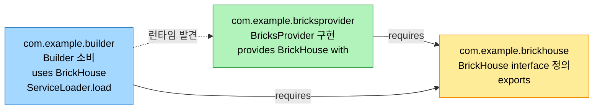
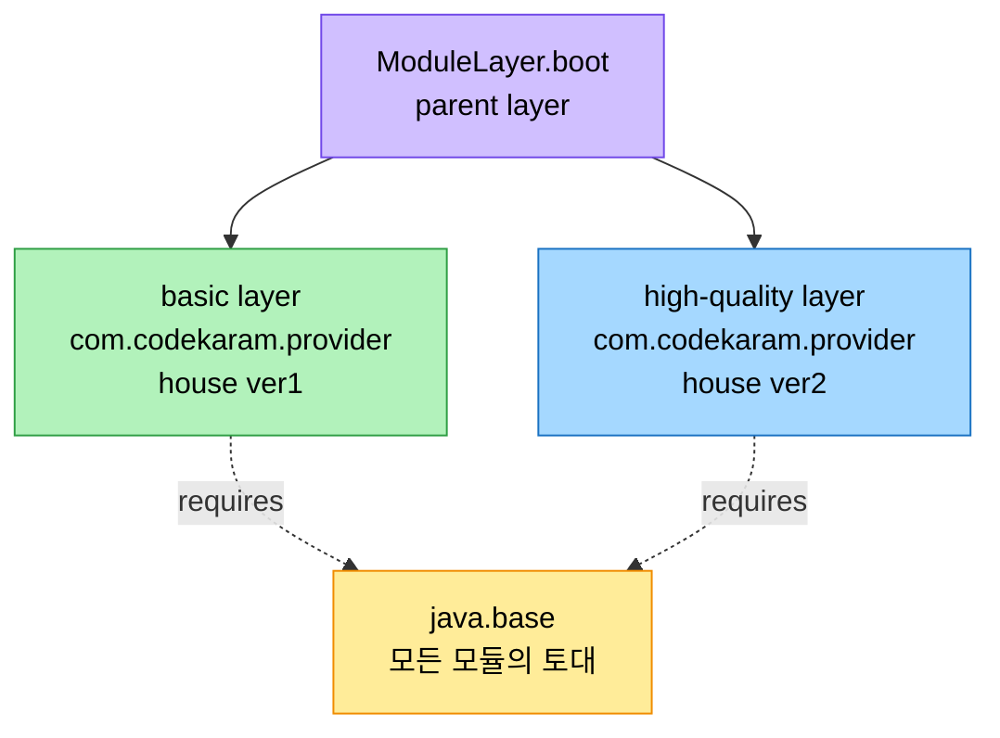

# 모놀리식에서 모듈러로 — JPMS와 모듈 시스템

## 1. 들어가며 — JDK 자신이 비대해진 문제

> 앞 장들이 Java 언어와 실행 환경의 발전을 다뤘다면, 이 장은 JDK 자체의 변혁을 본다. Java가 성숙하며 기능이 쌓일수록 JDK는 비대해졌고, JDK 9의 모듈 시스템(JPMS)이 그 모놀리식 구조를 쪼갰다.

Java가 성숙하면서 기능과 언어 레벨 강화가 쌓일 때마다 JDK도 복잡해졌다. 예컨대 J2SE 5.0의 enum 도입 하나가 `java.lang.Enum` base class, `java.lang.Class.getEnumConstants()` 메서드, `java.util` 패키지의 `EnumSet`·`EnumMap`, 그리고 Serialized Form 갱신을 함께 요구했다. 새 기능마다 꼼꼼한 통합과 견고한 지원이 필요했다.

확장이 거듭되자 JDK는 다루기 어려워졌다. 모놀리식 구조는 메모리 footprint 증가, 느린 start-up, 유지보수·업데이트의 어려움을 안겼다. JDK 9는 그 전환점이다. Java Platform Module System(JPMS)을 도입해 Java를 모놀리식에서 더 다루기 쉬운 모듈러 구조로 옮겼고, JDK 11과 JDK 17이 그 모듈 생태계를 계속 정련했다.

JPMS의 주된 목표는 API 레벨에서 보안 위험을 관리하면서 성능을 높이는 확장형 플랫폼이었다. 모듈성이 들어오자 개발자는 애플리케이션의 필요에 맞춰 모듈을 골라 쓸 수 있게 됐다. 핵심 이점은 단순하다. 애플리케이션에 필요한 JDK 부분만 쓰면 크기가 줄고 로드 시간이 빨라진다.

## 2. 모듈이란 무엇인가

Java에서 모듈은 패키지, 리소스, 그리고 모듈을 기술하는 module descriptor(`module-info.java`)로 이뤄진 응집 단위다. 모듈은 이 요소들의 컨테이너로서 네 가지를 한다.

| 역할 | 내용 |
|------|------|
| 패키지 캡슐화 | 어느 패키지를 외부에 노출하고 어느 것을 숨길지 선언. 유지보수·보안↑ |
| 의존성 표현 | 다른 모듈에 대한 의존을 명시 선언. 배포 단순화, 문제 조기 식별 |
| 강한 캡슐화 강제 | 컴파일 타임·런타임 모두에서 캡슐화를 강제. 우발·악의적 위반이 어려움 |
| 성능 향상 | JVM이 코드 로딩·실행을 최적화 → start-up↑·메모리↓·실행↑ |

가장 단순한 예가 `com.house.brickhouse`와 `com.house.bricks` 두 모듈이다. brickhouse의 `module-info.java`는 `requires com.house.bricks; exports com.house.brickhouse;`로 의존과 노출을 선언하고, `House1`은 `Story.count(1)`로 18000을, `House2`는 `Story.count(2)`로 36000을 출력한다. bricks 모듈을 먼저 컴파일하고(`javac -d mods/com.house.bricks ...`), `--module-path mods`로 brickhouse를 컴파일한 뒤 `java --module-path mods -m com.house.brickhouse/...House1`로 실행한다.

여기에 벽돌 종류를 제공하는 `com.house.bricktypes` 모듈(`ClayBrick`, `ConcreteBrick`)을 추가하면, brickhouse의 `module-info.java`에 `requires com.house.bricktypes;` 한 줄을 더하고 `House1`이 `ClayBrick.getBricksPerSquareMeter()`를 받아 쓰는 식으로 확장된다. 모듈 시스템이 코드를 더 유연하고 유지보수하기 좋게 만든다는 점을 보여주는 예다.

## 3. 모놀리식 JDK가 남긴 문제와 JDK 11의 정련

모듈러 JDK 이전에는 JDK 비대화가 복잡하고 읽기 어려운 애플리케이션을 낳았다. 복잡한 의존성과 교차 의존성이 유지보수·확장을 가로막았고, JAR(Java Archives) hell, 곧 클래스 로딩 문제가 생겼다. 단순성이 부족한 데다 JAR이 자기가 담은 클래스를 알지 못했기 때문이다. JDK의 footprint 자체도 소형 기기처럼 전체 모놀리식 JDK가 필요 없는 상황에서 부담이었고, 모듈러 JDK가 이를 풀었다.

JPMS는 JDK 9에서 처음 도입됐고 JDK 11(JDK 8 이후 첫 LTS)이 이를 정련했다. JDK 9에서 deprecated됐던 Java EE·CORBA 모듈을 JDK 11에서 제거해 플랫폼을 가볍게 했고, 실사용 피드백으로 모듈 시스템을 성숙시켰으며, API를 다듬고 진단 메시지·에러 리포팅을 개선했다.

## 4. 모듈러 서비스 — provider와 consumer의 분리

> 모듈 시스템의 진짜 힘은 service에서 드러난다. service interface를 정의하는 모듈, 그것을 구현해 제공하는 모듈, 그것을 소비하는 모듈을 분리하면 consumer가 구체 구현을 모른 채 동작한다.

JDK의 모듈러 접근은 Java 1.6에서 도입된 service 개념을 강화한다. service interface를 제공하는 모듈을 provider 모듈에서 분리해 완전히 분리된 consumer를 만든다. 타입은 보통 interface나 abstract class로 선언하고, provider는 자기 모듈에서 명확히 식별되며, consumer 모듈이 그 provider를 사용한다.

service provider는 service interface를 구현해 다른 모듈이 소비하게 만드는 모듈이다. `com.example.bricksprovider`의 `module-info.java`는 `requires com.example.brickhouse; provides com.example.brickhouse.BrickHouse with com.example.bricksprovider.BricksProvider;`로 구현 제공을 선언한다. service consumer는 `module-info.java`에 `uses` 키워드로 필요한 service를 선언하고, `ServiceLoader` API로 구현을 발견·인스턴스화한다. `com.example.builder`는 `uses com.example.brickhouse.BrickHouse;`를 선언하고 `ServiceLoader.load(BrickHouse.class)`로 로드한 뒤 `loader.forEach(BrickHouse::build)`로 호출한다.

이 구조의 동작은 네 갈래로 나눠 보면 분명하다. `ServiceLoader.load()`가 service interface를 인자로 받아 가용 구현을 담은 iterable을 돌려주며, `module-info.java`의 정보로 구현을 발견한다. 그 인스턴스를 순회하면 API가 구현을 자동으로 인스턴스화한다. JPMS 덕에 provider 모듈은 구현 세부를 캡슐화하고 service만 노출하므로, consumer는 구체 구현에 의존하지 않는다. 새 provider를 추가하고 `module-info.java`에 선언하기만 하면 `ServiceLoader`가 자동으로 발견해 쓴다.

## 5. JAR Hell Versioning과 ModuleLayer

Java의 하위 호환성은 핵심 강점이다. 새 버전이 나와도 구버전용 애플리케이션이 소스 수정 없이, 종종 재컴파일 없이도 실행된다. 그러나 이 호환성은 source 레벨의 versioning까지 가지 않고, JPMS도 source 레벨 versioning을 도입하지 않는다. versioning은 Maven·Gradle 같은 artifact 관리 시스템이 artifact 레벨에서 다룬다. 문제는 애플리케이션이 여러 서드파티 라이브러리에 의존하고 그들이 또 다른 라이브러리의 서로 다른 버전을 의존할 때다. 같은 라이브러리의 여러 버전이 classpath에 올라가면 충돌과 런타임 에러가 난다.

애플리케이션이 `Foo`·`Bar`에 의존하고 그 둘이 `Baz`의 다른 버전을 의존하는 상황을 생각해 보자. 두 `Baz` 버전이 classpath에 있으면 런타임에 어느 버전이 쓰일지 불분명해 버전 충돌이 불가피하다. JPMS는 split package를 탐지해 이런 상황을 금지하는데, 이는 "reliable configuration"이라는 목표를 떠받친다. JPMS에서 split package는 허용되지 않는다.

다만 JPMS는 versioning 문제를 조기에 탐지할 뿐 해결법을 권고하지는 않는다. 충돌 라이브러리의 최신 버전을 쓰는 방법이 있지만 하위 호환이 보장될 때만 가능하다. 이를 위해 JPMS는 ModuleLayer를 제공한다. 모듈 sub-graph를 격리해 설치하는 기능으로, 충돌 라이브러리의 서로 다른 버전을 별도 layer에 두면 둘 다 로드된다. parent layer에서 child layer의 모듈을 직접 접근할 수는 없지만, child layer 모듈에 service provider를 구현하면 parent layer가 간접적으로 쓸 수 있다.

이 개념을 house provider로 확장하면, `com.codekaram.provider`에 basic·high-quality 두 구현을 두고 basic을 house 라이브러리 v1, high-quality를 v2로 본다. Java SE 9 문서의 샘플을 따르면 `ModuleFinder.of(dir)`로 모듈을 찾고, `ModuleLayer.boot()`를 parent로 삼아 `parent.configuration().resolve(...)`로 설정을 해석한 뒤 `parent.defineModulesWithOneLoader(cf, scl)`로 새 layer를 만든다. `getProviderLayer()`에 basic·high-quality 디렉토리를 넘기면 각각의 layer가 생기고, `doWork()`가 각 layer에서 `ServiceLoader.load(moduleLayer, BricksProvider.class)`로 provider를 로드해 "I am the basic provider", "I am the high-quality provider"를 출력한다. 레벨 1·2까지 곱하면 ver1.b·ver1.hq·ver2.b·ver2.hq 네 조합이 되고, high-quality 2레벨에는 budget 제약 체크를 넣어 "over my budget"을 출력하게 할 수도 있다. module layer로 service의 다른 구현을 다른 부분에 영향 없이 동적으로 로드·언로드할 수 있다는 점이 핵심이다.

## 6. OSGi와의 비교

OSGi(Open Services Gateway Initiative)는 Jigsaw와 module layer보다 훨씬 앞선 2000년부터 있던 대체 모듈 시스템이다. 당시 Java에 빌트인 표준 모듈 시스템이 없어 OSGi는 모듈성 문제를 Jigsaw와 다르게 풀었다. 성숙하고 널리 쓰이는 프레임워크로, 런타임에 모듈(bundle)을 앱 재시작 없이 생성·갱신·제거하는 동적 컴포넌트 모델을 제공한다.

둘은 닮은 점이 많다. 컴포넌트를 명확히 분리해 모듈성을 촉진하고, 모듈/bundle의 동적 로드·언로드를 지원하며, service 추상화(module layer는 `ServiceLoader`, OSGi는 자체)로 느슨한 결합을 제공한다.

| 축 | OSGi | Java module layer |
|----|------|-------------------|
| 성숙도 | 더 성숙·검증, 풍부한 생태계·툴 | JDK 9 도입, 비교적 신규 |
| 통합 | Java 위에 구축한 별도 프레임워크 | Java 플랫폼의 일부(네이티브) |
| 복잡도 | 더 복잡, 가파른 학습 곡선 | 더 직관적 |
| 런타임 | OSGi container 안에서 실행 | Java 플랫폼에서 직접 실행 |
| versioning | 다중 버전 빌트인 지원(uses constraints) | 네이티브 미지원, 버전별 layer로 유사 구현 |
| 강한 캡슐화 | reflection 접근은 special security manager 없으면 가능 | first-class라 미export 무단 접근 시 reflection에도 에러 |

선택은 이분법이 아니라 프로젝트 요구·기술 스택·팀 친숙도에 달렸다. 다중 버전 지원과 동적 컴포넌트 모델이 필요한 복잡한 애플리케이션이면 OSGi가, 직관성과 강한 캡슐화 그리고 Java 내장이라는 점이 중요하면 module layer가 낫다.

## 7. 모듈러 도구 — jdeps, jdeprscan, jmod, jlink

모듈러 애플리케이션의 개발·배포를 돕는 네 도구가 있다.

`jdeps`는 클래스나 패키지의 의존성을 분석한다. JAR용 module file을 만들 때 유용하고 regex 필터를 쓸 수 있다. `jdeps ...loadLayers.class`는 `java.base` 의존과 미발견 의존을 패키지 단위로 보여주며(`-verbose:package`와 동일), `-v`는 클래스 단위로 모든 의존을 나열한다.

`jdeprscan`은 모듈에서 deprecated API 사용을 분석한다. deprecated API는 새 것으로 대체됐으나 아직 지원되며 향후 제거가 예고된 구 API다. `jdeprscan --for-removal`은 제거 예정 API를, `--list`는 모든 deprecated API를 찾아 대안 전환을 돕는다.

`jmod`는 JMOD 파일을 만들고 기술하고 나열한다. JMOD는 JAR의 대안으로 native code·config file 같은 추가 기능을 담으며, 배포나 jlink의 커스텀 런타임 이미지 생성에 쓰인다. `jmod create --class-path ...`로 만들고 `jmod describe`로 module descriptor를, `jmod list`로 내용을 본다.

`jlink`는 모듈과 그 전이 의존을 링크해 커스텀 모듈러 런타임 이미지를 만든다. 전체 JRE 없이 패키징·배포할 수 있어 애플리케이션이 가볍고 start-up이 빠르다. `jlink --module-path $JAVA_HOME/jmods:build/modules --add-modules com.example.builder --output consumer.services --bind-services`처럼 쓰는데, 모듈이 service consumer이면 provider와 그 의존을 링크하려고 `--bind-services`를 붙인다. 생성된 `consumer.services/bin/java -m com.example.builder/...Builder`를 실행하면 "Building a house with bricks..."가 나온다.

## 8. 면접 대비 요약

### 한 줄 정의

JPMS는 JDK 9에서 도입된 모듈 시스템으로, `module-info.java`로 패키지 캡슐화와 의존성을 명시 선언해 모놀리식 JDK를 reliable configuration과 strong encapsulation을 갖춘 모듈러 구조로 바꿨다.

### 핵심 포인트 3가지

1. **모듈 = 캡슐화 + 의존성 선언** — `exports`로 노출할 패키지를, `requires`로 의존을 명시한다. JVM이 더 적은 클래스를 로드해 start-up과 메모리 footprint가 개선된다.
2. **service로 구현을 분리** — `provides ... with`로 구현을 제공하고 `uses`로 소비하며, `ServiceLoader`가 런타임에 발견·인스턴스화한다. consumer가 구체 구현을 모른 채 동작한다.
3. **versioning은 layer로 우회** — JPMS는 split package를 금지해 버전 충돌을 조기에 막지만 source 레벨 versioning은 없다. ModuleLayer로 버전별 격리 layer를 만들어 같은 라이브러리의 여러 버전을 동시에 로드한다.

### 면접에서 받을 만한 질문

1. JAR hell이란 무엇이고 JPMS가 그것을 어떻게 다루는가?
2. `requires`·`exports`·`provides ... with`·`uses` 네 지시어의 역할을 구분하라.
3. JPMS가 source 레벨 versioning을 지원하지 않는데, 같은 라이브러리의 두 버전을 어떻게 함께 쓰는가?
4. OSGi와 Java module layer의 versioning·강한 캡슐화 차이를 설명하라.
5. jlink가 만드는 커스텀 런타임 이미지의 이점과 `--bind-services`가 필요한 이유는?

## 정답 (자답 후 펼치기)

### 정답 1 — JAR hell과 JPMS

JAR hell은 클래스 로딩 문제다. JAR이 자기가 담은 클래스를 알지 못하고 단순성이 부족해, classpath에 같은 라이브러리의 여러 버전이 올라가면 어느 것이 쓰일지 불분명해진다. JPMS는 split package를 탐지해 금지함으로써 이런 모호함을 컴파일·해석 단계에서 차단한다. 이것이 "reliable configuration" 목표다. 다만 충돌의 해결책 자체를 권고하지는 않는다.

### 정답 2 — 네 지시어

`requires`는 다른 모듈에 대한 의존을 선언한다. `exports`는 어느 패키지를 외부 모듈에 노출할지 선언한다. `provides ... with`는 service interface의 구현을 제공한다고 선언한다(provider 측). `uses`는 어떤 service를 소비한다고 선언한다(consumer 측). provider와 consumer는 `ServiceLoader`를 통해 런타임에 연결된다.

### 정답 3 — 두 버전 함께 쓰기

JPMS는 source 레벨 versioning이 없으므로 ModuleLayer를 쓴다. 충돌하는 라이브러리의 각 버전을 별도의 격리된 module layer에 설치하면 둘 다 로드된다. parent layer에서 child layer 모듈을 직접 접근하지는 못하지만, child layer에 service provider를 구현하면 parent가 `ServiceLoader`로 간접 사용할 수 있다.

### 정답 4 — OSGi vs module layer

versioning에서 OSGi는 다중 버전을 빌트인으로 지원해 같은 컴포넌트의 여러 버전을 동시에 배포·실행하지만(uses constraints로 안전한 네임스페이스 보장), module layer는 네이티브 지원이 없어 버전별 layer로 유사 기능을 만든다. 강한 캡슐화에서는 module layer가 JDK first-class라 미export 기능에 reflection으로 접근해도 에러를 내지만, OSGi는 special security manager가 없으면 reflection 접근이 가능하다. OSGi가 pre-JPMS 기능 한계로 동등한 강한 캡슐화를 주지 못했기 때문이다.

### 정답 5 — jlink와 --bind-services

jlink는 모듈과 전이 의존만 링크해 커스텀 런타임 이미지를 만들어, 전체 JRE 없이 배포할 수 있게 한다. 그래서 애플리케이션이 가볍고 start-up이 빠르며, 자원 제한 환경에 유리하다. 모듈이 service consumer일 때는 `uses`로 선언한 service의 provider가 이미지에 자동으로 포함되지 않으므로, provider와 그 의존을 함께 링크하려고 `--bind-services`를 붙인다.

## 관련 문서

- [`../ch14_jpe-evolution/01-01.Java와 JVM의 성능 진화사`](../ch14_jpe-evolution/01-01.Java와%20JVM의%20성능%20진화사.md) — Java 9 Project Jigsaw·JShell·릴리스 cadence 도입
- [`../ch15_jpe-type-system/01-01.타입 시스템의 진화와 성능`](../ch15_jpe-type-system/01-01.타입%20시스템의%20진화와%20성능.md) — 같은 책 2장, 타입 시스템 진화
- [`../ch03_class-loading-mechanism/00-개관.가상 머신 실행 서브시스템`](../ch03_class-loading-mechanism/00-개관.가상%20머신%20실행%20서브시스템.md) — 클래스 로딩 메커니즘과 java.base
- [`../README`](../README.md) — JVM 학습 인덱스
