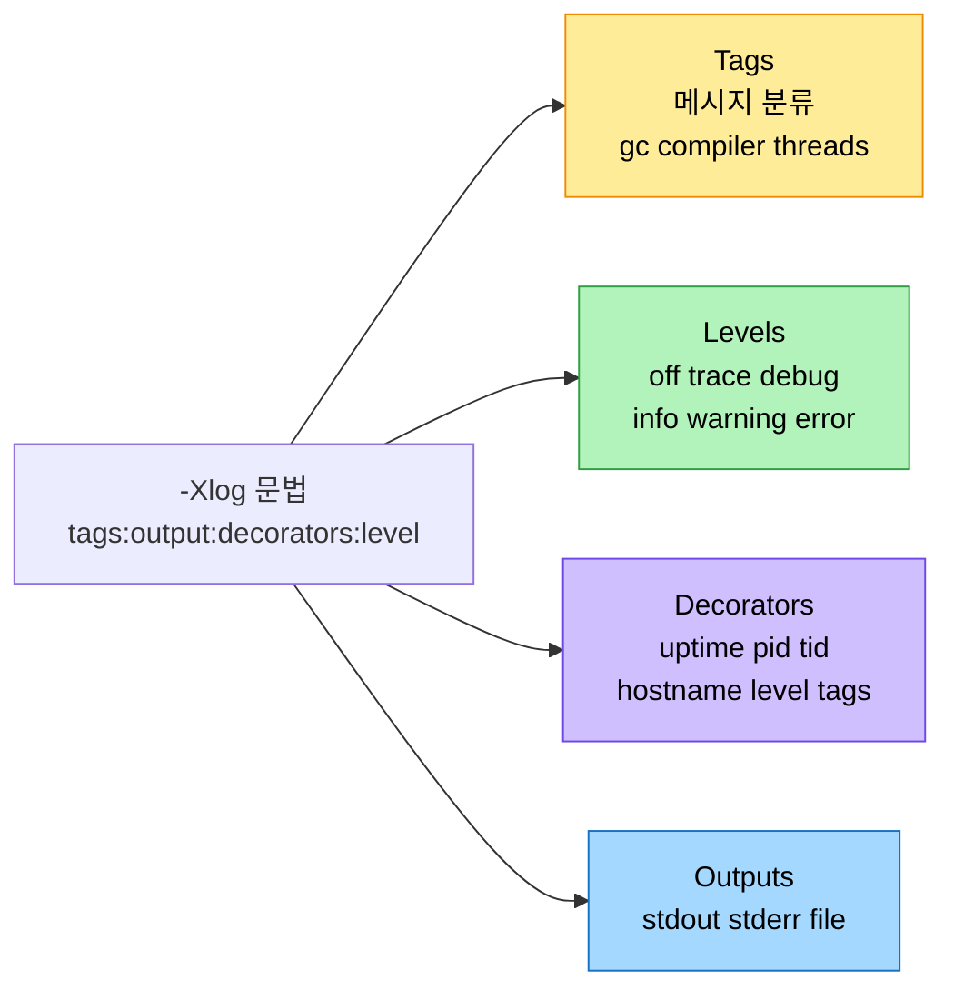
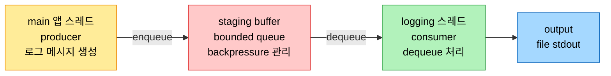

# 통합 JVM 로깅 — Xlog와 비동기 로깅

## 1. 들어가며 — 분절된 로깅을 하나로

> JDK 9 이전에는 GC·컴파일·락 정보를 보려면 `-XX:+PrintGCDetails`, `-XX:+PrintCompilation` 같은 옵션을 따로따로 조합해야 했다. JEP 158이 이를 `-Xlog` 하나로 통합하면서, tag·level·decorator·output이라는 일관된 축으로 모든 JVM 로그를 다루게 됐다.

HotSpot VM은 명령행 옵션으로 실험·진단 기능을 켜고 VM·GC 활동을 들여다본다. 빌드는 성능에 최적화돼 production에 쓰이는 product build가 기본이고, 그 외에 fast-debug와 slow-debug 두 변형의 debug build가 있다. asserts를 켠 fast-debug는 최소 오버헤드로 추가 디버깅을 제공해 개발 환경에 적합하고, slow-debug는 종합 도구와 체크를 담아 네이티브 디버거로 심층 분석할 때 쓰되 성능 trade-off가 크다.

JDK 9 이전에는 로깅 인터페이스가 분절돼 통합돼 있지 않았다. 적절한 타임스탬프와 컨텍스트를 담은 상세 로그를 얻으려면 여러 print 옵션을 조합해야 했다. GC 타임스탬프는 `-XX:+PrintGCTimeStamps`, GC 상세는 `-XX:+PrintGCDetails`, 컴파일 레벨은 `-XX:+PrintCompilation`, inlining은 `-XX:+PrintInlining`처럼 옵션이 흩어져 있었고, 각 옵션을 외우고 그 정보가 info·debug·tracing 중 어느 레벨인지 판단하기가 어려웠다. 그래서 JDK 9에 JEP 158: Unified JVM Logging이, 이어 GC 활동을 위한 JEP 271: Unified GC Logging이 도입됐다.

## 2. 네 가지 구성요소 — tag·level·decorator·output

통합 로깅은 모든 JVM 로깅에 일관된 인터페이스를 준다. 모든 로그 메시지를 tag로 특성화해, 조사 수준에 맞는 정보를 error·warning에서 info·trace·debug까지 요청할 수 있다. 활성화는 `-Xlog` 옵션으로 한다. 아무 옵션도 주지 않으면 warning과 error만 stderr로 가는데, 이 기본 설정을 풀어 쓰면 `-Xlog:all=warning:stderr:uptime,level,tags`이고 여기서 `all`은 모든 tag의 alias다.



네 구성요소의 역할은 이렇다. tag는 로그 메시지를 분류하며 각 메시지에 하나 이상 붙어 필터·검색을 쉽게 한다. level은 심각도를 정하며 debug·error·info·off·trace·warning 여섯이다. decorator는 타임스탬프·프로세스 ID 같은 추가 컨텍스트를 붙인다. output은 stdout·stderr·file 같은 기록 대상이다. 이 시스템은 GC 활동, JIT 컴파일 이벤트, 시스템 자원 사용 같은 성능 지표를 들여다보게 해, 개발자가 잠재 성능 이슈를 식별하고 선제 조치하도록 돕는다.

## 3. Tag — 영역별로 로그를 골라 본다

tag는 로그 메시지를 분리·식별하는 핵심으로, 각 tag가 특정 시스템 영역이나 연산 타입에 대응한다. `gc`(가비지 컬렉션), `thread`(스레드 연산), `class`(클래스 로딩), `cpu`, `os` 등 수십 개가 있다. `all`은 모든 tag 조합을 매치하며, `-Xlog`는 `-Xlog:all`과 같아 모든 메시지를 info 레벨로 stdout에, warning·error는 stderr로 보낸다.

옵션 없이 `-Xlog`만 쓰면 시스템 전반에서 대량의 메시지가 쏟아지므로, 관심 영역은 tag로 좁힌다. 가비지 컬렉션이 궁금하면 JDK 17에서 `java -Xlog:gc* LockLoops`를 쓴다.

```
[0.006s][info][gc] Using G1
[0.007s][info][gc,init] Version: 17.0.8+9-LTS-211 (release)
[0.007s][info][gc,init] CPUs: 16 total, 16 available
[0.057s][info][gc,metaspace] Compressed class space mapped at: ...
```

멀티스레딩이 무거운 애플리케이션이면 `java -Xlog:thread* LockLoops`로 스레드 연산 로그를 본다. 다만 tag를 켜도 기대한 메시지가 안 나올 때가 있다. `-Xlog:monitorinflation*`는 info 레벨에서 출력이 빈약한데, 이럴 때는 로그 레벨을 조정해야 한다.

## 4. Level과 Decorator, 그리고 Output

> level은 계층적이다. trace로 켜면 그 아래 모든 레벨이 함께 나온다. decorator는 어느 스레드·어느 시각의 로그인지 맥락을 붙이고, output은 그 로그를 어디로 보낼지 정한다.

### Level — 정보의 양

`-Xlog:help`로 확인하면 레벨은 off·trace·debug·info·warning·error다. off는 로깅을 끄고, error는 치명적 이슈, warning은 주의가 필요한 잠재 이슈, info는 일반 정보, debug는 트러블슈팅용 상세, trace는 step-by-step이 필요할 때 쓰는 가장 verbose한 레벨이다. tag에 레벨을 안 주면 기본은 info다. 앞서 정보가 빈약했던 `monitorinflation`을 `java -Xlog:monitorinflation*=trace LockLoops`로 명시하면 락에 대한 상세가 나온다.

레벨은 계층적이라 trace로 설정하면 debug·info·warning·error의 메시지가 모두 포함된다. 그래서 종합적인 출력이 잡히며, 같은 로그 안에서 trace와 debug 레벨이 섞여 나오는 것을 볼 수 있다. 이 계층적 로깅이 요구에 맞춘 유연한 모니터링을 가능케 한다.

### Decorator — 맥락 부여

`-Xlog:help`의 decorator는 time(t)·utctime(utc)·uptime(u)·timemillis(tm)·uptimemillis(um)·timenanos(tn)·uptimenanos(un)·hostname(hn)·pid(p)·tid(ti)·level(l)·tags(tg)이고, `none`도 가능하다. 기본으로 uptime·level·tags가 선택돼 앞 예시에 그 셋이 보였다. 자주 바꿔 쓰는 것은 프로세스를 구분하는 pid, 특정 스레드를 추적하는 tid, 이벤트를 앱 타임라인과 맞추는 uptimemillis다. `java -Xlog:gc*::uptimemillis,pid,tid LockLoops`처럼 붙이면 각 줄에 uptime·pid·tid가 prefix로 붙는다.

decorator는 세 방향으로 분석을 돕는다. 타임스탬프·PID·TID를 더해 로그를 자체 완결적으로 만들고(contextual clarity), 관련 decorator로 데이터를 효과적으로 필터링하며(filtering), 시스템 여러 부분의 이벤트를 상관 지어 근본 원인 분석을 돕는다(correlation). pid는 여러 JVM이 돌 때 어느 인스턴스의 로그인지, tid는 멀티스레드 앱에서 deadlock·race condition을 진단할 때 특히 쓸모 있고, hostname은 분산 시스템에서 로그의 출처 머신을 식별한다.

### Output — 로그의 방향

output은 로그를 stdout·stderr·file 중 어디로 보낼지 정한다. 기본은 warning·error가 stderr로, info·debug·trace가 stdout으로 간다. `-Xlog` 뒤에 파일명을 주면 `java -Xlog:gc*=info:file=gclog.txt LockLoops`처럼 파일로 리다이렉트할 수 있고, 레벨마다 다른 파일로 나눌 수도 있다. 다만 파일 출력은 I/O 집약 애플리케이션에서 성능에 영향을 줄 수 있어, 이를 완화하는 비동기 로깅을 뒤에서 다룬다. 또 JVM이 log rotation을 자동으로 하지 않으므로, 장기 실행 애플리케이션은 외부 도구나 스크립트로 로그 파일 크기를 관리해야 한다.

## 5. -Xlog 실용 예와 런타임 동적 조정

`-Xlog`의 문법은 `-Xlog:tags:output:decorators:level`로, 무엇을·어디에·어떻게 기록할지 정한다. 특정 tag를 info로 켜려면 `-Xlog:gc,compiler:info`, tag마다 다른 레벨을 주려면 `-Xlog:gc=info,compiler=warning`, 파일로 보내려면 `-Xlog:gc:file=gc.log`, 타임스탬프를 붙이려면 `-Xlog:gc*:file=gc.log:time`을 쓴다. 전부 켜려면 `-Xlog:all=trace`인데 데이터가 방대하니 신중해야 하고, 끄려면 `-Xlog:off`다.

운영 환경에서는 상세 로깅과 성능 영향 사이의 균형이 중요하다. 과도한 로깅은 로그 쓰기에 자원을 써 성능을 떨어뜨리고 디스크를 소비한다. 그래서 production에서는 error·warning 같은 중요한 메시지만 남기고, 개발 단계에는 기본인 stdout을, 운영에는 아카이브와 후속 분석을 위해 file을 쓰는 편이 낫다. 통합 로깅의 강력한 기능 하나는 런타임에 레벨을 동적으로 바꾸는 것이다. 평소에는 성능을 위해 표준 로깅으로 두다가, 트래픽 급증이나 특정 패턴이 보일 때 `jcmd <pid> VM.log what=gc*=trace decorators=uptimemillis,tid,hostname`으로 레벨을 임시로 올리고, 문제가 풀리면 재시작 없이 원래 레벨로 되돌린다. 설정 가능한 옵션은 `jcmd <pid> help VM.log`로 본다.

## 6. 비동기 로깅 — 로그 쓰기를 별도 스레드로

> 동기 로깅은 조건에 따라 애플리케이션 성능의 병목이 된다. 비동기 로깅은 로그 쓰기를 별도 스레드에 넘기고, 로그 항목을 staging buffer에 잠시 담아 main 스레드의 부담을 던다.

비동기 로깅은 로그 쓰기를 별도 스레드에 위임하고, 로그 항목을 최종 output으로 옮기기 전에 staging buffer에 둔다. 그래서 main 애플리케이션 스레드에 미치는 영향이 최소화되는데, 이는 대규모이고 지연에 민감한 현대 애플리케이션에 중요하다. 이점은 셋이다. 로깅을 offload해 지연을 낮추고(reduced latency), I/O 집약 환경에서 로깅을 병렬 처리해 처리량을 높이며(improved throughput), 큰 부하 아래에서도 로깅으로 인한 병목 위험을 줄여 성능을 일관되게 유지한다(consistency under load).



구현은 기존 라이브러리를 쓰거나 직접 만든다. Log4j2의 AsyncLogger는 LMAX Disruptor라는 고성능 inter-thread 메시징 라이브러리를 써서 ring buffer로 저지연·고처리량 로깅을 제공하고, Logback은 AsyncAppender wrapper로 로그를 버퍼링한 뒤 지정 appender로 dispatch한다. 직접 만들 때는 thread safety와 memory management를 신경 써야 하며, 전형적으로 main 스레드(producer)가 공유 버퍼에 메시지를 넣고 별도 logging 스레드(consumer)가 꺼내 처리하는 producer-consumer 패턴을 쓴다. JDK 17 이전이나 복잡한 시나리오에서는 외부 프레임워크를 unified logging과 통합하려면 JVM flag·파라미터로 로그를 라우팅해야 하지만, JDK 17부터는 unified logging이 비동기를 네이티브로 지원해 `-Xlog:async` 한 옵션으로 JVM 내부 로깅을 JVM 성능에 영향 없이 비동기로 처리한다.

비동기 로깅에는 챙길 점이 있다. backpressure는 로그 생성률이 처리·쓰기 능력을 넘을 때 생기는데, bounded queue로 미처리 메시지 수를 제한해 메모리 과사용을 막고, 큐가 차면 덜 중요한 로그를 버리는 discarding policy로 과부하를 막는다. 신뢰성을 위해서는 실제 로깅 전에 영속 저장에 기록하는 write-ahead log로 앱이 실패해도 로그를 보존하고, graceful shutdown으로 종료 전에 버퍼의 로그를 모두 써낸다. 성능 튜닝에서는 thread pool 크기, buffer 용량, flush를 위한 processing interval을 조정하며, JDK 17에서는 `AsyncLogBufferSize`로 flush 전 처리할 메시지량을 정한다. 모니터링은 buffer 사용률(80% 초과 지속이면 키울 신호), queue 길이, write latency를 보며, JVisualVM이나 Java Mission Control(JMC) 같은 도구로 JVM 성능을 함께 본다.

## 7. JDK 11·17의 강화

통합 로깅은 JDK 9에서 도입돼 이후 정련됐다. JDK 11은 런타임에 로깅을 동적으로 설정하는 능력을 더했다. jcmd 유틸로 실행 중인 JVM에 명령을 보내 레벨을 조정할 수 있게 돼, 진단 요구에 따라 JVM을 재시작하지 않고 로깅을 늘리거나 줄인다. 또 `java.util.logging`의 Logger·LogManager에 새 메서드를 더해 로깅 제어의 granularity와 유연성을 높였다. JDK 17은 비동기 로깅을 네이티브로 지원했고, 시스템 전반의 성능·보안·안정성을 간접적으로 개선해 더 안정적이고 안전한 로깅을 떠받쳤다.

## 8. 면접 대비 요약

### 한 줄 정의

통합 JVM 로깅은 JEP 158로 도입된 `-Xlog` 기반 시스템으로, 분절됐던 print 옵션들을 tag·level·decorator·output이라는 일관된 네 축으로 묶어 모든 JVM 로그를 하나의 인터페이스로 다룬다.

### 핵심 포인트 3가지

1. **네 축으로 통합** — `-Xlog:tags:output:decorators:level` 문법으로 무엇을·어디에·어떻게 기록할지 정한다. 기본은 warning·error만 stderr로 가고, level은 계층적이라 trace가 하위 레벨을 모두 포함한다.
2. **런타임 동적 조정** — JDK 11부터 jcmd로 실행 중인 JVM의 로그 레벨을 재시작 없이 올리고 내린다. 트래픽 급증 시 임시로 trace로 올렸다가 원복하는 식이다.
3. **비동기 로깅** — 로그 쓰기를 별도 스레드와 staging buffer로 넘겨 main 스레드 부담을 던다. JDK 17부터 `-Xlog:async`로 네이티브 지원하며, backpressure는 bounded queue와 discarding policy로 관리한다.

### 면접에서 받을 만한 질문

1. JDK 9 이전 로깅의 문제는 무엇이었고 JEP 158이 그것을 어떻게 풀었는가?
2. `-Xlog`의 네 구성요소를 들고 기본 설정을 설명하라.
3. 로그 레벨이 계층적이라는 말의 의미는? trace로 켜면 무엇이 나오는가?
4. 비동기 로깅에서 backpressure란 무엇이고 어떻게 관리하는가?
5. 재시작 없이 운영 중인 JVM의 GC 로그를 trace로 올리려면?

## 정답 (자답 후 펼치기)

### 정답 1 — JDK 9 이전 문제와 JEP 158

JDK 9 이전에는 로깅 인터페이스가 분절돼 있었다. GC 상세·컴파일 레벨·inlining 같은 정보를 각각 `-XX:+PrintGCDetails`·`-XX:+PrintCompilation`·`-XX:+PrintInlining`처럼 따로 켜야 했고, 옵션을 외우고 그 정보가 어느 레벨인지 판단하기 어려웠다. JEP 158은 이를 `-Xlog` 하나로 통합하고 모든 메시지를 tag로 특성화해, 일관된 인터페이스와 레벨 체계로 묶었다.

### 정답 2 — 네 구성요소와 기본 설정

tag(메시지 분류), level(off·trace·debug·info·warning·error의 심각도), decorator(타임스탬프·pid·tid 같은 맥락), output(stdout·stderr·file의 대상)이다. 기본 설정은 `-Xlog:all=warning:stderr:uptime,level,tags`로, 아무 옵션도 안 주면 warning·error만 uptime·level·tags decorator를 달고 stderr로 나간다.

### 정답 3 — 계층적 레벨

레벨이 계층적이라는 것은 어떤 레벨을 켜면 그보다 낮은 모든 레벨이 함께 잡힌다는 뜻이다. trace로 켜면 trace뿐 아니라 debug·info·warning·error 메시지가 모두 출력돼 가장 종합적인 로그가 된다. 그래서 같은 로그 안에 trace와 debug 줄이 섞여 나타난다.

### 정답 4 — backpressure

backpressure는 로그 생성 속도가 처리·쓰기 능력을 넘어서 메시지가 쌓이는 상황으로, 성능 저하나 로그 손실로 이어진다. bounded queue로 미처리 메시지 수를 제한해 메모리 과사용을 막고, 큐가 포화하면 덜 중요한 로그를 버리거나 요약하는 discarding policy를 적용한다. 예컨대 peak 시 error 로그를 info보다 우선해 시스템 안정성을 지킨다.

### 정답 5 — 재시작 없이 GC 로그 올리기

jcmd를 쓴다. `jcmd <pid> VM.log what=gc*=trace decorators=uptimemillis,tid,hostname`처럼 실행 중인 JVM에 명령을 보내면 GC 활동이 trace 레벨로, 지정한 decorator와 함께 로깅된다. 문제 해결 후에는 같은 방식으로 원래 레벨로 되돌리면 되고, JVM을 재시작할 필요가 없다.

## 관련 문서

- [`../ch14_jpe-evolution/01-01.Java와 JVM의 성능 진화사`](../ch14_jpe-evolution/01-01.Java와%20JVM의%20성능%20진화사.md) — PrintCompilation·tiered compilation·GC 등 로깅이 들여다보는 대상
- [`../ch02_automatic-memory-management/02-01.GC 운영 — 로그와 튜닝`](../ch02_automatic-memory-management/02-01.GC%20운영%20—%20로그와%20튜닝.md) — GC 로그 해석과 튜닝 실무
- [`../ch02_automatic-memory-management/03-01.기본 문제 해결 도구 — 명령줄 도구`](../ch02_automatic-memory-management/03-01.기본%20문제%20해결%20도구%20—%20명령줄%20도구.md) — jcmd 등 명령줄 진단 도구
- [`../README`](../README.md) — JVM 학습 인덱스
