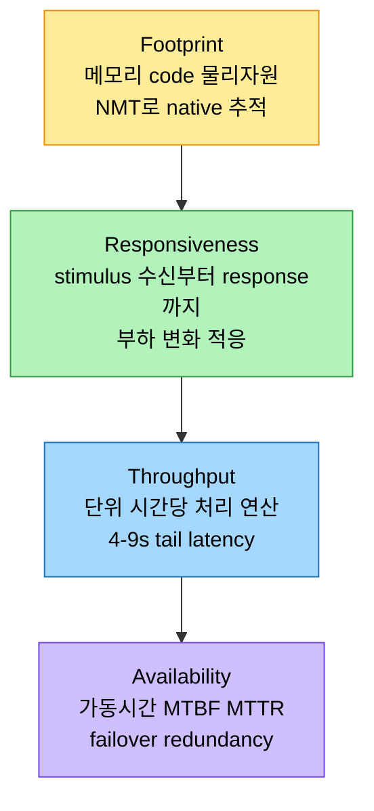
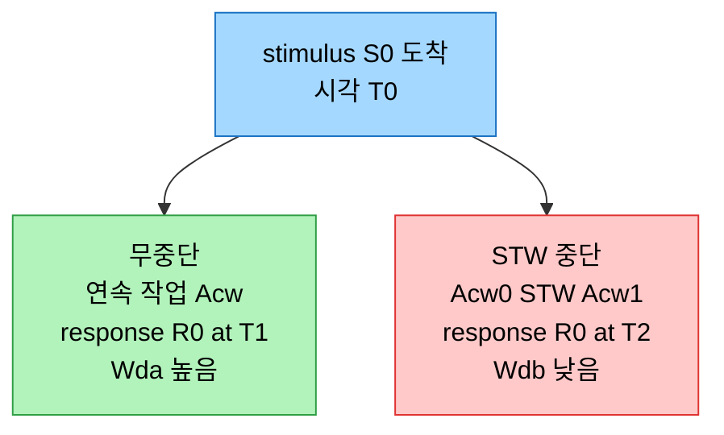

# 성능 엔지니어링과 하드웨어·메모리 모델

## 1. 들어가며 — 성능은 핵심 품질 속성이다

> 소프트웨어 엔지니어링은 *무엇을* 만드는가(기능 요구사항)와 *어떻게* 동작하는가(품질 속성, 이른바 "ilities")의 두 축으로 나뉜다. 성능은 그 품질 축의 핵심으로, SUT(system under test)가 UoW(unit of work)를 얼마나 효과적으로 실행하는지를 잰다.

소프트웨어 엔지니어링은 서로 얽힌 두 차원을 품는다. 하나는 소프트웨어 설계·개발로, 아키텍처·컴포넌트·인터페이스의 청사진을 그려 *시스템이 무엇을 해야 하는가*라는 기능 요구사항을 세운다. 다른 하나는 소프트웨어 아키텍처 요구사항으로, 성능·사용성·보안 같은 비기능 품질 속성, 곧 "ilities"를 다뤄 *시스템이 어떻게 동작해야 하는가*를 정한다. 이 둘의 균형이 엔지니어링의 핵심이고, 그중 성능에 초점을 맞춘다.

성능은 SUT(system under test)가 특정 작업, 곧 UoW(unit of work)를 얼마나 효과적으로 실행하는지를 잰다. 단순히 빠르고 느린지가 아니라 SUT와 UoW의 상호작용을 이해하는 일이다. JVM 같은 managed runtime에서는 GC가 성능을 크게 좌우한다. 저자는 각 GC가 성능 요구를 채우려 하는 작업을 "GC work"라 부르는데, 처리량을 최대화하는 Parallel GC는 "parallel work"에 집중하는 반면 저지연을 노리는 컬렉터는 sub-millisecond pause를 보장하려고 작업을 더 세밀히 제어한다.

이 평가는 QoS(quality of service)로 이어진다. QoS는 사용자 관점의 성능·가용성으로, SLA·SLO·SLI와 정렬된다. SLA는 제공자와 사용자 사이의 공식 합의로 기대 서비스 수준을 정하고, SLO는 그 안의 구체적·측정 가능한 목표이며, SLI는 SLO 대비 실제를 재는 정량 측정(latency·error rate·uptime)이다.

## 2. 네 가지 핵심 메트릭

> 저자는 수많은 메트릭 중 footprint·responsiveness·throughput·availability 넷을 핵심으로 고른다. 이들이 Java 애플리케이션에 두루 적용되고 영향이 크기 때문이다.



footprint는 소프트웨어 실행에 필요한 공간·자원이다. Java heap과 JVM native memory를 합한 memory footprint, 실행 코드 크기인 code footprint, 그리고 스토리지·네트워크·CPU 같은 physical resources로 나뉜다. CPU footprint에서는 GC 알고리즘 선택이 큰 영향을 주는데, 저자가 인용한 Stefano Doni에 따르면 GC를 적절히 최적화하면 CPU를 절반까지 줄여 클라우드 비용을 아낄 수 있다. footprint가 크면 컨테이너·serverless에서 start-up이 길어지고, 한 컨테이너가 자원을 독점하는 "noisy neighbor"나 serverless의 "cold start" 문제가 생긴다.

responsiveness는 latency와 다르다. latency는 stimulus를 받은 순간부터 response를 생성·전달하기까지의 시간으로 한 차원만 잡지만, responsiveness는 부하가 변할 때 적응하고 시간이 지나도 성능을 유지하는 전체적 민첩성을 본다. 응답성을 평가할 때는 목표 응답시간, 초과가 허용되는 조건과 정도, 측정 위치(client·server·end-to-end)를 SLO로 정하고 SLI로 정량화한다.

throughput은 단위 시간당 처리하는 연산 수다. 저자의 e-commerce 컨설팅 사례에서는 holiday sales 피크에 "4-9s를 tail latency로 유지", 곧 요청의 99.99%를 지정 시간 안에 끝내는 것이 목표였다. 부하를 감당하려면 시스템을 더 추가하는 horizontal scaling(scale out)이나 기존 시스템을 증강하는 vertical scaling(scale up)을 쓴다.

availability는 가동시간으로, MTBF(mean time between failure)·MTTR(mean time to recovery)·redundancy(failover 인스턴스 수)로 잰다. 저자의 Hadoop 기반 분산 DB 사례에서는 클러스터에 다중 failover 인스턴스를 둬, 장애 시 백업으로 매끄럽게 전환하며 high availability를 지켰다.

## 3. STW pause가 응답시간과 throughput에 미치는 영향

응답시간을 SLA로 잡을 때는 average·maximum(worst-case)·99th percentile, 이른바 "4-9s"·"5-9s"를 함께 본다. 저자의 Table 5.1 사례에서 System 1~4의 minimum·average·99th percentile은 비슷했지만, System 4의 maximum이 약 18.6초(18598.557ms)에 달해 깊은 조사를 부른다. 이런 긴 pause는 GC 비효율일 수도, 더 넓은 시스템 지연일 수도 있으며, 분산 시스템에서 failover를 유발해 MTBF·MTTR를 악화시킨다. 그래서 평균이나 best-case가 아니라 worst-case를 포착하는 것이 중요하다.

STW(stop-the-world) pause는 모든 애플리케이션 스레드가 멈추는 구간으로, GC에 필요하지만 작업을 끊어 응답시간과 throughput을 깎는다. 애플리케이션 타임라인으로 보면, 끊김 없는 연속 작업 Acw가 STW로 Acw0와 Acw1로 갈리면, 원래 T1에 보냈을 response R0가 T2로 늦춰진다. 같은 구간의 throughput을 비교하면 무중단은 Wda = Acw / (T1−T0)이고 중단은 Wdb = (Acw0+Acw1) / (T1−T0)인데, Acw0+Acw1이 Acw보다 작으므로 Wdb가 Wda보다 낮다. STW가 처리 효율을 떨어뜨리고 응답시간을 늘린다는 것을 정량으로 보여준다.



## 4. 하드웨어가 성능을 빚는다

소프트웨어 혁신이 주목받지만 하드웨어의 역할도 그만큼 중요하다. CPU 속도·메모리·디스크 I/O가 처리 속도를 직접 좌우하고, multi-core에 최적화한 애플리케이션이 single-core에서는 비효율적일 수 있다. 이상적으로는 여러 스레드가 공유 메모리에 충돌 없이 접근하지만(Maranget 등의 ARM/POWER relaxed memory model 그림), 현실은 스레드가 lock을 두고 경쟁해 한 스레드가 다른 스레드를 막고 지연이 생긴다(Doug Lea의 그림).

성능은 프로그래밍 언어·프로세서·메모리 모델의 조화다. 메모리 모델은 스레드가 메모리 연산을 어떻게 인식하는지를 규율하며, 일관성과 성능 사이에서 균형을 잡는다. Java의 메모리 모델은 일관성을 위해 특정 연산 순서를 강조해 성능을 일부 희생하는 반면, C++11 이후는 더 fine-grained한 메모리 순서 제어를 준다. 하드웨어를 의식한 프로그래밍은 cache 계층을 이해하는 데서 출발한다. cache line에 자료구조를 정렬해 miss를 줄이고, 같은 line의 공유 데이터를 효율적으로 접근하는 true sharing을 관리하며, 무관한 데이터가 같은 line에 있어 invalidation을 부르는 false sharing을 피하고, 예상 사용을 미리 당기는 HW prefetching으로 spatial·temporal locality를 살린다.

## 5. 메모리 모델 — 순차 일관성과 store buffering

> 이상적 메모리 모델은 program order대로 실행되는 sequentially consistent 시스템이다. 현실은 성능을 위해 reordering을 허용하는 relaxed 모델을 따르고, 그 대가로 순서를 벗어난 관측이 가능해진다.

이상적인 sequentially consistent 시스템은 연산을 원래 program order대로 실행해 단일 전역 실행 순서를 보장한다. 그러나 현실의 시스템은 성능을 위해 TSO(total store order)·PSO(partial store order)·release consistency 같은 relaxed 모델을 따르고, store/write buffering이나 out-of-order execution 같은 하드웨어 최적화와 결합한다. 이는 성능을 높이지만 연산이 프로그래밍된 순서를 벗어나 관측될 가능성을 연다.

store buffering이 대표 예다. 두 공유 변수 X·Y가 0이고 두 스레드가 있다고 하자.

```
p0                  p1
a: X = 1;           c: Y = 1;
b: foo = Y;         d: bar = X;
```

sequentially consistent 환경이라면 각 스레드 안의 연산이 발행 순서대로 관측되므로 foo와 bar가 동시에 0이 될 수 없다. 그러나 store buffering이 있으면 스레드가 자기 write를 다른 스레드보다 먼저 인식할 수 있어, p0의 `X=1`을 p1이 알아채기 전에 p0만 알고 p1의 `Y=1`도 마찬가지가 되어, foo와 bar가 둘 다 0이 되는 상황이 생긴다. 이런 일관성 이탈에도 이 최적화는 성능을 높이는 근간이며, MESI·MOESI 같은 cache coherence 프로토콜이 프로세서 cache 간 일관성을 유지하며 그림을 더 복잡하게 만든다.

## 6. Concurrent Hardware — SMT와 메모리 계층

멀티프로세서 코어는 SMT(simultaneous multithreading)를 쓸 수 있다. 단일 코어에서 여러 하드웨어 스레드를 동시에 실행하는 기법으로, 한 스레드가 I/O를 기다리는 동안 다른 스레드가 CPU를 쓴다. 각 스레드가 전용 물리 코어를 쓰는 full core는 contention이 적어 compute-intensive 작업에 유리하고, 코어 자원을 공유하는 hyper-threading(SMT)은 throughput을 높이지만 contention이 늘 수 있다. 그래서 I/O-bound 워크로드는 hyper-threading이, CPU-bound는 full core가 낫다.

현대 프로세서는 코어마다 L1I$(instruction)·L1D$(data)·private L2 cache를 두고, cache coherence로 모든 코어가 일관된 메모리 뷰를 갖게 한다. 코어들이 공유하는 LLC(last-level cache)와, 일부 고성능 시스템의 SLC(system-level cache)가 데이터 공유를 돕는다. out-of-order execution은 데이터가 준비되는 대로 명령을 실행하고, load·store buffer는 메모리 전송을 임시 보관해 CPU가 메모리를 기다리지 않고 계속 실행하게 한다. 메모리 일관성은 아키텍처마다 다른데, x86-64·SPARC는 TSO로 강한 일관성을 주는 반면 Arm v8-A는 더 relaxed해 reordering이 유연하다. 유연성은 성능을 높이지만 멀티스레드에서 예상 밖 동작을 피하려면 동기화 primitive를 더 주의 깊게 써야 한다.

## 7. 면접 대비 요약

### 한 줄 정의

성능 엔지니어링은 SUT가 UoW를 실행하는 효율을 footprint·responsiveness·throughput·availability로 측정하고, 그 측정을 하드웨어 cache 계층과 메모리 모델(순차 일관성 vs relaxed)의 이해 위에서 최적화하는 일이다.

### 핵심 포인트 3가지

1. **네 메트릭** — footprint(메모리·code·CPU, NMT로 추적), responsiveness(부하 적응까지 포함), throughput(4-9s tail latency), availability(MTBF·MTTR·failover). SLA/SLO/SLI로 정량화한다.
2. **STW의 정량 영향** — STW pause가 연속 작업 Acw를 끊으면 같은 구간 throughput Wdb=(Acw0+Acw1)/(T1−T0)가 무중단 Wda보다 낮아지고 응답시간이 늘어난다. worst-case(maximum) 포착이 중요하다.
3. **메모리 모델과 성능의 trade-off** — relaxed 모델(TSO 등)과 store buffering이 성능을 높이는 대신 순서를 벗어난 관측을 허용한다. Java 메모리 모델은 일관성을 위해 순서를 강조해 성능을 일부 희생한다.

### 면접에서 받을 만한 질문

1. latency와 responsiveness는 어떻게 다른가?
2. STW pause가 throughput을 떨어뜨리는 과정을 Acw·Wda·Wdb로 설명하라.
3. store buffering에서 foo와 bar가 둘 다 0이 될 수 있는 이유는?
4. full core와 hyper-threading(SMT)은 각각 어떤 워크로드에 유리한가?
5. false sharing이란 무엇이고 왜 성능을 깎는가?

## 정답 (자답 후 펼치기)

### 정답 1 — latency vs responsiveness

latency는 stimulus를 받은 순간부터 response를 생성·전달하기까지의 시간으로, 성능의 한 차원만 잡는다. responsiveness는 그 반응 속도를 넘어, 부하가 변할 때 적응하고 시간이 지나도 성능을 유지하는 전체적 민첩성을 본다. 같은 평균 latency라도 부하 급증에 무너지면 responsiveness가 나쁜 것이다.

### 정답 2 — STW와 throughput

무중단 시나리오에서는 연속 작업 Acw가 그대로 수행돼 throughput Wda = Acw / (T1−T0)이다. STW가 Acw를 Acw0와 Acw1로 끊으면 같은 구간의 work가 Acw0+Acw1로 줄어 Wdb = (Acw0+Acw1) / (T1−T0)가 되고, Acw0+Acw1 < Acw이므로 Wdb < Wda다. 또 response가 T1에서 T2로 늦춰져 응답시간도 늘어난다.

### 정답 3 — store buffering과 둘 다 0

store buffering이 있으면 스레드가 자기 write를 store buffer에 담은 채, 그 write가 다른 스레드에 보이기 전에 자기 read를 먼저 수행할 수 있다. p0가 `X=1`을 buffer에 두고 아직 안 보이는 `Y`를 읽어 foo=0이 되고, 동시에 p1도 `Y=1`을 buffer에 두고 안 보이는 `X`를 읽어 bar=0이 된다. sequentially consistent라면 발행 순서가 보장돼 불가능한 결과다.

### 정답 4 — full core vs SMT

full core는 각 스레드가 코어 자원을 독점해 contention이 적으므로, 지속적이고 집약적인 연산이 필요한 CPU-bound 작업에 유리하다. hyper-threading(SMT)은 한 스레드가 I/O를 기다리는 동안 다른 스레드가 idle한 CPU 사이클을 쓰므로, I/O-bound나 멀티스레드 워크로드에서 throughput 이점을 준다. 대신 코어 자원을 공유해 contention이 늘 수 있다.

### 정답 5 — false sharing

false sharing은 서로 무관한 데이터가 같은 cache line에 놓여, 한 데이터를 갱신하면 그 line 전체가 invalidate돼 다른 데이터를 쓰던 코어의 cache까지 무효화되는 현상이다. 데이터 자체는 공유되지 않는데 cache line 단위 coherence 때문에 불필요한 invalidation과 재적재가 일어나 성능이 깎인다. 자료구조를 cache line에 맞춰 정렬하거나 padding으로 분리해 피한다.

## 관련 문서

- [`./01-02.동기화와 NUMA, JMH 벤치마킹`](./01-02.동기화와%20NUMA,%20JMH%20벤치마킹.md) — 같은 장 후반부: barrier·fence·volatile·NUMA·JMH
- [`../ch14_jpe-evolution/01-01.Java와 JVM의 성능 진화사`](../ch14_jpe-evolution/01-01.Java와%20JVM의%20성능%20진화사.md) — GC·STW·JIT 기초
- [`../ch02_memory-area/01-01.런타임 데이터 영역`](../ch02_memory-area/01-01.런타임%20데이터%20영역.md) — Java heap·native memory 영역
- [`../ch05_optimization/02-01.최적화 사례 분석`](../ch05_optimization/02-01.최적화%20사례%20분석.md) — 실전 성능 최적화 사례
- [`../README`](../README.md) — JVM 학습 인덱스
