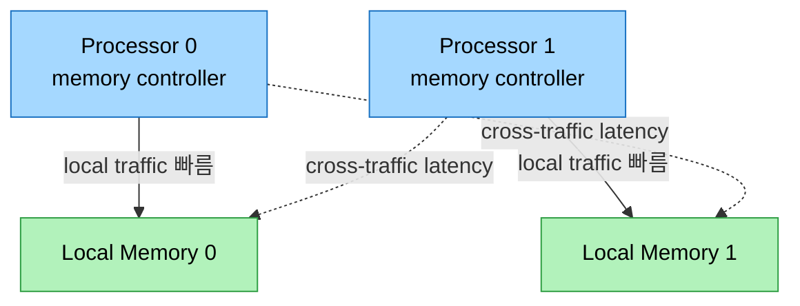
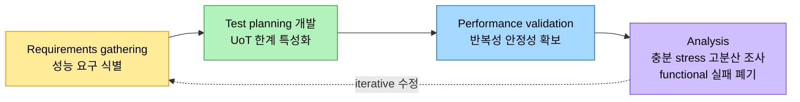

# 동기화와 NUMA, JMH 벤치마킹

## 1. 들어가며 — 순서를 지키는 도구들

> 앞 노트가 하드웨어와 메모리 모델이 성능을 빚는 방식을 봤다면, 이 노트는 그 위에서 순서와 일관성을 지키는 소프트웨어 도구(barrier·fence·volatile), NUMA 아키텍처, 그리고 이 모든 것을 측정하는 JMH를 다룬다.

relaxed 메모리 모델과 하드웨어 최적화는 성능을 높이지만 순서를 벗어난 관측을 허용한다. 그래서 동시성 프로그래밍에는 순서를 지키고 데이터 일관성을 보장하는 도구가 필요하다. barrier·fence·volatile이 그것으로, 의도치 않은 결과를 부르는 특정 reordering을 막는다.

barrier는 특정 reordering을 차단하는 동기화 메커니즘이다. 프로그램의 checkpoint처럼 작동해, 한 스레드가 barrier에 닿으면 다른 모든 스레드가 그 지점에 도달할 때까지 통과하지 못한다. memory barrier는 barrier를 넘는 load·store의 reordering을 막아 공유 데이터의 일관성을 지킨다. fence는 메모리 연산에 더 특화돼 순서 제약을 강제하는데, store-load fence는 fence 앞의 모든 store가 fence 뒤의 load보다 먼저 다른 스레드에 보이도록 보장한다. volatile은 Java에서 변수의 가시성과 순서를 보장하는 키워드로, volatile 변수에 대한 write가 이후 그 변수를 읽는 모든 스레드에 보이는 happens-before 보장을 준다. non-volatile 변수는 컴파일러가 캐시된 값을 쓸 수 있어 이 보장이 없다.

## 2. Atomicity와 happens-before

> atomicity는 연산이 완전히 실행되거나 아예 실행되지 않음을 보장해 데이터 무결성을 지킨다. JMM이 가시성과 순서를 보장하며 happens-before 관계를 세운다.

atomicity는 연산이 완전히 실행되거나 전혀 실행되지 않도록 해 데이터 무결성을 지킨다. JMM(Java Memory Model)이 가시성과 순서를 보장하며 happens-before 관계를 세우는데, 한 액션이 다른 액션보다 happens-before면 첫 액션이 둘째에 보일 뿐 아니라 순서상 앞선다. 이 관계가 멀티스레드 프로그램의 예측 가능한 동작을 보장한다.

`AtomicLong`이 대표 예다. `counter.incrementAndGet()`은 increment와 get을 단일·불가분 연산으로 묶어, 연산 도중 다른 스레드가 일관성 없는 상태의 counter를 관측하거나 간섭하는 것을 막는다. 내부적으로는 CPU 명령에 뿌리를 둔 compare-and-set loop를 써서 memory barrier 역할을 한다.

```java
class DriverLicense {
    private volatile boolean validLicense = false;

    void renewLicense() {
        this.validLicense = true;
    }

    boolean isLicenseValid() {
        return this.validLicense;
    }
}
```

`validLicense`를 volatile로 선언하면, 한 스레드에서 면허를 갱신한 순간 그 상태가 다른 모든 스레드에 즉시 보인다. volatile이 없으면 JVM이나 시스템의 캐싱·reordering 때문에 갱신된 상태가 보이기까지 지연이 생길 수 있다. e-commerce 플랫폼이 동시 트랜잭션을 제대로 다루지 못하면 고객에게 이중 청구를 하거나 재고를 잘못 갱신하는 식의 결과가 나는데, 이런 메커니즘의 올바른 사용이 데이터 불일치를 막는다.

## 3. NUMA — 메모리의 물리적 거리

여러 프로세서와 다양한 메모리 뱅크가 있으면 프로세서와 메모리 사이의 물리적 거리·접근 시간이라는 복잡성이 더해지고, 여기서 NUMA(Non-Uniform Memory Access)가 등장한다. NUMA에서 memory controller는 단순한 중개자가 아니라 신경 중추다. 근접성에 기반해 메모리를 할당하고 cross-node traffic을 줄여 latency를 낮춘다. 프로세서가 데이터를 요청하면 controller가 저장 위치를 정하는데, local이면 직접 빠르게 접근하고 아니면 interconnection network를 거쳐 latency가 생긴다.



NUMA에는 세 가지 traffic 패턴이 있다. cross-traffic은 프로세서가 다른 프로세서의 메모리 뱅크에 접근하는 것으로 cross-node 이동이라 latency가 따른다. local traffic은 자기 local 메모리 뱅크에서 데이터를 가져오는 것으로 interconnect가 필요 없어 더 빠르다. interleaved memory는 연속된 주소를 여러 뱅크에 흩어 부하를 균형 잡지만 cross-node traffic을 늘릴 수 있다. local traffic을 늘리고 cross-traffic latency를 줄이는 것이 효율적 NUMA의 핵심이다. NUMA는 모든 프로세서가 단일 메모리 공간을 공유하는 모델의 확장성 한계(프로세서가 늘면 공유 메모리 대역폭이 병목)를 푼다. 모든 프로세서가 일관된 메모리 이미지를 유지하는 것은 ccNUMA(Cache Coherent NUMA)다. 고성능 서버에서는 Intel mesh fabric(Xeon Scalable), AMD Infinity Fabric(EPYC), Arm Neoverse N1처럼 fabric 아키텍처로 발전했고, 저자는 20년 전 AMD에서 NUMA-aware GC를 발명하는 데 참여했다.

## 4. 성능 엔지니어링 방법론 — top-down과 bottom-up

성능 엔지니어링은 앱·JVM·OS·하드웨어, 그리고 컨테이너·VM·hypervisor까지 이해해야 하는 순환적 작업이다. experimental design은 가설을 검증하고 증거 기반으로 결정하는 체계적 접근으로, 정상 부하의 baseline과 극한 부하의 peak/stress를 잡는다. control(baseline, 현 버전)과 treatment(실험 변수)를 비교하며, A/B testing은 그 한 유형이다.

bottom-up 방법론은 저수준 컴포넌트에서 시작해 위로 올라가며, 하드웨어 nuance(코어·cache 아키텍처가 GC·스레드 스케줄링에 미치는 영향), JVM의 GC, OS 스레드 관리, 컨테이너 환경(Kubernetes resource allocation, container 메모리 limit 대비 heap tuning), Netty 같은 프레임워크를 차례로 본다. top-down 방법론은 고수준 목표에서 하향하며, 잘 아는 "known-knowns"(workflow·access pattern·tunable)에서 출발해 잘 모르는 "known-unknowns"(병목·예측 불가 동작)를 드러내고, 이를 다시 "known-knowns"로 바꾼다. SoW(Statement of Work) 아래에서 특히 유효하며, OLTP DB 시스템에서는 call chain traversal time(함수 호출·반환의 누적 시간)과 tail latency(99th percentile 이상의 worst-case)를 줄이는 것이 목표가 된다.

이 방법론은 monitoring → profiling → analysis → apply tunings의 4단계 순환으로 구체화된다. 시스템 스택은 Application → Application Ecosystem → JVM/JRE → Container → Guest OS → Hypervisor+Host OS → Hardware로 층을 이루며, 각 층을 system profiler(perf·VTune)와 PMU(performance monitoring unit), Java profiler(async-profiler·VisualVM, JIT 머신코드를 디스어셈블하는 hsdis)로 들여다본다.

## 5. 벤치마킹과 JMH

> 벤치마킹은 SUT의 "ilities"를 데이터로 보증한다. 표준 harness 없이 벤치마킹하면 흔한 함정에 빠지므로, Oracle 엔지니어들이 만든 JMH(JEP 230)가 build·run·timing을 표준화한다.

벤치마킹은 scalability·reliability 같은 "ilities"를 측정해 SUT의 성능을 데이터로 보증한다. 프로세스는 requirements gathering → test planning·development → performance validation → analysis로 이어지며, 측정 분산이 크면 interference를 의심해 그 원인을 조사하고, functional 실패가 난 run은 폐기한다. JVM 메모리 관리 벤치마킹에서는 allocation rate(높으면 GC가 graceful degradation 모드로), GC pause time·frequency, memory footprint(heap·code cache·Metaspace·off-heap), G1·ZGC·Shenandoah의 region·humongous 객체 같은 메트릭을 본다.



표준 harness가 필요한 이유는, 프로세서 cache 계층이나 메모리 모델 같은 스택 전반의 요소가 성능에 영향을 주는데 이를 silo로 측정하면 안 되기 때문이다. JMH(Java Microbenchmark Harness)는 JEP 230으로 도입됐고 JDK 12에 추가됐으며, 현재와 이전 릴리스를 컴파일·실행해 regression 연구를 쉽게 한다. Maven archetype으로 프로젝트를 생성하고(`mvn archetype:generate -DarchetypeArtifactId=jmh-java-benchmark-archetype ...`), `@Benchmark`로 메서드를 표시한 뒤 `mvn clean install`로 빌드하고 `java -jar target/benchmarks.jar`로 실행하면 ops/s 같은 결과가 나온다.

핵심 애너테이션은 다음과 같다.

| 애너테이션 | 역할 |
|------------|------|
| `@Benchmark` | 측정 대상 메서드 표시 |
| `@BenchmarkMode` | 모드 지정(Throughput·Average Time·Sample Time·Single Shot Time·All) |
| `@Warmup` / `@Measurement` | warm-up(결과 미기록, JIT 안정)·measurement(기록) 반복 수 |
| `@Fork` | JVM fork 수로 벤치마크 격리 |
| `@State` | 벤치마크 상태 클래스, 생명주기를 JMH가 관리 |
| `@Setup` / `@TearDown` | 벤치마크 전후 생명주기 메서드 |
| `@OperationsPerInvocation` | 호출당 연산 수를 알려 loop 최적화 왜곡 방지 |

warm-up이 필요한 이유는 JVM의 JIT 컴파일러가 처음 몇 번의 실행에서 코드를 최적화하기 때문이다. warm-up은 애플리케이션 생명주기의 ramp-up에, measurement는 peak performance의 steady-state에 대응한다. loop를 다룰 때는 JIT가 결과에 영향 없는 loop를 통째로 제거할 수 있으므로, `@OperationsPerInvocation`으로 연산 수를 알리고 `Blackhole.consume()`으로 값을 소비해 최적화 제거를 막는다.

## 6. JMH 실전 — CAS와 LSE 벤치마킹

JMH의 쓸모는 프로세서 옵션을 비교할 때 드러난다. Arm v8.1+는 LSE(Large System Extensions)라는 atomic 명령 집합으로 멀티스레드 효율을 높이는데, 그 효과를 CAS(compare-and-swap) 연산의 max·min overhead로 측정한다. CAS는 메모리 위치의 값을 주어진 값과 비교해 같을 때만 새 값으로 바꾸는 단일 atomic 연산으로, 많은 동기화 primitive의 근간이다.

```java
@BenchmarkMode(Mode.AverageTime)
@OutputTimeUnit(TimeUnit.NANOSECONDS)
@State(Scope.Benchmark)
public class Atomic {
    public AtomicInteger aInteger;

    @Setup(Level.Iteration)
    public void setupIteration() {
        aInteger = new AtomicInteger(0);
    }

    @Benchmark
    @OperationsPerInvocation(2)
    public void testAtomicIntegerAlways(Blackhole bh) {
        bh.consume(aInteger.compareAndSet(0, 2));
        bh.consume(aInteger.compareAndSet(2, 0));
    }

    @Benchmark
    public void testAtomicIntegerNever(Blackhole bh) {
        bh.consume(aInteger.compareAndSet(1, 3));
    }
}
```

`testAtomicIntegerAlways`는 호출당 두 연산(0→2, 2→0)을 수행하고, `testAtomicIntegerNever`는 1→3을 시도하지만 초기값이 0이라 swap이 일어나지 않는다. LSE가 켜지면 Arm 프로세서가 최소 overhead로 효율적으로 확장하지만, LSE가 없으면 LL/SC(load-link/store-conditional)로 되돌아간다. LDAXR(exclusive load-acquire)로 값을 읽고 위치를 reserved로 표시한 뒤 STLXR(store-release)로 그 사이 다른 write가 없을 때만 쓰는 방식인데, 여러 스레드가 같은 위치를 동시에 접근하면 contention과 retry로 병목이 생긴다. LSE가 이를 해결한다.

perfasm 프로파일러는 벤치마크를 assembly 레벨에서 보여준다. `java -jar benchmarks.jar -prof perfasm`으로 실행하면 가장 자주 실행된 assembly 명령 목록이 나오고, Arm v8.1+에서는 이 CAS가 LSE 명령으로 구현된 것을 확인할 수 있다. 코드가 하드웨어 레벨에서 어떻게 실행되는지를 들여다봐 최적화 지점을 짚는다.

## 7. 면접 대비 요약

### 한 줄 정의

JMH는 JEP 230으로 도입된 마이크로벤치마킹 harness로, warm-up·measurement·fork·Blackhole로 JIT 간섭과 loop 최적화 왜곡을 통제해 CAS/LSE 같은 저수준 연산의 성능을 신뢰성 있게 측정한다.

### 핵심 포인트 3가지

1. **순서 보장 도구** — barrier는 reordering을 차단하는 checkpoint, fence는 메모리 연산에 특화된 순서 제약, volatile은 happens-before로 가시성·순서를 보장한다. JMM이 atomicity와 happens-before를 세운다.
2. **NUMA의 traffic 패턴** — local traffic(빠름)·cross-traffic(latency)·interleaved memory로 나뉘며, local을 늘리고 cross를 줄이는 것이 핵심이다. memory controller가 NUMA-aware로 근접성 기반 할당을 한다.
3. **JMH의 통제** — warm-up으로 JIT를 안정시키고, `@OperationsPerInvocation`과 `Blackhole`로 loop 제거를 막으며, `@Fork`로 벤치마크를 격리한다. perfasm으로 assembly 레벨까지 본다.

### 면접에서 받을 만한 질문

1. barrier와 fence는 어떻게 다른가?
2. volatile이 주는 happens-before 보장은 무엇이고 없으면 어떤 문제가 생기는가?
3. NUMA의 cross-traffic과 local traffic을 설명하고, 최적화 방향을 말하라.
4. JMH에서 Blackhole과 `@OperationsPerInvocation`이 필요한 이유는?
5. JMH warm-up phase가 왜 필요한가? 애플리케이션 생명주기의 무엇에 대응하는가?

## 정답 (자답 후 펼치기)

### 정답 1 — barrier vs fence

barrier는 넓은 동기화 지점으로, 한 스레드가 닿으면 다른 모든 스레드가 도달할 때까지 통과하지 못하게 막고 그 지점을 넘는 load·store reordering을 막는다. fence는 메모리 연산에 더 특화돼, 특정 연산이 다른 연산보다 먼저 완료되도록 순서 제약을 강제한다. 예컨대 store-load fence는 fence 앞의 store가 fence 뒤의 load보다 먼저 다른 스레드에 보이도록 보장한다.

### 정답 2 — volatile과 happens-before

volatile 변수에 대한 write는 이후 그 변수를 읽는 모든 스레드에 보이는 happens-before 보장을 준다. 즉 한 스레드의 갱신이 다른 스레드에 즉시 보인다. volatile이 없으면 컴파일러가 캐시된 값을 쓸 수 있어, JVM이나 시스템의 캐싱·reordering 때문에 갱신된 값이 보이기까지 지연이 생기고, 그 사이 다른 스레드가 낡은 값을 읽어 데이터 불일치가 난다.

### 정답 3 — NUMA traffic

cross-traffic은 프로세서가 다른 프로세서의 메모리 뱅크에 접근하는 것으로, interconnect를 거쳐 latency가 따른다. local traffic은 자기 local 메모리 뱅크에서 가져오는 것으로 interconnect가 필요 없어 빠르다. 최적화는 local traffic을 늘리고 cross-traffic latency를 줄이는 방향이며, NUMA-aware memory controller가 근접성에 기반해 메모리를 할당해 이를 돕는다.

### 정답 4 — Blackhole과 @OperationsPerInvocation

JIT 컴파일러는 결과가 프로그램 출력에 영향을 주지 않는 코드나 loop를 최적화로 제거할 수 있다. `Blackhole.consume()`은 값을 소비해 그 값을 만든 코드가 제거되지 않게 하고, `@OperationsPerInvocation`은 메서드가 수행하는 연산 수를 JMH에 알려 loop가 통째로 제거되는 것을 막는다. 둘 다 측정이 실제 코드를 재게 만드는 장치다.

### 정답 5 — warm-up phase

JVM의 JIT 컴파일러가 처음 몇 번의 실행에서 코드를 최적화하므로, 측정 전에 코드가 최적화된 steady-state에 도달해야 신뢰할 수 있는 결과가 나온다. warm-up phase는 그 안정 상태에 이르도록 메서드를 실행하되 결과를 기록하지 않는다. 이는 애플리케이션 생명주기의 ramp-up phase에 대응하고, measurement phase는 peak performance의 steady-state phase에 대응한다.

## 관련 문서

- [`./01-01.성능 엔지니어링과 하드웨어·메모리 모델`](./01-01.성능%20엔지니어링과%20하드웨어·메모리%20모델.md) — 같은 장 전반부: 메트릭·STW·메모리 모델·SMT
- [`../ch14_jpe-evolution/01-01.Java와 JVM의 성능 진화사`](../ch14_jpe-evolution/01-01.Java와%20JVM의%20성능%20진화사.md) — NUMA-aware GC·Parallel GC 도입
- [`../ch03_gc/01-02.Java 성능 — JMH와 측정 방법론`](../ch03_gc/01-02.Java%20성능%20—%20JMH와%20측정%20방법론.md) — 《밑바닥》 쪽 JMH·측정 방법론
- [`../README`](../README.md) — JVM 학습 인덱스
