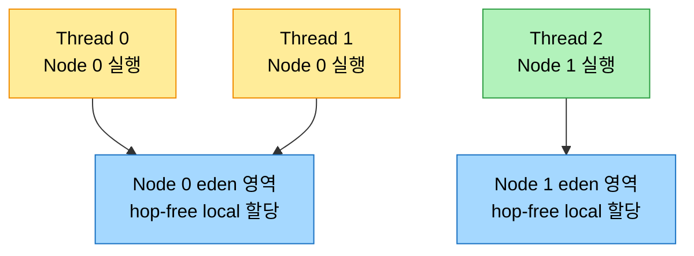
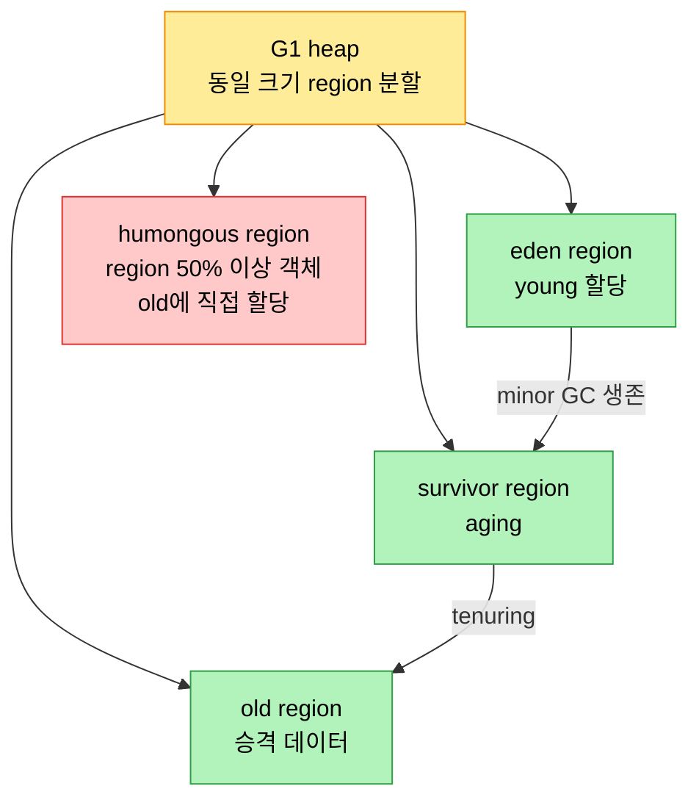

# TLAB·PLAB·NUMA-aware GC와 G1 심화

## 1. 들어가며 — 할당부터 회수까지의 최적화

> Java GC는 root에서 객체 그래프를 추적해 live 객체를 표시(marking)하고, 도달하지 못한 것을 garbage로 회수하는 자동·적응 시스템이다. 이 노트는 그 과정을 빠르게 만드는 할당 버퍼(TLAB·PLAB), NUMA 시스템에 맞춘 할당, 그리고 latency 중심 GC인 G1의 내부를 본다.

Java의 GC는 heap을 generation으로 나눠 대부분의 객체를 young(eden+survivor)에 할당하고, minor GC를 살아남은 객체를 eden→survivor→old로 옮긴다. 이는 weak generational hypothesis, 곧 대부분의 객체가 빨리 unreachable이 되고 old에서 young으로의 참조는 적다는 가정에 기댄다. GC 과정은 root(앱이 직접 접근하는 객체)에서 객체 그래프를 추적해 live 객체를 표시하는 marking으로 시작하는데, concurrent collector는 일부 객체를 암묵적으로 live로 간주해 "floating garbage", 곧 더는 live가 아닐 수 있는 참조를 보존하기도 한다. 추적 뒤 도달하지 못한 객체가 garbage로 회수된다.

HotSpot은 여러 GC를 제공하지만 이 장은 G1과 ZGC에 집중한다. G1은 JDK 7u4부터 완전 지원된 컬렉터로 응답성과 throughput을 균형 잡고, heap을 region으로 나눠 독립적으로 처리한다. ZGC는 JDK 11에서 실험적으로 들어와 pause time이 heap 크기와 사실상 무관한 저지연 컬렉터다. region 개념이 두 컬렉터의 핵심으로, 많은 free space를 낼 region에 집중한다.

## 2. TLAB와 PLAB — lock 없는 할당과 승격

TLAB(Thread-Local Allocation Buffer)는 할당 성능을 높이는 최적화다. 스레드마다 heap 안에 별도 영역을 줘서 lock 없이 그 안의 포인터를 bump하며 할당하게 하는데, 이를 "fast-path"라 부른다. 공유 메모리 풀을 두고 경쟁하면 성능이 크게 떨어지는 멀티스레드 애플리케이션에 특히 유리하다. TLAB는 resizable하며 JVM이 각 스레드의 할당 행동을 모니터링해 크기를 조정한다.

TLAB는 몇 가지 옵션으로 튜닝한다. `UseTLAB`는 활성/비활성(기본 활성, `-XX:-UseTLAB`로 끔), `-XX:TLABSize=<value>`는 초기 크기(예 `16384`=16KB), `ResizeTLAB`는 resize 제어, `-XX:TLABRefillWasteFraction=<value>`는 허용 waste를 TLAB 크기의 분수로 정한다(작을수록 자주 resize). 모니터링은 JFR(`-XX:StartFlightRecording=...,jdk.ObjectAllocationInNewTLAB#enabled=true,...`)이나 JVM 로깅(`-Xlog:gc*,gc+tlab=debug:file=gc.log:time,tags`)으로 한다.

PLAB(Promotion-Local Allocation Buffer)는 GC 스레드가 객체를 promote할 때 쓰는 버퍼다. 많은 GC가 depth-first copying으로 co-locality를 높이며, 일부 객체는 PLAB를 거치지 않고 직접 old로 승격된다. PLAB도 promotion rate 기반으로 자동 resize된다. generational GC에서는 세대를 적절히 sizing하고 객체를 적절히 aging시켜 장수 객체만 tenure되게 하는 것이 중요하다. 할당률 spike가 promotion rate를 올려 old collection을 유발할 수 있는데, 잘 튜닝된 GC는 그런 spike를 full STW GC 없이 흡수할 headroom을 갖는다. PLAB 튜닝은 보통 self-tune이라 드물게 쓰이며 `-XX:GCTimeRatio`·`ResizePLAB`·`-XX:PLABWeight`(기본 75) 정도다.

## 3. NUMA-aware GC — 가까운 메모리에서 할당하기

NUMA 시스템에서는 메모리 접근 속도가 메모리와 프로세서의 위치 관계에 달려 있고, OS는 "first-touch" 원칙에 따라 처음 접근한 프로세서에 가장 가까운 메모리를 할당한다. HotSpot의 NUMA-aware allocator는 eden을 노드(CPU+memory controller+memory bank 묶음)별 segment로 나눠, 스레드가 자기 노드에 가까운 영역에서 할당하게 한다.

eden을 노드별로 나누고 그 노드에서 도는 스레드가 자기 영역에서 할당하면, 스케줄러가 스레드를 다른 노드로 옮기지 않는 한 hop 없이 node-local 메모리에 접근한다. 객체는 초기에 자기 NUMA 노드의 eden에 머물다가, 일부가 살아남거나 old로 승격될 때 노드 간 공유가 필요해지면 node-interleaved 방식, 곧 Node 0부터 순차·균등하게 메모리를 분배받는다. NUMA-aware GC는 JDK 8 이후 `-XX:+UseNUMA`로 켜고 `-XX:+PrintFlagsFinal`로 확인하며, G1은 JDK 14에서(JEP 345), ZGC는 JDK 15에서 NUMA-aware가 됐다.

## 4. G1 — region 기반 latency 중심 GC

> GC 설계는 throughput 중심에서 latency 중심으로 옮겨 왔다. JDK 11 LTS부터 기본 컬렉터인 G1이 그 전환의 대표로, heap을 동일 크기 region으로 나눠 pause time을 예측 가능하게 만든다.

G1은 heap을 동일 크기의 여러 region으로 나누고, 각 region이 동적으로 eden·survivor·old 역할을 맡게 한다. 여기에 adaptive sizing이 더해져 런타임 행동에 따라 young/old 크기를 조정하고(generational sizing), pause-time target에 맞춰 수집할 region 집합을 garbage 양 기준으로 고르며(collection set sizing), cross-region 참조를 추적하는 remembered set이 너무 커지면 granularity를 낮춰 coarsen한다.

pause-time 예측 가능성은 G1의 핵심이다. GC 작업을 작은 chunk로 쪼개 점진 처리하고(incremental collection), CMS의 concurrent marking을 SATB(snapshot-at-the-beginning) marking으로 강화한다. G1은 history 기반으로 여러 시간을 예측하는데, single region copy time(evacuate 시간), concurrent marking time(IHOP `-XX:InitiatingHeapOccupancyPercent` 동적 조정), mixed GC time, young GC time(`-XX:MaxGCPauseTimeMillis` 기준 young 크기 조정), 회수 가능 공간이 그것이다. 설계상 멀티스레딩을 지원해 young/old collection을 병렬화하고 marking phase에 concurrent 스레드를 쓴다.

### regionalized heap의 장점과 humongous object

region은 G1의 UoW(unit of work)다. collection set에 region을 더하거나 빼며 현재 메모리 사용 패턴에 적응하고, 모든 young region에 최소 하나의 old region을 더한 incremental compaction을 한다. 이는 Parallel GC의 full GC나 CMS의 fallback full GC 같은 monolithic old collection보다 적응적이다. 전통 heap이 young·old를 분리된 영역으로 두는 반면, regionalized heap은 free/occupied region으로 나뉘어 young region이 free list로 돌아가면 promotion 필요에 따라 old로 재사용된다.

한 가지 특수한 경우가 humongous object다. 단일 G1 region의 50% 이상을 차지하는 객체로, fast-path(TLAB) 대신 old의 designated humongous region에 직접 할당되며 region 크기를 넘으면 연속된 region을 요구한다.

## 5. G1 튜닝 — 응답성과 throughput

`-XX:MaxGCPauseMillis`는 soft real-time goal이라 pause-time goal에 닿아도 hard-stop하지 않는다. 할당 spike나 mutation rate(참조 갱신 속도) 증가로 tail latency가 높아져 예측 로직이 못 따라가면 응답성 SLO를 일관되게 못 맞출 수 있고, 이때 수동 튜닝이 필요하다.

pause histogram을 보면 4 young GC → IHOP 초과 시 1 initial mark → concurrent mark 중 1 young → 1 remark + 1 cleanup → 1 young → 7 mixed GC 순으로 흐른다. SLO가 "pause 100% ≤ 100ms"인데 마지막 mixed collection이 이를 넘는다면, JDK 12의 abortable mixed collection으로 완화하거나 수동으로 튜닝한다. mixed collection에 들어가는 old region 수는 두 임계로 제어하는데, `-XX:G1OldCSetRegionThresholdPercent=
`가 최대를, `-XX:G1MixedGCCountTarget=<n>`이 최소를 정한다. 예컨대 1GB heap에서 default 10%면 old region이 103개인데, 7%로 줄이면 72개가 되어 마지막 mixed pause를 SLO 안으로 들이지만 총 mixed collection 수가 늘 수 있다.

throughput SLO(예: GC overhead ≤ 5%)를 못 맞출 때는 다른 손잡이를 쓴다. 비싼 old region을 mixed collection set에서 빼고(`-XX:G1MixedGCLiveThresholdPercent=
`로 live data % cutoff 초과 region 제외), `-XX:G1HeapWastePercent=
`로 일정 비율을 미수집(heap waste)으로 허용해 marking 단계에서 정렬된 배열 끝의 비싼 region을 건드리지 않는다. JDK 11~17은 abortable mixed collection, unused memory 반환(`G1PeriodicGCInterval`), NUMA-awareness(JDK 14), adaptive IHOP 같은 기능을 더해 수동 튜닝 필요를 줄였다.

### marking threshold 튜닝

Java 9가 들인 adaptive IHOP는 대개 잘 작동하지만, 단명 트랜잭션 캐시처럼 bursty한 단명(때로 humongous) 할당이 일어나면 문제가 생긴다. IHOP가 너무 낮으면 mixed collection 없이 끝나는 조기 concurrent marking이, 너무 높으면 marking 시작이 늦어 evacuation failure가 생긴다. 이때는 `-XX:-G1UseAdaptiveIHOP -XX:InitiatingHeapOccupancyPercent=
`로 임계를 낮게 고정하고, `-XX:ConcGCThreads=<n>`(기본은 parallel GC 스레드의 1/4)으로 concurrent 스레드를 늘린다. marking cycle이 끝나기 전에 다음 cycle이 시작돼 young collection만 반복되다 full GC로 떨어지는 패턴이 이 문제의 신호다. G1은 region 기반으로 큰 진전이었지만, pause time이 데이터 밀도·region popularity·region별 live data에 따라 변동해 SLO를 맞추기 어려울 수 있고, 이것이 ZGC 같은 near-real-time 컬렉터의 수요를 낳았다.

## 6. 면접 대비 요약

### 한 줄 정의

TLAB는 스레드별 lock-free 할당 버퍼, PLAB는 승격용 버퍼이며, G1은 heap을 동일 크기 region으로 나눠 history 기반 예측으로 pause-time goal을 맞추는 latency 중심 GC다. NUMA-aware allocator는 eden을 노드별로 나눠 hop-free 할당을 노린다.

### 핵심 포인트 3가지

1. **TLAB/PLAB로 할당·승격 가속** — TLAB는 스레드별 영역에서 포인터 bump로 lock 없이 할당하고, PLAB는 GC 스레드가 객체를 promote한다. 둘 다 할당/승격 rate 기반으로 자동 resize된다.
2. **region이 G1의 UoW** — heap을 동일 크기 region으로 나눠 collection set에 region을 더하거나 빼며 적응하고, incremental compaction으로 monolithic old collection보다 유연하다. humongous object는 region의 50%+를 차지해 직접 old에 할당된다.
3. **soft goal과 튜닝** — `-XX:MaxGCPauseMillis`는 hard-stop이 아니다. 응답성은 `G1OldCSetRegionThresholdPercent`로, throughput은 `G1HeapWastePercent`로, marking 시점은 IHOP로 튜닝한다.

### 면접에서 받을 만한 질문

1. TLAB가 멀티스레드 할당 성능을 높이는 원리는?
2. NUMA-aware allocator가 eden을 어떻게 나누고, hop이란 무엇인가?
3. G1에서 humongous object는 일반 객체와 어떻게 다르게 할당되는가?
4. `-XX:MaxGCPauseMillis`가 soft goal이라는 말의 의미와, 못 맞출 때의 튜닝 방향은?
5. adaptive IHOP가 너무 낮거나 높을 때 각각 어떤 문제가 생기는가?

## 정답 (자답 후 펼치기)

### 정답 1 — TLAB 원리

TLAB는 각 스레드에 heap 안의 전용 버퍼를 줘서, 스레드가 그 안의 포인터를 bump하기만 하면 할당이 끝나게 한다. 공유 메모리 풀에 접근할 때 필요한 lock 획득과 스레드 간 동기화가 사라지므로 할당이 훨씬 빠르다. 이를 fast-path라 부르며, 공유 풀 경쟁이 큰 멀티스레드 애플리케이션에서 특히 효과가 크다.

### 정답 2 — NUMA allocator와 hop

NUMA-aware allocator는 eden을 노드별 segment로 나누고, 어떤 노드에서 도는 스레드가 그 노드의 eden 영역에서 할당하게 한다. hop은 데이터가 노드 사이를 건너가는 횟수로, local 메모리 접근은 0 hop, 인접 노드는 1 hop, 그 너머는 2 hop처럼 늘어나며 hop이 많을수록 latency가 커진다. 노드별 할당으로 스케줄러가 스레드를 옮기지 않는 한 hop-free local 접근을 얻는다.

### 정답 3 — humongous object 할당

humongous object는 단일 G1 region의 50% 이상을 차지하는 큰 객체다. 일반 객체가 fast-path(TLAB)로 할당되는 것과 달리, humongous object는 old의 designated humongous region에 직접 할당된다. region 하나로 안 들어가면 연속된 여러 region을 요구하며, 그래서 단편화나 긴 pause를 피하려 특수 처리된다.

### 정답 4 — soft goal과 튜닝

`-XX:MaxGCPauseMillis`는 soft real-time goal이라 예측 로직이 그 목표를 지향할 뿐, pause가 목표에 닿아도 강제로 멈추지 않는다. 할당 spike나 mutation rate 증가로 tail latency가 높아져 SLO를 못 맞추면 수동 튜닝이 필요하다. 응답성은 `G1OldCSetRegionThresholdPercent`로 mixed set의 old region 수를 줄이고, throughput은 `G1HeapWastePercent`로 비싼 region을 미수집 허용하며, marking 시점은 IHOP를 고정·조정한다.

### 정답 5 — adaptive IHOP

IHOP가 너무 낮으면 concurrent marking이 일찍 시작돼, 필요한 mixed collection을 유발하기 전에 끝나버린다. 특히 bursty 할당이 그 뒤에 일어나면 회수가 안 된다. 반대로 너무 높으면 marking 시작이 늦어져, old가 차오른 뒤에야 marking이 돌고 evacuation failure가 잦아진다. 그래서 pathological한 워크로드에서는 `-XX:-G1UseAdaptiveIHOP`로 끄고 적절한 값으로 고정한다.

## 관련 문서

- [`./01-02.ZGC 심화와 워크로드별 GC 선택`](./01-02.ZGC%20심화와%20워크로드별%20GC%20선택.md) — 같은 장 후반부: ZGC·미래 트렌드·OLAP/OLTP/HTAP
- [`../ch14_jpe-evolution/01-01.Java와 JVM의 성능 진화사`](../ch14_jpe-evolution/01-01.Java와%20JVM의%20성능%20진화사.md) — generational GC·NUMA-aware GC·G1 도입 연대기
- [`../ch18_jpe-perf-eng/01-02.동기화와 NUMA, JMH 벤치마킹`](../ch18_jpe-perf-eng/01-02.동기화와%20NUMA,%20JMH%20벤치마킹.md) — NUMA traffic 패턴과 memory controller
- [`../ch03_gc/02-04.클래식 가비지 컬렉터`](../ch03_gc/02-04.클래식%20가비지%20컬렉터.md) — Serial·Parallel·CMS 컬렉터 기초
- [`../README`](../README.md) — JVM 학습 인덱스
