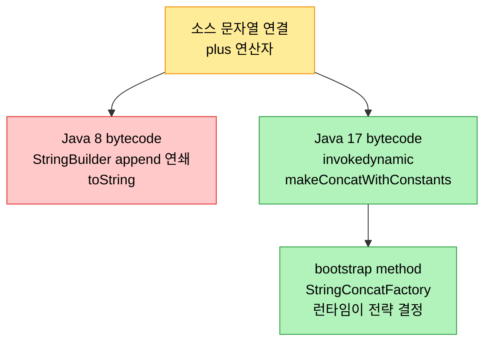
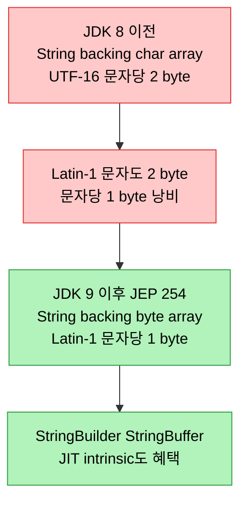

# 문자열 런타임 최적화

## 1. 들어가며 — 가장 흔한 객체를 줄이는 네 가지 길

> 문자열은 거의 모든 Java 애플리케이션의 근간이라, 여기서의 개선이 속도·메모리·확장성에 곧장 영향을 준다. Java 커뮤니티는 string pool·G1 dedup·indy-fication·compact string이라는 네 갈래로 문자열을 최적화해 왔다.

Java 8에서 17까지 350개가 넘는 JEP가 성능 최적화를 향했고, 그중 `java.lang.String`의 footprint 감소가 두드러진다. 문자열은 텍스트부터 XML 처리까지 어디에나 쓰이므로 그 메모리 발자국을 줄이면 애플리케이션 전체 효율이 올라간다. 이 노트는 네 가지 최적화를 본다. heap 점유를 줄이는 string pool, G1의 String deduplication, bytecode 레벨에서 concat을 바꾼 indy-fication, 그리고 backing array를 `char[]`에서 `byte[]`로 바꾼 compact string이다.

## 2. string pool과 intern

할당 footprint를 줄이는 것은 늘 성능 개선의 큰 기회였다. Java 9가 backing array를 `char[]`에서 `byte[]`로 바꾸기 훨씬 전부터, HotSpot은 string pool로 메모리를 아꼈다. 문자열은 불변이고 애플리케이션 곳곳에서 중복되므로, `String` 클래스는 pool을 써서 heap을 절약한다. `String.intern()`을 호출하면 같은 값의 문자열이 pool에 이미 있는지 확인하고, 있으면 새 객체를 할당하는 대신 기존 문자열의 참조를 돌려준다.

Java 9 이전이라면 `String1`은 `String1` 객체와 그 backing `char[]`를 가졌다. `String1.intern()`은 같은 값이 pool에 있는지 보고 없으면 `String1`을 pool에 더한다. 이후 `String2`가 생성·intern되고 `String1`과 equals면, pool 안의 같은 `char[]`를 참조한다. 동일한 문자열이 한 번만 저장되므로 메모리 효율이 크게 오르고, interned 문자열은 같은 참조를 공유하므로 `equals()` 대신 `==`로 빠르게 비교돼 실행 속도까지 빨라진다.

## 3. G1 String Deduplication

Java 8 update 20은 G1 GC에 String deduplication(dedup)을 더해 footprint를 줄였다. STW evacuation pause(young 또는 mixed)나 fallback full collection의 marking phase에서 G1이 dedup 후보를 식별한다. 후보는 동일한 `char[]`를 가진 `String` 인스턴스로, eden에서 survivor로 evacuate됐거나 old로 승격됐고 age가 dedup threshold 이하인 것들이다. dedup은 한 `String` 인스턴스의 value 필드를 다른 것으로 재할당해 중복 backing array를 없애는 일이다.

이 작업의 대부분은 "deduplication thread"라는 VM 내부 스레드가 애플리케이션 스레드와 concurrent하게 수행하며, dedup queue를 처리하면서 hash code를 계산하고 필요에 따라 문자열을 dedup한다. `String1`과 `String2`가 문자 단위로 같고 둘 다 G1이 관리한다면, 중복된 문자 배열을 단일 공유 배열로 바꾼다.

이 기능은 기본 비활성이라 `-XX:+UseStringDeduplication`으로 켜고, `-XX:StringDeduplicationAgeThreshold=<#>`로 age threshold를 조정하며, `-Xlog:stringdedup*=debug`로 효과를 모니터링한다. 로그에는 `Concurrent String Deduplication 45/2136.0B (new), 1/40.0B (deduped)`처럼 검사·dedup된 양과 Inspected·Known·New·Deduplicated 비율이 찍힌다. 다만 dedup 연산 자체가 CPU를 쓰므로, 메모리 절감과 CPU 오버헤드의 trade-off를 애플리케이션 특성에 비춰 따져야 한다.

## 4. Indy-fication of String Concatenation

> Java 8까지 `+` 연산자는 `StringBuilder.append()` 연쇄로 번역됐다. Java 17은 이를 `invokedynamic` 한 줄로 바꿔, concat 전략을 런타임이 결정하게 했다.

indy-fication은 JSR 292의 `invokedynamic`을 쓴다. `invokedynamic`은 Java SE 7에서 동적 언어 지원을 위해 추가된 명령으로, 번역을 런타임 엔진에 defer한다. 문자열 연결은 `System.out.println("It is " + trueMorn + " that you are a morning person")`처럼 흔한 연산인데, 같은 코드의 bytecode가 Java 8과 17에서 크게 다르다.

Java 8에서 `getMornPers()`를 `javap -c -p`로 보면, `+` 연산자가 내부적으로 `StringBuilder` API의 `append()` 연쇄로 번역돼 있다. `new StringBuilder`를 만들고 `append("It is ")`, `append(trueMorn)`, `append("...")`를 거쳐 `toString()`을 호출하는 식이다. 반면 Java 17의 bytecode는 전혀 다르다.

```
private static void getMornPers();
    Code:
       0: getstatic     #7    // Field java/lang/System.out
       3: getstatic     #37   // Field trueMorn:Z
       6: invokedynamic #41,  0   // InvokeDynamic #0:makeConcatWithConstants:(Z)Ljava/lang/String;
      11: invokevirtual #15   // Method java/io/PrintStream.println
      14: return
```

`invokedynamic` 명령이 `makeConcatWithConstants` 메서드를 쓰는 이 변환이 indy-fication이다. `invokedynamic`은 bootstrap method(BSM)를 도입해 call site를 보조하는데, `javap -p -c -v`로 보면 `StringConcatFactory.makeConcatWithConstants`를 `REF_invokeStatic`으로 부르고 method argument로 `It is  that you are a morning person`(상수 자리에 `` placeholder)을 넘긴다. 런타임이 `invokedynamic`을 `invokestatic`으로 변환하고, BSM의 도움으로 런타임 파라미터를 미리 만든 문자열의 정확한 자리에 끼워 넣는다.

이 방식의 이점은 여럿이다. empty·null 문자열이 개별 최적화돼 불필요한 연산을 우회하고, `StringBuilder`의 내부 버퍼 크기를 미리 계산할 필요가 없어진다(JVM이 결과 문자열의 최적 크기를 동적으로 정하므로, 연결할 문자열 길이가 예측 불가일 때 특히 유리하다). 무엇보다 `invokedynamic`의 유연성 덕에 JVM이 새 최적화를 들일 때마다 bytecode나 소스 수정 없이 자동으로 그 혜택을 받아, 코드가 미래 JVM 개선에 대비된다.



## 5. Compact Strings

JDK 8 이전에는 JVM이 `String`을 `char[]`로 저장했다. UTF-16 인코딩이라 각 `char`가 메모리에서 2바이트를 차지하는데, JEP 254가 짚었듯 대부분의 문자열은 7비트 ASCII를 8비트로 확장한 Latin-1(HTML의 기본 문자셋)로 인코딩된다. Latin-1은 문자당 1바이트면 충분하므로, JDK 8은 Latin-1 문자마다 1바이트를 낭비한 셈이다.

JDK 9의 JEP 254 Compact Strings가 `String` 클래스의 내부 표현을 `char[]`에서 `byte[]`로 바꿔 이 문제를 풀었다. public API는 그대로 두면서 Latin-1 문자의 메모리 낭비를 줄였다. 저자가 Sun/Oracle 시절 Java 6에서 시도한 "compressed strings"는 생성 시점에 압축하되 연산은 여전히 `char[]`에서 했기에 decompression 단계가 필요해 효과가 제한적이었다. compact strings는 decompression이 필요 없고, `StringBuilder`·`StringBuffer`와 String 관련 JIT intrinsic까지 혜택을 본다.



NetBeans IDE로 두 로그 파일을 병합하는 `MergeFiles` 프로그램(`BufferedReader`·`BufferedWriter`·`FileReader`·`FileWriter` 사용)을 프로파일링하면 변화가 눈에 보인다. JDK 8에서는 `char[]`가 메모리를 가장 많이 쓰는 객체로 상위에 뜨지만, JDK 17에서는 `byte[]`가 그 자리를 차지해 compact strings가 적용됐음을 보여준다. JDK 17 프로파일에서는 String 초기화 시 `StringUTF16.compress`와 `StringLatin1.newString`(`Arrays.copyOfRange`를 호출) 호출이 보이는데, JDK 8 프로파일에는 없다.

## 6. 면접 대비 요약

### 한 줄 정의

문자열 런타임 최적화는 string pool과 intern으로 동일 문자열을 한 번만 저장하고, G1 dedup으로 중복 backing array를 없애며, concat을 `invokedynamic`으로 indy-fication하고, backing array를 `char[]`에서 `byte[]`로 바꾼 compact string으로 Latin-1 메모리를 절반으로 줄인다.

### 핵심 포인트 3가지

1. **pool과 dedup은 중복 제거** — string pool은 `intern()`으로 같은 값을 한 번만 저장하고 `==` 비교를 가능케 한다. G1 dedup은 GC 중 동일 `char[]`를 가진 String의 value를 공유 배열로 합치되 CPU 오버헤드를 동반한다.
2. **indy-fication은 결정을 런타임으로** — Java 17은 `+`를 `StringBuilder` 연쇄가 아니라 `invokedynamic makeConcatWithConstants`로 컴파일해, concat 전략을 런타임이 정하고 JVM 개선을 bytecode 수정 없이 받게 한다.
3. **compact string은 byte[] 전환** — UTF-16의 `char[]`(문자당 2바이트) 대신 Latin-1을 `byte[]`(문자당 1바이트)로 저장한다. Java 6의 compressed strings와 달리 decompression이 없어 효과적이다.

### 면접에서 받을 만한 질문

1. `String.intern()`이 무엇을 하고, interned 문자열이 `==`로 비교 가능한 이유는?
2. G1 String deduplication의 후보 조건과 trade-off는?
3. Java 8과 17에서 `"a" + b`의 bytecode가 어떻게 다른가?
4. indy-fication이 `StringBuilder` 길이 사전계산을 불필요하게 만드는 이유는?
5. compact strings가 Java 6의 compressed strings보다 효과적인 이유는?

## 정답 (자답 후 펼치기)

### 정답 1 — intern과 == 비교

`String.intern()`은 같은 값의 문자열이 string pool에 이미 있는지 확인해, 있으면 그 기존 참조를 돌려주고 없으면 pool에 더한다. 그래서 동일한 값의 interned 문자열들은 모두 pool 안의 같은 객체를 가리킨다. `==`는 참조 동일성을 비교하는데, interned 문자열은 참조가 같으므로 `equals()` 없이 `==`만으로 값이 같은지 빠르게 판단할 수 있다.

### 정답 2 — G1 dedup 후보와 trade-off

후보는 동일한 `char[]`를 가진 `String` 인스턴스로, eden에서 survivor로 evacuate됐거나 old로 승격됐고 age가 dedup threshold 이하인 것들이다. STW evacuation pause나 fallback full collection의 marking phase에서 식별되고, deduplication thread가 concurrent하게 value 필드를 공유 배열로 재할당한다. trade-off는 CPU 오버헤드로, dedup 연산이 자원을 쓰므로 메모리 절감과 비교해 따져야 한다.

### 정답 3 — Java 8 vs 17 bytecode

Java 8에서는 `+`가 `new StringBuilder().append(...).append(...).toString()`의 `StringBuilder` API 연쇄로 번역된다. Java 17에서는 `invokedynamic`이 `makeConcatWithConstants`를 호출하는 한 줄로 컴파일되고, bootstrap method가 `StringConcatFactory.makeConcatWithConstants`를 통해 런타임에 concat 전략을 결정한다. 후자가 indy-fication이다.

### 정답 4 — 길이 사전계산 불필요

전통적 `StringBuilder` concat에서는 내부 버퍼가 여러 번 resize되는 비용을 피하려고 결과 길이를 미리 계산하라고 권했다. `invokedynamic`은 JVM이 결과 문자열의 최적 크기를 런타임에 동적으로 결정하므로, 수동 길이 추정 없이도 효율적으로 메모리를 할당한다. 연결할 문자열의 길이가 예측 불가일 때 특히 도움이 된다.

### 정답 5 — compact vs compressed strings

Java 6의 compressed strings는 `String` 객체를 생성할 때 압축했지만 String 연산은 여전히 `char[]`에서 수행했기 때문에, 연산마다 decompression 단계가 필요해 효과가 제한적이었다. compact strings는 내부 표현 자체를 `byte[]`로 바꿔 Latin-1은 문자당 1바이트로 저장하고 연산도 그 위에서 하므로 decompression이 없다. 그래서 더 효과적이며 `StringBuilder`·JIT intrinsic까지 혜택을 받는다.

## 관련 문서

- [`./01-02.락과 동시성 — 동기화부터 Virtual Threads까지`](./01-02.락과%20동시성%20—%20동기화부터%20Virtual%20Threads까지.md) — 같은 장 후반부: monitor lock·contended locking·virtual thread
- [`../ch14_jpe-evolution/01-01.Java와 JVM의 성능 진화사`](../ch14_jpe-evolution/01-01.Java와%20JVM의%20성능%20진화사.md) — invokedynamic·String Deduplication·JIT 도입
- [`../ch19_jpe-gc/01-01.TLAB·PLAB·NUMA-aware GC와 G1 심화`](../ch19_jpe-gc/01-01.TLAB·PLAB·NUMA-aware%20GC와%20G1%20심화.md) — G1 dedup이 동작하는 evacuation·marking phase
- [`../ch06_class-file/01-02.바이트코드 명령어`](../ch06_class-file/01-02.바이트코드%20명령어.md) — invokedynamic 등 bytecode 명령
- [`../README`](../README.md) — JVM 학습 인덱스
