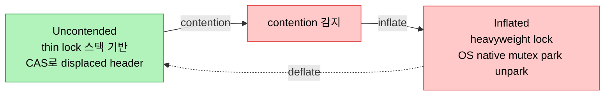
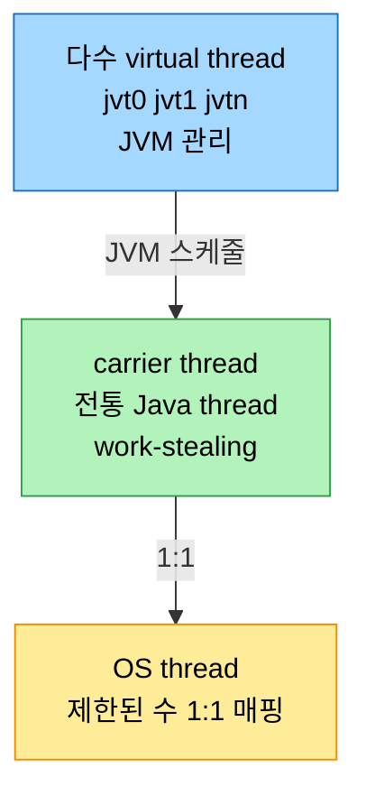

# 락과 동시성 — 동기화부터 Virtual Threads까지

## 1. 들어가며 — monitor lock에서 virtual thread까지

> 멀티스레딩은 현대 프로세서를 온전히 쓰기 위한 필수다. 이 노트는 Java의 동기화 근간인 monitor lock에서 출발해, JDK 11~17의 contended locking 개선과 spin-wait hint를 거쳐, thread-per-task의 한계를 넘는 Executor·ForkJoinPool·CompletableFuture, 그리고 Project Loom의 virtual thread까지 따라간다.

확장성에는 법칙이 있다. 많은 개발자가 아는 Amdahl's law는 작업의 직렬 부분에 초점을 맞춰 병렬화의 한계를 짚지만 현실의 모든 뉘앙스를 담지는 못한다. Gunther의 USL(Universal Scalability Law)은 공유 자원에 대한 contention과 프로세서 간 데이터 일관성을 맞추는 coherency delay를 함께 고려해 더 포괄적인 관점을 준다.

Java 동시성 전략의 중심은 JMM(Java Memory Model)이다. JMM은 thread가 메모리와 상호작용하는 합법적 방식을 정하고 happens-before 관계를 도입한다. thread a가 공유 변수를 수정하고 thread b가 그것을 읽는다면, b가 a의 수정을 관측하도록 happens-before 관계가 수립돼야 한다. 이를 위해 Java는 모든 객체에 내재된 monitor lock으로 배타 접근을 보장하고 thread 사이에 happens-before를 세운다. `synchronized(this) { ... }`나 `synchronized void doActivity()`처럼 쓰며, instance-level 동기화는 non-static 메서드에, class-level은 static 메서드에 적용되고 instance monitor와 class object monitor는 별개다.

## 2. Monitor Lock과 lock의 종류

monitor lock은 mutual exclusion lock으로, 한 번에 한 thread만 lock을 소유해 연관된 synchronized 코드를 실행한다. thread가 synchronized 블록을 만나면 그 객체의 monitor lock 획득을 시도하고, 이미 다른 thread가 보유하면 suspend돼 그 객체의 wait set(lock을 기다리는 thread 모음)에 합류한다. 작업을 마치면 lock을 반환하는데, 그 전에 wait set의 thread 하나를 깨우는 `notify()`나 전부 깨우는 `notifyAll()`을 호출할 수 있다.

lock은 user space 이벤트라 OS에는 voluntary context switch로 보이며, 어느 시점에든 contended이거나 uncontended다. lock contention은 여러 thread가 동시에 lock을 획득하려 할 때 생긴다. thread t가 synchronized 안에서 활성인데 thread u가 진입을 시도하다 t 때문에 대기하면 contention이 발생한다. uncontended 상태에서는 thin lock이 쓰이는데, HotSpot은 CAS로 thread 스택에 생성한 lock record의 포인터를 객체 header word에 넣는다. 이 lock record는 원래 header word와 동기화 객체 포인터로 이뤄지며 이를 displaced header라 한다. contention이 감지되면 이 thin lock이 heavyweight lock으로 inflate되어, OS의 native mutex로 park/unpark하며 contention을 관리한다.

## 3. Locking 발전 (~Java 8)

API 레벨에서는 Java 5의 `ReentrantLock`(`java.util.concurrent.locks`)이 `synchronized`보다 유연한 timed/interruptible lock wait와 fair lock을 주고, 읽기를 동시에 쓰기를 배타로 다루는 `ReadWriteLock`을 가능케 했다. Java 8의 `StampedLock`은 high contention에서 throughput을 높이는 optimistic reading을 제공하며 owner가 없어 아무 thread나 release할 수 있지만 reentrancy를 지원하지 않아 deadlock에 주의해야 한다.

HotSpot VM 레벨에서는 네 가지 최적화가 있다. **Biased locking**(Java 6)은 CAS로 thread ID를 객체 header에 embed해 그 thread가 반복해 lock을 잡을 때 atomic 연산을 없앴지만, bias revocation의 지연이 복잡성을 더해 JDK 15에서 deprecated됐다. **Lock elision**은 escape analysis로 lock 객체가 method/thread를 벗어나지 않으면 lock을 제거하고 값을 register에 보관한다(scalar replacement). **Lock coarsening**은 같은 객체에 대한 다중 synchronized를 단일 coarse lock으로 합쳐, 예컨대 loop 안의 lock을 loop 밖으로 끌어낸다. **Adaptive spinning**(Java 7)은 locked monitor를 만난 thread가 즉시 wait하는 대신 잠깐 spin(busy-wait)해 곧 풀릴 lock을 기다리게 해 멀티프로세서에서 성능을 높인다.

## 4. Contended Locking 개선 (Java 9+)과 측정

> JEP 143은 monitor enter/exit를 가속했다. 이 개선이 실제로 빠른지를 JMH와 async-profiler로 Java 8과 17을 A/B 비교해 확인한다.

JEP 143 Improve Contended Locking(Java 9)은 monitor enter 가속과 monitor exit 효율을 가져왔다. `synchronized`는 bytecode 레벨에서 `monitorenter`와 `monitorexit`로 lock을 획득·반환하며, `wait()` 호출 시 thread가 wait queue로, `notify()`/`notifyAll()` 시 entry queue로 이동한다. Java 8은 `InterpreterRuntime::monitorenter`에서 즉시 불가하면 느린 `ObjectSynchronizer::slow_enter`로 떨어졌지만, Java 17의 `ObjectSynchronizer::enter`는 displaced header에 lock 타입을 표시해 자주 쓰는 경로를 최적화한다. exit도 Java 17의 `ObjectSynchronizer::exit`가 더 빠른 경로를 타며, JDK 17은 `quick_notify`로 wait queue에서 enter queue로의 이동을 신속히 한다.

이 개선을 Ch5의 방법론으로 측정한다. nested synchronized로 호출당 `monitorenter`·`monitorexit`를 각 2회 부르는 JMH 마이크로벤치마크 `testRecursiveLockUnlock`을 Java 8(baseline)과 17에서 돌린다. 공정한 비교를 위해 `-XX:-UseBiasedLocking`으로 Java 8의 bias를 무효화하고, `-XX:+UseHeavyMonitors`로 stack-based locking을 제외하며, GC 전략을 통일한다. async-profiler를 flamegraph·call tree 모드로 함께 쓴다.

| 항목 | Java 17 | Java 8 |
|------|---------|--------|
| Score (ns/op) | 7002.294 | 11198.681 |
| Error (ns/op) | ±86.289 | ±27.607 |
| monitor inclusive samples | 5458 (enter 4397 + exit 1061) | 6670 (enter 3344 + exit 3326) |
| testRecursiveLockUnlock exclusive | 3856 | 2678 |

개선율은 (11198.681 − 7002.294) / 11198.681 × 100 ≈ **37.47%**다. call tree를 보면 Java 8은 `ObjectSynchronizer::slow_enter`·`ThreadInVMfromJavaNoAsyncException` 같은 lock 관련 메서드가 더 많고 stack도 깊은 반면, Java 17의 `monitorenter` stack은 `ObjectSynchronizer::enter`·`JavaThread::is_lock_owned` 정도이고 `monitorexit` stack은 `ObjectSynchronizer::exit` 하나다. exclusive time이 Java 17에서 더 높은 것은, 같은 시간에 lock 오버헤드가 줄어 synchronized 안의 실제 작업(`dummyInt` 증가)에 더 많은 시간을 쓴다는 뜻이다.

## 5. Spin-Wait Hints

대부분의 개발자가 직접 쓰지는 않지만, spin-wait hint는 high-load 서버와 compute-intensive 클라우드 애플리케이션에서 thread가 lock을 기다리는 방식을 최적화해 CPU 소비와 불필요한 context switch를 줄인다. MP 시스템(x86-64)에서 lock이 잡힌 변수에 다른 thread가 접근하면 busy-wait loop(spin-loop)에 들어가 active polling을 한다. 즉시 lock을 잡을 수 있다는 장점이 있지만 기다리는 동안 power를 소비하고, 프로세서의 pipeline speculation 때문에 lock을 획득하면 pipeline flush 페널티가 든다.

SSE2가 spin-loop를 힌트하고 정해진 delay를 더하는 PAUSE 명령을 도입했고, Java 9는 `java.lang.Thread.onSpinWait()`로 이를 받아들여 지원 CPU에서 PAUSE를 intrinsic하게 호출한다(JEP 285). non-Intel이나 PAUSE 이전 Intel에서는 NOP로 처리돼 호환된다. 이런 intrinsic은 아키텍처 특화 assembly stub으로 JIT 코드를 강화하는 것으로, SIMD vectorization이나 auto-vectorization으로 효율을 높인다.

## 6. Thread-per-Task를 넘어 — Executor·ForkJoinPool·CompletableFuture

> 태스크마다 새 thread를 만드는 thread-per-task는 단명 태스크가 많으면 자원을 너무 쓴다. Java는 thread pool, work-stealing, 비동기 조합으로 이를 넘어선다.

전통적으로 Java thread는 OS thread에 1:1로 매핑되어, 각자 Java stack·PC register·native stack을 가지며 OS가 스케줄링을, Java가 동기화를 맡는다. 문제는 Java thread가 blocked되면 대응하는 OS thread도 block돼 확장성이 떨어진다는 것이다.

이를 넘는 첫 도구가 Executor Service다. worker thread pool을 관리해 태스크마다 새 thread를 만드는 대신 pool의 기존 thread를 쓴다. `Executors.newFixedThreadPool(10)`으로 만들고 `execute()`로 태스크를 넘기면, blocking queue가 태스크를 보유하고 pool의 thread가 처리하며 처리할 게 없으면 CPU를 쓰지 않고 queue에서 대기한다. ForkJoinPool(Java 7)은 작은 태스크로 분할할 수 있는 프로그램의 효율을 높인다. 각 worker가 double-ended queue를 갖고, 태스크가 떨어진 worker가 바쁜 worker의 deque에서 태스크를 가져오는 work-stealing으로 멀티프로세서를 온전히 쓴다. `RecursiveAction`을 상속해 `compute()`에서 임계 이하면 직접 처리하고 그보다 크면 `invokeAll`로 둘로 쪼개는 식이다.

CompletableFuture(Java 8)는 future 계산을 제어된 방식으로 완료하며 함수형으로 태스크를 조합한다. `Future`와 달리 수동으로 완료할 수 있고 Streams API와 통합되며 에러 핸들링이 강하다. 표준 thread pool 위의 wrapper로, `CompletableFuture.runAsync`로 태스크를 비동기 실행하고 `CompletableFuture.allOf(...).join()`으로 여러 future가 모두 끝날 때까지 기다린다.

## 7. Virtual Threads와 Continuation (Project Loom)

JDK 21의 Project Loom(JEP 444)은 동시성을 다시 그린다. virtual thread는 OS가 아니라 JVM이 관리하는 경량 thread로, JVM이 OS보다 훨씬 효율적으로 생성·전환한다. 낮은 메모리 footprint와 빠른 start-up 덕에 강한 동시성을 요구하는 태스크에 알맞다.

virtual thread는 carrier thread(OS thread에 1:1 매핑된 전통 Java thread)에 스케줄되고, JVM이 carrier를 여러 virtual thread 사이에서 전환한다. virtual thread는 자신이 어느 carrier에 올라 있는지 모르며, exception이 나도 stack trace에 carrier frame이 섞이지 않고 thread-local도 분리된다. JEP 444는 virtual thread를 pool하지 말라고 명시하는데, 스케줄링은 JVM이 알아서 한다. 기존 API와 매끄럽게 통합돼 `Executors.newVirtualThreadPerTaskExecutor()`로 태스크를 submit하거나 `CompletableFuture.runAsync(task, executor)`로 병렬 실행할 수 있고, 스케줄링 병렬성은 carrier thread 수(기본은 available processors, `jdk.virtualThreadScheduler.parallelism`로 튜닝)로 정해진다.

virtual thread의 구현 기반은 continuation이다. continuation은 중단·재개할 수 있는 계산, 곧 저장된 stack frame이다. 전통 thread가 blocked돼도 자원을 쓰는 것과 달리 virtual thread는 실제 작업할 때만 자원을 쓰는데, 이것이 경량성의 비결이다. virtual thread가 lock을 기다리며 blocked되면 JVM이 그 상태를 continuation으로 저장하고 다른 virtual thread를 실행하다가, blocking이 끝나면 continuation을 다시 불러 재개한다. 이 모든 과정은 JVM이 처리하므로 개발자에게는 숨겨진다.

## 8. 면접 대비 요약

### 한 줄 정의

Java의 동기화는 모든 객체에 내재된 monitor lock(uncontended thin lock ↔ contended heavyweight lock)에 기반하며, JDK 11~17의 contended locking 개선과 virtual thread(Loom)가 멀티스레드 성능과 확장성을 끌어올렸다.

### 핵심 포인트 3가지

1. **thin lock과 heavyweight lock** — uncontended는 CAS로 displaced header를 쓰는 thin lock이, contention이 감지되면 OS native mutex를 쓰는 heavyweight lock으로 inflate된다. biased locking은 JDK 15에서 deprecated됐다.
2. **측정으로 확인한 개선** — JEP 143의 monitor enter/exit 최적화로 Java 17이 Java 8보다 `testRecursiveLockUnlock`에서 약 37.47% 빠르다. call tree에서 더 얕은 stack과 적은 메서드 호출로 드러난다.
3. **virtual thread는 carrier 위에서 continuation으로** — JVM이 관리하는 경량 thread가 carrier thread에 스케줄되고, blocked되면 continuation으로 저장됐다 재개된다. pool하지 않으며 기존 API와 통합된다.

### 면접에서 받을 만한 질문

1. thin lock(uncontended)과 heavyweight lock(contended)의 차이와 inflate 시점은?
2. biased locking은 무엇이고 왜 JDK 15에서 deprecated됐는가?
3. `onSpinWait()`와 PAUSE 명령이 spin-loop를 어떻게 최적화하는가?
4. ForkJoinPool의 work-stealing이란 무엇인가?
5. virtual thread와 carrier thread의 관계, 그리고 continuation의 역할은?

## 정답 (자답 후 펼치기)

### 정답 1 — thin lock vs heavyweight lock

uncontended 상태에서는 thin lock을 쓴다. CAS로 thread 스택에 만든 lock record의 포인터를 객체 header word에 넣는데, 이 lock record가 원래 header word와 객체 포인터를 담은 displaced header다. interpreter와 JIT 코드에 통합돼 가볍게 동작한다. contention이 감지되면 이 thin lock이 heavyweight lock으로 inflate되어, OS의 native mutex로 park/unpark하며 contention을 관리한다.

### 정답 2 — biased locking과 deprecation

biased locking(Java 6)은 같은 thread가 lock을 반복해 잡는 경우를 위해, CAS로 thread ID를 객체 header에 embed해 이후 그 thread의 접근에서 atomic 연산을 없앤 최적화다. 그러나 다른 thread가 lock을 잡으려 할 때 일어나는 bias revocation의 지연이 예측 불가한 성능을 낳았고, 현대 하드웨어·소프트웨어 패턴에서 이점이 줄어 JDK 15에서 deprecated됐다.

### 정답 3 — onSpinWait와 PAUSE

spin-loop에서 thread가 busy-wait하면 power를 소비하고, 프로세서의 pipeline speculation 때문에 lock을 획득할 때 pipeline flush 페널티가 든다. SSE2의 PAUSE 명령은 spin-loop임을 힌트해 정해진 delay를 더함으로써 이 비용을 줄인다. Java 9의 `Thread.onSpinWait()`는 지원 CPU에서 이 PAUSE를 intrinsic하게 호출하고, 지원하지 않는 CPU에서는 NOP로 처리돼 호환된다.

### 정답 4 — work-stealing

ForkJoinPool에서 각 worker thread는 자기 double-ended queue를 갖고 태스크를 처리한다. 어떤 worker가 자기 큐의 태스크를 다 처리해 idle해지면, 아직 바쁜 다른 worker의 deque에서 태스크를 가져와(steal) 처리한다. 이 work-stealing이 worker 사이의 부하를 고르게 맞춰 멀티프로세서를 온전히 활용하게 한다.

### 정답 5 — virtual thread·carrier·continuation

virtual thread는 JVM이 관리하는 경량 thread로, OS thread에 1:1 매핑된 carrier thread 위에 스케줄된다. JVM이 하나의 carrier를 여러 virtual thread 사이에서 전환한다. continuation은 중단·재개 가능한 계산(저장된 stack frame)으로, virtual thread가 lock 대기 등으로 blocked되면 JVM이 그 상태를 continuation으로 저장하고 carrier를 다른 virtual thread에 내준다. blocking이 끝나면 continuation을 불러 재개하므로, virtual thread는 실제 작업할 때만 자원을 쓴다.

## 관련 문서

- [`./01-01.문자열 런타임 최적화`](./01-01.문자열%20런타임%20최적화.md) — 같은 장 전반부: string pool·dedup·indy-fication·compact string
- [`../ch14_jpe-evolution/01-01.Java와 JVM의 성능 진화사`](../ch14_jpe-evolution/01-01.Java와%20JVM의%20성능%20진화사.md) — contended locking·virtual thread 도입 연대기
- [`../ch18_jpe-perf-eng/01-02.동기화와 NUMA, JMH 벤치마킹`](../ch18_jpe-perf-eng/01-02.동기화와%20NUMA,%20JMH%20벤치마킹.md) — JMH·atomic·happens-before·CAS
- [`../ch03_gc/02-05.저지연 가비지 컬렉터`](../ch03_gc/02-05.저지연%20가비지%20컬렉터.md) — 동시성과 맞물리는 저지연 GC
- [`../README`](../README.md) — JVM 학습 인덱스
