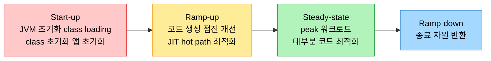
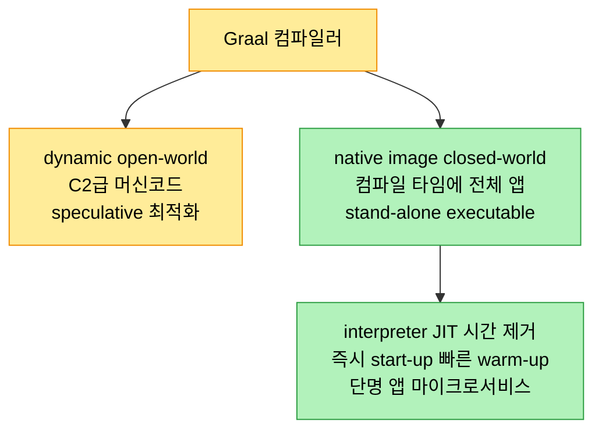

# 시동 가속 — CDS·AOT·Leyden·GraalVM·CRaC

## 1. 들어가며 — time to steady state라는 지표

> 단명 애플리케이션과 마이크로서비스에서는 JVM이 얼마나 빨리 켜지고 얼마나 빨리 최고 성능에 이르느냐가 곧 성능이다. 그 구간을 줄이는 기술이 CDS·AOT·Project Leyden·GraalVM·CRaC다.

start-up과 warm-up은 자주 섞여 쓰이지만 뉘앙스가 다르다. warm-up은 JVM이 코드를 효과적으로 최적화할 만큼 프로파일 데이터를 모으는 시간으로, 런타임 행동에 기대는 JIT 컴파일에 특히 중요하다. ramp-up은 애플리케이션이 full 운영 용량이나 성능에 이르는 시간으로, 코드 최적화뿐 아니라 자원 할당과 시스템 안정화까지 아우른다.

start-up은 좁게는 JVM 호출에서 `Application.main`이 실행되기 시작할 때까지를 가리키며, JVM bootstrapping·bytecode loading·bytecode verification·preparation 단계로 이뤄진다. 그러나 저자의 동료 Ludovic Henry가 짚었듯 이 정의는 제한적이다. 넓게 보면 start-up은 `main` 실행 너머, 애플리케이션이 주 목적을 수행하기 시작할 때까지를 포함한다. 웹 서비스라면 JVM 초기화뿐 아니라 서비스가 요청을 처리하기 시작할 때까지인데, 명령행 인자·설정 파싱이나 소켓·파일 셋업이 추가 class loading과 JIT를 부르며 ramp-up으로 흘러든다.

## 2. JVM start-up의 세 단계와 애플리케이션 라이프사이클

JVM bootstrapping은 JVM을 kick-start하고 런타임 환경을 셋업한다. 명령행 인자를 파싱하고, JVM 코드를 메모리에 로드하고, 내부 자료구조를 초기화하고, 메모리 관리를 셋업하고, 초기 Java thread를 세운다. bytecode loading 단계에서는 `main`을 담은 클래스와 그것이 참조하는 클래스, 표준 라이브러리의 시스템 클래스를 class loader가 `.class`에서 읽어 JVM이 실행할 수 있는 형식으로 바꾼다. bytecode verification·preparation 단계에서는 로드된 bytecode의 포맷과 타입 시스템을 검증하고, 클래스 변수에 메모리를 할당해 기본값으로 초기화하며 static 초기화 블록을 실행한다. 예컨대 `Course` 클래스의 `static { courseDetails = new HashMap<>(); ... }` 블록이 이 단계에서 돈다.



start-up 너머의 라이프사이클은 ramp-up·steady-state·ramp-down·application stop으로 이어진다. ramp-up에서는 JVM이 bytecode를 native로 해석하다 hot path를 찾아 JIT 컴파일하고, 특정 작업용 클래스를 추가로 로드하며, 자주 접근하는 데이터로 캐시를 채운다(cache warming). steady-state는 대부분의 코드가 최적화돼 peak에서 주 워크로드를 도는 구간이다. start-up에서 steady-state까지의 구간을 "time to steady-state"라 부르며, 단명 앱이나 serverless 환경에서 특히 중요한 지표다. 효율적인 state 관리는 이 구간을 줄여 성능을 높이고 메모리 footprint를 줄이며 자원 활용을 개선한다.

## 3. Class Data Sharing (CDS)

CDS는 class file을 전처리해 내부 형식으로 바꾼 뒤 여러 JVM 인스턴스가 공유하게 해 start-up을 가속한다. shared archive file은 메타데이터를 담는 MiscData space와 실제 class 데이터를 담는 ReadWrite·ReadOnly space로 구조화돼 있다. JVM이 시작될 때 이 archive를 프로세스 공간에 memory-map하는데, 이미 JVM 내부 형식이라 변환 없이 직접 쓸 수 있어 start-up 시간이 더 준다.

CDS의 이점은 단일 인스턴스를 넘는다. 같은 머신의 여러 JVM 프로세스가 같은 archive를 memory-map해 물리 메모리 페이지를 공유하므로 전체 footprint가 줄고, 첫 JVM이 이미 로드해 둔 덕에 후속 JVM의 start-up도 빨라진다. 이는 이벤트에 빠르게 함수가 떠야 하는 serverless 환경에 값지다. `-XX:ArchiveClassesAtExit`로 앱이 로드한 클래스를 동적으로 dump할 수도 있다. 기본 사용은 두 단계다.

```
java -Xshare:dump -XX:SharedArchiveFile=my_app_cds.jsa -cp my_app.jar
java -Xshare:on -XX:SharedArchiveFile=my_app_cds.jsa -cp my_app.jar MyMainClass
```

## 4. AOT Compilation

> JIT는 실행 중에 프로파일을 모아 최적화하므로 워밍업 지연이 있다. AOT는 JVM 호출 *전*에 메서드를 native로 컴파일해 그 지연을 없애려 한다.

AOT(ahead-of-time) 컴파일은 JDK 9에서 도입돼, JVM이 호출되기 전에 메서드를 native code로 컴파일한다. native code가 미리 준비돼 bytecode 해석을 기다릴 필요가 없으므로, JIT가 충분히 최적화할 시간이 없는 단명 앱에 유리하다. HotSpot은 항상 interpreted 모드로 시작하고 JIT가 프로파일을 모으는 데 시간이 걸려 지연이 생기는데, AOT는 precompiled 메서드와 공유 라이브러리로 이 warm-up 문제를 푼다.

JDK 9의 AOT는 experimental이었고 Java로 작성된 동적 컴파일러 Graal 위에 세워졌다. C++로 작성된 HotSpot이 Graal을 지원하려면 JVMCI(JVM compiler interface, JEP 243)가 필요했고, `java.base`·`jdk.compiler` 같은 알려진 라이브러리에 우선 적용됐다(JEP 295). AOT는 non-tiered(기본, 응답성)와 tiered 두 레벨로 동작했는데, tiered는 client+프로파일인 T2 수준이고 AOT invocation threshold를 넘으면 client T3로 재컴파일·full 프로파일을 거쳐 server T4로 재컴파일됐다. CDS와 병용하면 class 메타데이터 공유와 precompiled 코드가 합쳐져 start-up과 footprint를 더 줄였다.

다만 HotSpot의 AOT에는 한계가 있었다. AOT 코드는 shared library에 저장돼야 해서 position-independent code(PIC)를 요구했는데, 코드가 메모리의 어디에 로드될지 미리 정할 수 없어 위치 기반 최적화를 못 했기 때문이다. 반면 JIT는 실행 환경을 더 가정할 수 있어 심볼을 직접 참조하고 indirection 없이 효율적인 코드를 만든다. 다만 JIT 최적화는 실행 중에 컴파일이 일어나 start-up을 늘린다. GraalVM의 AOT는 PGO(profile-guided optimization)로 JIT급 peak에 이르고 closed-world 가정 최적화와 100% 코드 컴파일로 이 한계 일부를 넘는다.

## 5. Project Leyden

별도 AOT 컴파일러를 유지하는 복잡성과 Graal 의존, PIC의 비효율이 이점을 가려, HotSpot에는 다른 접근이 필요해졌다. 그 결과가 Project Leyden이다. JDK 17에서 도입된 Leyden은 Java의 느린 start-up, 느린 time-to-peak, 큰 footprint를 함께 다뤄 start-up에서 steady-state까지 전체 라이프사이클을 최적화한다.

Leyden의 핵심은 "training run"이다. CDS에서 전처리 클래스 archive를 만드는 단계와 비슷하게, training run은 start-up과 warm-up 동안의 애플리케이션 행동(메서드 호출·자원 할당)을 캡처해 그 앱에 맞춘 커스텀 런타임 이미지를 만든다. 짧은 런타임 탓에 JIT가 충분히 최적화하지 못하는 앱에서 특히 예측 가능한 성능을 준다. Leyden은 또 condensers를 들이는데, 계산을 가장 최적의 시점으로 옮겨 프로그램의 본질을 보존하면서 개발자가 성능을 특정 기능보다 우선할 유연성을 준다. 예컨대 `OnlineLearningPlatform`을 Leyden으로 최적화하면 `loadAllStudentsFromImage()`·`initializeCoursesFromImage()`처럼 전처리 이미지에서 클래스를 불러오고, `Course`의 static 블록이 `ImageLoader.loadCourseDetails()`로 채워지며, `Instructor.teachOptimized()`가 JIT 최적화된 메서드가 된다.

## 6. GraalVM과 native image

GraalVM은 Java·Scala·Kotlin 같은 JVM 언어와 Ruby·Python·WebAssembly 같은 non-JVM 언어를 함께 지원하는 polyglot VM으로, start-up과 warm-up 시간을 크게 줄인다. 핵심인 Graal 컴파일러는 HotSpot처럼 dynamic·open-world 실행을 노려 C2급 머신코드를 만들고, dynamic·speculative 최적화로 프로그램 행동을 예측하되 빗나가면 de-optimize·recompile한다.



GraalVM의 진짜 무기는 closed-world 최적화를 위한 native image다. 컴파일 타임에 전체 애플리케이션이 알려져 있으므로, 앱과 필수 라이브러리, 최소 런타임을 담은 stand-alone executable을 만든다. JVM의 interpreter와 JIT에 드는 시간을 사실상 없애 즉시 start-up과 빠른 warm-up을 주는데, 단명 앱과 마이크로서비스에는 패러다임 전환이다. 최근 버전은 `native-image -jar your-app.jar` 한 줄로 precompiled stand-alone executable을 만들 만큼 과정이 간소해졌다. GraalVM은 Truffle 프레임워크 위의 Java 인터프리터인 Java on Truffle(`java -truffle`)도 제공해 JIT·AOT를 보완한다.

## 7. CRIU와 Project CRaC — Checkpoint/Restore

> CDS·Leyden·GraalVM이 코드를 미리 컴파일한다면, CRIU/CRaC는 *실행 중인 프로세스의 상태 자체*를 얼려 두었다가 그 지점에서 되살린다.

CRIU(Checkpoint/Restore in Userspace)는 Virtuozzo가 만들어 오픈소스화한 Linux 도구로, OpenVZ의 live migration을 위해 설계됐다. 활성 애플리케이션을 잠깐 freeze해 checkpoint를 하드디스크 파일로 저장하고, 나중에 그 얼어붙은 상태에서 변경이나 특정 설정 없이 되살린다. `criu dump -t [PID] -D /checkpoint/directory`로 checkpoint하고 `criu restore -D /checkpoint/directory`로 복원한다. Red Hat이 이를 OpenJDK의 stand-alone 프로젝트로 들여, Java 앱의 state를 freeze·저장·복원해 시스템 간 마이그레이션이나 디버깅, 스냅샷에 쓰게 했다.

Project CRaC(Coordinated Restore at Checkpoint)는 CRIU의 checkpoint/restore를 JVM에 통합하려는 초기 단계 프로젝트다. 애플리케이션이 `Resource` 인터페이스를 구현해 `beforeCheckpoint`와 `afterRestore`로 checkpoint 전후의 동작을 정의하고, `Core.getGlobalContext().register(...)`로 CRaC의 global context에 등록한다. Java 앱이 checkpoint를 요청하면 CRaC가 CRIU에 알려 프로세스를 freeze하고 state를 image file로 저장하며, restore 시 그 image로 checkpoint 상태를 복원한다. CRIU를 JVM에 통합하는 일은 JVM 내부 구조와 OS 협조가 필요해 복잡하지만, start-up 시간을 줄이고 새로운 사용 사례를 여는 잠재력이 크다.

serverless에서는 dormant 함수가 호출될 때 자원 할당·런타임 초기화·앱 launch가 일어나는 cold start 문제가 JVM start-up·class loading·JIT 탓에 두드러진다. CDS와 JIT 개선이 이를 완화하고, AWS Lambda·Azure Functions에서 JVM 옵션을 튜닝할 수 있다. JDK 21 기준 아직 evolving 중인 Leyden은 training run의 precomputed state로, CRaC는 특정 세그먼트 checkpoint로 cold start를 줄일 길을 연다. container 환경에서는 minimal base Docker image, container 메모리 limit에 맞춘 JVM 설정, Docker 레이어 캐싱, health check가 빠른 start-up·ramp-up을 돕는다.

## 8. 면접 대비 요약

### 한 줄 정의

time to steady-state는 start-up에서 peak 성능까지의 구간으로, CDS(class 전처리 공유)·AOT(사전 native 컴파일)·Project Leyden(training run)·GraalVM(native image)·CRaC(checkpoint/restore)가 이를 줄여 단명 앱과 serverless의 cold start를 완화한다.

### 핵심 포인트 3가지

1. **세 단계 라이프사이클** — start-up(JVM bootstrapping·bytecode loading·verification)에서 ramp-up(JIT가 hot path 최적화)을 거쳐 steady-state(peak)에 이른다. 그 구간이 time to steady-state다.
2. **CDS와 AOT** — CDS는 class file을 전처리해 여러 JVM이 memory-map으로 공유한다. AOT는 JVM 호출 전 native로 컴파일하나 PIC 제약이 있어, HotSpot에서는 복잡성 때문에 Leyden으로 대체됐다.
3. **이미지와 체크포인트** — GraalVM native image는 closed-world로 stand-alone executable을 만들어 interpreter·JIT 시간을 없앤다. CRIU/CRaC는 실행 중 프로세스 상태를 freeze·restore한다.

### 면접에서 받을 만한 질문

1. warm-up과 ramp-up은 어떻게 다른가?
2. CDS가 start-up을 빠르게 하는 원리와 multi-instance 이점은?
3. AOT가 PIC를 요구하는 이유와 그로 인한 한계는?
4. Project Leyden의 training run이 무엇이고 CDS와 어떻게 닮았나?
5. GraalVM native image의 closed-world 가정이 무엇을 가능케 하는가?

## 정답 (자답 후 펼치기)

### 정답 1 — warm-up vs ramp-up

warm-up은 JVM이 코드를 효과적으로 최적화할 만큼 프로파일 데이터를 모으는 시간으로, 런타임 행동에 기대는 JIT 컴파일에 특히 관계된다. ramp-up은 애플리케이션이 full 운영 용량이나 성능에 이르는 시간으로, 코드 최적화뿐 아니라 자원 할당과 시스템 안정화까지 포함하는 더 넓은 개념이다.

### 정답 2 — CDS 원리와 multi-instance

CDS는 class file을 전처리해 JVM 내부 형식으로 바꾼 archive를 만든다. JVM 시작 시 이를 프로세스 공간에 memory-map하면 변환 없이 직접 쓸 수 있어 class 로딩 시간이 줄어든다. multi-instance에서는 같은 머신의 여러 JVM이 같은 archive를 memory-map해 물리 메모리 페이지를 공유하므로 전체 footprint가 줄고, 첫 JVM이 이미 로드해 둔 덕에 후속 JVM의 start-up도 빨라진다.

### 정답 3 — AOT와 PIC

AOT 코드는 shared library에 저장돼야 하는데, 그 라이브러리가 메모리의 어디에 로드될지 미리 알 수 없으므로 position-independent code(PIC)로 만들어야 한다. 그래서 AOT 컴파일러는 위치 기반 최적화를 할 수 없다. 반면 JIT는 실행 환경을 더 가정할 수 있어 심볼을 직접 참조하고 indirection 없이 더 효율적인 코드를 만든다. 이 한계와 유지보수 복잡성 때문에 HotSpot의 AOT는 Leyden으로 대체됐다.

### 정답 4 — training run

training run은 start-up과 warm-up 동안의 애플리케이션 행동(메서드 호출·자원 할당)을 캡처해, 그 앱에 맞춘 커스텀 런타임 이미지를 만드는 Leyden의 단계다. CDS가 전처리한 클래스 archive를 만드는 것과 닮았는데, training run은 클래스뿐 아니라 런타임 행동까지 기록해 더 빠른 start-up과 peak 도달을 노린다. JIT가 짧은 런타임으로 충분히 최적화하지 못하는 앱에 특히 유용하다.

### 정답 5 — closed-world 가정

native image는 컴파일 타임에 애플리케이션 전체가 알려져 있다고 가정하는 closed-world 모델이다. 모든 도달 가능한 코드를 미리 알 수 있으므로, 앱과 필수 라이브러리·최소 런타임을 담은 stand-alone executable로 만들고 JIT setting에서는 불가능한 최적화를 적용한다. interpreter와 JIT에 드는 시간을 사실상 없애 즉시 start-up과 빠른 warm-up을 주며, 100% 코드를 컴파일해 cold 코드가 interpreted로 남지 않는다.

## 관련 문서

- [`./01-02.HotSpot warm-up 최적화와 Metaspace`](./01-02.HotSpot%20warm-up%20최적화와%20Metaspace.md) — 같은 장 후반부: 컴파일러 단계별·Segmented CodeCache·Metaspace
- [`../ch14_jpe-evolution/01-01.Java와 JVM의 성능 진화사`](../ch14_jpe-evolution/01-01.Java와%20JVM의%20성능%20진화사.md) — PermGen→Metaspace·code cache·tiered compilation 도입
- [`../ch02_automatic-memory-management/05-03.문자열 런타임 최적화`](../ch02_automatic-memory-management/05-03.문자열%20런타임%20최적화.md) — invokedynamic BSM(start-up이 다루는 부트스트랩 메서드)
- [`../ch17_jpe-logging/01-01.통합 JVM 로깅 — Xlog와 비동기 로깅`](../ch17_jpe-logging/01-01.통합%20JVM%20로깅%20—%20Xlog와%20비동기%20로깅.md) — start-up·GC 시간 측정 로깅
- [`../README`](../README.md) — JVM 학습 인덱스
