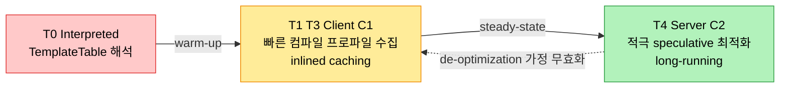
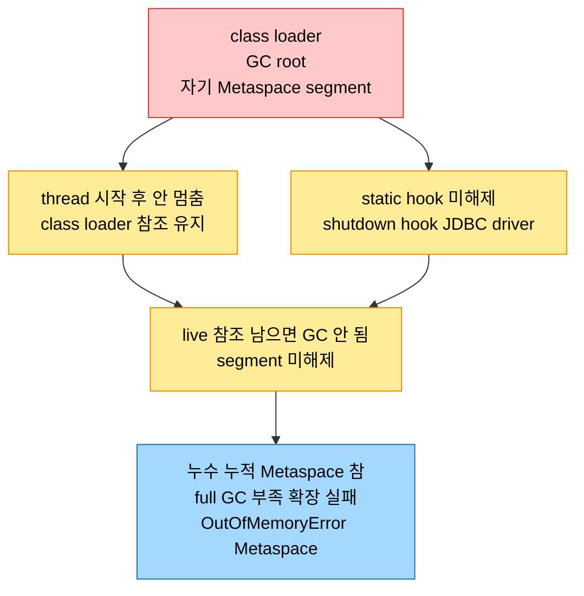

# HotSpot warm-up 최적화와 Metaspace

## 1. 들어가며 — 컴파일러가 단계마다 다르게 일한다

> HotSpot은 라이프사이클의 단계마다 다른 최적화를 쓴다. start-up에는 빠른 C1과 interpreter를, warm-up에는 tiered compilation과 adaptive optimization을, steady-state에는 speculative한 C2를 동원한다. 그 코드를 담는 Segmented CodeCache와, 클래스 메타데이터를 담는 Metaspace가 그 토대다.

마이크로서비스와 serverless처럼 빈번한 재시작과 transient한 수명을 가진 환경에서는 초기화·warm-up·steady-state 도달의 효율이 응답성을 좌우한다. HotSpot은 JIT 컴파일, adaptive·tiered compilation, client·server 컴파일러의 전략적 선택으로 이를 다룬다.

## 2. start-up 최적화 — interpreter와 C1

start-up은 주로 느린 tier가 맡고, JVM이 `invokedynamic`의 bootstrap method와 class initializer도 처리한다. 먼저 Java 프로그램이 플랫폼 무관한 bytecode로 변환되고(bytecode generation), 그 bytecode가 TemplateTable(bytecode 명령어와 머신코드 시퀀스의 매핑)에 따라 해석된다(interpretation). 그다음 C1(client) JIT 컴파일러가 빠른 컴파일과 기본 최적화를 균형 잡아 bytecode를 native로 바꾸는데, 이때 프로파일 정보를 모아 뒤이을 C2의 적극적 최적화에 넘긴다. C1 컴파일은 여러 번 호출되는 메서드에 특히 유리해, 같은 bytecode를 반복 해석하는 오버헤드를 던다. 이렇게 만든 코드와 프로파일은 Segmented CodeCache에 저장되며, Profiled segment는 가볍게 최적화된 단명 메서드를, Non-method segment는 bytecode interpreter 같은 비메서드 코드를, Non-profiled segment는 완전히 최적화된 메서드를 담는다.

## 3. warm-up과 steady-state 최적화

> warm-up은 tiered compilation으로 빠른 start-up과 peak 성능 사이를 오가고, steady-state는 speculative optimization으로 미래 실행 경로를 예측하되 틀리면 되돌린다.

warm-up의 핵심은 tiered compilation이다. 코드가 T0(interpreted code)에서 T4(최고 최적화)로 옮겨가며, JVM이 초기에는 빠르지만 덜 최적화된 레벨로 빠른 start-up을 보장하고 실행이 이어지면 더 적극적인 최적화로 높은 peak 성능을 노린다. JIT 컴파일된 코드는 adaptive optimization을 거쳐 더 최적화되거나 on-stack replacement(OSR)된다. 자주 호출되는 메서드는 더 최적화되고 대체된 것은 de-optimize되어 자원이 재할당된다. 또 작고 자주 호출되는 메서드를 호출하는 메서드 안에 끼워 넣는 inlined caching이 메서드 호출 오버헤드를 줄이는데, 이는 warm-up 동안 모은 프로파일에 기반한다.

steady-state에서는 long-running 앱을 위한 고급 기법이 동원된다. speculative optimization은 warm-up에서 쌓은 프로파일로 유력한 실행 경로를 예측해 그에 맞춰 코드를 최적화하고, 예측이 틀리면 덜 최적화된 이전 버전으로 우아하게 되돌려 무결성을 지킨다. 이와 짝을 이루는 de-optimization은 새로 로드된 클래스가 이미 최적화된 메서드를 override하는 것처럼 전제가 무효화될 때 JIT 최적화를 되돌린다. long-running 앱에서는 프로파일을 등에 업은 server compiler(C2)가 성능 critical 메서드에 적극적·speculative 최적화를 적용한다.

이 코드를 담는 Segmented CodeCache는 자주 실행되는 코드를 우선 저장한다. Code ByteBuffer가 컴파일된 코드를 Segmented CodeCache로 옮기기 전 중간 저장소 역할을 하며, segment마다 사용량에 따라 독립적으로 크기를 잡는다. Project Leyden은 이 Segmented CodeCache를 archive에서 직접 로드해, start-up과 warm-up의 tiered 컴파일을 우회하고 precompiled 코드를 곧장 올려 start-up을 크게 줄일 예정이다.

## 4. PermGen에서 Metaspace로

Java 8 이전에는 클래스 메타데이터와 static을 저장하는 PermGen(Permanent Generation)이 있었는데, 고정 크기라 공간이 부족하면 `OutOfMemoryError: PermGen space`가 났다. 고정된 PermGen은 start-up 시 메모리를 할당·해제해야 해 start-up을 느리게 했다. Java 8은 이를 Metaspace로 교체했다. Metaspace는 연속된 heap 공간이 아니라 native memory에 위치하며 기본적으로 자동으로 성장하고 최대 한계가 가용 native memory 양이라 PermGen보다 훨씬 크다.

이 동적 성장 덕에 warm-up 동안 demand에 빠르게 적응하고, Metaspace가 차면 full GC가 미사용 class loader와 클래스를 정리하며 그래도 부족하면 확장한다. steady-state에서는 고정 메모리 제약이 사라져 메모리를 효율적으로 관리한다. 다만 Metaspace도 메모리 누수에 면역은 아니다. class loader가 부적절하게 관리되면 `OutOfMemoryError: Metaspace`가 날 수 있다.

각 class loader는 자기 Metaspace segment에 클래스 메타데이터를 로드하고, GC되면 그 segment가 해제된다. 그러나 class loader나 그것이 로드한 클래스에 live 참조가 남으면 class loader가 GC되지 않아 메모리가 풀리지 않는다. class loader가 로드한 클래스가 thread를 시작하고 그 thread가 안 멈추거나, static hook(shutdown hook·JDBC driver)을 등록하고 해제하지 않으면 참조가 유지된다. class loader는 GC root라, 그것이 alive인 한 로드한 모든 클래스와 참조 객체도 alive로 간주돼 회수되지 않는다. 누수가 쌓여 Metaspace가 차면 full GC가 돌고, 부족하면 확장을 시도하다 native memory가 모자라면 에러가 난다.

Metaspace는 `-XX:MetaspaceSize`(초기 크기)·`-XX:MaxMetaspaceSize`(최대, 미지정 시 native memory까지)·`-XX:MinMetaspaceFreeRatio`·`-XX:MaxMetaspaceFreeRatio`(GC 후 free space 임계로 shrink·grow)로 제어하고, VisualVM·JConsole·Java Mission Control로 모니터링한다. Java 16의 JEP 387 Elastic Metaspace는 미사용 class-metadata 메모리를 OS에 반환하고 footprint를 줄이며 codebase를 단순화하는 것을 목표로, 크기 기반 블록을 조직하는 buddy-based allocation, 필요할 때만 커밋하는 lazy memory commitment, 세밀한 segment로 내부 단편화를 줄이는 granular memory management, 미사용 메모리를 신속히 OS에 반환하는 revamped reclamation policy를 들였다.

## 5. 면접 대비 요약

### 한 줄 정의

HotSpot은 start-up에 interpreter·C1을, warm-up에 tiered compilation·adaptive optimization을, steady-state에 speculative한 C2를 쓰며, 코드는 Segmented CodeCache에, 클래스 메타데이터는 native memory의 Metaspace(JEP 387 Elastic Metaspace)에 담는다.

### 핵심 포인트 3가지

1. **단계마다 다른 컴파일러** — start-up은 TemplateTable 해석과 빠른 C1, warm-up은 T0~T4 tiered compilation과 inlined caching, steady-state는 speculative optimization과 적극적 C2다. de-optimization으로 전제가 깨지면 되돌린다.
2. **Segmented CodeCache** — Profiled·Non-method·Non-profiled segment로 나뉘고 Code ByteBuffer를 거쳐 채워진다. Leyden은 이를 archive에서 직접 로드해 start-up을 줄일 예정이다.
3. **PermGen→Metaspace** — 고정 크기 PermGen을 native memory의 동적 Metaspace로 바꿔 `OutOfMemoryError: PermGen space`를 없앴다. 단 class loader 누수 시 `OutOfMemoryError: Metaspace`가 나며, JEP 387이 메모리를 OS에 반환한다.

### 면접에서 받을 만한 질문

1. start-up·warm-up·steady-state에서 HotSpot이 쓰는 컴파일 단계는 각각 무엇인가?
2. Segmented CodeCache의 세 segment와 Code ByteBuffer의 역할은?
3. speculative optimization과 de-optimization의 관계는?
4. PermGen과 Metaspace의 차이, 그리고 Metaspace가 그래도 OOM이 나는 이유는?
5. JEP 387 Elastic Metaspace가 들인 개선 네 가지는?

## 정답 (자답 후 펼치기)

### 정답 1 — 단계별 컴파일

start-up은 TemplateTable 기반 interpreter와 빠르지만 덜 최적화된 C1(client) 컴파일러가 맡아 빠른 시동을 보장한다. warm-up은 T0(interpreted)에서 T4(최고)로 가는 tiered compilation과 자주 호출되는 작은 메서드를 끼워 넣는 inlined caching으로 점진 개선한다. steady-state는 프로파일로 실행 경로를 예측하는 speculative optimization과 long-running 앱에 적극적·speculative 최적화를 적용하는 C2(server) 컴파일러가 맡는다.

### 정답 2 — Segmented CodeCache

세 segment는 가볍게 최적화된 단명 메서드를 담는 Profiled, bytecode interpreter 같은 비메서드 코드를 담는 Non-method, 완전히 최적화된 메서드를 담는 Non-profiled다. Code ByteBuffer는 컴파일된 코드를 Segmented CodeCache로 옮기기 전 잠시 보관하는 중간 저장소로, 이 두 단계가 효율적인 메모리 관리와 빠른 코드 검색을 보장한다. segment마다 사용량에 따라 크기를 독립적으로 잡는다.

### 정답 3 — speculative와 de-optimization

speculative optimization은 warm-up에서 쌓은 프로파일로 유력한 실행 경로를 예측해 그에 맞춰 코드를 최적화한다. 예측이 틀리거나 전제가 무효화되면 de-optimization이 덜 최적화된 이전 버전으로 되돌린다. 예컨대 새로 로드된 클래스가 이미 최적화된 메서드를 override하면 de-optimize한다. 되돌릴 수 있기에 공격적으로 추측할 수 있고, 정확한 추측의 성능 이득이 가끔의 롤백 비용을 크게 웃돈다.

### 정답 4 — PermGen vs Metaspace

PermGen은 고정 크기의 heap 공간으로 클래스 메타데이터와 static을 담았고, 부족하면 `OutOfMemoryError: PermGen space`가 났다. Metaspace는 native memory에 위치하며 자동으로 성장하고 최대가 가용 native memory라 훨씬 크다. 그래도 OOM이 나는 이유는, class loader가 GC root인데 thread 미종료나 static hook 미해제로 live 참조가 남으면 class loader가 GC되지 않아 그 segment가 풀리지 않고, 누수가 쌓여 Metaspace가 차면 `OutOfMemoryError: Metaspace`가 나기 때문이다.

### 정답 5 — JEP 387 개선

buddy-based allocation(크기 기반 블록 조직으로 빠른 할당·해제), lazy memory commitment(필요할 때만 메모리 커밋해 오버헤드 감소), granular memory management(세밀한 segment 관리로 내부 단편화 완화), revamped reclamation policy(미사용 Metaspace 메모리를 신속히 OS에 반환) 네 가지다. 미사용 class-metadata 메모리를 OS에 돌려주고 footprint를 줄이며 codebase를 단순화하는 것이 목표다.

## 관련 문서

- [`./01-01.시동 가속 — CDS·AOT·Leyden·GraalVM·CRaC`](./01-01.시동%20가속%20—%20CDS·AOT·Leyden·GraalVM·CRaC.md) — 같은 장 전반부: time-to-steady-state·CDS·AOT·Leyden
- [`../ch14_jpe-evolution/01-01.Java와 JVM의 성능 진화사`](../ch14_jpe-evolution/01-01.Java와%20JVM의%20성능%20진화사.md) — tiered compilation·C1/C2·Segmented Code Cache·Metaspace 도입
- [`../ch05_efficient-concurrency/06-03.락과 동시성 — 동기화부터 Virtual Threads까지`](../ch05_efficient-concurrency/06-03.락과%20동시성%20—%20동기화부터%20Virtual%20Threads까지.md) — JIT·de-optimization과 맞물리는 런타임
- [`../ch02_automatic-memory-management/05-01.TLAB·PLAB·NUMA-aware GC와 G1 심화`](../ch02_automatic-memory-management/05-01.TLAB·PLAB·NUMA-aware%20GC와%20G1%20심화.md) — Metaspace 가득 찰 때 도는 full GC
- [`../README`](../README.md) — JVM 학습 인덱스
