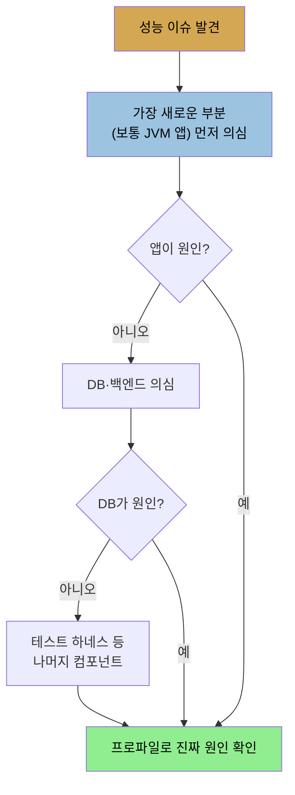

# 완전한 성능 이야기 — JVM 밖의 일곱 원칙
> JVM 튜닝은 전체 성능의 작은 일부이며, 더 나은 알고리즘·더 적은 코드·흔한 경우 최적화 같은 원칙이 적어도 그만큼 중요합니다

1장 후반부는 시선을 JVM 밖으로 돌립니다. 이 책은 JVM과 Java 플랫폼 API를 가장 잘 쓰는 법에 집중하지만, 성능에 영향을 주는 외부 요인은 많고 그것들은 Java에 국한되지 않아 본문에서 깊이 다루지는 않습니다. 그래도 저자는 "JVM과 Java 플랫폼의 성능은 빠른 성능에 이르는 작은 일부일 뿐"이라며, Java 튜닝만큼 중요한 외부 영향들을 이 절에서 짚습니다. [앞 편](./01-01.성능%20—%20art와%20science,%20그리고%20플랫폼·환경.md)이 "무엇을 아는 일인가·어떤 환경인가"였다면, 이 편은 "성능을 대하는 태도"입니다.

저자가 드는 원칙은 여섯 묶음입니다. 각각 현장에서 반복되는 함정을 겨냥하므로, 격언처럼 외워 두면 판단이 빨라집니다.


## 1. 더 나은 알고리즘을 써라
> 마법 같은 -XX:+RunReallyFast 옵션은 없고, 알고리즘이 가장 중요합니다

Java에 관한 수많은 세부와 튜닝 플래그가 성능에 영향을 주지만, 마법 같은 `-XX:+RunReallyFast` 옵션은 없습니다. 결국 애플리케이션의 성능은 얼마나 잘 작성됐느냐에 달려 있습니다.

저자의 예가 명확합니다. 배열의 모든 원소를 순회하는 루프라면 JVM은 배열 경계 검사를 최적화하고 루프를 풀어(unroll) 더 빠르게 돌립니다. 그러나 루프의 목적이 특정 항목을 찾는 것이라면, 세상의 어떤 최적화도 그 배열 기반 코드를 hash map을 쓰는 다른 버전만큼 빠르게 만들지 못합니다. **빠른 성능에 있어 좋은 알고리즘이 가장 중요합니다.**


## 2. 코드를 덜 써라
> 작고 잘 쓴 프로그램이 크고 잘 쓴 프로그램보다 빠르며, 작은 기능이 쌓여 천 번의 베임으로 죽습니다

이것은 인정하기 불편한 원칙입니다. 코드를 쳐내는 일로 프로젝트에 기여한다고 느끼기 어렵고, 어떤 관리자는 여전히 작성한 코드 양으로 개발자를 평가합니다. 그러나 충돌점이 있습니다. **작고 잘 쓴 프로그램이 크고 잘 쓴 프로그램보다 빠릅니다.** 왜 그런지 저자는 구체적으로 나열합니다.

1. 컴파일해야 할 코드가 많을수록 그 코드가 빠르게 도는 데 더 오래 걸립니다.
2. 할당하고 버리는 객체가 많을수록 가비지 컬렉터가 할 일이 많아집니다.
3. 할당하고 보유하는 객체가 많을수록 GC 사이클이 길어집니다.
4. 디스크에서 JVM으로 로드할 클래스가 많을수록 프로그램 시작이 느려집니다.
5. 실행할 코드가 많을수록 머신의 하드웨어 캐시에 들어맞을 가능성이 낮아집니다.
6. 실행할 코드가 많을수록 그 실행이 오래 걸립니다.

저자는 이를 **"천 번의 베임으로 죽는다(death by 1,000 cuts)"** 원칙이라 부릅니다. 개발자는 "아주 작은 기능 하나 추가, 시간도 안 걸린다(쓰이지도 않는다면 더더욱)"고 주장합니다. 같은 프로젝트의 다른 개발자도 같은 주장을 하고, 어느새 성능이 몇 퍼센트 퇴행합니다. 다음 릴리스에서 반복되면 10% 퇴행합니다. 과정 중 몇 번은 성능 테스트가 자원 임계점(메모리 임계, 코드 캐시 오버플로 등)을 때려 큰 퇴행으로 잡아 고칠 수 있습니다. 그러나 작은 퇴행이 야금야금 들어오면 시간이 갈수록 고치기 어려워집니다.


## 3. 결국 우리는 전쟁에서 진다
> 릴리스가 거듭되며 기능이 늘어 프로그램은 커지고 느려지지만, 마이너 릴리스의 최적화 전투는 이길 수 있습니다

반직관적이고 다소 우울한 측면입니다. 모든 애플리케이션의 성능은 시간이 지나며(새 릴리스 주기를 거치며) 떨어질 것으로 예상됩니다. 흔히 그 차이를 못 느끼는 이유는 하드웨어 개선이 새 프로그램을 받아들일 만한 속도로 돌려 주기 때문입니다.

저자의 예시는 와닿습니다. Windows 95를 돌리던 컴퓨터에서 Windows 10 인터페이스를 돌린다고 상상해 보라는 것입니다. 저자가 가장 아끼던 Mac Quadra 950은 macOS Sierra를 돌릴 수 없고, 돌린다 해도 Mac OS 7.5에 비해 아주 느릴 것입니다. 더 작은 수준에서 Firefox 69.0은 탭 브라우징·동기 스크롤·보안 기능으로 Mosaic보다 훨씬 강력하지만, 하드디스크의 기본 HTML 파일을 로드하는 건 Mosaic이 Firefox 69.0보다 약 50% 빠릅니다.

물론 Mosaic은 실제 URL을 거의 못 불러와 더는 주 브라우저로 쓸 수 없습니다. 이것이 핵심의 일부입니다. 특히 마이너 릴리스 사이에서는 코드가 최적화돼 더 빨리 돌 수 있고, 성능 엔지니어가 집중할 부분이 바로 거기입니다. 우리가 일을 잘하면 그 전투는 이길 수 있습니다. 저자는 기존 애플리케이션 성능 개선을 하지 말자는 게 아니라고 분명히 합니다. 다만 경쟁 프로그램에 맞추려 새 기능·표준을 더하면 프로그램이 커지고 느려지는 역설은 남습니다. 핵심은 **트레이드오프를 인식하고, 가능할 때 군더더기를 덜어내라**는 것입니다.


## 4. 그래, 어서, 섣부른 최적화도 하라
> Knuth의 격언은 깔끔한 코드를 위한 것이지, 나쁜 줄 아는 구문까지 피하라는 뜻이 아닙니다

Donald Knuth가 만든 것으로 널리 알려진 "premature optimization(섣부른 최적화)"라는 표현은, 개발자가 "내 코드 성능은 중요치 않고, 중요하더라도 돌려 보기 전엔 모른다"고 주장하는 데 자주 쓰입니다. 전체 인용은 이렇습니다.

> 약 97%의 경우 작은 효율은 잊어야 합니다. 섣부른 최적화는 모든 악의 근원입니다.

이 격언의 요지는, 결국 읽고 이해하기 쉬운 깔끔하고 단순한 코드를 쓰라는 것입니다. 여기서 "최적화"는 프로그램 구조를 복잡하게 만들지만 더 나은 성능을 주는 알고리즘·설계 변경을 뜻합니다. 그런 최적화는 프로파일링이 큰 이득을 보여 줄 때까지 미뤄 두는 게 좋습니다. 그러나 이 맥락에서 최적화가 뜻하지 **않는** 것은, **성능에 나쁜 줄 아는 코드 구문을 피하는 일**입니다. 모든 코드 한 줄은 선택이고, 두 가지 단순하고 직관적인 방법 중 고를 수 있다면 성능이 더 나은 쪽을 고르라는 것입니다.

저자의 로깅 예가 이 원칙을 보여 줍니다. 다음 코드는 로깅 레벨이 꽤 높게 설정되지 않으면 메시지가 출력되지 않는데도, 불필요한 문자열 연결을 합니다. 메시지가 출력되지 않으면 `calcX()`·`calcY()` 호출도 불필요하게 일어납니다.

```java
log.log(Level.FINE, "I am here, and the value of X is "
        + calcX() + " and Y is " + calcY());
```

경험 많은 Java 개발자는 이를 반사적으로 거부합니다. 일부 IDE는 이 코드를 플래그하기도 합니다(다만 도구가 완벽하진 않습니다. NetBeans IDE는 문자열 연결을 플래그하지만, 제안하는 개선이 불필요한 메서드 호출을 그대로 둡니다). 더 나은 작성은 이렇습니다.

```java
if (log.isLoggable(Level.FINE)) {
    log.log(Level.FINE,
            "I am here, and the value of X is {} and Y is {}",
            new Object[]{calcX(), calcY()});
}
```

이렇게 하면 문자열 연결이 아예 없어지고(메시지 포맷이 꼭 더 효율적이진 않지만 더 깔끔합니다), 로깅이 켜져 있지 않는 한 메서드 호출이나 객체 배열 할당이 없습니다. 여전히 깔끔하고 읽기 쉽고, 원래 코드보다 더 든 노력도 키 몇 번과 로직 한 줄뿐입니다. 이것은 피해야 할 섣부른 최적화가 아니라, 좋은 코더가 익히는 선택입니다. 저자는 "선구자 영웅의 맥락 없는 도그마가 당신이 쓰는 코드를 생각하지 못하게 두지 말라"고 당부합니다.


## 5. 다른 곳을 보라 — 데이터베이스가 늘 병목이다
> 분산 환경에서 Java 서버는 가장 작은 문제일 수 있고, 과부하 시스템에 부하를 더하면 전체가 더 느려집니다

외부 자원을 쓰지 않는 독립 실행형 Java 애플리케이션이라면 그 애플리케이션의 성능이 (대체로) 전부입니다. 그러나 데이터베이스 같은 외부 자원이 더해지면 양쪽 성능이 모두 중요해집니다. Java REST 서버·로드 밸런서·데이터베이스·백엔드 기업 정보 시스템이 있는 분산 환경에서는 Java 서버의 성능이 가장 작은 문제일 수도 있습니다.

이 책은 전체 시스템 성능에 관한 책이 아닙니다. 그런 환경에서는 CPU 사용률·I/O 지연·처리량을 모든 부분에서 측정·분석해야 비로소 어느 컴포넌트가 병목인지 알 수 있습니다. 저자는 그 분석이 이미 끝나 Java 컴포넌트가 개선 대상이라고 판명됐다고 가정합니다.

버그·병목이 JVM에 국한되지 않는다는 점을 저자는 자신의 일화로 보여 줍니다. 한 고객이 새 버전의 애플리케이션 서버를 설치했더니 요청 처리 시간이 갈수록 길어졌습니다. Occam의 면도날에 따라 애플리케이션 서버의 모든 측면을 검토하고 배제했지만 문제가 남았고, 탓할 백엔드 DB도 없었습니다. 다음으로 의심스러운 것은 테스트 하네스였고, 프로파일링 결과 부하 생성기인 Apache JMeter가 퇴행의 원인이었습니다. 모든 응답을 리스트에 보관하고, 새 응답이 올 때마다 90번째 백분위 응답 시간을 계산하느라 리스트 전체를 처리하고 있었습니다.



다만 저자는 초기 분석을 간과하지 말라고도 합니다. DB가 병목인데(힌트: 대개 그렇습니다) DB에 접근하는 Java 앱을 튜닝해도 전체 성능은 전혀 나아지지 않고, 오히려 역효과일 수 있습니다. 일반 규칙으로, **과부하 상태의 시스템에 부하를 늘리면 그 시스템의 성능은 더 나빠집니다.** Java 앱을 더 효율적으로 바꿔 이미 과부하인 DB의 부하만 키우면 전체 성능이 오히려 떨어지고, "그 JVM 개선은 쓰면 안 된다"는 잘못된 결론에 이를 위험이 있습니다. 이 원칙은 DB에 국한되지 않고, CPU bound 서버나 이미 대기 스레드가 있는 락에 스레드를 더 붙이는 등 여러 상황에 적용됩니다. JVM만 관련된 극단적 예는 9장에 나옵니다.


## 6. 흔한 경우를 최적화하라
> 프로파일에서 시간을 많이 쓰는 연산에 집중하고, Occam의 면도날로 가장 단순한 원인부터 의심합니다

"천 번의 베임" 증후군 탓에 모든 성능 측면을 동등하게 중요하다고 여기기 쉽지만, 흔한 사용 시나리오에 집중해야 합니다. 이 원칙은 여러 형태로 나타납니다.

1. **프로파일링으로 코드를 최적화하고, 프로파일에서 가장 시간을 많이 쓰는 연산에 집중**합니다. 다만 이것이 프로파일의 leaf 메서드만 보라는 뜻은 아닙니다(3장).
2. **성능 문제 진단에 Occam의 면도날을 적용**합니다. 가장 단순한 설명이 가장 그럴듯한 원인입니다. 새 코드의 성능 버그가 머신 설정 문제보다 가능성이 높고, 그것이 다시 JVM·OS 버그보다 가능성이 높습니다. 모호한 OS·JVM 버그가 존재하긴 하고, 더 그럴듯한 원인을 배제할수록 잠재 버그를 건드렸을 가능성도 생기지만, 가능성 낮은 경우로 먼저 건너뛰지 않습니다.
3. **애플리케이션에서 가장 흔한 연산에 단순한 알고리즘을 씁니다.** 예를 들어 수학 공식을 추정하는 프로그램에서 사용자가 오차 10%와 1% 중 고를 수 있고 대부분이 10%로 만족한다면, 1% 경로를 느리게 하더라도 10% 경로를 최적화합니다.


## 요약
> JVM은 전체 성능 그림의 작은 조각이며, 시스템 차원 접근이 필요하지만 JVM과 시스템의 상호작용도 이 책이 다룹니다

Java에는 애플리케이션에서 최고의 성능을 끌어낼 기능과 도구가 있고, 이 책은 빠르게 도는 프로그램을 위해 JVM의 모든 기능을 어떻게 가장 잘 쓰는지를 돕습니다. 그러나 많은 경우 **JVM은 전체 성능 그림의 작은 일부**임을 기억해야 합니다. DB와 다른 백엔드 시스템의 성능이 JVM만큼 중요한 Java 환경에서는 시스템 차원의 접근이 필요합니다. 그 수준의 성능 분석은 이 책의 초점이 아니며, Java 컴포넌트가 시스템의 중요한 병목임을 확인하는 사전 점검(due diligence)이 끝났다고 가정합니다.

다만 JVM과 시스템의 다른 영역 사이의 상호작용도 똑같이 중요합니다. 그 상호작용이 직접적이든(예: DB 호출을 하는 가장 좋은 방법), 간접적이든(예: 큰 시스템의 여러 컴포넌트와 머신을 공유하는 애플리케이션의 native 메모리 사용 최적화) 마찬가지입니다. 이 책의 정보는 그런 부분의 성능 문제 해결에도 도움이 됩니다.


## 자주 받는 오해
> "섣부른 최적화는 악"이라는 격언이 모든 성능 고려를 미루라는 뜻은 아닙니다

1. "섣부른 최적화는 모든 악의 근원"이니 성능은 나중에 보면 된다고 생각하기 쉽지만, 그 격언은 **구조를 복잡하게 만드는 알고리즘·설계 변경**을 미루라는 뜻입니다. 두 단순한 방법 중 성능이 나은 쪽을 고르는 것(로깅 가드 등)은 미룰 일이 아니라 좋은 코더의 기본 선택입니다.
2. "Java 앱을 더 빠르게 하면 전체가 빨라진다"고 생각하기 쉽지만, DB가 병목이면 Java를 최적화해 부하를 늘릴수록 과부하 DB가 더 느려져 전체 성능이 떨어질 수 있습니다.
3. "성능 이슈는 보통 JVM·OS의 깊은 버그"라고 생각하기 쉽지만, Occam의 면도날상 새 코드의 버그 → 머신 설정 → JVM·OS 버그 순으로 가능성이 낮아집니다. 단순한 원인부터 의심해야 합니다.


## 면접에서 받을 만한 질문
1. **"premature optimization is the root of all evil"을 실무에서 어떻게 해석합니까?** → 이 격언은 약 97%의 경우 작은 효율을 잊으라는 것으로, 프로그램 구조를 복잡하게 만드는 알고리즘·설계 변경은 프로파일링이 큰 이득을 입증할 때까지 미루라는 뜻입니다. 그러나 성능에 나쁜 줄 아는 구문을 피하는 것까지 미루라는 의미는 아닙니다. 예를 들어 로깅에서 `if (log.isLoggable(...))` 가드로 불필요한 문자열 연결과 메서드 호출을 피하는 것은, 코드를 더 복잡하게 만들지 않으면서 명백히 나은 선택이므로 처음부터 그렇게 씁니다.
2. **"death by 1,000 cuts"가 무엇입니까?** → 개발자마다 "아주 작은 기능 하나"를 더하지만, 컴파일할 코드·할당할 객체·로드할 클래스가 쌓여 성능이 몇 퍼센트씩 야금야금 퇴행하는 현상입니다. 한 번에 임계점을 때리는 큰 퇴행은 성능 테스트가 잡아 고칠 수 있지만, 작은 퇴행이 누적되면 원인을 분리하기 어려워 고치기 점점 힘들어집니다. 그래서 "코드를 덜 써라"가 원칙이 됩니다.
3. **성능 이슈를 진단할 때 어디부터 봅니까?** → Occam의 면도날에 따라 가장 단순하고 그럴듯한 원인부터 봅니다. 보통 가장 새로운 부분(JVM 앱)을 먼저 의심하고, 배제되면 DB·백엔드, 그다음 테스트 하네스 같은 나머지 컴포넌트로 넓힙니다. 저자의 사례에서는 앱·DB가 모두 아니어서 결국 부하 생성기 JMeter가 응답을 전부 리스트에 모아 매번 90백분위를 계산하던 것이 원인이었습니다. 진짜 원인은 프로파일로 확인합니다.
4. **알고리즘과 JVM 튜닝 중 무엇이 더 중요합니까?** → 알고리즘입니다. `-XX:+RunReallyFast` 같은 마법 옵션은 없고, 어떤 JVM 최적화도 잘못된 알고리즘을 메우지 못합니다. 특정 항목을 찾는 작업에서 JVM이 배열 순회 루프를 아무리 unroll하고 경계 검사를 최적화해도, hash map을 쓰는 버전을 따라잡지 못하는 것이 대표적인 예입니다.


## 관련 문서
- [성능 — art와 science, 그리고 플랫폼·환경](./01-01.성능%20—%20art와%20science,%20그리고%20플랫폼·환경.md) — 1장 전반부, 두 지식 축과 플랫폼·환경
- [서문 — 책 소개와 2판 변경점](./00-00.서문%20—%20책%20소개와%202판%20변경점.md) — 성능 작업의 본질(성숙할수록 큰 개선 드묾)과 이어지는 관점
- [이 책 인덱스 (Java Performance MOC)](./README.md) — 장별 정독 노트 진척
