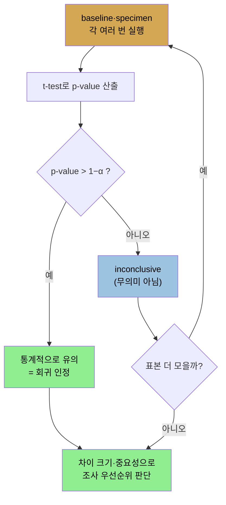

# 결과를 어떻게 믿을까 — 변동성과 통계, 일찍 자주
> 두 결과의 차이가 진짜 회귀인지 무작위 변동인지 Student t-test로 가리고, 성능 테스트를 개발 주기에 일찍 자주 통합해야 합니다

[앞 편](./02-01.무엇을%20측정할까%20—%20벤치마크%20종류와%20성능%20지표.md)이 무엇을 어떤 지표로 측정하느냐였다면, 이 편은 그 측정 결과를 어떻게 믿느냐입니다. 2장의 셋째·넷째 원칙, 곧 변동성 이해와 일찍 자주 테스트를 다룹니다. 여기서 성능 엔지니어링의 science가 길을 이끌지만, 저자의 표현대로 art가 끼어듭니다.

## 1. 변동성을 이해하라
> 같은 데이터도 매번 다른 값을 내므로, 차이가 회귀인지 무작위 변동인지 가려야 합니다

셋째 원칙은 결과가 시간에 따라 어떻게 변하는지 이해하는 것입니다. 똑같은 데이터를 처리해도 매번 다른 값이 나옵니다. 머신의 백그라운드 프로세스가 영향을 주고, 네트워크 혼잡도가 다르기 때문입니다. 좋은 벤치마크는 실제 세상을 흉내 내려고 일부러 무작위 동작을 넣기까지 합니다. 그래서 문제가 생깁니다. 한 실행과 다른 실행의 차이가 회귀 때문인지, 테스트의 무작위 변동 때문인지 알기 어렵습니다.

테스트를 여러 번 돌려 평균 내고, 코드 변경 후 다시 여러 번 돌려 평균 내어 두 평균을 비교하면 될 것 같지만, 그렇게 단순하지 않습니다. 차이가 진짜 회귀인지 무작위 변동인지 판단하는 것은 어렵습니다. 평균을 비교할 때, 그 차이가 진짜인지 무작위 요동인지 절대적으로 확신할 방법은 없습니다. 할 수 있는 최선은 "평균이 같다"고 가설을 세우고 그 진술이 참일 확률을 정하는 것입니다. 진술이 높은 확률로 거짓이면, 평균 차이가 진짜라고 믿어도 편안합니다(100% 확신은 결코 못 하지만).

## 2. 회귀 테스트와 Student t-test
> baseline과 specimen의 평균만 비교하면 안 되고, t-test가 내는 p-value로 두 결과가 같을 확률을 봅니다

코드 변경을 테스트하는 것이 회귀 테스트입니다. 원래 코드를 baseline, 새 코드를 specimen이라 합니다. 배치 프로그램에서 baseline과 specimen을 각 세 번 돌린 예를 봅니다(원문 Table 2-2).

| 반복 | Baseline | Specimen |
|------|----------|----------|
| 1회 | 1.0초 | 0.5초 |
| 2회 | 0.8초 | 1.25초 |
| 3회 | 1.2초 | 0.5초 |
| 평균 | 1초 | 0.75초 |

specimen 평균은 25% 개선을 가리킵니다. 얼마나 확신할 수 있을까요? 좋아 보입니다. specimen 세 값 중 둘이 baseline 평균보다 작고 개선폭도 큽니다. 그러나 분석을 해 보면 **specimen과 baseline의 성능이 같을 확률이 43%**로 나옵니다. 이런 숫자가 보일 때, 43%는 두 테스트의 근본 성능이 같고 다른 건 57%뿐입니다. 이것이 예상과 달라 보이는 이유는 결과의 큰 변동 때문입니다. 일반적으로 결과의 변동이 클수록 평균 차이가 진짜인지 우연인지 추측하기 어렵습니다.

이 43%는 Student t-test의 결과입니다. t-test는 두 시리즈와 그 분산에 기반한 통계 분석으로, p-value라는 수를 냅니다. p-value는 그 테스트의 귀무가설이 참일 확률입니다. **회귀 테스트의 귀무가설은 "두 테스트의 성능이 같다"**입니다. 이 예의 p-value 0.43은 두 시리즈가 같은 평균으로 수렴한다는 확신이 43%, 다르다는 확신이 57%라는 뜻입니다.

여기서 의미를 정확히 잡아야 합니다. 57%가 다르다는 것은 **25% 개선을 57% 확신한다는 뜻이 아닙니다.** 결과가 다르다는 확신이 57%일 뿐입니다. 25% 개선일 수도, 125% 개선일 수도, 심지어 specimen이 더 나쁠 수도 있습니다. 가장 그럴듯한 가능성은 측정된 차이와 비슷한 것이지만(p-value가 낮을수록 더), 확실성은 결코 못 얻습니다.

> 통계학자를 괴롭히는 표현이긴 하지만, 흔히 "57% 신뢰 수준으로 25% 개선이 있다"고 말합니다. 정확히 같은 말은 아니어도 크게 틀리지 않은 편한 약칭입니다. 정확한 표현은 "specimen이 baseline과 다를 확률이 57%이고, 그 차이의 최선 추정치가 25%"입니다.

## 3. α-value와 통계적 유의성, 그리고 표본 크기
> α-value(보통 0.1)로 유의성 기준을 정하고, 표본을 늘리면 p-value가 떨어져 확신이 커집니다

t-test는 보통 α-value와 함께 씁니다. α-value는 결과가 통계적으로 유의하다고 보는(다소 임의적인) 기준점입니다. 보통 0.1로 두는데, 이는 specimen과 baseline이 같을 확률이 10%(0.1)뿐일 때(역으로 90%는 다를 때) 유의하다고 본다는 뜻입니다. 0.05(95%)나 0.01(99%)도 흔히 씁니다. **p-value가 `1 − α-value`보다 크면 통계적으로 유의**하다고 봅니다.

따라서 코드에서 회귀를 찾는 올바른 방법은, 유의성 수준(예: 90%)을 정하고 t-test로 specimen과 baseline이 그 수준 안에서 다른지 보는 것입니다. 유의성 검정이 실패했을 때의 의미를 조심해야 합니다. 위 예의 p-value 0.43은 "90% 신뢰 수준에서 평균이 다르다는 통계적 유의성"을 말할 수 없습니다. 그러나 **유의하지 않다는 것이 무의미한 결과라는 뜻은 아니고**, 단지 inconclusive(결론 없음)하다는 뜻입니다.

여기서 저자는 유의성과 중요성을 가릅니다. **통계적 유의성은 통계적 중요성이 아닙니다.** 변동이 작고 평균 1초인 baseline과 변동이 작고 평균 1.01초인 specimen은 p-value 0.01일 수 있습니다. 차이가 있을 확률이 99%지만 차이 자체는 1%뿐입니다. 반대로 10% 회귀가 p-value 0.2(비유의)일 수 있습니다. 가장 귀한 자원인 추가 조사 시간을 어디에 쓸까요? 확신은 낮아도 **10% 차이 쪽을 조사하는 게 낫습니다.** 1% 차이가 더 확실하다고 더 중요한 건 아닙니다.

테스트가 inconclusive한 흔한 이유는 표본이 부족해서입니다. 앞 예에 결과 셋을 더해 여섯으로 늘려 봅니다(원문 Table 2-3).

| 반복 | Baseline | Specimen |
|------|----------|----------|
| 1회 | 1.0초 | 0.5초 |
| 2회 | 0.8초 | 1.25초 |
| 3회 | 1.2초 | 0.5초 |
| 4회 | 1.1초 | 0.8초 |
| 5회 | 0.7초 | 0.7초 |
| 6회 | 1.2초 | 0.75초 |
| 평균 | 1초 | 0.75초 |

추가 데이터로 **p-value가 0.43에서 0.11로 떨어집니다.** 결과가 다를 확률이 57%에서 89%로 올랐습니다. 평균은 그대로인데, 차이가 무작위 변동이 아니라는 확신만 커졌습니다. 유의 수준에 이를 때까지 테스트를 더 돌리는 게 늘 현실적이진 않고, 엄밀히 필요하지도 않습니다. 유의성을 정하는 α-value 선택이 임의적이기 때문입니다. p-value 0.11은 90% 신뢰 수준에서는 유의하지 않지만 89% 신뢰 수준에서는 유의합니다.

회귀 테스트는 중요하지만 흑백의 과학이 아닙니다. 통계 분석 없이 숫자(또는 평균)만 보고 비교 판단을 내릴 수 없고, 그 분석조차 확률의 법칙 때문에 완전히 확정적인 답을 주지 못합니다. 성능 엔지니어의 일은 데이터를 보고 확률을 이해해, 가용한 모든 데이터에 근거해 어디에 시간을 쓸지 정하는 것입니다.

요약하면, 두 테스트 결과가 진짜 다른지 정하려면 통계 분석이 필요하고, 엄밀한 방법은 Student t-test입니다. t-test는 회귀 존재 확률을 알려주지만, 어느 회귀를 무시하고 어느 것을 좇을지는 알려주지 않습니다. 그 균형을 찾는 것이 성능 엔지니어링 art의 일부입니다.

## 4. 일찍, 자주 테스트하라
> 성능 테스트를 개발 주기에 통합해야 하지만, 좋은 테스트는 시간이 걸려 현실과 트레이드오프가 있습니다

넷째 원칙은 성능 테스트를 개발 주기의 필수 부분으로 만드는 것입니다. 이상적으로는 중앙 저장소에 코드를 체크인할 때 성능 테스트가 돌고, 회귀를 부르는 코드는 체크인이 막힙니다. 그러나 이 권고는 이 장의 다른 권고, 그리고 현실과 긴장 관계입니다. 좋은 성능 테스트는 많은 코드(적어도 중간 크기 메소벤치마크)를 담고, 차이가 진짜인지 확신하려면 여러 번 반복해야 합니다. 큰 프로젝트에서는 며칠에서 일주일이 걸려, 체크인 전에 돌리기가 비현실적입니다.

전형적 개발 주기도 일을 어렵게 합니다. 프로젝트 일정은 보통 feature-freeze 날짜를 두어, 모든 기능 변경을 릴리스 주기 초기에 체크인하고 나머지 기간에 버그(성능 포함)를 잡습니다. 이것이 일찍 테스트에 두 문제를 만듭니다.

1. 개발자는 일정에 쫓겨, 모든 코드를 체크인한 뒤에 시간을 둔 일정에서 성능 문제 고치기를 미루려 합니다. 주기 초기에 1% 회귀를 낸 개발자는 고치라는 압박을 받지만, feature freeze 저녁까지 기다린 개발자는 20% 회귀를 체크인하고 나중에 처리할 수 있습니다.
2. 코드가 바뀌면 성능 특성도 바뀝니다. 전체 애플리케이션을 테스트해야 하는 것과 같은 원리로, 힙 사용·코드 컴파일이 달라집니다.

이런 어려움에도 개발 중 잦은 성능 테스트는 중요합니다. 당장 고치지 못하더라도 그렇습니다. 5% 회귀를 낸 개발자가 통합 예정 기능에 의존하는 코드라 그 기능이 오면 작은 수정으로 회귀가 사라진다는 계획이 있다면 합리적입니다(몇 주간 5% 회귀를 안고 가야 하고, 그 회귀가 다른 회귀를 가린다는 불가피한 문제는 있지만). 반대로 새 코드가 아키텍처 변경으로만 고칠 수 있는 회귀를 낸다면, 나머지 코드가 새 구현에 의존하기 전에 일찍 잡아 처리하는 게 낫습니다. 분석력과 때로 정치력이 필요한 균형 잡기입니다.

일찍 자주 테스트는 다음 지침을 따를 때 가장 유용합니다.

1. **모두 자동화하라.** 모든 성능 테스트를 스크립트로 만듭니다. 새 코드 설치, 전체 환경 구성(DB 연결·사용자 계정), 테스트 실행만이 아니라, 여러 번 실행하고 결과에 t-test 분석을 수행해 같을 신뢰 수준과 측정 차이를 보고서로 내야 합니다. 자동화는 테스트 전 머신이 알려진 상태인지(예상 밖 프로세스 없음, OS 구성 정확) 확인해야 합니다. 환경이 실행마다 같아야 테스트가 반복 가능합니다.
2. **모든 것을 측정하라.** 나중 분석에 쓸 모든 데이터를 모읍니다. 실행 내내 샘플링한 CPU·디스크·네트워크·메모리 사용, 애플리케이션 로그와 GC 로그, 가능하면 JFR 기록(3장)이나 저영향 프로파일링, 주기적 스레드 스택, 히스토그램·힙 덤프(전체 힙 덤프는 공간을 많이 써 장기 보관은 어렵습니다)입니다. DB를 쓰면 DB 머신 통계와 진단 출력(Oracle AWR 리포트 등)도 포함합니다. CPU가 늘면 프로파일을, GC 시간이 늘면 힙 프로파일을 봅니다. CPU와 GC 시간이 둘 다 줄었으면 어딘가의 경합이 성능을 늦춘 것이라 스택 데이터로 동기화 병목을 짚습니다. 1장에서 말했듯 회귀가 꼭 JVM은 아니므로, 모든 곳을 측정해야 올바른 분석을 할 수 있습니다.
3. **타깃 시스템에서 돌려라.** 1코어 노트북과 72코어 머신은 다르게 거동합니다. 큰 머신은 더 많은 스레드를 동시에 돌려 CPU 경합을 줄이는 동시에, 작은 노트북에서는 안 보이던 동기화 병목을 드러냅니다. 덜 분명한 차이도 중요합니다. 많은 튜닝 플래그가 기본값을 하드웨어 기반으로 계산하고, 코드는 플랫폼마다 다르게 컴파일되며, 캐시(특히 하드웨어)도 시스템·부하마다 다르게 거동합니다. 작은 하드웨어의 작은 테스트로 외삽할 수는 있지만, **외삽은 예측일 뿐이고 예측은 틀릴 수 있습니다.** 대규모 시스템은 부분의 합 이상이라, 타깃 플랫폼에서 충분한 부하 테스트를 하는 것을 대체할 수 없습니다.

요약하면, 잦은 성능 테스트는 중요하지만 진공에서 일어나지 않아 개발 주기와의 트레이드오프가 있고, 모든 머신·프로그램에서 가능한 모든 통계를 모으는 자동화 시스템이 회귀 추적의 단서를 줍니다.

## 자주 받는 오해
> 유의하지 않은 결과를 무의미하다고 버리기 쉽지만, 표본 부족으로 inconclusive할 뿐입니다

1. "p-value가 유의 기준을 못 넘으면 의미 없는 결과"라고 생각하기 쉽지만, 유의하지 않은 것은 무의미가 아니라 inconclusive입니다. 흔한 원인은 표본 부족이고, 표본을 늘리면 같은 평균이라도 p-value가 떨어져 유의해질 수 있습니다(0.43 → 0.11).
2. "더 확실한(p-value 낮은) 회귀부터 고쳐야 한다"고 생각하기 쉽지만, 통계적 유의성은 중요성이 아닙니다. 1% 차이가 p=0.01로 확실해도, 10% 차이가 p=0.2로 덜 확실해도, 시간을 쓸 가치는 후자에 있습니다.
3. "작은 하드웨어 테스트를 큰 시스템으로 외삽하면 된다"고 생각하기 쉽지만, 외삽은 예측일 뿐입니다. 플래그 기본값·컴파일·캐시가 하드웨어마다 달라 타깃 시스템 부하 테스트를 대체하지 못합니다.

## 면접에서 받을 만한 질문
1. **두 성능 결과의 평균만 비교하면 안 되는 이유는?** → 프로그램은 같은 데이터도 매번 다른 값을 내는 무작위성이 있어, 평균 차이가 진짜 회귀인지 무작위 변동인지 평균만으로는 알 수 없습니다. 예를 들어 baseline 평균 1초, specimen 평균 0.75초로 25% 개선처럼 보여도, 변동이 크면 t-test상 둘이 같을 확률이 43%일 수 있습니다. 그래서 Student t-test로 p-value를 구해 확률을 이해해야 합니다.
2. **p-value와 α-value가 무엇입니까?** → p-value는 귀무가설(두 테스트 성능이 같다)이 참일 확률입니다. p-value 0.43이면 두 결과가 같을 확률 43%, 다를 확률 57%입니다. α-value는 유의성 기준점으로 보통 0.1(90%)이며, p-value가 `1 − α`보다 크면 통계적으로 유의하다고 봅니다. 단 "다를 확률 57%"는 "25% 개선을 57% 확신"이 아니라 "다르다는 확신이 57%"라는 뜻입니다.
3. **통계적 유의성과 통계적 중요성의 차이는?** → 유의성은 차이가 존재할 확률이고, 중요성은 그 차이가 실무적으로 쓸 가치가 있느냐입니다. 1% 차이가 p=0.01로 강하게 유의해도 차이 자체는 작고, 10% 차이가 p=0.2로 비유의해도 잠재적 영향이 큽니다. 조사 시간은 후자에 쓰는 게 낫습니다. 확률이 높다고 더 중요한 건 아닙니다.
4. **성능 테스트 자동화에서 "모든 것을 측정"해야 하는 이유는?** → 회귀의 원인이 꼭 JVM은 아니어서, CPU·디스크·네트워크·메모리·GC 로그·JFR·스레드 스택·DB 통계까지 모아야 단서가 충분해집니다. 예를 들어 CPU와 GC 시간이 둘 다 줄었는데 성능이 나빠졌다면 어딘가의 경합이 원인이고, 스택 데이터가 동기화 병목을 짚어 줍니다. 데이터가 많을수록 탐정처럼 따라갈 단서가 많습니다.

## 관련 문서
- [무엇을 측정할까 — 벤치마크 종류와 성능 지표](./02-01.무엇을%20측정할까%20—%20벤치마크%20종류와%20성능%20지표.md) — 2장 원칙①②
- [벤치마크 실전 — jmh와 공통 예제 코드](./02-03.벤치마크%20실전%20—%20jmh와%20공통%20예제%20코드.md) — jmh가 통계 분석(신뢰구간)을 어떻게 돕는지
- [이 책 인덱스 (Java Performance MOC)](./README.md) — 장별 정독 노트 진척
