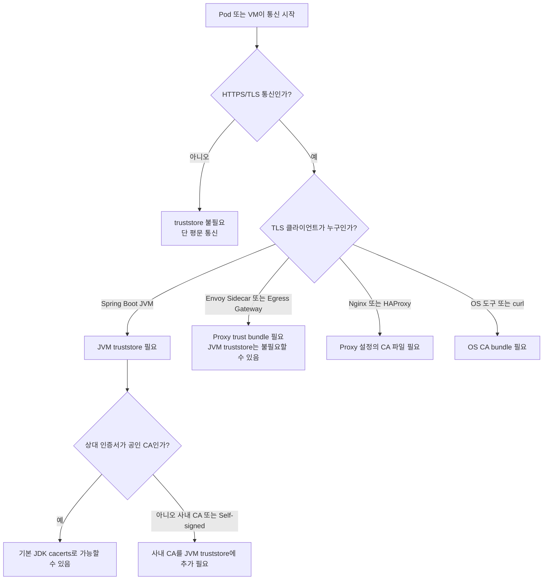
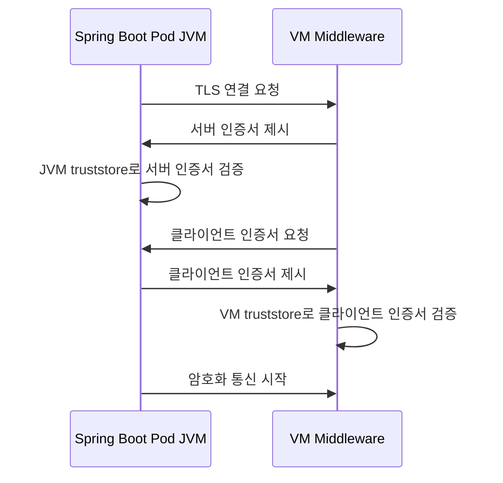
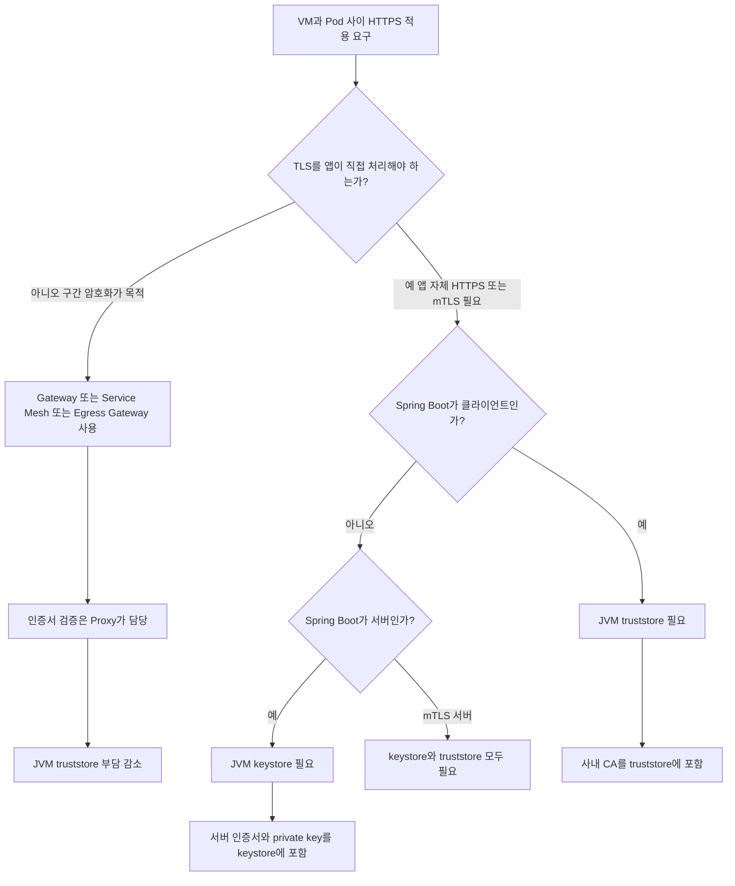

# JVM 딥다이브 로드맵 — 섹션별 키워드 원문

---

> "Java 코드를 작성하는 개발자" 에서 "Java 코드가 JVM 안에서 어떻게 로딩되고, 실행되고, 최적화되고, 멈추고, 장애 나는지 설명할 수 있는 개발자" 로 가는 것이 목표입니다. 이 문서는 제공받은 JVM 딥다이브 로드맵 원문을 **섹션별로 빠짐없이** 옮긴 기록입니다. 책 매핑·폴더 구조는 [README.md](README.md) 가 맡고, 이 문서는 "각 섹션이 원래 무엇을 다루라고 했는가" 의 SSOT 입니다.

## 1. JVM 딥다이브 전체 지도

깊게 판다면 아래 순서가 좋습니다.

```text
1. JVM Architecture
2. Class File Format
3. Bytecode
4. Class Loading
5. Linking / Verification / Initialization
6. Runtime Data Areas
7. Stack Frame / Operand Stack / Local Variables
8. Execution Engine
9. Interpreter
10. JIT Compiler
11. JIT Optimization
12. Garbage Collection
13. Heap / Metaspace / Native Memory
14. Object Layout
15. Java Memory Model
16. Thread / Lock / Synchronization
17. Virtual Thread
18. Exception Handling
19. Reflection / MethodHandle / invokedynamic
20. JNI / Native Interface
21. JVM Options
22. JVM in Container
23. Profiling / Diagnostics
24. JVM 장애 분석
```

한 문장으로 줄이면: `.java` 파일은 `.class` 바이트코드가 되고, ClassLoader 가 이를 로딩하며, JVM 은 검증과 초기화를 거쳐 메서드를 실행하고, 처음에는 인터프리터로 돌리다가, 자주 실행되는 코드는 JIT Compiler 가 네이티브 코드로 최적화하며, Heap 의 객체는 GC 가 회수하고, Thread 와 Stack 은 실행 흐름을 지탱하며, JFR/jcmd/jstack 같은 도구가 JVM 내부의 흔적을 보여줍니다.

## 2. Spring / Kubernetes 와 비교

| 관점 | 생명주기 대상 | 핵심 관리자 |
|------|-------------|------------|
| Spring | Bean / Request / Transaction | ApplicationContext, Proxy, TransactionManager |
| Kubernetes | Pod / Deployment / Service | API Server, Controller, Scheduler, kubelet |
| JVM | Class / Object / Thread / Memory | ClassLoader, Execution Engine, GC, JIT |

Spring 이 객체 조립의 숲이고 Kubernetes 가 워크로드 생명의 들판이라면, JVM 은 그 아래에서 조용히 불타는 실행의 용광로입니다.

## 3. 1단계: JVM Architecture

반드시 알아야 할 것:

```text
JVM
JRE
JDK
Class File
Class Loader Subsystem
Runtime Data Areas
Execution Engine
Interpreter
JIT Compiler
Garbage Collector
Native Method Interface
Native Method Library
```

핵심 질문: Java 코드는 언제 바이트코드가 되는가 / JVM 은 `.class` 파일을 어떻게 읽는가 / 처음 실행되는 메서드는 인터프리터로 실행되는가 / 자주 실행되는 코드는 언제 JIT 컴파일되는가 / 객체는 어디에 생성되는가 / 메서드 호출 정보는 어디에 쌓이는가.

내부 흐름: `.java` → javac → `.class` → ClassLoader → Verification → Preparation → Resolution → Initialization → Interpreter 실행 → Hot Method 감지 → JIT Compilation → Native Code 실행 → GC 로 객체 회수.

## 4. 2단계: Class File Format / Bytecode

JVM 이 읽는 것은 **class file** 입니다.

반드시 알아야 할 것:

```text
.class file
magic number
minor_version / major_version
constant_pool
access_flags
this_class
super_class
interfaces
fields
methods
attributes
bytecode instruction
opcode
```

실습 도구: `javac OrderService.java` · `javap -c OrderService` · `javap -v OrderService`. 예로 `return a + b;` 는 `iload_1 / iload_2 / iadd / ireturn` 으로 보입니다.

깊게 볼 질문: iadd 는 무엇을 더하는가 / 지역 변수는 어디에 저장되는가 / 메서드 호출은 어떤 opcode 로 표현되는가 / 상수 풀은 왜 필요한가 / String literal 은 어디에 기록되는가.

핵심 키워드: javap · opcode · constant pool · descriptor · access flag · LineNumberTable · LocalVariableTable · StackMapTable.

## 5. 3단계: Class Loading

반드시 알아야 할 것:

```text
ClassLoader
Bootstrap ClassLoader
Platform ClassLoader
Application ClassLoader
Custom ClassLoader
Parent Delegation Model
ClassNotFoundException
NoClassDefFoundError
ClassCastException
LinkageError
```

Class Loading 흐름: Loading → Linking(Verification → Preparation → Resolution) → Initialization.

깊게 볼 질문: ClassNotFoundException 과 NoClassDefFoundError 는 무엇이 다른가 / static field 는 언제 초기화되는가 / static block 은 언제 실행되는가 / 같은 클래스 이름이라도 ClassLoader 가 다르면 같은 타입인가 / Tomcat·Spring Boot DevTools·OSGi 는 왜 ClassLoader 가 중요한가.

실무 연결: Spring Boot fat jar 실행 · Tomcat web application classloader · Jenkins plugin classloader · ClassLoader leak · NoSuchMethodError · 라이브러리 버전 충돌. JVM 에서 클래스는 어떤 ClassLoader 가 로딩했는가까지 포함해 하나의 정체성이 됩니다.

## 6. 4단계: Runtime Data Areas

반드시 알아야 할 영역:

```text
PC Register
JVM Stack
Native Method Stack
Heap
Method Area
Runtime Constant Pool
Direct Memory
Metaspace
Code Cache
```

| 영역 | 주로 담는 것 |
|------|-----------|
| PC Register | 현재 실행 중인 명령 위치 |
| JVM Stack | 메서드 호출 프레임 |
| Heap | 객체 인스턴스 |
| Method Area / Metaspace | 클래스 메타데이터 |
| Runtime Constant Pool | 클래스별 상수 정보 |
| Native Method Stack | native method 실행 정보 |
| Code Cache | JIT 컴파일된 네이티브 코드 |
| Direct Memory | JVM heap 밖의 native buffer |

깊게 볼 질문: 지역 변수는 Heap 에 있는가 Stack 에 있는가 / 객체는 항상 Heap 에 생성되는가 / 메서드 호출이 깊어지면 왜 StackOverflowError 가 나는가 / 클래스를 너무 많이 로딩하면 왜 Metaspace 문제가 생기는가 / DirectByteBuffer 는 Heap 을 쓰지 않는가.

## 7. 5단계: Stack Frame

반드시 알아야 할 것:

```text
Stack Frame
Local Variables
Operand Stack
Dynamic Linking
Return Address
Method Invocation
```

메서드 호출 흐름: method A 호출 → A Frame 생성 → local variables 준비 → operand stack 으로 계산 → method B 호출 → B Frame 생성 → B 종료 → B Frame 제거 → A 로 복귀.

실무 질문: 재귀 호출이 깊어지면 왜 StackOverflowError 가 나는가 / 지역 변수는 왜 thread-safe 한가 / Stack trace 는 어떻게 만들어지는가 / Exception 이 발생하면 stack frame 은 어떻게 unwind 되는가.

## 8. 6단계: Execution Engine

반드시 알아야 할 것:

```text
Interpreter
JIT Compiler
C1 Compiler
C2 Compiler
Tiered Compilation
Hot Method
Profiling
Code Cache
Deoptimization
On-Stack Replacement
```

실행 흐름: Bytecode → Interpreter 가 한 줄씩 실행 → 자주 실행되는 코드 감지 → JIT Compiler 가 native code 로 컴파일 → 이후 native code 실행 → 가정이 깨지면 deoptimization.

깊게 볼 질문: 왜 Java 는 처음에는 느리다가 시간이 지나면 빨라질 수 있는가 / JIT Compiler 는 어떤 코드를 최적화 대상으로 삼는가 / Code Cache 가 부족하면 어떤 일이 생기는가 / Deoptimization 은 왜 발생하는가.

## 9. 7단계: JIT Optimization

반드시 알아야 할 최적화:

```text
Method Inlining
Escape Analysis
Scalar Replacement
Lock Elision
Loop Optimization
Dead Code Elimination
Common Subexpression Elimination
Branch Prediction
Deoptimization
```

Escape Analysis 예: 메서드 안에서만 쓰는 `Point p = new Point(1,2)` 가 밖으로 탈출하지 않는다고 JIT 가 판단하면 Heap 객체 생성을 줄이거나 제거할 수 있습니다.

실무 질문: 작은 메서드는 왜 오히려 성능에 유리할 수 있는가 / 객체를 만들었다고 반드시 Heap allocation 이 발생하는가 / synchronized 가 항상 무거운가 / JIT 최적화 때문에 벤치마크가 왜 틀릴 수 있는가.

함께 공부할 것: JMH · warm-up · benchmark mode · blackhole · dead code elimination. 성능 측정은 촛불처럼 예민합니다.

## 10. 8단계: Garbage Collection

반드시 알아야 할 것:

```text
Garbage Collection
Reachability
GC Root
Young Generation
Old Generation
Eden
Survivor
Minor GC
Major GC
Full GC
Stop-The-World
Safepoint
Card Table
Remembered Set
Write Barrier
```

주요 GC: Serial GC · Parallel GC · G1 GC · ZGC · Shenandoah GC · Epsilon GC.

G1 GC 핵심: Region 기반 Heap · Young Collection · Mixed Collection · Remembered Set · Pause Time Goal · Humongous Object.

ZGC 핵심: Low Latency · Concurrent Marking · Concurrent Relocation · Colored Pointer · Load Barrier · Large Heap 대응.

실무 질문: Full GC 가 왜 발생했는가 / GC pause 가 API latency 를 올리고 있는가 / Old 영역이 계속 증가하는가 / Humongous object 가 많지는 않은가 / Allocation rate 가 너무 높지는 않은가 / GC 문제인가 메모리 누수인가.

## 11. 9단계: Heap / Metaspace / Native Memory

반드시 알아야 할 것:

```text
Heap Memory
Young / Old
Metaspace
Compressed Class Space
Thread Stack
Direct Memory
Code Cache
Native Memory
Arena
Memory Mapped File
```

Java 프로세스 메모리 구조: Java Process RSS = Java Heap + Metaspace + Code Cache + Thread Stack + Direct Buffer + GC Native Memory + JNI Native Memory + 기타 native allocation.

실무 질문: `-Xmx` 는 1Gi 인데 컨테이너 메모리는 왜 1.5Gi 이상 쓰는가 / OOMKilled 와 OutOfMemoryError 는 무엇이 다른가 / Direct buffer memory 누수는 어떻게 찾는가 / Thread 가 너무 많으면 왜 native memory 가 증가하는가 / Metaspace OOM 은 왜 발생하는가.

## 12. 10단계: Object Layout

반드시 알아야 할 것:

```text
Object Header
Mark Word
Klass Pointer
Instance Data
Padding
Alignment
Compressed Oops
Compressed Class Pointers
Array Header
```

실무 질문: boolean 필드 하나가 정말 1 byte 만 쓰는가 / 객체가 많으면 왜 메모리 오버헤드가 커지는가 / `List<Integer>` 는 `int[]` 보다 왜 무거운가 / String 이 많으면 어떤 문제가 생기는가.

함께 볼 도구: JOL(Java Object Layout). `Integer` 100만 개는 `int` 100만 개보다 훨씬 무겁습니다 — 객체는 데이터만이 아니라 자기 존재를 설명하는 작은 문패도 함께 들고 있습니다.

## 13. 11단계: Java Memory Model

반드시 알아야 할 것:

```text
Java Memory Model
Visibility
Atomicity
Ordering
Happens-Before
volatile
synchronized
final field semantics
CAS
Unsafe
VarHandle
```

실무 질문: volatile 은 원자성을 보장하는가 / synchronized 는 visibility 도 보장하는가 / double-checked locking 은 왜 volatile 이 필요한가 / CPU cache 와 Java visibility 문제는 어떻게 연결되는가.

예: `volatile boolean running` 이 없다면 다른 스레드가 `running = false` 를 써도 읽는 스레드가 변화를 제때 보지 못할 수 있습니다.

## 14. 12단계: Thread / Lock / Synchronization

반드시 알아야 할 것:

```text
Thread
Platform Thread
Virtual Thread
Thread State
Runnable
Blocked
Waiting
Timed Waiting
Monitor
synchronized
ReentrantLock
ReadWriteLock
StampedLock
LockSupport
ThreadLocal
ExecutorService
ForkJoinPool
CompletableFuture
```

Thread State: NEW · RUNNABLE · BLOCKED · WAITING · TIMED_WAITING · TERMINATED.

실무 질문: Thread dump 에서 BLOCKED 가 많으면 무엇을 의심해야 하는가 / WAITING 과 BLOCKED 는 무엇이 다른가 / ThreadLocal 은 왜 메모리 누수를 만들 수 있는가 / Tomcat thread pool 이 고갈되면 어떤 증상이 나타나는가 / DB connection pool 고갈과 thread 고갈은 어떻게 연결되는가.

## 15. 13단계: Virtual Thread

반드시 알아야 할 것:

```text
Virtual Thread
Platform Thread
Carrier Thread
Continuation
Mount / Unmount
Pinning
Structured Concurrency
Thread-per-request model
Blocking I/O
```

실무 질문: Virtual Thread 는 CPU 작업을 빠르게 만드는가 / Blocking I/O 가 많은 서버에서 왜 유리한가 / synchronized 블록 안에서 blocking 하면 왜 pinning 문제가 생길 수 있는가 / 기존 ThreadPoolExecutor 를 그대로 써야 하는가 / Spring MVC + Virtual Thread 는 어떤 의미가 있는가.

감각: Platform Thread = 비싼 작업자, Virtual Thread = 가벼운 작업 티켓, Carrier Thread = 실제로 작업을 운반하는 운영 인력. Virtual Thread 는 마법의 성능 버튼이 아니라 I/O 대기가 많은 애플리케이션에서 구조를 단순하게 유지하며 동시성을 높이는 도구입니다.

## 16. 14단계: Reflection / MethodHandle / invokedynamic

반드시 알아야 할 것:

```text
Reflection
Class
Method
Field
Constructor
Annotation
Proxy
InvocationHandler
MethodHandle
VarHandle
CallSite
invokedynamic
Lambda
StringConcatFactory
```

실무 연결: Spring DI · Spring MVC ArgumentResolver · Jackson serialization · MyBatis mapper proxy · JDK Dynamic Proxy · CGLIB · Mockito · Lombok 결과물 · Lambda · dynamic language support.

실무 질문: Reflection 은 왜 느릴 수 있는가 / JDK Dynamic Proxy 는 어떻게 인터페이스 구현체를 만드는가 / Lambda 는 내부적으로 익명 클래스와 같은가 / invokedynamic 은 왜 등장했는가. 여기는 Spring AOP·프록시·직렬화·테스트 프레임워크의 지하수맥입니다.

## 17. 15단계: Exception Handling

반드시 알아야 할 것:

```text
Exception Table
Checked Exception
Unchecked Exception
Error
Stack Trace
try-catch-finally
try-with-resources
Suppressed Exception
Throwable.fillInStackTrace
```

실무 질문: Exception 생성은 왜 비용이 클 수 있는가 / Stack trace 는 어떻게 수집되는가 / 비즈니스 예외를 흐름 제어로 남용하면 어떤 문제가 생기는가 / finally 는 항상 실행되는가.

## 18. 16단계: JVM Options

기본 옵션:

```text
-Xms
-Xmx
-Xss
-XX:MaxMetaspaceSize
-XX:MaxDirectMemorySize
-XX:+UseG1GC
-XX:+UseZGC
-XX:MaxGCPauseMillis
-XX:+HeapDumpOnOutOfMemoryError
-XX:HeapDumpPath
-Xlog:gc*
```

실무 질문: Xms 와 Xmx 를 같게 둘 것인가 / Heap dump 가 남을 디스크 공간은 충분한가 / GC log rotation 은 설정했는가 / Container memory limit 과 Xmx 가 맞는가 / MaxRAMPercentage 를 쓸 것인가 Xmx 를 직접 줄 것인가.

## 19. 17단계: JVM in Container

반드시 알아야 할 것:

```text
cgroup
container memory limit
container cpu limit
CPU throttling
OOMKilled
Java OutOfMemoryError
MaxRAMPercentage
InitialRAMPercentage
ActiveProcessorCount
```

가장 중요한 구분: Java OutOfMemoryError 는 JVM 내부에서 메모리 할당 실패(heap dump 를 남길 수 있음), Kubernetes OOMKilled 는 컨테이너가 cgroup memory limit 을 넘어 OS/kernel 레벨에서 프로세스 kill(Java 가 예외를 던질 틈이 없을 수 있음).

실무 질문: Pod memory limit 은 1Gi 인데 `-Xmx` 가 1Gi 로 잡혀 있지 않은가 / Thread stack·metaspace·direct memory 여유가 있는가 / CPU limit 때문에 GC thread 도 throttling 되는 것은 아닌가.

Java 컨테이너 메모리: container memory > heap + metaspace + code cache + thread stacks + direct memory + native memory + margin.

## 20. 18단계: Diagnostics / Profiling

반드시 알아야 할 도구:

```text
jps
jcmd
jstack
jmap
jstat
jinfo
jfr
jconsole
JDK Mission Control
VisualVM
async-profiler
Arthas
```

자주 쓰는 명령:

```bash
jps -l
jcmd <pid> VM.version
jcmd <pid> VM.flags
jcmd <pid> GC.heap_info
jcmd <pid> Thread.print
jcmd <pid> GC.class_histogram
jcmd <pid> JFR.start name=profile settings=profile duration=60s filename=app.jfr
jstack <pid> > thread-dump.txt
jmap -dump:live,format=b,file=heap.hprof <pid>
jstat -gcutil <pid> 1000
```

JDK Mission Control 은 Java Flight Recorder 가 수집한 데이터를 분석하는 도구로, 로컬 또는 프로덕션 Java 애플리케이션 데이터를 수집·분석합니다.

## 21. 19단계: JVM 장애 분석

자주 보는 장애:

```text
OutOfMemoryError: Java heap space
OutOfMemoryError: Metaspace
OutOfMemoryError: Direct buffer memory
StackOverflowError
GC overhead limit exceeded
Deadlock
Thread pool exhaustion
High CPU
Long GC pause
ClassLoader leak
NoSuchMethodError
ClassCastException
NoClassDefFoundError
CodeCache full
```

| 증상 | 먼저 볼 것 |
|------|-----------|
| CPU 높음 | top, thread dump, JFR, async-profiler |
| 메모리 증가 | heap dump, class histogram, GC log |
| 응답 지연 | GC pause, thread dump, DB pool, lock |
| OOMKilled | container limit, RSS, Xmx, native memory |
| Deadlock | jstack, Thread.print |
| Metaspace 증가 | classloader, 동적 proxy, redeploy |
| Direct memory 문제 | Netty, NIO, ByteBuffer, MaxDirectMemorySize |
| StackOverflow | 재귀, 순환 호출, toString/equals |

기본 분석 흐름: 프로세스가 살아 있는가 → CPU 가 높은가 메모리가 높은가 → GC log → thread dump 여러 번 → heap dump 또는 class histogram → JFR 짧게 수집 → 최근 배포·설정 변경 확인 → 애플리케이션 로그·traceId 연결.

## 22. Spring 개발자 기준 JVM 체크리스트

```text
Spring Bean 생성 → Reflection · ClassLoader · Proxy class · Metaspace
@Transactional → JDK Proxy / CGLIB · Method invocation · Stack frame · Exception rollback rule
Spring MVC 요청 → Tomcat thread · JVM stack · Heap allocation · GC pressure
MyBatis / JDBC → Connection pool · Blocking I/O · Thread waiting · Virtual Thread 검토
Kafka Consumer → poll thread · listener execution · blocking 처리 · thread dump 분석
Actuator / Micrometer → JVM memory metric · GC metric · thread metric · class loading metric
```

## 23. 추천 프로젝트

- **프로젝트 1 — Bytecode Lab**: if/switch · for/enhanced for · try-catch-finally · lambda · synchronized · generic · record · enum · inner class 를 javac/`javap -c`/`javap -v`/ASMifier 로 관찰.
- **프로젝트 2 — ClassLoader Lab**: Custom ClassLoader 만들기 · 같은 class 를 다른 ClassLoader 로 로딩 · ClassCastException 재현 · Parent delegation 확인 · NoClassDefFoundError 재현. (상황→예상→실제→왜→ClassLoader 관점)
- **프로젝트 3 — GC Lab**: 짧은 객체 대량 생성 · 오래 사는 객체 · 메모리 누수 재현 · Humongous object · G1 로그 분석 · ZGC 비교. `-Xlog:gc*:file=gc.log:time,uptime,level,tags`.
- **프로젝트 4 — Thread Dump Lab**: deadlock · sleep · wait · blocked · DB pool 고갈 · Tomcat thread 고갈 을 jstack/`jcmd Thread.print`/JMC 로 추적.
- **프로젝트 5 — JVM in Kubernetes Lab**: Java heap OOM vs Kubernetes OOMKilled · Xmx 와 memory limit 불일치 · CPU limit 에 따른 latency · heap dump 저장 실패 · GC log volume mount.
- **프로젝트 6 — JFR Profiling Lab**: CPU hotspot · allocation hotspot · lock contention · GC pause · I/O · thread park · exception 폭증 을 JFR + JDK Mission Control 로 분석.

## 24. 딥다이브 학습 순서 (7단계)

1단계 실행 구조: JVM Architecture · Class File · Bytecode · ClassLoader · Runtime Data Areas → "Java 코드가 JVM 에서 어떤 형태로 실행되는지 설명할 수 있다".

2단계 메모리 구조: Heap · Stack · Metaspace · Direct Memory · Object Layout → "OutOfMemoryError 와 StackOverflowError 의 원인을 구분할 수 있다".

3단계 GC: GC Root · Reachability · Minor/Major/Full GC · G1 · ZGC · GC Log → "GC 로그를 보고 지연 원인을 대략 판단할 수 있다".

4단계 실행 최적화: Interpreter · JIT · C1/C2 · Inlining · Escape Analysis · Deoptimization · JMH → "JVM 이 코드를 어떻게 빠르게 만드는지 설명하고 잘못된 벤치마크를 피할 수 있다".

5단계 동시성: Thread · Lock · Monitor · volatile · happens-before · ThreadLocal · Virtual Thread → "thread dump 를 읽고 lock·deadlock·pool 고갈을 추적할 수 있다".

6단계 운영 진단: jcmd · jstack · jmap · jstat · JFR · JMC · heap dump · thread dump · GC log → "운영 장애에서 증거를 수집하고 원인을 좁힐 수 있다".

7단계 컨테이너 운영: cgroup · Xmx · MaxRAMPercentage · OOMKilled · CPU throttling · JVM metrics → "Kubernetes 위 Java 앱의 메모리·CPU 문제를 설명할 수 있다".

## 25. 최종 압축 키워드

```text
JVM Architecture
JDK / JRE / JVM
Class File Format
Bytecode
javap
Constant Pool
ClassLoader
Bootstrap ClassLoader
Platform ClassLoader
Application ClassLoader
Parent Delegation
Loading / Linking / Initialization
Verification / Preparation / Resolution
Runtime Data Areas
PC Register
JVM Stack
Stack Frame
Local Variables
Operand Stack
Heap
Method Area
Metaspace
Runtime Constant Pool
Native Method Stack
Direct Memory
Code Cache
Execution Engine
Interpreter
JIT Compiler
C1 / C2
Tiered Compilation
Hot Method
Inlining
Escape Analysis
Scalar Replacement
Deoptimization
On-Stack Replacement
Garbage Collection
GC Root
Reachability
Young Generation
Old Generation
Eden / Survivor
Minor GC
Major GC
Full GC
Stop-The-World
Safepoint
G1 GC
ZGC
Shenandoah GC
GC Log
Object Layout
Object Header
Mark Word
Compressed Oops
Java Memory Model
Happens-Before
volatile
synchronized
CAS
VarHandle
Thread
Thread State
Monitor
Lock
Deadlock
ThreadLocal
ExecutorService
Virtual Thread
Carrier Thread
Pinning
Reflection
MethodHandle
invokedynamic
Dynamic Proxy
JNI
JVM Options
-Xms / -Xmx / -Xss
MaxMetaspaceSize
MaxDirectMemorySize
Heap Dump
Thread Dump
jcmd
jstack
jmap
jstat
JFR
JDK Mission Control
Container-aware JVM
cgroup
OOMKilled
CPU Throttling
```

## 26. TLS truststore / 인증서 검증 — 계층 이동 (JVM 관점)

> 이 절은 별도 주제(TLS 인증서 검증)지만 JVM 이 JSSE/cacerts 로 직접 다루므로 여기에 둔다. 핵심 원칙: **truststore 는 "TLS 클라이언트 쪽" 에 필요하다.** 상대 서버 인증서를 검증하는 쪽이 누구냐에 따라 `JVM truststore` · `OS CA bundle` · `Envoy trust bundle` · `Nginx CA file` 등으로 위치가 바뀐다. 즉 사라지는 게 아니라 검증 책임이 다른 계층으로 이동한다.

### 26.0 전체 판단 흐름



가장 중요한 문장: **누가 HTTPS 상대방을 검증하는가 → 그 주체에게 truststore 가 필요하다.**

### 26.1 시나리오별 검증 주체

- **Pod Spring Boot → VM HTTPS 직접 호출**: TLS 클라이언트 = Pod 안 JVM. WebClient/RestTemplate/Feign/JDBC Driver/Kafka Client 가 직접 HTTPS 연결을 맺으므로 **JVM truststore 필요**. 예: `https://kafka-vm.internal.company.local:9093` 의 인증서가 사내 CA 발급이면 Pod JVM truststore 에 그 CA 가 있어야 TLS handshake 성공.
- **Pod → Egress Gateway/Envoy → VM HTTPS**: TLS 클라이언트 = Egress Gateway/Envoy. 검증 책임이 JVM 에서 Proxy 로 이동 → **JVM truststore 불필요할 수 있고 Proxy trust bundle 필요**. 앱은 `http://middleware.internal` 로 보이지만 실제 구간은 Pod → Egress Gateway → HTTPS → VM.
- **VM → K8s Ingress/Gateway HTTPS**: TLS 클라이언트 = VM 미들웨어. 검증 저장소는 VM 쪽(VM 이 Java 면 JVM truststore, Nginx 면 `proxy_ssl_trusted_certificate`/`ca-file`, OS 도구면 `/etc/ssl/certs`·update-ca-certificates). 이때 Pod JVM truststore 는 불필요(Pod 는 서버 인증서를 검증하는 쪽이 아님).
- **VM → Ingress, Ingress 에서 TLS 종료**: Ingress/Gateway 가 서버 인증서+private key 보유, VM 은 Ingress 인증서를 신뢰할 truststore 필요, Spring Boot Pod 는 별도 truststore 불필요(평소처럼 HTTP 서버로 떠도 됨).
- **Pod ↔ Pod Service Mesh mTLS**: TLS 클라이언트 = Sidecar Proxy. 검증 저장소 = Mesh trust bundle. 앱은 `http://service-b` 로 호출해도 Sidecar A → mTLS → Sidecar B 로 암호화. JVM truststore 가 직접 관여하지 않고 Mesh 신뢰 저장소로 책임 이동.
- **Spring Boot 가 HTTPS 서버**: truststore 보다 **keystore**(자기 서버 인증서+private key)가 중요. VM 쪽은 Spring Boot 인증서를 검증할 truststore 필요.

### 26.2 mTLS 양방향 흐름



mTLS 면 Pod JVM 에 **truststore(서버 검증)+keystore(자기 증명) 모두 필요**, VM 도 keystore(서버 인증서)+truststore(Pod 클라이언트 검증) 모두 필요.

### 26.3 시나리오별 정리표

| 시나리오 | TLS 검증 주체 | JVM truststore 필요 | 대체/이동 |
|---|---|:--:|---|
| Pod Spring Boot → VM HTTPS 직접 | Pod 안 JVM | 필요 | 어려움(JVM 이 직접 TLS) |
| Pod → Egress Gateway → VM HTTPS | Egress Gateway/Envoy | 불필요할 수 있음 | Proxy trust bundle 로 이동 |
| VM → K8s Ingress HTTPS | VM 미들웨어 | Pod 엔 불필요 | VM 쪽 truststore 필요 |
| VM → Spring Boot Pod 직접 HTTPS | VM 미들웨어 | Pod 는 keystore 필요 | Gateway 로 대체 가능 |
| Pod ↔ Pod Service Mesh mTLS | Sidecar Proxy | 불필요할 수 있음 | Mesh trust bundle 로 이동 |
| Spring Boot 가 외부 HTTPS 호출 | Pod 안 JVM | 필요 | Proxy 사용 시 이동 |
| mTLS 직접 구현 | 양쪽 애플리케이션 | truststore+keystore | Mesh 로 상당 부분 대체 |

### 26.4 실무 판단 흐름도



### 26.5 K8s 에서 JVM truststore 적용 4방식

K8s Secret 에 CA 인증서가 있다고 JVM 이 그 CA 를 신뢰하는 것은 아니다 — `Secret/ConfigMap mount + truststore 생성 + JAVA_TOOL_OPTIONS 설정 + Pod restart/rollout` 까지 이어져야 실제 HTTPS 호출이 성공한다.

1. **공통 Java Base Image 에 사내 CA 넣기** — 운영 친화적. 모든 Spring Boot 앱이 같은 신뢰 기준. CA 변경 시 이미지 재빌드 필요.

```dockerfile
FROM eclipse-temurin:17-jre
COPY company-root-ca.crt /tmp/company-root-ca.crt
RUN keytool -importcert -noprompt -trustcacerts \
  -alias company-root-ca -file /tmp/company-root-ca.crt \
  -keystore $JAVA_HOME/lib/security/cacerts -storepass changeit
```

2. **Secret/ConfigMap 으로 truststore 마운트** — `JAVA_TOOL_OPTIONS` 에 `-Djavax.net.ssl.trustStore`·`-Djavax.net.ssl.trustStorePassword` 지정 + volume mount. CA 교체는 쉽지만 JVM 이 자동 재읽기를 안 하므로 Pod 재시작 전략 필요.

```yaml
env:
  - name: JAVA_TOOL_OPTIONS
    value: >
      -Djavax.net.ssl.trustStore=/etc/ssl/internal/truststore.jks
      -Djavax.net.ssl.trustStorePassword=$(TRUSTSTORE_PASSWORD)
volumeMounts:
  - name: internal-truststore
    mountPath: /etc/ssl/internal
    readOnly: true
```

3. **PEM CA bundle 배포 + initContainer 에서 truststore 생성** — ConfigMap/Secret 의 `company-root-ca.crt` 를 initContainer 가 `keytool` 로 `truststore.jks` 로 변환, main container 가 `JAVA_TOOL_OPTIONS` 로 지정. CA 를 표준 PEM 으로 관리.

4. **cert-manager trust-manager** — 여러 namespace 에 X.509 신뢰 번들 배포. 최종적으로 ConfigMap CA bundle → Pod mount → JVM truststore 변환/연결까지 이어야 함. (K8s 측 상세는 [kubernetes roadmap](../../../08_cloud/kubernetes/roadmap.md) 참조)

### 26.6 흔한 오류와 책임 분리

truststore 에 CA 가 없으면 `javax.net.ssl.SSLHandshakeException: PKIX path building failed` — 이것은 K8s 문제가 아니라 JVM 이 상대 인증서를 못 믿는 문제다.

인프라가 개발자 개입 없이 할 수 있는 것(앱이 URL 을 설정값으로 받는 전제): 사내 CA 배포 · truststore Secret 생성 · volume mount · `JAVA_TOOL_OPTIONS` 주입 · 공통 Base Image 관리 · cert-manager/trust-manager 구성 · Pod rollout. 개발자 개입이 필요한 것: `http://` 주소 하드코딩 · 코드에서 TLS 검증 커스텀 · 라이브러리별 SSLContext 직접 생성 · mTLS client certificate 을 앱 로직에서 직접 처리.

핵심 압축:

```text
1. Spring Boot JVM이 직접 HTTPS 호출 → JVM truststore 필요
2. Gateway/Sidecar/Proxy가 대신 HTTPS 호출 → Proxy trust bundle 필요
3. Spring Boot가 HTTPS 서버 → truststore보다 keystore 필요
4. mTLS 직접 처리 → truststore + keystore 모두 필요
5. Service Mesh 사용 → 앱의 truststore 부담을 Mesh trust bundle로 이동
```

> 출처: [Java Secure Socket Extension (JSSE) Reference Guide](https://docs.oracle.com/en/java/javase/11/security/java-secure-socket-extension-jsse-reference-guide.html) · [Kubernetes Secrets](https://kubernetes.io/docs/concepts/configuration/secret/) · [cert-manager Trusting certificates](https://cert-manager.io/docs/trust/) · [trust-manager](https://cert-manager.io/docs/trust/trust-manager/)

## 결론

JVM 을 깊게 판다는 것은 옵션 몇 개를 외우는 일이 아니라, 왜 ClassNotFoundException 이 나는지 · 왜 @Transactional 프록시가 Metaspace 와 연결될 수 있는지 · 왜 API 가 느린데 CPU 는 낮은지 · 왜 Xmx 보다 프로세스 메모리가 더 큰지 · 왜 GC 가 자주 도는지 · 왜 Thread 는 많은데 처리량은 낮은지 · 왜 컨테이너에서는 Java OOM 없이 죽는지 에 답할 수 있게 되는 일입니다.

추천 학습 프로젝트 조합: Bytecode Lab → ClassLoader Lab → GC Log Lab → Thread Dump Lab → JVM in Kubernetes Lab → JFR Profiling Lab.

## 출처

- [The Java Virtual Machine Specification (SE 25)](https://docs.oracle.com/javase/specs/jvms/se25/html/index.html)
- [Loading, Linking, and Initializing (SE 8)](https://docs.oracle.com/javase/specs/jvms/se8/html/jvms-5.html)
- [The Java Virtual Machine Specification (SE 26)](https://docs.oracle.com/javase/specs/jvms/se26/html/index.html)
- [Garbage-First (G1) Garbage Collector](https://docs.oracle.com/en/java/javase/17/gctuning/garbage-first-g1-garbage-collector1.html)
- [ZGC](https://openjdk.org/projects/zgc/)
- [JEP 444: Virtual Threads](https://openjdk.org/jeps/444)
- [jdk.jcmd (Java SE 25)](https://docs.oracle.com/en/java/javase/25/docs/api/jdk.jcmd/module-summary.html)
- [JDK Mission Control](https://www.oracle.com/java/technologies/jdk-mission-control.html)
