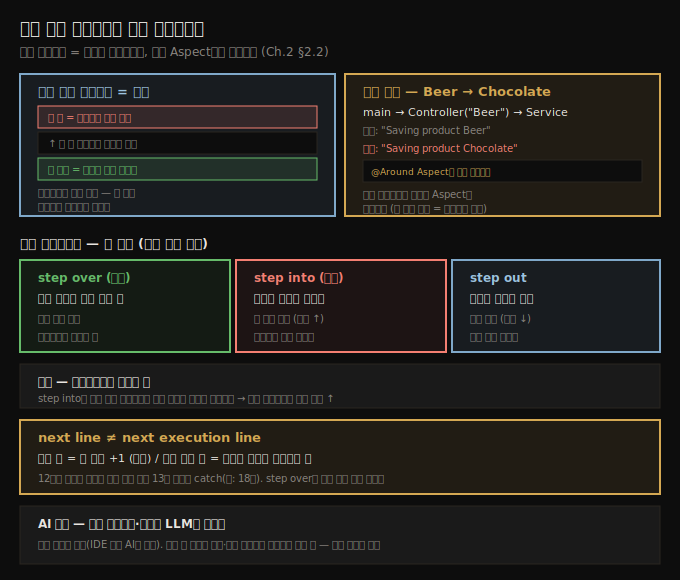

# 실행 스택 트레이스와 코드 네비게이션
---
> 실행 스택 트레이스는 "여기까지 어떻게 왔는가"를 알려 주는 메서드 호출의 빵부스러기이며, Spring Aspect 같은 숨은 로직도 드러내고, step over·into·out으로 평면을 여닫으며 코드를 누빕니다

이 노트는 『Troubleshooting Java』 2장의 핵심부(§2.2.1~§2.2.2)를 정리합니다. 앞 편(02-01)에서 breakpoint로 실행을 멈췄을 때 IDE가 변수 값과 함께 보여 주는 *실행 스택 트레이스*가 무엇이고 왜 필수인지를 먼저 다루고, 이어서 코드를 누비는 세 가지 기본 조작(step over·into·out)을 익힙니다. 스택 트레이스로 Spring Aspect의 숨은 로직을 잡아내는 사례가 이 편의 백미입니다.


## 1. 실행 스택 트레이스란 — 호출의 빵부스러기
> 스택 트레이스는 현재 멈춘 줄까지 메서드들이 서로를 호출한 경로를 트리로 보여 주는 지도이며, 맨 위가 멈춘 지점, 맨 아래(첫 층)가 스레드 실행 시작점입니다

실행 스택 트레이스는 디버깅 중 코드를 이해하는 값진 도구입니다. 지도처럼, 디버거가 멈춘 줄까지의 실행 경로를 보여 줘 다음에 어디로 갈지 정하게 해 줍니다. 트리 형태로 보면, 메서드들이 멈춘 지점까지 서로를 어떻게 호출했는지가 드러나고, 각 층에서 메서드 이름·클래스 이름·호출을 일으킨 줄을 찾을 수 있습니다.

> 💬 **정의**: 실행 스택 트레이스란 메서드 호출의 빵부스러기(breadcrumb trail)로, 프로그램이 지금 위치까지 어떻게 왔는지 알려 줍니다.

층의 의미는 분명합니다. **맨 위 층**이 디버거가 멈춘 지점이고, 그 아래 층들은 위 층의 메서드가 호출된 자리입니다. **맨 아래(첫) 층**은 현재 스레드의 실행이 시작된 곳입니다.

> **주의**: 예제에서는 `main()`이 늘 스택의 첫 줄로 보이지만, 실제 앱은 여러 스레드가 동시에 돌고 각 스레드가 자기 스택을 가집니다. 예를 들어 thread-per-request 웹 앱은 HTTP 요청마다 새 스레드를 만들므로, 스택의 시작점은 *어느 스레드가 그 코드를 실행하느냐*에 따라 달라집니다.


## 2. 숨은 로직 찾기 — Spring Aspect가 값을 바꾼 사례
> 프레임워크의 Aspect는 호출 체인에서 코드로 보이지 않게 실행을 가로채는데, 스택 트레이스를 보면 누가 값을 바꿨는지 드러납니다

저자가 가장 아끼는 스택 트레이스 용도는 **실행 경로에 숨은 로직을 찾는 것**입니다. 보통은 "누가 이 메서드를 불렀나"를 보는 데 쓰지만, Spring·Hibernate 같은 프레임워크를 쓰는 앱은 메서드의 실행 체인을 *바꿔* 놓기도 합니다. 

- Spring 앱은 흔히 **Aspect**(Java/Jakarta EE 용어로 interceptor)로 분리된 코드를 씁니다. 
- Aspect는 특정 조건에서 특정 메서드의 실행을 보강하는 로직인데, 코드를 읽을 때 호출 체인에 직접 보이지 않아 조사하기 까다롭습니다.

da-ch2-ex2 프로젝트가 이 사례입니다. `main`이 `ProductController.saveProduct("Beer")`를 부르고, 컨트롤러가 `ProductService.saveProduct(name)`를 불러 콘솔에 출력하는 단순한 흐름입니다.

```java
// listing 2.3 — main
c.getBean(ProductController.class).saveProduct("Beer");   // "Beer"를 넘김

// listing 2.4 — ProductController
public void saveProduct(String name) {
  productService.saveProduct(name);   // 받은 값을 그대로 서비스로
}

// listing 2.5 — ProductService
public void saveProduct(String name) {
  System.out.println("Saving product " + name);   // 콘솔 출력
}
```

당연히 `Saving product Beer`가 찍힐 것 같지만, 실제로는 `Saving product Chocolate`이 나옵니다. 어떻게 된 걸까요. 첫 단계는 **스택 트레이스로 누가 값을 바꿨는지 찾는 것**입니다. 다른 값을 찍는 줄에 breakpoint를 걸고 디버그로 실행해 스택 트레이스를 보면, 컨트롤러에서 곧장 서비스로 온 게 아니라 *Aspect가 실행을 가로챈* 것이 보입니다.

```java
// listing 2.6 — 실행을 가로채 "Beer"를 "Chocolate"으로 바꾸는 Aspect
@Aspect
@Component
public class DemoAspect {
  @Around("execution(* services.ProductService.saveProduct(..))")
  public void changeProduct(ProceedingJoinPoint p) throws Throwable {
    p.proceed(new Object[] {"Chocolate"});   // 인자를 바꿔치기
  }
}
```

- 스택 트레이스 없이는 이 다른 동작의 원인을 찾기가 훨씬 어렵습니다. Aspect는 유용한 기능이지만 잘못 쓰면 앱을 이해·유지하기 어렵게 만듭니다. 
- 저자는 분명히 합니다 — *이 기법(스택 트레이스로 숨은 Aspect 찾기)을 써야 한다는 건 그 앱이 유지보수하기 어렵다는 신호*입니다. 기술 부채 없는 클린 코드가 나중에 디버깅에 품을 들여야 하는 앱보다 늘 낫습니다.

> LLM도 스택 트레이스와 스코프 변수를 이해합니다. 
>
> - 멈춘 줄·스택 트레이스·변수 값을 화면 캡처로 제공하며 물으면 조사를 앞당길 수 있습니다. IDE에 통합된 AI(GitHub Copilot, IntelliJ AI Assistant)는 소스 컨텍스트에 접근하기 쉬워 일반 챗봇보다 효과적입니다. 
> - 다만 AI는 컨텍스트 부족으로 틀릴 수 있으니, 논리를 따라가 설명이 맞는지 검증하고 빠진 정보를 채우는 건 당신의 책임입니다. *AI에게 사건을 풀게 하는 게 아니라, 헷갈리는 부분을 이해하는 데 씁니다 — 푸는 사람은 당신입니다.*


## 3. 코드 네비게이션 — step over·into·out
> step over는 같은 메서드의 다음 줄, step into는 호출된 메서드 안으로, step out은 호출한 메서드로 돌아가며, 평면을 적게 열도록 step over를 우선합니다

breakpoint에서 멈춘 뒤, 데이터가 어떻게 바뀌는지 보려면 코드를 누벼야 합니다. 세 가지 기본 조작이 있습니다(GUI 버튼 또는 단축키).

| 조작 | 동작 | 평면(plan) 변화 |
|------|------|----------------|
| step over | 같은 메서드의 다음 실행 줄로 | 같은 평면 유지 (메서드가 끝나면 닫고 내려감) |
| step into | 현재 줄에서 호출된 메서드 *안으로* | 새 평면 열림 (스택 위로 커짐) |
| step out | 조사 중인 메서드를 호출한 곳으로 복귀 | 평면 닫고 스택 아래로 |

이상적으로는 **step over를 최대한 쓰며** 코드를 이해합니다. step into를 많이 할수록 조사 평면이 많이 열려 과정이 복잡해지기 때문입니다(앞 편의 "평면 최소" 원칙). 많은 경우 한 줄을 step over로 넘기며 출력만 봐도 그 줄이 무엇을 하는지 추론할 수 있습니다.

> 💬 **비유**: 영화 《인셉션》의 꿈속의 꿈처럼, 층을 깊이 들어갈수록 거기 머무는 시간이 길어집니다. 메서드로 step into 하는 것이 새 층을 여는 일이라, 깊이 들어갈수록 조사에 쓰는 시간이 늘어납니다.

`decode` 예제에서 11번 줄에 멈춘 뒤 step over 하면 12번 줄에서 멈추고, `digits` 변수가 초기화돼 그 값이 보입니다. 이 값으로 11번 줄이 무엇을 했는지(각 문자열의 자릿수 리스트) 안으로 들어가지 않고도 추론할 수 있습니다. 출력만으로 알기 어려울 때만 step into를 *최후의 수단*으로 씁니다.

step into로 들어갔다면, 먼저 **그 코드를 읽으십시오**. 저자는 학생들이 들어가자마자 읽지도 않고 디버깅에 돌입하는 걸 자주 봅니다. step into는 또 다른 평면을 여는 일이라, 효율적이려면 조사 단계를 다시 밟아야 합니다 — 메서드를 읽어 모르는 첫 줄을 찾고, 거기에 breakpoint를 걸어 시작합니다. 멈춰 읽어 보면 그 평면을 이어 갈 필요가 없다는 걸 알게 되는 경우가 많고, 그러면 step out으로 이전 평면(`decode`)으로 돌아갑니다. step out은 현재 평면이 스스로 닫힐 때까지 일일이 step over 하지 않아도 되는 지름길입니다.


## 4. next line ≠ next execution line
> 다음 줄은 항상 줄 번호 +1이지만, 다음 *실행* 줄은 예외 발생 같은 분기로 달라질 수 있고, step over는 다음 실행 줄로 이어집니다

저자는 "다음 줄(next line)"과 "다음 실행 줄(next execution line)"을 구분합니다. 디버거가 12번 줄에서 멈췄을 때 *다음 줄*은 늘 13번이지만, *다음 실행 줄*은 다를 수 있습니다. 12번 줄이 예외를 던지지 않으면 다음 실행 줄은 13번이지만, 예외를 던지면 catch 블록(예: 18번 줄)으로 건너뜁니다(da-ch2-ex3 예제).

**step over는 다음 *실행* 줄로 이어집니다.** 즉 12번에서 step over 했는데 12번이 예외를 던지면, 실행은 13번이 아니라 18번에서 멈춥니다. 다음 실행 줄이 늘 바로 아래 줄은 아니라는 점을 기억해야 합니다.


## 5. 면접 한 줄 정리
> 스택 트레이스와 네비게이션 조작을 한 문장으로 점검합니다

- **실행 스택 트레이스란?** 프로그램이 현재 위치까지 어떻게 왔는지 보여 주는 메서드 호출의 빵부스러기입니다. 맨 위가 멈춘 지점, 맨 아래가 스레드 시작점입니다.
- **스택 트레이스로 무엇을 잡나?** 프레임워크의 Aspect/interceptor처럼 코드에 안 보이는 숨은 로직을 드러냅니다. Beer가 Chocolate으로 바뀐 원인이 `@Around` Aspect임을 스택 트레이스로 찾습니다.
- **step over / into / out의 차이는?** over는 같은 메서드 다음 줄(같은 평면), into는 호출된 메서드 안(새 평면), out은 호출한 곳으로 복귀(평면 닫기)입니다.
- **왜 step over를 우선하나?** step into는 조사 평면을 새로 열어 복잡도와 시간을 늘리므로, 출력만으로 추론되는 줄은 over로 넘깁니다.
- **next line과 next execution line의 차이는?** 다음 줄은 줄 번호 +1이지만, 예외 등으로 실제 다음 *실행* 줄은 catch 블록으로 점프할 수 있고, step over는 다음 실행 줄을 따릅니다.



## 관련 문서
- [이 책 인덱스 (Troubleshooting Java MOC)](./README.md) — 장별 정독 노트 진척
- [코드 읽기의 본질과 디버거 기초](./02-01.코드%20읽기의%20본질과%20디버거%20기초.md) — 평면(plan) 개념과 breakpoint·attach
- [디버거가 부족한 다섯 가지 상황](./02-03.디버거가%20부족한%20다섯%20가지%20상황.md) — 디버거로 안 되는 경우와 대안 기법
