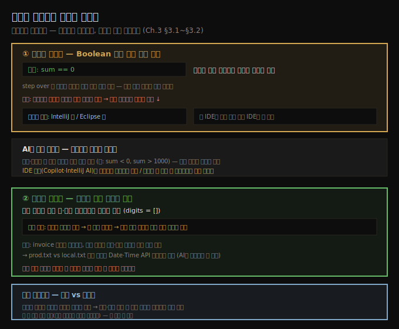

# 조건부 중단점과 비중단 중단점
---
> 조건부 중단점은 Boolean 식이 참일 때만 멈춰 원하는 경우로 곧장 데려가고, 비중단 중단점은 멈추지 않고 로그만 남겨 코드 수정 없이 실행을 관찰합니다

이 노트는 『Troubleshooting Java』 3장의 전반부(§3.1~§3.2)를 정리합니다. 2장이 step over·into·out 같은 *기본* 네비게이션이었다면, 3장은 많은 개발자가 과소평가하는 디버거의 *고급* 기능을 다룹니다. 이 편에서는 중단점 자체를 변형하는 두 기법 — 조건을 거는 조건부 중단점과, 멈추지 않고 로그만 남기는 비중단 중단점을 익힙니다. 데이터 변경·프레임 되감기는 다음 편(03-02)으로 이어집니다.




## 1. 조건부 중단점 — 원하는 경우에서만 멈춘다
> 변수가 특정 값일 때만 멈추도록 Boolean 식을 걸면, 관심 없는 반복을 모두 건너뛰고 조사하려는 상황에서 바로 시작합니다

디버깅할 때 우리는 흔히 *특정 값*에서 로직이 어떻게 도는지에만 관심이 있습니다. listing 3.1의 `decode`에서, `sum`이 가끔 0이 되는 이유만 조사하고 싶다고 합시다.

```java
// da-ch3-ex1 프로젝트
public class Decoder {
  public Integer decode(List<String> input) {
    try {
      int total = 0;
      for (String s : input) {
        var digits = new StringDigitExtractor(s).extractDigits();
        var sum = digits.stream().collect(Collectors.summingInt(i -> i));
        total += sum;
      }
      return total;
    } catch (Exception e) {
      return -1;
    }
  }
}
```

step over로 `sum`이 0이 되는 순간까지 일일이 넘길 수도 있습니다. 작은 데모라면 받아들일 만하지만, 실무에서는 그 경우에 닿을 때까지 수없이 step over 해야 하고, *언제 그 경우가 나타나는지조차* 모를 수 있습니다. **조건부 중단점(conditional breakpoint)**이 훨씬 효율적입니다. IntelliJ에서 중단점을 우클릭해 조건을 적으면 되고, 조건은 `true`/`false`로 평가되는 Boolean 식이어야 합니다. `sum == 0`을 걸면, 디버거는 `sum`이 0이 되는 경우에 *처음* 닿을 때만 멈춥니다. 자릿수가 없는 문자열을 만나 `sum`이 0이 되는 순간입니다.

> 💬 **정의**: 조건부 중단점은 특정 조건이 참일 때만 프로그램을 멈추는 특수한 중단점입니다. 특정 변수가 특정 값을 가질 때나 정한 규칙이 충족될 때만 실행을 멈추게 합니다.

원하는 경우를 찾아 헤맬 필요 없이, 앱을 그냥 돌게 두면 조건이 충족될 때 디버거가 멈춰 줍니다. 쉬운데도 많은 개발자가 이 방법을 잊고 단순화할 수 있는 시나리오에 시간을 허비합니다.


## 2. 조건부 중단점의 비용과 IDE 차이
> 디버거가 스코프 변수를 계속 가로채 조건을 평가하므로 실행 성능이 크게 떨어질 수 있고, 로그용 활용은 일부 IDE에서만 됩니다

조건부 중단점은 훌륭하지만 약점이 있습니다. 디버거가 스코프 안 변수 값을 *지속적으로 가로채* 조건을 평가해야 하므로, 실행 성능을 크게 떨어뜨릴 수 있습니다. 조건을 거는 줄이 자주 실행될수록 부담이 커집니다.

또 한 가지, 조건부 중단점으로 실행 세부(식 값·스택 트레이스 등)를 *로그로 남기는* 고급 기능은 IDE마다 다릅니다. IntelliJ는 More 버튼으로 이 설정을 열 수 있지만, Eclipse는 조건부 중단점은 같은 방식으로 쓰면서도 *실행 세부를 로깅하는 기능*은 제공하지 않습니다. 저자는 한 IDE에 너무 익숙해지지 말고 여러 IDE(Eclipse·NetBeans·JDeveloper 등)를 써 보며 자기와 팀에 맞는 걸 고르라고 권합니다. 예제가 IntelliJ를 쓴다고 그게 더 낫다는 뜻은 아닙니다.


## 3. AI로 조건 고르기 — 조수이되 목발은 아니다
> AI는 코드를 분석해 예외·이상을 잘 내는 변수를 짚고 중단점 조건을 제안할 수 있지만, 진단 근육은 스스로 길러야 하므로 목발로 삼지 않습니다

AI 도구는 조건부 중단점을 효과적으로 쓰도록 도와줍니다. 조사할 코드를 주면 예외나 이상 동작으로 자주 이어지는 변수를 식별해 조건을 추천합니다. 저자는 `if` 절에 일부러 작은 오류를 넣고 GitHub Copilot에 중단점 위치를 물어, 조건부 중단점과 적절한 조건을 제안받았습니다. AI가 처음에 조건부 중단점을 권하지 않아도 명시적으로 요청할 수 있고, 쓸 조건을 물어 시간을 아낄 수도 있습니다.

도구 선택에는 결이 있습니다. **IDE 통합 도구**(Copilot, IntelliJ AI Assistant)는 코드 컨텍스트에 직접 접근하므로, 스크린샷 없이도 중단점 위치를 제안합니다. **챗봇**(ChatGPT·Gemini)도 충분히 쓸 수 있지만, 줄 번호가 든 스크린샷처럼 컨텍스트를 직접 챙겨 줘야 합니다. 줄 번호가 없으면 ChatGPT는 문제의 줄이 17번임을 알 수 없습니다. 정보가 부족하면 도움을 못 주거나, 더 나쁘게는 해법을 *환각*합니다.

로그와 결합하는 방법도 있습니다(4장). 실행 로그와 그 로그를 만든 코드를 함께 AI에 주면, 많은 로그를 빠르게 분석해 이상 동작을 짚어 줍니다. 예를 들어 `sum`이 예기치 않게 음수가 되거나 임계값을 넘으면, `sum < 0`이나 `sum > 1000` 조건부 중단점을 제안해 미처 생각 못 한 문제 영역을 부각해 줍니다.

> **주의**: AI에만 의존해 조건을 만들거나 중단점 위치를 매번 정하게 두지 마십시오. 그 근육은 스스로 계속 단련해야 합니다. AI는 도움 주는 조수이지 목발이 아닙니다. 목표는 자기 진단 직관을 기르고 디버깅 실력을 벼리는 것이고, AI는 그 보조입니다.


## 4. 비중단 중단점 — 멈추지 않고 로그만 남긴다
> 코드를 수정하지 않고도 그 줄에 닿을 때마다 변수 값·스택 트레이스를 로그로 남겨, 실행 흐름을 끊지 않고 관찰합니다

저자가 아끼는 중단점 용법 하나는 **실행을 멈추지 않고** 이해에 필요한 세부를 로그로 남기는 것입니다. 많은 개발자가 단순히 조건부 중단점을 쓰면 될 일에 로그 명령을 직접 추가하느라 애를 먹습니다. IntelliJ에서 중단점이 실행을 멈추지 *않도록* 설정하면, 표시한 줄에 닿을 때마다 디버거가 메시지를 로그로 남깁니다. 예제에서는 `digits` 변수 값과 실행 스택 트레이스를 콘솔에 찍었고, `digits`는 빈 리스트 `[]`였습니다.

> 💬 **정의**: 비중단 중단점(non-blocking breakpoint)은 닿았을 때 정보(메시지·변수 값 등)를 로그로 남기되 프로그램 실행은 멈추지 않는 중단점입니다. 프로그램을 멈추지 않고도 특정 지점에서 무슨 일이 일어나는지 볼 수 있게 합니다.

이 기법은 조건부 중단점(§3.1)과 결합할 수 있고, 코드를 바꾸지 않고 로그를 남긴다는 게 핵심 이점입니다. 저자가 겪은 사례가 이를 잘 보여 줍니다. 크고 지저분한 코드베이스에서 정산·청구서를 만드는 장시간 스케줄 프로세스가 가끔 잘못된 청구서를 냈습니다. 문제 청구서만 따로 돌리면 정상이고, 전체를 다시 돌리면 *다른* 문서에서 오류가 나 원인을 짚기 까다로웠습니다.

로컬에서 실행할 수 있었던 저자는 비중단 중단점으로 코드를 바꾸지 않고 로그를 남겼습니다. 이 방법이 특히 값졌던 이유는 **서로 다른 환경의 똑같은 줄을 그대로 비교**할 수 있었기 때문입니다. 수동 로그 명령을 넣었다면 줄 번호가 바뀌어 나란히 비교하기 어려웠을 것입니다. 이렇게 해서 Date·Time API의 몇몇 조건이 출력에 무작위성을 들인 불규칙을 결국 찾아냈습니다. 저자는 그때 LLM이 있었다면 두 환경 로그를 비교·분석해 조사를 크게 줄였을 것이라며, 다음 같은 프롬프트를 떠올립니다 — 두 환경(`prod.txt`·`local.txt`)의 같은 프로세스 로그를 첨부하고, *기대와 다른 점*을 설명한 뒤 "맥락 차이를 분석·비교해 문제 출처를 짚어 달라"고 요청하는 식입니다.

> **스택 트레이스: 시각 vs 텍스트.** 콘솔에 찍히는 스택 트레이스는 시각 형태가 아니라 텍스트 형태인 경우가 많습니다. 텍스트의 장점은 콘솔·로그 파일 같은 어떤 텍스트 출력에도 저장된다는 것입니다. 둘은 같은 핵심 정보를 줍니다 — 어느 메서드가 어떻게 호출됐는지(예: `main`이 9번 줄에서 `decode`를 부르고, 그게 중단점 줄을 호출). 스택 트레이스의 첫 층은 맨 아래임을 기억합니다.


## 5. 두 기법의 자리 — 한눈 비교
> 조건부 중단점은 멈출 시점을 거르고, 비중단 중단점은 멈추지 않고 기록하므로, 목적에 따라 갈라 씁니다

| 기법 | 동작 | 언제 |
|------|------|------|
| 조건부 중단점 | 조건(Boolean)이 참일 때만 멈춤 | 관심 있는 경우로 곧장 가고 싶을 때. 단, 자주 실행되는 줄이면 성능 부담 |
| 비중단 중단점 | 멈추지 않고 닿을 때마다 로그 | 흐름을 끊지 않고 관찰·기록할 때, 코드 수정 없이 환경 간 비교할 때 |

> **주의**: AI 도구의 이런 보강은 *내 코드 이해의 보완*으로 써야 합니다. 일상적 작업과 통찰 표면화는 맡길 수 있어도, 미묘한 의사결정은 여전히 내 전문성에 달려 있습니다.


## 6. 면접 한 줄 정리
> 두 고급 중단점을 한 문장으로 점검합니다

- **조건부 중단점이란?** Boolean 조건이 참일 때만 멈추는 중단점입니다. step over로 원하는 경우를 찾아 헤맬 필요를 없애지만, 디버거가 변수를 계속 가로채 평가하므로 자주 실행되는 줄에선 성능이 떨어집니다.
- **비중단 중단점이란?** 멈추지 않고 닿을 때마다 변수 값·스택 트레이스를 로그로 남기는 중단점입니다. 코드를 바꾸지 않아 줄 번호가 그대로라, 환경 간 같은 줄을 나란히 비교할 수 있습니다.
- **왜 수동 로그보다 비중단 중단점인가?** 수동 로그는 줄 번호를 바꿔 환경 간 비교를 어렵게 하지만, 비중단 중단점은 코드를 건드리지 않습니다.
- **AI를 조건 고르기에 어떻게 쓰나?** 코드를 줘 예외·이상을 잘 내는 변수의 조건(`sum < 0` 등)을 제안받되, 진단 근육은 스스로 길러야 하므로 목발로 삼지 않습니다. IDE 통합 도구가 컨텍스트 접근에서 챗봇보다 유리합니다.


## 관련 문서
- [이 책 인덱스 (Troubleshooting Java MOC)](./README.md) — 장별 정독 노트 진척
- [실행 스택 트레이스와 코드 네비게이션](./02-02.실행%20스택%20트레이스와%20코드%20네비게이션.md) — 기본 네비게이션(이 편은 그 위의 고급 기법)
- [인메모리 데이터 변경과 프레임 되감기](./03-02.인메모리%20데이터%20변경과%20프레임%20되감기.md) — 나머지 두 고급 기법
