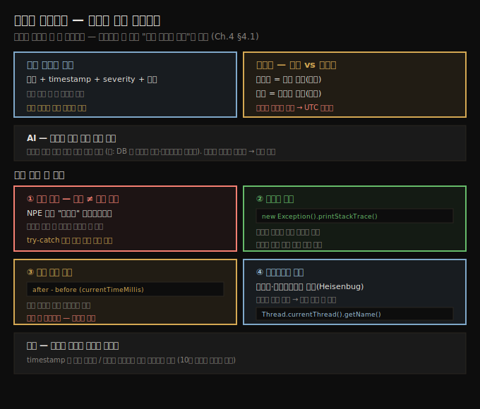

# 로그로 조사하기
---
> 로그는 과거를 기록한 항해일지여서 디버거가 보지 못하는 "지난 시간의 실행"을 보여 주고, 조사를 시작할 땐 늘 로그부터 읽어 출발점을 얻습니다

이 노트는 『Troubleshooting Java』 4장의 도입부와 §4.1을 정리합니다. 로깅은 소프트웨어와 함께 생긴 개념이 아닙니다. 배에는 모두 항해일지(logbook)가 있어 선원이 방향·속도 변경, 주고받은 명령, 마주친 사건을 기록하고, 사고가 나면 그 기록으로 원인을 가립니다. 체스 기사가 수를 적어 나중에 대국을 복기하듯, 앱도 메시지를 남겨 실행 중 무슨 일이 있었는지 추적합니다. 이 편에서는 로그가 *왜·언제* 유용한지, 그리고 예외·호출자·실행 시간·멀티스레드를 로그로 조사하는 네 기법을 익힙니다. 로그를 *어떻게 구현*하는지는 다음 편(04-02)으로 이어집니다.




## 1. 로그 메시지의 해부 — 시각·심각도·출처
> 로그는 본질적으로 문자열이지만, 좋은 로그는 설명에 더해 timestamp·severity·작성 위치를 담고, 중앙 집계 환경에서는 앱 식별자까지 있어야 출처를 되짚을 수 있습니다

로그 메시지는 그저 문자열이라 이론상 어떤 문장이든 될 수 있지만, 깨끗하고 쓸모 있는 로그는 모범 사례를 따릅니다. 설명(description)에 더해 **메시지를 쓴 시각(timestamp)**, **심각도(severity)**, **앱의 어느 부분이 썼는지(출처)**를 담아야 조사가 훨씬 쉬워집니다. 현대 시스템은 로그를 로그 관리 플랫폼·관측(observability) 스택 같은 중앙 위치에 모으는데, 이때 각 항목에 **그 로그를 만든 앱의 이름(식별자)**이 없으면 메시지를 원래 컴포넌트로 되짚을 수 없습니다.

로그가 효율적인 조사 수단이 되는 상황은 다음과 같습니다.

- 이미 일어난 사건이나 사건의 타임라인을 조사할 때
- 앱에 간섭하면 동작이 바뀌는 문제(Heisenbug)를 조사할 때
- 앱의 장기적 동작을 이해할 때
- 즉시 대응이 필요한 중대 사건에 경보를 울릴 때

저자가 강조하는 핵심은, 로그는 *나중을 위해 미리 설계*하는 것이 중요하다는 점입니다. 처음에 로그를 어떻게 설계하느냐가 훗날의 조사를 좌우합니다. 그리고 조사를 시작할 땐 **무엇보다 먼저 로그를 읽으라**고 권합니다. 로그는 이상 동작을 즉시 드러내 어디서 시작할지 짚어 주는 경우가 많고, 출발점만 얻어도 큰 시간을 법니다.


## 2. 과거 vs 현재 — 로그와 디버거의 시간축
> 디버거는 멈춘 그 순간의 데이터에 집중하지만, 로그는 지난 시간의 실행에 집중하므로, 둘은 시간축이 달라 상황에 따라 갈라 씁니다

로그의 가장 큰 장점 하나는 특정 시점 코드 실행을 *시각화*한다는 것입니다. 디버거(2~3장)를 쓸 때는 주의가 주로 **현재**에 쏠립니다. 멈춘 줄에서 데이터가 어떤지를 보고, 실행 이력은 스택 트레이스로 경로만 알 뿐 그 밖은 현재에 집중돼 있습니다. 반면 로그는 **과거의 일정 기간** 실행에 집중하고, 시간과 강한 관계를 맺습니다. 이 차이가 접근법 선택을 돕습니다 — 지나간 일을 재구성하려면 로그, 지금 이 순간을 들여다보려면 디버거입니다.

> **타임존 주의**: 앱이 도는 시스템의 타임존을 늘 의식해야 합니다. 시스템 타임존과 개발자·모니터링 도구의 타임존이 어긋나면 로그 타임스탬프가 몇 시간씩 틀어져 트러블슈팅 중 혼란의 원천이 됩니다. 여러 서비스·리전에서 중앙으로 모을 땐 일관된 타임스탬프 형식과 타임존을 쓰고, 전역 분산 클라우드에서는 **UTC** 같은 단일 타임존으로 표준화하면 시스템 간 사건을 맞추기 쉬워집니다.


## 3. AI로 대용량 로그 분석 — 지치지 않는 조수
> AI는 수십만 줄 로그도 지치지 않고 훑어 특정 문제 관련 항목을 추려 주며, 완벽한 정확도가 필요 없는 분류·집계 작업에서 시간을 크게 아낍니다

대용량 로그를 조사할 때 AI가 특히 유용합니다. IDE 통합 도구(GitHub Copilot, IntelliJ AI Assistant)는 코드베이스와 IDE 콘솔에 접근하므로 "로그를 확인해 문제 출처를 찾아 달라"처럼 간단히 물을 수 있습니다. IDE 통합이 없으면 챗봇(ChatGPT·Gemini)으로도 충분히 방향을 잡고, 같은 대화에서 컨텍스트를 점진적으로 더해 갑니다. 답이 더디면 디버깅이나 프로파일링 같은 다른 기법을 고려합니다.

특히 빛나는 용도는 **전체 로그 파일을 주고 특정 문제 관련 항목을 추리게** 하는 것입니다. AI는 사람과 달리 방대한 로그를 훑어도 지치지 않아, 문제를 가리키는 항목을 짚거나 검토할 데이터를 크게 줄여 줍니다. postmortem 조사에서 며칠치 로그를 뒤져 근본 원인을 찾을 때 이렇게 씁니다.

```text
첨부한 로그 파일에서 데이터베이스 락(lock)과 관련된 모든 예외를 찾아 주세요.
그 예외를 던진 쿼리별로, 또는 원인으로 보이는 코드 메서드별로 묶어 주세요.
```

수십만 줄을 수작업으로 하면 지치고 오래 걸리지만, 이 경우 **완벽한 정확도는 중요하지 않습니다**. AI가 몇 항목을 놓치거나 잘못 분류해도, "어느 컴포넌트가 DB 락을 일으키나" 같은 목표는 여전히 달성됩니다. 진짜 이점은 속도입니다 — 손으로 몇 시간~며칠 걸릴 일이 수 초~수 분으로 줄어듭니다.


## 4. 로그로 예외 식별 — 위치는 근본 원인이 아니다
> 로그의 예외 스택 트레이스는 어디서 잘못됐는지 알려 주지만, 그 위치가 근본 원인은 아니므로, try-catch로 국소 처리하기 전에 원인을 먼저 이해해야 합니다

로그에서 예외 스택 트레이스를 흔히 봅니다. `NullPointerException`은 어떤 명령이 객체 참조가 없는 변수를 통해 속성·메서드에 접근했음을 알려 줍니다. 다만 결정적으로 중요한 점이 있습니다.

> **주의**: 예외가 난 위치가 곧 문제의 근본 원인은 아닙니다. 예외는 *어디서* 잘못됐는지 알려 줄 뿐, 예외 자체가 다른 곳 문제의 *결과*일 수 있습니다. try-catch-finally나 if-else로 국소 해결을 서두르지 말고, 먼저 근본 원인을 이해한 뒤 해법을 찾으십시오.

저자는 이 개념이 초보자를 자주 혼란에 빠뜨린다고 합니다. 로그에서 `NullPointerException`을 보면 먼저 "왜 그 참조가 없지?"를 물어야 합니다. 앱이 *앞서* 실행한 어떤 명령이 기대대로 안 돌았기 때문일 수 있습니다. 국소 해결은 문제를 양탄자 밑으로 쓸어 넣는 것과 같아서, 근본 원인이 남으면 나중에 더 많은 문제가 터집니다.


## 5. 예외 스택 트레이스로 호출자 찾기
> 예외는 던지지 않아도 실행 스택 트레이스를 담으므로, 메서드 첫 줄에 new Exception().printStackTrace()를 두면 디버거 없이 누가 그 메서드를 불렀는지 알 수 있습니다

저자가 실무에서 유용하게 쓰는, 흔치 않은 기법 하나는 **예외 스택 트레이스를 로그로 찍어 특정 메서드의 호출자를 찾는 것**입니다. 크고 지저분한 코드베이스에서 원격 환경의 메서드를 누가 부르는지 알아내기는 어렵습니다. 코드만 읽으면 호출 경로가 수백 가지로 보이기 때문입니다.

Java 예외에는 자주 간과되는 능력이 있습니다 — 실행 스택 트레이스를 담는다는 것입니다(그래서 예외 스택 트레이스라고도 부르며, 둘은 같습니다). 이 정보는 **예외를 던지지 않고도** 얻을 수 있습니다.

```java
// listing 4.1 — da-ch4-ex1. 디버거 없이 호출 경로를 찍는다
public List<Integer> extractDigits() {
  new Exception().printStackTrace();   // 예외를 던지지 않고 스택 트레이스만 출력 → 로직에 간섭하지 않음
  List<Integer> list = new ArrayList<>();
  for (int i = 0; i < input.length(); i++) {
    if (input.charAt(i) >= '0' && input.charAt(i) <= '9') {
      list.add(Integer.parseInt(String.valueOf(input.charAt(i))));
    }
  }
  return list;
}
```

이 코드는 스택 트레이스만 찍고 예외를 던지지 않으므로 실행 로직을 건드리지 않습니다. 출력을 보면 `extractDigits()`가 `Decoder`의 11번 줄, `decode()` 안에서 호출됐고, 그 `decode()`는 `Main`의 9번 줄에서 불렸음이 드러납니다. 디버거 없이 호출 흐름을 즉시 짚는 셈입니다.


## 6. 실행 시간 측정과 멀티스레드 조사
> 두 timestamp 차이로 특정 코드의 실행 시간을 재 느린 파라미터를 찾고, 멀티스레드는 디버거보다 간섭이 적은 로그로 스레드 이름·순서를 기록해 조사합니다

**실행 시간 측정.** 어떤 코드의 실행 시간은 전후 timestamp 차이를 로그로 남겨 잽니다. 느린 쿼리의 원인 파라미터를 찾을 때 유용합니다.

```java
// listing 4.2 — 특정 줄의 실행 시간을 로그로
long timeBefore = System.currentTimeMillis();        // 실행 전 시각
var products = productRepository.findAll();           // 측정 대상
long spentTimeInMillis = System.currentTimeMillis() - timeBefore;  // 차이 = 소요 시간
log.info("Execution time: " + spentTimeInMillis);
```

이 기법은 간단하고 효과적이지만 **조사 중 임시로만** 씁니다. 나중엔 필요 없고 코드 가독성을 떨어뜨리므로, 문제를 풀면 이런 로그는 제거합니다.

**멀티스레드 조사.** 멀티스레드 아키텍처는 외부 간섭에 민감해서, 디버거·프로파일러를 쓰면 일부(또는 모든) 스레드가 느려져 명령 순서가 바뀌고 원하는 동작을 조사할 수 없게 됩니다(Heisenbug). 반면 **로그는 간섭 가능성이 작아** 흐름을 바꿀 만큼 영향을 주지 않으므로, 조사용 데이터를 얻는 해법이 됩니다. 로그에는 timestamp가 있어 메시지를 정렬해 연산 순서를 알 수 있고, 어느 스레드가 실행했는지 이름을 함께 남기면 도움이 됩니다.

```java
String threadName = Thread.currentThread().getName();  // 현재 스레드 이름
```

Java의 모든 스레드는 이름을 가집니다. 개발자가 붙이거나, JVM이 `Thread-x`(x는 증가 숫자) 패턴으로 식별합니다(첫 스레드 `Thread-0`, 다음 `Thread-1`). 스레드에 이름을 붙이는 것은 좋은 습관이라, 조사할 때(특히 10장 스레드 덤프에서) 식별이 쉬워집니다.


## 7. 면접 한 줄 정리
> 로그로 조사하는 핵심을 한 문장으로 점검합니다

- **로그와 디버거의 시간축 차이는?** 디버거는 멈춘 그 순간(현재)을, 로그는 지나간 일정 기간(과거)을 봅니다. 지난 일을 재구성하려면 로그, 지금을 보려면 디버거입니다.
- **왜 "예외 위치 ≠ 근본 원인"인가?** 예외는 어디서 잘못됐는지만 알려 주고, 그 자체가 다른 곳 문제의 결과일 수 있습니다. try-catch로 국소 처리하기 전에 원인을 먼저 이해해야 합니다.
- **호출자를 어떻게 찾나?** 예외는 던지지 않아도 스택 트레이스를 담으므로, 메서드 첫 줄에 `new Exception().printStackTrace()`를 두면 로직에 간섭하지 않고 호출 경로를 찍을 수 있습니다.
- **왜 멀티스레드엔 로그인가?** 디버거·프로파일러는 간섭해 실행 순서를 바꾸지만(Heisenbug), 로그는 간섭이 작아 흐름을 거의 안 바꿔 timestamp·스레드 이름으로 순서를 재구성할 수 있습니다.
- **AI로 대용량 로그를 어떻게 쓰나?** 전체 로그를 주고 특정 문제(예: DB 락) 관련 항목을 묶게 합니다. 완벽한 정확도가 필요 없는 분류라 몇 개 놓쳐도 목표는 달성되고, 속도 이점이 큽니다.


## 관련 문서
- [이 책 인덱스 (Troubleshooting Java MOC)](./README.md) — 장별 정독 노트 진척
- [조건부 중단점과 비중단 중단점](./03-01.조건부%20중단점과%20비중단%20중단점.md) — 비중단 중단점이 코드 수정 없이 로그를 남기는 기법(이 장과 연결)
- [로그 영속화와 로깅 레벨](./04-02.로그%20영속화와%20로깅%20레벨.md) — 로그를 어떻게 저장·분류·구현하는가
