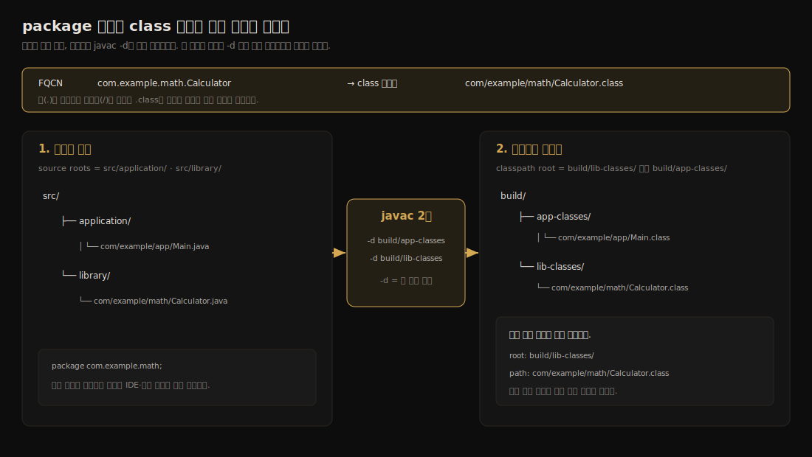
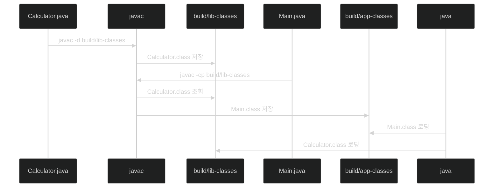
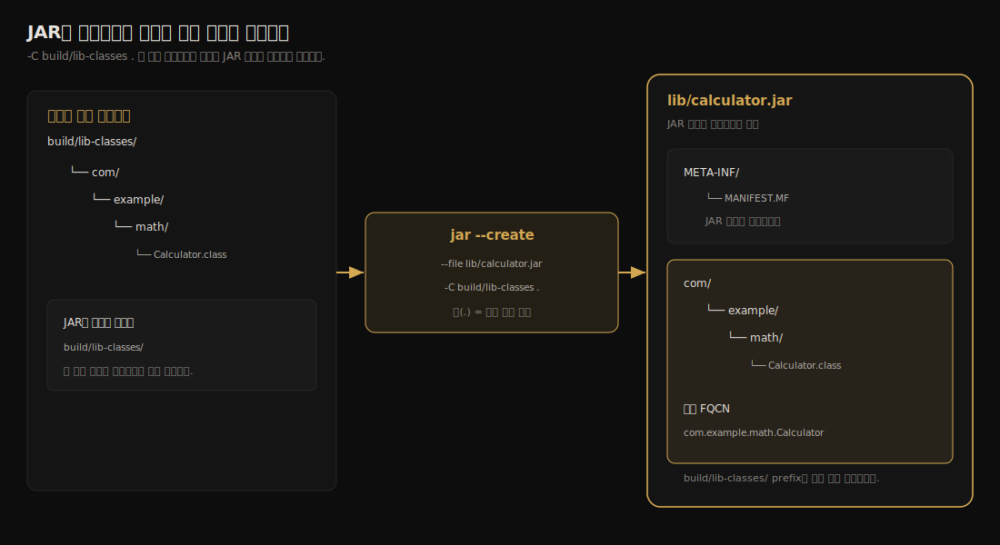
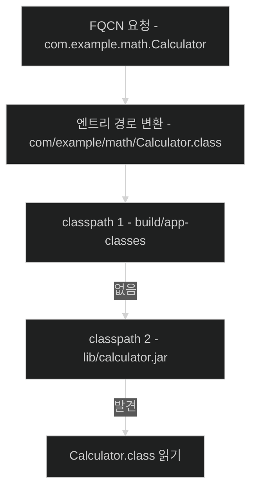
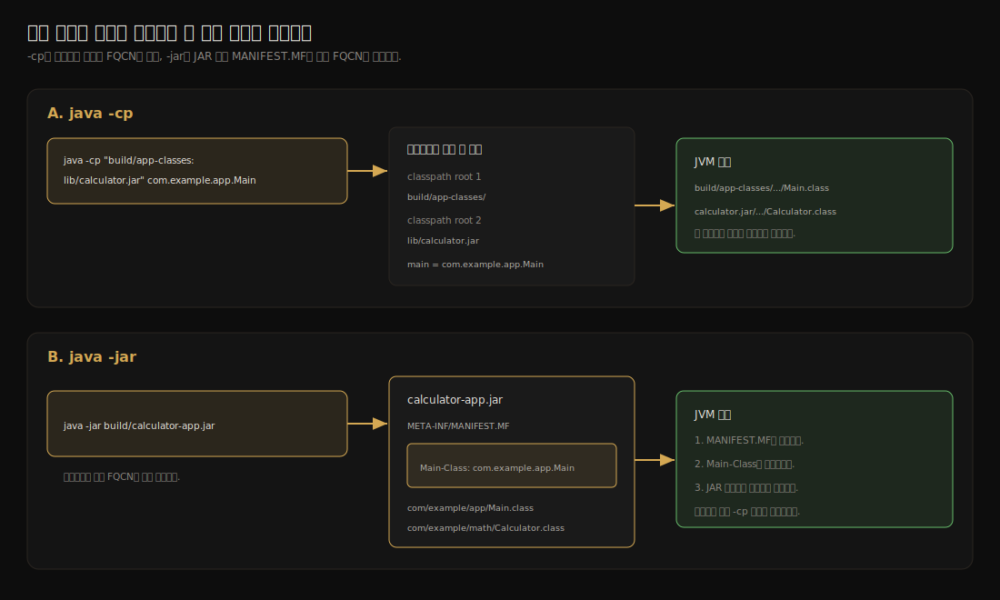

# 패키지·JAR·클래스패스

---

> IDE의 실행 버튼과 Gradle 빌드 뒤에는 단순한 규칙 하나가 있습니다.
>
> Java 도구는 완전 수식 클래스 이름을 경로로 바꾸고, 클래스패스에 등록된 디렉터리와 JAR에서 그 경로를 찾습니다.

IDE에서는 라이브러리를 추가한 뒤 실행 버튼만 누르면 됩니다. 그 사이에 소스 컴파일, 출력 디렉터리 생성, 의존성 JAR 선택, 클래스패스 조립이 자동으로 일어납니다. 평소에는 이 과정이 보이지 않지만, 자동화가 깨져 `package ... does not exist`나 `ClassNotFoundException`이 뜨면 도구가 숨긴 규칙을 직접 펼쳐 볼 수 있어야 합니다.

이 글은 빌드 도구 없이 작은 계산기 라이브러리를 컴파일하고 JAR로 묶은 뒤 애플리케이션에서 호출합니다. 이 흐름을 따라가면 패키지, JAR, 클래스패스가 서로 다른 개념이면서 어떻게 하나의 탐색 규칙으로 연결되는지 확인할 수 있습니다.

실습에는 JDK 도구 네 개가 등장합니다. 빌드 도구가 평소 이들을 대신 호출합니다.

| 도구 | 하는 일 |
|------|---------|
| `javac` | 자바 소스(`.java`)를 바이트코드(`.class`)로 컴파일합니다. |
| `java` | JVM을 시작해 지정한 클래스의 `main` 메서드를 실행합니다. |
| `jar` | 클래스와 리소스를 JAR 한 파일로 묶거나 그 내용을 들여다봅니다. |
| `javap` | 컴파일된 `.class` 파일이 기억하는 클래스 이름과 시그니처를 보여 줍니다. |

- 읽는 순서는 다음과 같습니다. 1절에서 세 개념을 한눈에 구분하고, 2절에서 모든 탐색의 바탕이 되는 "이름 → 경로" 규칙을 세웁니다. 
- 3절부터 6절까지는 그 규칙을 컴파일·JAR·실행에 적용하며 계산기를 직접 만들어 봅니다. 
- 7절 이후는 멀티 로더와 오류 진단을 다루는 심화이고, 부록에 명령어 플래그를 모았습니다.


## 1. 세 개념을 먼저 구분합니다

> 패키지는 이름, JAR는 보관 형식, 클래스패스는 탐색 범위입니다. 셋을 같은 것으로 뭉뚱그리면 오류가 난 지점을 찾기 어렵습니다.

세 단어는 자주 함께 등장해 섞이기 쉽지만 각자 해결하는 문제가 다릅니다. 본문에 들어가기 전에 한 장으로 갈라 둡니다.

| 개념 | 해결하는 문제 | 물리적 모습 | 예시 |
|------|---------------|-------------|------|
| 패키지 | 클래스 이름 충돌을 피하고 타입을 묶음 | `.class` 내부 이름과 디렉터리 계층 | `com.example.math` |
| JAR | 클래스와 리소스를 한 파일로 배포함 | ZIP 기반 아카이브 | `calculator.jar` |
| 클래스패스 | 컴파일러와 실행기가 찾을 위치를 정함 | 디렉터리·JAR·ZIP 목록 | `build/classes:lib/a.jar` |

세 개념은 하나의 탐색 흐름으로 이어집니다. 패키지는 *어느 엔트리*를 찾을지 정하고, 클래스패스는 *어느 루트부터* 검사할지 정하며, JAR는 그 루트가 디렉터리 대신 압축 파일일 수 있게 합니다. 다음 절부터 이 흐름을 하나씩 세웁니다.


## 2. 이름이 경로가 됩니다

> `com.example.math.Calculator`라는 이름은 클래스패스의 각 루트에서 `com/example/math/Calculator.class`를 찾으라는 요청입니다.

Java가 클래스를 식별할 때 기준으로 삼는 값은 완전 수식 클래스 이름(fully qualified class name, FQCN)입니다. 

`Calculator`는 단순 이름이고 `com.example.math.Calculator`는 패키지까지 포함한 FQCN입니다. 같은 `Calculator`라도 패키지가 다르면 서로 다른 타입으로 구분됩니다. 이것이 1절에서 말한 "패키지가 이름 충돌을 막는다"의 실제 모습입니다.

다음 클래스의 FQCN은 `com.example.math.Calculator`입니다.

```java
// src/library/com/example/math/Calculator.java
package com.example.math;

public final class Calculator {
    private Calculator() {
    }

    public static int add(
            int left,
            int right) {
        return left + right;
    }
}
```

실습을 시작하기 전 `tree src`로 확인한 소스 구조는 다음과 같습니다. 이 ASCII 트리는 개념을 새로 그린 그림이 아니라 실제 디렉터리 출력입니다.

```text
src/
├── application/
│   └── com/example/app/Main.java
└── library/
    └── com/example/math/Calculator.java
```

핵심 규칙은 하나입니다. **FQCN의 점은 디렉터리 구분자로 바뀌고, 그 앞에 탐색의 시작점인 루트가 붙습니다.**

```text
최종 위치 = 루트 + (FQCN의 점을 / 로 바꾼 경로) + .class
```

`javac -d build/lib-classes`로 컴파일하면 결과는 `build/lib-classes/com/example/math/Calculator.class`에 놓입니다. 여기서 `build/lib-classes`가 루트이고 그 아래 `com/example/math`가 패키지 경로입니다.



- 그림에서 `src`, `build/lib-classes`, `build/app-classes`는 경로에 포함되지만 FQCN에는 포함되지 않습니다. 셋 다 패키지 계층이 *시작되는* 루트이기 때문입니다. 
- `com.example.math.Calculator`는 `build/lib-classes` 뒤에 `com/example/math/Calculator.class`를 붙여 찾고, `com.example.app.Main`은 `build/app-classes` 뒤에 `com/example/app/Main.class`를 붙여 찾습니다. 루트가 무엇이든 "루트 + 패키지 경로" 규칙은 같습니다.

이 규칙은 위치만으로 타입이 정해지지 않는다는 사실과 짝을 이룹니다. `.class` 파일은 바이트코드 안에도 자신의 FQCN을 기록합니다. 그래서 패키지 선언 없이 컴파일한 클래스를 임의로 `com/example/math` 폴더에 옮겨도 그 폴더의 패키지 클래스가 되지 않습니다.

애플리케이션은 이 계산기 클래스를 다음처럼 가져옵니다.

```java
// src/application/com/example/app/Main.java
package com.example.app;

import com.example.math.Calculator;

public final class Main {
    private Main() {
    }

    public static void main(String[] args) {
        System.out.println(Calculator.add(
                20,
                22)
        );
    }
}
```

- 한편 `import`는 이 탐색에 끼어들지 않습니다. `import com.example.math.Calculator;` 덕분에 본문에서 `com.example.math.Calculator.add(...)` 대신 `Calculator.add(...)`라고 쓸 수 있지만, `import`가 라이브러리를 내려받거나 `.class` 위치를 등록하지는 않습니다. 
- 클래스를 찾을 위치는 오직 클래스패스가 정합니다. 그래서 소스와 `import`가 올바르더라도 클래스패스에 클래스가 없으면 탐색은 실패합니다.


## 3. 컴파일과 실행은 서로 다른 일입니다

> `javac`는 소스를 바이트코드로 번역하고, `java`는 JVM을 시작해 지정한 클래스의 `main` 메서드를 호출합니다. 두 도구는 클래스를 찾을 위치를 **각자 따로** 받습니다.

다음 명령은 계산기와 애플리케이션을 서로 다른 출력 디렉터리에 컴파일합니다.

```bash
mkdir -p build/lib-classes build/app-classes

# -d: 결과 .class 를 저장할 위치 (출력)
javac -d build/lib-classes \
  src/library/com/example/math/Calculator.java

# -cp: 의존 클래스를 찾을 위치 (입력) / -d: 결과 저장 위치 (출력)
javac -cp build/lib-classes \
  -d build/app-classes \
  src/application/com/example/app/Main.java
```

컴파일 직후 `find build -type f | sort`로 확인한 결과는 다음과 같습니다.

```text
build/app-classes/com/example/app/Main.class
build/lib-classes/com/example/math/Calculator.class
```

- 여기서 한 컴파일 명령이 받는 입력과 출력이 갈립니다. 두 번째 `javac`의 `-cp build/lib-classes`는 컴파일러가 `Calculator.class`를 *찾을* 위치(입력)이고, `-d build/app-classes`는 새로 만든 `Main.class`를 *저장할* 위치(출력)입니다. 
- `-cp`의 `cp`는 classpath, `-d`의 `d`는 destination으로 외우면 둘을 바꿔 쓰지 않습니다. 첫 번째 `javac`에 `-cp`가 없는 이유는 계산기가 외부 사용자 클래스를 참조하지 않아 찾을 의존성이 없기 때문입니다.

두 번의 컴파일과 한 번의 실행을 시간순으로 놓으면 입력이 언제 필요한지 드러납니다.



실행할 때는 두 출력 디렉터리를 모두 클래스패스에 넣고 FQCN을 넘깁니다.

```bash
# macOS와 Linux
java -cp "build/app-classes:build/lib-classes" com.example.app.Main
```

출력은 `42`입니다. `java` 뒤에 파일 경로인 `build/app-classes/com/example/app/Main.class`를 적지 않는 이유는 실행기가 클래스 *이름*을 받아 2절의 규칙으로 경로를 계산하기 때문입니다. `.class` 파일이 기억하는 이름은 `javap`로 확인할 수 있습니다.

```bash
javap -classpath build/lib-classes com.example.math.Calculator
```

출력의 클래스 선언에 `com.example.math.Calculator`가 나타납니다.

여기서 이 글에서 가장 자주 쓰이는 구분이 나옵니다. **`javac -cp`와 `java -cp`는 옵션 이름이 같아도 서로 다른 프로세스의 입력입니다.** 

- 컴파일은 타입과 시그니처가 맞는지 *검증*하려고 클래스를 찾고, 실행은 그 클래스를 실제로 *로딩*하려고 찾습니다.
- 컴파일 성공이 런타임 클래스패스를 저장하거나 전달해 주지 않습니다.

이 분리가 "컴파일은 됐는데 실행이 실패하는" 현상의 정체입니다. IDE가 컴파일할 때는 라이브러리를 넣었지만 배포 스크립트의 실행 클래스패스에서 JAR를 빠뜨리면, 소스와 `import`가 올발라도 JVM은 필요한 클래스를 읽지 못합니다. 컴파일에 쓴 의존성 집합과 실행에 쓴 집합을 같다고 가정하면 배포 후에만 드러나는 실패가 생깁니다.


## 4. JAR는 클래스패스 루트를 한 파일로 묶습니다

> JAR(Java Archive)는 ZIP 형식에 클래스와 리소스, Java 메타데이터를 담는 배포 단위입니다. JAR로 바꿔도 2절의 탐색 규칙은 달라지지 않습니다.

계산기 클래스 디렉터리를 JAR로 묶으면 다른 프로젝트에 파일 하나로 전달할 수 있습니다.

```bash
mkdir -p lib

jar --create \
  --file lib/calculator.jar \
  -C build/lib-classes .

jar --list --file lib/calculator.jar
```

마지막 명령의 실제 출력은 다음과 같습니다.

```text
META-INF/
META-INF/MANIFEST.MF
com/
com/example/
com/example/math/
com/example/math/Calculator.class
```

- `-C build/lib-classes .`는 해당 디렉터리로 이동한 것처럼 그 아래 내용만 JAR 루트에 넣으라는 뜻입니다. 그래서 JAR 안에는 `com/example/math/Calculator.class`가 들어가고 `build/lib-classes`라는 로컬 디렉터리 이름은 포함되지 않습니다. 
- **JAR 자체가 새로운 클래스패스 루트가 되기 때문입니다.** 디렉터리 루트에서 `com/example/math/Calculator.class`를 찾던 도구가 이제 `calculator.jar` 내부에서 같은 엔트리를 찾을 뿐, 규칙은 그대로입니다.



왼쪽의 `build/lib-classes`는 JAR를 만드는 컴퓨터에만 존재하는 출력 경로이고, 오른쪽 JAR 안에서는 `META-INF`와 `com`이 곧바로 루트에서 시작합니다. 다른 컴퓨터에 `calculator.jar` 하나만 전달해도 같은 FQCN을 찾을 수 있는 이유입니다.

### 4.1 META-INF는 JAR의 메타데이터를 담습니다

`jar` 도구는 기본적으로 `META-INF/MANIFEST.MF`를 만듭니다. 

- 매니페스트(Manifest)는 진입점인 `Main-Class`, 외부 라이브러리의 상대 경로인 `Class-Path`, 패키지 버전과 봉인 여부 같은 메타데이터를 기록합니다. 
- JAR는 ZIP 기반이라 압축 도구로도 열 수 있지만, 목록 확인에는 운영체제와 무관하게 일정한 `jar --list`가 편합니다.

`META-INF`는 매니페스트만 담는 자리가 아닙니다. 

- `META-INF/services/` 아래에 인터페이스 FQCN을 이름으로 갖는 파일을 두고 그 안에 구현체 FQCN을 적으면, `java.util.ServiceLoader`가 런타임에 그 파일을 읽어 구현체를 찾습니다. 
- 이것이 SPI(Service Provider Interface) 메커니즘이며 JDBC 드라이버나 SLF4J 바인딩이 이 방식으로 구현체를 등록합니다. 정리하면 `META-INF`는 "이 JAR를 어떻게 실행할지"(`MANIFEST.MF`)와 "이 JAR가 어떤 구현체를 제공하는지"(`services/`)를 함께 담습니다.

### 4.2 JAR와 WAR는 무엇이 다른가

배포 단위에는 JAR 말고 WAR도 있습니다. 둘 다 ZIP 기반 아카이브라는 점은 같지만 담는 내용과 실행 주체가 다릅니다.

| 항목 | JAR (Java Archive) | WAR (Web Application Archive) |
|------|--------------------|------------------------------|
| 용도 | 라이브러리·일반 애플리케이션 배포 | 웹 애플리케이션을 서블릿 컨테이너에 배포 |
| 내부 구조 | `com/...` 패키지 계층이 루트에서 시작 | `WEB-INF/classes`(클래스)·`WEB-INF/lib`(의존 JAR)·정적 리소스 |
| 클래스 탐색 루트 | JAR 자신 | `WEB-INF/classes`와 `WEB-INF/lib/*.jar` |
| 실행 주체 | `java -jar` 또는 클래스패스에 올린 다른 애플리케이션 | 외부 톰캣 같은 서블릿 컨테이너가 적재·실행 |

WAR는 웹 컨테이너가 정한 규약을 따르는 JAR라고 볼 수 있습니다. 컨테이너는 `WEB-INF/classes`와 `WEB-INF/lib`를 그 웹앱 전용 탐색 루트로 삼고, 컨테이너 자신이 제공하는 API는 부모 로더에 둡니다. 이 소유권 경계는 7절에서 다룹니다. Spring Boot처럼 톰캣을 내장해 `java -jar`로 직접 실행할 때는 WAR 대신 실행 JAR를 쓰며, 그 구조는 6절에서 설명합니다.


## 5. 클래스패스는 탐색 루트의 목록입니다

> 클래스패스(class path)는 사용자 클래스와 리소스를 찾을 디렉터리, JAR, ZIP의 순서 있는 목록입니다.

클래스패스를 "클래스 파일이 있는 경로"라고만 외우면 어느 디렉터리를 넣어야 하는지 헷갈립니다. 더 정확한 정의는 *패키지 계층이 시작되는 탐색 루트의 목록*입니다. 도구는 요청받은 FQCN을 2절 규칙으로 상대 경로로 바꾼 뒤 각 루트 뒤에 붙여 봅니다.

```bash
요청 FQCN    : com.example.math.Calculator
상대 경로    : com/example/math/Calculator.class

classpath #1 : build/app-classes/
# 확인할 위치  : build/app-classes/com/example/math/Calculator.class  → 없음

classpath #2 : lib/calculator.jar
# 확인할 엔트리: com/example/math/Calculator.class                   → 발견
```

이 과정을 흐름으로 그리면 다음과 같습니다. 패키지가 어느 엔트리를 찾을지 결정하고, 클래스패스가 어느 루트부터 검사할지 결정합니다.



- 가장 흔한 실수는 루트를 너무 깊게 잡는 것입니다. `build/app-classes/com/example/math`를 클래스패스에 넣으면 도구가 그 뒤에 패키지 경로를 *다시* 붙여 `.../com/example/math/com/example/math/Calculator.class`를 찾으려 합니다. 
- 디렉터리 클래스패스는 `.class`가 있는 마지막 폴더가 아니라 `com` 디렉터리의 *부모*여야 합니다.

### 5.1 클래스패스 항목이 될 수 있는 것

클래스패스 한 칸에는 디렉터리, JAR, ZIP을 넣을 수 있습니다. 모양은 달라도 모두 "이 안을 패키지 계층의 루트로 보라"는 같은 계약을 가집니다.

| 항목 | 도구가 루트로 보는 곳 | 올바른 예 | 주의점 |
|------|----------------------|-----------|--------|
| 디렉터리 | 해당 디렉터리 바로 아래 | `build/app-classes` | 패키지 폴더 자체가 아니라 그 부모를 지정합니다. |
| JAR·ZIP | 아카이브 내부 최상위 | `lib/calculator.jar` | JAR가 있는 폴더만 적어서는 JAR 내부를 찾지 않습니다. |
| 현재 디렉터리 | 명령을 실행한 작업 디렉터리 | `.` | 실행 위치가 바뀌면 뜻도 바뀌므로 자동화에서는 명시 경로가 안전합니다. |
| JAR 와일드카드 | 지정한 폴더의 모든 `.jar`·`.JAR` | `lib/*` | `lib/*.jar`가 아니라 `lib/*`이며 JAR 순서는 보장되지 않습니다. |

### 5.2 여러 항목을 하나의 목록으로 조립합니다

여러 항목을 나누는 문자는 운영체제에 따라 다릅니다.

```text
macOS/Linux : build/app-classes:lib/calculator.jar
Windows     : build\app-classes;lib\calculator.jar
```

- 경로에 공백이 있거나 셸이 와일드카드를 먼저 해석할 수 있으므로 클래스패스 문자열 전체를 따옴표로 감싸는 편이 안전합니다. Windows는 세미콜론, macOS와 Linux는 콜론을 쓰므로 OS를 넘나드는 스크립트가 문자열을 직접 조립하면 쉽게 깨집니다. Gradle과 IDE는 현재 운영체제의 구분자로 목록을 대신 만듭니다.

### 5.3 -cp, CLASSPATH, 현재 디렉터리의 우선순위

클래스패스를 정하는 입력은 세 가지이고 우선순위가 있습니다. 명령행 `-cp`가 `CLASSPATH` 환경 변수보다 우선하고, 둘 다 없을 때만 현재 작업 디렉터리 `.`이 사용자 클래스패스가 됩니다.

```text
java -cp 지정값  >  CLASSPATH 환경 변수  >  현재 디렉터리(.)
```

- 전역 `CLASSPATH`는 명령에는 보이지 않으면서 결과를 바꾸는 숨은 입력입니다. 다른 터미널이나 CI 서버에서는 값이 없을 수 있어 이식성도 낮습니다. 
- JDK 문서도 환경 변수에 상시 설정하지 말고 필요할 때 `--class-path` 또는 `-cp`로 명시하도록 권장합니다.

### 5.4 앞쪽 클래스가 뒤쪽 클래스를 가립니다

애플리케이션 클래스 로더는 클래스패스 항목을 앞에서부터 조회합니다. `old.jar`와 `new.jar`에 같은 `com.acme.Parser`가 들어 있으면 먼저 발견한 클래스가 정의되고 뒤의 같은 이름은 가려집니다.

```text
-cp "lib/old.jar:lib/new.jar"  → old.jar의 com.acme.Parser
-cp "lib/new.jar:lib/old.jar"  → new.jar의 com.acme.Parser
```

- 컴파일할 때는 새 버전을 보았지만 실행할 때 옛 JAR가 앞에 오면 `NoSuchMethodError` 같은 버전 충돌이 생깁니다. "JAR가 클래스패스에 있다"만으로는 부족하고, 어떤 버전이 몇 번째로 들어갔는지까지 확인해야 합니다. 
- `lib/*`의 JAR 순서는 보장되지 않으므로 중복 버전 문제를 와일드카드 순서로 해결해서도 안 됩니다. 빌드 도구가 정확한 파일 목록과 순서를 구성하게 두는 편이 재현성이 높습니다.


## 6. 실행 JAR는 Main-Class를 읽습니다

> `java -jar`는 매니페스트의 `Main-Class`를 진입점으로 사용하므로 클래스 이름을 명령에 따로 적지 않습니다.

애플리케이션과 계산기를 한 JAR에 담아 직접 실행할 수 있습니다.

```bash
jar --create \
  --file build/calculator-app.jar \
  --main-class com.example.app.Main \
  -C build/app-classes . \
  -C build/lib-classes .

java -jar build/calculator-app.jar
```

- `--main-class`는 매니페스트에 `Main-Class: com.example.app.Main`을 기록합니다. `java -jar`는 이 값을 읽어 `main(String[])`을 호출하며 출력은 앞선 실행과 같은 `42`입니다. 
- 라이브러리 JAR에는 진입점이 필요 없지만 독립 실행 JAR에는 어느 클래스를 시작할지 알려 줘야 합니다.



- 위쪽 실행은 명령행이 클래스패스 루트와 시작 FQCN을 모두 제공하고, 아래쪽 실행은 JAR만 지정한 뒤 시작 FQCN을 `META-INF/MANIFEST.MF`의 `Main-Class`에서 읽습니다. 그래서 `java -jar`와 `java -cp`는 시작 방식을 섞어 쓰지 않습니다. 
- `-jar`로 실행하면 명령행의 `-cp`는 무시되고, 실행 JAR와 그 매니페스트의 `Class-Path`에 적힌 상대 경로가 사용자 클래스 탐색 범위를 이룹니다. 어느 방식이든 JVM이 마지막에 로딩하는 것은 패키지 경로 아래의 `.class` 파일입니다.

표준 실행기는 일반 JAR 안에 든 JAR를 곧바로 읽지 못합니다. 그래서 Spring Boot는 별도 런처와 클래스 로더로 중첩 JAR 구조를 지원합니다. 여기까지가 빌드 도구 없이 패키지·JAR·클래스패스를 손으로 다뤄 보는 기본 흐름입니다. 이어지는 절은 멀티 로더 환경과 오류 진단을 다루는 심화입니다.


## 7. (심화) 멀티 로더와 컨테이너

> 클래스패스는 JVM 전체에 하나만 있지 않습니다. 웹 컨테이너에서는 로더마다 자신의 탐색 목록을 따로 가집니다.

지금까지는 `-cp`로 만든 평평한 목록 하나를 애플리케이션 클래스 로더가 쓴다고 보았습니다. 사용자 정의 클래스 로더나 웹 컨테이너가 들어오면 로더마다 조회할 디렉터리와 JAR 목록을 따로 가질 수 있습니다. 이때는 "어느 로더의 클래스패스인가"까지 말해야 정확합니다.

| 로더 | 보이는 범위 | 대표 탐색 루트 | 배치 목적 |
|------|-------------|----------------|-----------|
| 애플리케이션 로더 | 일반 명령행 애플리케이션 | `-cp`로 지정한 디렉터리·JAR | 한 애플리케이션의 사용자 클래스를 구성합니다. |
| Tomcat Common 로더 | 톰캣 내부와 모든 웹앱 | `$CATALINA_BASE/lib`, `$CATALINA_HOME/lib` | 컨테이너와 공통 API를 공유합니다. |
| Tomcat WebApp A 로더 | 웹앱 A | `appA/WEB-INF/classes`, `appA/WEB-INF/lib/*.jar` | A의 클래스와 라이브러리를 다른 웹앱과 격리합니다. |
| Tomcat WebApp B 로더 | 웹앱 B | `appB/WEB-INF/classes`, `appB/WEB-INF/lib/*.jar` | B가 A와 다른 라이브러리 버전을 쓰게 합니다. |

여기서 클래스의 정체성이 확장됩니다. 같은 `com.acme.UserService`라도 WebApp A 로더와 WebApp B 로더가 각자 정의하면 JVM에서는 서로 다른 타입입니다. **클래스의 정체성은 FQCN만이 아니라 "FQCN + 그것을 정의한 로더"로 결정됩니다.** 톰캣은 평평한 클래스패스 하나를 공유·격리 목적에 맞는 여러 탐색 목록으로 나눈 사례입니다.

### 7.1 컨테이너 제공 API는 웹앱에 넣지 않습니다

외부 Tomcat은 웹앱이 시작되기 전에 Servlet API와 구현체를 Common 계층에 올립니다. 컨테이너가 제공하는 API는 부모에 있고 애플리케이션 고유 라이브러리는 자식에 놓이는 소유권 경계가 생깁니다.

```text
$CATALINA_BASE/lib/                  Tomcat Common 로더
├── servlet-api.jar                 컨테이너 제공 API
├── jsp-api.jar
└── tomcat-*.jar                    컨테이너 구현

webapps/order/WEB-INF/              order WebApp 로더
├── classes/                        애플리케이션 .class
└── lib/                            애플리케이션 고유 JAR
    ├── order-domain.jar
    └── jackson-databind.jar
```

- Tomcat WebApp 로더는 기본적으로 웹앱 저장소를 먼저 보지만 JRE 기본 클래스와 Tomcat이 구현하는 Jakarta EE API는 부모에 먼저 위임합니다. 
- 그래서 Servlet API JAR를 `WEB-INF/lib`에 넣어도 Tomcat의 API를 대체하지 못하고, 오히려 중복 클래스·버전 불일치·스캔 노이즈만 만들고 "이 API의 실제 소유자가 누구인가"를 흐립니다.

일반 공유 라이브러리는 더 직접적인 위험이 있습니다. 컨테이너나 Common 계층이 만들어 웹앱에 넘기는 계약 타입을 `WEB-INF/lib`에도 별도로 넣으면, 부모와 자식이 같은 FQCN을 서로 정의합니다. 앞서 본 "FQCN + 로더" 정체성 때문에 클래스 이름이 같아도 캐스팅과 메서드 연결이 깨집니다.

### 7.2 의존성 범위로 패키징 위치를 제어합니다

컴파일에는 API가 필요하지만(3절의 검증) WAR의 `WEB-INF/lib`에는 넣지 않으려면 빌드 도구의 provided 계열 구성을 씁니다. 도구와 배포 형태에 따라 이름과 패키징 위치가 다릅니다.

| 빌드·배포 형태 | 권장 구성 | 산출물 배치 | 의미 |
|----------------|-----------|-------------|------|
| Maven 외부 배포 WAR | `provided` | 일반 의존성에서 제외 | 컴파일에는 쓰고 런타임에는 컨테이너가 제공합니다. |
| Gradle War 플러그인 | `providedCompile`·`providedRuntime` | `WEB-INF/lib`에서 제외 | 컴파일 또는 런타임 필요 여부에 맞춰 컨테이너 제공 의존성을 분리합니다. |
| Spring Boot 실행·배포 겸용 WAR | `providedRuntime` | `WEB-INF/lib-provided` | `java -jar` 실행에는 쓰되 외부 컨테이너 클래스와 충돌하지 않게 분리합니다. |
| Spring Boot 실행 JAR | `implementation` 계열 | `BOOT-INF/lib` | 내장 컨테이너가 애플리케이션 의존성이므로 함께 패키징합니다. |

Spring Boot의 실행·배포 겸용 WAR에서는 `compileOnly`보다 `providedRuntime`이 적합합니다. `compileOnly`는 테스트 런타임 클래스패스에도 들어가지 않아 웹 통합 테스트가 실패할 수 있습니다. `providedRuntime`은 내장 컨테이너를 `WEB-INF/lib-provided`로 옮겨 외부 Tomcat 배포와 `java -jar` 실행을 함께 지원합니다.

판단 기준은 한 문장으로 모입니다. *운영 시점에 누가 Servlet 런타임을 제공합니까?* 외부 Tomcat WAR는 컨테이너가 런타임을 소유하므로 산출물에서 뺍니다. Spring Boot 실행 JAR는 애플리케이션이 내장 Tomcat을 소유하므로 `tomcat-embed-*`와 관련 API를 `BOOT-INF/lib`에 포함합니다. "Servlet API는 항상 빼라"가 규칙이 아니라, 런타임 소유자가 외부면 빼고 애플리케이션 자신이면 넣는 것입니다.


## 8. 오류 메시지로 실패 단계를 가립니다

> 같은 누락이라도 컴파일과 실행 중 언제 발견됐는지에 따라 오류와 점검 지점이 달라집니다.

3절에서 본 "컴파일 검증 ≠ 런타임 로딩" 구분은 오류 메시지에 그대로 나타납니다. 어느 단계에서 무엇을 찾다 실패했는지로 점검 위치가 갈립니다.

| 시점 | 소비자 | 찾는 대상 | 누락 시 대표 오류 |
|------|--------|-----------|-------------------|
| 컴파일 | `javac` | 소스가 참조하는 사용자 타입과 애너테이션 프로세서 | `package ... does not exist`, `cannot find symbol` |
| 실행 시작 | `java` 런처와 애플리케이션 로더 | `main`을 가진 시작 클래스 | `Could not find or load main class` |
| 실행 중 | 애플리케이션 클래스 로더 | 메서드 실행 중 처음 필요한 의존 클래스 | `ClassNotFoundException`, `NoClassDefFoundError` |

컴파일 오류(`package ... does not exist`, `cannot find symbol`)는 `javac -cp`에 필요한 출력 디렉터리나 JAR가 들어 있는지 확인합니다. 패키지 선언과 `import`만 고쳐서는 탐색 위치가 생기지 않습니다. 시작 클래스 오류(`Could not find or load main class`)는 클래스패스 루트가 패키지 디렉터리보다 너무 깊거나 얕지 않은지, 파일 경로 대신 FQCN을 넘겼는지 확인합니다. 실행 중 오류(`NoClassDefFoundError`)는 컴파일 의존성 집합과 실행 의존성 집합이 달라진 경우가 대표적입니다.


## 9. IDE와 빌드 도구가 숨기는 작업

> IDE의 실행 버튼은 특별한 실행 규칙을 만들지 않습니다. 프로젝트 모델을 읽어 같은 JDK 명령과 클래스패스 구성을 자동화합니다.

Gradle의 Java 플러그인은 기본 소스 경로를 읽어 패키지 계층에 맞춰 `build/classes`에 컴파일하고, 의존성 선언에서 필요한 JAR를 해석해 컴파일 클래스패스와 런타임 클래스패스를 구성합니다. `jar` 태스크는 컴파일 결과와 리소스를 아카이브로 묶습니다. 지금까지 손으로 한 `javac`·`jar`·`java`·클래스패스 조립을 빌드 도구가 대신하는 것입니다.

IDE도 Gradle 프로젝트 모델이나 자체 모듈 설정에서 같은 정보를 얻습니다. 그래서 터미널에서는 실패하는데 IDE에서만 실행된다면 Java 자체보다 두 환경의 작업 디렉터리, 출력 경로, 클래스패스가 다른지 먼저 비교합니다. 실행 구성에서 실제 명령행을 확인하면 숨겨진 JAR 하나를 빠르게 찾을 수 있습니다.

Java 9 이후 모듈 경로(module path)가 추가됐지만 클래스패스가 사라진 것은 아닙니다. `module-info.java`를 쓰는 명명된 모듈은 모듈 경로와 가독성 규칙을 따르고, 일반 클래스패스의 코드는 이름 없는 모듈로 실행됩니다. 이 글의 예제는 패키지·JAR·클래스패스 관계를 분리해서 보기 위해 모듈 시스템을 쓰지 않았습니다.


## 부록 A. 명령어 레퍼런스

> 본문에서 서사에 필요한 플래그만 다뤘습니다. 여기에 `javac`·`java`·`jar`의 자주 쓰는 플래그를 모았습니다.

### javac

| 플래그 | 역할 | 입력/출력 |
|--------|------|-----------|
| `-cp` (`-classpath`) | 컴파일에 필요한 의존 클래스를 찾을 디렉터리·JAR 목록 | 입력 |
| `-d` | 컴파일 결과 `.class`를 저장할 디렉터리 | 출력 |
| 소스 파일 경로 | 컴파일할 `.java` 파일을 직접 지정 | 입력 |
| `--release` (`-source`/`-target`) | 소스 문법 버전과 바이트코드 호환 버전을 지정 | — |
| `-encoding` | 소스 파일 문자 인코딩 지정 | — |
| `-sourcepath` | 의존 *소스*를 찾을 경로 | 입력 |
| `@<파일>` | 옵션·파일 목록을 파일에서 읽음 (argument file) | 입력 |
| `-Xlint:all` / `-Werror` | 모든 경고 표시 / 경고를 오류로 취급 | — |

```bash
# 자주 쓰는 조합: 인코딩 고정 + 릴리스 버전 + 의존성 + 출력
javac -encoding UTF-8 --release 21 \
  -cp lib/calculator.jar \
  -d build/app-classes \
  src/application/com/example/app/Main.java
```

### java

| 플래그 | 역할 | 예시 |
|--------|------|------|
| `-cp` (`-classpath`) | 사용자 클래스를 찾을 디렉터리·JAR 목록 (FQCN과 함께 시작 클래스 지정) | `java -cp build/app-classes:lib/calculator.jar com.example.app.Main` |
| `-jar` | 실행 JAR를 지정 (시작 클래스는 매니페스트 `Main-Class`에서 읽음) | `java -jar build/calculator-app.jar` |
| `-D<key>=<value>` | 시스템 프로퍼티 설정 | `java -Dfile.encoding=UTF-8 -jar app.jar` |
| `-Xmx` / `-Xms` | 힙 최대·초기 크기 지정 | `java -Xmx512m -jar app.jar` |
| `--enable-preview` | 프리뷰 기능 활성화 (해당 릴리스로 컴파일된 코드 한정) | `java --enable-preview -jar app.jar` |

`-cp`와 `-jar`는 함께 쓰지 않습니다. `-jar`를 주면 명령행의 `-cp`는 무시되고 매니페스트의 `Class-Path`만 사용됩니다.

### jar

| 플래그 | 역할 |
|--------|------|
| `--create` (`-c`) | 새 JAR를 만듭니다. |
| `--file` (`-f`) | 만들거나 읽을 JAR 파일 이름을 지정합니다. |
| `-C <dir> .` | 지정한 디렉터리로 이동한 것처럼 그 아래 내용을 JAR 루트에 담습니다. |
| `--list` (`-t`) | JAR 안의 엔트리 목록을 출력합니다. |
| `--main-class` (`-e`) | 매니페스트의 `Main-Class`(진입점)를 기록합니다. |
| `--extract` (`-x`) | JAR 내용을 현재 디렉터리에 풀어냅니다. |
| `--update` (`-u`) | 기존 JAR에 엔트리를 추가하거나 교체합니다. |
| `--verbose` (`-v`) | 처리 과정을 상세히 출력합니다. |
| `--manifest` (`-m`) | 직접 작성한 매니페스트 파일을 합쳐 넣습니다. |

전통적으로 플래그를 붙여 쓰는 단문자 형태도 많이 보입니다. 아래 명령들은 긴 형태와 같은 동작입니다.

```bash
# 긴 형태와 단문자 형태 (c=create, f=file)
jar --create --file lib/calculator.jar -C build/lib-classes .
jar cf lib/calculator.jar -C build/lib-classes .

# 내용 풀기 / 상세 목록
jar xf lib/calculator.jar          # 현재 디렉터리에 풀기
jar tvf lib/calculator.jar         # 크기·시각 포함 상세 목록
```


## 관련 실습

> `jvm-practice/classpath-basics`에서 문서의 컴파일·패키징·실행·실패 흐름을 그대로 재현할 수 있습니다.

실습은 Gradle이 클래스패스를 대신 만들지 않도록 JDK 명령만 씁니다. 다음 명령 하나로 디렉터리 클래스패스, 라이브러리 JAR, 실행 JAR를 차례로 만들고 각 클래스가 실제로 적재된 위치를 출력합니다.

```bash
cd /Users/simbohyeon/jvm-practice/classpath-basics
./scripts/run.sh all
```

단계를 나눠 관찰하거나 실패를 재현할 때는 다음 명령을 씁니다.

```bash
./scripts/run.sh directory       # class 디렉터리 두 개로 실행
./scripts/run.sh library-jar     # Calculator를 JAR에서 적재
./scripts/run.sh executable-jar  # Main과 Calculator를 실행 JAR에서 적재
./scripts/run.sh fail-compile    # 컴파일 classpath 누락
./scripts/run.sh fail-runtime    # 런타임 classpath 누락
```

`all`의 출력에서 `Calculator.class <- file:...` 행을 비교하면 적재 위치가 `build/lib-classes`, `lib/calculator.jar`, `build/calculator-app.jar` 순으로 바뀝니다. FQCN과 소스 코드는 그대로인데 클래스패스 구성만으로 물리적 출처가 달라지는 모습을 확인하는 실습입니다.


## 관련 문서

> 이 글의 수동 명령을 빌드 자동화와 JVM 내부 동작으로 확장할 때 읽을 문서입니다.

- [빌드 도구](./01-03.빌드%20도구.md) — Gradle과 Maven이 컴파일·테스트·패키징 흐름을 어떻게 자동화하는지 연결합니다.
- [웹 애플리케이션 빌드 — WAR와 실행 JAR](./01-02.웹%20애플리케이션%20빌드%20—%20WAR와%20실행%20JAR.md) — 일반 JAR에서 `WEB-INF`·`BOOT-INF` 같은 웹 산출물로 확장하는 빌드 구조를 다룹니다.
- [클래스 로더와 부모 위임 모델](../05_JVM/ch03_class-loading-mechanism/02-04.클래스%20로더와%20부모%20위임%20모델.md) — 클래스패스에 놓인 바이트를 JVM이 어떤 로더로 읽는지 설명합니다.
- [Spring Boot 실행 JAR와 클래스 로딩](../05_JVM/ch03_class-loading-mechanism/04-05.Spring%20Boot%20실행%20JAR와%20클래스%20로딩.md) — 일반 JAR와 중첩 JAR의 실행 구조 차이를 다룹니다.
- [모듈 시스템 JPMS](../01_Core/04-03.모듈%20시스템%20JPMS.md) — 클래스패스 이후에 추가된 모듈 경로와 명시적 의존성 경계를 설명합니다.


## 참고 자료

> 영상과 클래스패스 참고 글의 설명을 JDK 25·Tomcat·Gradle·Spring Boot 공식 문서로 교차 검증했습니다.

- [How Java REALLY Works: Packages, Jars & Classpath](https://www.youtube.com/watch?v=zJPFwGs4q9o) - 조회일: 2026-06-22
- [The javac Command](https://docs.oracle.com/en/java/javase/25/docs/specs/man/javac.html) - 조회일: 2026-06-22
- [The java Command](https://docs.oracle.com/en/java/javase/25/docs/specs/man/java.html) - 조회일: 2026-06-22
- [The jar Command](https://docs.oracle.com/en/java/javase/25/docs/specs/man/jar.html) - 조회일: 2026-06-22
- [JAR File Specification](https://docs.oracle.com/en/java/javase/25/docs/specs/jar/jar.html) - 조회일: 2026-06-22
- [Java Language Specification §6 Names](https://docs.oracle.com/javase/specs/jls/se25/html/jls-6.html) - 조회일: 2026-06-22
- [클래스패스 Classpath](https://beststar-1.tistory.com/17) - 조회일: 2026-06-22
- [Apache Tomcat Class Loader How-To](https://tomcat.apache.org/tomcat-10.1-doc/class-loader-howto.html) - 조회일: 2026-06-22
- [Gradle War Plugin](https://docs.gradle.org/current/userguide/war_plugin.html) - 조회일: 2026-06-22
- [Spring Boot Packaging Executable Archives](https://docs.spring.io/spring-boot/gradle-plugin/packaging.html) - 조회일: 2026-06-22
