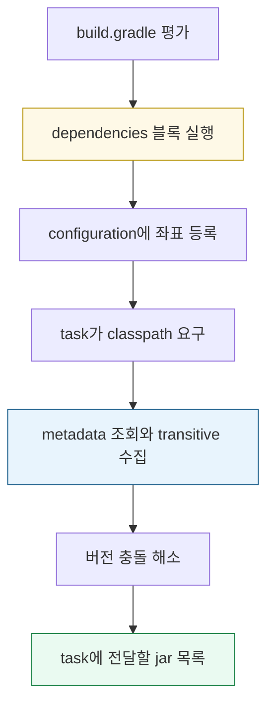
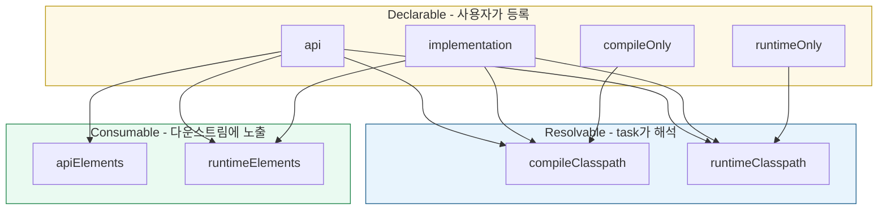

# Gradle 의존성 키워드

---

> Gradle 의존성 키워드는 "어떤 라이브러리를 받느냐"보다 "어느 classpath에 넣고, 어디까지 노출하느냐"를 정하는 문법이다. `implementation`, `api`, `compileOnly`, `runtimeOnly`를 구분하면 컴파일·런타임·테스트·다운스트림 노출 범위를 의도대로 제어할 수 있다.

Java 멀티모듈 프로젝트에서 빌드 스크립트는 소스 코드와 외부 라이브러리 사이의 연결 규칙이다. `dependencies {}`에 적은 한 줄은 당장 jar를 다운로드하는 명령이 아니라, 나중에 특정 task가 사용할 classpath의 재료를 등록하는 일이다.

프로젝트 구조를 단순하게 쓰면 다음과 같다:

```text
settings.gradle
├── include 'core-library'
├── include 'core-web'
└── include 'app'

core-library/
├── build.gradle
└── src/main/java

app/
├── build.gradle
└── src/main/java
```

의존성 선언은 보통 각 모듈의 `build.gradle` 안에 놓인다:

```groovy
// app/build.gradle
plugins {
    id 'java'
}

dependencies {
    implementation project(':core-library')
    implementation 'org.springframework.boot:spring-boot-starter-web'
    runtimeOnly 'org.mariadb.jdbc:mariadb-java-client'
    testImplementation 'org.springframework.boot:spring-boot-starter-test'
}
```

여기서 중요한 질문은 네 가지다. 이 라이브러리가 컴파일에 필요한가, 런타임에만 필요한가, 테스트에서만 필요한가, 이 모듈을 의존하는 다른 모듈에도 보여야 하는가. Gradle 의존성 키워드는 이 질문에 답하는 이름이다.

본 문서는 핵심 키워드와 configuration 모델까지만 다룬다. 충돌 해소, dependency locking, version catalog 같은 운영 패턴은 [02-02.의존성 패턴 심화](02-02.의존성%20패턴%20심화.md)에, variant·BOM·Groovy DSL은 [02-03.의존성 해석과 버전 관리](02-03.의존성%20해석과%20버전%20관리.md)에 분리했다.


## 1. 의존성을 다루는 두 단계

> 선언(declaration)과 해석(resolution)은 시점도 출력도 다르다.

`implementation 'org.springframework.boot:spring-boot-starter-web'`이라고 적는 순간 Gradle이 jar를 즉시 받는 것은 아니다. 먼저 빌드 스크립트를 평가하면서 좌표를 configuration에 등록하고, 나중에 task가 실제 classpath를 요구할 때 좌표 그래프를 해석한다.

두 단계는 이렇게 나뉜다:



선언 단계에서는 좌표를 적어 둔 메모지만 생긴다. `group:artifact:version`, classifier, extension, exclude 같은 정보가 저장되지만 jar 다운로드와 버전 충돌 해소는 아직 일어나지 않는다.

해석 단계는 task가 classpath를 요구할 때 시작된다. 예를 들어 `compileJava`는 `compileClasspath`를 요구하고, `bootRun`은 `runtimeClasspath`를 요구한다. Gradle은 그 configuration이 어떤 declarable configuration을 `extendsFrom`하는지 보고 좌표를 합친 뒤, POM 또는 Gradle Module Metadata를 읽어 transitive 의존성까지 펼친다.

예를 들어 다음 선언은:

```groovy
dependencies {
    implementation 'com.fasterxml.jackson.core:jackson-databind:2.17.0'
    compileOnly 'org.projectlombok:lombok:1.18.34'
    runtimeOnly 'org.mariadb.jdbc:mariadb-java-client:3.3.3'
}
```

대략 다음 classpath로 흘러간다:

```text
compileClasspath
├── implementation: jackson-databind
└── compileOnly: lombok

runtimeClasspath
├── implementation: jackson-databind
└── runtimeOnly: mariadb-java-client
```

이 분리가 핵심이다. 같은 라이브러리라도 어디에 등록했느냐에 따라 컴파일에만 보이거나, 런타임에만 들어가거나, 다운스트림 모듈로 새어 나가거나가 결정된다.


## 2. Configuration이라는 추상화

> Configuration은 Gradle이 의존성 묶음을 구분하는 가장 기본적인 단위다.

Configuration은 세 종류로 나뉜다. 사용자가 직접 의존성을 등록하는 입구가 있고, task가 jar 목록을 받아 가는 출구가 있으며, 다른 모듈이 이 모듈을 의존할 때 보게 되는 노출 출구가 있다.

세 종류를 한 파일에 놓고 보면 역할이 분명해진다:

```groovy
// core-web/build.gradle
plugins {
    id 'java-library'
}

dependencies {
    // Declarable configuration: 사용자가 의존성을 등록하는 입구
    api 'org.springframework:spring-web:6.1.0'
    implementation 'com.fasterxml.jackson.core:jackson-databind:2.17.0'
    compileOnly 'org.projectlombok:lombok:1.18.34'
    annotationProcessor 'org.projectlombok:lombok:1.18.34'
    testImplementation 'org.junit.jupiter:junit-jupiter:5.10.0'
}

// Resolvable configuration: task가 받아 가는 jar 목록
// - compileClasspath
// - runtimeClasspath
// - testCompileClasspath
// - testRuntimeClasspath

// Consumable configuration: 다운스트림 모듈에 노출되는 출구
// - apiElements
// - runtimeElements
```

`implementation`, `api`, `compileOnly`, `runtimeOnly`, `annotationProcessor`는 declarable configuration이다. 빌드 스크립트에서 직접 호출하는 이름이며, 그 자체로는 jar 목록을 만들지 않는다.

`compileClasspath`, `runtimeClasspath`, `testCompileClasspath`, `testRuntimeClasspath`는 resolvable configuration이다. task가 실제로 받는 jar 목록이며, declarable configuration들을 `extendsFrom`으로 흡수해 만들어진다.

`apiElements`, `runtimeElements`는 consumable configuration이다. 이 모듈을 다른 모듈이 `project(':core-web')`로 의존할 때 Gradle이 어떤 산출물을 노출할지 판단하는 메타데이터다.

이 관계를 코드처럼 읽으면 다음과 같다:



새 키워드를 만났을 때는 세 질문을 던지면 된다. 이 이름은 사용자가 의존성을 넣는 입구인가, task가 해석하는 출구인가, 다른 모듈에 노출되는 출구인가. 대부분의 혼란은 이 세 역할을 한 덩어리로 생각할 때 생긴다.


## 3. classpath의 분리

> Java는 컴파일과 실행이 다른 시점에 일어나고, 메인 코드와 테스트 코드는 다른 source set을 쓴다.

Java 빌드가 실제로 다루는 classpath는 최소 네 개다.

| Resolvable configuration | 누가 쓰는가 | 무엇이 들어가는가 |
|--------------------------|-------------|-------------------|
| `compileClasspath` | `compileJava` | `implementation` + `api` + `compileOnly` |
| `runtimeClasspath` | `bootRun`, `java` 실행 | `implementation` + `api` + `runtimeOnly` |
| `testCompileClasspath` | `compileTestJava` | 메인 compile classpath + `testImplementation` + `testCompileOnly` |
| `testRuntimeClasspath` | `test` 실행 | 메인 runtime classpath + `testImplementation` + `testRuntimeOnly` |

여기서 두 가지 비대칭이 보인다. `compileOnly`는 컴파일에만 들어가고 런타임에서 빠진다. `runtimeOnly`는 런타임에만 들어가고 컴파일에서는 보이지 않는다. 일반 `implementation`은 컴파일과 런타임 양쪽에 들어간다.

Lombok처럼 어노테이션만 컴파일 시점에 의미가 있는 라이브러리는 `compileOnly`로 둔다. JDBC 드라이버처럼 코드가 직접 import하지 않고 런타임에 ClassLoader가 찾는 라이브러리는 `runtimeOnly`로 둔다. 일반 라이브러리는 `implementation`으로 두면 양쪽에 모두 들어간다.

테스트 classpath는 메인 classpath를 상속한 위에 테스트 전용 의존성을 더 얹는다. JUnit·Mockito 같은 테스트 라이브러리는 메인 코드에서 import할 수 없어야 하므로 `testImplementation`으로 가둔다.


## 4. `api`와 `implementation`의 진짜 이유

> 둘의 차이는 다운스트림 노출 여부이며, 더 깊게는 재컴파일 범위의 차이다.

`api`와 `implementation`을 "다른 모듈에 보이느냐"로만 알면 절반만 본 것이다. 더 본질적인 효과는 ABI(Application Binary Interface) 변경이 어디까지 전파되느냐다.

라이브러리 모듈 `core-web`이 `spring-web`을 의존한다고 해 보자. `core-web`의 공개 메서드 시그니처에 `ResponseEntity`가 등장한다면 다운스트림 모듈도 `spring-web` 타입을 알아야 한다. 이 경우 `spring-web`은 `api`가 맞다.

```java
// core-web 공개 API에 Spring 타입이 노출된다.
public ResponseEntity<UserResponse> findUser(String id) {
    ...
}
```

반대로 Jackson이 `core-web` 내부 구현에서 JSON 변환에만 쓰이고 공개 타입에 등장하지 않는다면 `implementation`이 맞다.

```java
// Jackson은 내부 구현에만 쓰인다.
private final ObjectMapper objectMapper;

public String toJson(UserResponse response) throws JsonProcessingException {
    return objectMapper.writeValueAsString(response);
}
```

둘의 전파 범위는 다음처럼 다르다:

```text
api 의존성 변경
core-web ABI가 변했을 수 있음
└── core-web을 의존하는 app도 다시 컴파일 대상

implementation 의존성 변경
core-web 내부 구현만 변했다고 간주
└── core-web 다운스트림은 다시 컴파일하지 않음
```

큰 프로젝트에서는 이 차이가 빌드 시간을 좌우한다. 모든 모듈이 모든 외부 의존성을 `api`로 선언하면 한 라이브러리만 바뀌어도 그래프 전체가 재컴파일된다. `implementation`을 기본으로 두고, 다운스트림이 직접 import해야 하는 타입만 `api`로 승격하는 규율이 incremental build의 효과를 살린다.

`api` 키워드를 쓰려면 모듈에 `java-library` 플러그인이 적용돼 있어야 한다. `java` 플러그인만으로는 `api` configuration이 없다. 이 제약은 라이브러리 모듈과 애플리케이션 모듈을 구분하게 만들기 위한 장치다.


## 5. Plugin이 configuration을 만든다

> Java 생태계에서 만나는 키워드는 대부분 특정 플러그인이 추가한 configuration이다.

Configuration은 사용자가 임의로 외워서 쓰는 이름이 아니라 플러그인이 추가하는 모델이다. 플러그인을 적용하면 configuration, task, convention이 함께 들어온다.

| 플러그인 | 추가하는 핵심 configuration | 추가하는 핵심 task |
|----------|----------------------------|-------------------|
| `java-base` | 기반 configuration | `clean` |
| `java` | `implementation`, `compileOnly`, `runtimeOnly`, `annotationProcessor`, test 계열 | `compileJava`, `test`, `jar` |
| `java-library` | `api`, `compileOnlyApi` 추가 | `java` 상속 |
| `application` | `java` 상속 | `run`, `installDist` |
| `org.springframework.boot` | Java configuration을 주로 재사용 | `bootJar`, `bootRun`, `bootBuildImage` |

라이브러리 모듈은 `java-library`를 적용한다. 이 모듈을 다른 모듈이 의존할 수 있고, 공개 API와 내부 구현을 나누는 것이 빌드 성능에 의미가 있기 때문이다.

실행 가능한 산출물을 만드는 애플리케이션 모듈은 `java`, `application`, `org.springframework.boot` 중 프로젝트 성격에 맞는 플러그인을 적용한다. Spring Boot 프로젝트라면 보통 Boot 플러그인이 `bootJar`와 `bootRun`을 제공한다.


## 6. 자주 쓰는 declarable configuration

> 새 의존성을 추가할 때 실제로 선택하는 이름들이다.

핵심 키워드는 다음과 같다:

```text
implementation
  자기 모듈 컴파일과 런타임에 들어간다.
  다운스트림 컴파일 classpath에는 노출하지 않는다.

api
  자기 모듈 컴파일과 런타임에 들어간다.
  다운스트림 컴파일 classpath에도 노출한다.
  java-library 플러그인이 필요하다.

compileOnly
  자기 모듈 컴파일에만 들어간다.
  런타임 jar에는 포함되지 않는다.

compileOnlyApi
  다운스트림 컴파일에는 노출하지만 런타임에는 포함하지 않는다.
  JSR-305 같은 어노테이션 라이브러리에서 드물게 쓴다.

runtimeOnly
  자기 모듈 런타임에만 들어간다.
  컴파일 classpath에서는 보이지 않는다.

annotationProcessor
  컴파일 시 어노테이션 프로세서 classpath에만 들어간다.
  일반 컴파일 classpath와 분리된다.
```

테스트 전용 키워드는 별도로 생각하면 쉽다:

```text
testImplementation
  테스트 컴파일과 테스트 런타임에 들어간다.

testCompileOnly
  테스트 컴파일에만 들어간다.

testRuntimeOnly
  테스트 런타임에만 들어간다.

testAnnotationProcessor
  테스트 컴파일 시 어노테이션 프로세서로만 들어간다.
```

Lombok은 `compileOnly`와 `annotationProcessor`를 함께 쓰는 대표 사례다:

```groovy
dependencies {
    compileOnly 'org.projectlombok:lombok'
    annotationProcessor 'org.projectlombok:lombok'
}
```

`compileOnly`는 `@Getter` 같은 어노테이션 타입을 컴파일러가 보게 한다. `annotationProcessor`는 실제 코드를 생성하는 프로세서를 별도 classpath에 올린다. 둘 중 하나만 있으면 IDE나 컴파일 결과가 어긋날 수 있다.


## 7. 모듈 의존

> `project(':core-library')`와 `'org.example:core-library:1.0.0'`은 외형이 비슷해도 메커니즘이 다르다.

`project(':core-library')`는 같은 build에 포함된 서브프로젝트를 가리킨다. `settings.gradle`에 `include('core-library')`로 등록된 모듈이 있어야 하며, Gradle은 외부 저장소에 묻지 않고 같은 빌드 안의 산출물을 직접 연결한다.

```groovy
// settings.gradle
include 'core-library'
include 'app'

// app/build.gradle
dependencies {
    implementation project(':core-library')
}
```

이 방식의 장점은 수정 사항이 즉시 반영된다는 점이다. 공통 모듈을 고친 뒤 별도 publish 없이 `app`을 빌드하면 Gradle이 필요한 모듈을 함께 컴파일한다. 모듈 간 ABI 변화도 추적되므로 incremental build가 정확하게 동작한다.

외부 좌표는 저장소에 publish된 jar를 받는다:

```groovy
dependencies {
    implementation 'org.example:core-library:1.0.0'
}
```

같은 코드라도 jar로 publish된 뒤에는 별도 라이브러리처럼 취급된다. 변경하려면 새 버전을 publish하고 다시 받아야 한다.

여러 git 저장소를 로컬에서 한 번에 연결해야 하면 composite build를 쓴다. `settings.gradle`의 `includeBuild('../other-repo')`로 다른 빌드를 끌어오면 외부 좌표를 로컬 프로젝트처럼 대체할 수 있다.


## 8. 한 사례 — operator 멀티모듈에 적용

> 본 문서가 다룬 개념을 운영 중인 빌드에 비추어 본다.

`tps-gitlab2/operator/`는 라이브러리 모듈과 애플리케이션 모듈이 섞인 구조다. 각 모듈은 어떤 산출물을 만들고, 다운스트림에 무엇을 노출해야 하는지에 따라 키워드를 고른다.

| 모듈 | 플러그인 | 핵심 keyword | 의도 |
|------|----------|--------------|------|
| `core-library` | `java-library` | 공통 베이스 | 다른 모듈에 공통 도메인 클래스 제공 |
| `core-web` | `java-library` | `api spring-boot-starter-web` | 다운스트림이 Spring Web 타입을 직접 사용 |
| `core-db` | `java-library` | `api spring-boot-starter-data-jpa`, `annotationProcessor querydsl-apt:jpa` | 다운스트림이 Repository·Q 클래스를 사용 |
| `cicd`, `ticket` | `java-library` | `implementation project(':core-*')` | 도메인별 비즈니스 로직 |
| `app` | Spring Boot + Jib | `implementation project(':*')`, `runtimeOnly h2/mariadb-jdbc` | bootJar 패키징, JDBC는 동적 로드 |

이 분포는 앞의 규칙과 거의 같다. 라이브러리 모듈은 `java-library`, 다운스트림이 직접 import하는 의존성만 `api`, 나머지는 `implementation`이다. JDBC는 `runtimeOnly`, 어노테이션 프로세서는 `annotationProcessor`로 분리한다.


## 9. 한 사례 — message-lib의 OpenTelemetry 침묵 실패

> `compileOnly`의 비전이성과 “선택 의존성” 패턴이 어떻게 운영에서 조용히 망가지는지를 실제 사례로 본다.

`tps-gitlab2/message-lib`은 outbox 발행 시점에 OpenTelemetry trace context를 캡처해 DB에 저장하도록 설계된 라이브러리다. 모든 소비자가 OTel을 쓰지는 않을 거라는 가정 아래, OTel API를 “선택 기능”으로 두고 다음과 같이 선언했다.

```groovy
// message-lib/build.gradle
dependencies {
    compileOnly 'io.opentelemetry:opentelemetry-api:1.40.0'
}
```

코드는 `Class.forName("io.opentelemetry.api.trace.Span")`로 런타임에 API 존재를 직접 검사한다. 있으면 `Span.current().getSpanContext()`를 캡처하고, 없으면 null을 반환해 발행만 수행한다. 의도는 “OTel을 쓰는 소비자에게는 자동으로 추적이 되고, 안 쓰는 소비자는 영향을 받지 않는다”였다.

운영에서는 다른 일이 벌어졌다. `TB_TRB_OX_001` 테이블의 `TRACE_PARNTS` 컬럼이 모든 행에서 비어 있었다. 코드 자체에는 결함이 없었지만, `compileOnly`의 두 가지 성질이 겹쳐 추적 데이터가 한 줄도 저장되지 않았다.

### 9.1 비전이성 — `compileOnly`는 소비자에게 도달하지 않는다

`compileOnly`로 선언한 의존성은 해당 모듈의 `compileClasspath`에만 들어간다. `runtimeClasspath`에는 빠지고, 이 모듈을 의존하는 다운스트림 모듈에도 전혀 노출되지 않는다. 즉 message-lib을 가져다 쓰는 executor, operator의 런타임 classpath에는 `opentelemetry-api` JAR이 없다.

그 결과 `Class.forName("io.opentelemetry.api.trace.Span")`은 `ClassNotFoundException`을 던지고 정적 초기화의 `OTEL_AVAILABLE` 플래그는 false로 고정된다. message-lib의 추적 코드 경로는 한 번도 실행되지 않는다. 이건 라이브러리가 의도한 “선택 의존성” 동작 그대로다 — 다만 “모든 소비자가 OTel을 쓸 거”라는 잘못된 기대 위에서 설계되었을 뿐이다.

### 9.2 두 번째 함정 — API만 있어도 SDK가 없으면 캡처는 여전히 실패

소비자 모듈에서 `runtimeOnly 'io.opentelemetry:opentelemetry-api'`를 추가해 1차 함정을 피해도 두 번째 침묵 실패가 기다린다. OpenTelemetry는 인터페이스(API)와 구현(SDK)을 분리한다. API만 있으면 `Span.current()`는 NoOp 구현인 `Span.getInvalid()`를 반환한다. 이 무효 span의 `SpanContext.isValid()`는 항상 false라 캡처 코드는 또 null을 반환한다.

따라서 `compileOnly` 패턴이 작동하려면 소비자 측에서 두 가지가 모두 충족되어야 한다.

- API JAR이 런타임에 보일 것 (의존성 추가)
- 누군가가 실제 span을 시작해 현재 컨텍스트에 넣어줄 것 (자동 instrumentation)

### 9.3 해결 — 각 소비 모듈에 starter를 직접 추가

가장 단순한 방법은 OTel Java Agent를 JVM 시작 옵션으로 부착하는 것이다. agent는 바이트코드를 조작해 Spring Web/Servlet/Kafka 진입점을 자동 계측하므로, message-lib 코드는 그대로 둔 채 traceparent가 채워진다.

```dockerfile
ENV JAVA_TOOL_OPTIONS="-javaagent:/app/otel.jar"
ENV OTEL_SERVICE_NAME=tps-executor
ENV OTEL_EXPORTER_OTLP_ENDPOINT=http://otel-collector:4317
```

빌드 의존성으로 해결하고 싶다면 각 소비 모듈의 `app` 빌드 스크립트에 starter를 추가한다.

```groovy
// executor/app/build.gradle, operator/app/build.gradle
dependencies {
    implementation 'io.opentelemetry.instrumentation:opentelemetry-spring-boot-starter'
    implementation 'io.opentelemetry:opentelemetry-exporter-otlp'
}
```

starter는 `OpenTelemetrySdk` 빈을 등록하고 Spring Web/Kafka 자동 계측을 활성화한다. 이때부터 `@KafkaListener` 진입 스레드에 유효한 span이 살아 있고, 그 안에서 호출되는 `EventPublisher.publish()`는 `captureTraceParent()`로 정상 traceparent를 얻는다.

### 9.4 라이브러리가 대신 해줄 수 없는 부분

“message-lib에서 SDK를 `implementation`으로 강제 전이하면 되지 않나”라는 발상은 두 가지 이유로 부적절하다. 첫째, OTel을 쓰지 않는 소비자에게도 SDK 의존성을 떠안기게 되어 “선택 기능” 설계 의도가 깨진다. 둘째, SDK 의존성만으로는 자동 계측이 켜지지 않는다 — 진입점에서 span을 만들어주는 instrumentation 또는 javaagent는 별도 설정이며, 이건 본질적으로 애플리케이션 실행 환경의 책임이다.

라이브러리가 “현재 span을 캡처”까지는 할 수 있어도 “현재 span을 만든다”는 책임은 진입점을 가진 애플리케이션 모듈에 있다. `compileOnly` 선언은 이 경계를 정확히 표현한 것이고, 운영에서 빈 컬럼이 발생한 건 라이브러리 결함이 아니라 소비 모듈 측 런타임 설정 누락이다.

### 9.5 교훈

`compileOnly`로 “선택 의존성” 패턴을 쓸 때는 소비자가 그 의존성을 자기 모듈에 추가해야 한다는 사실을 README 또는 auto-configuration 문서에 명시해야 한다. 코드가 silent fallback을 하면 빌드는 통과하고 런타임 예외도 나지 않으므로, 빈 컬럼·꺼진 기능이 한참 뒤에 발견된다. 정적 초기화에서 `Class.forName` 검사 결과를 INFO 로그로 한 줄 남기는 것만으로도 진단이 훨씬 빨라진다.


## 10. 정리 — 결정 트리

> 새 의존성을 추가할 때는 이 질문 순서로 고르면 된다.

```text
이 라이브러리는 누가 쓰는가?
├── 메인 코드가 직접 import한다
│   ├── 다운스트림 모듈도 그 타입을 직접 import한다
│   │   └── api (라이브러리 모듈만)
│   ├── 다운스트림은 몰라도 된다
│   │   └── implementation
│   ├── 컴파일 시점에만 의미 있다
│   │   └── compileOnly
│   └── 어노테이션 프로세서다
│       └── annotationProcessor
│
├── 메인 코드는 import하지 않고 런타임에만 필요하다
│   └── runtimeOnly
│
└── 테스트 코드만 쓴다
    ├── 일반 테스트 라이브러리
    │   └── testImplementation
    ├── 테스트 컴파일에만 필요하다
    │   └── testCompileOnly
    └── 테스트 런타임에만 필요하다
        └── testRuntimeOnly
```

흔한 실수는 두 가지다. 첫 번째는 라이브러리 모듈에서 모든 외부 의존성을 `api`로 두는 경우다. ABI 변경이 다운스트림 전체로 전파되어 incremental build의 효과가 사라진다.

두 번째는 JDBC 드라이버나 Testcontainers 같은 동적 로딩 전용 라이브러리를 `implementation`에 두는 경우다. 컴파일 classpath가 무거워지고, 코드에서 실수로 직접 import할 수 있다.

의존성 키워드는 작은 문법처럼 보이지만 모듈이 늘수록 빌드 시간과 경계 명확성에 영향을 준다. 기본은 `implementation`, 공개 타입에 노출되면 `api`, 런타임 전용은 `runtimeOnly`, 컴파일 전용은 `compileOnly`로 잡으면 대부분의 선택이 안정된다.


## 관련 문서

> 본 문서가 다룬 개념을 더 깊이 따라가거나 같은 카테고리 내 짝 문서로 이동하는 자리다.

- [01-03.빌드 도구](01-03.빌드%20도구.md) — Maven vs Gradle 개론, configuration 모델의 배경
- [02-01a.실습 — 의존성 키워드](02-01a.실습%20—%20의존성%20키워드.md) — `dependencyInsight`로 충돌 추적하는 손에 붙는 실습
- [02-02.의존성 패턴 심화](02-02.의존성%20패턴%20심화.md) — `exclude`, `resolutionStrategy`, dependency locking, version catalog
- [02-03.의존성 해석과 버전 관리](02-03.의존성%20해석과%20버전%20관리.md) — variant-aware resolution, BOM, Groovy DSL
- [03-01.저장소와 캐시](03-01.저장소와%20캐시.md) — 해석 단계에서 Gradle이 의존성을 어디서 받는지
- Java Library Plugin: https://docs.gradle.org/current/userguide/java_library_plugin.html
