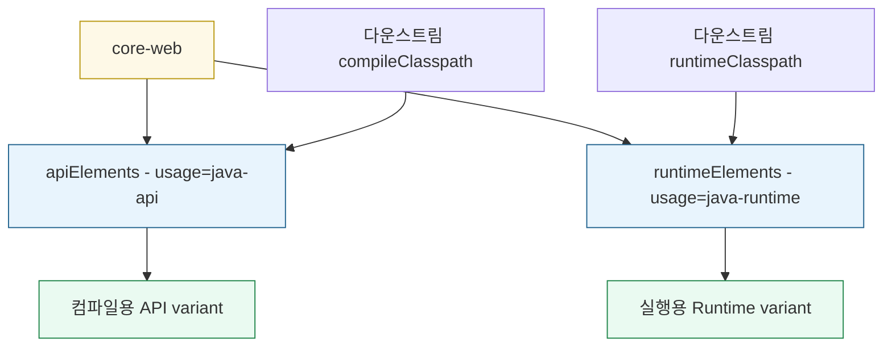

# 의존성 해석과 버전 관리

---

> 02-01가 의존성 키워드의 의미를 다뤘다면, 본 문서는 Gradle이 같은 좌표의 여러 후보 중 무엇을 고르고 버전을 어떻게 통제하는지 정리한다. Variant, BOM, platform, constraint는 "classpath에 무엇이 최종으로 들어가는가"를 결정하는 도구다.

의존성 키워드는 classpath의 입구를 정한다. 하지만 실제 빌드에서는 그 다음 질문이 바로 이어진다. 같은 좌표에 여러 variant가 있으면 무엇을 받을 것인가. 여러 모듈이 같은 라이브러리의 다른 버전을 가져오면 어느 버전을 쓸 것인가. 빌드 스크립트 자체는 Groovy 문법으로 어떻게 읽어야 하는가.

이 문서는 02-01 본문이 길어지는 것을 막기 위해 분리한 심화 문서다. 먼저 02-01의 `implementation`·`api`·`runtimeOnly` 차이를 이해한 뒤 읽으면 자연스럽다.


## 1. Variant-aware resolution

> Gradle은 같은 좌표에서 단순히 jar 하나를 고르는 것이 아니라, 소비자 요구에 맞는 variant를 고른다.

Gradle 5 이후 의존성 해석은 attribute 기반으로 동작한다. 같은 모듈이 여러 산출물 또는 여러 사용 목적을 노출할 수 있고, 소비자 쪽 configuration이 요구하는 attribute에 맞는 variant가 선택된다.

대표적인 attribute는 다음과 같다.

| Attribute | 의미 | 예시 값 |
|-----------|------|--------|
| `org.gradle.usage` | 사용 목적 | `java-api`, `java-runtime` |
| `org.gradle.jvm.version` | 타깃 JVM | `8`, `17`, `21` |
| `org.gradle.libraryelements` | 산출물 종류 | `jar`, `classes`, `sources` |
| `org.gradle.dependency.bundling` | 패키징 방식 | `external`, `shadowed` |

라이브러리 모듈은 보통 `apiElements`와 `runtimeElements`를 노출한다:



다운스트림이 컴파일을 위해 `core-web`을 요청하면 `usage=java-api` variant가 선택된다. 실행을 위해 요청하면 `usage=java-runtime` variant가 선택된다. `api`와 `implementation`의 노출 차이가 이 attribute 모델 위에서 표현되는 셈이다.

이 정보를 정확히 담기 위해 Gradle Module Metadata(`.module` 파일)가 있다. 기존 Maven POM은 variant 개념이 약해서 `apiElements`와 `runtimeElements`를 충분히 구분하지 못한다. Gradle로 publish한 라이브러리는 `.pom`과 함께 `.module`을 만들고, 소비자도 `.module`이 있으면 우선 사용한다.

운영 관점에서는 두 가지만 기억하면 된다. Gradle로 publish된 라이브러리를 받을 때 `.module` 조회가 추가될 수 있지만 의존성 해석은 더 정확해진다. 그리고 classifier는 attribute와 별개다. QueryDSL APT처럼 `"io.github.openfeign.querydsl:querydsl-apt:6.12:jpa"` 형태로 좌표 끝에 붙는 값은 variant attribute가 아니라 classifier다.


## 2. BOM·Platform·Dependency Constraints

> 버전을 한 곳에서 관리하거나 특정 버전을 강제할 때 쓰는 세 가지 메커니즘이다.

라이브러리가 많아지면 같은 좌표에 여러 버전이 들어온다. 예를 들어 모듈 A가 `jackson-databind:2.15`를 가져오고, 모듈 B가 transitive로 `jackson-databind:2.17`을 가져오면 Gradle은 한 가지 버전을 골라야 한다. 기본 정책은 더 높은 버전을 선택하는 것이지만, 운영 빌드에서는 명시적 통제가 필요하다.

### 2.1 BOM 임포트

BOM(Bill of Materials)은 여러 라이브러리의 버전만 모아 둔 POM이다. Spring Boot의 `spring-boot-dependencies`가 대표적이다. BOM을 임포트하면 개별 starter에는 버전을 생략할 수 있다.

```groovy
dependencyManagement {
    imports {
        mavenBom "org.springframework.boot:spring-boot-dependencies:3.2.3"
    }
}

dependencies {
    implementation 'org.springframework.boot:spring-boot-starter-web'
}
```

`io.spring.dependency-management` 플러그인을 쓰면 Maven 스타일의 BOM 임포트를 Gradle에서도 그대로 쓸 수 있다. Spring 프로젝트에서 가장 자주 보이는 방식이다.

### 2.2 `platform()`과 `enforcedPlatform()`

Gradle 자체도 BOM과 같은 역할을 하는 platform 의존성을 제공한다.

```groovy
dependencies {
    implementation platform('org.springframework.boot:spring-boot-dependencies:3.2.3')
    implementation 'org.springframework.boot:spring-boot-starter-web'
}
```

`platform()`은 권장 버전으로 작동한다. 다른 모듈이 더 강한 제약을 가져오면 조정될 수 있다. `enforcedPlatform()`은 강제 버전으로 작동한다. 다른 모듈이 다른 버전을 요구해도 platform 버전을 밀어붙인다.

강제 옵션은 편하지만 전파 범위가 크다. 멀티모듈 내부 규칙을 확실히 통제할 때는 쓸 수 있지만, 공개 라이브러리에서 남용하면 소비자 빌드의 버전 선택권을 좁힌다.

### 2.3 Dependency Constraint

Constraint는 특정 좌표의 버전을 직접 통제한다. BOM처럼 버전 묶음을 통째로 가져오는 대신 한두 라이브러리만 핀 고정할 때 적합하다.

```groovy
dependencies {
    constraints {
        implementation('com.fasterxml.jackson.core:jackson-databind') {
            version {
                strictly '2.17.0'
            }
            because '보안 패치 적용을 위해 자동 승급/하향을 막는다'
        }
    }
}
```

`strictly`는 다른 모듈이 더 높은 버전을 요구해도 자동으로 올리지 않고 충돌로 처리한다. `because`를 함께 남기면 나중에 "왜 이 버전이 고정됐지?"라는 질문에 답할 수 있다.

세 도구를 비교하면 다음과 같다.

| 도구 | 강제력 | 쓸 때 |
|------|--------|-------|
| BOM (`mavenBom`) | 권장 | Spring처럼 일관된 버전 묶음을 통째로 적용 |
| `platform()` | 권장 | Gradle 네이티브 방식으로 BOM 사용 |
| `enforcedPlatform()` | 강제 | 빌드 전체에서 BOM 밖 버전을 허용하지 않음 |
| `constraints {}` | 권장 또는 강제 | 한두 좌표만 이유와 함께 고정 |


## 3. Groovy DSL의 형태

> `build.gradle`은 Groovy 스크립트라서 메서드 호출과 closure 축약 문법이 자주 등장한다.

`dependencies { ... }`나 `repositories { ... }`처럼 보이는 블록은 Groovy의 closure다. 메서드의 마지막 인자가 closure면 괄호 밖으로 빼서 쓸 수 있다.

다음 두 코드는 같은 의미다:

```groovy
dependencies({
    implementation('org.springframework.boot:spring-boot-starter-web')
})

dependencies {
    implementation 'org.springframework.boot:spring-boot-starter-web'
}
```

`implementation 'foo'`도 사실은 메서드 호출이다. Groovy가 인자 하나짜리 메서드 호출에서 괄호를 생략하게 허용하므로 `implementation('foo')`와 같은 의미가 된다.

문자열에는 두 가지 형태가 있다. 작은따옴표는 평범한 문자열이고, 큰따옴표는 변수 보간을 지원하는 GString이다.

```groovy
implementation 'org.springframework.boot:spring-boot-starter-web'
implementation "org.okestro:core-lib:${coreModuleVersion}"
```

`=`와 공백도 구분해야 한다. property assignment에는 `=`, method call에는 공백을 쓴다.

```groovy
group = 'org.example'
version = '1.0.0'

dependencies {
    implementation 'foo:bar:1.0'
}
```

`ext { ... }`는 프로젝트에 임의의 확장 property를 붙이는 자리다. 빌드 안에서 공유하는 버전 상수를 모을 때 자주 쓴다.

```groovy
ext {
    set('querydslVersion', '6.12')
    springBootVersion = '3.2.3'
}

dependencies {
    implementation "io.github.openfeign.querydsl:querydsl-jpa:${querydslVersion}"
}
```

`project.findProperty('name')`은 외부에서 `-Pname=value`로 주입한 값을 읽을 때 쓴다. Jenkins나 GitHub Actions가 빌드 파라미터를 넘길 때 이 메커니즘이 자주 등장한다.


## 4. Kotlin DSL과 비교

> 같은 빌드를 Kotlin DSL로 쓰면 메서드 호출이 명시적이고 IDE 지원이 강해진다.

Kotlin DSL(`build.gradle.kts`)은 Groovy DSL보다 문법이 길지만 정적 타입과 자동완성이 강하다.

```kotlin
// build.gradle.kts
plugins {
    `java-library`
    id("io.spring.dependency-management") version "1.1.7"
}

dependencies {
    api("org.springframework.boot:spring-boot-starter-web")
    implementation(project(":core-library"))
}
```

차이는 두 가지가 눈에 띈다. 메서드 호출에 괄호가 붙고, 플러그인 id는 backtick 또는 `id("...")` 형태로 들어간다. 큰 빌드에서는 IDE 지원 때문에 Kotlin DSL을 선호하는 경우가 많고, 짧은 학습 예제나 기존 레거시 프로젝트에서는 Groovy DSL이 여전히 많이 보인다.


## 5. 정리

> 의존성 해석은 키워드 선택 이후에 일어나는 두 번째 결정 단계다.

`implementation`과 `api`를 제대로 골라도 최종 classpath는 variant 선택과 버전 통제까지 거쳐 확정된다. 다운스트림 컴파일에는 `java-api` variant가, 런타임에는 `java-runtime` variant가 선택된다. 여러 버전이 들어오면 Gradle 기본 정책은 높은 버전을 고르지만, BOM·platform·constraint로 명시적 규칙을 줄 수 있다.

Groovy DSL은 처음 보면 마법처럼 보이지만 대부분 메서드 호출과 closure 축약이다. `dependencies { implementation 'g:a:v' }`는 결국 `dependencies` 메서드 안에서 `implementation` 메서드를 호출하는 코드다. 이 사실을 알면 빌드 스크립트를 읽을 때 훨씬 덜 흔들린다.


## 관련 문서

> 본 문서와 함께 읽을 짝 문서다.

- [02-01.Gradle 의존성 키워드](02-01.Gradle%20의존성%20키워드.md) — `implementation`, `api`, `compileOnly`, `runtimeOnly`의 기본 의미
- [02-01a.실습 — 의존성 키워드](02-01a.실습%20—%20의존성%20키워드.md) — 손으로 classpath와 충돌을 확인하는 실습
- [02-02.의존성 패턴 심화](02-02.의존성%20패턴%20심화.md) — `exclude`, `resolutionStrategy`, dependency locking, version catalog
- [03-01.저장소와 캐시](03-01.저장소와%20캐시.md) — 해석 단계에서 metadata와 jar를 어디서 받는지
- Variant Model: https://docs.gradle.org/current/userguide/variant_model.html
- Platforms: https://docs.gradle.org/current/userguide/platforms.html
