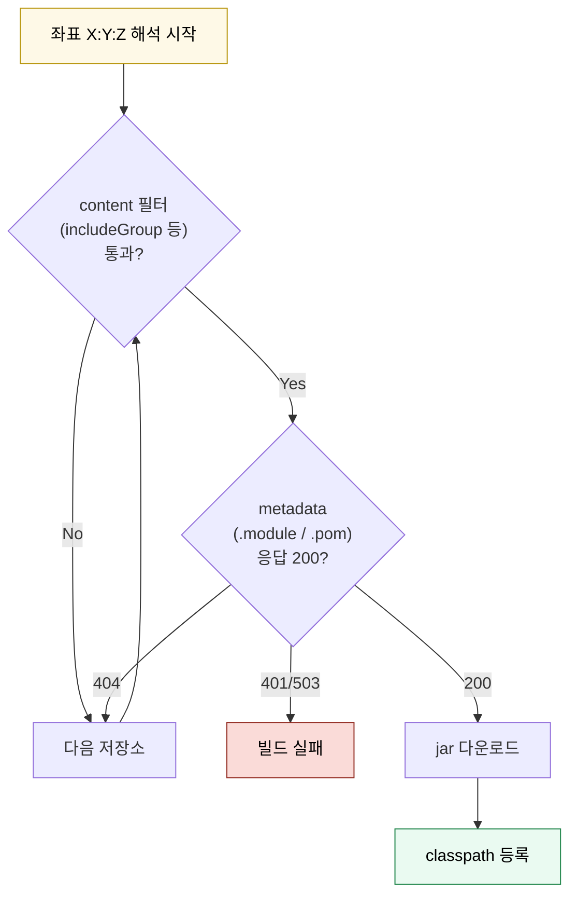

# 저장소와 캐시

---

> Gradle 빌드가 의존성을 어디서 받아 와 어떻게 보관하고 다시 받게 만드는지를 한 흐름으로 본다. 저장소 레이아웃·해석 알고리즘·캐시 계층·초기화 방법·검증 메커니즘이 한 묶음으로 동작한다.


## 1. Maven 2 저장소 레이아웃

> Gradle도 Maven도 같은 디렉터리 구조를 약속처럼 따른다.

`mavenCentral()`, 사내 Nexus, 로컬 `~/.m2/repository`까지 — 자바 생태계의 거의 모든 저장소는 **Maven 2 layout**이라는 공통 디렉터리 구조를 따른다. 한 좌표(`org.springframework.boot:spring-boot-starter-web:3.2.3`)는 다음 위치에 들어간다.

```
<repo-root>/
└── org/
    └── springframework/
        └── boot/
            └── spring-boot-starter-web/
                ├── 3.2.3/
                │   ├── spring-boot-starter-web-3.2.3.pom
                │   ├── spring-boot-starter-web-3.2.3.jar
                │   ├── spring-boot-starter-web-3.2.3.module        # Gradle Module Metadata
                │   ├── spring-boot-starter-web-3.2.3.jar.sha1
                │   └── spring-boot-starter-web-3.2.3.jar.md5
                └── maven-metadata.xml
```

규칙은 단순하다. group의 점(`.`)은 슬래시(`/`)로 바뀌고, artifact 이름이 그 아래 디렉터리, 그 아래에 버전 디렉터리, 그 안에 jar·POM·해시 파일이 들어간다.

`maven-metadata.xml`은 artifact 디렉터리 단위로 한 개씩 존재한다. 이 파일이 "이 좌표에는 어떤 버전들이 publish됐는지"와 "최신 release/SNAPSHOT은 어느 버전인지"를 알려 준다. SNAPSHOT 좌표 안에는 timestamp가 박힌 파일들이 들어가는데, 이 안의 metadata가 최신 timestamp를 가리킨다.

이 구조 위에 두 가지 metadata 표준이 공존한다. POM은 Maven이 정의한 XML 포맷으로 의존성·라이선스·플러그인 정보를 담는다. `.module` 파일은 Gradle이 추가로 정의한 JSON 포맷으로 variant 정보까지 담는다(02-03 §1). 같은 좌표에 둘 다 있으면 Gradle은 `.module`을 우선 사용한다.


## 2. 저장소 종류

> 한 저장소는 보통 한 가지 역할에 특화된다.

| 종류 | 역할 | 예 |
|------|------|----|
| Release 저장소 | 변경되지 않는 정식 버전 | mavenCentral, Maven Local |
| SNAPSHOT 저장소 | 같은 좌표에 더 새로운 빌드를 덮어쓸 수 있는 개발 버전 | Nexus snapshots, Sonatype OSS snapshots |
| Hosted 저장소 | 사내 release를 직접 publish해 받는 자리 | Nexus releases |
| Proxy 저장소 | 외부 저장소를 캐싱하는 자리 | Nexus public, JFrog remote repo |
| Group/Mirror | 여러 저장소를 묶어 단일 URL로 제공 | Nexus public group |

같은 사내 Nexus 인스턴스가 hosted release, snapshot, proxy, group을 한꺼번에 운영하는 게 일반적이다. 빌드 입장에선 어느 URL을 부르느냐로 역할이 갈린다.

mavenCentral과 Google Maven, JCenter(폐쇄)·Sonatype·Confluent 같은 외부 저장소는 모두 release/SNAPSHOT 한 종류씩으로 분리해 운영한다. release만 다루는 저장소는 같은 좌표에 다른 jar가 올라올 일이 없다고 신뢰한다. SNAPSHOT 저장소는 timestamp 기반으로 같은 좌표 안에서 jar가 갱신되는 환경이다.


## 3. Groovy DSL로 저장소 선언

> 한 모듈에 여러 저장소를 선언할 수 있고, 선언 순서가 평가 순서다.

저장소는 `repositories { ... }` 블록 안에 선언한다. Groovy closure이므로 안에서 메서드 호출을 자유롭게 한다.

```groovy
repositories {
    // 흔히 쓰는 외부 저장소 단축 메서드
    mavenCentral()
    google()
    gradlePluginPortal()

    // 로컬 Maven (~/.m2/repository)
    mavenLocal()

    // 임의 Maven 저장소
    maven {
        url 'https://packages.confluent.io/maven/'
    }

    // 인증이 필요한 저장소
    maven {
        url uri('http://nexus.dev.<internal>/repository/maven-snapshots/')
        allowInsecureProtocol = true
        credentials {
            username = project.findProperty('nexusUsername') ?: System.getenv('NEXUS_USERNAME')
            password = project.findProperty('nexusPassword') ?: System.getenv('NEXUS_PASSWORD')
        }
    }
}
```

`mavenCentral()`처럼 단축 메서드가 있는 것은 자주 쓰는 저장소에만 해당된다. 그 외엔 `maven { url '...' }`로 직접 적는다. URL은 문자열이거나 `uri('...')`로 감싼 URI 객체다.

`allowInsecureProtocol = true`는 HTTP(비TLS) 저장소를 허용한다. Gradle 7부터 기본 거부로 바뀌어, 사내 HTTP Nexus를 쓰려면 명시적으로 켜야 한다. 외부 공개 저장소엔 절대 두지 않는다.

`credentials { ... }`은 사용자 이름·비밀번호를 받는 자리다. 빌드 스크립트에 평문으로 두면 git에 새므로, `~/.gradle/gradle.properties`에 둔 property나 환경변수에서 읽는 게 표준이다.


## 4. 저장소 평가 순서와 해석 알고리즘

> 같은 모듈에 여러 저장소가 있으면 위에서 아래로 묻는다.

Gradle은 각 의존성 좌표마다 다음 순서로 동작한다.



세 가지 행동 규칙을 기억한다.

1. 첫 200을 응답한 저장소가 채택되며 그다음 저장소엔 묻지 않는다. "어디든 더 큰 버전이 있는지" 비교는 dynamic version인 경우에만 일어난다.
2. 404는 정상 흐름이다. 그 좌표를 모르는 저장소는 다음 저장소로 넘기게 두는 신호다. 401(인증 실패)이나 503(서버 오류)은 빌드를 그 시점에서 실패시킨다 — Gradle이 다음 저장소로 넘어가지 않는 이유는, 인증이 실패한 상태로 다른 저장소에서 받은 jar는 정합성이 의심되기 때문이다.
3. content 필터(아래 §6)가 걸려 있으면 metadata를 묻기도 전에 그 저장소가 통째로 건너뛰어진다. 사내 그룹만 사내 저장소에 묻고, mavenCentral에는 묻지 않게 만드는 도구다.

저장소 순서는 평균 빌드 시간에도 영향을 준다. 가장 자주 사용되는 의존성을 가진 저장소를 위에 두면 평균 시도 횟수가 줄어든다. 외부 라이브러리 비중이 큰 빌드는 mavenCentral을 위에, 사내 SNAPSHOT 비중이 큰 빌드는 Nexus를 위에 두는 식이다.


## 5. 좌표의 종류와 캐시 정책

> Release·SNAPSHOT·동적 버전은 캐시 TTL이 다르다.

| 표기 | 예 | 캐시 정책 |
|------|----|----------|
| 정적 release | `6.7.0`, `3.2.3` | 무기한 캐시 (sha1 일치하면 재사용) |
| pre-release | `6.0.0-rc.6`, `3.2.0-M1` | release와 동일 (좌표가 고정이므로) |
| SNAPSHOT | `3.0.5.2-DEV-SNAPSHOT` | metadata 24h TTL (`cacheChangingModulesFor`) |
| 동적 버전 (`+`) | `1.+`, `2.0.+` | metadata 24h TTL (`cacheDynamicVersionsFor`) |
| 버전 범위 | `[1.0,2.0)`, `[1.0,)` | 동적 버전과 동일 |
| latest 별칭 | `latest.release`, `latest.integration` | 동적 버전과 동일 |

정적 release는 한 번 받으면 영구히 유효하다. SNAPSHOT과 동적 버전은 같은 좌표 표기에 더 새로운 빌드가 올라올 수 있으므로 metadata를 주기적으로 다시 봐야 한다. 기본 24시간이라는 TTL이 빌드의 "방금 새 SNAPSHOT 올렸는데 왜 안 잡혀?" 사고의 가장 큰 원인이다.

버전 범위 표기는 Maven의 표기를 그대로 따른다.

```
[1.0,2.0]   1.0 ≤ x ≤ 2.0
[1.0,2.0)   1.0 ≤ x < 2.0
(,1.5]      x ≤ 1.5
[1.0,)      1.0 ≤ x
```

운영 빌드에서 동적 버전이나 버전 범위를 쓰는 일은 거의 없다. 빌드 재현성이 무너지고, 24h TTL 때문에 즉시 반영되지도 않는다. 학습 목적이나 BOM 안에서만 만난다.


## 6. Repository content 룰

> "이 저장소는 이 그룹만 응답한다"라는 화이트리스트.

같은 좌표가 여러 저장소에 존재할 수 있는 환경에서는, 어떤 그룹을 어떤 저장소에서 받게 할지 명시적으로 통제한다. content 룰은 두 가지 효과가 있다. 평균 응답 시간이 줄고(불필요한 trip이 사라짐), 의도되지 않은 곳에서 받아 오는 사고를 막는다.

```groovy
repositories {
    mavenCentral {
        // 사내 그룹은 mavenCentral에 묻지 않는다
        content {
            excludeGroup 'org.okestro'
        }
    }

    maven {
        url uri('http://nexus.dev.<internal>/repository/maven-snapshots/')
        // 사내 그룹만 응답한다 (화이트리스트)
        content {
            includeGroup 'org.okestro'
            includeGroupByRegex 'com\\.example\\..*'
        }
    }
}
```

| 룰 | 의미 |
|----|------|
| `includeGroup 'org.example'` | 정확히 그 group만 |
| `includeGroupByRegex '...'` | 정규식 매칭 |
| `includeModule(group, module)` | 특정 artifact만 |
| `excludeGroup 'org.example'` | 그 group은 응답 안 함 |
| `excludeModule(group, module)` | 특정 artifact만 응답 안 함 |
| `onlyForConfigurations(...)` | 특정 configuration에만 적용 |

include 룰을 하나라도 쓴 저장소는 화이트리스트로 동작한다 — 명시되지 않은 그룹은 응답하지 않는다고 간주한다. 잘못 걸면 받아야 할 의존성이 사라진다. 룰을 추가한 직후 `./gradlew :app:dependencies`로 영향을 확인하는 습관이 안전하다.

content 룰을 빌드 전체에 일괄 적용하는 더 강한 도구로 **repository content rules in settings**가 있다. `settings.gradle`의 `dependencyResolutionManagement {}`에서 한 번 정의하면 모든 모듈에 적용된다.

```groovy
// settings.gradle
dependencyResolutionManagement {
    repositoriesMode = RepositoriesMode.FAIL_ON_PROJECT_REPOS
    repositories {
        mavenCentral()
        maven { url 'https://repo.example.com' }
    }
}
```

`FAIL_ON_PROJECT_REPOS`로 두면 서브 모듈이 자기 `repositories {}`를 선언하면 빌드가 실패한다. 모든 저장소를 `settings.gradle`에서만 통제하겠다는 강한 정책이다.


## 7. 캐시 계층

> Gradle에는 의존성 캐시 외에도 build cache, configuration cache가 있고 셋은 서로 다르다.

`~/.gradle/` 아래의 주요 디렉터리는 다음과 같다.

```
~/.gradle/
├── caches/
│   ├── modules-2/
│   │   └── files-2.1/<group>/<artifact>/<version>/<sha1>/<file>.jar
│   ├── metadata-2.107/                    # 좌표→파일 매핑 인덱스 (modules-2와 parallel)
│   ├── build-cache-1/                     # task 출력 캐시 (--build-cache)
│   ├── jars-N/                            # 인스트루먼트된 jar
│   └── transforms-N/                      # artifact transform 결과
├── caches/<gradle-version>/
│   └── configuration-cache/               # task graph 캐시 (--configuration-cache)
├── daemon/<gradle-version>/               # daemon 로그·pid
├── wrapper/dists/                         # gradlew가 받은 Gradle 배포본
└── gradle.properties                      # 사용자 전역 property
```

세 가지 캐시가 한 빌드에서 함께 쓰인다.

| 캐시 | 무엇을 캐싱 | 어떻게 켜는가 | 무효화 트리거 |
|------|------------|--------------|-------------|
| 의존성 캐시 (`modules-2`) | jar 파일과 metadata | 항상 켜짐 | TTL 만료, `--refresh-dependencies` |
| Build Cache | task의 출력(`.class`, 보고서) | `--build-cache` 또는 `org.gradle.caching=true` | task 입력 sha 변경 |
| Configuration Cache | task graph 평가 결과 | `--configuration-cache` | 빌드 스크립트·환경 변경 |

의존성 캐시는 끄지 않는 한 항상 동작한다. 같은 sha1을 가진 jar는 한 번만 저장되고 여러 프로젝트가 공유한다.

Build Cache는 task 단위로 출력을 재사용한다. 같은 입력(소스 + classpath + 옵션)이면 컴파일을 건너뛰고 저장된 `.class`를 가져온다. 원격 캐시를 두면 팀이 공유할 수도 있다.

Configuration Cache는 빌드 스크립트 평가 자체를 캐싱한다. `build.gradle`이 동적이지 않다면(외부 명령 호출, 시스템 클럭 의존이 없으면) 두 번째 빌드부터 평가 단계가 거의 사라진다.


## 8. SNAPSHOT의 캐시 TTL과 강제 갱신

> 24시간이 기본인 metadata TTL이 사고의 단골 원인이다.

`resolutionStrategy {}`에서 두 TTL을 조절한다.

```groovy
configurations.all {
    resolutionStrategy {
        // SNAPSHOT 등 changing module의 metadata TTL
        cacheChangingModulesFor 0, 'seconds'

        // 동적 버전(+)의 metadata TTL
        cacheDynamicVersionsFor 0, 'seconds'
    }
}
```

단위로 `seconds`, `minutes`, `hours`, `days`가 가능하다. 둘 다 0으로 두면 매번 metadata를 다시 받지만, 평소 incremental 빌드가 느려지고 사내 Nexus가 잠시 끊겼을 때 빌드도 함께 끊긴다.

흔한 절충안은 CI나 명시적 `clean` 호출 시에만 0초로 강제하는 것이다.

```groovy
def isCleanRequested = gradle.startParameter.taskNames.any { taskName ->
    taskName == 'clean' || taskName.endsWith(':clean')
}

if (Boolean.parseBoolean(System.getProperty('ci')) || isCleanRequested) {
    allprojects {
        configurations.all {
            resolutionStrategy {
                cacheChangingModulesFor 0, 'seconds'
                cacheDynamicVersionsFor 0, 'seconds'
            }
        }
    }
}
```

평소엔 24시간 TTL의 이점을 유지하고, "내가 명시적으로 캐시를 비우는 의도를 보였을 때"만 즉시 반영하는 패턴이다. operator의 루트 빌드도 이 방식을 그대로 채택한다.

`changing` 플래그를 의존성 단위로 강제할 수도 있다.

```groovy
implementation('org.example:lib:1.0') {
    changing = true
}
```

이렇게 표기한 좌표는 release 표기더라도 SNAPSHOT처럼 다뤄진다 — metadata를 주기적으로 다시 본다. 사내 release 저장소가 같은 좌표에 다시 publish되는 경우(드물지만 hotfix 등)에 쓴다.


## 9. 명시적 초기화 옵션

> `--refresh-dependencies`, `--offline`, 캐시 디렉터리 삭제는 영향이 다르다.

```bash
# metadata를 모두 다시 받는다 (sha1 일치하면 jar 재다운로드는 없음)
./gradlew build --refresh-dependencies

# 네트워크 호출을 차단하고 캐시에 있는 것만 사용
./gradlew build --offline

# 의존성 캐시 일부만 삭제 (안전한 방법)
rm -rf ~/.gradle/caches/modules-2/files-2.1/org.example/lib

# 의존성 캐시 통째로 삭제 (마지막 수단)
rm -rf ~/.gradle/caches/modules-2/

# build cache만 비우기
rm -rf ~/.gradle/caches/build-cache-1/

# Daemon 메모리·configuration cache까지 비우기
./gradlew --stop
rm -rf ~/.gradle/caches/<gradle-version>/configuration-cache/
```

`--refresh-dependencies`는 첫 단계 도구다. metadata만 다시 받으므로 sha1이 같으면 jar 다운로드는 일어나지 않는다 — 비용이 낮고 효과가 크다.

`--offline`은 반대로 디버깅 도구다. 외부 호출 없이 빌드가 재현되는지 확인할 때, 또는 네트워크가 끊긴 환경에서 빌드를 돌릴 때 쓴다. 캐시에 없는 의존성이 하나라도 필요하면 즉시 실패한다.

캐시 디렉터리를 통째로 지우는 것은 다른 프로젝트의 빌드까지 건드린다. 의심스러운 좌표만 골라 디렉터리째 지우는 게 더 안전하다. `gradle clean`은 모듈 `build/` 디렉터리만 비우므로 의존성 문제 해결과는 무관하다.


## 10. mavenLocal()과 Maven 저장소 상속

> `~/.m2/repository`는 Maven과 Gradle이 함께 보는 자리다.

`mavenLocal()`은 사용자 홈의 `~/.m2/repository`를 가리킨다. 같은 머신에서 Maven 빌드와 Gradle 빌드가 공존하면 이 자리가 다리 역할을 한다 — Maven으로 `mvn install`한 라이브러리를 Gradle 빌드가 그대로 받는다.

운영 빌드에서 `mavenLocal()`을 함부로 쓰지 않는 이유는 두 가지다.

1. 빌드 머신마다 `~/.m2`의 내용이 다르므로 재현성이 흔들린다.
2. 로컬에서 `mvn install`로 임시 빌드한 jar가 빌드 결과에 새어 들어가는 사고가 자주 일어난다.

사내 라이브러리를 로컬에서 변형해 시험할 때만 한정적으로 쓴다.

Maven의 `~/.m2/settings.xml`이 정의한 mirror·proxy 설정은 Gradle이 자동으로 따르지 않는다. Gradle은 자기 빌드 스크립트에 선언된 저장소만 본다. `init.gradle`에 같은 mirror를 별도 선언해야 효과가 같다.

```groovy
// ~/.gradle/init.gradle (전역 적용)
allprojects {
    repositories {
        // 모든 mavenCentral 호출을 사내 mirror로 우회
        all { ArtifactRepository repo ->
            if (repo instanceof MavenArtifactRepository
                && repo.url.toString().contains('repo.maven.apache.org')) {
                project.logger.lifecycle "Repository ${repo.url} 는 사내 mirror로 대체됨"
                remove repo
            }
        }
        maven {
            url 'http://nexus.dev.<internal>/repository/maven-public/'
            allowInsecureProtocol = true
        }
    }
}
```

이런 init script는 노트북마다 다른 환경(사내·집·카페)을 빌드 스크립트 변경 없이 가르는 데 쓴다.


## 11. 인증과 Credential

> 비밀번호를 `build.gradle`에 평문으로 두지 않는다.

자격 증명을 다루는 표준 패턴은 다음 세 가지다.

```groovy
maven {
    url 'http://nexus.dev.<internal>/repository/maven-snapshots/'
    credentials {
        // 1) Gradle property — ~/.gradle/gradle.properties에 둠
        username = project.findProperty('nexusUsername') ?: ''
        password = project.findProperty('nexusPassword') ?: ''
    }
}
```

```properties
# ~/.gradle/gradle.properties (사용자 홈에만 두고 git에 올리지 않음)
nexusUsername=mybuilduser
nexusPassword=s3cr3t
```

```bash
# 2) 환경변수 — CI에서 가장 흔한 방식
export NEXUS_USERNAME=ci
export NEXUS_PASSWORD=$(read-secret nexus)
./gradlew build -PnexusUsername=$NEXUS_USERNAME -PnexusPassword=$NEXUS_PASSWORD
```

```groovy
// 3) typed credentials — Gradle이 정의한 PasswordCredentials 등
credentials(PasswordCredentials)
// 별도 선언 없이 nexusUsername / nexusPassword 같은 property를 자동으로 매핑
```

세 번째 패턴은 Gradle 6.x부터 추가된 짧은 표기다. URL이 `https://nexus.example.com/...`이면 `nexusUsername`/`nexusPassword` property를 자동 사용한다. 환경변수로는 `ORG_GRADLE_PROJECT_nexusUsername`처럼 prefix를 붙인다.

토큰 인증(GitHub Packages, Artifactory token 등)도 같은 메커니즘으로 처리한다. token 자체가 비밀번호 자리에 들어간다.


## 12. Dependency Verification — 무결성 검증

> 받은 jar가 변조되지 않았는지 sha256·서명으로 자동 검증.

Gradle 6.2부터 도입된 메커니즘으로, 각 의존성의 sha256 해시(또는 PGP 서명)를 lockfile에 기록해 두고 빌드 시점에 검증한다. 공급망 공격 대응에 효과가 있다.

```bash
./gradlew --write-verification-metadata sha256 build
```

이 명령은 `gradle/verification-metadata.xml`을 생성한다. 다음 빌드부터 모든 jar 다운로드가 이 파일의 해시와 비교된다.

```xml
<verification-metadata>
  <configuration>
    <verify-metadata>true</verify-metadata>
    <verify-signatures>false</verify-signatures>
  </configuration>
  <components>
    <component group="org.springframework" name="spring-core" version="6.1.0">
      <artifact name="spring-core-6.1.0.jar">
        <sha256 value="a1b2c3..." origin="Generated by Gradle"/>
      </artifact>
    </component>
  </components>
</verification-metadata>
```

검증 실패 시 빌드는 즉시 중단된다. PGP 서명 검증까지 켜면 `verify-signatures=true`로 둔다.

이 기능은 대규모 운영 빌드에서 도입할 만하다. 처음 한 번 metadata를 생성하는 작업이 무겁고, 의존성을 추가할 때마다 metadata를 갱신해야 하는 운영 비용이 있다.


## 13. Dependency Locking으로 재현성 강제

> 같은 빌드를 다음 주에 돌렸을 때 같은 의존성을 잡게 한다.

동적 버전이나 SNAPSHOT을 쓰면 시간이 지나면서 빌드 결과가 달라진다. lockfile은 한 번 결정된 버전을 고정한다.

```groovy
// settings.gradle 또는 init.gradle
dependencyLocking {
    lockAllConfigurations()
}
```

```bash
./gradlew dependencies --write-locks
./gradlew dependencies --update-locks com.fasterxml.jackson.core:*
```

각 모듈의 `gradle.lockfile`에 결과가 저장되고, 다음 빌드부터 이 파일의 버전을 강제한다. SNAPSHOT을 자주 쓰는 사내 환경에선 lockfile이 운영 안전망 역할을 한다.


## 14. Mirror·Proxy를 init script로 전역 통제

> 노트북마다 다른 네트워크 환경을 빌드 스크립트 변경 없이 가른다.

`~/.gradle/init.d/` 아래의 모든 `.gradle` 파일은 모든 빌드에 자동 적용된다. 사내·집·외부 카페에서 다른 mirror를 쓸 때 유용하다.

```groovy
// ~/.gradle/init.d/01-corporate-mirror.gradle
allprojects {
    repositories {
        // mavenCentral보다 사내 mirror를 위에 둠
        maven {
            url 'http://nexus.dev.<internal>/repository/maven-public/'
            allowInsecureProtocol = true
        }
    }
}

// 빌드 시간 측정 같은 진단 init script도 흔하다
gradle.taskGraph.beforeTask { task ->
    task.ext.startedAt = System.currentTimeMillis()
}
gradle.taskGraph.afterTask { task ->
    def elapsed = System.currentTimeMillis() - task.ext.startedAt
    if (elapsed > 5000) {
        logger.lifecycle "[slow-task] ${task.path} ${elapsed}ms"
    }
}
```

init script는 사용자 환경별 분기에 적합하지만, 팀 전체에 강제할 정책은 `settings.gradle`이나 빌드 스크립트에 두는 편이 명시적이다.


## 15. Maven Central 트래픽과 사내 caching proxy

> mavenCentral과 Gradle Plugin Portal에 직접 부딪치는 빌드는 점점 비싸지고 있다. 사내 caching proxy로 우회하는 것이 표준이다.

mavenCentral은 자바 생태계의 사실상 단일 진실 공급원이다. 그러나 빌드가 매번 mavenCentral에 직접 메타데이터·jar를 요청하면 두 가지 비용이 누적된다. 첫 번째는 응답 지연 — 한 빌드에 수백 개의 좌표가 있고 각 좌표에 metadata와 jar 두 번씩 trip이 일어난다. 두 번째는 외부 의존도 — mavenCentral 또는 Gradle Plugin Portal이 짧게라도 멈추면 모든 사내 빌드가 함께 멈춘다.

Gradle 블로그 2025년 글 "How to Reduce Maven Central Traffic from Gradle Builds"는 최근 mavenCentral·Plugin Portal에서 일정 임계 이상의 트래픽에 rate limit이 적용되기 시작했다고 알리고 있다. 큰 조직 전체가 직접 부딪치면 빌드가 실패하기 시작한다는 신호다.

해결은 사내 caching proxy를 한 단계 끼워 두는 것이다. Nexus의 group repository나 JFrog Artifactory의 virtual repository가 대표적인 도구다. 한 번 받은 좌표는 사내 저장소에 캐시되고, 같은 좌표를 다시 요청하는 모든 빌드는 사내 응답을 받는다. 외부 저장소 장애가 생겨도 캐시에 있는 좌표는 계속 받을 수 있어 빌드가 끊기지 않는다.

```groovy
// 사내 mirror만 보도록 강제하는 패턴
repositories {
    maven {
        url 'https://nexus.example.com/repository/maven-public/'
        // mavenCentral과 plugin portal을 모두 포함하는 group repository
    }
}

// 외부 저장소 직접 호출을 settings.gradle에서 차단
// settings.gradle
dependencyResolutionManagement {
    repositoriesMode = RepositoriesMode.FAIL_ON_PROJECT_REPOS
    repositories {
        maven { url 'https://nexus.example.com/repository/maven-public/' }
    }
}
```

operator의 Nexus `maven-public/`이 release proxy + mavenCentral·Confluent mirror 역할을 함께 맡는 이유가 여기 있다. content 필터 없이 모든 좌표를 응답하고, 외부 저장소 응답을 한 번 받아 두면 다음 빌드부터는 사내 응답으로 끝난다. 이런 group repository에서는 mavenCentral을 직접 선언하지 않고 group repository 하나만 두는 안이 더 안전하다 — operator 빌드가 mavenCentral을 위에 두고 사내 group을 아래에 둔 현재 구성은 caching proxy의 효과를 절반만 받는 셈이다.

체크리스트:

- 사내 group repository가 외부 저장소(mavenCentral·Plugin Portal·Confluent 등)를 모두 proxy하는지 확인
- 빌드 스크립트가 외부 저장소를 직접 선언하면 group repository만 남기도록 정리
- `settings.gradle`의 `dependencyResolutionManagement.repositoriesMode = RepositoriesMode.FAIL_ON_PROJECT_REPOS`로 모듈별 우회 차단
- 사내 group repository에 caching TTL과 retention policy 점검 (오래된 SNAPSHOT 자동 정리 등)


## 16. 한 사례 — operator의 저장소·캐시 구성

> 본 문서가 다룬 메커니즘이 운영 빌드에 어떻게 결합돼 있는지.

`tps-gitlab2/operator`는 다섯 가지 도구를 한 묶음으로 사용한다.

저장소 순서는 `mavenCentral` → Confluent → Nexus snapshots → Nexus public이다. 외부 라이브러리의 응답이 빠르게 끝나도록 mavenCentral을 위에 두고, 사내 SNAPSHOT은 명시적으로 사내 저장소로 보낸다.

content 필터로 `Nexus snapshots`에 `includeGroup "org.okestro"`를 걸어, 사내 그룹만 사내 SNAPSHOT 저장소에 묻게 만든다. 외부 라이브러리 metadata trip을 줄이는 효과와, 사내 저장소가 외부 좌표를 잘못 응답하는 사고를 막는 효과가 같이 있다.

`nexusUrl`은 `project.findProperty('nexusUrl') ?: '<기본값>'` 패턴으로 Jenkins에서 `-PnexusUrl=...`로 환경별 주입을 받는다. credentials도 property/환경변수에서 읽어 평문 노출이 없다.

캐시 TTL은 평소 24시간을 유지하다가 CI(`-Dci=true`)와 명시적 `clean` 호출 시에만 `cacheChangingModulesFor 0, 'seconds'`로 강제 갱신한다. 일상 빌드는 빠르게, 정확성이 필요한 시점엔 즉시 반영되도록 절충한 설계다.

dependency locking과 dependency verification은 아직 도입되지 않았다. 사내 빌드 환경이 안정화되고 외부 의존성 비중이 더 커지면 차례로 검토할 가치가 있다.


## 17. 정리 — 흔한 증상과 첫 시도

> 사고가 나면 같은 도구를 같은 순서로 시도한다.

| 증상 | 첫 시도 | 그 다음 |
|------|--------|--------|
| 사내 SNAPSHOT이 갱신되지 않는다 | `./gradlew build --refresh-dependencies` | `cacheChangingModulesFor 0` 일시 적용 |
| 외부 라이브러리를 사내 저장소가 가로챈다 | content 필터 점검 | 저장소 순서 조정 |
| sha1/sha256 mismatch | 해당 좌표 디렉터리 삭제 | dependency verification 도입 검토 |
| 빌드가 외부 호출 없이 되는지 확인 | `--offline`으로 빌드 | 캐시 미존재 좌표 식별 |
| 같은 빌드가 시간이 지나 깨진다 | lockfile 도입 | SNAPSHOT 의존성 정리 |
| Gradle 자체가 의심스럽다 | `./gradlew --stop` 후 재실행 | `~/.gradle/caches/<version>/` 삭제 |

저장소·캐시는 의존성 키워드(02-01) 다음으로 빌드 안정성을 좌우한다. 한 번 흐름을 잡아 두면 새 모듈을 추가하거나 사내 저장소가 바뀌어도 같은 도구를 같은 자리에 적용하면 된다.


## 관련 문서

> 본 문서가 다룬 메커니즘과 짝을 이루는 인접 문서를 모은다.

- [02-01.Gradle 의존성 키워드](02-01.Gradle%20의존성%20키워드.md) — 어떤 keyword로 등록해 둔 의존성을 본 문서가 어디서 받아 오는지
- [04-01.명령어와 Spring 운영](04-01.명령어와%20Spring%20운영.md) — `--refresh-dependencies`·`--offline`을 일상 명령에 어떻게 녹일지
- Maven Repository Layout: https://maven.apache.org/repositories/layout.html
- Declaring Repositories: https://docs.gradle.org/current/userguide/declaring_repositories.html
- Dependency Caching: https://docs.gradle.org/current/userguide/dependency_caching.html
- Dependency Verification: https://docs.gradle.org/current/userguide/dependency_verification.html
- Dependency Locking: https://docs.gradle.org/current/userguide/dependency_locking.html
