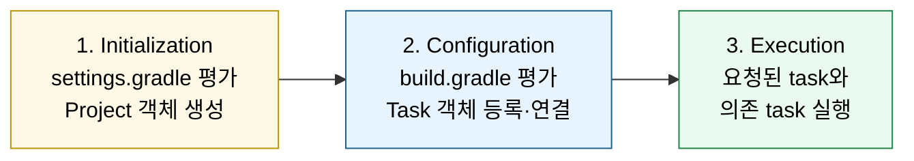

# 명령어와 Spring 운영

---

> Gradle을 명령어 모음으로만 외우면 새 옵션을 만날 때마다 다시 길을 잃는다. 본 문서는 빌드가 진행되는 세 단계, task가 어떻게 정의·실행되는지, 그 위에 Spring Boot 플러그인이 무엇을 더하는지를 한 흐름으로 본다.


## 1. 빌드의 세 단계 — Initialization, Configuration, Execution

> 빌드는 세 phase로 진행되며, 각 phase에서 다른 객체가 살아 있다.



세 phase는 다음 역할을 차례대로 수행한다.

### 1.1 Initialization — 빌드 참여 모듈 결정

`settings.gradle`을 평가해 어떤 모듈이 빌드에 포함되는지를 결정한다. `include('app')` 같은 선언이 여기서 처리된다. 결과로 각 모듈마다 `Project` 객체가 만들어지고, 이 객체가 다음 phase의 무대가 된다.

### 1.2 Configuration — task graph 구축

모든 모듈의 `build.gradle`을 평가해 task graph를 구축한다. `dependencies { ... }`, `tasks.register('integrationTest', Test) { ... }` 같은 코드가 이 시점에 실행된다. 중요한 점은 task의 액션(`doFirst`, `doLast` 안의 코드)은 아직 실행되지 않는다는 사실이다 — task가 등록되고 입력·출력·의존이 정의되기만 한다.

### 1.3 Execution — 요청된 task와 의존 task 실행

사용자가 요청한 task와 그 의존 task를 위상 정렬 순서로 실행한다. `./gradlew :app:test`를 부르면 `compileJava` → `processResources` → `classes` → `compileTestJava` → `test` 순으로 실제 액션이 돌아간다.

이 분리가 두 가지 효과를 만든다.

1. 빌드 스크립트의 평가 비용은 task 실행 비용과 분리된다 — `./gradlew tasks`만 부르면 평가만 하고 실행은 하지 않는다.
2. configuration cache(§7)가 가능해진다. 평가 결과(task graph)를 통째로 저장해 두면 두 번째 빌드부터 평가를 건너뛴다.

자주 헷갈리는 함정은 `build.gradle` 안의 일반 코드가 configuration phase에 동작한다는 점이다.

```groovy
// configuration phase에 실행됨 (모든 빌드에서 매번)
println "현재 시각: ${new Date()}"

task hello {
    // 이 안의 코드도 configuration phase
    println "task가 등록됨"

    doLast {
        // execution phase — task가 실제로 돌 때만 실행
        println "task가 실행됨"
    }
}
```

`println`은 task와 무관하게 매번 찍힌다. `doLast`/`doFirst`로 감싼 코드만 task가 실행될 때 돌아간다. 이 구분을 놓치면 "왜 매번 이 메시지가 보이지?"가 된다.


## 2. Task 객체 모델

> Task는 입력·출력·액션의 묶음이고, Gradle은 그 메타정보로 incremental build를 만든다.

Task 하나는 다음 요소를 가진다.

| 요소 | 의미 |
|------|------|
| 입력 (`@InputFiles`, `@Input`) | 변경되면 task를 다시 돌려야 한다는 신호 |
| 출력 (`@OutputDirectory`, `@OutputFile`) | task가 만들어 낸 결과물 |
| 액션 (`doFirst`, `doLast`, `@TaskAction`) | 실제 동작 |
| 의존성 (`dependsOn`, `mustRunAfter`) | 이 task가 돌기 전에 무엇이 끝나야 하는가 |

Gradle은 task 실행 전에 입력의 sha를 계산하고 저장된 sha와 비교한다. 같으면 task를 건너뛰고 `UP-TO-DATE`로 표시한다. 이게 **incremental build**의 본질이다.

```
> Task :app:compileJava UP-TO-DATE
> Task :app:processResources NO-SOURCE
> Task :app:classes UP-TO-DATE
> Task :app:test UP-TO-DATE
```

`UP-TO-DATE`는 입력 변화 없음, `NO-SOURCE`는 입력 자체가 없음, `FROM-CACHE`는 build cache에서 출력을 가져옴, 아무 표시 없으면 실제로 실행됨을 의미한다.

Task 의존 관계는 네 가지 표현이 있다.

| 표현 | 의미 |
|------|------|
| `dependsOn` | A를 부르면 B가 먼저 실행된다 |
| `mustRunAfter` | 둘 다 부른 경우 B가 A보다 먼저 끝난다 (둘 다 안 부르면 동작 안 함) |
| `shouldRunAfter` | 가능하면 그렇게 (실패해도 빌드 계속) |
| `finalizedBy` | A가 끝나면(성공·실패 무관) B가 자동 실행 |

`shouldRunAfter`는 `mustRunAfter`보다 약하고, 빌드 안정성을 헤치지 않으면서 실행 순서를 권장할 때 쓴다. `finalizedBy`는 클린업 task를 묶을 때 — 예를 들어 통합 테스트가 끝나면 항상 컨테이너를 정리하는 task가 실행되게 한다.


## 3. Task를 정의하는 세 가지 방식

> 이름만 알아 두면 안 되고, 어떻게 정의하느냐에 따라 평가 비용이 달라진다.

```groovy
// 1) tasks.register — Lazy. configuration phase에 평가되지 않음
tasks.register('hello') {
    description = '간단한 인사 task'
    group = 'documentation'
    doLast {
        println 'Hello'
    }
}

// 2) tasks.named — 이미 등록된 task를 lazy하게 가져와 수정
tasks.named('test', Test).configure {
    useJUnitPlatform()
}

// 3) task '...' (구식) — Eager. 모든 빌드에서 항상 평가됨
task helloEager {
    doLast {
        println 'Hello (eager)'
    }
}
```

Gradle 4.9부터 도입된 `register`/`named`는 **lazy task configuration**을 활성화한다. 사용자가 그 task를 실제로 부를 때까지 task 객체 평가를 미룬다. 등록된 task 수가 많을수록 효과가 커진다.

구식 `task name { ... }` 표기는 모든 빌드에서 모든 task가 즉시 평가된다. 작은 빌드에선 차이가 없지만, 모듈 수가 많아지면 configuration phase 시간 자체가 길어지는 원인이 된다. 새 코드는 `register`/`named`만 쓰는 게 권장된다.

타입을 명시하면 Gradle이 알맞은 task 클래스를 만든다.

```groovy
tasks.register('integrationTest', Test) {
    description = 'Runs integration tests.'
    group = 'verification'
    useJUnitPlatform { includeTags 'integration' }
}

tasks.register('copyConfig', Copy) {
    from 'config'
    into "$buildDir/config"
}
```

`Test`, `Copy`, `Jar`, `JavaExec` 같은 표준 task 타입이 자주 쓰인다. 새 task의 타입을 모르면 `Task`(추상 기본 타입)를 쓰면 되지만, 입력·출력 추적이 약해 incremental 효과가 줄어든다.


## 4. Daemon — 빌드를 빠르게 만드는 JVM 한 대

> Gradle은 한 번 띄운 JVM을 살려 놓고 다음 빌드에서 재사용한다.

Gradle은 명령을 부를 때마다 새 JVM을 띄우지 않는다. 백그라운드에 daemon JVM을 띄워 놓고, 다음 빌드는 같은 JVM이 처리한다. JVM warm-up(클래스 로딩, JIT 컴파일)이 누적되어 두 번째 빌드부터는 첫 빌드의 절반 이하로 빨라진다.

```bash
./gradlew --status      # 살아 있는 daemon 목록
./gradlew --stop        # 모든 daemon 종료
./gradlew build --no-daemon   # 1회용 — 빌드 끝나면 종료
```

daemon은 메모리를 잡아 둔다. `gradle.properties`의 `org.gradle.jvmargs`로 heap 크기를 정한다.

```properties
# ~/.gradle/gradle.properties 또는 프로젝트의 gradle.properties
org.gradle.jvmargs=-Xmx2g -Dfile.encoding=UTF-8
org.gradle.daemon=true
org.gradle.parallel=true
org.gradle.caching=true
```

IntelliJ가 띄우는 daemon과 터미널에서 띄운 daemon이 별도인 경우가 흔하다. JVM 버전이 다르면 두 개가 동시에 살아 메모리 압박이 생긴다. `--status`에 두 개 이상 보이면 한 번 `--stop`으로 정리한다.

Gradle daemon은 구성이 같은 빌드끼리만 공유된다. JVM 버전, JVM args, file.encoding이 달라지면 새 daemon이 추가로 뜬다. CI에서는 daemon을 끄는 옵션(`--no-daemon`)을 자주 쓴다 — 컨테이너가 어차피 끝나면 사라지므로 daemon 유지 비용이 의미가 없다.


## 5. SourceSet — 메인과 테스트, 그 너머

> Java 빌드는 코드 묶음을 source set으로 추상화한다.

`java` 플러그인은 두 source set을 기본으로 만든다.

| SourceSet | 디렉터리 | 산출물 |
|-----------|---------|-------|
| `main` | `src/main/java`, `src/main/resources` | `build/classes/java/main`, jar 등록 대상 |
| `test` | `src/test/java`, `src/test/resources` | `build/classes/java/test`, test task 입력 |

각 source set에는 자기만의 `<name>Implementation`, `<name>CompileOnly`, `<name>RuntimeOnly` configuration이 자동으로 만들어진다. `testImplementation`이 그 예다.

새 source set을 추가해 통합 테스트를 분리하는 패턴도 표준이다.

```groovy
sourceSets {
    integrationTest {
        java.srcDirs = ['src/integrationTest/java']
        resources.srcDirs = ['src/integrationTest/resources']
        compileClasspath += sourceSets.main.output + configurations.testRuntimeClasspath
        runtimeClasspath += output + compileClasspath
    }
}

configurations {
    integrationTestImplementation.extendsFrom testImplementation
    integrationTestRuntimeOnly.extendsFrom testRuntimeOnly
}

tasks.register('integrationTest', Test) {
    testClassesDirs = sourceSets.integrationTest.output.classesDirs
    classpath = sourceSets.integrationTest.runtimeClasspath
    useJUnitPlatform()
    shouldRunAfter tasks.named('test')
}
```

별도 source set으로 가르면 디렉터리·classpath·configuration이 깔끔하게 분리된다. 같은 효과를 동일 source set의 태그(JUnit `@Tag('integration')`)로 처리하는 가벼운 방법도 있다 — operator의 `ticket` 모듈은 후자다.


## 6. Build Cache — task 출력의 재사용

> 입력 sha가 같으면 task 출력을 캐시에서 가져온다. 깊은 운영(Java 특이점·디버깅·troubleshooting)은 별도 문서로 분리해 두었다.

Build Cache는 task의 입력 sha를 키로 출력을 저장한다. 같은 sha를 다시 만나면 task를 실행하지 않고 저장된 출력을 가져와 `FROM-CACHE`로 표시한다. 의존성 캐시(03-01)와 configuration cache(§7)와는 완전히 다른 메커니즘이라는 점만 우선 잡고 간다.

활성화는 옵션 한 줄, 영구 적용은 property 한 줄이다.

```bash
./gradlew build --build-cache
```

```properties
# gradle.properties
org.gradle.caching=true
```

원격 캐시 서버, Java 프로젝트의 ABI compile avoidance·annotation processor 함정·테스트 정규화·절대 경로 취약성, `-Dorg.gradle.caching.debug=true`로 디버깅하는 순서, file encoding·환경변수·line ending 등 자주 만나는 troubleshooting 7가지는 [04-02.Build Cache 심화](04-02.Build%20Cache%20심화.md)에서 한 번에 본다.


## 7. Configuration Cache — task graph 자체의 캐싱

> 빌드 스크립트 평가도 한 번만 한다.

Configuration phase가 task graph를 만드는 일을 한다고 했다(§1). 같은 빌드 스크립트, 같은 환경이면 같은 graph가 나오는데 매번 평가하는 것은 낭비다. Configuration Cache는 첫 빌드에서 만든 task graph를 직렬화해 저장하고, 두 번째부터는 이걸 그대로 로드한다.

```bash
./gradlew build --configuration-cache
```

효과는 큰 빌드에서 분명하게 나타난다. 모듈 수십 개의 멀티 프로젝트가 configuration phase에 5초 걸리던 게 0.5초로 떨어지는 식이다.

Configuration Cache가 켜지려면 빌드 스크립트가 일정 제약을 따라야 한다.

- task action에서 `Project` 객체에 직접 접근하지 않는다 (configuration phase의 객체이므로).
- 시스템 클럭(`new Date()`)이나 외부 명령 실행을 task action에서 부르지 않거나, `Provider`로 감싸 lazy하게 만든다.
- 환경변수 변경에 반응해야 하면 `providers.environmentVariable('NAME')`을 쓴다.

Gradle 8.x에서는 기본 비활성화이지만 안정적이며, 9.0.0부터는 권장 실행 모드(preferred mode)로 격상됐다. 호환되지 않는 플러그인이 있으면 켜는 순간 빌드가 실패한다. 도입 전에 한 번 시범 운영(`--configuration-cache --configuration-cache-problems=warn`)으로 영향을 점검한다.

Configuration Cache는 의존성 캐시·build cache와 완전히 분리된 별도 메커니즘이다. 셋을 함께 켜야 효과가 누적된다.


## 8. Wrapper — 빌드 도구 버전을 프로젝트가 통제

> `./gradlew`는 프로젝트가 정한 Gradle 버전을 자동으로 다운로드한다.

`gradle/wrapper/gradle-wrapper.properties`에 distribution URL이 들어 있다.

```properties
distributionUrl=https\://services.gradle.org/distributions/gradle-8.5-bin.zip
```

이 한 줄이 같으면 모든 환경에서 Gradle 8.5로 빌드가 돌아간다. 시스템에 별도로 Gradle을 설치할 필요가 없고, Gradle 9이 나와도 의도적으로 올리기 전에는 빌드가 자동 변경되지 않는다.

버전을 올릴 때는 두 단계로 진행한다.

```bash
# 1) wrapper 스크립트와 properties만 갱신
./gradlew wrapper --gradle-version 8.10 --distribution-type bin

# 2) 새 wrapper로 다시 한 번 호출해 distribution 캐시까지 정리
./gradlew wrapper
```

`distribution-type`은 `bin`(빌드 실행만 가능)과 `all`(소스·문서 포함)이 있다. IDE가 자동완성을 위해 소스를 요구하면 `all`이 편하지만 다운로드 크기가 크다.


## 9. CLI 옵션 — 자주 쓰는 한 묶음

> 명령은 외우기보다 패턴으로 묶어 둔다.

```bash
# 빌드 / 실행
./gradlew build                       # 컴파일 + 테스트 + 패키징
./gradlew assemble                    # 컴파일 + 패키징, 테스트 제외
./gradlew check                       # 검증 task 모음 (test 등)
./gradlew clean build                 # build/ 비우고 처음부터
./gradlew :app:bootRun                # 모듈 한정 실행

# 의존성 디버깅
./gradlew :app:dependencies --configuration runtimeClasspath
./gradlew :app:dependencyInsight --configuration runtimeClasspath \
    --dependency org.springframework.boot:spring-boot-starter-web

# task 탐색
./gradlew tasks                       # 그룹별 task 목록
./gradlew tasks --all                 # 숨김 task까지
./gradlew help --task bootRun         # 특정 task 도움말

# 빌드 진단
./gradlew build --info                # 더 많은 로그
./gradlew build --debug               # 거의 모든 로그 (보통 너무 많음)
./gradlew build --stacktrace          # 예외 시 풀 스택
./gradlew build --scan                # Build Scan URL 생성

# 캐시 / 의존성 강제 갱신
./gradlew build --refresh-dependencies
./gradlew build --offline
./gradlew build --build-cache --configuration-cache --parallel

# Daemon
./gradlew --status
./gradlew --stop

# 모듈 한정
./gradlew :ticket:test
./gradlew :ticket:integrationTest
```

`dependencyInsight`는 의존성 디버깅의 가장 빠른 도구다. 같은 좌표가 어디서 끌려 들어왔는지, 어떤 conflict resolution을 거쳐 어떤 버전이 채택됐는지 트리로 보여 준다.

`--scan`은 Build Scan을 생성한다. 빌드가 어디에서 오래 걸렸는지, 어떤 의존성이 어디서 왔는지, 캐시 hit/miss가 어땠는지 한 화면에서 본다. CI에서 항상 켜 두면 회귀 디버깅 시간이 크게 준다.


## 10. Spring Boot 플러그인 — bootJar에서 OCI 이미지까지

> Spring Boot Gradle 플러그인은 jar 패키징부터 layered jar, OCI 이미지 빌드(`bootBuildImage`)까지 한 묶음으로 제공한다.

`org.springframework.boot` 플러그인을 적용하면 다음 task가 자동으로 추가된다.

| Task | 산출물 | 용도 |
|------|-------|------|
| `bootJar` | `*.jar` (실행 가능) | fat jar — `java -jar`로 직접 실행 |
| `bootWar` | `*.war` | 외부 servlet 컨테이너 배포용 |
| `bootRun` | (실행) | 로컬에서 메인 코드 실행 |
| `bootBuildImage` | OCI 이미지 | Buildpacks로 컨테이너 이미지 빌드 |

다음 다섯 단계로 한 번씩 본다.

### 10.1 bootJar vs jar — 실행 산출물과 라이브러리 산출물의 차이

`bootJar`로 만든 jar는 `java -jar app.jar`로 바로 실행된다. fat jar 안에 모든 의존성이 들어 있고, Spring Boot의 `JarLauncher`가 jar 안의 nested jar를 클래스로더에 등록한다. 일반 `jar` task가 만든 jar는 의존성을 포함하지 않으므로 `java -jar`로 실행되지 않는다.

라이브러리 모듈은 `bootJar`가 필요 없다. 다른 모듈이 의존할 일반 jar(`build/libs/<name>-<version>.jar`)만 있으면 된다. 반대로 실행 산출물 모듈은 일반 jar가 필요 없다.

```groovy
// 라이브러리 모듈 (다른 모듈이 의존)
bootJar { enabled = false }
jar { enabled = true }

// 실행 산출물 모듈 (operator의 app/build.gradle)
bootJar { enabled = true }
jar { enabled = false }
```

라이브러리 모듈에 Spring Boot 플러그인을 적용하지 않으면 `bootJar`/`jar` 분기 자체가 필요 없다. operator의 `core-library`/`core-web`/`core-db`가 boot 플러그인을 적용하지 않는 이유다.

### 10.2 Layered jar — 4 계층 분리

Layered jar는 fat jar 안의 파일을 변경 빈도별로 layer를 나누는 패턴이다. 의존성 layer는 거의 변하지 않고, 코드 layer만 자주 변한다. 컨테이너 이미지 빌드에서 변하지 않는 layer를 캐시하면 매 빌드마다 의존성 jar 수백 MB를 새로 push하지 않아도 된다.

Spring Boot 기본 layer 정의는 4계층이다.

| 순서 | Layer | 포함 내용 | 변경 빈도 |
|------|-------|----------|----------|
| 1 | `dependencies` | release 의존성 jar | 거의 없음 |
| 2 | `spring-boot-loader` | `org.springframework.boot.loader.*` 클래스 | 버전 업그레이드 시 |
| 3 | `snapshot-dependencies` | `*-SNAPSHOT` jar | 사내 라이브러리 빌드마다 |
| 4 | `application` | 애플리케이션 클래스·리소스 | 매 커밋 |

```groovy
bootJar {
    layered {
        enabled = true
    }
}
```

Spring Boot 2.5+에서는 layered가 기본 활성화되어 있어 명시 선언이 필요 없는 경우가 많다. 사용자 정의 layer가 필요하면 `application.layers.toml`로 분리 규칙을 직접 작성한다.

### 10.3 Dockerfile multi-stage + layertools 추출

Layered jar의 layer를 Dockerfile에서 분리해 build context에 넣으면 컨테이너 캐시가 가장 적극적으로 동작한다.

```dockerfile
# 1단계: layered jar 풀어서 layer 추출
FROM eclipse-temurin:17-jdk-alpine AS extract
WORKDIR /app
COPY build/libs/app.jar app.jar
RUN java -Djarmode=layertools -jar app.jar extract

# 2단계: layer를 변경 빈도 순으로 복사 (의존성 → 코드 순)
FROM eclipse-temurin:17-jre-alpine
WORKDIR /app
COPY --from=extract /app/dependencies/ ./
COPY --from=extract /app/spring-boot-loader/ ./
COPY --from=extract /app/snapshot-dependencies/ ./
COPY --from=extract /app/application/ ./
ENTRYPOINT ["java", "org.springframework.boot.loader.JarLauncher"]
```

`COPY` 순서가 변경 빈도와 같아야 효과가 산다. 코드 layer만 매번 새로 만들어지고 dependencies layer는 거의 캐시된다. Buildpacks(`bootBuildImage`)나 Jib는 이 layer 분리를 자동으로 처리해 준다.

### 10.4 bootBuildImage — Cloud Native Buildpacks로 OCI 이미지

`bootBuildImage`는 Dockerfile 없이 fat jar에서 직접 OCI 이미지를 만든다. Cloud Native Buildpacks(CNB) 표준을 따르며, 최신 Spring Boot 기본 빌더는 `paketobuildpacks/builder-noble-java-tiny:latest`다(과거 jammy 계열 빌더에서 noble 기반으로 옮겨졌다). 빌더가 jar를 분석해 JRE 선택·layer 분리·이미지 조립을 자동으로 처리한다.

```bash
# 로컬 Docker 데몬에 이미지 생성
./gradlew :app:bootBuildImage --imageName=registry.example.com/operator-app:1.0

# 빌드와 동시에 레지스트리에 push
./gradlew :app:bootBuildImage \
    --imageName=registry.example.com/operator-app:1.0 \
    --publishImage \
    -PregistryUsername=$REG_USER \
    -PregistryPassword=$REG_PASS
```

```groovy
bootBuildImage {
    imageName = "registry.example.com/operator-app:${version}"
    builder = 'paketobuildpacks/builder-noble-java-tiny:latest'
    environment = [
        'BP_JVM_VERSION': '17',
        'BPE_DELIM_JAVA_TOOL_OPTIONS': ' ',
        'BPE_APPEND_JAVA_TOOL_OPTIONS': '-XX:MaxRAMPercentage=80'
    ]
}
```

제약은 두 가지다. 첫 번째, Docker daemon에 접근할 수 있어야 한다 — Docker Desktop, colima, podman docker compat 중 하나가 필요하다. CI 컨테이너 안에서 실행하려면 Docker socket을 마운트해야 한다. 두 번째, multi-arch 이미지(linux/amd64 + linux/arm64)는 빌더가 명시적으로 지원해야 한다 — paketo는 amd64를 기본으로 만들고 arm64는 별도 빌더가 필요하다.

### 10.5 Jib — daemonless OCI 이미지 빌드

Jib는 Google이 만든 또 다른 OCI 이미지 빌드 도구로 Docker daemon이 없어도 동작한다는 점이 가장 큰 차이다. CI 환경에서 Docker socket을 마운트하지 않아도 되니 보안·운영 부담이 줄어든다. multi-arch 이미지는 자동으로 만들어지지 않고 `from { platforms { ... } }` 블록을 명시해야 한다.

```groovy
plugins {
    id 'com.google.cloud.tools.jib' version '3.4.0'
}

jib {
    from {
        image = 'eclipse-temurin:17-jre-alpine'
    }
    to {
        image = 'registry.example.com/operator-app'
        tags = [version, 'latest']
    }
    // multi-arch가 필요하면 명시적으로 platforms 선언
    // from { platforms { platform { architecture = 'amd64'; os = 'linux' }
    //                    platform { architecture = 'arm64'; os = 'linux' } } }
    container {
        jvmFlags = ['-XX:MaxRAMPercentage=80']
    }
}
```

`./gradlew :app:jib`이 직접 레지스트리에 push하고, `./gradlew :app:jibDockerBuild`는 로컬 Docker daemon에 이미지를 만든다. multi-arch 빌드를 기본으로 지원하고 layer 분리도 자동이다. operator가 Spring Boot 플러그인과 함께 jib를 적용한 이유가 여기 있다 — Jenkins 컨테이너 안에서 Docker socket 없이 이미지를 만들 수 있다.


## 11. Spring 운영에서 알아 둘 것

> profile, parameters, 어노테이션 프로세서가 빌드와 만나는 지점.

### 11.1 Profile 지정

```bash
# 명령행 인자 (가장 권장)
./gradlew :app:bootRun --args='--spring.profiles.active=local'

# 환경변수 (12-factor 스타일)
SPRING_PROFILES_ACTIVE=local ./gradlew :app:bootRun

# 시스템 프로퍼티
./gradlew :app:bootRun -Dspring.profiles.active=local
```

`--args`는 main의 args 배열로 전달되고, Spring Boot가 `--spring.<key>=<value>` 형태를 환경 properties로 변환한다. 가장 명시적이라 추천된다.

### 11.2 -parameters 컴파일 옵션

```groovy
tasks.withType(JavaCompile).configureEach {
    options.compilerArgs.add('-parameters')
}
```

기본값에서는 컴파일된 `.class`에 메서드 파라미터 이름이 `arg0`, `arg1`로 익명화된다. Spring MVC가 `@PathVariable`이나 `@RequestParam`의 이름을 파라미터 이름으로 추론하려면 이름이 보존돼야 한다. JPA의 derived query(`findByUserName(String userName)`)와 MapStruct의 매퍼 생성자 매핑도 같은 이유로 이 옵션이 필요하다.

이 한 줄을 모든 모듈에 일괄 적용하는 게 Spring 멀티모듈 빌드의 사실상 표준이다.

### 11.3 어노테이션 프로세서 동작 시점

QueryDSL의 `Q` 클래스, MapStruct의 매퍼 구현, Lombok의 `@Getter` 메서드는 모두 컴파일 시점에 어노테이션 프로세서가 생성한다. 생성된 코드는 `build/generated/sources/annotationProcessor/java/main/`에 들어가고, IntelliJ는 이 디렉터리를 자동으로 source root로 인식한다.

생성된 코드가 보이지 않는다면 다음을 확인한다.

```bash
./gradlew compileJava                    # 한 번 컴파일해서 코드를 생성
./gradlew :core-db:dependencies --configuration annotationProcessor
# 프로세서가 등록됐는지 확인
```

IntelliJ에서 `Settings > Build > Compiler > Annotation Processors`의 "Enable annotation processing"을 켜야 IDE가 별도로 코드를 생성한다(Gradle delegated build를 쓰면 자동).


## 12. Custom Task 작성

> 빌드 스크립트 안에서 task를 직접 만드는 두 가지 패턴.

### 12.1 ad-hoc task (간단한 동작)

```groovy
tasks.register('printVersion') {
    group = 'help'
    description = '현재 프로젝트 버전을 출력한다.'

    doLast {
        println "version: ${project.version}"
    }
}
```

`doLast`만 쓰면 빌드 스크립트 안에서 한 번 쓰고 끝낼 task로 충분하다. 입력·출력 추적이 없으므로 매번 실행된다.

### 12.2 incremental하게 동작하는 custom task

```groovy
abstract class GenerateReport extends DefaultTask {
    @InputDirectory
    abstract DirectoryProperty getSourceDir()

    @OutputFile
    abstract RegularFileProperty getOutputFile()

    @TaskAction
    void generate() {
        def output = outputFile.get().asFile
        output.text = sourceDir.get().asFile.list().join('\n')
    }
}

tasks.register('genReport', GenerateReport) {
    sourceDir = layout.projectDirectory.dir('src/main/java')
    outputFile = layout.buildDirectory.file('report.txt')
}
```

`@InputDirectory`와 `@OutputFile` 어노테이션이 있으면 Gradle은 두 입력의 sha와 출력 파일을 추적해 incremental·cache hit을 만든다. 같은 입력이면 task를 건너뛰고, build cache가 켜져 있으면 출력을 캐시에서 가져온다.

복잡한 task는 별도 `buildSrc/` 디렉터리에 모아 작성한다. 같은 빌드 안의 모든 모듈이 자동으로 사용할 수 있어, 멀티모듈 프로젝트의 공통 task를 모듈 본문 밖으로 분리한다.


## 13. 한 사례 — operator 빌드의 명령 패턴

> 본 문서가 다룬 메커니즘이 운영 빌드에 어떻게 적용돼 있는지.

operator의 빌드 구성에서 본 문서와 직접 연결되는 지점은 다음과 같다.

루트 `build.gradle`에서 `subprojects { tasks.withType(JavaCompile) { options.compilerArgs.add('-parameters') } }`로 모든 모듈에 `-parameters`를 일괄 적용한다(§11.2). 이 한 줄이 없으면 `@PathVariable Long id`가 아닌 `@PathVariable("id") Long id`처럼 매번 이름을 명시해야 한다.

`app/build.gradle`은 `bootJar { enabled = true }` + `jar { enabled = false }`로 실행 산출물만 만든다(§10). 라이브러리 모듈은 Spring Boot 플러그인을 적용하지 않아 자동으로 일반 jar만 만든다.

`ticket/build.gradle`은 단위·통합 테스트 분리 패턴을 보여 준다 — 같은 source set 안에서 JUnit 태그(`integration`)와 클래스 네이밍(`*IT.class`)으로 두 task를 가른다. 별도 source set을 만들지 않은 가벼운 방식이다(§5).

운영에서 가장 자주 쓰는 명령을 모으면 다음 다섯 줄이다.

```bash
./gradlew :app:bootRun --args='--spring.profiles.active=local'
./gradlew :app:dependencyInsight --configuration runtimeClasspath --dependency <group:name>
./gradlew clean build --refresh-dependencies
./gradlew :ticket:test
./gradlew tasks --all
```

여기에 `--build-cache --configuration-cache --parallel`을 `gradle.properties`로 영구 켜 두면 일상 빌드가 빨라진다. 정말 헤매는 빌드는 `--scan`으로 추적해 원인을 좁힌다.


## 14. 운영 팁 모음

> 자주 묻는 명령·옵션·디버깅 진입점을 한 자리에 모은다.

### 14.1 IntelliJ Gradle JVM 일치

IntelliJ의 `Settings > Build > Build Tools > Gradle`에서 "Gradle JVM"을 프로젝트의 `java { toolchain.languageVersion }`과 같은 버전으로 맞춘다. operator는 17이므로 IDE도 17이어야 한다. 어긋나면 IDE에서는 빌드되지만 터미널에서는 깨지거나 그 반대 현상이 생긴다.

### 14.2 "Delegate IDE actions to Gradle"

같은 화면의 "Run tests using" / "Build and run using"을 둘 다 Gradle로 두면 IDE가 띄우는 빌드와 터미널 빌드가 같은 daemon을 공유한다. IntelliJ가 별도 컴파일을 시도해 충돌하는 사고를 막는다.

### 14.3 .idea와 build/ 무시

`.gitignore`에 다음 항목을 둔다. operator도 표준에 가깝게 등록돼 있다.

```
.gradle/
build/
.idea/
*.iml
```

### 14.4 logback / logging 설정 충돌

Spring Boot 모듈에 SLF4J implementation이 두 개 이상 들어가면 startup 시 warn이 발생한다. `dependencies` 트리에서 `commons-logging`, `log4j-over-slf4j` 같은 좌표가 중복되는지 확인하고, 필요하면 `configurations.all { exclude ... }`로 정리한다.

### 14.5 buildSrc vs included build

공통 task·convention을 모듈 밖으로 빼고 싶을 때 두 선택지가 있다. `buildSrc/`는 같은 빌드의 일부로 자동 포함된다. 더 큰 규모에선 별도 빌드로 분리해 `includeBuild('build-logic')`로 부르는 게 일반적이다.


## 15. 정리 — 다음 단계의 학습 지도

> 본 문서 셋이 끝난 뒤 더 갈 곳.

| 영역 | 다음 단계 |
|------|----------|
| Task 모델 | `@TaskAction` 기반 custom task 작성, `Provider`/`Property` API |
| 빌드 캐시 | 원격 build cache 서버 운영, Gradle Enterprise 도입 검토 |
| Variant 모델 | 멀티 플랫폼 라이브러리(Java + Kotlin Multiplatform) publish |
| Convention plugin | `buildSrc/`에 공통 convention plugin 작성 (멀티모듈 표준) |
| Test 전략 | source set 분리한 통합 테스트, JUnit 5 dynamic test |
| 운영 가시성 | Build Scan 분석, daemon 메모리 튜닝, Gradle profiler |

빌드 도구는 한 번 그림이 잡히면 명령어가 명령어로 외워지지 않는다. configuration → resolvable → consumable 모델, build phase 세 단계, task의 입력·출력 추적 — 이 세 가지가 같이 보이면 새 옵션을 만나도 어느 자리에 들어갈지 짐작이 된다. 본 문서 셋(02-01 의존성, 03-01 저장소·캐시, 04-01 task·실행)이 그 세 자리를 한 번씩 정리한 결과다.


## 관련 문서

> 본 문서를 마친 뒤 더 깊이 들어갈 곳과 같은 카테고리 짝 문서다.

- [02-01.Gradle 의존성 키워드](02-01.Gradle%20의존성%20키워드.md) — configuration 모델, ABI, 의존성 패턴
- [03-01.저장소와 캐시](03-01.저장소와%20캐시.md) — 의존성을 어디서 받고 어떻게 캐시하는지
- Build Lifecycle: https://docs.gradle.org/current/userguide/build_lifecycle.html
- More about Tasks: https://docs.gradle.org/current/userguide/more_about_tasks.html
- Incremental Build: https://docs.gradle.org/current/userguide/incremental_build.html
- Build Cache: https://docs.gradle.org/current/userguide/build_cache.html
- Configuration Cache: https://docs.gradle.org/current/userguide/configuration_cache.html
- Spring Boot Gradle Plugin: https://docs.spring.io/spring-boot/docs/current/gradle-plugin/reference/htmlsingle/
