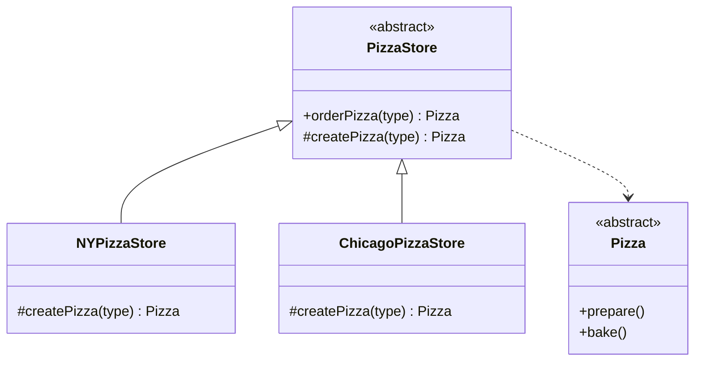
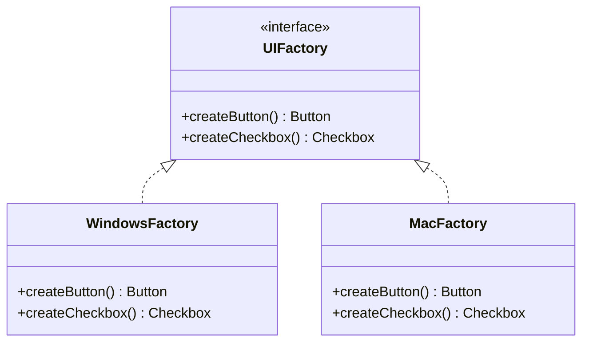
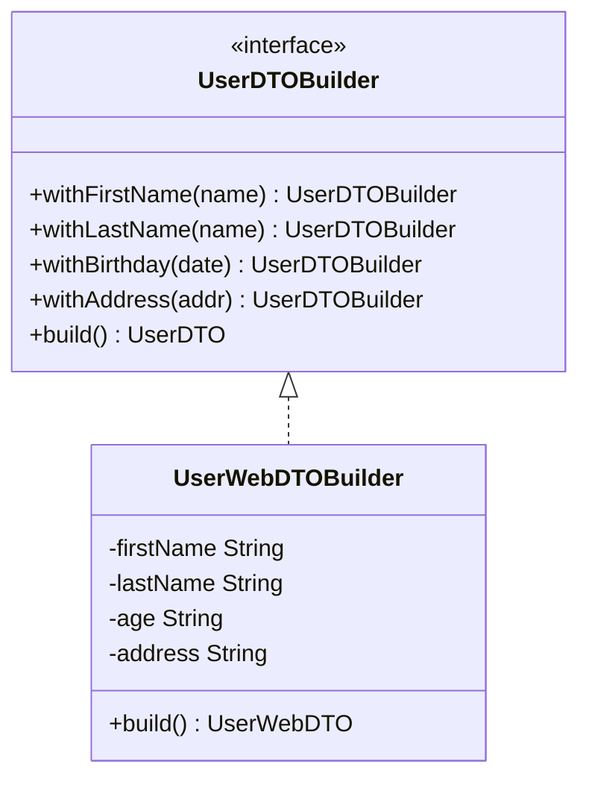

# 생성 패턴

---

> 객체를 어떻게 만드느냐는 객체를 어떻게 쓰느냐만큼 중요하다. 생성 패턴은 객체 생성 로직을 캡슐화해 코드와 구현 사이의 결합을 끊는다.

## Factory Method — 팩토리 메서드

*의도*: 객체 생성을 위한 인터페이스를 정의하되, 어떤 클래스를 인스턴스화할지는 서브클래스가 결정하게 한다.

클라이언트 코드가 `new ConcreteClass()`를 직접 호출하면 그 구현체에 강하게 묶인다. 팩토리 메서드는 이 생성 결정권을 서브클래스로 위임해 DIP를 실현한다. 피자 가게 비유가 직관적이다. 본사(`PizzaStore`)는 주문 프로세스를 정의하고, 각 지점(`NYPizzaStore`, `ChicagoPizzaStore`)이 어떤 피자를 만들지 결정한다.

**구조**



**Java 21 구현**

```java
public abstract class PizzaStore {

    // 템플릿: 주문 흐름은 고정, 생성은 서브클래스에 위임
    public final Pizza orderPizza(String type) {
        Pizza pizza = createPizza(type);
        pizza.prepare();
        pizza.bake();
        pizza.cut();
        pizza.box();
        return pizza;
    }

    protected abstract Pizza createPizza(String type);
}

public class NYPizzaStore extends PizzaStore {
    @Override
    protected Pizza createPizza(String type) {
        return switch (type) {
            case "cheese"    -> new NYStyleCheesePizza();
            case "veggie"    -> new NYStyleVeggiePizza();
            case "clam"      -> new NYStyleClamPizza();
            case "pepperoni" -> new NYStylePepperoniPizza();
            default          -> null;
        };
    }
}
```

*사용 시점*: 생성할 객체 타입을 컴파일 타임에 알 수 없거나, 서브클래스가 생성 방식을 결정해야 할 때.

## Abstract Factory — 추상 팩토리

*의도*: 관련 있는 객체들의 군(family)을 일관되게 생성하는 인터페이스를 제공한다.

팩토리 메서드가 단일 제품을 만드는 데 집중한다면, 추상 팩토리는 연관된 제품 군 전체를 한 팩토리에서 찍어낸다. UI 테마 전환(다크/라이트), 데이터베이스 드라이버 교체 등 제품군을 통째로 바꿔야 하는 상황에 유용하다.

**구조**



**Java 21 구현**

```java
public interface UIFactory {
    Button createButton();
    Checkbox createCheckbox();
}

public class WindowsFactory implements UIFactory {
    @Override
    public Button createButton()     { return new WindowsButton(); }
    @Override
    public Checkbox createCheckbox() { return new WindowsCheckbox(); }
}

public class MacFactory implements UIFactory {
    @Override
    public Button createButton()     { return new MacButton(); }
    @Override
    public Checkbox createCheckbox() { return new MacCheckbox(); }
}

// 클라이언트는 UIFactory 인터페이스만 안다
public class Application {
    private final Button button;
    private final Checkbox checkbox;

    public Application(UIFactory factory) {
        this.button   = factory.createButton();
        this.checkbox = factory.createCheckbox();
    }
}
```

*사용 시점*: 제품 패밀리를 교체해야 하거나, 특정 구현체에 의존하지 않고 연관 객체군을 함께 생성해야 할 때.

## Builder — 빌더

*의도*: 복잡한 객체의 생성 과정을 단계별로 분리해, 동일한 생성 절차에서 서로 다른 표현을 만들 수 있게 한다.

불변 객체는 생성자에 모든 필드를 넘겨야 하는데, 선택적 필드가 많아지면 *텔레스코핑 생성자(telescoping constructor)* 문제가 생긴다. 빌더는 각 단계를 메서드로 표현해 가독성과 불변성을 동시에 달성한다.

**구조**



**Java 21 구현** (record + sealed interface 활용)

```java
public record Address(
    String houseNumber
    , String street
    , String city
    , String state
    , String zipcode
) {}

public record UserDTO(String name, String address, String age) {

    public static Builder builder() { return new Builder(); }

    public static final class Builder {
        private String firstName;
        private String lastName;
        private String age;
        private String address;

        public Builder firstName(String firstName) {
            this.firstName = firstName;
            return this;
        }

        public Builder lastName(String lastName) {
            this.lastName = lastName;
            return this;
        }

        public Builder birthday(LocalDate date) {
            this.age = String.valueOf(Period.between(date, LocalDate.now()).getYears());
            return this;
        }

        public Builder address(Address addr) {
            this.address = addr.houseNumber() + ", " + addr.street()
                + "\n " + addr.city() + "\n " + addr.state() + " " + addr.zipcode();
            return this;
        }

        public UserDTO build() {
            return new UserDTO(firstName + " " + lastName, address, age);
        }
    }
}

// 사용
UserDTO dto = UserDTO.builder()
    .firstName("Ron")
    .lastName("Swanson")
    .birthday(LocalDate.of(1960, 5, 6))
    .address(new Address("100", "State Street", "Pawnee", "Indiana", "47998"))
    .build();
```

*사용 시점*: 선택적 파라미터가 많은 불변 객체 생성, 또는 생성 절차가 복잡해 단계별로 표현이 필요할 때.

## Singleton — 싱글톤

*의도*: 클래스의 인스턴스가 오직 하나만 생성되도록 보장하고, 그 인스턴스에 대한 전역 접근점을 제공한다.

멀티스레드 환경에서의 초기화 경쟁 조건을 피하는 것이 핵심 구현 과제다. Java에서는 *enum 방식*이 리플렉션 공격과 역직렬화에 모두 안전한 가장 견고한 구현으로 권장된다.

**Java 21 구현** (권장 순서)

```java
// 방법 1: Enum (가장 안전, 직렬화·리플렉션 대응)
public enum AppConfig {
    INSTANCE;

    private final String dbUrl = "jdbc:postgresql://localhost/app";
    public String getDbUrl() { return dbUrl; }
}

// 방법 2: DCL (Double-Checked Locking) - 성능 중요 시
public class ConnectionPool {
    private static volatile ConnectionPool instance;

    private ConnectionPool() {}

    public static ConnectionPool getInstance() {
        if (instance == null) {
            synchronized (ConnectionPool.class) {
                if (instance == null) {
                    instance = new ConnectionPool();
                }
            }
        }
        return instance;
    }
}

// 방법 3: Initialization-on-demand holder (클래스 로딩 기반)
public class Registry {
    private Registry() {}

    private static final class Holder {
        static final Registry INSTANCE = new Registry();
    }

    public static Registry getInstance() { return Holder.INSTANCE; }
}
```

*사용 시점*: 전역 상태 관리(설정, 연결 풀, 로거)가 필요할 때. 단, 테스트 어려움과 전역 의존성 문제 때문에 Spring Bean(`@Bean`, `@Component`)으로 대체하는 것을 먼저 고려한다.

## Prototype — 프로토타입

*의도*: 기존 객체를 복사해 새 객체를 생성한다. 생성 비용이 높거나 초기 상태를 재사용해야 할 때 유용하다.

Java의 `Cloneable` 인터페이스보다는 복사 생성자나 `copy()` 팩토리 메서드가 더 안전하고 명시적이다.

**Java 21 구현** (record 활용)

```java
// record는 불변이므로 withers 패턴으로 "수정된 복사본"을 만든다
public record GameCharacter(
    String name
    , int health
    , int attack
    , List<String> inventory
) {
    // 방어적 복사로 불변성 보장
    public GameCharacter {
        inventory = List.copyOf(inventory);
    }

    public GameCharacter withHealth(int health) {
        return new GameCharacter(name, health, attack, inventory);
    }

    public GameCharacter withAttack(int attack) {
        return new GameCharacter(name, health, attack, inventory);
    }
}

// 사용: 프로토타입 기반 NPC 생성
GameCharacter baseWarrior = new GameCharacter("Warrior", 100, 15, List.of("Sword"));
GameCharacter eliteWarrior = baseWarrior.withHealth(200).withAttack(25);
```

*사용 시점*: 객체 생성 비용이 높고 기존 객체와 유사한 인스턴스가 필요할 때, 또는 런타임에 클래스를 몰라도 복제해야 할 때.

## 생성 패턴 비교

| 패턴 | 목적 | 복잡도 | 사용 빈도 |
|------|------|--------|-----------|
| Factory Method | 서브클래스가 생성 타입을 결정 | 낮음 | 매우 높음 |
| Abstract Factory | 연관 객체 군을 일관되게 생성 | 중간 | 높음 |
| Builder | 복잡한 객체를 단계적으로 구성 | 중간 | 매우 높음 |
| Singleton | 인스턴스를 하나로 제한 | 낮음 | 중간 |
| Prototype | 기존 객체를 복사해 생성 | 낮음 | 낮음 |
