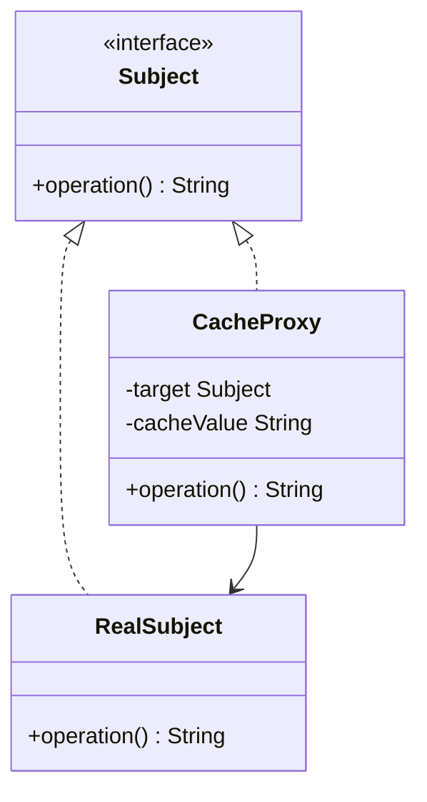
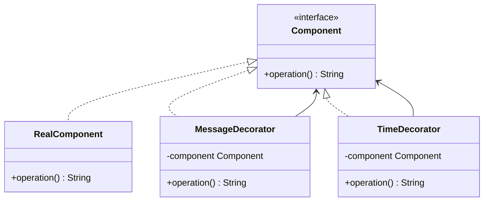
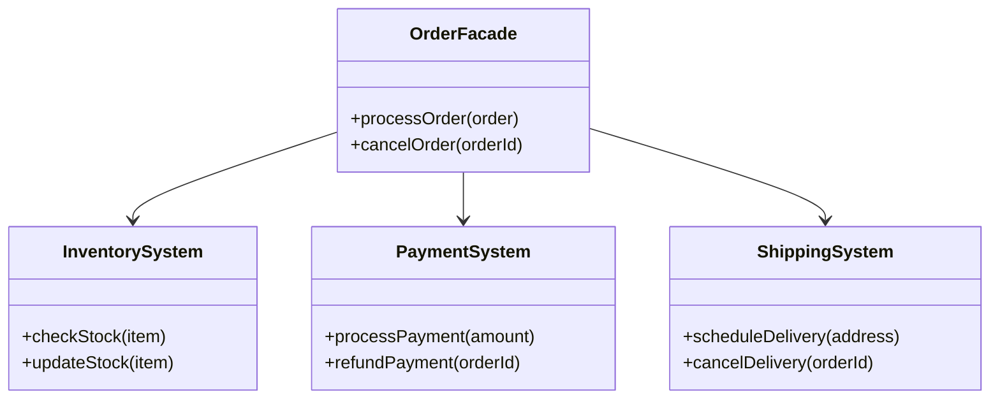

# 구조 패턴

---

> 구조 패턴은 클래스와 객체를 더 큰 구조로 조합하되, 그 구조를 유연하고 효율적으로 유지하는 방법을 다룬다.

## Proxy — 프록시

*의도*: 다른 객체에 대한 대리자(surrogate)를 제공해, 그 객체에 대한 접근을 제어한다.

클라이언트는 프록시 객체가 존재한다는 사실을 모른다. 프록시는 실제 객체와 동일한 인터페이스를 구현하기 때문에, 클라이언트 입장에서는 실제 객체를 직접 호출한 것과 동일하게 동작한다. 이 투명성이 프록시의 핵심이다.

프록시의 목적은 **접근 제어**다. 데코레이터는 같은 구조를 사용하면서 목적이 **기능 추가**인 점에서 구별된다.

### 프록시의 세 가지 유형

**보호 프록시(Protection Proxy)**: 요청한 사용자의 권한을 확인하고, 허가되지 않은 접근을 차단한다.

**가상 프록시(Virtual Proxy)**: 생성 비용이 높은 객체의 초기화를 실제로 필요한 시점까지 미룬다(지연 초기화).

**원격 프록시(Remote Proxy)**: 네트워크 너머에 있는 객체를 로컬 객체처럼 사용할 수 있게 해준다. RMI, gRPC 스텁이 대표적이다.

**구조**



**Java 21 구현** (캐싱 프록시)

```java
public interface Subject {
    String operation();
}

public class RealSubject implements Subject {
    @Override
    public String operation() {
        // 1초가 걸리는 비용이 큰 연산
        Thread.sleep(1000);
        return "data";
    }
}

// 가상 프록시: 결과를 캐싱해 반복 호출 비용을 줄인다
public class CacheProxy implements Subject {
    private final Subject target;
    private String cacheValue;

    public CacheProxy(Subject target) {
        this.target = target;
    }

    @Override
    public String operation() {
        if (cacheValue == null) {
            cacheValue = target.operation(); // 최초 1회만 실제 호출
        }
        return cacheValue;
    }
}

// 조립: 클라이언트는 CacheProxy를 Subject로 주입받는다
Subject subject = new CacheProxy(new RealSubject());
subject.operation(); // 실제 호출 (1초)
subject.operation(); // 캐시 반환 (즉시)
subject.operation(); // 캐시 반환 (즉시)
```

## Decorator — 데코레이터

*의도*: 객체에 동적으로 새로운 책임을 추가한다. 서브클래스를 만드는 것보다 유연하게 기능을 확장할 수 있다.

데코레이터는 같은 인터페이스를 구현하면서 내부에 원본 객체를 감싼다(wrap). 핵심은 **체이닝**이다. 데코레이터를 여러 겹 쌓을 수 있기 때문에, 상속으로는 불가능했던 조합 폭발 문제를 해결한다.

**구조**



**Java 21 구현** (체이닝)

```java
public interface Component {
    String operation();
}

public class RealComponent implements Component {
    @Override
    public String operation() {
        return "data";
    }
}

// 메시지 꾸미기 데코레이터
public class MessageDecorator implements Component {
    private final Component component;

    public MessageDecorator(Component component) {
        this.component = component;
    }

    @Override
    public String operation() {
        String result = component.operation();
        return "*****" + result + "*****"; // 기능 추가
    }
}

// 시간 측정 데코레이터
public class TimeDecorator implements Component {
    private final Component component;

    public TimeDecorator(Component component) {
        this.component = component;
    }

    @Override
    public String operation() {
        long start = System.currentTimeMillis();
        String result = component.operation();
        long end = System.currentTimeMillis();
        System.out.println("실행시간: " + (end - start) + "ms");
        return result;
    }
}

// 체이닝: TimeDecorator → MessageDecorator → RealComponent 순으로 감싼다
Component real = new RealComponent();
Component withMessage = new MessageDecorator(real);
Component withTime = new TimeDecorator(withMessage);

withTime.operation();
// 출력: 실행시간: 0ms
// 반환: "*****data*****"
```

## Facade — 퍼사드

*의도*: 복잡한 서브시스템에 대한 단순화된 인터페이스를 제공한다.

퍼사드는 서브시스템의 복잡성을 숨기는 것이지, 서브시스템 기능을 제한하는 것이 아니다. 필요하다면 클라이언트가 서브시스템에 직접 접근하는 경로도 열어둘 수 있다. 컴퓨터 부팅 과정이 전형적인 예시다. 사용자는 전원 버튼 하나(`start()`)만 누르면 되고, 내부에서 CPU, Memory, HardDrive가 협력하는 복잡한 과정은 몰라도 된다.

**구조**



**Java 21 구현**

```java
// 서브시스템들 — 각각 복잡한 내부 로직을 가진다
class InventorySystem {
    public void checkStock(String item) { /* ... */ }
    public void updateStock(String item) { /* ... */ }
}

class PaymentSystem {
    public void processPayment(double amount) { /* ... */ }
    public void refundPayment(String orderId) { /* ... */ }
}

class ShippingSystem {
    public void scheduleDelivery(String address) { /* ... */ }
    public void cancelDelivery(String orderId) { /* ... */ }
}

// 퍼사드: 클라이언트에게 단순한 인터페이스만 노출한다
public class OrderFacade {
    private final InventorySystem inventory;
    private final PaymentSystem payment;
    private final ShippingSystem shipping;

    public OrderFacade() {
        this.inventory = new InventorySystem();
        this.payment   = new PaymentSystem();
        this.shipping  = new ShippingSystem();
    }

    public void processOrder(Order order) {
        inventory.checkStock(order.getItem());
        payment.processPayment(order.getAmount());
        shipping.scheduleDelivery(order.getAddress());
    }

    public void cancelOrder(String orderId) {
        shipping.cancelDelivery(orderId);
        payment.refundPayment(orderId);
        inventory.updateStock(orderId);
    }
}
```

Spring의 `JdbcTemplate`은 퍼사드 패턴의 대표적인 실제 사례다. `Connection`, `PreparedStatement`, `ResultSet`을 직접 다루는 JDBC의 복잡성을 단순한 메서드 호출로 감춰준다.

```java
@Repository
public class UserRepository {
    private final JdbcTemplate jdbcTemplate;

    public User findById(Long id) {
        return jdbcTemplate.queryForObject(
            "SELECT * FROM users WHERE id = ?"
            , new Object[]{id}
            , new UserRowMapper()
        );
    }
}
```

## Adapter — 어댑터

*의도*: 호환되지 않는 인터페이스를 가진 클래스들이 함께 동작할 수 있도록 변환기를 제공한다.

어댑터는 기존 코드를 수정하지 않고 서로 다른 인터페이스를 연결한다. 레거시 시스템 통합, 외부 라이브러리 래핑에 자주 쓰인다.

**Java 21 구현**

```java
// 기존 레거시 인터페이스
public interface LegacyPrinter {
    void printDocument(String content);
}

// 새로운 인터페이스 (클라이언트가 기대하는 형태)
public interface ModernPrinter {
    void print(String content, String format);
}

// 어댑터: ModernPrinter를 LegacyPrinter로 변환한다
public class PrinterAdapter implements ModernPrinter {
    private final LegacyPrinter legacyPrinter;

    public PrinterAdapter(LegacyPrinter legacyPrinter) {
        this.legacyPrinter = legacyPrinter;
    }

    @Override
    public void print(String content, String format) {
        // format 정보를 무시하거나 변환해서 레거시에 전달한다
        String adapted = "[" + format + "] " + content;
        legacyPrinter.printDocument(adapted);
    }
}
```

## 프록시 vs 데코레이터 비교

두 패턴은 구조가 동일하지만 목적이 다르다. 이 차이를 명확히 이해해야 올바른 패턴을 선택할 수 있다.

| 구분 | 프록시 | 데코레이터 |
|------|--------|-----------|
| 핵심 의도 | 접근 제어 (보안, 캐싱, 지연 초기화) | 기능 추가 (로깅, 트랜잭션, 포맷 변환) |
| 실제 객체 참조 방식 | 프록시가 직접 생성하거나 주입받음 | 데코레이터 외부에서 주입받음 |
| 체이닝 | 일반적으로 1단계 | 여러 겹 중첩 가능 |
| 클라이언트 인식 | 클라이언트는 프록시 존재를 모름 | 클라이언트가 조합을 결정하기도 함 |
| Spring 적용 예 | AOP 프록시 (`@Transactional`) | `HttpServletRequest` wrapper |

## Spring AOP 프록시 — JDK Dynamic Proxy vs CGLIB

Spring은 `@Transactional`, `@Cacheable` 등 AOP 기능을 프록시로 구현한다. 대상 클래스의 특성에 따라 두 가지 방식 중 하나를 선택한다.

| 구분 | JDK Dynamic Proxy | CGLIB |
|------|-------------------|-------|
| 동작 원리 | 인터페이스 기반 프록시 생성 | 바이트코드 조작으로 서브클래스 생성 |
| 대상 조건 | 대상 클래스가 인터페이스를 구현해야 함 | 인터페이스 없어도 동작 (final 클래스 제외) |
| 성능 | 리플렉션 기반, 약간 느림 | 바이트코드 직접 호출, 더 빠름 |
| Spring Boot 기본값 | Spring Boot 2.x 이전 | Spring Boot 2.x 이후 기본값 |

```java
// @Transactional이 붙은 서비스 — Spring이 자동으로 프록시를 생성한다
@Service
public class OrderService {

    @Transactional
    public void createOrder(Order order) {
        // 실제 비즈니스 로직
        // Spring AOP 프록시가 트랜잭션 시작/종료를 앞뒤로 감싼다
    }
}
```

내부 메서드 호출(`this.someMethod()`)이 AOP가 적용되지 않는 이유도 여기에 있다. `this`는 프록시가 아닌 실제 객체를 가리키기 때문에, 프록시의 부가 기능을 거치지 않는다.
