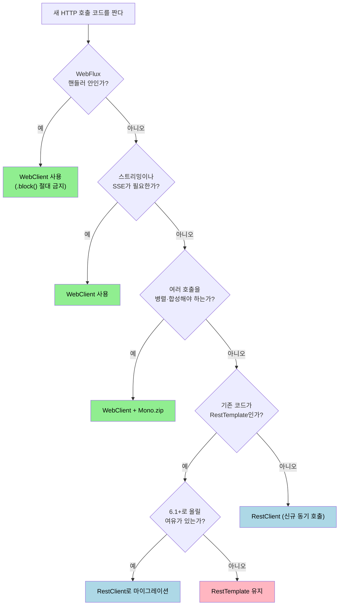

# WebClient 입문과 RestTemplate·RestClient 비교

---

> Spring 6.2 시점에서 HTTP 클라이언트는 RestTemplate·RestClient·WebClient 세 가지가 동시에 살아 있다. 본 챕터는 셋이 어떻게 갈렸는지, 그리고 새 코드를 짤 때 무엇을 골라야 하는지 결정 트리를 제시한다.


## RestTemplate은 왜 자리에서 밀렸는가

> 한 줄로 줄이면 "스레드 모델이 시대를 못 따라갔다"이다. 그런데 무엇이 어떻게 안 맞았는지 한 단계 더 들어간다.

RestTemplate은 2009년 Spring 3.0과 함께 등장한 동기 HTTP 클라이언트다. `Apache HttpClient`나 `OkHttp` 같은 저수준 라이브러리를 동기 호출 한 줄로 추상화해 준다는 점에서 오랜 시간 표준 자리를 지켰다. 그런데 두 가지 흐름이 RestTemplate의 자리를 좁혔다.

첫째, 한 요청에 한 스레드를 묶는 모델이 마이크로서비스 환경에서 비싸졌다. 외부 API 한 곳이 1초 늦으면 그 요청을 잡고 있던 스레드가 1초 동안 놀고, 동시에 100개 요청이 막히면 톰캣 스레드 풀이 100개 정도 묶여 멈춘다. RestTemplate은 이 패턴을 피할 수단이 없다.

둘째, Reactive Streams가 표준화되면서 백프레셔(backpressure) 흐름 제어가 라이브러리 차원에서 동작 가능해졌다. RestTemplate은 콜백이나 백프레셔를 본격적으로 지원하지 못한 채 남았다.

Spring팀은 5.0(2017)에서 WebClient를 새로 내놓고, 이후 RestTemplate을 "현재 코드는 유지하되 새 기능 추가는 하지 않는다"는 의미의 maintenance mode로 옮겼다. 6.0(2022)에서는 Javadoc에 명시적으로 "future versions에서 deprecated될 가능성이 있다"는 경고까지 붙었다.

```java
// RestTemplate — 동기 호출, 스레드 1개를 응답까지 잡는다
RestTemplate rest = new RestTemplate();
ResponseEntity<User> response = rest.getForEntity(
        "https://api.example.com/users/{id}", User.class, 42L);
User user = response.getBody();
```

위 한 줄이 끝나기 전까지 호출 스레드는 IO를 기다리며 점유된다. 100ms짜리 호출 100건을 동시에 처리하려면 100개 스레드가 묶인다. WebClient는 이 점유 시간을 극단적으로 줄이는 것이 출발점이다.


## WebClient는 무엇을 새로 푸는가

> 비동기 논블로킹 모델로 옮기면서 동시성, 백프레셔, 함수형 API 세 가지를 동시에 가져왔다.

WebClient는 Reactor를 기반으로 동작한다. 호출은 `Mono` 또는 `Flux` 파이프라인을 만들고, 실제 IO는 Netty의 `EventLoopGroup`이 비동기로 처리한다. 응답이 도착했을 때 콜백이 깨어나 다음 단계를 실행한다. 호출 스레드는 IO를 기다리지 않으므로, 적은 수의 EventLoop 스레드(보통 CPU 코어 수의 2배)가 수만 개 동시 호출을 굴린다.

```java
// WebClient — 비동기 파이프라인을 만들고 즉시 반환
WebClient client = WebClient.builder().baseUrl("https://api.example.com").build();
Mono<User> userMono = client.get()
        .uri("/users/{id}", 42L)
        .retrieve()
        .bodyToMono(User.class);

// 구독 시점에 IO가 시작된다
userMono.subscribe(user -> log.info("user={}", user));
```

위 코드에서 `bodyToMono`까지는 IO가 일어나지 않는다. `.subscribe()`나 `.block()`이 호출돼야 비로소 EventLoop가 요청을 보낸다. 이 "선언과 실행의 분리"는 처음 보면 헷갈리지만, 일단 익숙해지면 다음 두 가지가 가능해진다.

1. **여러 호출의 병렬·합성**. `Mono.zip(a, b, c)`로 세 호출을 동시에 보내고 모두 도착했을 때 합산하는 코드가 한 줄로 가능하다. RestTemplate으로 같은 일을 하려면 `CompletableFuture`나 별도 스레드 풀을 직접 짜야 한다.
2. **백프레셔와 스트리밍**. `Flux<DataBuffer>`로 거대한 응답을 청크 단위로 받으면서, 다운스트림이 처리하는 속도에 맞춰 업스트림에 요청량을 신호로 보낸다. Server-Sent Events나 청크 transfer-encoding을 쓰는 API에 자연스럽게 붙는다.

WebClient는 비동기·백프레셔·함수형 API라는 세 가지를 한 묶음으로 들고 들어온다. 셋 중 하나라도 필요하다면 RestTemplate으로는 풀기 어렵다.


## 그러면 모든 호출을 WebClient로 옮겨야 하는가

> 5.x 시점까지의 답은 "예"에 가까웠지만 6.1에서 RestClient가 등장하면서 답이 바뀌었다.

5.0~6.0 동안 WebClient는 사실상 단독 후계자였다. 그런데 동기 호출이 굳이 필요한 코드까지 Reactor 파이프라인을 만들고 `.block()`을 붙이는 흐름이 표준이 되니, 두 가지 비용이 누적됐다.

첫째, 학습 곡선이 높았다. `Mono`/`Flux`를 모르는 신입에게 "외부 API 호출 한 번 짜라"고 시키면 반응형 연산자(`flatMap`/`map`/`switchIfEmpty`)부터 배워야 했다. 호출이 동기로 끝날 코드인데도 비동기 사고를 강요받는 비율이 높았다.

둘째, `.block()` 사용이 사실상 필수가 됐다. 대다수 비즈니스 코드는 결과를 기다려야 하므로, MVC 컨트롤러나 `@Service`에서 `Mono<T>`를 받아 `.block()`을 호출하는 형태가 반복됐다. Reactor 입장에서 `.block()`은 EventLoop 스레드에서 호출되면 데드락을 만드는 위험한 호출이고, 일반 스레드에서는 비용이 큰 동기화 지점이다.

Spring팀은 이 두 비용에 대응해 6.1(2023)에서 `RestClient`를 새로 내놨다. RestClient는 WebClient의 함수형 API를 그대로 이어받으면서, 내부 동작은 동기다.

```java
// RestClient — 6.1+, 동기. 함수형 빌더 + 익숙한 동기 반환 타입
RestClient client = RestClient.create("https://api.example.com");
User user = client.get()
        .uri("/users/{id}", 42L)
        .retrieve()
        .body(User.class);
```

RestTemplate과 비교하면 빌더·`uri`·`retrieve`·`body` 같은 API가 WebClient를 빼다 박았다. 그러나 반환은 `Mono<User>`가 아니라 `User`다. 동기로 호출하고 동기로 결과를 받는다.

이 등장 이후 분업이 명확해졌다. WebClient는 "비동기·스트리밍·고동시성"이 필요한 곳, RestClient는 "그 외 일상적인 동기 호출"을 담당한다. RestTemplate은 하위 호환성을 위해 남는다.


## 셋의 결정 트리

> 새 코드를 짤 때 어느 것을 골라야 하는가를 한 페이지로 정리한다.



> 다이어그램 풀이: WebFlux 안이거나 스트리밍·병렬 호출이 필요하면 WebClient. 그 외 동기 일상 호출은 RestClient. RestTemplate은 6.1 이상으로 못 올리는 레거시에 한정된다.

표로도 같이 본다.

| 항목 | RestTemplate | RestClient | WebClient |
|------|------------|-----------|-----------|
| 도입 | 3.0 (2009) | 6.1 (2023) | 5.0 (2017) |
| 동작 모델 | 동기·블로킹 | 동기·블로킹 | 비동기·논블로킹 |
| 반환 타입 | `T` / `ResponseEntity<T>` | `T` / `ResponseEntity<T>` | `Mono<T>` / `Flux<T>` |
| 함수형 빌더 | 부분 | 정식 | 정식 |
| 백프레셔 | 없음 | 없음 | 있음 |
| `.block()` 필요 | 해당 없음 | 해당 없음 | 비동기 컨텍스트 외에서 가끔 |
| 기본 transport | JDK / Apache / OkHttp | JDK / Apache / OkHttp | Netty / JDK |
| 새 기능 추가 | 멈춤 | 진행 중 | 진행 중 |
| 학습 비용 | 낮음 | 낮음 | 보통 (Reactor 필요) |

본 묶음이 다루는 대상은 표 우측 끝의 WebClient다. 스트리밍·병렬·고동시성을 잡는 도구로서 어떻게 쓰는지를 11편으로 풀어낸다.


## 그래도 헷갈리는 경계 케이스

> 결정 트리만으로 안 풀리는 세 가지 상황을 짚는다.

### MVC 안에서 외부 API를 비동기로 부르고 싶은 경우

MVC 컨트롤러에서 `Mono<T>` 또는 `DeferredResult<T>`를 반환하면 외부 호출이 비동기로 도는 동안 톰캣 스레드를 풀어 준다. 외부 API 응답이 100ms이고 동시 요청이 1000건이라면, RestClient로는 1000개 톰캣 스레드가 묶이지만 WebClient + `Mono` 반환으로는 EventLoop 몇 개로 처리된다. 호출당 응답시간을 줄이지는 못해도 동시성을 키우는 효과가 분명하다.

### 외부 SaaS 한 곳만 호출하는 단순한 마이크로서비스

호출 패턴이 매번 "1요청 1응답, 결과를 기다려 즉시 반환"이라면 WebClient의 비동기 이점이 거의 없다. RestClient 쪽이 학습 비용·디버깅 난이도·스택트레이스 가독성에서 모두 유리하다.

### Spring Boot 3.2 이하

`RestClient`는 Spring Framework 6.1부터 정식이다. Spring Boot 3.2는 6.1을 포함하므로 사용 가능하지만, 3.1 이하라면 RestTemplate 또는 WebClient 둘 중 하나를 골라야 한다. 이 경우 WebClient를 동기로 쓰는 패턴(`.block()` 명시)이 RestTemplate보다 유지보수성이 좋다는 평이 일반적이다.


## "동기 호출인데 WebClient를 써도 되는가"의 답

> 자주 받는 질문이다. 정답은 "되긴 하지만 새 코드라면 RestClient를 우선"이다.

5.0~6.0 시점에 작성된 코드 중 WebClient + `.block()` 패턴이 많다. 그 코드를 굳이 RestClient로 옮길 필요는 없다. 두 가지 면에서 동작은 같고, 마이그레이션 자체가 위험을 들고 들어온다.

새 코드라면 다르다. 동기 호출이라면 RestClient가 다음 세 가지에서 단단하다.

1. **`.block()`이 필요 없다.** Reactor thread에서 `.block()`을 호출했다가 데드락을 일으키는 함정이 사라진다.
2. **스택트레이스가 깨끗하다.** Reactor 연산자 체인을 거치지 않으므로 예외 스택이 호출 코드 바로 위까지 그대로 올라온다.
3. **학습 비용이 낮다.** 팀 전체가 Reactor를 능숙하게 다루지 않는다면 신규 동기 호출을 굳이 비동기 파이프라인으로 감쌀 이유가 없다.

본 묶음이 WebClient를 다루는 이유는 비동기·스트리밍·고동시성이 실제로 필요한 경우에 한정된다. TPS `ApprovalUrlAdapter`(02-04에서 상세히 다룸) 같은 경우는 호출 시점에 빌드한 WebClient에 `.block()`을 붙여 동기로 쓰는 패턴인데, 이런 코드를 새로 짠다면 RestClient 후보가 우선이다.


## 학습 후 자주 받는 오해

> 시작 단계에서 자주 보이는 두 가지 오해를 짚어 둔다.

1. **"WebClient를 쓰면 무조건 빨라진다"는 오해.** 단일 호출 응답시간은 빨라지지 않는다. WebClient가 줄이는 것은 "동시에 진행 중인 호출 수가 많을 때 묶이는 스레드 수"다. 호출이 직렬이고 결과를 매번 기다린다면 RestTemplate과 응답시간이 같다.
2. **"WebClient는 WebFlux 프로젝트에서만 쓴다"는 오해.** spring-boot-starter-webflux 의존성을 추가하면 MVC 프로젝트에서도 WebClient를 쓸 수 있다. 다만 MVC와 WebFlux를 같은 클래스패스에 두면 자동 설정이 어느 쪽으로 동작할지 결정해야 한다(Spring Boot는 두 starter가 모두 있으면 MVC를 우선). 02-02에서 다룬다.


## 면접에서 받을 만한 질문

> 챕터 마무리 점검. 답을 입으로 한 번 말해 본다.

1. RestTemplate이 maintenance mode에 들어간 이유를 두 가지 이상 들 수 있는가?
   - 답 요지: 동기·블로킹 스레드 모델이 마이크로서비스의 동시성 요구를 못 따라갔고, Reactive Streams의 백프레셔를 지원할 구조가 아니었다.
2. WebClient를 쓰면 응답시간이 빨라지는가?
   - 답 요지: 단일 호출은 거의 같다. 동시에 많은 호출을 굴릴 때 묶이는 스레드 수가 줄고 처리량이 올라간다.
3. RestClient와 WebClient의 결정 기준 한 문장은 무엇인가?
   - 답 요지: 비동기·스트리밍·병렬 합성이 필요하면 WebClient, 그 외 동기 호출은 RestClient.
4. 6.0 이전에 짠 WebClient + `.block()` 코드를 RestClient로 옮길지 어떻게 판단하는가?
   - 답 요지: 동작은 같으므로 마이그레이션 비용·테스트 회귀 위험이 가치를 넘는지 본다. 새 코드는 RestClient를 우선하되, 기존 코드는 굳이 옮기지 않는 편이 안전하다.


## 관련 문서

- [README (MOC)](README.md) — 11편 학습 묶음 전체 지도
- [01-02. WebClient 빌드와 인프라 설정](01-02.WebClient%20빌드와%20인프라%20설정.md) — 다음 챕터, `Builder`와 인프라 튜닝
- [02-02. 동기·비동기 결정 (block 안티패턴)](02-02.동기·비동기%20결정%20(block%20안티패턴).md) — `.block()` 결정 가이드 심화
- [Spring Framework Reference — RestClient](https://docs.spring.io/spring-framework/reference/integration/rest-clients.html#rest-restclient) — RestClient 공식 가이드
