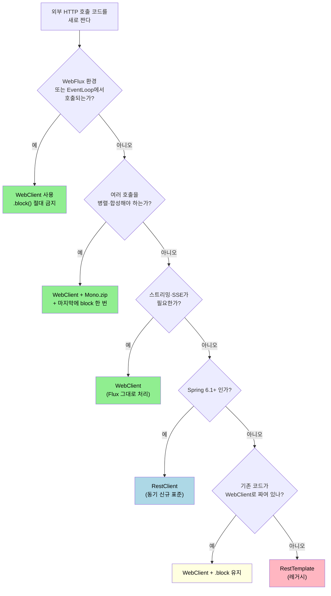

# 동기·비동기 결정 (block 안티패턴)

---

> WebClient를 동기로 쓰는 게 정말 나쁜가, 비동기 파이프라인은 언제 가치가 있는가, 그리고 6.1 이후 RestClient가 등장한 뒤 그 결정 기준이 어떻게 바뀌었는가를 한 자리에 모은다.


## `.block()`이 위험한 자리와 안전한 자리

> 같은 호출이 어디서 일어나느냐에 따라 동작이 달라진다. 데드락을 일으키는 자리부터 본다.

### 위험한 자리 — EventLoop 스레드

WebFlux 핸들러, Reactor 연산자 콜백, `@KafkaListener` 같이 EventLoop가 호출하는 모든 람다 안에서 `.block()`은 금지다.

```java
// ❌ WebFlux 핸들러 — 데드락 위험
@RestController
class UserController {
    private final WebClient client;

    @GetMapping("/users/{id}")
    public User get(@PathVariable long id) {
        // 이 메서드는 Reactor EventLoop에서 호출된다
        return client.get().uri("/users/{id}", id)
                .retrieve()
                .bodyToMono(User.class)
                .block();   // EventLoop가 자기 자신을 기다리며 멈춘다
    }
}
```

EventLoop는 한 번에 한 작업만 처리한다. 그 위에서 `.block()`을 호출하면 EventLoop가 IO 응답을 기다리며 멈추고, 그 EventLoop가 처리해야 할 응답이 영원히 도착하지 못해 데드락이다.

Reactor 3.4+는 이 케이스를 자동 감지한다. EventLoop 스레드 이름(`reactor-http-nio-*`)에서 `.block()`이 호출되면 `BlockingOperationError`를 던진다. 다만 모든 케이스를 감지하지는 못하므로 코드 리뷰 단계에서도 막아야 한다.

### 안전한 자리 — 일반 톰캣 스레드

MVC 컨트롤러는 톰캣 스레드 풀에서 호출된다. 그 위에서 `.block()`은 안전하다. 호출 스레드가 IO를 기다리는 동안 다른 톰캣 스레드들이 다른 요청을 처리한다. 데드락은 일어나지 않는다.

```java
// ✅ MVC 컨트롤러 — 데드락 위험 없음
@RestController
class UserController {
    private final WebClient client;

    @GetMapping("/users/{id}")
    public User get(@PathVariable long id) {
        return client.get().uri("/users/{id}", id)
                .retrieve()
                .bodyToMono(User.class)
                .block();   // 톰캣 스레드가 응답을 기다린다 (데드락 없음)
    }
}
```

데드락은 없지만 다음 두 가지가 비용으로 따라온다.

1. **톰캣 스레드 점유**. 비동기 처리의 이점이 사라진다. 외부 호출이 100ms이고 동시 요청이 1000건이라면 톰캣 스레드 1000개가 묶인다.
2. **WebClient의 학습 비용 회수가 없다**. `Mono`/`Flux`/`flatMap`을 익히고 그 위에 `.block()`을 한 번 붙이는 코드는 RestClient + 동기 호출과 동작이 같다.


## 그래서 무엇을 골라야 하는가 — 결정 트리

> 새 코드라면 다음 트리를 따른다.



> 다이어그램 풀이: WebFlux나 병렬 합성·스트리밍이 필요하면 WebClient. 단일 동기 호출이면 6.1 이상에서는 RestClient. 6.0 이하에서는 기존 코드 정책에 맞춰 결정.


## 병렬 호출 — WebClient의 핵심 가치

> 외부 API 두 곳을 동시에 부르고 둘 다 도착했을 때 합산하는 흐름이 한 줄로 가능하다.

```java
Mono<User> userMono = client.get().uri("/users/{id}", id).retrieve().bodyToMono(User.class);
Mono<List<Order>> ordersMono = client.get().uri("/users/{id}/orders", id).retrieve()
        .bodyToFlux(Order.class).collectList();
Mono<Address> addressMono = client.get().uri("/users/{id}/address", id).retrieve()
        .bodyToMono(Address.class);

Mono<UserDetail> detail = Mono.zip(userMono, ordersMono, addressMono)
        .map(t -> new UserDetail(t.getT1(), t.getT2(), t.getT3()));

UserDetail result = detail.block();   // 마지막에 한 번만 .block()
```

세 호출이 동시에 시작되고, 가장 늦은 호출이 끝났을 때 결과를 합친다. 응답시간이 `max(t1, t2, t3)`로 줄어든다.

같은 일을 RestClient로 하려면 `CompletableFuture`나 직접 만든 스레드 풀을 동원해야 한다. 코드 부피가 두 배 이상이 된다. 병렬 호출이 자주 필요한 코드는 WebClient의 가치가 분명하다.

⚠️ `Mono.zip`은 한 호출이 실패하면 즉시 전체 실패로 끝낸다. 일부 실패를 허용하고 나머지로 진행하려면 각 `Mono`에 `.onErrorReturn(...)` 또는 `.onErrorResume(...)`을 붙여 폴백 값을 만든다.


## `subscribeOn(Schedulers.boundedElastic())` — 외부 IO 격리

> Reactor 파이프라인 안에서 블로킹 IO를 어쩔 수 없이 호출해야 할 때.

WebClient 호출은 비동기지만, 도중에 블로킹 IO(DB JDBC, 파일 IO)가 끼는 경우가 흔하다. 그대로 두면 EventLoop가 블로킹된다.

```java
Mono<User> user = client.get().uri("/users/{id}", id).retrieve().bodyToMono(User.class)
        .flatMap(u -> {
            // 여기서 JDBC 호출 (블로킹)
            User cached = userJpaRepository.save(u);   // ❌ EventLoop 블로킹
            return Mono.just(cached);
        });
```

JDBC 같은 블로킹 IO는 별도 스레드 풀로 격리한다. Reactor가 제공하는 `Schedulers.boundedElastic()`이 그 자리다.

```java
Mono<User> user = client.get().uri("/users/{id}", id).retrieve().bodyToMono(User.class)
        .publishOn(Schedulers.boundedElastic())
        .flatMap(u -> Mono.fromCallable(() -> userJpaRepository.save(u)));
```

`publishOn`은 다음 연산자부터 실행 스레드를 바꾼다. `boundedElastic`은 IO에 최적화된 가변 스레드 풀로 기본 상한이 CPU 코어 수의 10배다. JDBC 호출이 한 스레드를 점유해도 EventLoop는 영향받지 않는다.

`subscribeOn`과 `publishOn`의 차이는 다음과 같다.

| 연산자 | 동작 |
|--------|------|
| `subscribeOn(Scheduler)` | 파이프라인 전체의 구독 시점 스레드를 결정 |
| `publishOn(Scheduler)` | 그 시점부터 다음 연산자까지의 실행 스레드를 결정 |

`subscribeOn`은 한 번만 효과가 있고, `publishOn`은 여러 번 호출하면 그때마다 스레드를 바꿀 수 있다.


## MVC와 WebFlux를 한 앱에 섞을 때

> spring-boot-starter-web과 spring-boot-starter-webflux를 같이 두면 어느 쪽이 동작할까.

Spring Boot는 두 starter가 모두 클래스패스에 있으면 MVC를 기본으로 선택한다. `application.yml`로 명시할 수도 있다.

```yaml
spring:
  main:
    web-application-type: reactive   # 또는 servlet
```

흔한 패턴은 다음 두 가지다.

### 1) MVC 앱에서 WebClient만 사용

대부분의 경우다. spring-boot-starter-web만 추가하고 WebClient는 따로 쓴다. `WebClient`는 `spring-webflux` 모듈에 있으므로 그것 하나만 의존성에 추가한다.

```gradle
implementation 'org.springframework.boot:spring-boot-starter-web'
implementation 'org.springframework:spring-webflux'
implementation 'io.projectreactor.netty:reactor-netty'
```

WebClient는 외부 호출 도구로만 쓰고 컨트롤러는 일반 MVC. `.block()`이 안전하다.

### 2) WebFlux 앱

spring-boot-starter-webflux로 시작한다. 컨트롤러가 `Mono`/`Flux`를 반환하고, EventLoop가 응답을 처리한다. `.block()`은 절대 금지.

```java
@GetMapping("/users/{id}")
public Mono<User> get(@PathVariable long id) {
    return client.get().uri("/users/{id}", id).retrieve().bodyToMono(User.class);
}
```

응답이 비동기로 흐르므로 한 EventLoop가 여러 요청을 동시에 처리한다.


## TPS 어댑터 — 동기 결정 분석

> TPS는 WebClient를 동기로 쓰고 `.block()`을 매 호출마다 부른다. 그 결정의 정당성과 개선 후보를 본다.

```java
// ApprovalUrlAdapter.java:75-191 (요지)
for (ApprovalPrgrsInfoDtlDto item : aprvPrgrsInfoDtlDtoList) {
    // ... 요청 빌딩 ...
    TpsResponse<?> response = request.retrieve().bodyToMono(TpsResponse.class).block();
    // ... 응답 검증 ...
}
```

세 가지가 보인다.

1. **for 루프 순차 실행**. 결재 한 건에 연결된 외부 API들을 한 번에 하나씩 부른다.
2. **`.block()`로 동기 결과 받기**. 다음 호출로 넘어가려면 응답이 필요하므로 블로킹.
3. **호출 컨텍스트가 일반 `@Component`**. WebFlux 핸들러가 아니므로 `.block()`은 안전.

### 정당화되는가

다음 세 가지 면에서 그렇다.

1. **호출 환경이 MVC 또는 일반 서비스 계층**이다. EventLoop가 아니므로 `.block()` 데드락 위험이 없다.
2. **호출이 직렬이어야 한다**. 외부 API 호출 결과를 보고 다음 호출을 진행하거나 실패 시 중단해야 하는 흐름이라면 병렬화 가치가 작다.
3. **호출 횟수가 한 결재당 몇 건 이내**라면 응답시간 누적이 문제 되지 않는다.

### 개선 후보

같은 코드를 다음으로 옮길 만하다.

#### A. RestClient로 마이그레이션

호출이 동기·직렬이라면 RestClient가 자연스럽다.

```java
// 가상의 RestClient 버전
RestClient client = RestClient.builder()
        .baseUrl(...)
        .messageConverters(c -> ...)
        .build();

for (ApprovalPrgrsInfoDtlDto item : aprvPrgrsInfoDtlDtoList) {
    // ...
    TpsResponse<?> response = client.method(httpMethod)
            .uri(...)
            .headers(h -> headerMap.forEach(h::add))
            .body(...)
            .retrieve()
            .body(TpsResponse.class);
    // ...
}
```

`.block()`이 사라지고 스택트레이스가 깨끗해진다. multipart 처리 역시 RestClient의 `MultipartBodyBuilder` 헬퍼로 그대로 옮긴다.

#### B. 호출이 늘어난다면 병렬화

한 결재에 연결된 호출이 5건 이상이고 각각 100ms 이상 걸린다면 응답시간 누적이 무시 못 한다. WebClient의 강점이 여기서 살아난다.

```java
List<Mono<TpsResponse<?>>> calls = aprvPrgrsInfoDtlDtoList.stream()
        .map(item -> buildRequest(item).retrieve().bodyToMono(TpsResponse.class))
        .toList();

List<TpsResponse<?>> responses = Flux.merge(calls).collectList().block();
```

순서가 의미 없다면 `Flux.merge`로 동시 실행. 순서가 의미 있다면 `Flux.concat` + 동시성 상한 옵션을 둔다.

#### C. 응답 처리를 비동기로 흘려 보내기

호출 결과를 즉시 반환하지 않고 후속 처리(이벤트 발행·DB 갱신)를 비동기로 흘려 보낸다면 `.block()` 자리를 `.subscribe(...)`로 옮길 수 있다. 단, 이 경우 트랜잭션 경계와 예외 전파를 같이 재설계해야 한다.

02-04에서 사례 분석 챕터로 깊이 다룬다.


## 함정 — 자주 만나는 두 가지

### 1. WebFlux 컨트롤러에서 `Mono`를 받고 `.block()`을 호출

가장 흔한 데드락 케이스다. 컨트롤러가 `Mono<User>`를 반환하면 그 Mono를 그대로 흘려보내야 한다. `.block()`을 호출해 `User`를 만들어 반환하면 EventLoop가 묶인다.

### 2. `subscribeOn`을 잘못 거는 위치

```java
// ❌ subscribeOn이 무의미
client.get().uri("/users").retrieve()
        .bodyToMono(User.class)
        .subscribeOn(Schedulers.boundedElastic());
```

WebClient 호출은 이미 Netty EventLoop에서 비동기로 동작한다. `subscribeOn`을 추가해도 IO 자체는 EventLoop에서 일어난다. `subscribeOn`이 의미를 가지는 자리는 블로킹 코드를 `Mono.fromCallable`로 감싼 직후다.


## 면접에서 받을 만한 질문

> 챕터 마무리 점검.

1. WebFlux 핸들러에서 `.block()`을 호출하면 무엇이 일어나는가?
   - 답 요지: EventLoop가 자기 자신의 응답을 기다리며 멈추고 데드락이 발생한다. Reactor가 자동 감지해 `BlockingOperationError`를 던지기도 한다.
2. MVC 컨트롤러에서 `.block()`을 호출하는 것은 무엇이 비용인가?
   - 답 요지: 톰캣 스레드 점유. 비동기 처리의 이점이 사라지고 동시 요청 수가 톰캣 스레드 풀 크기로 제한된다.
3. WebClient를 동기로 쓰는 코드와 RestClient의 동작 차이는?
   - 답 요지: 동작은 같다. 다만 WebClient는 Reactor 파이프라인 + `.block()`이라 스택트레이스가 무겁고 학습 비용이 든다. 새 코드는 RestClient가 단순.
4. `Mono.zip`으로 병렬 호출을 묶을 때 일부 실패를 허용하려면?
   - 답 요지: 각 `Mono`에 `.onErrorReturn(...)` 또는 `.onErrorResume(...)`을 붙여 폴백 값을 만들어 둔다. `Mono.zip`은 한 호출 실패 시 전체 실패로 끝난다.
5. `subscribeOn(Schedulers.boundedElastic())`은 어디서 의미가 있는가?
   - 답 요지: 블로킹 IO(JDBC, 파일 IO)를 `Mono.fromCallable`로 감싸 별도 스레드 풀에 격리할 때. WebClient 호출 자체에 거는 것은 무의미하다.


## 관련 문서

- [README (MOC)](README.md) — 11편 학습 묶음 전체 지도
- [01-01. WebClient 입문](01-01.WebClient%20입문과%20RestTemplate·RestClient%20비교.md) — 세 클라이언트 결정 트리
- [01-04. 응답 처리](01-04.응답%20처리%20(retrieve와%20exchangeToMono).md) — `.block()` 호출 자리 분석
- [02-04. TPS ApprovalUrlAdapter 사례 분석](02-04.실무%20사례%20-%20TPS%20ApprovalUrlAdapter.md) — 동기 호출 + for 루프의 정당성과 개선 후보
