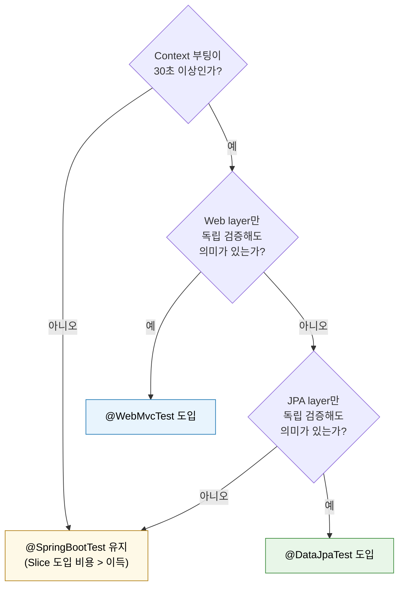

# Slice 테스트 (@WebMvcTest·@DataJpaTest)

---

> Slice 테스트는 Spring ApplicationContext의 *한 계층만* 로드한다. Web layer, JPA layer, JSON 직렬화 layer 같은 *수직 절단*을 만들어 *주변 빈을 격리*한다. TPS에는 `@WebMvcTest`가 *전무*하고 `@DataJpaTest`도 일부 IT 파일에서만 쓰인다. 이 글은 *왜 그렇게 되었는지*를 카테고리 결정 트리로 풀어낸다.


## 학습 목표

> Slice 어노테이션의 *메커니즘*과 TPS에서 *대안 패턴*이 자리잡은 이유를 이해한다.

이 장을 다 읽고 다음 다섯 가지에 자신 있게 답할 수 있으면 학습이 완료된다.

1. `@WebMvcTest`·`@DataJpaTest`가 ApplicationContext를 어떻게 *부분 로드*하는지 설명할 수 있다.
2. Slice 테스트가 *언제 가치를 발휘*하는지(Context 부팅 비용이 큰 환경) 설명할 수 있다.
3. TPS에 `@WebMvcTest`가 없는 이유를 *부팅 비용과 통합 검증*의 균형으로 설명할 수 있다.
4. Slice 대신 *`@SpringBootTest` + MockMvc* 패턴을 쓰는 결정 근거를 설명할 수 있다.
5. Slice 도입을 *언제 결정*해야 하는지 임계 신호를 말할 수 있다.


## 1. Slice 어노테이션의 메커니즘

`@SpringBootTest`가 *전체 ApplicationContext*를 부팅한다면, Slice 어노테이션은 *관심 계층의 빈만* 로드한다.

### 1.1 @WebMvcTest

Web layer만 로드한다. `@Controller`·`@RestController`·`@ControllerAdvice`·`Filter`·`HandlerInterceptor`만 포함된다. Service·Repository·Configuration은 *제외*된다.

```java
@WebMvcTest(OrderController.class)
class OrderControllerTest {
    @Autowired private MockMvc mockMvc;
    @MockBean private OrderService orderService;  // ← Service는 Mock으로

    @Test
    void getOrder() throws Exception {
        given(orderService.find("O-1")).willReturn(order);

        mockMvc.perform(get("/orders/O-1"))
            .andExpect(status().isOk())
            .andExpect(jsonPath("$.id").value("O-1"));
    }
}
```

Service 빈이 Context에 없으므로 *반드시 `@MockBean`*으로 주입해야 한다.

### 1.2 @DataJpaTest

JPA layer만 로드한다. `@Entity`·`Repository`·`EntityManager`만 포함된다. Service·Web layer는 제외된다. 기본으로 *내장 H2 DB + `@Transactional` 자동 롤백*이 적용된다.

```java
@DataJpaTest
class OrderRepositoryTest {
    @Autowired private OrderRepository orderRepository;
    @Autowired private TestEntityManager em;

    @Test
    void findByStatus_returnsMatching() {
        em.persist(new Order("O-1", PENDING));
        em.persist(new Order("O-2", DELIVERED));

        List<Order> result = orderRepository.findByStatus(PENDING);

        assertThat(result).hasSize(1).extracting("id").containsExactly("O-1");
    }
}
```

### 1.3 다른 Slice들

- `@JsonTest` — Jackson `ObjectMapper`만 로드. 직렬화 단위 테스트.
- `@RestClientTest` — `RestTemplate`·`WebClient` + MockRestServiceServer.
- `@DataMongoTest`, `@DataRedisTest` — NoSQL.

공통 패턴: *수직 절단* + *나머지는 Mock*. ApplicationContext가 작아 부팅이 빠르다.


## 2. TPS의 Slice 현황

| 어노테이션 | TPS 사용 수 |
|-----------|------------|
| `@WebMvcTest` | **0** |
| `@DataJpaTest` | 일부 IT 파일 (`PipelineStepRepositoryInnerHolderTest`, `TicketJobConfigRepositoryFindTicketJobOccupationsTest` 등) |
| `@JsonTest`, `@RestClientTest` | 0 |

`@WebMvcTest`가 *완전히 없는* 것은 TPS 테스트 전략의 의식적 선택이다. 그 자리에는 `@SpringBootTest` + MockMvc 패턴이 들어가 있다.


## 3. 왜 TPS에 @WebMvcTest가 없는가

세 가지 이유가 결합되어 있다.

### 3.1 Context 부팅 비용이 *허용 범위 안*

TPS 모듈은 빈 수가 *Slice가 큰 가치를 만들 임계치*에 아직 도달하지 않았다. `@SpringBootTest`로 부팅해도 *5~10초* 안에 Context가 준비되고, 같은 Context를 *테스트 전체에서 재사용*하므로 누적 비용이 작다. Slice 도입의 가장 큰 매력인 *부팅 속도 개선*이 비용 대비 작다.

### 3.2 통합 검증의 가치가 더 크다

`@WebMvcTest`는 Web layer만 로드한다. Filter·Interceptor·ArgumentResolver·@RestControllerAdvice 같은 *통합 자리*가 들어가지만, `@Configuration` 빈이나 *Aspect*는 제외된다. TPS는 *correlation ID 헤더 자동 부착, 사용자 컨텍스트 ThreadLocal, MDC 전파* 같은 *횡단 관심사*가 컨트롤러 동작에 깊이 묶여 있어 *전체 Context*에서 검증해야 회귀가 잡힌다.

`@SpringBootTest` + MockMvc 패턴이 자연스럽다.

```java
@SpringBootTest
@AutoConfigureMockMvc
class OrderControllerIT {
    @Autowired private MockMvc mockMvc;
    @Autowired private OrderService orderService;  // ← 실제 빈

    @Test
    void getOrder_appliesCorrelationIdInterceptor() throws Exception {
        mockMvc.perform(get("/orders/O-1").header("X-Correlation-ID", "C-1"))
            .andExpect(status().isOk())
            .andExpect(header().string("X-Correlation-ID", "C-1"));
    }
}
```

### 3.3 `@MockBean` 비용을 피한다

`@WebMvcTest`는 *Service·Repository 빈이 Context에 없으므로* 반드시 `@MockBean`으로 주입해야 한다. 02-02에서 다룬 바와 같이 `@MockBean`은 *Context 재초기화*를 유발한다. 같은 `@WebMvcTest`라도 `@MockBean` 조합이 다르면 *Context를 다시 부팅*한다. 결과적으로 `@WebMvcTest`가 부팅 비용을 줄이려다 *재초기화로 비용을 늘리는* 역설이 생긴다.

TPS는 *전체 Context를 한 번만 부팅하고 모든 테스트가 재사용*하는 패턴이 빌드 시간에서 더 유리하다.


## 4. @DataJpaTest는 일부 IT에서 쓰임

`@DataJpaTest`는 *JPA layer + 내장 H2 + 자동 롤백*의 묶음이다. TPS의 영속성 IT 일부는 `@DataJpaTest`를 쓴다.

```java
// operator/cicd/src/test/java/.../jobs/infrastructure/persistence/TestJobSubtypeRepositoryIT.java
@DataJpaTest
@AutoConfigureTestDatabase(replace = Replace.NONE)  // ← 내장 H2 안 쓰고 실제 컨테이너 DB 사용
class TestJobSubtypeRepositoryIT {
    @Autowired private TestJobSubtypeRepository repository;

    @Test
    void findByType_returnsMatching() { ... }
}
```

`replace = Replace.NONE`이 핵심이다. `@DataJpaTest` 기본 동작은 *내장 H2로 datasource를 교체*하지만, TPS는 MariaDB 방언을 검증해야 하므로 *컨테이너 DB를 유지*한다. 결과적으로 *Slice의 부분 로드 이득은 살리고 H2의 방언 차이 위험은 피하는* 절충이다.


## 5. Slice 도입 결정 트리



핵심은 *Slice가 푸는 문제(부팅 비용)가 실제로 있는가*다. 모놀리스에서 Context 부팅이 30초를 넘기 시작하면 Slice의 가치가 급격히 커진다. 그 시점이 오기 전에는 *부분 로드의 위험*(통합 검증 누락, `@MockBean` 재초기화)이 더 크다.


## 6. 면접 대비 Q&A

> 면접에서 자주 나오는 형태로 5개. 답을 보지 않고 먼저 입으로 답해 본 뒤 비교한다.

### Q1. `@WebMvcTest`와 `@SpringBootTest + @AutoConfigureMockMvc`의 결정적 차이는?

*Context의 크기*다. `@WebMvcTest`는 Web layer만 로드해 Context가 작고 부팅이 빠르다. `@SpringBootTest`는 전체 Context를 로드해 부팅이 느리지만 *Filter·Interceptor·Aspect·`@ControllerAdvice` 같은 횡단 관심사*가 자동 포함된다. 부팅 비용이 작다면 후자가 더 안전한 검증을 만든다. 부팅 비용이 큰 모놀리스에서는 전자가 *피드백 루프*를 살린다.

### Q2. `@MockBean`이 `@WebMvcTest`의 이득을 깎는 이유는?

`@WebMvcTest`는 Service·Repository를 Context에 *로드하지 않으므로* `@MockBean`이 강제된다. `@MockBean`은 Context 재초기화를 유발하므로, 다른 `@MockBean` 조합을 쓰는 테스트마다 Context가 *새로* 부팅된다. Slice가 부팅 비용을 줄이려는 의도였는데 `@MockBean`이 그 이득을 *재초기화 비용*으로 갚는다. 결과적으로 Slice 도입이 *전체 테스트 시간을 늘릴 수도* 있다.

### Q3. TPS가 `@DataJpaTest`를 쓸 때 `replace = Replace.NONE`을 지정하는 이유는?

`@DataJpaTest` 기본 동작은 *내장 H2로 datasource를 교체*한다. 그러나 TPS는 MariaDB 방언(`UPSERT`, `FOR UPDATE SKIP LOCKED`, 한국어 정렬 등)을 검증해야 하므로 *컨테이너 MariaDB를 유지*해야 한다. `Replace.NONE`이 그 교체를 끄고 *Slice의 부분 로드 이득과 컨테이너의 방언 정확성*을 동시에 잡는다.

### Q4. Slice 도입의 *임계 신호*는 무엇인가?

세 가지를 동시에 본다. (1) *Context 부팅이 30초 이상*. (2) *한 PR이 100개 이상 테스트를 실행*해 누적 시간이 분 단위로 늘어남. (3) *수직 절단이 의미 있는 분리를 만드는지* — Web만 따로, JPA만 따로 검증해도 회귀가 잡히는 구조인지. 셋이 동시에 만족되지 않으면 Slice는 *과한 도구*다.

### Q5. Slice 없이 `@SpringBootTest` + MockMvc를 쓸 때 *피해야 할* 패턴은?

*테스트마다 다른 `@MockBean` 조합*을 쓰는 것이다. 같은 `@SpringBootTest` 어노테이션이라도 `@MockBean` 조합이 다르면 Context가 재초기화된다. 가능하면 *공통 `@TestConfiguration`*으로 Mock 빈을 모으고, 모든 테스트가 그 Configuration을 import하게 만든다. Context 재사용률이 *빌드 시간의 최대 변수*다.


## 7. 관련 문서

- [01-01.테스트 철학과 카테고리](01-01.테스트%20철학과%20카테고리.md) — Slice가 카테고리 분류에서 차지하는 자리
- [03-02.Integration 테스트](03-02.Integration%20테스트.md) — `@SpringBootTest` + Testcontainers
- [02-02.Mock 전략과 설계 피드백](02-02.Mock%20전략과%20설계%20피드백.md) — `@MockBean`의 Context 재초기화 비용
