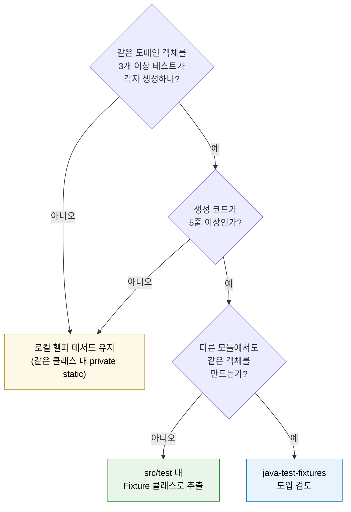

# Test Fixture와 testFixtures 플러그인

---

> Fixture는 *Given 구간의 재사용 단위*다. 잘 만들어진 fixture는 테스트 본문에서 *검증에 필요한 것만* 남기고 셋업의 노이즈를 모두 가린다. 카카오페이 Given Part 3가 정리한 *세 가지 지옥*(파라미터·멀티모듈·Mocking)을 TPS의 `Jenkins305PTestFixtures`·`TicketBaseDataSeeder`·`TestUsers`로 매핑해 풀어낸다.


## 학습 목표

> Fixture의 *세 가지 변형*(빌더·ObjectMother·팩토리 메서드)과 `java-test-fixtures` 도입 결정을 이해한다.

이 장을 다 읽고 다음 다섯 가지에 자신 있게 답할 수 있으면 학습이 완료된다.

1. Fixture가 *Given 구간을 재사용하는 단위*인 이유를 설명할 수 있다.
2. 빌더·ObjectMother·팩토리 메서드 세 변형의 적합 시점을 비교할 수 있다.
3. `java-test-fixtures` 플러그인이 *멀티모듈 재사용 지옥*을 어떻게 푸는지 설명할 수 있다.
4. TPS의 `TicketBaseDataSeeder` 패턴이 Integration 테스트와 어떻게 결합되는지 설명할 수 있다.
5. Fixture 추출의 *임계 신호*를 말할 수 있다.


## 1. Fixture가 푸는 문제

같은 도메인 객체를 *여러 테스트가 다른 모양*으로 만들면 *생성 코드가 중복*된다. 그 중복이 비대해질 때 세 가지 비용이 따라온다.

1. **파라미터 지옥** — 필드 20개 중 검증에 필요한 건 3개뿐인데 *나머지 17개도 형식상 채워야* 한다.
2. **멀티모듈 재사용 지옥** — `src/test/java`의 헬퍼는 *다른 모듈에서 import 불가*.
3. **Mocking 지옥** — 외부 요청 DTO와 도메인 객체가 *95% 같은 필드*를 가질 때 둘 다 만들어야 한다.

카카오페이 Given Part 3이 명시한 세 가지 지옥이다. 세 가지가 같이 만나면 테스트 본문이 *셋업 50줄 + 검증 2줄*이 된다. 검증 의도가 가려진다.

해결은 *Fixture 추출*이다. 도메인 객체 생성을 *기본값을 가진 팩토리*로 묶고, 필요한 필드만 override하게 만든다.


## 2. 세 가지 fixture 변형

### 2.1 빌더 + 기본값

가장 흔한 형태. 도메인 객체에 Lombok `@Builder`가 이미 있다면 *기본값을 채운 빌더 헬퍼*를 만든다.

```java
public final class OutboxEventFixture {
    private OutboxEventFixture() {}

    public static OutboxEvent.OutboxEventBuilder defaultEvent() {
        return OutboxEvent.builder()
                .aggregateId("agg-1")
                .payload(new byte[]{1})
                .topic("topic-a")
                .status(OutboxStatus.PENDING)
                .retryCount(0);
    }
}

// 사용처
OutboxEvent event = OutboxEventFixture.defaultEvent()
        .retryCount(3)
        .build();
```

장점: *override가 자연스럽다*. 검증할 필드만 명시. *원본 빌더 API*를 그대로 쓰므로 새 필드 추가 시 fixture 코드를 안 고쳐도 된다.
단점: 빌더가 없는 도메인 객체에는 적용이 어렵다.

### 2.2 ObjectMother

*명명된 시나리오*를 제공하는 패턴. 시나리오마다 메서드를 하나씩 둔다.

```java
public final class OrderMother {
    private OrderMother() {}

    public static Order pendingOrder()  { return Order.create("O-1", PENDING); }
    public static Order paidOrder()     { return Order.create("O-2", PAID); }
    public static Order shippedOrder()  { return Order.create("O-3", SHIPPED); }
    public static Order cancelledOrder() { return Order.create("O-4", CANCELLED); }
}

// 사용처
Order order = OrderMother.pendingOrder();
```

장점: 시나리오가 *이름으로* 표현된다. 테스트 본문이 *짧고 의도가 명확*.
단점: 시나리오 변형이 많으면 메서드가 폭증한다. `pendingOrderWithLargeAmount()` 같은 *조합 시나리오*가 늘면 관리가 어려워진다.

### 2.3 팩토리 메서드 + Enum

TPS `Jenkins305PTestFixtures`가 이 패턴이다.

```java
public final class Jenkins305PTestFixtures {

    public static final String PROJECT_ID = "SBH";
    public static final String PRESET_ID = "E2E";

    public enum TestJob {
        SUCCESS("E2E-SUCCESS", ExecutionJobStatus.SUCCESS),
        FAILURE("E2E-FAILURE", ExecutionJobStatus.FAILURE),
        UNSTABLE("E2E-UNSTABLE", ExecutionJobStatus.UNSTABLE);

        private final String id;
        private final ExecutionJobStatus expectedTerminal;

        public String jobPath() { return "job/SBH/job/E2E/job/" + id; }
        public String id() { return id; }
        public ExecutionJobStatus expectedTerminal() { return expectedTerminal; }
    }
}

// 사용처
TestJob job = Jenkins305PTestFixtures.TestJob.SUCCESS;
String path = job.jobPath();
```

ObjectMother의 *변형 폭증* 문제와 빌더의 *시나리오 명명 부재*를 동시에 푼다. Enum 한 값이 *하나의 시나리오*고, 메서드로 *파생 값*을 제공한다. 새 시나리오는 enum 값 추가로 끝난다.

### 2.4 시더 (Data Seeder)

Integration 테스트에서 DB 상태를 *초기화·시드*하는 fixture. TPS `TicketBaseDataSeeder`(`operator/ticket/src/test/java/.../testsupport/TicketBaseDataSeeder.java`)가 그 예다.

```java
public final class TicketBaseDataSeeder {
    private TicketBaseDataSeeder() {}

    public static void resetAndSeed(JdbcTemplate jdbcTemplate) {
        jdbcTemplate.execute("DELETE FROM TB_TRB_TKT_001");
        jdbcTemplate.execute("DELETE FROM TB_TRB_USR_001");

        jdbcTemplate.update(
            "INSERT INTO TB_TRB_USR_001 (USR_ID, USR_NM) VALUES (?, ?)",
            TestUsers.ADMIN.getId(), TestUsers.ADMIN.getName());

        // ... 추가 시드
    }
}
```

`AbstractMariaDbIntegrationTest`의 `@BeforeEach`가 이걸 호출한다. 매 테스트 전 DB가 *알려진 초기 상태*로 리셋된다. ApplicationContext는 재사용하면서 *데이터만* 격리하는 패턴이다.


## 3. java-test-fixtures — 멀티모듈 재사용

`src/test/java`에 둔 fixture는 *다른 모듈에서 import 불가*다. message-lib의 `OutboxEventFixture`를 executor에서 쓰려면 *복사*해야 한다. 시간이 지나면 *두 사본이 갈라져* 일관성이 깨진다.

Gradle `java-test-fixtures` 플러그인이 그 자리를 채운다.

```groovy
// message-lib/build.gradle
plugins {
    id 'java-test-fixtures'
}
```

```
message-lib/
├── src/
│   ├── main/java/         ← 운영 코드
│   ├── test/java/         ← message-lib 자신의 테스트만
│   └── testFixtures/java/ ← 다른 모듈에 노출되는 fixture
```

```groovy
// executor/build.gradle
dependencies {
    testImplementation testFixtures(project(':message-lib'))
}
```

executor의 테스트가 `OutboxEventFixture`를 *바로 import*해 쓸 수 있다. 운영 코드(`main`)는 그대로 둔다. *테스트 의존성만* 모듈 경계를 넘는다.

도입 비용: 빌드 그래프에 *새 source set*이 추가된다. CI에 익숙한 사람이 봐야 하고, 컴파일·테스트 시간이 약간 증가한다. 사용처가 *2개 모듈 이상*이거나 *복사가 이미 2번 이상 일어났을 때* 도입한다.


## 4. TestUsers — 상수 fixture

TPS `operator/ticket/src/test/java/.../testsupport/TestUsers.java`가 *상수만으로* 만든 fixture의 좋은 예다.

```java
public enum TestUsers {
    ADMIN("admin", "관리자"),
    APPROVER("approver", "결재자"),
    REQUESTER("requester", "신청자");

    private final String id;
    private final String name;

    TestUsers(String id, String name) {
        this.id = id;
        this.name = name;
    }

    public String getId() { return id; }
    public String getName() { return name; }
}
```

테스트 본문에서 `"admin"` 같은 문자열을 *직접 쓰지 않는다*. `TestUsers.ADMIN.getId()`로 *의미가 명시된* 값을 쓴다. 문자열을 바꿔야 할 때 enum 한 자리만 고치면 모든 테스트가 따라간다. *상수 fixture*의 가치다.


## 5. Fixture 추출의 임계 신호

언제 fixture를 추출할지의 결정 트리.



핵심은 *추상화 비용이 이득을 넘지 않게 하는 것*이다. 한 자리에서만 쓰는 fixture는 *로컬 헬퍼*가 더 가볍다. 추상화는 *중복이 실제로 일어났을 때* 도입한다.


## 6. DomainIoFixture — Mocking 지옥 해소

카카오페이 Part 3의 *Mocking 지옥*은 REST 요청 DTO와 도메인 객체가 *대부분 같은 필드*를 가질 때다. fixture를 두 번 만들면 한쪽이 바뀔 때 *다른 쪽도 같이 바꿔야* 한다.

해결책은 *도메인 fixture에서 DTO를 derive*하는 것이다.

```java
public final class OrderFixture {

    public static Order.OrderBuilder defaultOrder() {
        return Order.builder().id("O-1").amount(1000L).status(PENDING);
    }

    // DTO는 도메인에서 매핑
    public static CreateOrderRequest defaultRequest() {
        return CreateOrderRequest.from(defaultOrder().build());
    }
}
```

도메인 fixture만 유지하면 *DTO fixture가 자동으로 따라간다*. 한쪽 변경이 다른 쪽에 자동 반영된다.


## 7. TPS의 fixture 카탈로그

학습용으로 TPS에 있는 주요 fixture들을 분류해 본다.

| 변형 | 파일 | 특징 |
|------|------|------|
| 팩토리 메서드 + Enum | `executor/.../jenkins/e2e/support/Jenkins305PTestFixtures.java` | TestJob enum + jobPath() 헬퍼 |
| 상수 enum | `operator/.../ticket/testsupport/TestUsers.java` | 도메인 식별자만 |
| Data Seeder | `operator/.../ticket/testsupport/TicketBaseDataSeeder.java` | `@BeforeEach` 시드 |
| WireMock Support | `executor/.../jenkins/e2e/wiremock/JenkinsWireMockSupport.java` | 베이스 클래스 + static WireMock |
| API Test Support | `operator/.../ticket/workflow/presentation/WorkflowApiTestSupport.java` | MockMvc 헬퍼 |

다섯 변형이 *같은 모듈 안에 공존*한다. 각 fixture가 *어떤 시나리오를 푸는지*에 따라 변형이 결정됐다. 한 변형을 강제할 필요는 없다.


## 8. 면접 대비 Q&A

> 면접에서 자주 나오는 형태로 5개. 답을 보지 않고 먼저 입으로 답해 본 뒤 비교한다.

### Q1. 빌더·ObjectMother·팩토리 메서드 중 *언제* 어느 걸 고르나?

기준은 *시나리오 변형의 수와 명명 필요성*이다. (1) *시나리오가 적고 필드 override가 많으면* 빌더 + 기본값. 자유로운 변형이 강점. (2) *시나리오가 명확히 갈리고 이름이 있으면* ObjectMother. `pendingOrder()` 같은 *의미 있는 이름*이 본문 가독성을 높임. (3) *시나리오가 enum으로 표현되고 파생 값이 많으면* 팩토리 메서드 + Enum. TPS `Jenkins305PTestFixtures`가 그 예. 한 fixture에 세 변형이 *혼합되어도 자연스럽다*.

### Q2. `java-test-fixtures` 도입 결정의 *임계 신호*는?

세 가지가 동시에 만족할 때다. (1) *같은 fixture를 2개 이상 모듈이 필요로* 함. (2) *이미 복사가 일어났거나 일어날 예정*. (3) *유지 보수 비용이 도입 비용을 넘음*. 단일 모듈에서는 *과한 도구*다. 카카오페이 Part 3가 짚는 *멀티모듈 재사용 지옥*은 모듈 수가 5~10개 이상으로 늘었을 때 가장 명확히 나타난다.

### Q3. TPS의 `TicketBaseDataSeeder`가 `@Transactional` 자동 롤백 대신 *명시적 시드+리셋*을 쓰는 이유는?

`@Transactional` 롤백은 *영속성 계층 검증*에만 안전하다. TPS ticket 도메인은 *Trigger·Stored Procedure·외부 시스템 호출*까지 포함된 흐름을 검증할 때가 있어 *트랜잭션 경계를 넘는 상태 변경*이 일어난다. 명시적 시드+리셋은 *DB 상태를 강제로 알려진 초기 상태*로 되돌려 *모든 종류의 부작용*을 격리한다. 비용은 더 크지만 *영속성 외 자리*의 검증을 가능하게 만든다.

### Q4. Fixture가 *너무 많아지면* 어떤 문제가 생기나?

세 가지가 동시에 일어난다. (1) *fixture 자체의 발견 비용*이 커진다. "이 시나리오는 어느 fixture에 있나"가 매번 헷갈린다. (2) *fixture 간 관계가 복잡*해진다. `OrderFixture`가 `CustomerFixture`에 의존하고, 그게 또 `ProductFixture`에 의존하면 *fixture 그래프*가 코드 그래프만큼 무거워진다. (3) *fixture 변경이 큰 파급*을 만든다. 한 fixture 변경이 100개 테스트를 깨면 *변경이 어려워진다*. 그래서 fixture는 *추상화 비용이 명백히 이득을 넘을 때*만 추출한다.

### Q5. fixture를 *언제 인라인*으로 되돌려야 하나?

세 신호다. (1) *fixture가 한 자리에서만 쓰임*. 추출 의도가 무색해졌다. (2) *fixture가 너무 일반적이라 거의 모든 필드를 override*. fixture가 기본값을 제공하지 않는다는 신호. (3) *fixture 그래프가 너무 깊어 디버깅이 어려움*. 한 테스트 깨졌을 때 *어느 fixture가 잘못됐는지* 파악이 어려우면 그 레이어를 줄여야 한다. 인라인은 *나쁜 코드*가 아니라 *추상화의 임계점*을 다시 잡는 작업이다.


## 9. 관련 문서

- [01-02.Given-When-Then 구조](01-02.Given-When-Then%20구조.md) — fixture가 푸는 *세 가지 지옥*
- [02-02.Mock 전략과 설계 피드백](02-02.Mock%20전략과%20설계%20피드백.md) — Mock fixture 멀티모듈 공유
- [03-02.Integration 테스트](03-02.Integration%20테스트.md) — `TicketBaseDataSeeder` + `@BeforeEach`
- [04-02.WireMock과 E2E](04-02.WireMock과%20E2E.md) — `JenkinsWireMockSupport`·`Jenkins305PTestFixtures`
