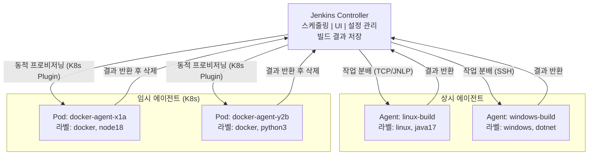

# Jenkins 아키텍처

---

> Jenkins의 실행 모델을 이해하는 첫 단계다. 사용법보다 구조를 먼저 본다.

## 1. Jenkins란 무엇인가

>  Jenkins는 소프트웨어 빌드, 테스트, 배포를 자동화하는 오픈소스 자동화 서버다. 
>
> - 2011년 Hudson에서 포크된 이후 1,800개 이상의 플러그인 생태계를 갖춘 CI/CD 도구의 표준 중 하나로 자리잡았다. 
> - 플러그인 하나하나가 외부 도구(Docker, Kubernetes, Slack, SonarQube 등)와의 통합 포인트가 되므로, 플러그인 생태계의 규모가 곧 Jenkins의 확장성을 의미한다.

GitHub Actions, GitLab CI 같은 SaaS CI/CD 서비스가 등장한 2020년대에도 Jenkins가 여전히 광범위하게 사용되는 이유는 세 가지다:

- **온프레미스 환경**: 금융, 의료, 공공 부문처럼 코드와 빌드 아티팩트가 외부 클라우드로 나가면 안 되는 환경에서는 Self-hosted CI/CD가 필수다. Jenkins는 자체 서버에서 완전히 통제할 수 있다.
- **레거시 시스템 통합**: 20년 된 빌드 스크립트, 독자적인 배포 프로세스, 사내 도구와의 연동이 이미 Jenkins 플러그인으로 구축되어 있는 조직이 많다. 이 연동을 다른 CI/CD로 마이그레이션하는 비용이 Jenkins를 유지하는 비용보다 큰 경우가 흔하다.
- **커스터마이징 자유도**: Jenkins는 Groovy 스크립트로 파이프라인의 모든 단계를 프로그래밍할 수 있다. SaaS CI/CD 서비스는 제공하는 기능의 범위 안에서만 작업해야 하지만, Jenkins는 필요하면 플러그인을 직접 만들 수도 있다.

도구 선택은 조직의 상황에 따라 결정되어야 한다. 아래 테이블은 주요 CI/CD 도구의 특성을 비교한 것이다. "최고의 도구"는 없으며, 각 도구가 빛나는 맥락이 다르다.

| 도구 | 타입 | 장점 | 단점 | 적합한 상황 |
|------|------|------|------|------------|
| **Jenkins** | Self-hosted | 무한 커스터마이징, 1800+ 플러그인, 온프레미스 완전 통제 | 운영 부담, 플러그인 호환성 이슈, 초기 설정 복잡 | 온프레미스, 복잡한 파이프라인, 레거시 통합 |
| **GitHub Actions** | SaaS | GitHub 저장소와 완벽 통합, 마켓플레이스 액션 풍부 | GitHub 종속, 복잡한 워크플로 디버깅 어려움 | GitHub 기반 프로젝트, 오픈소스, 스타트업 |
| **GitLab CI** | SaaS / Self-hosted | GitLab 올인원(SCM+CI/CD+레지스트리), 강력한 보안 스캔 | GitLab 종속, 대규모 인스턴스 성능 이슈 | GitLab 기반 조직, DevSecOps 중시 |
| **ArgoCD** | GitOps (CD만) | 선언적 배포, Kubernetes 네이티브, Git을 Single Source of Truth로 사용 | CI 기능 없음, Kubernetes 외 환경 미지원 | Kubernetes 환경, GitOps 전략 채택 조직 |


## 2. Controller-Agent 모델

> Jenkins를 하나의 서버에서 모든 것을 처리하도록 구성하면 세 가지 문제가 동시에 발생한다. 
>
> 1. **리소스 경쟁** 측면에서 Controller는 웹 UI 제공, 빌드 스케줄링, 설정 관리, 결과 저장 등 상시 운영 작업을 수행하는데, 여기에 빌드까지 직접 실행하면 CPU와 메모리를 빌드 프로세스가 잡아먹어 UI 응답이 느려지고 심하면 Jenkins 자체가 OOM으로 죽는다. 
> 2. **보안 위험** 측면에서는 빌드 스크립트가 Controller에서 직접 실행되면 Jenkins 설정 파일, 크레덴셜, 다른 잡의 빌드 기록에 직접 접근할 수 있다. 
> 3. **확장성 한계** 측면에서는 팀이 10개의 빌드를 동시에 돌려야 할 때 단일 서버로는 수직 확장밖에 방법이 없다.

2020년까지 Jenkins 공식 문서는 Master/Slave라는 용어를 사용했다. 이후 소프트웨어 업계 전반의 포용적 언어(Inclusive Language) 운동에 따라 Controller/Agent로 변경되었다. 기술적 의미는 동일하지만, 오래된 블로그나 문서에서는 여전히 Master/Slave를 사용하므로 둘 다 알아두어야 한다.

### 2-1. Controller

Controller는 Jenkins의 시스템 핵심이다. 직접 빌드를 실행하지 않더라도 해야 할 일이 많다:

- **스케줄링**: 빌드 요청이 들어오면 큐에 넣고, 조건에 맞는 Agent를 찾아 배정한다. 크론 트리거, 웹훅 트리거, 수동 트리거 모두 Controller가 받아 처리한다.
- **UI 제공**: Jenkins 웹 대시보드를 서빙한다. 빌드 상태 확인, 설정 변경, 로그 조회 등 모든 사용자 인터랙션이 Controller를 통한다.
- **설정 관리**: 잡 정의, 플러그인 설정, 시스템 설정을 `JENKINS_HOME`에 XML 파일로 저장하고 관리한다.
- **빌드 결과 저장**: Agent에서 빌드가 완료되면 결과(로그, 아티팩트, 테스트 리포트)를 Controller로 전송하여 영구 저장한다.

### 2-2. Agent

Agent는 실제 빌드를 실행하는 워커 노드다. Controller로부터 `agent.jar`(또는 `remoting.jar`)를 받아 실행하며, Controller와 지속적인 연결을 유지한다.



Agent는 두 가지 방식으로 운영된다:

- **상시 에이전트(Permanent Agent)**: 물리 서버나 VM에 설치하여 항상 실행 중인 에이전트다. 설정이 간단하지만 빌드가 없을 때도 리소스를 점유한다.
- **임시 에이전트(Ephemeral Agent)**: Docker 컨테이너나 Kubernetes Pod으로 빌드 시에만 생성되고, 빌드 완료 후 삭제된다. 리소스 효율이 높고, 빌드 환경이 매번 깨끗한 상태에서 시작되므로 재현성도 좋다.

K8s 환경이라고 해서 임시 에이전트만 사용하는 것은 아니다. 

- GPU 노드나 라이선스 소프트웨어처럼 초기화 비용이 큰 특수 환경에는 StatefulSet으로 Agent Pod를 상시 유지하고 JNLP로 연결할 수도 있다. 
- 다만 이 경우에는 탄력적 스케일링을 포기하게 되므로, 특별한 이유 없으면 임시 방식을 권장한다.


## 3. Executor와 빌드 실행

> **Executor**는 Agent 안에서 빌드를 실제로 실행하는 워커 스레드다. 
>
> - Agent 1개에 Executor가 2개라면 해당 Agent에서 동시에 2개의 빌드를 실행할 수 있다. 
> - 이 숫자가 Jenkins 전체의 동시 빌드 처리량을 결정한다.

Controller에도 Executor가 있을 수 있지만, 보안상 0으로 설정하는 것이 권장된다. 

- Controller에서 임의의 빌드 스크립트가 실행되면 Jenkins 설정 파일과 크레덴셜에 직접 접근할 수 있기 때문이다. 
- 실제 빌드는 항상 Agent에서만 실행되도록 구성해야 한다.

### Controller Executor가 0이면 Agent 없이는 빌드가 불가능한가?

**답: 그렇다.** 

- Controller Executor를 0으로 설정하면 빌드를 실행할 Executor가 아예 없으므로, Agent가 연결되어 있지 않으면 모든 빌드는 Queue에서 무한 대기한다. 
- 이것이 Jenkins를 처음 설치했을 때 혼란을 주는 지점이다. Jenkins는 기본적으로 Controller Executor를 2개로 설정해 놓기 때문에 Agent 없이도 빌드가 돌아간다. 
- 운영 환경에서 이 값을 0으로 바꾸는 순간, 반드시 Agent를 먼저 연결해야 한다.

정리하면 다음과 같다:

| Controller Executor | Agent 연결 | 빌드 가능 여부 |
|---------------------|-----------|--------------|
| 2 (기본값) | 없음 | Controller에서 직접 실행 (보안 위험) |
| 0 (권장) | 있음 | Agent에서 실행 (안전) |
| 0 (권장) | 없음 | 빌드 불가 — Queue 무한 대기 |

Executor 수를 결정할 때는 Agent 서버의 CPU 코어 수와 빌드의 CPU 집약도를 함께 고려해야 한다. 

- 4코어 서버에 Executor 8개를 설정하면 오히려 컨텍스트 스위칭 비용 때문에 전체 처리량이 줄어든다. 
- 일반적으로 Executor 수는 CPU 코어 수와 같게 시작하고, 빌드가 I/O 집약적이라면 1.5~2배까지 늘릴 수 있다.


## 4. JENKINS_HOME 디렉토리 구조

> `JENKINS_HOME`은 Jenkins가 모든 설정, 잡 정의, 빌드 기록, 크레덴셜을 저장하는 루트 디렉토리다. 
>
> - 본 경로는 `~/.jenkins`이며, 환경변수 `JENKINS_HOME`으로 재지정할 수 있다. 
> - 이 디렉토리를 이해하면 백업, 마이그레이션, JCasC(Jenkins Configuration as Code) 적용이 훨씬 명확해진다.

### JENKINS_HOME은 Controller에만 존재하는가?

`JENKINS_HOME`은 **Controller에만 존재**한다. Agent에는 `JENKINS_HOME`이 없다. Agent는 Controller로부터 빌드 명령을 받아 자신의 로컬 파일시스템에 `workspace/`만 생성하여 작업하고, 결과(로그, 아티팩트)를 Controller로 전송한다. 잡 정의, 플러그인, 크레덴셜, 빌드 기록은 모두 Controller의 `JENKINS_HOME`에 저장된다.

이것이 의미하는 바는 다음과 같다:

- **백업 대상은 Controller**다. Agent를 잃어도 다시 연결하면 되지만, Controller의 `JENKINS_HOME`을 잃으면 모든 설정과 이력이 사라진다.
- **Agent는 교체 가능**하다. 임시 에이전트(K8s Pod)가 매번 새로 생성되어도 문제가 없는 이유가 이것이다. 상태는 Controller에 있고, Agent는 실행만 담당한다.

디렉토리 구조는 다음과 같다:

```
$JENKINS_HOME/
├── config.xml                 # 시스템 전체 설정 (보안, 플러그인, 전역 환경변수)
├── jenkins.yaml               # JCasC 설정 파일 (→ 06 시리즈 참조)
├── jobs/                      # 잡 정의 + 빌드 기록
│   └── my-pipeline/
│       ├── config.xml         #   잡 정의
│       └── builds/            #   빌드 기록 (로그, 아티팩트)
│           ├── 1/
│           ├── 2/
│           └── lastSuccessfulBuild -> 2
├── nodes/                     # Agent 노드 설정
│   └── linux-build/
│       └── config.xml
├── secrets/                   # 크레덴셜 (암호화 저장)
│   ├── master.key             #   암호화 마스터 키
│   ├── hudson.util.Secret     #   암호화 시드
│   └── credentials.xml        #   크레덴셜 데이터
├── plugins/                   # 설치된 플러그인 (.jpi + 압축 해제)
│   ├── git.jpi
│   └── git/
├── workspace/                 # 빌드 작업 공간 (Controller 직접 실행 시)
├── logs/                      # Jenkins 시스템 로그
└── users/                     # 사용자 설정
```

주요 디렉토리의 역할은 다음과 같다:

- `config.xml`: Jenkins 전체 시스템 설정 파일이다. 보안 설정, 플러그인 설정, 전역 환경변수가 담긴다. JCasC는 이 파일을 코드로 관리하는 접근이다(→ 06 시리즈 참조).
- `jobs/`: 모든 잡의 정의와 빌드 기록이 저장된다. 잡 이름이 디렉토리명이 되고, 그 안에 `config.xml`(잡 정의)과 `builds/`(빌드 기록)가 있다.
- `nodes/`: Controller에 연결된 Agent 노드의 설정 파일이 저장된다. Agent를 추가하면 이 디렉토리에 항목이 생긴다.
- `secrets/`: 크레덴셜(API 키, 비밀번호, SSH 키 등)이 암호화되어 저장된다. 이 디렉토리는 백업 시 특별히 주의해야 한다. 암호화 키(`master.key`, `hudson.util.Secret`)도 여기 있으며, 이 키 없이는 크레덴셜을 복호화할 수 없다.
- `plugins/`: 설치된 플러그인의 `.jpi` 파일과 압축 해제된 디렉토리가 있다. Jenkins 재시작 시 이 디렉토리를 스캔하여 플러그인을 로드한다.
- `workspace/`: Controller에서 직접 실행되는 빌드(권장하지 않음)가 사용하는 작업 공간이다. Agent를 사용하면 각 Agent의 로컬 파일시스템에 workspace가 생성된다.

백업 전략으로는 `jobs/`(빌드 기록 포함)와 `secrets/`(암호화 키 포함)를 함께 백업해야 한다. `secrets/`만 없어도 기존 크레덴셜을 모두 재입력해야 하므로, 두 디렉토리는 반드시 쌍으로 관리한다.
