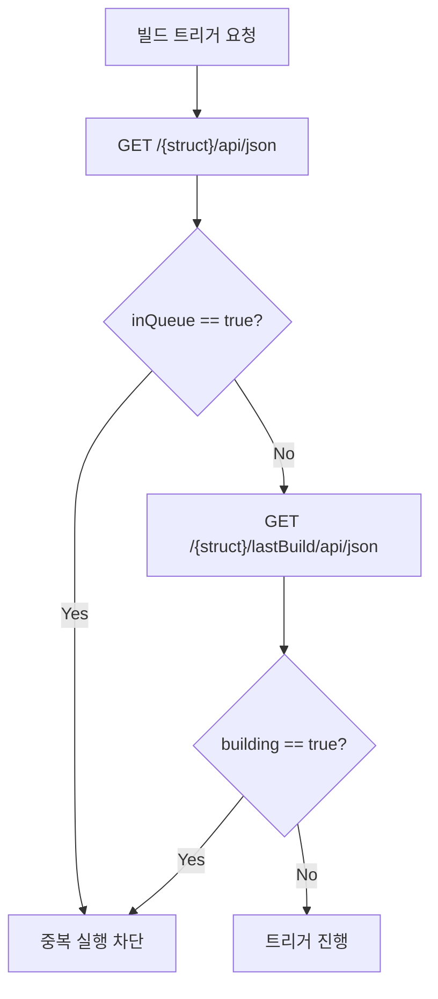

# 젠킨스 빌드 실행·큐 모델과 TPS 패턴 (2.222+)
---
> 이 문서는 Jenkins 빌드 실행과 큐 처리에서 TPS가 사용한 패턴과 현대 Jenkins 환경의 해석 포인트를 정리한다.
>
> - Pre-trigger Guard, `nextBuildNumber`, Quiet Period, controller 실행 해석, Queue 운영 판단을 다룬다.
> - K8s/VM 실행기 환경과 큐-빌드 전환 흐름은 `05-04b`에서 별도로 다룬다.
> - 큐 내부 메커니즘(상태 전이, maintain 루프, 실행 순서)은 `05-04c`에서 별도로 다룬다.
> - 순수 API 요청/응답 형식은 `05-04`에서 별도로 다룬다.

## 1. 빌드 실행 인증 모델 변화

> `05-04`의 예시는 현재 환경 기준으로 `ID/Password + crumb + cookie`를 사용한다. Jenkins 2.222+의 API Token 환경에서는 이 흐름이 더 단순해질 수 있다.

현재 문서 체계는 두 환경을 구분해서 본다:

- 현재 운영/실습 환경: `Basic Auth(ID/Password) + crumb + cookie`
- 현대화 목표 환경: `Basic Auth(ID/API Token)` 중심

API Token 환경에서는 `build`, `buildWithParameters`, `stop` 같은 POST에서 crumb/cookie를 제거할 수 있는 경우가 많다.

```bash
# 현재 환경
curl -X POST -b cookies.txt \
  -u admin:password \
  -H "Jenkins-Crumb: $CRUMB" \
  "https://jenkins.example.com/job/my-pipeline/build"

# 토큰 환경
curl -X POST \
  -u admin:apiToken \
  "https://jenkins.example.com/job/my-pipeline/build"
```

다만 실제 면제 여부는 인스턴스 설정과 보안 정책에 따라 달라질 수 있으므로, TPS에서는 환경 메타데이터로 인증 모델을 분리하는 편이 안전하다.


## 2. TPS의 Pre-trigger Guard

> Jenkins는 같은 Job에 대해 중복 빌드 트리거를 허용한다. TPS는 트리거 전에 큐 대기와 실행 중 여부를 먼저 확인해서 중복 실행을 막는다.

### 2-1. 검사 대상

Pre-trigger Guard는 두 가지 상태를 확인한다:

- 큐 대기 여부: `GET /{pipelineStruct}/api/json`의 `inQueue`
- 실행 중 여부: `GET /{pipelineStruct}/lastBuild/api/json`의 `building`

두 값이 모두 `false`일 때만 트리거를 허용한다. 하나라도 `true`면 `JENKINS_IN_PROGRESS_ERROR`로 처리한다.

### 2-2. 판단 흐름



### 2-3. 왜 Jenkins 옵션만으로 충분하지 않은가

Jenkins에도 `disableConcurrentBuilds()`나 "Abort previous builds" 같은 설정이 있다. 그래도 TPS가 별도 Guard를 두는 이유는 다음과 같다:

- Jenkins 내부 옵션은 큐 등록 이후에 작동하는 경우가 많다.
- TPS는 큐에 넣기 전 단계에서 차단해 불필요한 큐 등록 자체를 줄인다.
- UI에 즉시 "이미 실행 중" 메시지를 돌려주기 쉽다.


## 3. `nextBuildNumber` 트릭

> Jenkins 빌드 트리거는 비동기다. TPS는 트리거 직전 `nextBuildNumber`를 읽어 방금 시작될 빌드 번호를 미리 추정하는 방식을 사용해왔다.

`GET /{pipelineStruct}/api/json` 응답에는 `nextBuildNumber`가 포함된다.

```json
{
  "name": "TEST",
  "buildable": true,
  "inQueue": false,
  "nextBuildNumber": 9
}
```

이 값을 트리거 전에 저장해두면 큐 폴링 없이도 바로 `/{pipelineStruct}/9/api/json`을 조회할 수 있다.

다만 이 방식은 절대 보장 수단은 아니다. 동시에 다른 사용자가 같은 Job을 트리거하면 번호 경쟁이 생길 수 있다. 그래서 일반화된 API 문서에서는 `Location -> queueId -> executable.number` 흐름을 기본으로 두고, `nextBuildNumber`는 TPS 내부 최적화 패턴으로만 설명하는 편이 낫다.


## 4. `agent any`와 controller 실행 해석

> Jenkins가 Kubernetes에 배포돼 있어도 모든 빌드가 자동으로 K8s 동적 Pod에서 실행되는 것은 아니다.

`agent any`는 "사용 가능한 아무 executor나 하나 사용"이라는 뜻이다. 이 구문만으로는 Kubernetes Pod를 강제하지 않는다.

다음 조건이면 controller의 built-in node에서 실행될 수 있다:

- controller에 executor가 열려 있다.
- Kubernetes plugin label이나 `agent { kubernetes { ... } }`를 명시하지 않았다.
- 정적 VM agent나 built-in node가 먼저 선택 가능하다.

즉 "Jenkins가 K8s 위에 있다"와 "빌드가 K8s 동적 Pod에서 돈다"는 다른 문제다. 

- 판별 기준은 Jenkins controller의 배포 위치가 아니라 에이전트 프로비저닝 방식이다.

정리하면 다음과 같다:

| 상황 | 해석 |
|------|------|
| Jenkins가 K8s Pod로 배포됨 | controller 배포 위치 설명일 뿐이다 |
| `agent any`로 빌드 성공 | 사용 가능한 executor에서 실행됐다는 뜻이다 |
| 동적 agent가 모두 죽어 있는데 빌드 성공 | controller built-in node 또는 다른 정적 agent에서 실행됐을 가능성이 높다 |
| K8s Pod 실행을 강제하고 싶음 | `agent { kubernetes { ... } }` 또는 K8s label을 명시해야 한다 |


## 5. 운영 단순화 관점: Queue를 어디까지 믿고 무엇을 추적할 것인가

> 운영 관점에서는 "정확한 실행기 추적"보다 "중복 실행을 얼마나 단순하게 막을 것인가"가 더 중요할 수 있다.

### 5-1. Queue 지속성에 대한 현실적 해석

Jenkins Queue는 일반적으로 정상 종료·재시작 시 복원되지만, 장애 상황의 완전한 영속 저장소로 보기는 어렵다.

근거는 다음과 같다:

- Jenkins 공식 플러그인 페이지에는 예전 `Persistent Build Queue` 플러그인의 기능이 이제 Jenkins core에 내장됐다고 적혀 있다.
- Jenkins Queue Javadoc에도 `save()`와 `load()`가 있고, queue 내용을 디스크에 저장하고 다시 불러온다고 설명한다.
- 다만 Queue 저장은 변경 즉시 완전 동기 저장이 아니라, `Queue.Saver`가 "가까운 시점에 저장"하도록 스케줄하는 구조다.

급작스러운 프로세스 종료, Pod 강제 종료, 저장 직전 장애 같은 경우에는 최근 Queue 변경분이 손실될 수 있다. 실제로 Jenkins `2.332.2`에는 재시작 시 build queue가 비워지는 회귀가 있었고, Jenkins 이슈 트래커상 `2.343`에서 수정됐다.

### 5-2. 정확한 실행기 추적은 가능하더라도 운영 비용이 높다

특히 K8s 동적 에이전트에서는 다음 때문에 해석 비용이 커진다:

- Pod가 없을 때는 executor가 `0`으로 보일 수 있다.
- Pod가 생성됐지만 agent 연결 전이면 `offline=true`로 흔들린다.
- 빌드가 끝나면 Pod와 executor가 곧바로 사라진다.
- 같은 빌드라도 조회 시점에 따라 `/computer/api/json` 결과가 달라진다.

즉 이론적으로는 `queue + computer + label + cloud 설정 + Pod 생명주기`를 합쳐 해석할 수 있다. 하지만 dispatch 제어 목적이라면 이 정도 복잡도는 과한 경우가 많다.

### 5-3. "전역 Queue가 비었는지만 보고 쏜다"는 전략의 장단점

이 전략은 단순하지만 한계가 있다:

| 관점 | 장점 | 단점 |
|------|------|------|
| 구현 | 매우 단순 | 다른 팀 Job 때문에 내 dispatch를 막을 수 있음 |
| 에이전트 유형 | K8s/VM 차이를 신경 안 써도 됨 | Queue 비어 있어도 해당 Job이 이미 실행 중일 수 있음 |
| 신호 품질 | "Jenkins가 한가한가"는 보여줌 | "이 Job을 지금 보내도 되는가"는 정확히 안 보여줌 |

단일 용도의 전용 Jenkins라면 전역 Queue 체크가 어느 정도 의미가 있다. 하지만 여러 Job이 섞여 있는 Jenkins라면 신호 품질이 낮다.

### 5-4. 현실적인 최소안: 실행기 추적 대신 Job 단위 Pre-check 1회

현재 문서 흐름과 TPS 요구를 같이 보면, 가장 현실적인 최소안은 이쪽이다:

- 전역 executor 추적은 하지 않는다.
- 전역 Queue 빈 상태만으로 dispatch 여부를 결정하지 않는다.
- 대신 대상 Job에 대해 가벼운 GET 1회만 하고 `inQueue`와 `lastBuild.building`만 본다.

예시는 다음과 같다:

```bash
curl -k -sS -u "${JENKINS_USER}:${JENKINS_PASS}" \
  "${JENKINS_URL}${PIPELINE_STRUCT}/api/json?tree=name,buildable,inQueue,nextBuildNumber,lastBuild[number,building,result,url]" \
  | jq '{name, buildable, inQueue, nextBuildNumber, lastBuild}'
```

이 방식의 장점은 다음과 같다:

- API 호출은 Job당 1회다.
- 전역 `/queue/api/json`보다 대상 Job 중심으로 본다.
- K8s/VM executor 차이를 몰라도 중복 실행 방지에 필요한 핵심 값은 얻는다.
- 기존 TPS의 `Pre-trigger Guard` 철학과도 맞다.

### 5-5. API 호출 수를 더 줄이고 싶을 때의 판단

dispatch당 Jenkins API 호출을 최소화하고 싶다면 다음 전략 중 선택한다:

| 전략 | 설명 | 적합 환경 |
|------|------|-----------|
| 대상 Job `api/json` 1회 조회 후 트리거 | 정확도와 단순성의 균형이 가장 좋음 | 여러 Job이 섞인 Jenkins (권장) |
| Job 설정에서 동시 실행 금지 후 결과만 추적 | 더 단순하지만 Job 설정 변경 필요 | Job 설정 권한이 있을 때 |
| 전역 Queue만 보고 트리거 | 가장 거칠지만 구현 최소 | 단일 용도 전용 Jenkins에서만 |

정말 API 비용이 부담되면, dispatch 직전에만 1회 호출하고 executor 추적은 생략하는 편이 좋다. "정확한 실행기 추적"을 포기하는 것은 현실적이지만, "전역 Queue만 본다"보다 "대상 Job 상태만 1회 본다"가 더 좋은 타협점이다.


## 6. 동일 Job 중복 트리거와 Queue 병합

> 같은 Job에 대해 짧은 간격으로 여러 번 `build`를 호출했는데 `Location`이 계속 같은 `queue/item/{id}`로 보일 수 있다. 이건 비정상이 아니라 Jenkins Queue 병합 동작일 가능성이 높다.

예를 들어 다음처럼 세 번 연속 호출했는데:

- 1차 호출: `Location: .../queue/item/181/`
- 2차 호출: `Location: .../queue/item/181/`
- 3차 호출: `Location: .../queue/item/181/`

결과적으로 실제 실행은 1번만 보일 수 있다.

### 6-1. 왜 같은 `queueId`가 반복되는가

Jenkins Queue Javadoc 기준으로 `schedule2(...)`는 항상 새 queue item을 만드는 것이 아니다.

- 새 item을 만들 수도 있다.
- 이미 대기 중인 같은 task가 있으면 existing item에 merge될 수도 있다.
- 정책상 거부될 수도 있다.

즉 같은 Job이 아직 Queue 안에서 대기 중일 때 같은 요청이 다시 오면, Jenkins는 "이미 같은 대기 요청이 있다"고 보고 기존 item을 재사용할 수 있다.

### 6-2. Quiet Period가 있으면 더 잘 보인다

이 현상은 Quiet Period가 있을 때 더 잘 드러난다.

- Job 또는 전역 Quiet Period 때문에 item이 `WaitingItem` 상태로 잠깐 머문다.
- 그 짧은 시간 안에 같은 Job 요청이 또 들어오면 새 item 대신 기존 item에 붙을 수 있다.
- 그래서 사용자는 "3번 호출했는데 왜 queue item은 1개지?"처럼 보게 된다.

즉 같은 `Location` 반복은 "실패"보다 "Queue dedupe/merge" 쪽으로 먼저 해석하는 편이 맞다.

### 6-3. 실무 해석

실무에서는 다음처럼 보면 된다:

- `HTTP 201`이 여러 번 나왔는데 `Location`이 계속 같다면 같은 queue item 병합 가능성이 높다.
- 이 경우 Jenkins가 실제 실행 의도를 잃은 것이 아니라, 중복 요청을 하나의 대기 item으로 정리했을 수 있다.
- 특히 같은 Job, 같은 파라미터, 매우 짧은 간격 호출에서 자주 보인다.

### 6-4. 어떻게 확인하는가

다음 API로 실제 queue item 상태를 보면 된다:

```bash
curl -k -sS -u "${JENKINS_USER}:${JENKINS_PASS}" \
  "${JENKINS_URL}/queue/item/${QUEUE_ID}/api/json" \
  | jq '{id, why, cancelled, stuck, task: .task.name, executable}'
```

또한 Job 메타데이터에서 `quietPeriod`나 `inQueue`를 같이 볼 수도 있다:

```bash
curl -k -sS -u "${JENKINS_USER}:${JENKINS_PASS}" \
  "${JENKINS_URL}${PIPELINE_SLEEP10_STRUCT}/api/json?tree=name,inQueue,quietPeriod"
```

### 6-5. 이 현상을 줄이려면

중복 병합을 덜 보게 하려면 보통 다음 방법을 쓴다:

- `build?delay=0sec`로 Quiet Period를 줄인다.
- 첫 번째 요청이 실제 실행에 들어간 뒤 두 번째 요청을 보낸다.
- 파라미터 Job이라면 서로 다른 파라미터로 보낸다.
- 애초에 TPS 쪽에서 중복 트리거를 먼저 막는다.


## 7. Quiet Period와 `delay=0sec`

> Jenkins 빌드 트리거는 기본적으로 Quiet Period를 거칠 수 있다. TPS처럼 API가 명시적으로 트리거하는 환경에서는 이 지연이 불필요할 때가 있다.

토큰 기반 단순 호출 예시는 다음과 같다:

```bash
curl -X POST \
  -u admin:apiToken \
  "https://jenkins.example.com/job/my-pipeline/build?delay=0sec"
```

`delay=0sec`를 주면 요청 단위로 Quiet Period를 무시할 수 있다. 다만 현재 비밀번호 + crumb 실습 문서에서는 먼저 표준 호출을 기준으로 설명하고, 이 옵션은 운영 최적화 포인트로만 분리해두는 편이 읽기 쉽다.


## 8. 전체 흐름 재정리

> TPS 기준 흐름은 인증 모델에 따라 약간 달라지지만, 큰 구조는 같다.

현재 환경 기준:

1. `05-02`에서 인증과 crumb/cookie를 준비한다.
2. `05-04`의 `build` 또는 `buildWithParameters`를 호출한다.
3. `Location` 헤더에서 `queueId`를 얻는다.
4. `/queue/item/{queueId}/api/json`으로 `executable.number`를 확인한다.
5. 이후 상태 추적은 `05-05`로 이어진다.

토큰 환경에서는 1단계가 더 단순해질 수 있다.


## 9. 관련 문서

- `05-02. 젠킨스 인증 API 스펙 (ID-Password + Crumb).md`
- `05-02a. 젠킨스 인증 모델과 TPS 패턴 (2.222+).md`
- `05-04. 젠킨스 빌드 실행·큐 API 스펙.md`
- `05-04b. 젠킨스 큐-빌드 전환 흐름과 실행기 환경.md`
- `05-04c. 젠킨스 큐 내부 흐름과 실행 순서.md`
- `05-05. 젠킨스 빌드 상태 추적 API 스펙.md`


## 10. 참고 링크

- Jenkins Remote Access API
- Persistent Build Queue plugin page
- Jenkins Queue Javadoc
- Jenkins ScheduleResult Javadoc
- JENKINS-68254
