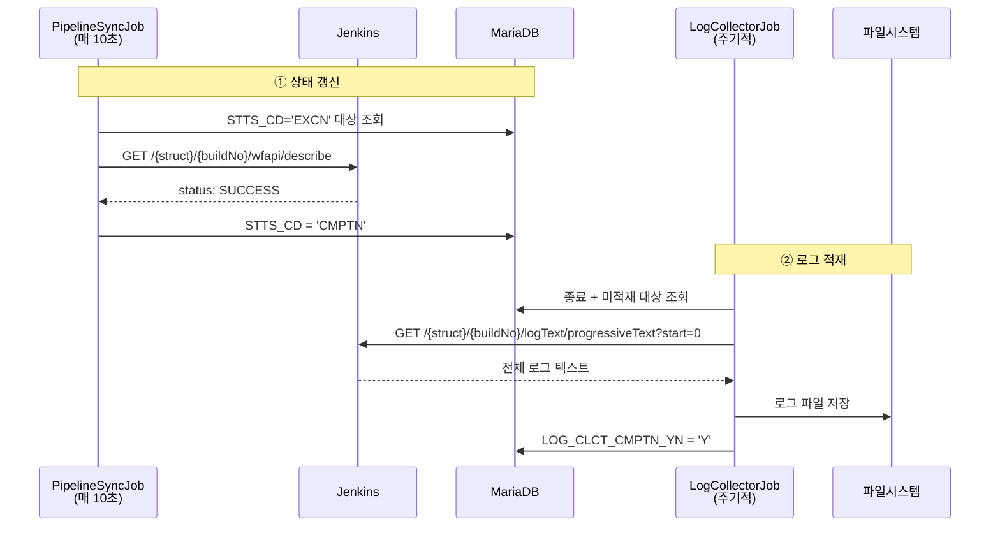
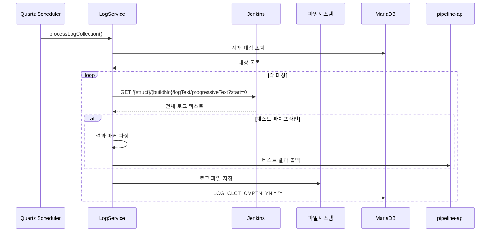

# 젠킨스 API 로그 조회 현대화
---
> `05-06` 문서는 순수 API 스펙만 다룬다. 이 문서는 로그 인코딩 표준화, Blue Ocean 지원 현황, crumb 영향 범위 같은 현대 Jenkins 관점과, TPS 로그 적재 패턴을 별도로 정리한다.

## 1. 이 문서의 범위

> 이 문서는 로그 API 자체보다 "최근 Jenkins에서 무엇이 달라졌는가"를 설명한다.

| 주제 | 이전 관점 | 현재 관점 |
|------|------|------|
| 로그 인코딩 | 시스템 인코딩 의존 | UTF-8 표준화 |
| Blue Ocean | UI와 REST API를 함께 쓰는 기본 선택지처럼 보였음 | UI는 유지보수 모드, REST API는 제한적으로 유지 |
| crumb 영향 | GET/POST를 함께 볼 때 혼동되기 쉬웠음 | 로그 조회 GET은 무관, 테스트 콜백 POST만 인증 방식 영향 |
| 대체 경로 | Blue Ocean 의존이 더 강했음 | `wfapi`와 코어 API 조합으로 더 많이 대체 가능 |
| TPS 로그 적재 | API 스펙 문서 안에 같이 섞이기 쉬웠음 | 구현 패턴 문서에서 별도로 설명 |


## 2. 로그 인코딩 UTF-8 표준화 (2.462+)

> Jenkins 2.462 이전에는 콘솔 로그의 인코딩이 시스템 기본 인코딩에 의존했다. 
>
> - Linux에서는 대부분 UTF-8이지만, Windows나 일부 컨테이너 환경에서는 다른 인코딩이 적용되어 한글이 깨지는 문제가 발생할 수 있었다.

2.462부터 Jenkins는 콘솔 로그 출력을 UTF-8로 표준화했다. 비교하면 다음과 같다:

| API | 2.462 이전 | 2.462+ | 실무 영향 |
|------|------|------|------|
| `consoleText` | 시스템 인코딩 | UTF-8 보장 | 전체 로그 저장 시 한글 깨짐 위험 감소 |
| `progressiveText` | 시스템 인코딩 | UTF-8 보장 | 실시간 로그 tail 시 인코딩 불일치 감소 |
| Blue Ocean `/log` | 시스템 인코딩 | UTF-8 보장 | 스텝/노드 로그 드릴다운 결과도 일관적 |

TPS의 ppln-logging-api에서 `LogHandlerImpl`이 `Files.newBufferedWriter()`로 UTF-8 인코딩을 명시하여 저장하고 있었기 때문에, Jenkins에서 UTF-8이 아닌 인코딩으로 로그가 내려온 경우 인코딩 불일치가 발생할 수 있었다. 2.462 이후에는 양쪽 모두 UTF-8이므로 이 문제가 크게 줄어든다.

즉 이전과 지금의 차이는 다음처럼 정리할 수 있다:

- 예전
  - Jenkins 출력 인코딩이 실행 환경에 따라 흔들릴 수 있었다.
  - 저장 쪽을 UTF-8로 고정해도 입력이 다른 인코딩이면 깨질 수 있었다.
- 지금
  - Jenkins 출력과 저장 인코딩이 모두 UTF-8로 맞춰지기 쉬워졌다.
  - 로그 적재 파이프라인에서 인코딩 변환 이슈를 따로 의심할 일이 줄었다.


## 3. Blue Ocean REST API 지원 현황

> `05-06`의 `## 5. Blue Ocean API 드릴다운`에서 설명한 nodes → steps → log 흐름은 여전히 유효하다. 
>
> - 다만 "UI 지원 중단"과 "REST API 즉시 폐기"를 같은 뜻으로 보면 안 된다.

비교하면 다음과 같다:

| 항목 | 예전 인식 | 현재 인식 |
|------|------|------|
| Blue Ocean UI | Jenkins 파이프라인 시각화의 주력 UI처럼 보였다 | 2022년 이후 유지보수 모드다 |
| `/blue/rest/` API | UI와 강하게 묶인 API처럼 보였다 | UI와 별개로 일부 시각화/보조 용도에서 여전히 살아 있다 |
| 백엔드 의존성 | 상태 조회까지 Blue Ocean 쪽으로 기울기 쉬웠다 | 신규 백엔드는 코어 API + `wfapi` 우선이 더 자연스럽다 |

다만 장기적으로는 코어 Jenkins의 `wfapi` 엔드포인트로 대체하는 방향이 권장된다:

| 용도 | Blue Ocean API | 코어/wfapi 대안 | 대체 수준 |
|------|------|------|------|
| 스테이지별 상태 | `GET /blue/.../nodes/` | `GET /{struct}/{build}/wfapi/describe` | 대부분 대체 가능 |
| 스테이지 로그 | `GET /blue/.../nodes/{id}/log/` | `GET /{struct}/{build}/execution/node/{id}/wfapi/log` | 대부분 대체 가능 |
| 스텝별 드릴다운 | `GET /blue/.../nodes/{id}/steps/` | 직접 대체 없음 | Blue Ocean API 필요 |
| 스텝 로그 | `GET /blue/.../nodes/{id}/steps/{stepId}/log` | 직접 대체 없음 | Blue Ocean API 필요 |

스텝 레벨 드릴다운이 필요한 경우에는 Blue Ocean REST API를 계속 사용해야 한다. TPS의 ppln-logging-api가 경로 A인 전체 로그 수집을 주로 사용하므로, Blue Ocean API 의존도는 낮은 편이다.

즉 현재 판단은 이렇게 정리하는 편이 맞다:

- stage 상태와 stage 로그는 코어 API + `wfapi`로 많이 대체 가능하다.
- step 단위 상세 추적은 아직 Blue Ocean REST API 쪽이 더 풍부하다.
- 따라서 Blue Ocean은 "완전 제거"보다 "필요한 범위만 축소 유지"가 더 현실적이다.


## 4. POST 기반 연동의 crumb 면제

> `05-06`의 로그 조회 API는 대부분 GET이므로 crumb이 원래 불필요하다. 
>
> - 그러나 로그 적재 흐름에서 테스트 결과 콜백(`05-06`의 `### 6.6 테스트 파이프라인 결과 파싱`)은 Feign Client를 통한 POST 호출이다.

이 차이를 표로 정리하면 다음과 같다:

| 구분 | 예시 | HTTP 메서드 | crumb 영향 |
|------|------|------|------|
| 전체 로그 조회 | `consoleText` | GET | 원래 없음 |
| 증분 로그 조회 | `progressiveText` | GET | 원래 없음 |
| stage/node 로그 조회 | `wfapi/log` | GET | 원래 없음 |
| Blue Ocean 로그 조회 | `/blue/rest/.../log` | GET | 원래 없음 |
| 테스트 결과 콜백 | `endJunitTest()`, `endAnalysisTest()` | POST | 인증 방식에 따라 영향 |

즉 GET 로그 조회 자체는 2.222 이후에도 거의 변함이 없다. 달라지는 것은 POST 기반 연동이다.

- ID/Password + crumb 환경
  - 테스트 결과 콜백 POST에 crumb이 필요할 수 있다.
- API Token 환경
  - 이 POST 호출들도 crumb 면제 대상이 될 수 있다.

따라서 "로그 조회 현대화"에서 인증 영향은 주로 조회 API가 아니라 적재 후속 POST 콜백에 걸린다고 보는 편이 정확하다.


## 5. 버전별 변경 요약

| 버전/시점 | 변경 | 이전과 비교해 달라진 점 | 로그 조회 영향 |
|------|------|------|------|
| 2.222 (2020) | API Token crumb 면제 | GET/POST를 같은 기준으로 볼 필요가 줄었다 | 로그 조회 GET은 무관. 테스트 콜백 POST에서 crumb 부담 감소 |
| Blue Ocean Plugin (2022~) | UI deprecated | UI와 REST API를 같은 수명주기로 보면 안 되게 됐다 | `/blue/rest/`는 남아 있지만 신규 핵심 의존성으로 삼기엔 부담이 커졌다 |
| 2.462 (2024) | 로그 인코딩 UTF-8 표준화 | 시스템 인코딩 편차를 크게 의심하지 않아도 된다 | `consoleText`, `progressiveText`, Blue Ocean `/log`의 한글 깨짐 위험 감소 |

즉 최근 흐름을 한 줄로 요약하면 다음과 같다:

- 조회 경로는 GET 중심이라 인증 변화 영향이 작다.
- Blue Ocean은 완전 폐기보다 선택적 축소 대상으로 본다.
- 인코딩은 UTF-8 표준화로 운영 리스크가 줄었다.


## 6. TPS 로그 적재 패턴의 범위

`05-06`이 순수 API 스펙이라면, TPS 쪽에서는 그 API를 어떻게 조합해 쓰는지가 별도 문서 범위가 된다. 여기서 다루는 범위는 다음과 같다:

- 완료 build의 전체 로그를 한 번에 수집하는 방식
- 상태 갱신과 로그 적재의 스케줄러 분리
- DB 적재 대상 선택 조건
- 파일 저장 구조와 읽기 전략
- 테스트 결과 파싱과 후속 콜백
- `pipeline-api`와 `ppln-logging-api` 역할 분리


## 7. 상태 갱신과 로그 적재의 분리

>  TPS에서는 로그 수집을 실행 중에 계속 붙잡고 있지 않는다. 먼저 상태 추적 계층이 빌드 종료를 확인하고, 그 다음 로그 적재 계층이 완료된 build의 전체 로그를 한 번에 가져오는 구조다.



두 Job의 역할을 비교하면 다음과 같다:

| Job | 주기 | Jenkins API | DB 갱신 필드 |
|------|------|------|------|
| `PipelineSyncJob` | 10초 | `GET /{struct}/{buildNo}/wfapi/describe` | `STTS_CD` |
| `LogCollectorV2Job` | 설정값 | `GET /{struct}/{buildNo}/logText/progressiveText?start=0` | `LOG_CLCT_CMPTN_YN` |


## 8. 적재 대상 선택과 전체 흐름

`LogCollectorV2Job`은 모든 build를 다 훑지 않고, 이미 종료됐지만 아직 로그를 저장하지 않은 파이프라인만 고른다. 조회 조건은 다음과 같다:

```sql
WHERE A.STTS_CD NOT IN ('WAIT', 'RTRCN', 'EXCN', 'SKIP')
  AND A.LOG_CLCT_CMPTN_YN = 'N'
  AND B.INOUT_SE = 'IN'
```

조건 해석은 다음과 같다:

- `STTS_CD NOT IN (...)`: 대기, 취소, 실행 중, 스킵 상태는 제외
- `LOG_CLCT_CMPTN_YN = 'N'`: 아직 로그를 적재하지 않은 건만 선택
- `INOUT_SE = 'IN'`: 내부 파이프라인만 선택

실제 적재 흐름은 다음과 같다:




## 9. 파일 저장 구조와 읽기 전략

TPS는 Jenkins에서 가져온 전체 로그를 다음 구조로 저장한다:

```text
{pipeline.middleware.jenkins.logPath}/
  └── pipeline/
      └── {taskCd}/
          └── {envrnCd}/
              └── {bizNm}/
                  └── {pplnNo}_{excnHstryNo}_0
```

파일 저장 쪽 구현 특성은 다음과 같다:

- 파일명은 `{파이프라인번호}_{실행이력번호}_0`
- 확장자는 두지 않음
- `LogHandlerImpl`이 UTF-8로 기록
- 부모 디렉토리가 없으면 자동 생성
- 동일 파일이 있으면 덮어씀

읽기 전략은 파일 크기에 따라 나뉜다:

| 파일 크기 | 방식 | 이유 |
|------|------|------|
| 1MB 미만 | `Files.readString()` | 단순하고 빠름 |
| 1MB 이상 | `BufferedReader` 스트리밍 | 메모리 사용량 절감 |


## 10. 테스트 결과 파싱과 모듈 역할 분리

테스트 파이프라인은 로그 적재 시 추가 후처리가 있다. Jenkins 로그 안에 아래 마커가 있으면, TPS가 이 값을 파싱해 후속 API를 호출한다:

```text
##@#UNIT_TEST_RESULT##@#{total}#{success}#{failed}#{failedCheck}##@#
```

콜백은 다음처럼 나뉜다:

| 테스트 유형 | 콜백 메서드 | 전달 내용 |
|------|------|------|
| 단위 테스트 | `endJunitTest()` | 전체/성공/실패 건수 |
| SonarQube | `endAnalysisTest()` | 분석 완료 상태 |
| 수동 분석 | `endManualAnalysisTest()` | 분석 완료 상태 |

모듈 역할도 분리돼 있다:

| 클래스/모듈 | 역할 |
|------|------|
| `LogCollectorV2Job` | Quartz 스케줄러 진입점 |
| `LogService` | 로그 수집 오케스트레이션 |
| `LogWriterImpl` | Jenkins 로그 수집 + 테스트 콜백 |
| `LogHandlerImpl` | 파일시스템 I/O |
| `RealTimeLogHandler` | 실시간 WebSocket 로그 스트리밍 |

- `pipeline-api`의 `RealTimeLogHandler`는 실행 중 로그를 스트리밍하지만 영구 저장은 하지 않는다. 영구 저장은 `ppln-logging-api`가 맡는다. 즉 TPS에서는 "실시간 표시"와 "종료 후 적재"를 분리해서 운영한다.


## 11. 참고 링크

- `05-06. 젠킨스 API 로그 조회와 적재.md`
- `05-02a. 젠킨스 인증 모델과 TPS 패턴 (2.222+).md`
- `05-05a. 젠킨스 빌드 상태 추적 모델과 TPS 패턴 (2.222+).md`
- [Pipeline: REST API Plugin](https://plugins.jenkins.io/pipeline-rest-api/)
