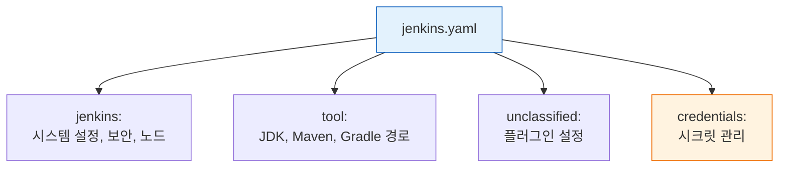

# JCasC 구조와 설정

---

> Jenkins 설정도 코드처럼 관리해야 하는 이유와 방법을 다룬다.


## 1. UI 설정의 한계와 Configuration as Code

> 클릭으로 구성한 Jenkins는 누가 무엇을 바꿨는지 기록되지 않는다. JCasC는 이 문제를 YAML 파일 하나로 해결한다.

Jenkins를 처음 구성하면 Manage Jenkins 화면에서 클릭으로 모든 설정을 마친다. 

- 이 방식의 문제는 "누가 언제 무엇을 바꿨는지"가 기록되지 않는다는 점이다. 팀원 중 누군가가 플러그인 설정을 변경하거나 보안 정책을 수정해도 Jenkins 자체 로그에는 흔적이 남지 않는다. 
- 운영 환경과 동일한 Jenkins를 다른 서버에 재현하려면 UI를 처음부터 다시 클릭해야 한다.

**Configuration as Code(JCasC)** 플러그인은 이 문제를 `jenkins.yaml` 파일 하나로 해결한다. 

- Jenkins의 모든 시스템 설정을 YAML로 선언하면, 버전 관리·리뷰·롤백이 가능해진다. 설정 변경은 YAML 파일을 수정하고 reload하는 것으로 대체된다. 재현 가능한 Jenkins 환경이 목표라면 JCasC는 선택이 아니라 필수다.


## 2. jenkins.yaml 구조

> `jenkins.yaml`은 네 섹션으로 구성되며, 각 섹션은 플러그인 스키마에 의해 키가 결정된다.

`jenkins.yaml`은 크게 네 섹션으로 구성된다. 각 섹션은 Jenkins 설정의 특정 영역을 담당한다:

1. `jenkins`: Controller 자체 설정 — 실행자 수, 보안 영역(Security Realm), 인가 전략(Authorization Strategy)
2.  `tool`: JDK, Maven, Gradle 같은 빌드 도구 자동 설치 설정
3. `unclassified`: 플러그인별 설정 — GitHub 서버, Slack 알림, Pipeline 전역 옵션 등 플러그인이 추가하는 설정 항목
4. `credentials`: Jenkins Credential Store에 등록할 자격증명 (암호화 참조 또는 환경변수 치환 방식)



- 각 섹션의 키 이름은 고정된 규칙이 아니라 플러그인이 제공하는 스키마에 의해 결정된다. 플러그인이 업데이트되면 스키마 키가 바뀔 수 있다. 
- JCasC는 `/configuration-as-code/schema` 엔드포인트로 현재 설치된 플러그인 기준의 YAML 스키마를 JSON으로 제공하므로, 처음 설정을 작성할 때 이 스키마를 참조하면 오타나 구조 오류를 줄일 수 있다.

기본적인 `jenkins.yaml` 예시는 다음과 같다:

```yaml
jenkins:
  numExecutors: 2
  securityRealm:
    local:
      allowsSignup: false
      users:
        - id: "${JENKINS_ADMIN_ID}"
          password: "${JENKINS_ADMIN_PASSWORD}"
  authorizationStrategy:
    loggedInUsersCanDoAnything:
      allowAnonymousRead: false

tool:
  maven:
    installations:
      - name: "Maven 3.9"
        properties:
          - installSource:
              installers:
                - maven:
                    id: "3.9.6"

unclassified:
  location:
    url: "http://34.47.74.0:31080/"

credentials:
  system:
    domainCredentials:
      - credentials:
          - usernamePassword:
              id: "github-creds"
              username: "${GITHUB_USER}"
              password: "${GITHUB_TOKEN}"
              scope: GLOBAL
```

- 비밀값은 `${ENV_VAR}` 형식으로 환경변수를 참조한다. 파일에 평문 비밀값을 넣으면 Git에 노출될 위험이 있으므로, 환경변수 치환은 선택이 아니라 필수다. 
- `${JENKINS_ADMIN_ID}`, `${JENKINS_ADMIN_PASSWORD}`, `${GITHUB_TOKEN}` 모두 같은 패턴을 따른다.


## 3. 설정 export와 reload

> 기존 Jenkins를 YAML로 추출하고, 수정 후 재시작 없이 반영하는 절차를 다룬다.

현재 Jenkins의 설정을 `jenkins.yaml`으로 추출하는 방법은 두 가지다:

- UI: Manage Jenkins > Configuration as Code > Download Configuration 클릭
- API: 아래 curl 명령어 사용

> 실습 환경 설정은 `05-00. 젠킨스 API 실습 환경 설정` 참조

```bash
# 현재 설정 export
curl -sSf -u "${JENKINS_USER}:${JENKINS_PASS}" \
  "${JENKINS_URL}/configuration-as-code/export"
```

`jenkins.yaml`을 수정한 뒤에는 Jenkins를 재시작하지 않고 reload할 수 있다:

```bash
# 설정 reload (재시작 없이 적용)
curl -sSf -X POST -u "${JENKINS_USER}:${JENKINS_PASS}" \
  "${JENKINS_URL}/configuration-as-code/reload"
```

JCasC를 처음 도입할 때 활용하는 전형적인 절차는 다음과 같다:

1. 기존 Jenkins를 UI로 구성한 뒤 export API로 현재 설정을 추출한다.
2. 추출된 YAML에서 비밀값을 환경변수 참조(`${VAR}`)로 교체한다.
3. 불필요한 항목을 정리하고 YAML 구조를 간결하게 만든다.
4. 이 YAML을 Git에 커밋하면 JCasC 도입이 완료된다.
5. 이후 설정 변경은 모두 YAML 파일 수정을 통해서만 진행한다.

reload 시 주의사항이 있다. reload는 선언된 항목만 덮어쓰고, YAML에 없는 항목은 현재 값을 유지한다. 플러그인 업데이트 후에는 스키마가 변경될 수 있으므로, export로 최신 스키마를 확인하는 것이 좋다.


## 4. UI vs Code 충돌과 해결

> YAML과 UI 변경이 공존하면 다음 reload 시 UI 변경이 조용히 사라진다. 두 가지 전략으로 이 충돌을 막는다.

JCasC를 도입하면 두 가지 설정 경로가 공존하는 문제가 생긴다. 

- `jenkins.yaml`로 설정을 선언하고 reload했는데, 팀원이 UI에서 해당 값을 바꾸면 즉시 불일치가 발생한다. 
- 다음 번 reload 시 YAML의 값으로 덮어씌워지므로, UI 변경은 조용히 사라진다.

이 충돌을 해결하는 전략은 두 가지다:

### 4-1. **UI 변경 금지 정책**

JCasC를 도입한 순간부터 Manage Jenkins 화면에서 설정을 직접 변경하는 것을 팀 규칙으로 금지한다. 

- 설정 변경은 반드시 `jenkins.yaml` 수정 → PR 리뷰 → reload 순서로 진행한다. 팀 규율에 의존하지만 가장 명확한 경계를 만든다.

### 4-2. **주기적 reload 자동화**

Kubernetes 환경이라면 ConfigMap으로 `jenkins.yaml`을 마운트하고, 파일이 변경될 때 자동으로 reload되도록 구성한다. UI 변경이 발생해도 짧은 주기 안에 YAML 상태로 수렴된다. 시스템이 일관성을 보장한다는 점에서 첫 번째 전략보다 강력하다.

### 4-3. 현실적 방안 

실무에서는 두 전략을 병행하는 것이 현실적이다. 

- JCasC의 가치는 "설정이 코드로 존재한다"는 사실 그 자체보다, "설정 변경이 Git 히스토리에 남는다"는 감사 추적(audit trail) 능력에 있다.
- UI와 YAML의 충돌 여부를 확인하는 실용적인 방법이 있다. 현재 Jenkins 상태를 export API로 추출한 뒤, Git에 저장된 `jenkins.yaml`과 diff를 비교한다. 
- 차이가 발생했다면 UI에서 누군가 설정을 변경한 흔적이다. CI에서 매일 새벽에 export → diff → Slack 알림을 보내는 방식으로 자동화하면 YAML과 실제 상태의 괴리를 조기에 발견할 수 있다.
