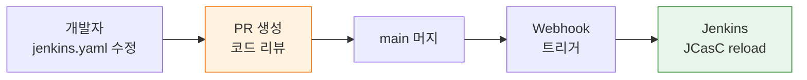

# JCasC 운영과 GitOps

---

> "파이프라인을 만드는 도구"가 아니라 재생산 가능한 운영 환경이어야 한다.


## 1. SCM 저장 패턴

> `jenkins.yaml`을 Git에 올려야 변경 이력, PR 리뷰, 롤백이 가능해진다. 환경 수에 따라 브랜치 전략과 단일 파일 전략 중 하나를 선택한다.

`jenkins.yaml`을 로컬 파일시스템에만 두면 JCasC의 가치가 절반으로 줄어든다. Git 저장소에 올려야 변경 이력, PR 리뷰, 롤백이 가능해진다. 저장소 구조는 팀의 환경 수에 따라 두 가지 방향으로 나뉜다:

| 전략 | 적합한 경우 | 방식 |
|------|-----------|------|
| 브랜치 전략 | 환경 간 차이가 크고 YAML 구조 자체가 달라질 때 | `dev` 브랜치에 개발계, `main` 브랜치에 운영계 설정 관리 |
| 단일 파일 + 변수 치환 | 환경 간 차이가 작을 때 | `jenkins.yaml` 하나를 유지하되 `${ENV_NAME}`, `${JENKINS_URL}` 같은 환경변수로 차이 흡수 |

디렉토리 구조 예시는 다음과 같다:

```
jenkins-config/
├── jenkins.yaml          # JCasC 설정
├── plugins.txt           # 플러그인 목록 + 버전
├── jobs/                 # Job DSL 또는 Jobfile
│   ├── pipeline-a.groovy
│   └── pipeline-b.groovy
└── helm/
    └── values.yaml       # Helm 배포 값
```

- 이 구조에서 `jenkins.yaml`과 `plugins.txt`는 함께 관리한다. 플러그인 버전이 바뀌면 설정 스키마도 달라질 수 있으므로, 두 파일은 항상 같은 커밋에서 변경되어야 일관성이 유지된다.


GitOps 워크플로우로 운영하면 Jenkins 설정 변경 절차가 코드 배포와 동일해진다. 설정을 바꿔야 할 때는 브랜치를 만들고 `jenkins.yaml`을 수정한 뒤 PR을 올린다. 팀원이 리뷰하고 승인하면 main 브랜치에 머지된다. CI가 머지를 감지하면 reload API를 호출하여 Jenkins에 변경 사항을 반영한다.



- 자동 reload를 구현하는 간단한 방법은 저장소 웹훅과 Job을 연결하는 것이다. 
- `jenkins.yaml`이 포함된 저장소에 push 이벤트가 발생하면, Jenkins의 관리용 Job이 트리거되어 reload API를 호출한다. 
- Kubernetes 환경이라면 ArgoCD나 Flux 같은 GitOps 도구가 ConfigMap 변경을 감지하여 마운트 파일을 갱신하고, JCasC가 파일 변경을 자동으로 감지하도록 설정할 수도 있다.


## 2. Helm + JCasC 통합

> Kubernetes 환경에서 Jenkins를 Helm으로 배포하면 `jenkins.yaml`을 ConfigMap으로 마운트하는 방식이 표준이다.

Jenkins 공식 Helm 차트는 `controller.JCasC` 섹션을 통해 이 과정을 자동화한다.

`values.yaml`에서 JCasC 설정을 직접 주입하는 방식은 다음과 같다:

```yaml
controller:
  JCasC:
    configScripts:
      jenkins-config: |
        jenkins:
          numExecutors: 2
          securityRealm:
            local:
              allowsSignup: false
              users:
                - id: "admin"
                  password: "${JENKINS_ADMIN_PASSWORD}"
          authorizationStrategy:
            loggedInUsersCanDoAnything:
              allowAnonymousRead: false
        unclassified:
          location:
            url: "${JENKINS_URL}"
```

외부 `jenkins.yaml` 파일을 별도 ConfigMap으로 마운트하는 방식도 있다:

```yaml
controller:
  JCasC:
    configUrls:
      - "configmap://jenkins-casc-config/jenkins.yaml"
```

두 방식의 차이는 관리 위치에 있다:

- `values.yaml` 직접 주입: Helm 릴리스 한 곳에서 모든 설정을 관리할 수 있다. 설정 변경 시 Helm upgrade가 필요하다.
- 외부 ConfigMap 방식: 설정과 배포 파이프라인을 분리할 수 있다. Jenkins 설정만 바꿀 때 Helm upgrade 없이 ConfigMap만 교체하면 된다.


## 3. 플러그인 버전 관리

> 플러그인 버전을 고정하지 않으면 재구축 시 최신 버전이 설치되어 기존 설정과 호환되지 않는 문제가 발생한다.

`plugins.txt`에 버전을 명시하는 것이 재현 가능한 환경의 전제 조건이다:

```text
kubernetes:4246.v5a_12b_c97c7e6
workflow-aggregator:596.v8c21c963d92d
git:5.2.1
configuration-as-code:1810.v9b_c30a_249a_4c
blueocean:1.27.9
```

`plugin-installation-manager-tool`을 사용하면 `plugins.txt`를 읽어 지정 버전을 설치한다. Docker 이미지 빌드 시 이 도구를 활용하면 플러그인 버전까지 이미지에 고정된다:

```dockerfile
FROM jenkins/jenkins:2.440.3-lts-jdk17

COPY plugins.txt /usr/share/jenkins/ref/plugins.txt
RUN jenkins-plugin-cli --plugin-file /usr/share/jenkins/ref/plugins.txt
```

플러그인 호환성 문제는 대부분 메이저 버전 업데이트 시 발생한다. 대처 방법은 다음과 같다:

- 플러그인 업데이트는 dev 환경에서 먼저 검증한 후 `plugins.txt`에 반영한다.
- JCasC export로 설정 스키마 변경 여부를 확인한다.
- 플러그인 업데이트와 `jenkins.yaml` 변경은 같은 PR에서 진행한다.


## 4. 운영 설계 원칙

> Jenkins Controller가 망가졌을 때 30분 안에 동일한 환경을 재구축할 수 있어야 한다. 이 목표가 달성되면 Jenkins는 "상태를 유지해야 하는 서버"에서 "언제든 교체 가능한 컴포넌트"로 바뀐다.

이 목표를 달성하는 데 필요한 세 가지 조건이 있다:

1. `jenkins.yaml`이 Git에 있어야 한다 — 현재 상태를 언제든 재현할 수 있다.
2. `plugins.txt`가 버전을 고정해야 한다 — 재구축 시 동일한 플러그인 환경이 보장된다.
3. 비밀값이 환경변수나 Secrets Manager로 분리되어야 한다 — YAML 파일만으로는 재구축이 불완전하다.

설정 변경을 PR로 강제하면 감사 추적이 자연스럽게 만들어진다. "누가 언제 무엇을 왜 바꿨는지"가 Git 히스토리에 남는다. 이것은 보안 감사, 장애 원인 분석, 신규 팀원 온보딩 모두에 가치가 있다. Jenkins를 운영하는 팀이 JCasC를 도입해야 하는 이유는 편의성이 아니라, 운영 환경의 신뢰성과 재현 가능성 때문이다.

실제 운영에서 JCasC가 빛나는 순간은 장애 대응 상황이다. Jenkins Controller가 응답하지 않아 Pod를 재시작해야 할 때, JCasC가 없으면 재시작 후 설정이 초기화된 Jenkins를 다시 클릭해가며 복구해야 한다. JCasC가 있으면 Pod가 올라오면서 ConfigMap에 마운트된 `jenkins.yaml`을 읽어 자동으로 설정을 복원한다. 다운타임이 Pod 재시작 시간으로 줄어든다는 뜻이다.
