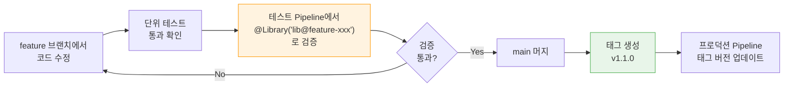

# Groovy 기본 문법

---

> Jenkins Shared Library를 작성하려면 Groovy 문법 중 어디까지 알아야 하는가?

## 1. Groovy 기본 문법

> Groovy는 JVM 위에서 동작하는 동적 타이핑 언어다. Java와 거의 동일한 문법에 스크립팅 편의 기능을 더한 것이라서, Java 개발자라면 새로 배울 양이 많지 않다. 
>
> - 여기서는 Jenkins Shared Library(vars/, src/)를 작성할 때 실제로 쓰는 문법만 다룬다.

### 1-1. 변수 선언과 문자열

Groovy에서 변수는 `def`로 선언하거나 타입을 명시할 수 있다. 

```groovy
// def: 타입 추론 (vars/ 함수에서 주로 사용)
def imageName = "my-app"
def buildNumber = 42

// 타입 명시 (src/ 클래스에서 권장)
String imageName = "my-app"
int buildNumber = 42
```

- `def`는 "타입 추론에 맡기겠다"는 뜻이며, vars/ 함수에서는 대부분 `def`를 사용한다. 
- src/ 클래스에서는 가독성과 IDE 지원을 위해 타입을 명시하는 편이 낫다.

문자열에서 가장 자주 쓰는 기능은 **GString**(문자열 보간)이다. 큰따옴표(`"`) 안에서 `${변수}`로 값을 삽입할 수 있다. 작은따옴표(`'`)는 보간이 되지 않는 일반 문자열이다.

```groovy
def name = "service-a"
def tag = "v1.0"

// GString — 변수 값이 삽입된다
println "Building ${name}:${tag}"    // → Building service-a:v1.0

// 일반 문자열 — 변수 보간 없음
println 'Building ${name}:${tag}'    // → Building ${name}:${tag} (그대로 출력)
```

Jenkins Pipeline에서 `sh` 명령어를 작성할 때 이 차이가 중요하다. 셸 변수(`$VARIABLE`)를 그대로 전달하려면 작은따옴표를 쓰고, Groovy 변수를 삽입하려면 큰따옴표를 써야 한다.

```groovy
// Groovy 변수 삽입 → 큰따옴표
sh "docker build -t ${imageName}:${tag} ."

// 셸 변수 보존 → 작은따옴표
sh 'echo $BUILD_NUMBER'
```

- 세미콜론은 생략할 수 있다. Jenkins 커뮤니티에서는 생략하는 것이 관례다.

### 1-2. 컬렉션 — List와 Map

Groovy의 List와 Map은 Java의 `ArrayList`, `LinkedHashMap`과 동일하지만 리터럴 문법이 훨씬 간결하다.

```groovy
// List
def services = ["api", "web", "worker"]
services.add("scheduler")
println services[0]         // → api
println services.size()     // → 4

// Map
def config = [
    imageName: "my-app",
    tag: "v1.0",
    dockerfile: "Dockerfile"
]
println config.imageName    // → my-app
println config["tag"]       // → v1.0

// 빈 Map (Shared Library의 call(Map config = [:]) 패턴)
def emptyMap = [:]
```

- Map 리터럴에서 키는 따옴표 없이 쓸 수 있다. 
- `imageName: "my-app"`은 Java의 `put("imageName", "my-app")`과 동일하다. 
- 이 문법 덕분에 `buildDocker(imageName: 'my-app', tag: 'v1.0')`처럼 **이름 기반 파라미터 호출**이 가능한 것이다.

컬렉션을 순회하는 메서드가 Shared Library에서 빈번하게 사용된다:

```groovy
def services = ["api", "web", "worker"]

// each: 순회 (반환값 없음)
services.each { svc ->
    println "Building ${svc}"
}

// findAll: 조건에 맞는 요소만 필터링
def webServices = services.findAll { it.contains("web") }
// → ["web"]

// collect: 각 요소를 변환하여 새 리스트 생성
def imageNames = services.collect { "registry.example.com/${it}:latest" }
// → ["registry.example.com/api:latest", ...]

// any / every: 조건 검사
def hasWorker = services.any { it == "worker" }    // → true
def allShort = services.every { it.length() < 5 }  // → false
```

- `it`은 클로저의 기본 파라미터명이다. 파라미터가 하나일 때 `{ item -> ... }` 대신 `{ it... }`으로 줄여 쓸 수 있다.

### 1-3. 클로저

클로저(Closure)는 Groovy의 핵심 개념이며, Jenkins Pipeline DSL이 클로저 위에 설계되어 있다. `stage('Build') { sh 'mvn package' }`에서 `{ sh 'mvn package' }` 부분이 클로저다.

```groovy
// 클로저 기본 문법
def greet = { String name ->
    println "Hello, ${name}"
}
greet("Jenkins")  // → Hello, Jenkins

// 파라미터 없는 클로저
def sayHello = { ->
    println "Hello"
}

// 파라미터가 하나면 it 사용 가능
def upper = { it.toUpperCase() }
println upper("hello")  // → HELLO
```

Shared Library에서 클로저가 중요한 이유는 **Pipeline DSL의 블록 구문이 모두 클로저**이기 때문이다:

```groovy
// Pipeline DSL에서의 클로저
pipeline {          // ← 클로저
    agent any
    stages {        // ← 클로저
        stage('Build') {    // ← 클로저
            steps {         // ← 클로저
                sh 'mvn package'
            }
        }
    }
}
```

vars/ 함수에서 클로저를 파라미터로 받으면 **래퍼 패턴**을 구현할 수 있다. `standardPipeline` 래퍼가 대표적인 예다:

```groovy
// vars/withTimer.groovy — 클로저를 받는 래퍼
def call(Closure body) {
    def start = System.currentTimeMillis()
    try {
        body()  // 전달받은 클로저 실행
    } finally {
        def duration = System.currentTimeMillis() - start
        echo "Duration: ${duration}ms"
    }
}

// Jenkinsfile에서 사용
withTimer {
    sh 'mvn clean package'
    sh 'docker build -t my-app .'
}
```

### 1-4. Elvis 연산자와 Safe Navigation

Jenkins Shared Library에서 **기본값 처리**와 **null 안전 접근**은 가장 빈번한 패턴이다.

**Elvis 연산자(`?:`)** 는 좌항이 null이거나 falsy이면 우항을 반환한다. `config.tag ?: env.BUILD_NUMBER` 패턴이 이것이다.

```groovy
// Elvis 연산자: null 또는 빈 값이면 기본값 사용
def tag = config.tag ?: env.BUILD_NUMBER
def timeout = config.timeout ?: 30

// Java 삼항 연산자로 쓰면 이렇게 된다
def tag = config.tag != null ? config.tag : env.BUILD_NUMBER
// Elvis 연산자가 훨씬 간결하다
```

**Safe Navigation 연산자(`?.`)** 는 객체가 null이면 NPE 대신 null을 반환한다. Jenkins API는 null을 자주 반환하므로 이 연산자가 필수적이다.

```groovy
// Safe Navigation: computer가 null이면 NPE 대신 null 반환
def status = node.toComputer()?.isOnline()
// node.toComputer()가 null이면 status = null (NPE 발생하지 않음)

// 체이닝도 가능
def userId = run.getCause(hudson.model.Cause.UserIdCause)?.getUserId() ?: 'system'
// getCause()가 null이면 getUserId()를 호출하지 않고 → Elvis로 'system' 반환
```

RunListener 코드에서 `run.getCause(...)?.getUserId() ?: 'system'`이 Elvis와 Safe Navigation을 조합한 대표적인 패턴이다.

### 1-5. call() 메서드 — vars/ 파일의 핵심 규약

vars/ 디렉토리의 `.groovy` 파일이 Pipeline에서 함수처럼 호출되는 메커니즘은 `call()` 메서드에 기반한다. Jenkins는 vars/ 파일을 전역 스코프에 바인딩할 때, 파일 내의 `call()` 메서드를 해당 파일명의 함수로 매핑한다.

```groovy
// vars/buildDocker.groovy
def call(Map config = [:]) {
    // Pipeline에서 buildDocker(imageName: 'app')으로 호출하면
    // 이 call() 메서드가 실행된다
    def imageName = config.imageName ?: error("imageName required")
    sh "docker build -t ${imageName} ."
}
```

- `call()`이 특별한 이유는 Groovy의 언어 기능 때문이다. 
- Groovy에서는 객체에 `call()` 메서드가 정의되어 있으면 `객체()` 형태로 호출할 수 있다. 
- Jenkins가 `buildDocker`라는 이름으로 객체를 바인딩하면, `buildDocker()`는 곧 `buildDocker.call()`이 된다.

하나의 파일에 여러 메서드를 정의할 수도 있다:

```groovy
// vars/docker.groovy
def call(Map config = [:]) {
    // docker(imageName: 'app')으로 호출
    build(config)
    push(config)
}

def build(Map config) {
    sh "docker build -t ${config.imageName} ."
}

def push(Map config) {
    sh "docker push ${config.imageName}"
}

// Jenkinsfile에서:
// docker(imageName: 'app')     ← call() 호출
// docker.build(imageName: 'app')  ← build() 직접 호출
```

### 1-6. Serializable과 CPS 변환

Jenkins Pipeline은 **CPS(Continuation Passing Style) 변환**을 적용한다. 

Pipeline 실행 중에 Jenkins가 재시작되어도 중단된 지점부터 재개할 수 있도록, Pipeline의 모든 상태를 디스크에 직렬화하기 때문이다. 이것이 src/ 클래스에 `implements Serializable`이 필요한 이유다.

```groovy
// src/com/example/DockerConfig.groovy
class DockerConfig implements Serializable {
    // ✅ Serializable 구현 — Pipeline 중단/재개 시 이 객체가 직렬화된다
    String registry = 'registry.example.com'
    String credentialsId = 'registry-cred'
}

// ❌ Serializable이 없으면 Pipeline이 직렬화 시점에 실패할 수 있다
class DockerConfig {
    String registry = 'registry.example.com'
}
```

CPS 변환에서 주의할 점이 하나 더 있다. vars/ 함수에서 일부 Java/Groovy 표준 라이브러리 메서드는 CPS와 호환되지 않아 `@NonCPS` 어노테이션이 필요하다:

```groovy
// vars/parseJson.groovy
import groovy.json.JsonSlurper

// @NonCPS: CPS 변환을 비활성화하여 일반 Groovy 코드로 실행
@NonCPS
def call(String jsonText) {
    return new JsonSlurper().parseText(jsonText)
}
// JsonSlurper는 CPS와 호환되지 않으므로 @NonCPS가 필수다
// 단, @NonCPS 메서드 안에서는 Pipeline DSL(sh, stage 등)을 사용할 수 없다
```

### 문법 요약

| 문법 | Java 대응 | Jenkins에서의 용도 |
|------|----------|-------------------|
| `def` | `var` (Java 10+) | vars/ 함수 내 변수 선언 |
| `"${var}"` | `String.format()` | sh 명령어, 로그 메시지 |
| `[:]` | `new HashMap<>()` | `call(Map config = [:])` 기본값 |
| `{ -> }` | 람다 | Pipeline DSL 블록, 래퍼 패턴 |
| `?:` | 삼항 연산자 | 파라미터 기본값 처리 |
| `?.` | Optional 체이닝 | Jenkins API null 안전 접근 |
| `call()` | `__invoke()` | vars/ 파일의 진입점 |
| `@NonCPS` | 없음 | CPS 비호환 코드 격리 |


## 2. 첫 Shared Library 만들기

> Shared Library의 개념은 이해했는데 실제로 어떻게 시작하는지 모르겠다면, 이 섹션을 따라하면 된다. Git 저장소 생성부터 Jenkins 등록, 첫 함수 작성, 테스트까지 순서대로 진행한다.

### Step 1: Git 저장소와 디렉토리 구조

먼저 Shared Library용 Git 저장소를 생성하고, Jenkins가 인식하는 디렉토리 구조를 만든다.

```bash
# 저장소 생성
mkdir my-pipeline-lib && cd my-pipeline-lib
git init

# Jenkins가 인식하는 3개 디렉토리
mkdir -p vars src/com/mycompany resources

# 기본 파일 생성
touch vars/.gitkeep src/com/mycompany/.gitkeep resources/.gitkeep
```

최종 구조는 다음과 같다:

```
my-pipeline-lib/
├── vars/                     # Pipeline에서 호출할 함수
│   └── (buildDocker.groovy)
├── src/                      # Groovy 클래스
│   └── com/mycompany/
│       └── (DockerConfig.groovy)
├── resources/                # 정적 파일 (YAML, 템플릿)
└── README.md
```

### Step 2: 첫 vars/ 함수 작성

가장 간단한 함수부터 시작한다. Slack 알림을 보내는 함수를 만들어 보자.

```groovy
// vars/notifySlack.groovy
def call(Map config = [:]) {
    def channel = config.channel ?: '#ci-builds'
    def message = config.message ?: "Build ${env.JOB_NAME} #${env.BUILD_NUMBER}"
    def color = config.color ?: 'good'

    // slackSend는 Slack Notification Plugin이 제공하는 Pipeline step
    slackSend(
        channel: channel
        , message: message
        , color: color
    )
}
```

이 파일 하나가 Pipeline에서 `notifySlack(channel: '#deploys', message: 'Done!')` 형태로 호출된다.

두 번째 함수로 Docker 빌드를 추가한다:

```groovy
// vars/buildDocker.groovy
def call(Map config = [:]) {
    def imageName = config.imageName ?: error("imageName is required")
    def tag = config.tag ?: env.BUILD_NUMBER
    def dockerfile = config.dockerfile ?: 'Dockerfile'

    echo "Building Docker image: ${imageName}:${tag}"

    stage('Docker Build') {
        sh "docker build -t ${imageName}:${tag} -f ${dockerfile} ."
    }

    return "${imageName}:${tag}"
}
```

**함수 작성 시 주의할 점**:

- `call(Map config = [:])`을 기본 시그니처로 사용한다. 파라미터가 늘어나도 기존 호출부가 깨지지 않는다.
- 필수 파라미터는 `?: error("메시지")`로 빠르게 실패시킨다.
- `stage()`를 함수 안에 넣을 수도 있고, 호출부에서 감쌀 수도 있다. 팀과 합의하여 일관성을 유지한다.
- 반환값이 있으면 다음 단계에서 활용할 수 있다.

### Step 3: Jenkins에 라이브러리 등록

Git 저장소를 커밋하고 원격에 푸시한 후, Jenkins에 등록한다.

**UI 설정 방식:**

1. **Manage Jenkins** > **System** > **Global Pipeline Libraries** 섹션으로 이동
2. **Add** 클릭
3. 다음 값을 입력한다:

| 항목 | 값 | 설명 |
|------|---|------|
| Name | `my-pipeline-lib` | `@Library('my-pipeline-lib')`에서 사용할 이름 |
| Default version | `main` | 기본 브랜치 |
| Load implicitly | 체크 해제 | 명시적 로딩 권장 (처음에는) |
| Allow default version to be overridden | 체크 | 버전 고정 가능 |
| Retrieval method | Modern SCM > Git | Git 저장소 |
| Project Repository | `https://github.com/mycompany/my-pipeline-lib.git` | 저장소 URL |
| Credentials | (Git 접근용 credentials 선택) | private repo인 경우 |

**JCasC 설정 방식:**

```yaml
unclassified:
  globalLibraries:
    libraries:
      - name: "my-pipeline-lib"
        defaultVersion: "main"
        implicit: false
        allowVersionOverride: true
        retriever:
          modernSCM:
            scm:
              git:
                remote: "https://github.com/mycompany/my-pipeline-lib.git"
                credentialsId: "git-credentials"
```

### Step 4: Jenkinsfile에서 호출

이제 실제 서비스의 Jenkinsfile에서 라이브러리를 사용한다.

```groovy
// service-a/Jenkinsfile
@Library('my-pipeline-lib') _

pipeline {
    agent any

    stages {
        stage('Build') {
            steps {
                // vars/buildDocker.groovy의 call()이 실행된다
                buildDocker(imageName: 'service-a')
            }
        }
    }

    post {
        success {
            notifySlack(
                channel: '#deploys'
                , message: "service-a 배포 성공"
                , color: 'good'
            )
        }
        failure {
            notifySlack(
                channel: '#deploys'
                , message: "service-a 배포 실패"
                , color: 'danger'
            )
        }
    }
}
```

`@Library('my-pipeline-lib') _`의 `_`는 Groovy 어노테이션 문법상 필요한 더미 심볼이다. 어노테이션은 반드시 무언가에 적용되어야 하므로, 아무 의미 없는 변수 `_`를 대상으로 사용한다.

### Step 5: src/ 클래스로 로직 분리

vars/ 함수가 복잡해지면 순수 로직을 src/ 클래스로 분리한다. src/ 클래스는 Jenkins 의존성 없이 단위 테스트가 가능하다는 것이 핵심 이점이다.

```groovy
// src/com/mycompany/ImageNaming.groovy
package com.mycompany

class ImageNaming implements Serializable {
    String registry
    String defaultTag

    ImageNaming(String registry, String defaultTag = 'latest') {
        this.registry = registry
        this.defaultTag = defaultTag
    }

    String fullName(String name, String tag = null) {
        def resolvedTag = tag ?: defaultTag
        return "${registry}/${name}:${resolvedTag}"
    }

    boolean shouldPush(String branch) {
        return branch in ['main', 'release', 'develop']
    }
}
```

```groovy
// vars/buildDocker.groovy — src/ 클래스 활용
import com.mycompany.ImageNaming

def call(Map config = [:]) {
    def naming = new ImageNaming(
        config.registry ?: 'registry.example.com'
        , config.defaultTag ?: env.BUILD_NUMBER
    )
    def imageName = config.imageName ?: error("imageName required")
    def fullName = naming.fullName(imageName, config.tag)

    stage('Docker Build') {
        sh "docker build -t ${fullName} ."
    }

    if (naming.shouldPush(env.BRANCH_NAME)) {
        stage('Docker Push') {
            sh "docker push ${fullName}"
        }
    }

    return fullName
}
```

### Step 6: 테스트 작성

**src/ 클래스의 단위 테스트**는 일반 Groovy/Spock 테스트로 작성한다. Jenkins 환경이 필요 없다.

```groovy
// test/com/mycompany/ImageNamingTest.groovy
import com.mycompany.ImageNaming
import spock.lang.Specification

class ImageNamingTest extends Specification {

    def 'fullName이_레지스트리와_태그를_포함해야_한다'() {
        given:
        def naming = new ImageNaming('registry.example.com', 'latest')

        expect:
        naming.fullName('my-app', 'v1.0') == 'registry.example.com/my-app:v1.0'
        naming.fullName('my-app') == 'registry.example.com/my-app:latest'
    }

    def 'shouldPush는_main_release_develop만_허용한다'() {
        given:
        def naming = new ImageNaming('registry.example.com')

        expect:
        naming.shouldPush('main') == true
        naming.shouldPush('release') == true
        naming.shouldPush('develop') == true
        naming.shouldPush('feature-x') == false
    }
}
```

**vars/ 함수의 통합 테스트**는 Jenkins Pipeline Unit 프레임워크를 사용한다:

```groovy
// test/BuildDockerTest.groovy
import com.lesfurets.jenkins.unit.BasePipelineTest
import org.junit.Before
import org.junit.Test

class BuildDockerTest extends BasePipelineTest {

    @Before
    void setUp() {
        super.setUp()
        binding.setVariable('env', [
            BUILD_NUMBER: '42',
            BRANCH_NAME: 'main'
        ])
    }

    @Test
    void 'imageName이_없으면_에러를_발생시킨다'() {
        def script = loadScript('vars/buildDocker.groovy')
        try {
            script.call([:])
            fail('에러가 발생해야 한다')
        } catch (Exception e) {
            assert e.message.contains('imageName required')
        }
    }

    @Test
    void '기본_태그는_BUILD_NUMBER를_사용한다'() {
        def script = loadScript('vars/buildDocker.groovy')
        def result = script.call(imageName: 'my-app')
        assertJobStatusSuccess()
    }
}
```

### Step 7: 버전 관리와 배포

라이브러리가 안정화되면 Semantic Versioning으로 태그를 관리한다.

```bash
# 첫 안정 버전 태그
git tag -a v1.0.0 -m "Initial stable release"
git push origin v1.0.0
```

Jenkinsfile에서 태그 버전을 고정하면 라이브러리 변경이 즉시 영향을 주지 않는다:

```groovy
// 프로덕션 Pipeline: 태그 버전 고정
@Library('my-pipeline-lib@v1.0.0') _

// 스테이징 Pipeline: 최신 main 사용
@Library('my-pipeline-lib@main') _

// 개발 중 테스트: feature 브랜치 사용
@Library('my-pipeline-lib@feature-new-deploy') _
```

라이브러리 업데이트 워크플로우는 다음과 같다:



**Breaking Change 규칙:**

- 기존 함수의 파라미터명 변경, 반환 타입 변경 → 메이저 버전 올림 (v1.x → v2.0)
- 새 함수 추가, 기존 함수에 선택 파라미터 추가 → 마이너 버전 올림 (v1.0 → v1.1)
- 버그 수정 → 패치 버전 올림 (v1.0.0 → v1.0.1)


## 핵심 정리

| 개념 | 핵심 | 왜 중요한가 |
|------|------|------------|
| **Groovy 기본 문법** | `def`, GString, 컬렉션, 클로저, `?:`, `?.` | Pipeline DSL과 vars/ 함수 작성의 기반 |
| **call() 메서드** | 파일명 = 함수명, `call(Map config = [:])` | vars/ 함수의 유일한 진입점 규약 |
| **CPS/Serializable** | Pipeline 상태를 직렬화하여 중단/재개 지원 | src/ 클래스에 Serializable 필수인 이유 |
| **라이브러리 시작** | vars/ 함수 → src/ 분리 → 테스트 → 태그 | 점진적으로 복잡도를 높이는 접근 |
