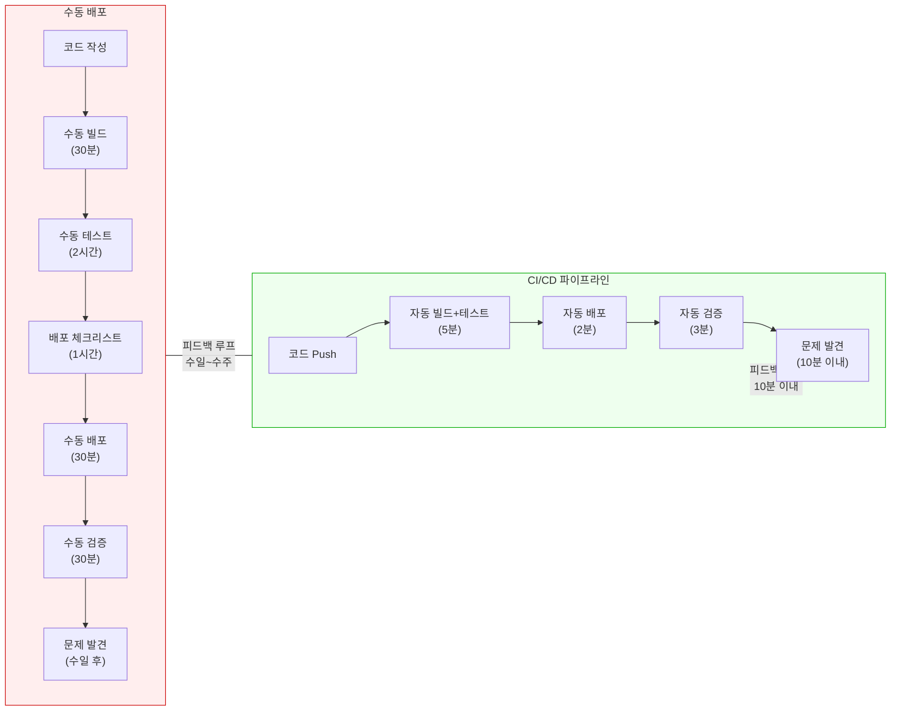
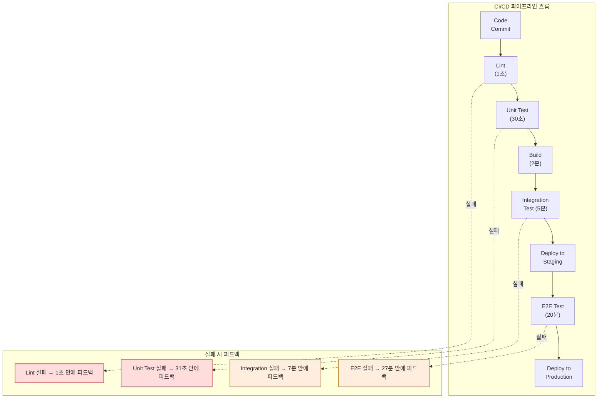
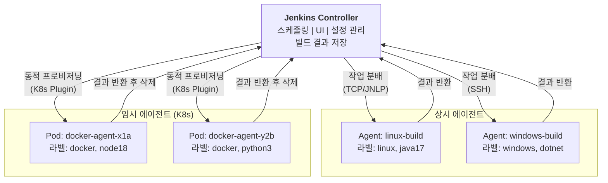

# 왜 CI/CD가 필요한가

---

## 수동 배포의 문제점

수동 배포가 왜 위험한지를 이해하려면, 실제로 수동 배포 과정에서 무엇이 일어나는지를 구체적으로 살펴봐야 합니다.

- **Human Error(인적 오류)**는 수동 배포에서 가장 빈번하고 치명적인 문제입니다. 배포 체크리스트가 20단계라면, 피곤한 금요일 오후에 3번째 단계를 건너뛸 확률은 결코 0이 아닙니다. 환경변수를 staging 값으로 놓고 프로덕션에 배포하는 실수, 마이그레이션 스크립트 실행을 잊는 실수, 배포 순서를 잘못 지키는 실수 등이 반복됩니다. 사람은 실수하는 존재이고, 반복 작업에서의 실수는 프로세스의 문제이지 개인의 문제가 아닙니다.

- **배포 공포(Deployment Fear)**는 수동 배포의 심리적 부작용입니다. 배포할 때마다 장애가 날 수 있다는 공포 때문에, 팀은 배포 빈도를 줄이려 합니다. "금요일에는 배포하지 말자"는 암묵적 규칙이 생기고, 배포를 2주에 한 번으로 제한합니다. 하지만 배포 빈도를 줄이면 한 번의 배포에 포함되는 변경량이 커지고, 변경량이 크면 문제 발생 시 원인 파악이 어려워지고, 원인 파악이 어려우면 배포가 더 무서워집니다. 이것이 **악순환**입니다.

- **긴 피드백 루프**는 수동 배포의 시간적 문제입니다. 코드를 작성하고 실제 사용자에게 도달하기까지 수일에서 수주가 걸리면, 버그가 발견되었을 때 해당 코드를 작성한 개발자는 이미 다른 작업에 몰입해 있습니다. 컨텍스트 스위칭 비용이 발생하고, "이 코드를 왜 이렇게 짰지?"라고 자문하게 됩니다.

## CI/CD가 해결하는 것



- 위 다이어그램은 수동 배포와 CI/CD 파이프라인의 피드백 루프 차이를 보여줍니다. 수동 배포는 코드 작성부터 문제 발견까지 수일이 걸리는 반면, CI/CD는 10분 이내에 피드백을 받습니다. 이 시간 차이가 단순한 효율성 개선이 아니라 **근본적으로 다른 개발 문화**를 만듭니다.

CI/CD가 구체적으로 해결하는 문제들은 다음과 같습니다.

- **반복 작업 자동화**: 빌드, 테스트, 배포라는 반복 작업에서 사람을 제거합니다. 사람은 창의적인 작업(설계, 코드 리뷰, 아키텍처 결정)에 집중하고, 기계적인 작업은 파이프라인에 맡깁니다.

- **빠른 피드백**: 커밋 후 10분 이내에 빌드가 성공했는지, 테스트가 통과했는지 알 수 있습니다. 문제가 발견되면 방금 작성한 코드에서 원인을 찾으면 되므로 디버깅 시간이 극적으로 줄어듭니다.

- **배포 빈도 증가를 통한 위험 감소**: 직관에 반하지만, 배포를 더 자주 하면 각 배포의 위험이 줄어듭니다. 10줄 변경을 배포하면 문제 발생 시 10줄만 확인하면 됩니다. 10,000줄 변경을 한꺼번에 배포하면 문제 범위가 10,000줄입니다. 작은 배포는 롤백도 간단합니다.

## CI/CD 파이프라인 설계원칙 

### 1. 빠른 피드백

파이프라인의 단계 배치 순서는 **비용이 낮은 검증을 먼저** 실행하는 것이 원칙입니다. 왜 그럴까요? 파이프라인의 목적은 "이 코드 변경이 안전한가?"를 가능한 빨리 판단하는 것이기 때문입니다. 

- Lint 검사는 1초, 단위 테스트는 30초, 통합 테스트는 5분, E2E 테스트는 20분 걸린다면, Lint에서 이미 잡을 수 있는 문제를 E2E까지 가서 발견하는 것은 19분 59초의 낭비입니다.

- 이 원칙을 **테스트 피라미드(Test Pyramid)**라고 합니다. 아래로 갈수록 빠르고 저렴한 테스트를 많이, 위로 갈수록 느리고 비싼 테스트를 적게 배치합니다.



### 2. 환경 일관성

**동일한 아티팩트가 모든 환경을 통과해야 합니다.** 이것은 "각 환경에서 새로 빌드하지 말라"는 의미입니다.

흔한 실수는 staging 환경에서 빌드한 아티팩트를 테스트하고, 프로덕션에서는 다시 빌드해서 배포하는 것입니다. 동일한 소스코드라도 빌드 시점의 의존성 버전, 환경변수, 빌드 도구 버전이 미세하게 달라서 다른 바이너리가 만들어질 수 있습니다. "staging에서는 됐는데 프로덕션에서 안 된다"는 상황의 상당 부분이 이 이유입니다.

- 올바른 방식은 CI 단계에서 아티팩트(JAR, Docker 이미지 등)를 **한 번만** 빌드하고, 이 동일한 아티팩트를 dev → staging → production 순서로 통과시키는 것입니다. 
- 환경별로 달라지는 것은 설정(환경변수, config 파일)뿐이어야 합니다. Docker가 이 원칙을 실현하는 데 결정적인 역할을 했는데, 컨테이너 이미지는 빌드 환경의 모든 의존성을 포함하므로 어디서 실행해도 동일한 동작을 보장하기 때문입니다.

### 3. 원자적 배포

**배포는 성공하거나 완전히 롤백되어야 합니다.** 중간 상태(일부 서버만 새 버전, 나머지는 구 버전)가 존재하면 안 됩니다.

왜 중간 상태가 위험할까요? API 스키마가 변경된 경우를 생각해 보면 명확합니다. 서버 A는 새 API를 제공하고 서버 B는 구 API를 제공하는 상태에서, 로드밸런서가 요청을 랜덤으로 분배하면 클라이언트는 때로는 성공하고 때로는 실패합니다. 이런 간헐적 오류는 디버깅이 매우 어렵습니다.

- 원자적 배포를 구현하는 전략으로 Blue-Green Deployment(새 버전을 별도 환경에 준비한 후 트래픽을 한 번에 전환), Canary Deployment(전체 트래픽의 일부만 새 버전으로 보내며 점진적으로 확대), Rolling Update(서버를 순차적으로 업데이트하되 충분한 헬스체크 후 진행) 등이 있습니다. 
- 이 전략들은 이후 챕터에서 Jenkins 파이프라인으로 직접 구현해 볼 것입니다.

# Jenkins

---

> 도구 선택은 조직의 상황에 따라 결정되어야 합니다. 아래 테이블은 주요 CI/CD 도구의 특성을 비교한 것입니다. "최고의 도구"는 없으며, 각 도구가 빛나는 맥락이 다릅니다.

| 도구               | 타입               | 장점                                                         | 단점                                                         | 적합한 상황                                     |
| ------------------ | ------------------ | ------------------------------------------------------------ | ------------------------------------------------------------ | ----------------------------------------------- |
| **Jenkins**        | Self-hosted        | 무한 커스터마이징, 1800+ 플러그인 생태계, 온프레미스 완전 통제 | 운영 부담(서버, 플러그인 관리), 플러그인 호환성 이슈, 초기 설정 복잡 | 온프레미스 환경, 복잡한 파이프라인, 레거시 통합 |
| **GitHub Actions** | SaaS               | GitHub 저장소와 완벽 통합, 마켓플레이스 액션 풍부, YAML 기반 간결한 설정 | GitHub 종속(Vendor Lock-in), Self-hosted runner 비용, 복잡한 워크플로 디버깅 어려움 | GitHub 기반 프로젝트, 오픈소스, 스타트업        |
| **GitLab CI**      | SaaS / Self-hosted | GitLab 올인원(SCM+CI/CD+레지스트리), Auto DevOps, 강력한 보안 스캔 | GitLab 종속, 대규모 인스턴스 성능 이슈                       | GitLab 기반 조직, DevSecOps 중시                |
| **ArgoCD**         | GitOps (CD만)      | 선언적 배포, Kubernetes 네이티브, Git을 Single Source of Truth로 사용 | CI 기능 없음(별도 CI 도구 필요), Kubernetes 외 환경 미지원   | Kubernetes 환경, GitOps 전략 채택 조직          |

## Jenkins가 여전히 쓰이는 이유

GitHub Actions, GitLab CI 같은 SaaS CI/CD 서비스가 등장한 2020년대에도 Jenkins가 여전히 광범위하게 사용되는 이유는 세 가지입니다.

1. **온프레미스 환경**입니다. 금융, 의료, 공공 부문처럼 코드와 빌드 아티팩트가 외부 클라우드로 나가면 안 되는 환경에서는 Self-hosted CI/CD가 필수입니다. Jenkins는 자체 서버에서 완전히 통제할 수 있습니다.

2. **레거시 시스템 통합**입니다. 20년 된 빌드 스크립트, 독자적인 배포 프로세스, 사내 도구와의 연동이 이미 Jenkins 플러그인으로 구축되어 있는 조직이 많습니다. 이 연동을 다른 CI/CD로 마이그레이션하는 비용이 Jenkins를 유지하는 비용보다 큰 경우가 흔합니다.

3. **커스터마이징 자유도**입니다. Jenkins는 Groovy 스크립트로 파이프라인의 모든 단계를 프로그래밍할 수 있습니다. SaaS CI/CD 서비스는 제공하는 기능의 범위 안에서만 작업해야 하지만, Jenkins는 필요하면 플러그인을 직접 만들 수도 있습니다.


## Controller-Agent 모델

> **Jenkins를 하나의 서버에서 모든 것을 처리하도록 구성하면 세 가지 문제가 동시에 발생합니다.**
>
> - **리소스 경쟁**: Controller는 웹 UI 제공, 빌드 스케줄링, 설정 관리, 결과 저장 등 상시 운영 작업을 수행한다. 여기에 빌드까지 직접 실행하면 CPU와 메모리를 빌드 프로세스가 잡아먹어서 UI 응답이 느려지고, 심하면 Jenkins 자체가 OOM(Out of Memory)으로 죽는다. 빌드는 본질적으로 자원 소모가 크다. Maven 빌드 하나가 수 GB의 메모리를 사용하는 일은 흔하며, 이것이 Jenkins Controller 프로세스와 같은 JVM에서 돌아가면 서로를 죽이는 결과를 낳는다.
>
> - **보안 위험**: 빌드 스크립트는 외부 코드를 체크아웃하고 임의의 명령을 실행한다. 만약 악의적인 빌드 스크립트가 Controller에서 직접 실행되면, Jenkins 설정 파일(`config.xml`), 크레덴셜(`secrets/`), 다른 잡의 빌드 기록에 직접 접근할 수 있다. Controller와 빌드 실행 환경을 분리하면, 빌드 스크립트가 접근할 수 있는 범위를 Agent의 파일시스템으로 제한할 수 있다.
>
> - **확장성 한계**: 팀이 10개의 빌드를 동시에 돌려야 할 때, 단일 서버로는 수직 확장(더 큰 서버)밖에 방법이 없다. Agent를 분리하면 필요할 때 Agent를 추가하는 수평 확장이 가능해진다. Kubernetes 환경에서는 빌드마다 Pod을 띄우고 끝나면 삭제하는 동적 프로비저닝까지 가능하다.

2020년까지 Jenkins 공식 문서는 Master/Slave라는 용어를 사용했다. 이후 소프트웨어 업계 전반의 포용적 언어(Inclusive Language) 운동에 따라 Controller/Agent로 변경되었다. 기술적 의미는 동일하지만, 오래된 블로그나 문서에서는 여전히 Master/Slave를 사용하므로 둘 다 알아두어야 한다. 

### Controller 

Controller는 Jenkins의 시스템 핵심입니다. 직접 빌드를 실행하지 않더라도 해야 할 일이 많습니다.

- **스케줄링**: 빌드 요청이 들어오면 큐에 넣고, 조건에 맞는 Agent를 찾아 배정한다. 크론 트리거, 웹훅 트리거, 수동 트리거 모두 Controller가 받아 처리한다.
- **UI 제공**: Jenkins 웹 대시보드를 서빙한다. 빌드 상태 확인, 설정 변경, 로그 조회 등 모든 사용자 인터랙션이 Controller를 통한다.
- **설정 관리**: 잡 정의, 플러그인 설정, 시스템 설정을 `JENKINS_HOME`에 XML 파일로 저장하고 관리한다.
- **빌드 결과 저장**: Agent에서 빌드가 완료되면 결과(로그, 아티팩트, 테스트 리포트)를 Controller로 전송하여 영구 저장한다.

### Agent

Agent는 실제 빌드를 실행하는 워커 노드다. Controller로부터 `agent.jar`(또는 `remoting.jar`)를 받아 실행하며, Controller와 지속적인 연결을 유지한다.



- **상시 에이전트(Permanent Agent)**: 물리 서버나 VM에 설치하여 항상 실행 중인 에이전트. 설정이 간단하지만 빌드가 없을 때도 리소스를 점유한다.
- **임시 에이전트(Ephemeral Agent)**: Docker 컨테이너나 Kubernetes Pod으로 빌드 시에만 생성되고, 빌드 완료 후 삭제된다. 리소스 효율이 높고, 빌드 환경이 매번 깨끗한 상태에서 시작되므로 재현성도 좋다.

K8s 환경이라고 해서 임시 에이전트만 사용하는 것은 아닙니다. 대부분은 Kubernetes Plugin으로 빌드마다 Pod를 생성/삭제하는 임시 방식을 쓰지만 GPU 노드나 라이선스 소프트웨어처럼 초기화 비용이 큰 특수 환경에는 StatefulSet으로 Agent Pod를 상시 유지하고, JNLP로 연결할 수도 있습니다. (다만 이 경우에는, 탄력적 스케일링을 포기하게 되어 특별한 이유 없으면 임시 방식 권장)


## 실행 모델과 라우팅

> 선언적 파이프라인에서 `agent` 지시문은 빌드가 어디에서 실행될지를 결정한다. 이 선택이 중요한 이유는, 잘못된 Agent에서 빌드가 실행되면 필요한 도구가 없어 실패하거나, 보안 경계를 넘어 민감한 환경에 접근할 수 있기 때문이다.

| 지시문                                 | 의미                                    | 사용 시나리오                   |
| -------------------------------------- | --------------------------------------- | ------------------------------- |
| `agent any`                            | 사용 가능한 아무 Agent에서 실행         | 환경 무관한 간단한 빌드         |
| `agent { label 'docker' }`             | 해당 라벨을 가진 Agent에서만 실행       | 특정 도구/환경이 필요한 빌드    |
| `agent none`                           | Pipeline 수준에서 Agent를 지정하지 않음 | 각 stage마다 다른 Agent 사용 시 |
| `agent { docker { image 'node:18' } }` | Docker 컨테이너 안에서 실행             | 빌드 환경 격리가 필요할 때      |
| `agent { kubernetes { ... } }`         | K8s Pod으로 임시 Agent 생성             | K8s 환경에서 동적 프로비저닝    |

```groovy
// any
pipeline {
    agent any
    stages {
        stage('Build') {
            steps {
                sh 'echo "아무 Agent에서 실행"'
            }
        }
    }
}

// label
pipeline {
    agent { label 'java17 && linux' }
    stages {
        stage('Build') {
            steps {
                sh './gradlew build'
            }
        }
    }
}

// none
pipeline {
    agent none
    stages {
        stage('Build') {
            agent { label 'java17' }
            steps {
                sh './gradlew build'
            }
        }
        stage('Docker') {
            agent { label 'docker' }
            steps {
                sh 'docker build -t myapp .'
            }
        }
    }
}

// docker
pipeline {
    agent {
        docker { image 'node:18-alpine' }
    }
    stages {
        stage('Install') {
            steps {
                sh 'npm ci'
            }
        }
    }
}

// k8s
pipeline {
    agent {
        kubernetes {
            yaml '''
                apiVersion: v1
                kind: Pod
                spec:
                  containers:
                  - name: maven
                    image: maven:3.9-eclipse-temurin-17
                    command: ['sleep', 'infinity']
                '''
        }
    }
    stages {
        stage('Build') {
            steps {
                container('maven') {
                    sh 'mvn package -DskipTests'
                }
            }
        }
    }
}
```

### 라벨 기반 라우팅


### Flyweight vs Heavyweight 실행

