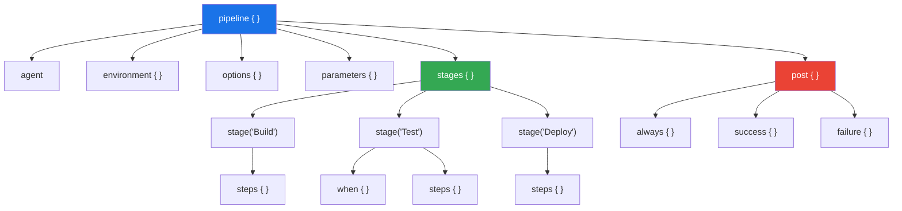
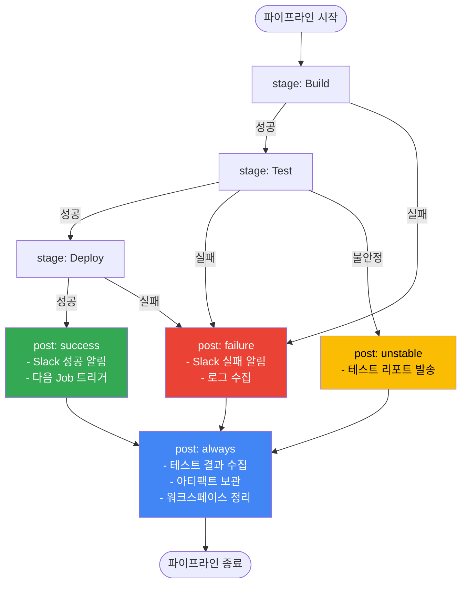

# Declarative Pipeline

---

## Pipeline as Code

> Jenkins의 초기 사용 방식인 Freestyle Job은 웹 UI에서 마우스 클릭으로 빌드 설정을 구성한다. 이 방식은 처음에는 직관적이지만, 팀 규모가 커지고 파이프라인이 복잡해지면 치명적인 한계에 부딪힌다. 
>
> => **Pipeline as Code는 빌드/배포 파이프라인을 소스 코드처럼 파일(Jenkinsfile)로 정의하고 Git 저장소에 함께 관리하는 접근법이다.**

Freestyle Job의 구체적 한계는 다음과 같다.

| 문제              | Freestyle Job                                       | Pipeline as Code                              |
| ----------------- | --------------------------------------------------- | --------------------------------------------- |
| **변경 추적**     | UI에서 설정 변경 시 누가 언제 뭘 바꿨는지 기록 없음 | Git 커밋 히스토리로 모든 변경 추적 가능       |
| **코드 리뷰**     | 빌드 설정을 PR로 리뷰할 방법 없음                   | Jenkinsfile도 PR 리뷰 대상에 포함             |
| **재현성**        | Jenkins 서버 장애 시 설정 복구 어려움               | Git에서 clone하면 파이프라인 즉시 복원        |
| **환경 일관성**   | 개발/스테이징/운영 환경별 Job을 각각 수동 설정      | 하나의 Jenkinsfile이 매개변수로 환경 분기     |
| **테스트 가능성** | 빌드 설정 자체를 테스트할 방법 없음                 | Jenkinsfile 문법 검증(lint), 로컬 테스트 가능 |


## Declarative vs Scripted Pipeline

> Jenkins Pipeline은 두 가지 문법을 지원한다. **Declarative Pipeline**과 **Scripted Pipeline**이다. 이 둘은 같은 Pipeline 엔진 위에서 동작하지만, 코드를 작성하는 방식과 제약 사항이 근본적으로 다르다.

### Declarative Pipeline

Declarative Pipeline은 Jenkins가 제공하는 구조화된 DSL(Domain Specific Language)이다. `pipeline {}` 블록을 최상위로 하여 정해진 블록 구조(`agent`, `stages`, `post` 등)를 따른다. Jenkins가 이 구조를 파싱하여 문법 오류를 빌드 실행 전에 검증할 수 있기 때문에, 잘못된 파이프라인이 실행되는 것을 사전에 방지한다.

```groovy
pipeline {
    agent any
    stages {
        stage('Build') {
            steps {
                sh 'mvn clean package'
            }
        }
    }
}
```

### Scripted Pipeline

Scripted Pipeline은 순수 Groovy 스크립트다. `node {}` 블록 안에서 자유롭게 Groovy 코드를 작성할 수 있어 조건 분기, 반복문, 예외 처리 등 프로그래밍 언어의 모든 기능을 사용할 수 있다. 그러나 이 자유도는 곧 복잡성으로 이어지며, 구조적 검증이 불가능하다.

```groovy
node {
    stage('Build') {
        try {
            sh 'mvn clean package'
        } catch (Exception e) {
            currentBuild.result = 'FAILURE'
            throw e
        }
    }
}
```

### 비교 테이블

| 항목            | Declarative                    | Scripted                             |
| --------------- | ------------------------------ | ------------------------------------ |
| **문법**        | 구조화된 DSL (`pipeline {}`)   | 순수 Groovy (`node {}`)              |
| **유연성**      | 제한적 (정해진 블록 구조)      | 완전한 Groovy 프로그래밍             |
| **사전 검증**   | 문법 오류 실행 전 검출         | 실행 시점에만 오류 발견              |
| **에러 핸들링** | `post {}` 블록으로 선언적 처리 | `try-catch-finally` 직접 작성        |
| **러닝 커브**   | 낮음 (블록 구조만 익히면 됨)   | 높음 (Groovy 문법 필요)              |
| **재시작**      | 특정 stage부터 재시작 가능     | 처음부터 재실행만 가능               |
| **시각화**      | Blue Ocean에서 구조 자동 표시  | 시각화 제한적                        |
| **권장 상황**   | 대부분의 CI/CD 파이프라인      | 동적 스테이지 생성, 복잡한 조건 로직 |

- **실무에서 90%의 유스케이스는 Declarative Pipeline으로 충분하다.** 
- 빌드, 테스트, 코드 분석, 도커 빌드, 배포라는 일반적 CI/CD 흐름은 Declarative의 구조화된 블록으로 깔끔하게 표현된다. 
- 나머지 10%의 복잡한 로직(동적으로 병렬 스테이지를 생성하거나, 외부 API 응답에 따라 분기하는 경우)은 Declarative Pipeline 내부의 `script {}` 블록으로 "탈출"하여 Groovy 코드를 작성하면 된다.

```groovy
// Declarative 안에서 script {} 블록으로 탈출
pipeline {
    agent any
    stages {
        stage('Dynamic Stage') {
            steps {
                script {
                    // 여기서는 Groovy 코드 자유롭게 사용 가능
                    def services = ['api', 'web', 'worker']
                    services.each { svc ->
                        echo "Processing ${svc}"
                    }
                }
            }
        }
    }
}
```


## Declarative Pipeline 핵심 구조

Declarative Pipeline은 명확한 계층 구조를 갖는다. 이 구조를 이해하는 것이 Jenkinsfile 작성의 출발점이다.

```groovy
pipeline {                    // (1) 최상위 블록: 모든 것을 감싸는 컨테이너
    agent any                 // (2) 실행 환경: 어디서 실행할 것인가

    environment {             // (3) 환경 변수: 파이프라인 전역 변수
        APP_NAME = 'my-app'
        DEPLOY_ENV = 'staging'
    }

    options {                 // (4) 옵션: 파이프라인 동작 설정
        timeout(time: 30, unit: 'MINUTES')
        disableConcurrentBuilds()
    }

    parameters {              // (5) 매개변수: 빌드 시 사용자 입력
        string(name: 'BRANCH', defaultValue: 'main')
        booleanParam(name: 'SKIP_TESTS', defaultValue: false)
    }

    stages {                  // (6) 스테이지 컨테이너
        stage('Build') {      // (7) 개별 스테이지
            steps {           // (8) 실행할 명령들
                sh 'make build'
            }
        }
        stage('Test') {
            when {            // (9) 조건부 실행
                expression { !params.SKIP_TESTS }
            }
            steps {
                sh 'make test'
            }
        }
    }

    post {                    // (10) 후처리: 파이프라인 완료 후 실행
        always {
            cleanWs()
        }
        success {
            echo 'Build succeeded!'
        }
        failure {
            echo 'Build failed!'
        }
    }
}
```

### 각 블록의 역할과 존재 이유

- **`pipeline {}`**: 최상위 컨테이너다. Jenkins가 이 블록을 인식하여 Declarative Pipeline으로 파싱한다. 하나의 Jenkinsfile에는 하나의 `pipeline {}` 블록만 존재해야 한다.
- **`agent`**: 파이프라인이 실행될 환경을 지정한다. `any`는 사용 가능한 아무 에이전트에서 실행한다는 뜻이다. Docker 컨테이너나 특정 라벨의 노드를 지정할 수도 있다. 에이전트를 명시적으로 선언하는 이유는 빌드 환경의 재현성을 보장하기 위해서다.
- **`environment {}`**: 파이프라인 전역에서 사용할 환경 변수를 선언한다. 하드코딩 대신 환경 변수를 사용하면 동일한 Jenkinsfile로 여러 환경(dev/staging/prod)에 대응할 수 있다.
- **`stages {}`와 `stage()`**: stages는 순차적으로 실행될 스테이지들의 컨테이너이고, 각 stage는 논리적인 작업 단위다. 빌드, 테스트, 배포를 별도 스테이지로 분리하면 어디서 실패했는지 즉시 파악할 수 있고, Blue Ocean UI에서 각 스테이지의 상태를 시각적으로 확인할 수 있다.
- **`steps {}`**: 실제로 실행할 명령을 정의한다. `sh`, `bat`, `echo`, `archiveArtifacts` 등의 스텝을 나열한다.
- **`post {}`**: 파이프라인 실행 결과에 따라 후속 작업을 정의한다. 이것이 별도 블록으로 존재하는 이유는, 성공/실패와 무관하게 반드시 실행해야 하는 정리 작업이 있기 때문이다. Scripted Pipeline에서는 이를 `try-catch-finally`로 직접 구현해야 하지만, Declarative에서는 선언적으로 표현한다.



- Declarative Pipeline의 블록 계층 구조를 나타낸다. `pipeline`이 최상위 컨테이너이며, 그 안에 `agent`, `environment`, `stages`, `post` 등이 동일 레벨로 존재한다. 
- `stages` 아래에 개별 `stage`가 순서대로 배치되고, 각 stage는 `when` 조건과 `steps`를 포함할 수 있다. 
- `post`는 실행 결과에 따라 분기하는 후처리 영역이다. 이 계층 구조 덕분에 Jenkins는 실행 전 문법을 검증하고, UI에서 각 stage를 시각적으로 표현할 수 있다.

# Groovy DSL 핵심

---

>  Declarative Pipeline은 내부적으로 Groovy 기반 DSL이다. 자주 사용하는 핵심 기능들을 실무 패턴과 함께 살펴본다.

## 기본 문법

### 환경 변수

환경 변수는 세 가지 레벨에서 정의할 수 있다.

```groovy
pipeline {
    agent any

    // (1) 파이프라인 레벨: 모든 stage에서 접근 가능
    environment {
        APP_NAME = 'my-service'
        VERSION = sh(script: 'cat VERSION', returnStdout: true).trim()
    }

    stages {
        stage('Build') {
            // (2) 스테이지 레벨: 해당 stage 내에서만 유효
            environment {
                BUILD_OPTS = '-DskipTests'
            }
            steps {
                // (3) Jenkins 내장 변수: 자동으로 제공됨
                echo "빌드 번호: ${env.BUILD_NUMBER}"
                echo "작업 이름: ${env.JOB_NAME}"
                echo "앱 이름: ${env.APP_NAME}"
                sh "mvn clean package ${BUILD_OPTS}"
            }
        }
    }
}
```

- 환경 변수를 레벨별로 분리하는 이유는 **스코프 최소화 원칙** 때문이다. 
- 모든 변수를 파이프라인 레벨에 선언하면 의도치 않은 참조가 발생할 수 있다. 특정 stage에서만 필요한 변수는 해당 stage의 `environment` 블록에 선언하여 영향 범위를 명확히 한다.

### 크레덴셜 바인딩

Jenkins는 **Credentials**라는 중앙 비밀값 저장소를 내장하고 있다(Manage Jenkins > Credentials). 비밀번호, API 토큰, SSH 키, 인증서 같은 민감 정보를 Jenkins가 암호화하여 보관하고, 파이프라인에서 ID로 참조하는 구조다. 

환경변수에 직접 넣거나 파일로 서버에 두는 방식 대신 Credentials를 쓰는 이유는 세 가지다. 

1. 비밀값이 Jenkinsfile이나 Git 히스토리에 노출되지 않는다. 
2. Jenkins가 콘솔 로그에서 크레덴셜 값을 자동으로 마스킹(`****`)한다. 
3. 접근 권한을 Jenkins의 폴더/도메인 단위로 제어할 수 있어, 특정 팀만 특정 크레덴셜을 사용하도록 격리할 수 있다.

**Jenkinsfile에 비밀값을 평문으로 작성하면 Git 히스토리에 영구히 남기 때문에 절대 하면 안 된다.**

```groovy
pipeline {
    agent any

    environment {
        // credentials()는 Jenkins에 저장된 크레덴셜을 참조한다
        // 로그에 마스킹(****)되어 출력됨
        DOCKER_CREDS = credentials('docker-hub-credentials')
        
        // Username/Password 타입이면 _USR, _PSW 접미사로 분리 접근 가능
        // DOCKER_CREDS_USR = username
        // DOCKER_CREDS_PSW = password
    }

    stages {
        stage('Docker Push') {
            steps {
                sh '''
                    echo ${DOCKER_CREDS_PSW} | docker login -u ${DOCKER_CREDS_USR} --password-stdin
                    docker push my-app:latest
                '''
            }
        }

        stage('Deploy with SSH Key') {
            steps {
                // withCredentials는 블록 스코프 내에서만 크레덴셜 노출
                withCredentials([
                    sshUserPrivateKey(
                        credentialsId: 'deploy-ssh-key',
                        keyFileVariable: 'SSH_KEY',
                        usernameVariable: 'SSH_USER'
                    )
                ]) {
                    sh '''
                    	# -i: 인증에 사용할 개인키 파일의 경로를 지정하는 옵션이다
                        ssh -i ${SSH_KEY} ${SSH_USER}@prod-server "deploy.sh"
                    '''
                }
                // 이 시점에서 SSH_KEY, SSH_USER는 더 이상 접근 불가
            }
        }
    }
}
```

- `credentials()` 함수와 `withCredentials` 블록의 차이를 이해해야 한다. 
- `credentials()`는 `environment` 블록에서 사용하며 파이프라인 전체에서 접근 가능하다. 
- `withCredentials`는 특정 블록 안에서만 크레덴셜을 바인딩하므로 스코프가 더 좁다. 보안 관점에서 **필요한 곳에서만 최소한의 범위로 크레덴셜을 노출하는 것이 원칙이다.**

### 조건부 실행 (when)

`when` 지시자는 특정 조건에서만 stage를 실행하도록 제어한다. 하나의 Jenkinsfile로 브랜치별, 환경별 분기 로직을 구현할 수 있다.

```groovy
stages {
    stage('Unit Test') {
        // 항상 실행 (when 없음)
        steps {
            sh 'mvn test'
        }
    }

    stage('SonarQube Analysis') {
        when {
            // main 또는 develop 브랜치에서만 실행
            anyOf {
                branch 'main'
                branch 'develop'
            }
        }
        steps {
            sh 'mvn sonar:sonar'
        }
    }

    stage('Deploy to Production') {
        when {
            // 복합 조건: main 브랜치이면서 태그가 있을 때만
            allOf {
                branch 'main'
                buildingTag()
            }
        }
        steps {
            sh './deploy.sh production'
        }
    }

    stage('Experimental Feature') {
        when {
            // 자유로운 Groovy 표현식
            expression {
                return env.BRANCH_NAME.startsWith('feature/') &&
                       params.ENABLE_EXPERIMENTAL == true
            }
        }
        steps {
            sh './experimental-build.sh'
        }
    }
}
```

- `branch`, `buildingTag()`, `allOf`, `anyOf`, `expression`은 모두 Jenkins Pipeline의 **내장 조건(built-in condition)**이다. 별도 플러그인 설치 없이 Declarative Pipeline에서 바로 사용할 수 있다.
  - `branch` 조건은 내부적으로 이 `env.BRANCH_NAME` 값을 읽어서 지정된 패턴과 비교한다. 따라서 일반 Pipeline Job(단일 브랜치)에서는 `env.BRANCH_NAME`이 설정되지 않으므로 `branch` 조건이 항상 false가 된다는 점에 주의해야 한다.
  - `buildingTag()`는 Git 태그 push로 트리거된 빌드인지 확인하는 내장 조건이다. Jenkins가 태그를 감지하면 `env.TAG_NAME` 환경변수를 설정하는데, `buildingTag()`는 이 값이 존재하는지를 판별한다

- `when`을 적극적으로 활용하면 **브랜치별로 별도의 Jenkins Job을 만들 필요가 없다.** 하나의 Jenkinsfile이 모든 브랜치의 파이프라인을 정의하면서, 브랜치 종류에 따라 실행할 스테이지를 동적으로 결정한다.(Multibranch Pipeline과 결합하면 강력한 자동화)

### 스크립트 블록

Declarative Pipeline의 구조적 제약을 벗어나야 할 때 `script {}` 블록을 사용한다.

```groovy
stage('Dynamic Parallel') {
    steps {
        script {
            // 외부 파일에서 서비스 목록을 읽어 동적으로 병렬 빌드
            def services = readJSON file: 'services.json'
            def parallelStages = [:]

            services.each { svc ->
                parallelStages[svc.name] = {
                    sh "docker build -t ${svc.name}:${env.BUILD_NUMBER} ${svc.path}"
                }
            }

            parallel parallelStages
        }
    }
}
```


## Post Actions

`post` 블록은 파이프라인 또는 개별 stage의 실행이 완료된 후에 실행되는 후처리 영역이다. 실행 결과에 따라 다른 동작을 선언적으로 정의할 수 있다.

### Post Condition 종류

| 조건         | 실행 시점                      | 실무 용도                                        |
| ------------ | ------------------------------ | ------------------------------------------------ |
| **always**   | 성공/실패 무관하게 항상        | 워크스페이스 정리, 로그 아카이브                 |
| **success**  | 파이프라인 성공 시             | 성공 알림, 다음 파이프라인 트리거, 아티팩트 배포 |
| **failure**  | 파이프라인 실패 시             | 실패 알림, 이슈 자동 생성, 디버그 로그 수집      |
| **unstable** | 테스트 실패 등으로 불안정 상태 | 테스트 리포트 발송, 담당자 알림                  |
| **changed**  | 이전 빌드와 결과가 달라졌을 때 | "다시 정상" 알림, 장애 복구 알림                 |
| **aborted**  | 빌드가 중단되었을 때           | 리소스 정리, 중단 사유 기록                      |

### 실무 패턴

```groovy
post {
    always {
        // (1) 테스트 결과 리포트 수집 (성공/실패 무관)
        junit testResults: '**/target/surefire-reports/*.xml',
              allowEmptyResults: true

        // (2) 빌드 아티팩트 보관
        archiveArtifacts artifacts: '**/target/*.jar',
                         allowEmptyArchive: true

        // (3) 워크스페이스 정리 (디스크 공간 확보)
        cleanWs()
    }

    success {
        // (4) Slack 성공 알림
        slackSend(
            channel: '#ci-notifications',
            color: 'good',
            message: "${env.JOB_NAME} #${env.BUILD_NUMBER} 성공\n${env.BUILD_URL}"
        )

        // (5) 다음 파이프라인 트리거 (CD 연계)
        build job: 'deploy-to-staging',
              parameters: [string(name: 'VERSION', value: env.BUILD_NUMBER)],
              wait: false
    }

    failure {
        // (6) Slack 실패 알림 (멘션 포함)
        slackSend(
            channel: '#ci-notifications',
            color: 'danger',
            message: "@here ${env.JOB_NAME} #${env.BUILD_NUMBER} 실패!\n${env.BUILD_URL}console"
        )

        // (7) 실패 로그 수집
        archiveArtifacts artifacts: '**/target/*.log',
                         allowEmptyArchive: true
    }

    changed {
        // (8) 상태 변경 알림 (실패→성공: "복구됨", 성공→실패: "깨짐")
        script {
            if (currentBuild.currentResult == 'SUCCESS') {
                slackSend(color: 'good', message: "${env.JOB_NAME} 복구됨!")
            }
        }
    }
}
```

- `post` 블록이 중요한 이유는, 빌드 실패 시에도 반드시 실행해야 하는 작업이 존재하기 때문이다. 
- 테스트 결과 수집, 임시 파일 정리, 알림 발송은 빌드 성공 여부와 관계없이 수행되어야 한다. `post`의 `always` 조건이 이를 보장하며, Scripted Pipeline의 `try-catch-finally`보다 의도가 명확하게 드러난다.



- stages가 순차적으로 실행되며, 어느 시점에서든 실패가 발생하면 남은 stages를 건너뛰고 `post: failure`로 이동한다. 
- 핵심은 **`post: always`가 어떤 결과든 마지막에 반드시 실행된다는 점**이다. success/failure/unstable 등 결과별 post가 먼저 실행되고, 그 후 always가 실행된다.


## 실전 Jenkinsfile 예시

아래는 Spring Boot 애플리케이션의 완전한 CI/CD 파이프라인 예시다. 각 스테이지가 왜 그 순서로 배치되었는지 주석으로 설명한다.

```groovy
pipeline {
    agent {
        docker {
            image 'maven:3.9-eclipse-temurin-17'
            args '-v /root/.m2:/root/.m2'   // Maven 캐시 공유로 빌드 속도 향상
        }
    }

    environment {
        APP_NAME = 'order-service'
        DOCKER_REGISTRY = 'registry.example.com'
        DOCKER_CREDS = credentials('docker-registry-creds')
        SONAR_TOKEN = credentials('sonarqube-token')
    }

    options {
        timeout(time: 30, unit: 'MINUTES')       // 무한 빌드 방지
        disableConcurrentBuilds()                  // 동시 빌드 충돌 방지
        buildDiscarder(logRotator(numToKeepStr: '10'))  // 오래된 빌드 자동 삭제
    }

    parameters {
        choice(name: 'DEPLOY_ENV', choices: ['none', 'dev', 'staging', 'prod'],
               description: '배포 대상 환경')
        booleanParam(name: 'SKIP_SONAR', defaultValue: false,
                     description: 'SonarQube 분석 건너뛰기')
    }

    stages {
        // 1단계: 컴파일 + 패키징
        // 가장 먼저 실행하여 코드가 기본적으로 컴파일되는지 확인한다.
        // 컴파일조차 실패하면 이후 단계를 진행할 의미가 없다.
        stage('Build') {
            steps {
                sh 'mvn clean package -DskipTests'
                stash includes: '**/target/*.jar', name: 'app-jar'
            }
        }

        // 2단계: 단위 테스트
        // 빌드 성공 후 테스트를 실행한다. 빌드와 분리하는 이유는
        // 빌드 실패와 테스트 실패를 구분하여 원인 파악을 빠르게 하기 위함이다.
        stage('Unit Test') {
            steps {
                sh 'mvn test'
            }
            post {
                always {
                    junit '**/target/surefire-reports/*.xml'
                    jacoco execPattern: '**/target/jacoco.exec'
                }
            }
        }

        // 3단계: 정적 코드 분석
        // 테스트 통과 후 코드 품질을 검사한다. 테스트 후에 배치하는 이유는
        // SonarQube가 테스트 커버리지 데이터(jacoco)를 함께 분석하기 때문이다.
        stage('SonarQube Analysis') {
            when {
                allOf {
                    not { expression { params.SKIP_SONAR } }
                    anyOf {
                        branch 'main'
                        branch 'develop'
                    }
                }
            }
            steps {
                withSonarQubeEnv('sonarqube-server') {
                    sh '''
                        mvn sonar:sonar \
                            -Dsonar.projectKey=${APP_NAME} \
                            -Dsonar.token=${SONAR_TOKEN}
                    '''
                }
            }
        }

        // 4단계: Docker 이미지 빌드
        // 코드 품질 검증까지 완료된 코드만 이미지로 만든다.
        // 불량 코드가 이미지로 만들어지는 것을 방지하기 위함이다.
        stage('Docker Build & Push') {
            when {
                anyOf {
                    branch 'main'
                    branch 'develop'
                }
            }
            steps {
                unstash 'app-jar'
                sh '''
                    docker build -t ${DOCKER_REGISTRY}/${APP_NAME}:${BUILD_NUMBER} .
                    docker tag ${DOCKER_REGISTRY}/${APP_NAME}:${BUILD_NUMBER} \
                               ${DOCKER_REGISTRY}/${APP_NAME}:latest
                    echo ${DOCKER_CREDS_PSW} | docker login ${DOCKER_REGISTRY} \
                        -u ${DOCKER_CREDS_USR} --password-stdin
                    docker push ${DOCKER_REGISTRY}/${APP_NAME}:${BUILD_NUMBER}
                    docker push ${DOCKER_REGISTRY}/${APP_NAME}:latest
                '''
            }
        }

        // 5단계: 배포
        // 모든 검증을 통과한 이미지만 배포한다.
        // 매개변수로 배포 환경을 제어하여 실수로 프로덕션에 배포하는 것을 방지한다.
        stage('Deploy') {
            when {
                expression { params.DEPLOY_ENV != 'none' }
            }
            steps {
                script {
                    if (params.DEPLOY_ENV == 'prod') {
                        // 프로덕션 배포는 수동 승인 필요
                        input message: "프로덕션에 배포하시겠습니까?",
                              ok: '배포 승인'
                    }
                }
                sh """
                    kubectl set image deployment/${APP_NAME} \
                        ${APP_NAME}=${DOCKER_REGISTRY}/${APP_NAME}:${BUILD_NUMBER} \
                        --namespace=${params.DEPLOY_ENV}
                """
            }
        }
    }

    post {
        always {
            cleanWs()
        }
        success {
            slackSend(
                channel: '#ci-cd',
                color: 'good',
                message: "${APP_NAME} #${BUILD_NUMBER} 파이프라인 성공 (${params.DEPLOY_ENV})"
            )
        }
        failure {
            slackSend(
                channel: '#ci-cd',
                color: 'danger',
                message: "@here ${APP_NAME} #${BUILD_NUMBER} 파이프라인 실패!\n${BUILD_URL}"
            )
        }
    }
}
```

### 스테이지 순서의 논리

위 파이프라인의 스테이지 순서에는 명확한 이유가 있다.

1. **Build** - 컴파일 실패를 가장 먼저 감지한다. 가장 빠르게 실패하여 피드백 루프를 최소화한다.
2. **Unit Test** - 빌드 성공 후 로직 검증을 수행한다. 빌드와 분리해야 어디서 문제가 생겼는지 한 눈에 파악된다.
3. **SonarQube** - 테스트 커버리지 데이터를 활용하므로 테스트 이후에 배치한다.
4. **Docker Build** - 품질 검증을 통과한 코드만 이미지로 만든다. 불량 코드를 이미지로 만드는 낭비를 방지한다.
5. **Deploy** - 최종 관문이다. 모든 검증이 완료된 이미지만 배포 대상이 된다.

이 순서를 **"빠른 실패(Fail Fast)"** 원칙이라고 한다. 비용이 낮은 단계(컴파일)를 먼저 실행하고, 비용이 높은 단계(배포)를 나중에 실행하여 불필요한 리소스 소모를 방지한다.

### 안티패턴

Jenkinsfile을 작성할 때 흔히 저지르는 실수들이 있다.

| 안티패턴                      | 문제점                                       | 올바른 방식                                            |
| ----------------------------- | -------------------------------------------- | ------------------------------------------------------ |
| **하나의 stage에 모든 steps** | 실패 원인 파악 불가, UI에서 진행 상황 불명확 | 논리적 단위로 stage 분리                               |
| **하드코딩된 서버 주소/포트** | 환경 변경 시 Jenkinsfile 수정 필요           | `environment {}` 또는 `parameters`로 외부화            |
| **크레덴셜 평문 노출**        | Git 히스토리에 비밀값 영구 기록              | `credentials()` 또는 `withCredentials` 사용            |
| **`script {}` 블록 남용**     | Declarative의 구조적 이점(검증, 시각화) 상실 | `when`, `environment`, `post` 등 선언적 기능 우선 사용 |
| **`post` 미사용**             | 실패 시 알림 없음, 워크스페이스 정리 안 됨   | 최소한 `always { cleanWs() }`와 `failure` 알림         |
| **타임아웃 미설정**           | 무한 대기 빌드가 에이전트 점유               | `options { timeout(...) }` 필수 설정                   |


