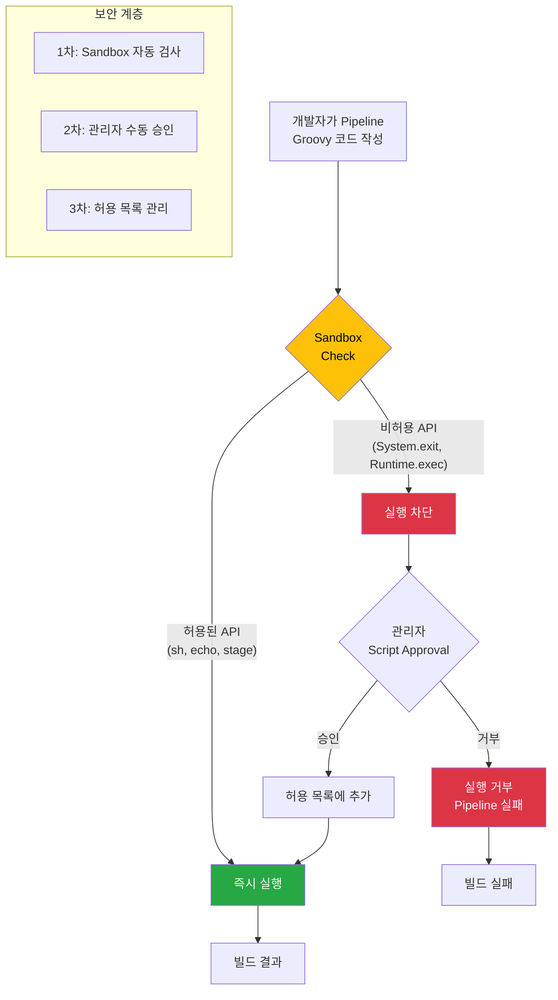

# Groovy 커스터마이징의 범위와 한계

---

> Groovy를 통한 Jenkins 커스터마이징은 사실상 무한에 가깝습니다. Jenkins의 모든 Java API에 접근할 수 있으므로, UI에서 할 수 있는 모든 것과 UI에서 할 수 없는 것까지 Groovy로 가능합니다.

| 영역              | 가능한 작업                 | 예시                                  |
| ----------------- | --------------------------- | ------------------------------------- |
| **Pipeline 확장** | 커스텀 DSL step 정의        | `deployToK8s()` 같은 도메인 전용 step |
| **전역 Hook**     | 모든 빌드에 전/후 동작 삽입 | 빌드 시작/완료 시 Slack 알림          |
| **동적 설정**     | 런타임에 설정 변경          | 특정 시간대에 Agent 수 조절           |
| **모니터링**      | 시스템 상태 수집            | 빌드 큐 길이, Agent 활용률            |
| **보안 자동화**   | 보안 정책 프로그래매틱 적용 | 사용자 권한 일괄 변경, 감사 로그      |

### 위험한 것

"할 수 있다"와 "해야 한다"는 다릅니다. Groovy의 무제한 접근 권한이 오히려 보안 사고와 운영 장애의 원인이 될 수 있습니다.

- **크레덴셜 평문 노출**: 앞서 설명한 것처럼 Script Console에서 모든 비밀값을 읽을 수 있습니다. 누군가 악의적으로 또는 실수로 크레덴셜을 로그에 출력하면, 그 로그가 빌드 아티팩트나 모니터링 시스템으로 전파될 수 있습니다.

- **init.groovy에서 외부 URL 호출**: init.groovy.d 스크립트에서 외부 URL의 코드를 다운로드하여 실행하는 패턴이 있습니다. 이것은 **공급망 공격(Supply Chain Attack)의 벡터**입니다. 외부 서버가 해킹당하면 Jenkins 시작 시마다 악성 코드가 실행됩니다.

```groovy
// ⚠️ 절대 하지 말아야 할 패턴
new GroovyShell().evaluate(
    new URL("https://example.com/init-script.groovy").text
)
```

- **시스템 프로퍼티 무분별 변경**: `System.setProperty()`로 JVM 레벨의 설정을 변경하면 Jenkins의 동작이 예측 불가능해질 수 있습니다. 예를 들어 HTTP 프록시 설정을 잘못 변경하면 플러그인 업데이트나 Git clone이 모두 실패합니다.

- **Groovy Sandbox 우회 시도**: Pipeline에서 Sandbox를 우회하려는 시도는 Script Security Plugin이 차단하지만, 우회 방법이 발견될 때마다 보안 취약점으로 보고됩니다. Jenkins 보안 어드바이저리에서 가장 빈번하게 등장하는 유형 중 하나가 Sandbox 우회입니다.


## 1. Groovy 커스터마이징 권장 여부 -- 현실적 가이드

### 권장 판단 매트릭스

| 용도                 | 대안                          | 결론                                                   |
| -------------------- | ----------------------------- | ------------------------------------------------------ |
| 초기 설정 자동화     | JCasC (Configuration as Code) | **JCasC 우선**, 불가능할 때만 init.groovy.d            |
| Pipeline 공통 로직   | Shared Library                | **Shared Library 사용**                                |
| 일회성 관리 작업     | Script Console                | **주의하여 사용**, 감사 로그 필수                      |
| 빌드 전/후 전역 동작 | Global Pipeline Libraries     | **Library 우선**, 불가능하면 init hook                 |
| 크레덴셜 등록        | JCasC + 외부 Secret Manager   | **JCasC + Vault/K8s Secret**, 불가능하면 init.groovy.d |
| 플러그인 설정 초기화 | JCasC                         | **JCasC가 거의 모든 경우 가능**                        |

- 핵심 원칙은 명확합니다. **"선언적 방법이 있으면 선언적 방법을 쓰고, 없을 때만 명령적 방법을 쓴다."** JCasC는 선언적이고, init.groovy.d는 명령적입니다.

### JCasC vs init.groovy.d 비교

**JCasC (Jenkins Configuration as Code)**는 Jenkins 설정을 YAML 파일로 선언하는 플러그인입니다. `jenkins.yaml` 파일 하나로 보안, 크레덴셜, 도구, 에이전트 설정을 모두 정의할 수 있습니다.

```yaml
# JCasC 예시: jenkins.yaml
jenkins:
  securityRealm:
    local:
      allowsSignup: false
      users:
        - id: "admin"
          password: "${JENKINS_ADMIN_PASSWORD}"
  authorizationStrategy:
    loggedInUsersCanDoAnything:
      allowAnonymousRead: false

credentials:
  system:
    domainCredentials:
      - credentials:
          - usernamePassword:
              id: "git-credentials"
              username: "${GIT_USER}"
              password: "${GIT_TOKEN}"

tool:
  jdk:
    installations:
      - name: "JDK17"
        home: "/usr/lib/jvm/java-17-openjdk"
```

**init.groovy.d**는 동일한 설정을 Groovy 코드로 명령적으로 작성합니다.

| 비교 항목       | JCasC                       | init.groovy.d                              |
| --------------- | --------------------------- | ------------------------------------------ |
| **패러다임**    | 선언적 (YAML)               | 명령적 (Groovy 코드)                       |
| **버전 관리**   | 쉬움 (YAML diff가 명확)     | 어려움 (코드 diff는 의도 파악이 힘듦)      |
| **디버깅**      | 명확한 에러 메시지          | println 디버깅, 스택 트레이스 해석 필요    |
| **재현성**      | 동일 YAML = 동일 결과       | 실행 순서, 타이밍에 따라 결과 다를 수 있음 |
| **유연성**      | 플러그인 지원 범위 내에서만 | 무제한 (Jenkins 전체 API 접근)             |
| **조건부 로직** | 제한적 (환경변수 치환 정도) | 완전한 프로그래밍 가능                     |
| **학습 곡선**   | 낮음 (YAML 작성)            | 높음 (Jenkins Internal API 이해 필요)      |

- **JCasC로 할 수 있으면 JCasC를 쓰고, JCasC로 불가능한 경우에만 init.groovy.d를 사용하며, Script Console은 긴급 상황이나 일회성 조사에만 사용합니다.** 
- 이 우선순위를 어기면 유지보수 부채가 빠르게 쌓입니다.

### Script Security Plugin

Script Security Plugin은 Pipeline에서 실행되는 Groovy 코드에 보안 경계를 설정하는 핵심 플러그인입니다. 이 플러그인이 없으면, 개발자가 Jenkinsfile에서 `System.exit(0)`을 실행하여 Jenkins를 종료하거나, 크레덴셜을 평문으로 읽어서 외부로 전송할 수 있습니다.



- **Sandbox 모드의 동작 원리**: Pipeline의 Groovy 코드는 기본적으로 Sandbox 안에서 실행됩니다. Sandbox는 허용된 API 목록(whitelist)을 유지하고, 코드가 목록에 없는 API를 호출하면 실행을 차단합니다. `sh`, `echo`, `stage`, `parallel` 같은 Pipeline DSL 기본 기능은 허용되지만, `java.lang.Runtime.exec()`, `System.exit()`, `jenkins.model.Jenkins.getInstance()` 같은 시스템 레벨 API는 차단됩니다.

- **Script Approval 프로세스**: 차단된 API가 정당한 용도로 필요한 경우, 관리자가 "Manage Jenkins > In-process Script Approval"에서 해당 메서드 시그니처를 승인할 수 있습니다. 승인된 메서드는 허용 목록에 추가되어 이후 모든 Pipeline에서 사용 가능해집니다. 이것이 왜 위험할 수 있느냐면, 한 번 승인된 메서드는 모든 Pipeline에서 사용 가능하므로, 특정 팀만을 위해 승인한 메서드가 다른 팀에 의해 악용될 수 있기 때문입니다.

- **Sandbox가 없다면 어떤 일이 벌어지는가**: 개발자가 Jenkinsfile에 악의적인 코드를 넣으면 즉시 실행됩니다. Jenkins Master의 파일 시스템에 접근하여 크레덴셜 파일을 외부로 전송하거나, 내부 네트워크를 스캔하거나, 암호화폐 채굴 프로세스를 실행할 수 있습니다. Multibranch Pipeline에서 외부 기여자의 Pull Request를 자동 빌드하는 경우 이 위험은 더욱 커집니다.