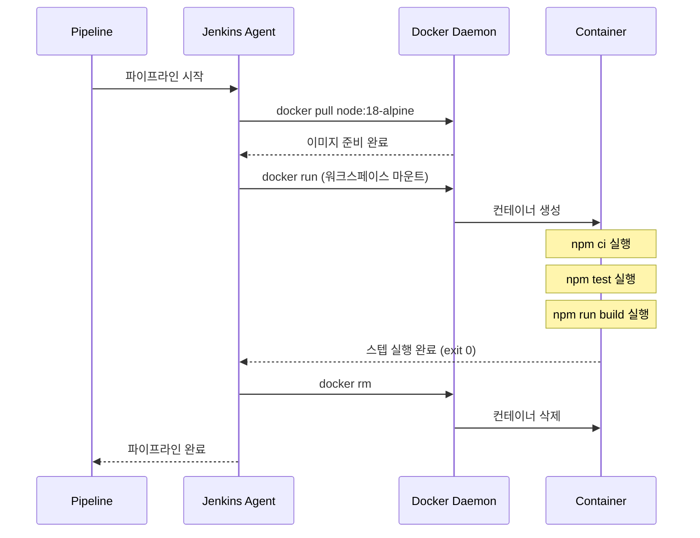
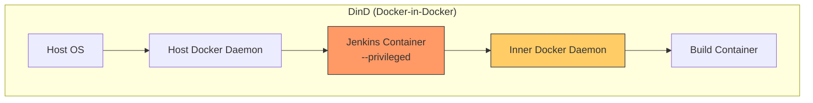
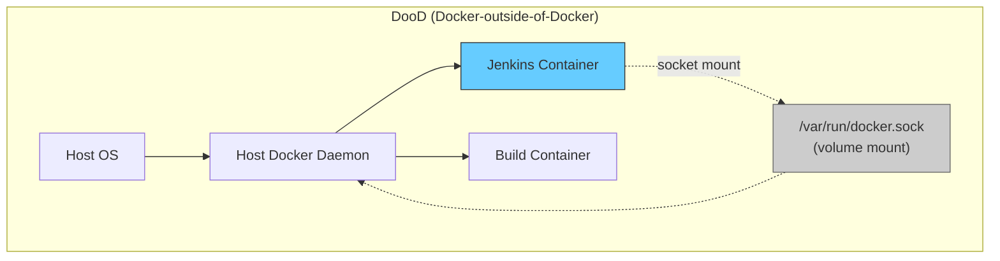
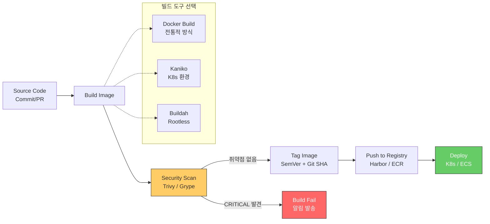

# Docker Integration

---

> **핵심 질문**: "파이프라인에서 Docker 이미지를 빌드하려면 Jenkins 자체가 Docker 안에 있어야 하는가?"
>
> 답은 "아니다"이다. Jenkins가 Docker 안에 있든 밖에 있든 Docker 이미지를 빌드할 수 있다. 중요한 것은 Jenkins가 Docker daemon에 접근할 수 있는가이며, 그 접근 방식(DinD vs DooD vs Daemonless)에 따라 보안과 성능 특성이 크게 달라진다.


## 1. Docker Agent

> **전통적인 Jenkins 빌드는 호스트 머신에 직접 설치된 도구(Node.js, JDK, Maven 등)에 의존한다**. 이 접근법에는 세 가지 근본적인 문제가 있다.
>
> 1. **환경 일관성**이 보장되지 않는다. 개발자의 로컬 머신에서는 Node 18이 설치되어 있지만 Jenkins 에이전트에는 Node 16이 설치되어 있는 상황이 빈번하게 발생한다. "내 로컬에서는 되는데요"라는 말이 나오는 근본 원인이 바로 이것이다.
> 2. **격리성**이 없다. 하나의 Jenkins 에이전트에서 여러 파이프라인이 동시에 실행될 때, 파이프라인 A가 설치한 글로벌 패키지가 파이프라인 B의 빌드를 깨뜨릴 수 있다. 빌드 간 간섭은 디버깅이 매우 어려운 종류의 장애를 만든다.
> 3. **재현성**이 떨어진다. 3개월 전에 성공했던 빌드를 지금 다시 돌리면 실패할 수 있다. 그 사이에 호스트의 도구 버전이 바뀌었기 때문이다.

### agent { docker } 패턴

Docker Agent는 이 세 가지 문제를 이미지 버전 고정으로 한 번에 해결한다. `node:18.17.0-alpine`이라고 명시하면 언제 어디서 실행하든 동일한 빌드 환경이 보장된다.

```groovy
pipeline {
    agent {
        docker {
            image 'node:18-alpine'
            // 호스트의 npm 캐시를 마운트하여 빌드 속도 향상
            args '-v $HOME/.npm:/root/.npm'
        }
    }
    stages {
        stage('Install') {
            steps {
                sh 'npm ci'
            }
        }
        stage('Test') {
            steps {
                sh 'npm test'
            }
        }
        stage('Build') {
            steps {
                sh 'npm run build'
            }
        }
    }
}
```

이 파이프라인이 실행되면 Jenkins는 다음과 같은 순서로 동작한다.

1. `docker pull node:18-alpine` -- 이미지가 로컬에 없으면 레지스트리에서 가져온다
2. `docker run` -- 해당 이미지로 컨테이너를 생성하고, Jenkins 워크스페이스를 볼륨 마운트한다
3. 컨테이너 내부에서 `sh` 스텝들을 실행한다
4. 모든 스텝이 끝나면 컨테이너를 삭제한다


스테이지마다 다른 이미지를 사용할 수도 있다. 이를 통해 빌드는 Node.js로, 배포는 AWS CLI 이미지로 실행하는 것이 가능하다.

```groovy
pipeline {
    agent none  // 파이프라인 레벨에서는 에이전트 없음
    stages {
        stage('Build') {
            agent { docker { image 'node:18-alpine' } }
            steps {
                sh 'npm ci && npm run build'
            }
        }
        stage('Deploy') {
            agent { docker { image 'amazon/aws-cli:2.13.0' } }
            steps {
                sh 'aws s3 sync ./dist s3://my-bucket'
            }
        }
    }
}
```

### Docker Agent 실행 흐름




## 2. DinD vs DooD

> Jenkins 자체를 Docker 컨테이너로 실행할 때, 파이프라인 안에서 `docker build`를 호출해야 하는 상황이 생긴다. 
>
> 이때 "Docker 안에서 Docker를 어떻게 실행할 것인가?"라는 질문에 두 가지 접근법이 존재한다.

### 2-1. Docker-in-Docker (DinD)

DinD는 Jenkins 컨테이너 내부에 별도의 Docker daemon을 실행하는 방식이다. 말 그대로 Docker 안에 또 하나의 Docker를 띄우는 것이다.



```bash
# DinD 방식으로 Jenkins 실행
docker run --privileged \
  --name jenkins-dind \
  -v jenkins-data:/var/jenkins_home \
  jenkins/jenkins:lts
```

**장점**:
- **완전한 격리**: Jenkins 컨테이너 내부의 Docker daemon은 호스트의 Docker daemon과 완전히 분리된다. 빌드에서 생성한 이미지나 컨테이너가 호스트에 영향을 주지 않는다.
- **깔끔한 환경**: 빌드가 끝나면 내부 Docker daemon의 모든 리소스를 정리할 수 있다.

**단점**:
- **`--privileged` 모드 필수**: 이것이 가장 큰 문제다. `--privileged` 플래그는 컨테이너에 호스트의 거의 모든 커널 기능에 대한 접근 권한을 부여한다. 악의적인 코드가 실행되면 컨테이너를 탈출하여 호스트를 장악할 수 있다.
- **성능 오버헤드**: Docker daemon이 두 개 실행되므로 메모리와 CPU를 추가로 소비한다. 또한 내부 Docker daemon은 자체 스토리지 드라이버를 사용하므로 레이어 캐시가 호스트와 공유되지 않는다.
- **캐시 비효율**: 호스트에 이미 존재하는 이미지 레이어를 내부 daemon에서 다시 다운로드해야 한다. CI/CD에서 이미지 캐시 효율은 빌드 속도에 직결되기 때문에 이 단점은 무시할 수 없다.

### 2-2. Docker-outside-of-Docker (DooD)

DooD는 호스트의 Docker socket(`/var/run/docker.sock`)을 Jenkins 컨테이너에 볼륨 마운트하는 방식이다. Jenkins 컨테이너 안에서 `docker` 명령을 실행하면 실제로는 호스트의 Docker daemon이 처리한다.



```bash
# DooD 방식으로 Jenkins 실행
docker run \
  --name jenkins-dood \
  -v /var/run/docker.sock:/var/run/docker.sock \
  -v jenkins-data:/var/jenkins_home \
  jenkins/jenkins:lts
```

**장점**:
- **캐시 공유**: 호스트의 Docker daemon을 사용하므로 이미지 레이어 캐시가 공유된다. 한 번 pull한 이미지는 다시 다운로드할 필요가 없다.
- **성능 우수**: 추가 Docker daemon이 없으므로 오버헤드가 거의 없다.
- **`--privileged` 불필요**: socket 마운트만으로 동작한다.

**단점**:

- **호스트 Docker에 직접 접근**: Jenkins 파이프라인이 `docker rm -f $(docker ps -aq)`를 실행하면 호스트의 모든 컨테이너가 삭제된다. 프로덕션 컨테이너가 같은 호스트에서 실행 중이라면 치명적이다.
- **네트워크/볼륨 충돌**: 빌드에서 생성한 컨테이너가 호스트 네트워크에 직접 영향을 준다. 포트 충돌이 발생할 수 있다.
- **UID 매핑 문제**: Jenkins 컨테이너의 사용자 UID와 호스트의 Docker socket 소유자 UID가 다르면 권한 오류가 발생한다.

### 비교 요약

| 항목        | DinD                    | DooD                        |
| ----------- | ----------------------- | --------------------------- |
| 격리 수준   | 완전 격리               | 호스트와 공유               |
| 보안 위험   | `--privileged` 필요     | socket 접근 = root 수준     |
| 이미지 캐시 | 공유 불가               | 호스트와 공유               |
| 성능        | 오버헤드 있음           | 거의 없음                   |
| 설정 복잡도 | 중간                    | 낮음                        |
| 권장 환경   | 높은 격리가 필요한 경우 | 성능이 중요한 개발/스테이징 |

- 현실적으로 두 방식 모두 보안 관점에서 완벽하지 않다. 
- 이것이 뒤에서 설명할 Kaniko/Buildah 같은 daemonless 빌드 도구가 등장한 이유다.


## 3. 컨테이너 빌드 파이프라인

> Jenkins의 Docker Pipeline 플러그인은 `docker.build()`와 `docker.push()` 메서드를 제공하여 파이프라인 스크립트 안에서 이미지를 빌드하고 푸시할 수 있게 한다.

```groovy
pipeline {
    agent any
    environment {
        REGISTRY = 'registry.example.com'
        IMAGE_NAME = 'myapp'
        GIT_SHA = sh(script: 'git rev-parse --short HEAD', returnStdout: true).trim()
    }
    stages {
        stage('Build Image') {
            steps {
                script {
                    // Dockerfile이 프로젝트 루트에 있다고 가정
                    def image = docker.build("${REGISTRY}/${IMAGE_NAME}:${GIT_SHA}")

                    // 빌드 성공 시 레지스트리에 푸시
                    docker.withRegistry("https://${REGISTRY}", 'registry-credentials') {
                        image.push()                    // GIT_SHA 태그로 푸시
                        image.push("${BUILD_NUMBER}")   // 빌드 번호 태그도 푸시
                    }
                }
            }
        }
    }
}
```

`docker.build()`는 내부적으로 `docker build -t <tag> .`를 실행한다. 두 번째 인자로 Dockerfile 경로나 빌드 인자를 전달할 수도 있다.

```groovy
// 특정 Dockerfile 사용 + 빌드 인자 전달
def image = docker.build(
    "${REGISTRY}/${IMAGE_NAME}:${GIT_SHA}",
    "--build-arg APP_VERSION=${VERSION} -f docker/Dockerfile.prod ."
)
```

### Multi-stage Dockerfile

Multi-stage 빌드는 CI/CD에서 특히 중요하다. 빌드에 필요한 도구(컴파일러, 테스트 프레임워크 등)와 런타임에 필요한 것(애플리케이션 바이너리, 설정 파일)을 분리하여 최종 이미지 크기를 극적으로 줄일 수 있기 때문이다.

```dockerfile
# Stage 1: 빌드 환경 (이 스테이지의 결과물은 최종 이미지에 포함되지 않음)
FROM node:18-alpine AS builder
WORKDIR /app
COPY package*.json ./
RUN npm ci
COPY . .
RUN npm run build

# Stage 2: 런타임 환경 (최종 이미지)
FROM nginx:alpine
COPY --from=builder /app/dist /usr/share/nginx/html
EXPOSE 80
CMD ["nginx", "-g", "daemon off;"]
```

- 이 Dockerfile의 결과 이미지에는 Node.js, npm, 소스 코드, node_modules가 포함되지 않는다.  오직 빌드된 정적 파일과 nginx만 포함된다. 
- 일반적으로 Node.js 빌드 이미지가 1GB 이상인 데 비해, Multi-stage 빌드의 최종 이미지는 30~50MB 수준이다. 
- 이미지가 작을수록 레지스트리 전송 시간이 줄고, 컨테이너 시작 시간이 빨라지며, 공격 표면(attack surface)도 줄어든다.

### 이미지 태깅 전략

| 전략           | 예시                  | 장점                  | 단점                                  |
| -------------- | --------------------- | --------------------- | ------------------------------------- |
| `latest`       | `myapp:latest`        | 간편함                | 어떤 버전인지 알 수 없음, 롤백 불가능 |
| `BUILD_NUMBER` | `myapp:142`           | 빌드 추적 가능        | 코드 변경과 직접 연결 안 됨           |
| `Git SHA`      | `myapp:a1b2c3d`       | 정확한 코드 버전 추적 | 사람이 읽기 어려움                    |
| `SemVer`       | `myapp:2.1.0`         | 의미적 버전 관리      | 수동 버전 관리 필요                   |
| **복합**       | `myapp:2.1.0-a1b2c3d` | 의미 + 추적성         | 태그가 길어짐                         |

- **프로덕션에서 `latest`를 사용하면 안 되는 이유**: `latest`는 "가장 최근 빌드"를 의미하지만, 여러 브랜치에서 동시에 빌드가 발생하면 어떤 커밋의 이미지가 `latest`인지 알 수 없다. 
- 롤백이 필요할 때 "이전 latest"로 돌아갈 방법이 없다. 또한 Kubernetes에서 `imagePullPolicy: Always`가 아니면 노드마다 다른 버전의 `latest`가 캐시되어 있을 수 있다.

### 완전한 Docker 빌드 파이프라인 예시

```groovy
pipeline {
    agent any
    environment {
        REGISTRY     = 'registry.example.com'
        IMAGE_NAME   = 'myteam/myapp'
        GIT_SHA      = ''
        IMAGE_TAG    = ''
    }
    stages {
        stage('Prepare') {
            steps {
                script {
                    GIT_SHA = sh(script: 'git rev-parse --short HEAD', returnStdout: true).trim()
                    IMAGE_TAG = "${env.BUILD_NUMBER}-${GIT_SHA}"
                }
            }
        }
        stage('Test') {
            agent { docker { image 'node:18-alpine' } }
            steps {
                sh 'npm ci && npm test'
            }
        }
        stage('Build Image') {
            steps {
                script {
                    docker.build("${REGISTRY}/${IMAGE_NAME}:${IMAGE_TAG}")
                }
            }
        }
        stage('Scan') {
            steps {
                // Trivy로 이미지 취약점 스캔
                sh "trivy image --exit-code 1 --severity HIGH,CRITICAL ${REGISTRY}/${IMAGE_NAME}:${IMAGE_TAG}"
            }
        }
        stage('Push') {
            steps {
                script {
                    docker.withRegistry("https://${REGISTRY}", 'registry-cred') {
                        def image = docker.image("${REGISTRY}/${IMAGE_NAME}:${IMAGE_TAG}")
                        image.push()
                        image.push('latest')  // 개발 환경 편의를 위해 latest도 푸시
                    }
                }
            }
        }
    }
    post {
        always {
            // 로컬에 남은 이미지 정리 (디스크 절약)
            sh "docker rmi ${REGISTRY}/${IMAGE_NAME}:${IMAGE_TAG} || true"
        }
    }
}
```


## 4. Registry 연동

| Registry                      | 특징                                               | 사용 환경        |
| ----------------------------- | -------------------------------------------------- | ---------------- |
| **Docker Hub**                | 기본 퍼블릭 레지스트리, 무료 플랜은 pull 제한 있음 | 오픈소스, 소규모 |
| **Harbor**                    | CNCF 졸업 프로젝트, 취약점 스캔/RBAC 내장          | 온프레미스       |
| **AWS ECR**                   | AWS IAM 기반 인증, ECS/EKS와 긴밀한 통합           | AWS 환경         |
| **GCR/Artifact Registry**     | Google Cloud IAM 기반, GKE와 통합                  | GCP 환경         |
| **GitLab Container Registry** | GitLab CI와 긴밀한 통합                            | GitLab 사용 조직 |

### Credential 관리

Jenkins에서 레지스트리 인증은 반드시 Jenkins Credentials를 통해 관리해야 한다. 파이프라인 코드에 비밀번호나 토큰을 직접 넣는 것은 절대 해서는 안 된다.

```groovy
// Jenkins Credentials에 'docker-hub-cred' ID로 저장된 Username/Password 사용
docker.withRegistry('https://index.docker.io/v1/', 'docker-hub-cred') {
    def image = docker.build("myorg/myapp:${BUILD_NUMBER}")
    image.push()
}

// AWS ECR의 경우 - Amazon ECR 플러그인 사용
docker.withRegistry(
    "https://${AWS_ACCOUNT_ID}.dkr.ecr.${AWS_REGION}.amazonaws.com",
    "ecr:${AWS_REGION}:aws-credentials"
) {
    def image = docker.build("myapp:${BUILD_NUMBER}")
    image.push()
}
```

- `docker.withRegistry()`는 블록 내에서 `docker login`을 자동으로 수행하고, 블록이 끝나면 `docker logout`을 실행한다. 
- 이 패턴을 사용하면 파이프라인 코드에 credential이 노출되지 않으며, Jenkins의 중앙 집중식 credential 관리 기능을 활용할 수 있다.


## 5. Docker 없이 이미지 빌드: Kaniko / Buildah

> 왜 Daemonless 빌드가 필요한가? DinD와 DooD는 모두 Docker daemon에 의존한다. Docker daemon은 root 권한으로 실행되며, 이는 본질적인 보안 위험을 내포한다.

- **DinD**: `--privileged` 모드가 필요하므로 컨테이너 탈출(container escape) 공격에 취약하다.
- **DooD**: Docker socket 접근은 사실상 호스트의 root 접근과 동등하다. `docker run -v /:/host alpine cat /host/etc/shadow`처럼 호스트 파일시스템 전체에 접근할 수 있기 때문이다.

Kubernetes 환경에서는 이 문제가 더 심각하다. 

- Pod Security Standards(PSS)가 `privileged` 컨테이너와 호스트 path 마운트를 제한하기 때문에, DinD와 DooD 모두 사용하기 어렵다. 
- 이런 배경에서 Docker daemon 없이도 컨테이너 이미지를 빌드할 수 있는 도구들이 등장했다.

### Kaniko

Kaniko는 Google이 개발한 도구로, Docker daemon 없이 Dockerfile에서 컨테이너 이미지를 빌드한다. Kaniko 자체가 컨테이너로 실행되며, Dockerfile의 각 명령을 사용자 공간(userspace)에서 실행하여 레이어를 생성한다.

```groovy
// Jenkins 파이프라인에서 Kaniko 사용 (Kubernetes Pod에서 실행)
pipeline {
    agent {
        kubernetes {
            yaml '''
                apiVersion: v1
                kind: Pod
                spec:
                  containers:
                  - name: kaniko
                    image: gcr.io/kaniko-project/executor:debug
                    command: ["sleep"]
                    args: ["infinity"]
                    volumeMounts:
                    - name: docker-config
                      mountPath: /kaniko/.docker
                  volumes:
                  - name: docker-config
                    secret:
                      secretName: registry-credentials
                '''
        }
    }
    stages {
        stage('Build & Push') {
            steps {
                container('kaniko') {
                    sh '''
                        /kaniko/executor \
                          --dockerfile=Dockerfile \
                          --context=dir:///workspace \
                          --destination=registry.example.com/myapp:${BUILD_NUMBER}
                    '''
                }
            }
        }
    }
}
```

- Kaniko의 핵심 특징은 `--privileged` 플래그가 필요 없다는 것이다. 
- 일반 컨테이너 권한으로 이미지를 빌드할 수 있으므로 Kubernetes의 Pod Security Standards를 준수할 수 있다.

### Buildah

Buildah는 Red Hat이 개발한 OCI 표준 이미지 빌드 도구다. Kaniko와 달리 Dockerfile 없이도 스크립트로 이미지를 빌드할 수 있으며, rootless 모드를 지원한다.

```bash
# Buildah로 이미지 빌드 (Dockerfile 사용)
buildah bud -t registry.example.com/myapp:1.0.0 .

# Buildah로 이미지 빌드 (스크립트 방식 - Dockerfile 없이)
container=$(buildah from alpine:3.18)
buildah run $container -- apk add --no-cache nodejs npm
buildah copy $container ./app /app
buildah config --workingdir /app --cmd "node server.js" $container
buildah commit $container registry.example.com/myapp:1.0.0

# 레지스트리에 푸시
buildah push registry.example.com/myapp:1.0.0
```

### 비교 테이블

| 항목               | Docker (DinD/DooD)             | Kaniko                       | Buildah                 |
| ------------------ | ------------------------------ | ---------------------------- | ----------------------- |
| Docker daemon 필요 | 필요                           | 불필요                       | 불필요                  |
| Privileged 모드    | DinD: 필요 / DooD: socket 필요 | 불필요                       | 불필요                  |
| Rootless 지원      | 제한적                         | 해당 없음 (컨테이너 내 실행) | 지원                    |
| Dockerfile 지원    | 지원                           | 지원                         | 지원 + 스크립트 방식    |
| 레이어 캐시        | 우수                           | 제한적 (원격 캐시 필요)      | 우수                    |
| Kubernetes 친화성  | 낮음 (보안 제약)               | 높음                         | 중간                    |
| 개발사             | Docker Inc.                    | Google                       | Red Hat                 |
| 주요 사용 환경     | 범용                           | Kubernetes CI/CD             | Red Hat / Podman 생태계 |

### 컨테이너 빌드 파이프라인 전체 흐름




## 핵심 정리

| 개념              | 한 줄 요약                                                   |
| ----------------- | ------------------------------------------------------------ |
| Docker Agent      | 파이프라인 스텝을 Docker 컨테이너 안에서 실행하여 빌드 환경을 코드로 관리한다 |
| DinD              | Jenkins 컨테이너 안에 Docker daemon을 추가로 실행하여 완전한 격리를 제공하지만 `--privileged`가 필요하다 |
| DooD              | 호스트 Docker socket을 마운트하여 성능은 좋지만 호스트 보안에 직접적인 위험이 있다 |
| Multi-stage Build | 빌드 의존성을 최종 이미지에서 제거하여 크기와 공격 표면을 동시에 줄인다 |
| 이미지 태깅       | Git SHA 또는 SemVer 기반 태깅으로 추적성과 롤백 가능성을 확보하고, `latest`는 프로덕션에서 사용하지 않는다 |
| Kaniko/Buildah    | Docker daemon 없이 이미지를 빌드하여 Kubernetes 환경의 보안 요구사항을 충족한다 |

