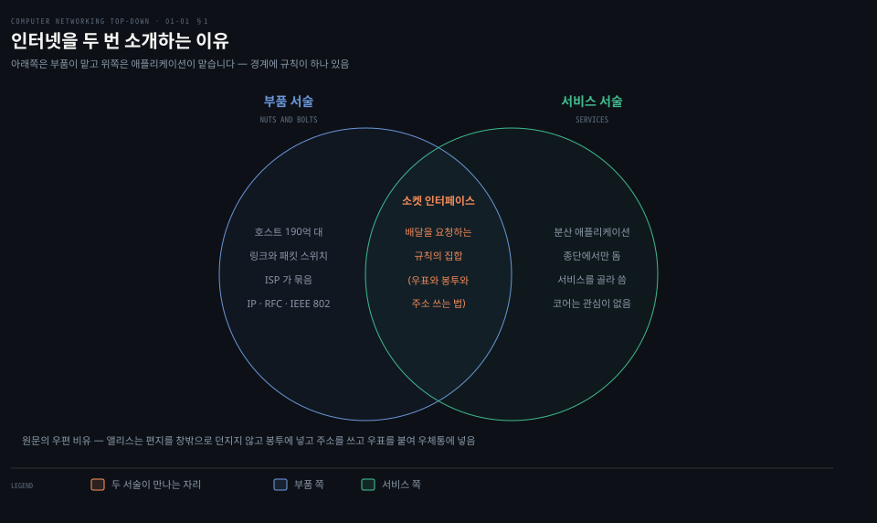
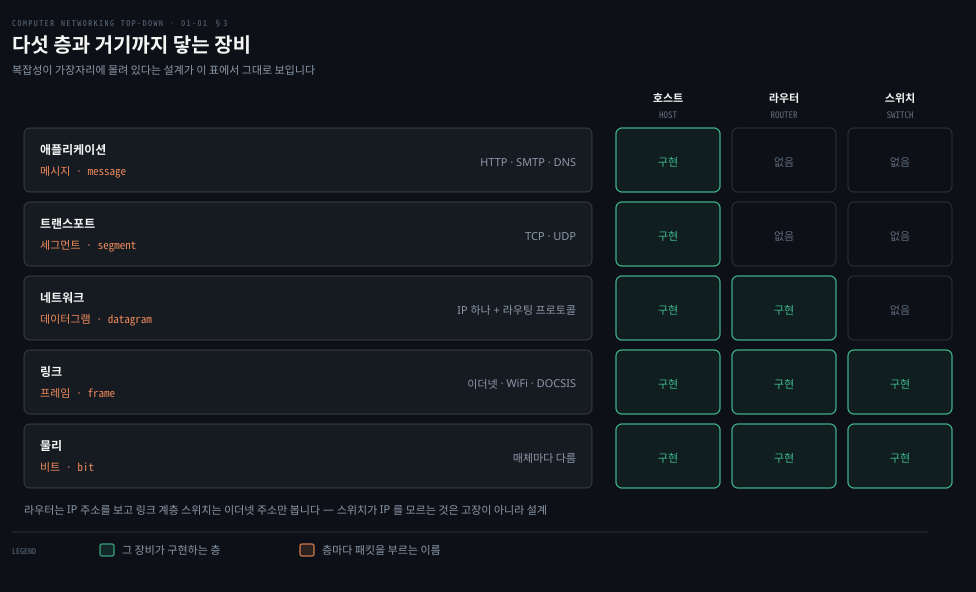
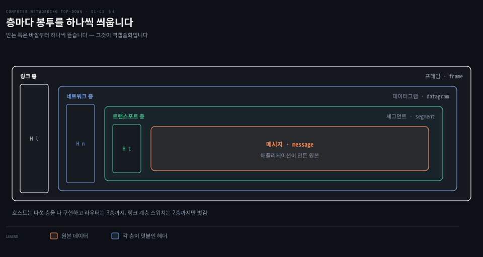
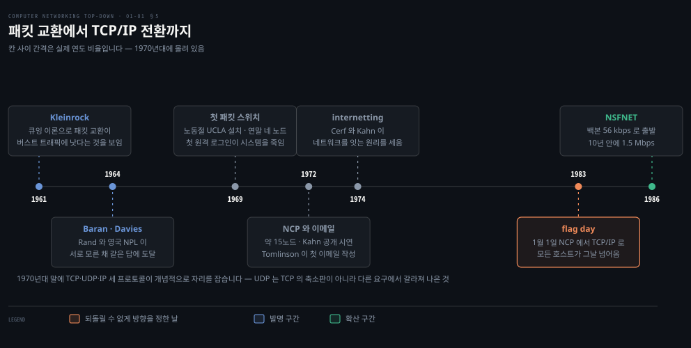

# 인터넷을 무엇이라 부르는가

---

> 1장의 첫 물음은 정의를 외우자는 것이 아닙니다. 같은 대상을 두 방향에서 서술해 보고, 그 둘이 어디서 만나는지를 찾자는 것입니다.

## 핵심 요약

> 이 편이 매달린 하나의 생각은 **인터넷은 부품 목록으로도 서비스 규약으로도 정의되며, 그 두 서술을 잇는 물건이 소켓 인터페이스와 계층 구조**라는 것입니다.

원문은 "인터넷이란 무엇인가"에 답을 하나 주지 않고 둘 줍니다. 하나는 **부품 서술**입니다. 호스트가 있고 링크가 있고 패킷 스위치가 있고 그것들을 ISP 가 묶습니다. 다른 하나는 **서비스 서술**입니다. 분산 애플리케이션에게 배달을 제공하는 인프라입니다.

두 서술이 만나는 자리가 이 편의 요점입니다. **애플리케이션은 부품을 직접 만지지 않고 소켓 인터페이스라는 규칙을 통해 배달을 요청합니다.** 원문의 우편 비유가 그것입니다. 앨리스는 편지를 창밖으로 던지지 않고 봉투에 넣고 주소를 쓰고 우표를 붙여 우체통에 넣습니다.

그 규칙을 층으로 쌓은 것이 프로토콜 스택입니다. 층을 지날 때마다 봉투가 하나씩 더 씌워지는 것이 캡슐화입니다. **이 편에서 배우는 네 어휘가 이 책의 나머지 일곱 장을 관통합니다.** 메시지·세그먼트·데이터그램·프레임입니다.


## 학습 목표

> 이 편을 읽고 나면 아래 다섯 가지를 스스로 해낼 수 있습니다.

1. 인터넷을 부품 관점과 서비스 관점 양쪽으로 설명하고, 둘이 어디서 만나는지 짚을 수 있습니다.
2. 프로토콜의 정의를 원문 그대로 말하고, 그 정의가 왜 세 요소로 이루어지는지 설명할 수 있습니다.
3. 다섯 계층의 이름과 각 층의 PDU 이름을 짝지어 댈 수 있습니다.
4. 호스트·라우터·링크 계층 스위치가 각각 어느 층까지 구현하는지 말하고, 그것이 인터넷 설계 철학과 어떻게 이어지는지 설명할 수 있습니다.
5. 캡슐화가 층마다 무엇을 덧붙이는지 그리고, 그 그림으로 나중 장의 헤더 이야기를 받을 수 있습니다.


## 1. 같은 것을 두 번 소개합니다

> 원문은 "인터넷이란 무엇인가"에 서술을 둘 준비합니다. 어느 쪽도 혼자서는 부족하기 때문입니다.



### 정의를 하나만 외우면 절반이 빕니다

"인터넷은 네트워크의 네트워크"라고만 외우면 애플리케이션 개발자가 쓸 것이 없습니다. 반대로 "소켓으로 데이터를 보내는 곳"이라고만 알면 지연이 왜 생기는지 설명할 수 없습니다. **두 서술은 경쟁하지 않고 서로의 빈자리를 채웁니다.**

### 부품 서술 — 무엇으로 이루어져 있나

원문은 장치부터 셉니다. 인터넷에 붙은 장치를 **호스트(host)** 또는 **종단 시스템(end system)** 이라 부르고, 그 수를 **2025년 190억 대, 2030년 290억 대 전망**으로 적습니다. 사람 쪽 수치도 함께 답니다. **세계 인구의 약 3분의 2가 모바일 인터넷 사용자**입니다.

호스트끼리는 **통신 링크**와 **패킷 스위치**로 이어집니다. 보낼 데이터가 생기면 보내는 쪽이 데이터를 잘라 각 조각에 헤더를 붙이는데, 그렇게 만들어진 꾸러미가 **패킷**입니다.

패킷 스위치는 두 종류가 두드러집니다.

| 종류 | 주로 서는 자리 | 이 책에서 다루는 장 |
|------|--------------|------------------|
| 라우터(router) | 네트워크 코어 | 4·5장 |
| 링크 계층 스위치(link-layer switch) | 접속망 | 6장 |

원문의 비유가 이 구조를 한 번에 잡아 줍니다. **패킷은 트럭, 통신 링크는 고속도로와 도로, 패킷 스위치는 교차로, 종단 시스템은 건물**입니다. 공장에서 화물을 쪼개 트럭 여러 대에 나눠 싣고 각 트럭이 독립적으로 달려 창고에서 다시 합쳐지는 그림입니다.

이 부품들을 묶는 것이 **ISP** 입니다. ISP 자체도 패킷 스위치와 링크로 된 네트워크입니다. 하위 ISP 들은 상위 ISP 를 통해 서로 이어집니다. **각 ISP 망은 독립적으로 운영되지만 모두 IP 를 돌리고 공통의 이름·주소 규약을 따릅니다.**

### 규약은 누가 정하나

원문이 표준화 기구를 둘 듭니다. **IETF** 가 인터넷 표준을 만들고 그 문서를 **RFC** 라 부릅니다. 이름이 "의견 요청(requests for comments)"인 것은 전신 시절의 잔재입니다. 링크 쪽 표준은 다른 기구가 맡아, **IEEE 802 LAN 표준 위원회**가 이더넷과 WiFi 를 정합니다.

> **지금은 다릅니다**: 원문은 **"현재 RFC 가 9000개에 가깝습니다"** 라고 적습니다. 원고를 쓰던 시점의 값으로 보입니다. RFC Editor 가 지금 싣고 있는 가장 큰 번호는 **RFC 10042** 이고 2026년 8월 발행입니다.[^rfc] 숫자 자체보다 **RFC 번호가 계속 늘어난다는 사실**이 요점이라, 책의 수치는 "1만 편 규모"로 읽는 편이 맞습니다.

### 서비스 서술 — 무엇을 해 주나

두 번째 서술은 각도를 완전히 바꿉니다. 인터넷을 **분산 애플리케이션에 서비스를 제공하는 인프라**로 봅니다.

여기에 원문이 못박는 조건이 하나 있습니다. **"인터넷 애플리케이션은 종단 시스템에서 돌아갑니다. 네트워크 코어의 패킷 스위치에서 돌지 않습니다."** 패킷 스위치는 데이터 교환을 거들 뿐 그 데이터의 출처나 목적지가 되는 애플리케이션에는 관심이 없습니다.

그래서 물음이 하나 남습니다. 한 종단 시스템의 프로그램이 다른 종단 시스템의 프로그램에게 데이터를 배달하라고 인터넷에 **어떻게 지시하는가**입니다. 답이 **소켓 인터페이스**입니다. 원문의 정의는 이렇습니다. **"보내는 프로그램이 따라야 하는 규칙의 집합으로, 그래야 인터넷이 목적지 프로그램에 데이터를 배달할 수 있습니다."**

위 그림의 겹치는 자리가 이것입니다. **부품 서술과 서비스 서술은 소켓 인터페이스에서 만납니다.** 아래쪽은 부품이 맡고 위쪽은 애플리케이션이 맡으며, 그 경계에 규칙이 하나 놓여 있습니다.


## 2. 프로토콜이라는 말

> 프로토콜은 형식만 정하는 것이 아닙니다. 순서와 반응까지 정해야 프로토콜입니다.

### 형식만 맞추면 통할 것 같지만

필드 배치만 맞추면 통신이 될 것 같지만 그렇지 않습니다. 언제 보내야 하는지, 답이 안 오면 무엇을 해야 하는지가 빠지면 두 쪽이 같은 형식을 쓰고도 대화가 성립하지 않습니다.

### 사람의 프로토콜

원문은 사람 사이의 예로 시작합니다. 시간을 물으려면 먼저 인사를 건넵니다. 인사가 돌아오면 물어도 된다는 뜻으로 받습니다. 다른 답이 오면 물어보지 않습니다. **아무 답이 없으면 대개 그 사람에게 묻기를 포기합니다.**

여기서 원문이 짚는 것이 셋입니다. 우리가 보내는 **특정한 메시지**, 받은 답에 대해 취하는 **특정한 행동**, 그리고 **답이 일정 시간 안에 오지 않는 것 같은 사건**입니다. 마지막 것이 중요합니다. **아무 일도 일어나지 않는 것도 프로토콜이 다뤄야 할 사건입니다.**

### 정의

원문의 정의를 그대로 옮깁니다.

> **"프로토콜은 둘 이상의 통신 개체 사이에 교환되는 메시지의 형식과 순서를, 그리고 메시지의 송수신이나 다른 사건에 대해 취해지는 행동을 정의합니다."**

세 부분으로 이루어져 있습니다. **형식 · 순서 · 행동**입니다. 셋 중 하나만 빠져도 상호운용이 되지 않는다는 것이 원문의 논지이고, "예의를 아는 사람과 모르는 사람이 만나면 아무 일도 되지 않는다"는 비유가 그 뜻입니다.

원문이 곧바로 컴퓨터 쪽 예를 붙입니다. 브라우저에 URL 을 치면 연결 요청 메시지가 나갑니다. 서버가 연결 응답을 돌려줍니다. 그제야 `GET` 메시지로 문서 이름을 보내고 서버가 파일을 돌려줍니다.

**여기에 세 요소가 다 들어 있습니다.**

- **형식** — 연결 요청·연결 응답·`GET` 이라는 메시지 종류
- **순서** — 연결이 문서 요청보다 먼저
- **행동** — 응답을 받아야 다음 단계로 갑니다


## 3. 다섯 층으로 쌓기

> 복잡한 시스템을 다루는 방법은 층으로 자르는 것입니다. 층마다 아래 층의 서비스를 쓰고 위 층에 서비스를 줍니다.



### 부품을 다 안다고 시스템이 보이지는 않습니다

앞 절에서 부품을 셌지만, 목록만으로는 이 시스템을 논할 수 없습니다. 무엇이 무엇에 의존하는지가 안 보이기 때문입니다. **층으로 자르면 "이 부분만" 이야기할 수 있게 됩니다.**

### 항공 여행이라는 유추

원문은 항공 시스템을 예로 듭니다. 승객이 거치는 순서가 여덟 단계입니다.

| 가는 길 | 오는 길 |
|--------|--------|
| 표 구입 · 짐 부치기 · 게이트 통과 · 탑승 | 착륙 · 짐 찾기 |
| 이륙 · 경로 비행 | |

이 순서를 가로로 눕히면 층이 됩니다.

층 하나하나가 **아래 층과 합쳐져** 어떤 서비스를 이룹니다. 짐 층은 이미 표를 산 사람에게만 그 서비스를 줍니다. 게이트 층은 표를 사고 짐을 부치고 게이트를 통과한 사람에게 출발 게이트에서 도착 게이트까지의 이동을 줍니다.

여기서 층 구조의 이득이 나옵니다. **"층이 위 층에 같은 서비스를 주고 아래 층에서 같은 서비스를 쓰는 한, 그 층의 구현을 바꿔도 시스템의 나머지는 그대로입니다."** 게이트에서 탑승 순서를 키 순으로 바꿔도 항공 시스템 전체는 그대로인 것과 같습니다.

원문이 여기에 단서를 답니다. **서비스의 구현을 바꾸는 것과 서비스 자체를 바꾸는 것은 완전히 다릅니다.**

### 다섯 층과 각 층의 이름

인터넷 프로토콜 스택은 다섯 층입니다.

| 층 | 하는 일 | 이 층의 패킷 이름 | 예 |
|----|--------|-----------------|-----|
| 애플리케이션 | 네트워크 애플리케이션과 그 프로토콜 | **메시지**(message) | HTTP · SMTP · DNS |
| 트랜스포트 | 애플리케이션 종단 사이로 메시지를 나름 | **세그먼트**(segment) | TCP · UDP |
| 네트워크 | 데이터그램을 한 호스트에서 다른 호스트로 | **데이터그램**(datagram) | IP · 라우팅 프로토콜 |
| 링크 | 한 노드에서 다음 노드까지 | **프레임**(frame) | 이더넷 · WiFi · DOCSIS |
| 물리 | 프레임 안의 개별 비트를 다음 노드로 | (비트) | 매체별로 다름 |

이름을 이렇게 나눠 부르는 이유가 뒤 장에서 드러납니다. **같은 데이터를 어느 층에서 보느냐에 따라 다른 이름으로 부르는 것이지, 다른 물건이 아닙니다.**

두 트랜스포트 프로토콜의 대비도 여기서 처음 나옵니다. **TCP 는 연결 지향 서비스**로 보장된 배달·흐름 제어·긴 메시지 분할·혼잡 제어를 줍니다. **UDP 는 연결 없는 서비스**로 원문의 표현대로 "군더더기 없는(no-frills)" 서비스이며 신뢰성도 흐름 제어도 혼잡 제어도 없습니다.

네트워크 층에는 IP 가 하나뿐입니다. 원문이 못박습니다. **"IP 프로토콜은 하나뿐이고, 네트워크 층을 가진 모든 인터넷 구성 요소는 IP 프로토콜을 돌려야 합니다."** 라우팅 프로토콜은 여럿이지만 IP 는 하나라, 이 층을 그냥 **IP 층**이라 부르기도 합니다.

> **원문 정오**: 애플리케이션 층을 설명하면서 DNS 를 **"`www.ietf.org` 같은 이름을 32비트 네트워크 주소로 번역하는 것"** 이라 적습니다. 32비트는 IPv4 주소만 가리킵니다. DNS 는 AAAA 레코드로 **128비트 IPv6 주소**도 돌려주며, 하필 원문이 고른 그 이름이 지금 둘 다 갖고 있습니다. 직접 물어보면 이렇게 나옵니다.
>
> ```bash
> dig +short A    www.ietf.org   # 104.16.44.99 · 104.16.45.99      (32비트 둘)
> dig +short AAAA www.ietf.org   # 2606:4700::6810:2c63 · ...:2d63  (128비트 둘)
> ```
>
> 같은 책 4장이 IPv6 를 따로 다루므로 저자가 모르는 것은 아니고, 도입부의 한 문장이 IPv4 시절 표현으로 남은 자리입니다. **"이름을 네트워크 주소로 번역한다"** 까지가 맞고 비트 수는 빼고 읽습니다.

### 층 구조의 대가

원문은 층 구조를 옹호만 하지 않습니다. **"일부 연구자와 네트워크 엔지니어는 계층화에 격렬히 반대합니다."** 그리고 이유를 둘 답니다.

- **아래 층 기능을 위 층이 중복합니다.** 많은 스택이 링크마다 한 번, 종단끼리 또 한 번 오류 복구를 합니다.
- **한 층이 다른 층에만 있는 정보를 필요로 합니다.** 타임스탬프가 그 예이고, 이것은 층 분리라는 목표를 어깁니다.

이 두 문장이 뒤 장의 여러 자리로 이어집니다. 링크 계층 재전송과 TCP 재전송이 겹치는 자리, 그리고 4장의 미들박스가 층 경계를 넘어 들여다보는 자리가 그것입니다.


## 4. 캡슐화 — 층마다 봉투를 하나씩

> 층을 내려갈 때마다 헤더가 하나씩 붙습니다. 그래서 패킷은 어느 층에서 보든 헤더와 페이로드 둘로 갈립니다.



### 캡처 화면이 왜 그렇게 겹쳐 보이는가

패킷 하나를 열면 이더넷 안에 IP 가 있고 그 안에 TCP 가 있고 또 그 안에 HTTP 가 있습니다. 이 중첩이 어디서 오는지 모르면 화면이 그냥 복잡해 보입니다. **캡슐화는 그 중첩의 생성 규칙입니다.**

### 층마다 무엇이 붙나

보내는 호스트에서 애플리케이션 메시지가 아래로 내려갑니다.

1. 트랜스포트 층이 헤더를 붙여 **세그먼트**를 만듭니다. 붙는 정보에는 메시지를 적절한 애플리케이션에 올려 줄 정보와, 전송 중 비트가 바뀌었는지 판정할 오류 검출 비트가 들어갑니다.
2. 네트워크 층이 출발지·목적지 주소 같은 헤더를 붙여 **데이터그램**을 만듭니다.
3. 링크 층이 자기 헤더를 붙여 **프레임**을 만듭니다.

그래서 원문의 결론이 나옵니다. **"각 층에서 패킷은 두 종류의 필드를 가집니다. 헤더 필드와 페이로드 필드입니다. 페이로드는 대개 위 층에서 온 패킷입니다."**

원문의 사내 우편 비유가 이 구조를 그대로 옮깁니다. 메모가 메시지입니다. 그것을 담은 사내 봉투가 세그먼트입니다. 사내 봉투를 다시 넣는 우편 봉투가 데이터그램입니다.

받는 쪽 우편실이 바깥 봉투를 뜯어 사내 봉투를 밥에게 전합니다. 밥이 마지막 봉투를 엽니다. **이 뜯어내는 과정이 역캡슐화입니다.**

원문이 단서를 하나 답니다. **캡슐화는 이보다 복잡할 수 있습니다.** 큰 메시지 하나가 여러 세그먼트로 갈리고 그 각각이 다시 여러 데이터그램으로 갈릴 수 있으며, 받는 쪽은 그 조각들로 세그먼트를 다시 세워야 합니다.

### 장비마다 구현하는 층이 다릅니다

캡슐화 그림에서 놓치기 쉬운 것이 **중간 장비는 모든 층을 구현하지 않는다**는 점입니다.

| 장비 | 구현하는 층 | 그래서 |
|------|-----------|--------|
| 호스트 | 1~5층 전부 | 애플리케이션이 여기서만 돕니다 |
| 라우터 | 1~3층 | IP 주소를 봅니다 |
| 링크 계층 스위치 | 1~2층 | IP 주소를 못 보고 이더넷 주소만 봅니다 |

원문이 이 표에서 설계 철학을 끌어냅니다. **"호스트는 다섯 층을 모두 구현합니다. 이것은 인터넷 아키텍처가 복잡성의 상당 부분을 네트워크 가장자리에 둔다는 관점과 일치합니다."**

이 한 문장이 이 책 전체의 밑그림입니다. 코어는 단순하게 두고 똑똑한 일은 끝에서 하는 설계이며, 3장의 TCP 가 왜 종단에서만 도는지, 4장의 라우터가 왜 그렇게 적은 일만 하는지가 여기서 예고됩니다.


## 5. 어쩌다 이 모양이 됐나

> 지금의 모양은 필연이 아니었습니다. 전화망이 지배하던 시절에 다른 답을 낸 사람들이 있었습니다.



### 왜 이렇게 생겼는지는 역사가 답합니다

계층이 왜 다섯인지, TCP 와 IP 가 왜 갈라져 있는지는 규격을 읽어도 나오지 않습니다. **그 결정이 내려진 자리를 봐야 합니다.**

### 패킷 교환의 발명 — 1961~1972

1960년대 초에는 전화망이 세계의 지배적 통신망이었습니다. 전화망은 회선 교환을 씁니다. 그런데 시분할 컴퓨터를 쓰는 사용자가 만드는 트래픽은 성격이 달랐습니다. **명령 하나를 보낸 뒤 답을 기다리거나 생각하는 동안에는 아무것도 보내지 않는 버스트성** 트래픽입니다.

세 연구 그룹이 **서로의 작업을 모른 채** 패킷 교환을 발명합니다.

| 연구자 | 소속 | 무엇을 했나 |
|--------|------|------------|
| Leonard Kleinrock | MIT 대학원생 | 큐잉 이론으로 버스트 트래픽에 패킷 교환이 효과적임을 보였습니다 (1961·1964) |
| Paul Baran | Rand | 군용 음성망의 안전한 전송에 패킷 교환을 검토했습니다 (1964) |
| Donald Davies · Roger Scantlebury | 영국 NPL | 같은 시기에 패킷 교환 개념을 발전시켰습니다 |

그리고 만들어 보이는 쪽이 뒤를 잇습니다. Lawrence Roberts 가 1967년 ARPAnet 의 전체 계획을 발표합니다. **1969년 노동절에 UCLA 에 첫 패킷 스위치**가 설치됩니다. 연말까지 SRI·UC 산타바바라·유타 대학이 붙어 **네 노드**가 됩니다. Kleinrock 이 회고하는 첫 사용은 UCLA 에서 SRI 로 원격 로그인을 시도한 것이었고, **시스템을 죽였습니다.**

1972년에는 약 15개 노드로 늘고 Robert Kahn 이 첫 공개 시연을 합니다. 첫 호스트 대 호스트 프로토콜인 **NCP** 가 완성되고, 종단 간 프로토콜이 생기자 애플리케이션을 쓸 수 있게 됩니다. **같은 해에 Ray Tomlinson 이 최초의 이메일 프로그램을 씁니다.**

### 네트워크들을 잇기 — 1972~1980

초기 ARPAnet 은 닫힌 망 하나였습니다. 1970년대 중반이 되자 독립적인 패킷 교환망이 여럿 생깁니다. ALOHANet·패킷 위성망·패킷 라디오망·Telenet·Cyclades·IBM SNA 가 그것입니다.

여기서 결정적인 작업이 나옵니다. Vinton Cerf 와 Robert Kahn 이 **네트워크를 잇는 네트워크**를 만드는 원리를 세웠고, 그 작업을 부르는 말로 **internetting** 이라는 용어가 생깁니다.

그 원리가 TCP 에 담겼는데, **초기 TCP 는 지금의 TCP 와 상당히 달랐습니다.** 초기 TCP 는 종단 재전송을 통한 신뢰성 있는 순서 배달과 **포워딩 기능을 함께** 갖고 있었습니다. 포워딩은 지금 IP 가 하는 일입니다.

분리를 부른 것은 요구였습니다. 패킷 음성처럼 **신뢰성도 흐름 제어도 없는 종단 간 전송**이 필요한 애플리케이션이 있다는 인식이 TCP 에서 IP 를 떼어 내고 UDP 를 만들게 합니다. **오늘의 TCP·UDP·IP 세 프로토콜은 1970년대 말에 개념적으로 자리를 잡습니다.**

이 대목이 3장과 4장을 미리 설명합니다. **UDP 는 TCP 에서 기능을 뺀 것이 아니라, 애초에 다른 요구에서 갈라져 나온 것입니다.**

같은 시기에 다른 축도 자랍니다. Norman Abramson 의 **ALOHA 프로토콜이 최초의 다중 접속 프로토콜**이고, Metcalfe 와 Boggs 가 그 위에서 **이더넷**을 만듭니다. 6장의 다중 접속 프로토콜이 여기서 시작합니다.

### 망의 증식과 전환 — 1980~1990

1970년대 말 ARPAnet 호스트는 약 200대였는데, 1980년대 말 공개 인터넷 호스트는 **10만 대**에 이릅니다. BITNET·CSNET 이 대학을 잇고, 1986년 **NSFNET** 이 백본을 맡아 초기 56 kbps 에서 10년 안에 1.5 Mbps 로 올라갑니다.

그리고 이 편에서 가장 인상적인 사건이 나옵니다. **1983년 1월 1일, ARPAnet 의 표준 호스트 프로토콜이 NCP 에서 TCP/IP 로 공식 전환됩니다.** 원문은 이것을 **flag day** 라 부릅니다. **모든 호스트가 그날부로 TCP/IP 로 넘어오도록 요구된** 전환이었습니다.

> **노트의 읽기**: flag day 라는 말이 지금 실무에서 갖는 무게를 원문은 적지 않습니다. 호스트가 200대 수준일 때는 하루에 전부 바꾸는 것이 가능했지만, 지금은 어떤 프로토콜도 그렇게 바꿀 수 없습니다. **IPv6 전환이 30년째 점진적으로 진행되는 이유가 바로 이것입니다.** 4장에서 IPv4/IPv6 공존 메커니즘을 볼 때 이 대비를 떠올리면 왜 그런 장치가 필요한지가 바로 읽힙니다.


## 층과 이름 치트시트

| 무엇을 물었을 때 | 답 |
|----------------|-----|
| 애플리케이션 층의 패킷 이름은 | 메시지 |
| 트랜스포트 층의 패킷 이름은 | 세그먼트 |
| 네트워크 층의 패킷 이름은 | 데이터그램 |
| 링크 층의 패킷 이름은 | 프레임 |
| 라우터가 보는 가장 높은 층은 | 3층 네트워크 |
| 링크 계층 스위치가 보는 가장 높은 층은 | 2층 링크 |
| 애플리케이션이 도는 곳은 | 종단 시스템만 |
| IP 는 몇 개인가 | 하나. 네트워크 층을 가진 모든 구성 요소가 같은 IP 를 돌립니다 |
| 프로토콜을 이루는 세 요소는 | 형식 · 순서 · 행동 |


## 심화 학습

> 9판은 2025년 책이라 대부분 현행과 맞습니다. 어긋나는 자리는 숫자 쪽입니다.

| 원문 | 현행(2026) | 성격 |
|------|-----------|------|
| "RFC 가 9000개에 가깝다" | RFC Editor 의 최신 번호는 10042 입니다[^rfc] | 숫자가 낡음 |
| DNS 가 이름을 "32비트 주소"로 | AAAA 로 128비트도 돌려줍니다 | 정오 |
| 연결 장치 190억 대(2025) | 원문이 든 전망치 그대로입니다 | 유지 |
| 다섯 계층 스택 | 그대로 | 유지 |
| 메시지·세그먼트·데이터그램·프레임 | 그대로 | 유지 |

원문이 다루지 않는 축이 둘 있습니다.

첫째는 **다섯 층과 일곱 층의 관계**입니다. 이 책은 인터넷 스택을 다섯 층으로 세우는데, 실무에서 자주 듣는 OSI 는 일곱 층입니다. 차이는 애플리케이션 층을 셋(애플리케이션·표현·세션)으로 쪼갰느냐입니다. **현장에서 "L7 로드밸런서"라 할 때의 7은 OSI 번호이고, 이 책의 5층 스택에서는 같은 자리가 5층입니다.** 층 번호로 이야기할 때는 어느 모델인지 먼저 맞춰야 합니다.

둘째는 **캡슐화가 한 번만 일어나지 않는다**는 점입니다. 원문의 그림은 층마다 봉투 하나를 상정합니다. 터널을 쓰면 IP 안에 다시 IP 가 들어갑니다. 이 저장소의 [`networking/`](../../networking/README.md) 문서가 다루는 VXLAN·IPsec·WireGuard 가 전부 그 모양입니다. 봉투가 하나 더 붙으니 그만큼 실을 수 있는 데이터가 줄고, 그래서 MTU 문제가 따라옵니다. **6장의 VXLAN 절에서 이 축이 다시 나옵니다.**

```bash
# 캡슐화를 눈으로 보려면 — Wireshark 책 02-02 의 Details 창이 층마다 한 줄입니다
tshark -r <capture>.pcap -V -c 1 | grep -E "^(Frame|Ethernet|Internet|Transmission|Hypertext)"
```


## 면접 대비

### 한 줄 정의

"인터넷은 호스트·링크·패킷 스위치·ISP 로 이루어진 부품의 집합이면서 동시에 분산 애플리케이션에 배달을 제공하는 인프라이고, 두 서술은 소켓 인터페이스에서 만납니다."

### 핵심 포인트 세 가지

1. **프로토콜은 형식만이 아니라 순서와 행동까지 정의합니다.** 답이 오지 않는 것도 프로토콜이 다뤄야 할 사건이고, 이것이 타임아웃과 재전송의 근거입니다.
2. **복잡성은 가장자리에 있습니다.** 호스트만 다섯 층을 전부 구현하고 라우터는 3층까지, 스위치는 2층까지입니다. 이 설계가 TCP 를 종단에만 두는 이유입니다.
3. **TCP 와 IP 는 원래 하나였습니다.** 패킷 음성처럼 신뢰성이 필요 없는 애플리케이션 때문에 갈라졌고, 그 부산물이 UDP 입니다. UDP 는 TCP 의 축소판이 아닙니다.

### 자주 묻는 질문

Q: 계층화의 단점을 말해 보십시오.
A: 원문이 둘 듭니다. 아래 층 기능을 위 층이 중복하는 것과, 한 층이 다른 층에만 있는 정보를 필요로 하는 것입니다. 링크 재전송과 TCP 재전송이 겹치는 자리가 전자의 예입니다.

Q: 라우터는 왜 애플리케이션을 모릅니까?
A: 3층까지만 구현하기 때문입니다. 그리고 그것이 의도된 설계입니다. 코어를 단순하게 두고 복잡한 일은 종단에 두는 것이 인터넷 아키텍처의 방향입니다.

Q: 같은 데이터를 왜 층마다 다른 이름으로 부릅니까?
A: 다른 물건이 아니라 어느 층에서 보느냐의 차이입니다. 이름이 갈려 있어야 "세그먼트가 여러 데이터그램으로 갈렸다" 같은 문장을 애매하지 않게 쓸 수 있습니다.


## 핵심 개념 체크리스트

- [ ] 인터넷을 부품 관점과 서비스 관점으로 각각 설명할 수 있습니까?
- [ ] 두 관점이 만나는 자리가 무엇인지 말할 수 있습니까?
- [ ] 프로토콜의 정의를 세 요소로 나눠 말할 수 있습니까?
- [ ] 다섯 층의 이름과 각 층의 PDU 이름을 짝지을 수 있습니까?
- [ ] 호스트·라우터·스위치가 각각 몇 층까지 구현하는지 댈 수 있습니까?
- [ ] 캡슐화가 층마다 무엇을 덧붙이는지 그릴 수 있습니까?
- [ ] TCP 에서 IP 가 왜 분리됐는지 설명할 수 있습니까?
- [ ] flag day 전환이 지금은 왜 불가능한지 말할 수 있습니까?


## 관련 문서

- [01-02 가장자리에 무엇이 붙는가](./01-02.가장자리에 무엇이 붙는가.md) — 이 편의 다음. 부품 서술의 "링크" 를 실제 접속망으로 채웁니다
- [Wireshark 책 02-02 잡은 패킷을 읽는 법](../paw_packet-analysis-wireshark/02-02.%EC%9E%A1%EC%9D%80%20%ED%8C%A8%ED%82%B7%EC%9D%84%20%EC%9D%BD%EB%8A%94%20%EB%B2%95.md) — 이 편의 캡슐화가 화면에서 어떻게 보이는지
- [02_os/networking](../../networking/README.md) — 같은 계층이 리눅스 커널에서 구현된 모습
- [Computer Networking — 정독 인덱스](./README.md) — 8개 장 전체 지도


## 참고 자료

- 원본: 《Computer Networking: A Top-Down Approach》 9판 (James F. Kurose · Keith W. Ross, Pearson)
- 다룬 범위: §1.1 What Is the Internet · §1.5 Protocol Layers and Their Service Models · §1.7 History of Computer Networking and the Internet
- [RFC Editor](https://www.rfc-editor.org/) — RFC 시리즈 현황
- [IETF](https://www.ietf.org/) — 원문이 인터넷 표준 제정 기구로 드는 곳
- [IEEE 802 LAN/MAN Standards Committee](https://www.ieee802.org/) — 원문이 이더넷·WiFi 표준 기구로 드는 곳

[^rfc]: RFC Editor 홈페이지의 최근 발행 목록 — 실린 가장 큰 번호는 RFC 10042 "Post-Quantum/Traditional Hybrid Key Exchange with the Module-Lattice-Based Key-Encapsulation Mechanism for Use in SSH" 이고 2026년 8월 발행입니다. <https://www.rfc-editor.org/> (2026-09-05 조회)
