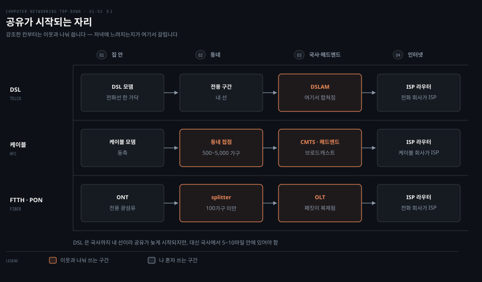
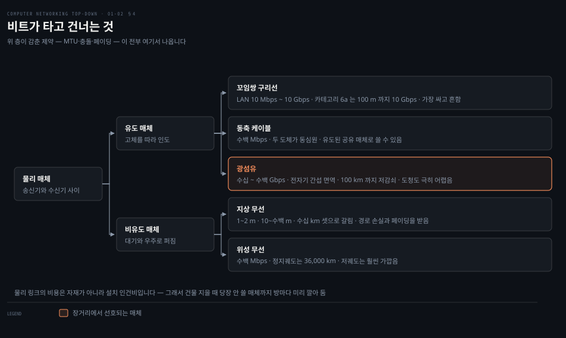

# 가장자리에 무엇이 붙는가

---

> 앞 편이 인터넷을 두 방향에서 서술했다면, 이 편은 그 부품 서술의 "링크" 를 실제 접속망으로 채웁니다.

## 핵심 요약

> 이 편이 매달린 하나의 생각은 **접속망을 가르는 기준이 속도가 아니라 어디서부터 남과 공유되기 시작하는가**라는 것입니다.

원문은 접속망을 다섯 갈래로 늘어놓습니다. DSL·케이블·FTTH·고정 무선·저궤도 위성입니다. 광고에 적히는 속도만 보면 서로 비슷해 보이지만, 실제 체감을 가르는 것은 다른 축입니다.

**케이블은 동네부터 공유 브로드캐스트 매체입니다.** 원문이 못박습니다. 헤드엔드가 보낸 모든 패킷이 모든 집으로 갑니다. 그래서 같은 동네에서 여러 사람이 동시에 내려받으면 각자가 받는 속도가 크게 떨어집니다. **DSL 은 전화국까지 내 선이라 그 문제가 없는 대신 거리 제약을 받습니다.**

물리 매체 쪽에도 같은 종류의 대비가 있습니다. 원문이 짚는 비용 구조가 그것입니다. **케이블 자재비보다 설치 인건비가 자릿수 단위로 더 큽니다.** 그래서 건물을 지을 때 당장 안 쓸 매체까지 방마다 미리 깔아 둡니다.


## 학습 목표

> 이 편을 읽고 나면 아래 다섯 가지를 스스로 해낼 수 있습니다.

1. 접속망 다섯 갈래를 들고, 각각 어디서부터 남과 공유되는지 말할 수 있습니다.
2. DSL 의 세 주파수 대역이 무엇을 나르는지 설명하고, 왜 비대칭인지 말할 수 있습니다.
3. 케이블 접속이 공유 매체라는 사실에서 체감 속도의 변동을 설명할 수 있습니다.
4. PON 구조에서 ONT·splitter·OLT 가 각각 어디에 있는지 그릴 수 있습니다.
5. 유도 매체와 비유도 매체를 나누고, 각 매체의 전형적 전송률 자릿수를 댈 수 있습니다.


## 1. 가장자리에 서 있는 것

> 가장자리에는 우리가 매일 쓰는 장치가 있습니다. 그리고 그 반대편에는 우리가 못 보는 데이터센터가 있습니다.

### 클라이언트만 생각하면 절반이 빕니다

가장자리라고 하면 노트북과 휴대폰만 떠올리기 쉽습니다. 그런데 우리가 받는 검색 결과·메일·동영상이 나오는 쪽도 똑같이 가장자리에 있습니다. **양쪽 다 종단 시스템입니다.**

### 호스트 = 종단 시스템

원문이 용어를 정리합니다. 인터넷에 붙은 컴퓨터와 장치를 **종단 시스템(end system)** 이라 부르는 이유는 인터넷의 가장자리에 앉아 있기 때문입니다. 같은 것을 **호스트(host)** 라고도 부르는데, 애플리케이션 프로그램을 호스팅한다는 뜻입니다.

원문이 단서를 답니다. **"이 책 전체에서 호스트와 종단 시스템을 바꿔 써도 되는 말로 씁니다. 곧 호스트 = 종단 시스템입니다."**

호스트는 다시 둘로 갈립니다. **클라이언트**는 데스크톱·노트북·스마트폰 쪽이고, **서버**는 웹 페이지를 저장·배포하고 동영상을 스트리밍하고 메일을 중계하는 더 강력한 기계 쪽입니다. 원문이 "비공식적으로(informally)"라는 단서를 붙여 이 구분이 엄밀한 분류가 아님을 알립니다.

### 서버는 데이터센터에 있습니다

원문이 규모를 숫자로 답니다. **2024년 말 기준 구글은 네 대륙에 33개 데이터센터**를 두고 있고, 그 안에 수백만 대의 서버가 있습니다.

데이터센터의 목적을 원문은 아마존을 예로 셋으로 나눕니다.

| 목적 | 하는 일 |
|------|--------|
| 콘텐츠 제공 | 상품과 구매 정보를 담은 전자상거래 페이지를 사용자에게 |
| 대규모 병렬 계산 | 아마존 자체의 데이터 처리 작업 |
| 클라우드 제공 | 다른 회사에 컴퓨팅을 빌려줌 (AWS) |

세 번째가 지금의 흐름입니다. 원문의 표현대로 **Airbnb 를 비롯한 많은 인터넷 기반 회사가 자기 데이터센터를 소유·운영하지 않고 웹 서비스 전체를 아마존 클라우드에서 돌립니다.**

데이터센터 안의 기계도 구체적으로 적습니다. 호스트를 **블레이드(blade)** 라 부르고 **피자 상자를 닮았다**고 묘사합니다. CPU·메모리·디스크를 갖춘 범용 기계입니다. **랙 하나에 보통 20~40장**이 꽂힙니다. 랙끼리는 정교한 데이터센터 네트워크 설계로 이어지며, 그 설계는 6장이 맡습니다.


## 2. 집에서 인터넷까지 — 어디서부터 공유되는가

> 접속망은 종단 시스템을 첫 라우터에 물리적으로 잇는 망입니다. 갈래마다 공유가 시작되는 자리가 다릅니다.



### 같은 속도인데 왜 저녁에만 느려지는가

계약 속도가 같은데 저녁 시간에만 느려지는 집이 있고 아닌 집이 있습니다. 광고 숫자로는 설명되지 않습니다. **차이는 내 선이 어디서부터 남의 것과 합쳐지는가에 있습니다.**

### 접속망의 정의와 보급

원문이 접속망을 이렇게 정의합니다. **"종단 시스템을, 그 종단 시스템에서 다른 먼 종단 시스템으로 가는 경로 위의 첫 라우터(엣지 라우터라고도 합니다)에 물리적으로 연결하는 망."**

보급률도 답니다. **2023년 기준 유럽과 미국 가구의 80% 이상**이 인터넷 접속을 갖고 있으며, 원문은 곧바로 단서를 붙입니다. 세계적으로도 인구 집단별로도 **디지털 격차(digital divide)** 가 존재합니다.

주거용 광대역 접속에서 가장 널리 쓰이는 셋은 **DSL · 케이블 · FTTH** 입니다.

### DSL — 전화선을 주파수로 쪼갭니다

DSL 은 전화 회사의 기존 설비를 씁니다. 그래서 **DSL 을 쓰면 전화 회사가 곧 ISP** 입니다. 집의 DSL 모뎀이 전화국(CO)에 있는 **DSLAM** 과 이야기합니다.

핵심은 한 가닥의 전화선을 주파수로 셋으로 나눈다는 것입니다.

| 채널 | 대역 | 나르는 것 |
|------|------|----------|
| 하향 고속 | 50 kHz ~ 1 MHz | 인터넷 다운로드 |
| 상향 중속 | 4 kHz ~ 50 kHz | 인터넷 업로드 |
| 일반 전화 | 0 ~ 4 kHz | 통화 |

원문이 이 효과를 정확히 적습니다. **"이 방식은 하나의 DSL 링크를 마치 세 개의 별도 링크인 것처럼 보이게 만들어, 전화 통화와 인터넷 연결이 동시에 DSL 링크를 공유할 수 있게 합니다."** 이 기법이 주파수 분할 다중화이고 다음 편에서 다시 나옵니다.

속도와 제약도 숫자로 있습니다. 최신 DSL 표준은 **짧은 거리에서 하향 최대 1 Gbps, 상향 최대 500 Mbps** 를 제공합니다. 하향과 상향이 다르므로 **비대칭** 접속이라 부릅니다.

그런데 이 최대치는 잘 안 나옵니다. 원문이 이유를 셋 답니다. 사업자가 등급제 요금을 위해 일부러 제한하는 경우, **집과 CO 사이의 거리**, 그리고 꼬임쌍선의 굵기와 전기적 간섭입니다. 거리 제약은 특히 뚜렷합니다. **집이 CO 로부터 5~10마일 안에 있지 않으면 다른 방식을 찾아야 합니다.**

### 케이블 — 동네부터 공유입니다

케이블 접속은 케이블 TV 회사의 설비를 씁니다. 헤드엔드에서 동네 접점까지는 광섬유이고, 거기서 각 집까지는 동축 케이블이라 **HFC(hybrid fiber coax)** 라 부릅니다. **동네 접점 하나가 보통 500~5,000 가구**를 감당합니다. 헤드엔드의 **CMTS** 가 DSL 쪽 DSLAM 과 같은 역할을 합니다.

여기서 원문이 이 편에서 가장 중요한 문장을 씁니다.

> **"케이블 인터넷 접속의 중요한 특징 하나는 그것이 공유 브로드캐스트 매체라는 점입니다. 특히 헤드엔드가 보낸 모든 패킷은 하향으로 모든 링크를 타고 모든 집으로 가며, 집에서 보낸 모든 패킷은 상향 채널을 타고 헤드엔드로 갑니다."**

결과가 바로 따라옵니다. **여러 사용자가 동시에 동영상 파일을 내려받으면 각자가 받는 실제 속도는 케이블 하향 총량보다 훨씬 낮아집니다.** 반대로 활성 사용자가 적고 다들 웹 서핑만 한다면, 요청 시점이 정확히 겹칠 일이 드물어 각자 최대 속도로 받을 수도 있습니다.

상향도 공유이므로 충돌을 피할 **분산 다중 접속 프로토콜**이 필요합니다. 6장의 주제가 여기서 예고됩니다.

DOCSIS 표준의 속도는 이렇습니다.

| 표준 | 하향 | 상향 |
|------|------|------|
| DOCSIS 2.0 | 40 Mbps | 30 Mbps |
| DOCSIS 3.0 | 1.2 Gbps | 100 Mbps |

> **지금은 다릅니다**: 원문이 드는 최신 표준은 DOCSIS 3.0 입니다. 현재 CableLabs 가 내놓은 것은 **DOCSIS 4.0** 이고 하향 10 Gbps · 상향 6 Gbps 급을 목표로 합니다. 표준 번호가 올라가도 **공유 브로드캐스트 매체라는 성질은 그대로**이므로, 원문이 짚은 체감 속도 변동은 여전히 유효합니다.

### FTTH — splitter 부터 공유입니다

FTTH 는 CO 에서 집까지 광섬유를 직접 놓습니다. 가장 단순한 것이 집마다 한 가닥을 놓는 **direct fiber** 인데, 실제로는 CO 를 나온 한 가닥을 여러 집이 나눠 쓰다가 집 가까이에서 갈라지는 쪽이 흔합니다.

가르는 방식이 둘입니다. **AON(능동 광 네트워크)** 은 본질적으로 스위치드 이더넷이고, **PON(수동 광 네트워크)** 은 갈림을 전기 없이 처리합니다. 원문이 PON 을 자세히 다룹니다.

| 구성요소 | 어디에 | 하는 일 |
|---------|--------|--------|
| ONT | 집 | 광 종단 장치. 집 라우터가 여기 붙습니다 |
| splitter | 동네 | 보통 100가구 미만을 한 가닥으로 합칩니다 |
| OLT | 전화국(CO) | 광 신호와 전기 신호를 변환하고 라우터로 넘깁니다 |

여기서도 공유의 성질이 나옵니다. **"PON 구조에서 OLT 가 splitter 로 보낸 모든 패킷은 splitter 에서 복제됩니다."** 케이블 헤드엔드와 같은 모양입니다.

위 그림이 이 셋을 나란히 놓은 것입니다.

- **DSL** — CO 까지 내 선입니다
- **케이블** — 동네 접점부터 공유입니다
- **PON** — splitter 부터 공유입니다

공유가 시작되는 자리가 저녁에 느려지는지 아닌지를 정합니다.

### 선을 놓기 어려운 곳 — 고정 무선과 저궤도 위성

**고정 무선 인터넷(FWI)** 은 CO 에서 집까지 케이블을 까는 비용과 고장을 피합니다. 5G 고정 무선은 빔포밍으로 기지국에서 집 안의 모뎀까지 무선으로 데이터를 보내고, 그 모뎀에 WiFi 공유기를 붙입니다.

**저궤도(LEO) 위성**도 광대역 접속에 점점 많이 쓰입니다. 원문이 SpaceX 의 Starlink 를 예로 들며 **정지궤도 위성보다 전파 지연이 훨씬 낮다**는 점을 강조합니다. 특히 지상 설비를 놓기 어려운 시골과 오지가 대상입니다.


## 3. 회사와 캠퍼스, 그리고 이동 중

> 기업과 대학은 LAN 으로 엣지 라우터에 붙습니다. 이동 중에는 셀룰러 기지국에 붙습니다.

### 회사 망은 왜 다른 이야기인가

집 접속망은 사업자가 놓아 준 선을 받아 쓰는 이야기입니다. 회사와 캠퍼스는 **자기 망을 자기가 놓습니다.** 그래서 등장하는 부품이 다릅니다.

### 이더넷

원문이 못박습니다. **LAN 기술은 여러 가지가 있지만 이더넷이 기업·대학·가정 네트워크에서 압도적으로 가장 널리 쓰이는 접속 기술입니다.** 사용자는 꼬임쌍 구리선으로 이더넷 스위치에 붙고, 그 스위치가 다시 더 큰 인터넷으로 이어집니다.

속도는 자리에 따라 다릅니다. **사용자는 보통 100 Mbps 에서 수십 Gbps** 로 스위치에 붙고, **서버는 1 Gbps 에서 10 Gbps** 로 붙습니다.

### WiFi

무선 LAN 에서는 사용자가 **접속점(access point)** 과 패킷을 주고받고, 그 접속점은 대개 유선 이더넷으로 기업 망에 붙어 있습니다. 거리 제약이 뚜렷합니다. **무선 LAN 사용자는 보통 접속점으로부터 수십 미터 안에** 있어야 합니다.

IEEE 802.11 기반의 이 접속이 곧 WiFi 이고, 원문은 오늘날 **100 Mbps 를 넘는 공유 전송률**을 제공한다고 적습니다. "공유"라는 말이 여기서도 붙는다는 점이 눈여겨볼 자리입니다.

원문은 이 둘이 원래 기업용이었다가 가정으로 내려왔다고 정리합니다. 많은 집이 **광대역 주거 접속(케이블 모뎀이나 DSL)에 값싼 무선 LAN 을 결합해** 가정 네트워크를 만듭니다.

### 광역 무선 — 4G 와 5G

셀룰러는 거리 규모가 다릅니다. **WiFi 와 달리 사용자는 기지국으로부터 수십 킬로미터 안에만 있으면 됩니다.** 수십 미터와 수십 킬로미터의 차이입니다.

속도는 **4G 가 실사용 다운로드 최대 60 Mbps** 이고, 더 빠른 5G 가 이미 배포되고 있습니다. 자세한 것은 7장이 맡습니다.


## 4. 비트가 실제로 지나가는 것

> 물리 매체는 비트 하나가 송신기에서 수신기로 건너갈 때 타는 것입니다. 경로마다 종류가 달라도 됩니다.



### 매체를 왜 알아야 하는가

상위 층만 보면 매체는 안 보입니다. 그런데 4장의 MTU, 6장의 충돌, 7장의 페이딩이 전부 매체의 성질에서 나옵니다. **매체는 위 층이 감춘 제약의 출처입니다.**

### 비트 하나의 짧은 생애

원문의 서술이 좋습니다. 비트 하나가 출발지에서 목적지로 가는 동안 **일련의 송신기-수신기 쌍**을 지납니다. 각 쌍마다 비트는 전자기파나 광 펄스로 물리 매체를 건넙니다.

여기에 중요한 단서가 있습니다. **경로 위의 각 송신기-수신기 쌍이 같은 종류의 매체일 필요가 없습니다.** 앞 편의 캡슐화 그림에서 링크 계층이 구간마다 다를 수 있었던 것과 같은 이야기입니다.

매체는 둘로 갈립니다.

- **유도 매체(guided)** — 파동이 고체 매체를 따라 인도됩니다. 광섬유·꼬임쌍선·동축 케이블.
- **비유도 매체(unguided)** — 파동이 대기와 우주 공간으로 퍼집니다. 무선 LAN·위성 채널.

### 비용은 자재가 아니라 사람입니다

원문이 매체 특성에 들어가기 전에 비용 이야기를 먼저 합니다. 이것이 실무 감각으로 가장 쓸모 있는 문단입니다.

> **"물리 링크의 실제 비용은 다른 네트워킹 비용에 비하면 대체로 사소합니다. 특히 물리 링크 설치에 드는 인건비는 자재 비용보다 자릿수 단위로 높을 수 있습니다."**

그래서 나오는 결론이 구체적입니다. **많은 시공사가 건물의 모든 방에 꼬임쌍선·광섬유·동축을 다 깔아 둡니다.** 당장은 하나만 쓰더라도 나중에 다른 매체를 쓸 가능성이 높고, 그때 선을 다시 까는 비용을 아끼기 때문입니다.

### 매체별 성질

| 매체 | 전형적 속도 | 원문이 짚는 특징 |
|------|-----------|----------------|
| 꼬임쌍 구리선 | LAN 10 Mbps ~ 10 Gbps | 가장 싸고 가장 흔합니다. 전화 핸드셋에서 로컬 교환기까지 유선 연결의 99% 이상 |
| 동축 케이블 | 수백 Mbps | 두 도체가 평행이 아니라 동심원. 유도된 **공유** 매체로 쓸 수 있습니다 |
| 광섬유 | 수십 ~ 수백 Gbps | 전자기 간섭에 면역. 100 km 까지 감쇠가 거의 없고 도청도 극히 어렵습니다 |
| 지상 무선 | 환경에 따라 | 벽을 통과하고 이동 사용자를 잇습니다 |
| 위성 무선 | 수백 Mbps | 지상 설비가 없는 곳을 덮습니다 |

꼬임쌍선에 대한 원문의 서술이 재미있습니다. 1980년대에 광섬유가 나오자 **일부는 광섬유가 꼬임쌍선을 완전히 대체할 것이라고 봤지만 꼬임쌍선은 그렇게 쉽게 물러나지 않았습니다.** 카테고리 6a 케이블이 **100미터까지 10 Gbps** 를 내면서 고속 LAN 의 지배적 해법으로 남았습니다.

광섬유의 속도 표기도 정리해 둡니다. **OC-n 의 링크 속도는 n × 51.8 Mbps** 이고, 지금 쓰이는 표준은 OC-1·OC-3·OC-12·OC-24·OC-48·OC-96·OC-192·OC-768 입니다. 가장 큰 OC-768 을 계산하면 768 × 51.8 = 39.8 Gbps 로 원문이 적은 상한과 맞습니다.

> **원문 정오**: 꼬임쌍선 절이 **"앞에서 논의했듯이 (…) 전화 접속 모뎀 기술이 꼬임쌍선 위에서 최대 56 kbps 의 접속을 가능하게 한다는 것을 보았습니다"** 라고 적습니다. 그런데 이 장에서 전화 접속 모뎀을 논의한 적이 없습니다. 1장 전체에서 "dial-up" 이라는 말이 나오는 곳은 이 문장과, 뒤쪽 지연 절에서 처리 지연의 예로 스치듯 언급되는 한 곳뿐입니다. **판을 거듭하며 전화 접속 모뎀 소절이 빠졌는데 그것을 가리키던 역참조 문장이 남은 자리**로 보입니다. 56 kbps 라는 사실 자체는 맞으므로, "앞에서 보았다"는 부분만 빼고 읽습니다.

### 무선 채널이 어려운 이유

지상 무선 채널의 특성은 **전파 환경과 거리에 크게 좌우됩니다.** 원문이 네 가지를 듭니다.

- **경로 손실(path loss)** 과 **그림자 페이딩(shadow fading)** — 거리와 장애물 때문에 신호가 약해집니다.
- **다중경로 페이딩(multipath fading)** — 신호가 물체에 반사되어 여러 경로로 도착합니다.
- **간섭** — 다른 송신과 전자기 신호 때문입니다.

거리로는 셋으로 나뉩니다.

| 규모 | 쓰이는 곳 |
|------|----------|
| 1~2미터 | 무선 헤드셋·키보드·의료기기 |
| 10~수백 미터 | 무선 LAN |
| 수십 킬로미터 | 셀룰러 |

7장이 이 축을 맡습니다.

### 두 종류의 위성

| | 정지궤도 | 저궤도(LEO) |
|---|---------|------------|
| 고도 | 36,000 km | 훨씬 낮습니다 |
| 위치 | 지구의 같은 지점 위에 고정 | 지구를 돌며 서로 통신하기도 합니다 |
| 원문이 적는 지연 | 280 ms | 왕복 약 10 ms |
| 커버리지 | 한 대로 넓게 | 연속 커버리지에 여러 대 필요 |

정지궤도 위성은 GPS 의 핵심 구성요소이기도 해서, 위치 기반 인터넷 애플리케이션이 여기에 기댑니다.

> **노트의 읽기**: 두 지연 숫자가 같은 것을 재고 있지 않습니다. 원문은 정지궤도를 **"지상국에서 위성을 거쳐 지상국으로 돌아오는 이 거대한 거리가 280밀리초의 상당한 신호 전파 지연을 일으킵니다"** 라고 적어 **한 번 건너가는 시간**을 말하고, LEO 는 **"왕복 전파 지연 약 10밀리초"** 라고 적어 **왕복**을 말합니다. 산수로 확인하면 이렇습니다.
>
> | 무엇 | 거리 | 전파 지연 |
> |------|------|----------|
> | 정지궤도 한 번 건너기 (수직 36,000 km 왕복) | 72,000 km | 240 ms |
> | 정지궤도 한 번 건너기 (경사 41,000 km 기준) | 82,000 km | 273 ms |
> | LEO 550 km 왕복 | 2,200 km | 7.3 ms |
>
> 원문의 280 ms 는 경사 거리를 감안한 **한 번 건너기** 값과 맞고, LEO 의 10 ms 는 진짜 **왕복** 값과 맞습니다. 두 숫자를 그대로 나눠 "28배 차이"로 읽으면 안 되고, 같은 기준으로 맞추면 **70배가 넘습니다.** 각 숫자는 틀리지 않았지만 나란히 놓인 비교는 같은 잣대가 아닙니다.


## 접속망 치트시트

| 물었을 때 | 답 |
|----------|-----|
| 접속망이란 | 종단 시스템을 첫 라우터(엣지 라우터)에 물리적으로 잇는 망 |
| DSL 의 공유 시작점 | CO 의 DSLAM. 거기까지는 내 선입니다 |
| 케이블의 공유 시작점 | 동네 접점. 500~5,000 가구가 함께 씁니다 |
| PON 의 공유 시작점 | 동네 splitter. 보통 100가구 미만 |
| DSL 이 비대칭인 이유 | 하향과 상향에 배정된 주파수 대역 폭이 다릅니다 |
| DSL 의 거리 제약 | CO 로부터 5~10마일 |
| WiFi 의 거리 | 접속점에서 수십 미터 |
| 셀룰러의 거리 | 기지국에서 수십 킬로미터 |
| 유도 매체 셋 | 꼬임쌍선 · 동축 · 광섬유 |
| 물리 링크의 진짜 비용 | 자재가 아니라 설치 인건비 |


## 심화 학습

> 9판은 2025년 책이라 접속 기술 서술이 대체로 현행입니다. 표준 번호 쪽만 한 칸 밀려 있습니다.

| 원문 | 현행(2026) | 성격 |
|------|-----------|------|
| DOCSIS 2.0 · 3.0 | DOCSIS 4.0 이 나와 있습니다 | 번호가 낡음 |
| "앞에서 전화 접속 모뎀을 보았다" | 이 장에 그런 절이 없습니다 | 정오 |
| 정지궤도 280 ms · LEO 왕복 10 ms | 각각 맞지만 같은 잣대가 아닙니다 | 노트의 읽기 |
| 케이블은 공유 브로드캐스트 매체 | 그대로 | 유지 |
| PON 의 ONT · splitter · OLT | 그대로 | 유지 |
| 설치 인건비 > 자재비 | 그대로 | 유지 |

원문이 다루지 않는 축이 둘 있습니다.

첫째는 **공유 매체가 보안 문제이기도 하다**는 점입니다. 원문은 케이블의 공유를 속도 관점에서만 설명합니다. 헤드엔드가 보낸 패킷이 동네의 모든 집에 도달한다는 것은 원리상 남의 트래픽이 내 모뎀에 도착한다는 뜻이기도 합니다. 실제로는 링크 계층에서 암호화하지만, **그 암호화가 필요한 이유가 이 구조**입니다. 8장에서 무선 LAN 보안을 볼 때 같은 논리가 반복됩니다.

둘째는 **"최대 속도"가 어디에서 측정된 값인가**입니다. 원문이 드는 숫자는 접속망 구간의 값입니다. 실제 체감은 그 뒤의 코어와 서버까지 합친 종단 간 처리량이라 훨씬 낮을 수 있습니다. **접속망 속도는 상한이지 보장이 아닙니다.** 다음 편의 처리량 절이 이 구분을 정면으로 다룹니다.

```bash
# 내 접속이 어느 매체·어느 속도로 붙어 있는지 (macOS)
networksetup -listallhardwareports          # 인터페이스와 매체 종류
ifconfig en0 | grep -E "media|status"       # 협상된 링크 속도
ping -c 5 8.8.8.8                           # 왕복 지연 — 위성이면 크게 나옵니다
```


## 면접 대비

### 한 줄 정의

"접속망은 종단 시스템을 첫 라우터에 잇는 구간이고, 갈래를 가르는 실질적 기준은 광고 속도가 아니라 내 선이 어디서부터 남의 것과 합쳐지는가입니다."

### 핵심 포인트 세 가지

1. **케이블은 공유 브로드캐스트 매체입니다.** 헤드엔드가 보낸 패킷이 동네의 모든 집으로 갑니다. 그래서 동시 사용자가 많으면 각자의 속도가 크게 떨어집니다.
2. **DSL 은 거리로 값을 치릅니다.** CO 까지 내 선이라 공유 문제는 없지만 5~10마일을 넘으면 다른 방식을 찾아야 합니다.
3. **물리 링크의 비용은 자재가 아니라 인건비입니다.** 그래서 건물 시공 때 안 쓸 매체까지 미리 깔아 둡니다. 나중에 다시 까는 비용이 훨씬 크기 때문입니다.

### 자주 묻는 질문

Q: 같은 100 Mbps 계약인데 왜 집마다 체감이 다릅니까?
A: 공유 시작점이 다르기 때문입니다. 케이블은 동네 접점부터 500~5,000 가구가 나눠 쓰고, PON 은 splitter 부터 100가구 미만이 나눠 씁니다. DSL 은 CO 까지 전용선입니다.

Q: PON 과 AON 의 차이는 무엇입니까?
A: 갈림을 전기 장비로 하느냐 아니냐입니다. AON 은 본질적으로 스위치드 이더넷이고, PON 은 수동 splitter 로 가르며 OLT 가 보낸 패킷이 splitter 에서 복제됩니다.

Q: 위성 인터넷이 느리다는 말은 맞습니까?
A: 대역폭이 아니라 지연의 문제입니다. 그리고 궤도에 따라 다릅니다. 정지궤도는 36,000 km 라 한 번 건너는 데만 수백 밀리초가 걸립니다. 저궤도는 훨씬 가까워 왕복 10 밀리초 수준입니다.


## 핵심 개념 체크리스트

- [ ] 접속망의 정의를 "첫 라우터"라는 말을 써서 말할 수 있습니까?
- [ ] DSL 의 세 주파수 대역과 각각이 나르는 것을 댈 수 있습니까?
- [ ] 케이블 접속이 공유 매체라는 사실에서 체감 속도 변동을 유도할 수 있습니까?
- [ ] PON 의 ONT·splitter·OLT 를 집에서 CO 순서로 배치할 수 있습니까?
- [ ] 유도 매체와 비유도 매체를 나누고 각각 예를 둘씩 들 수 있습니까?
- [ ] 물리 링크 비용의 대부분이 무엇인지 말할 수 있습니까?
- [ ] 정지궤도와 저궤도 위성의 지연 차이가 어디서 오는지 설명할 수 있습니까?


## 관련 문서

- [01-01 인터넷을 무엇이라 부르는가](./01-01.인터넷을 무엇이라 부르는가.md) — 이 편의 앞. 여기서 센 부품 중 "링크"를 이 편이 채웁니다
- [01-03 코어는 어떻게 나르는가](./01-03.코어는 어떻게 나르는가.md) — 이 편의 다음. 가장자리를 지난 패킷이 코어에서 겪는 일
- [Computer Networking — 정독 인덱스](./README.md) — 8개 장 전체 지도


## 참고 자료

- 원본: 《Computer Networking: A Top-Down Approach》 9판 (James F. Kurose · Keith W. Ross, Pearson)
- 다룬 범위: §1.2 The Network Edge — 접속망과 물리 매체
- [CableLabs — DOCSIS 4.0](https://www.cablelabs.com/technologies/docsis-4-0-technology) — 원문이 드는 3.0 다음 세대
- [IEEE 802.11](https://www.ieee802.org/11/) — 원문이 WiFi 의 근거로 드는 표준
