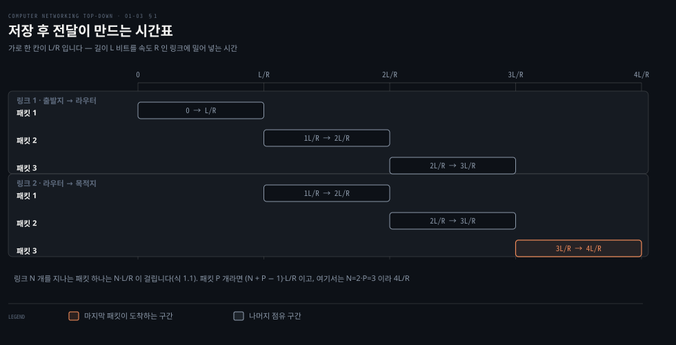
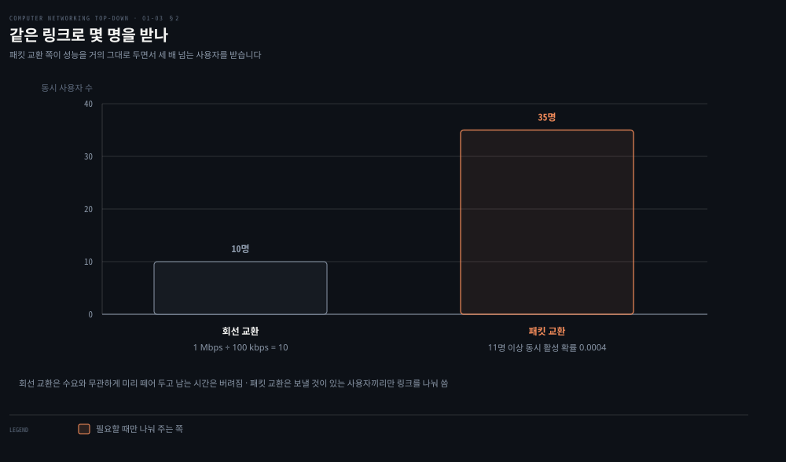
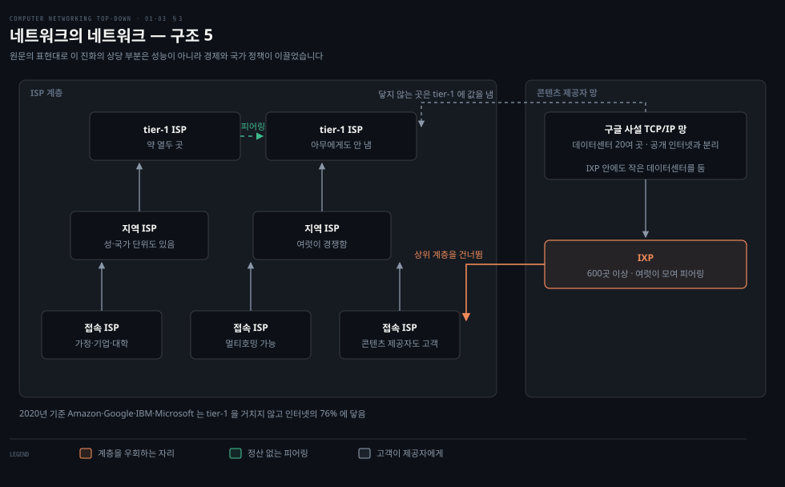

# 코어는 어떻게 나르는가

---

> 가장자리를 지난 패킷은 이제 스위치와 링크의 그물로 들어갑니다. 그 그물을 운영하는 방법이 역사적으로 둘 있었고, 인터넷은 그중 하나를 골랐습니다.

## 핵심 요약

> 이 편이 매달린 하나의 생각은 **코어의 두 방식이 자원을 미리 떼어 두느냐 필요할 때 나눠 주느냐로 갈리며, 인터넷이 후자를 고른 이유가 숫자로 설명된다**는 것입니다.

원문이 이 대비를 식당 비유로 엽니다. **예약을 받는 식당은 미리 전화해야 하지만 도착하면 바로 앉습니다. 예약을 안 받는 식당은 전화할 필요가 없지만 도착해서 기다릴 수 있습니다.** 회선 교환과 패킷 교환이 그것입니다.

인터넷이 뒤쪽을 고른 이유가 이 편의 핵심입니다. 원문의 수치 예에서 **같은 1 Mbps 링크가 회선 교환으로는 10명, 패킷 교환으로는 35명을 받습니다.** 성능은 거의 같은데 사용자가 세 배 넘습니다. 사용자가 대부분의 시간 동안 아무것도 안 보내기 때문입니다.

대가도 있습니다. 미리 떼어 두지 않으므로 줄을 서야 합니다. **줄이 길어지면 지연이 생기고 버퍼가 차면 패킷이 버려집니다.** 다음 편이 이 대가를 정면으로 다룹니다.

마지막 절은 각도가 다릅니다. 인터넷이 지금의 모양이 된 이유를 원문은 성능이 아니라 **경제와 국가 정책**으로 설명합니다.


## 학습 목표

> 이 편을 읽고 나면 아래 다섯 가지를 스스로 해낼 수 있습니다.

1. 저장 후 전달이 무엇인지 말하고, 링크 N 개를 지나는 패킷 하나의 지연을 식으로 쓸 수 있습니다.
2. 출력 버퍼에서 큐잉 지연과 패킷 손실이 생기는 조건을 설명할 수 있습니다.
3. 포워딩 테이블이 무엇을 색인하는지 말하고, 라우팅 프로토콜과의 역할 차이를 가를 수 있습니다.
4. FDM 과 TDM 을 구분하고, 회선 하나의 전송률을 계산할 수 있습니다.
5. 접속 ISP·지역 ISP·tier-1 의 관계를 그리고, 피어링과 IXP 가 그 계층을 어떻게 우회하는지 설명할 수 있습니다.


## 1. 저장 후 전달 — 왜 기다렸다 보내는가

> 라우터는 패킷의 마지막 비트가 도착할 때까지 첫 비트도 내보내지 않습니다. 그래서 링크 수만큼 지연이 쌓입니다.



### 링크가 빠른데 왜 느린가

구간마다 링크가 1 Gbps 인데 종단 간 지연이 링크 하나의 전송 시간보다 훨씬 큰 일이 있습니다. 대역폭 문제가 아닙니다. **패킷이 중간 장비마다 통째로 모였다 다시 출발하기 때문입니다.**

### 기본 단위 L/R

원문이 먼저 단위를 세웁니다. 패킷은 각 링크에서 **링크의 전송률 전체로** 전송됩니다. 길이 L 비트 패킷을 전송률 R bps 링크로 보내면 전송 시간은 **L/R 초**입니다.

이 편의 모든 계산이 이 단위 위에 섭니다.

### 저장 후 전달의 정의

원문의 정의는 짧고 강합니다. **"저장 후 전달 전송은 패킷 스위치가 패킷의 첫 비트를 나가는 링크로 내보내기 시작하려면 먼저 패킷 전체를 받아야 한다는 뜻입니다."**

출발지에서 라우터를 하나 거쳐 목적지로 가는 구조에서 계산하면 이렇습니다. 전파 지연을 무시하면, 시각 L/R 에 출발지가 패킷 전체를 보냈고 라우터가 전체를 받아 저장했습니다. 라우터는 그때부터 내보내기 시작해 시각 **2L/R** 에 목적지가 전체를 받습니다.

원문이 대비를 답니다. **비트가 도착하는 대로 전달했다면 총 지연은 L/R 이었을 것입니다.** 하지만 라우터는 받고 저장하고 처리한 뒤에야 전달합니다.

일반화하면 식 (1.1)이 나옵니다. 전송률이 모두 R 인 링크 N 개를 지나는 패킷 하나의 종단 간 지연입니다.

```properties
d(end-to-end) = N × L / R
```

위 그림이 패킷 3개가 링크 2개를 지나는 경우를 시간표로 편 것입니다. 링크 1이 패킷 1을 보내는 동안 링크 2는 놀고, 링크 1이 패킷 2를 보낼 때 링크 2가 패킷 1을 보냅니다. **파이프라인이 채워지면 두 링크가 동시에 일합니다.**

> **노트의 읽기**: 원문은 **"링크 N 개에 걸쳐 패킷 P 개를 보낼 때의 지연을 스스로 구해 보라"** 고 던져 두고 답을 주지 않습니다. 답은 **(N + P − 1) × L/R** 입니다. 마지막 패킷이 첫 링크에 오르기까지 (P − 1)·L/R 을 기다리고, 그다음 N 개 링크를 지나는 데 N·L/R 이 걸리기 때문입니다. 위 그림의 N=2 · P=3 에 넣으면 (2 + 3 − 1)·L/R = **4L/R** 로 그림의 마지막 칸과 맞습니다.

### 출력 버퍼 — 지연과 손실이 태어나는 곳

패킷 스위치는 붙어 있는 링크마다 **출력 버퍼(출력 큐)** 를 갖습니다. 도착한 패킷이 나갈 링크가 다른 패킷을 보내느라 바쁘면 이 버퍼에서 기다립니다. 그것이 **큐잉 지연**입니다.

원문이 이 지연의 성격을 못박습니다. **"이 지연은 가변적이며 네트워크의 혼잡 수준에 달려 있습니다."** 저장 후 전달 지연이 L/R 로 계산되는 고정값인 것과 대조됩니다.

그리고 버퍼는 유한합니다. 도착한 패킷이 버퍼가 이미 꽉 찬 것을 발견하면 **패킷 손실**이 일어납니다. 원문이 어느 쪽이 버려지는지까지 적습니다. **"도착한 패킷이나 이미 큐에 있던 패킷 중 하나가 버려집니다."**

원문의 그림 예가 구체적입니다. 호스트 A 와 B 가 각각 **100 Mbps 이더넷**으로 라우터에 붙어 있고, 라우터는 그 패킷들을 **15 Mbps 링크**로 내보냅니다. 짧은 시간 동안 도착률이 15 Mbps 를 넘으면 혼잡이 일어납니다. A 와 B 가 동시에 다섯 패킷씩 연달아 보내면 대부분이 큐에서 기다립니다.

**들어오는 총 대역폭이 나가는 대역폭보다 크면 언젠가 큐가 자란다** — 이 한 문장이 3장 혼잡 제어의 출발점입니다.

### 포워딩 테이블과 라우팅 프로토콜

라우터가 어느 링크로 내보낼지는 어떻게 정할까요. 인터넷에서는 이렇습니다.

출발지가 패킷 헤더에 목적지의 **IP 주소**를 넣습니다. 이 주소는 우편 주소처럼 **계층 구조**입니다. 패킷이 라우터에 도착하면 라우터는 목적지 주소의 **일부를 살펴** 인접 라우터로 보냅니다. 각 라우터는 **포워딩 테이블**을 갖고 있어 목적지 주소(또는 그 일부)를 자기 출력 링크로 대응시킵니다.

원문의 길 묻기 비유가 이 계층성을 잘 보여 줍니다. 필라델피아에서 올랜도의 156 Lakeside Drive 로 가는 운전자가 주유소마다 길을 묻습니다.

| 어디서 물었나 | 주소의 어느 부분을 봤나 | 무엇을 알려 줬나 |
|-------------|---------------------|----------------|
| 동네 주유소 | Florida | I-95 남쪽으로 타라 |
| 잭슨빌 | Orlando | 데이토나비치까지 계속 가라 |
| 데이토나비치 | Orlando | I-4 를 타라 |
| 올랜도 출구 | Lakeside Drive | 이 길을 따라가라 |
| 자전거 탄 아이 | 156 | 저 집이다 |

원문이 비유를 닫습니다. **"위 비유에서 주유소 직원과 자전거 탄 아이가 라우터에 해당합니다."** 아무도 전체 경로를 모르고, 각자 주소의 자기 몫만 보고 다음 홉을 알려 줍니다.

그러면 포워딩 테이블은 누가 채울까요. 원문이 여기서 5장을 예고합니다. **인터넷에는 포워딩 테이블을 자동으로 설정하는 라우팅 프로토콜이 여럿 있습니다.** 예를 들어 각 라우터에서 각 목적지까지의 최단 경로를 구해 그 결과로 테이블을 채웁니다.

**포워딩은 패킷 하나를 어느 링크로 보낼지 정하는 일이고, 라우팅은 그 테이블을 채우는 일입니다.** 4장과 5장이 이 둘로 갈리는 이유가 여기에 있습니다.


## 2. 회선 교환 — 미리 떼어 두는 쪽

> 회선 교환은 통신 세션 동안 필요한 자원을 미리 예약합니다. 예약했으므로 기다리지 않고, 예약했으므로 안 쓰면 버려집니다.

### 왜 전화망 이야기를 하는가

인터넷만 배우면 회선 교환은 지나간 이야기로 보입니다. 그런데 이 대비를 모르면 **"인터넷이 왜 지연을 보장하지 못하는가"** 를 설명할 수 없습니다. 비교 대상이 있어야 선택의 의미가 보입니다.

### 예약이라는 것

원문의 정의입니다. **회선 교환망에서는 종단 시스템 사이의 통신에 필요한 자원(버퍼, 링크 전송률)이 통신 세션 동안 예약됩니다.** 패킷 교환망에서는 예약되지 않아, 세션의 메시지가 자원을 요구할 때 쓰고 그 결과 기다려야 할 수 있습니다.

전화망이 그 예입니다. 보내는 쪽이 정보를 보내기 전에 망이 먼저 연결을 세웁니다. 경로 위의 스위치들이 그 연결의 **상태를 유지**하며, 이 연결을 전화 용어로 **회선(circuit)** 이라 부릅니다. 회선을 세울 때 망은 링크의 전송 용량 중 일정 몫을 그 연결에 예약하므로, **보내는 쪽은 보장된 일정 속도로 전송할 수 있습니다.**

원문의 그림 예가 숫자를 줍니다. 링크마다 회선이 4개씩 있으면 한 연결이 링크 용량의 4분의 1을 갖습니다. **인접 스위치 사이 링크가 1 Mbps 라면 종단 간 회선 하나가 250 kbps** 를 전용으로 받습니다.

### 회선을 어떻게 나누나 — FDM 과 TDM

링크 안의 회선은 두 방식 중 하나로 구현됩니다.

| | FDM (주파수 분할) | TDM (시간 분할) |
|---|-----------------|----------------|
| 무엇을 나누나 | 링크의 주파수 스펙트럼 | 시간 |
| 각 연결이 받는 것 | 전용 주파수 대역 하나 | 프레임마다 전용 시간 슬롯 하나 |
| 언제 쓰나 | 연결 기간 내내 연속으로 | 짧은 슬롯 동안 대역 전체를 |
| 전화망의 값 | 대역폭 4 kHz | — |
| 익숙한 예 | FM 라디오 88~108 MHz | — |

TDM 의 전송률 계산이 명확합니다. **회선의 전송률 = 프레임 속도 × 슬롯 안의 비트 수** 입니다. 원문의 예로 링크가 초당 8,000 프레임을 보내고 슬롯이 8비트라면 회선 하나는 **64 kbps** 입니다.

원문이 대역폭이라는 말의 출처도 여기서 짚습니다. FDM 에서 각 연결에 주는 **주파수 대역의 폭을 대역폭(bandwidth)이라 부릅니다.**

### 수치 예 하나

원문이 계산을 하나 끝까지 보여 줍니다. 640,000비트 파일을 회선 교환망으로 보냅니다. 모든 링크가 24슬롯 TDM 이고 비트율은 1.536 Mbps 이며, 회선을 세우는 데 500밀리초가 걸립니다.

```properties
회선 하나의 전송률 = 1.536 Mbps ÷ 24 = 64 kbps
전송 시간          = 640,000 bits ÷ 64 kbps = 10 초
총 소요            = 10 초 + 0.5 초 = 10.5 초
```

여기서 원문이 강조하는 사실이 하나 있습니다. **"전송 시간은 링크 수와 무관합니다. 종단 간 회선이 링크 하나를 지나든 백 개를 지나든 전송 시간은 10초입니다."**

앞 절의 저장 후 전달과 정확히 반대입니다. **패킷 교환은 링크 수만큼 N·L/R 이 쌓이지만, 회선 교환은 회선이 세워지고 나면 링크 수가 전송 시간에 영향을 주지 않습니다.** 두 방식의 성격 차이가 이 대비에 압축돼 있습니다.


## 3. 왜 인터넷은 패킷 교환을 골랐나

> 이유는 철학이 아니라 산수입니다. 사용자가 대부분의 시간 동안 아무것도 안 보내기 때문입니다.



### 예약이 안전해 보이는데

예약은 보장을 줍니다. 지연이 예측 가능하고 속도가 일정합니다. 실시간 서비스에는 그것이 옳아 보입니다. **그런데도 인터넷은 예약하지 않는 쪽을 골랐습니다.** 이유를 숫자로 봐야 합니다.

### 원문의 첫 번째 계산

1 Mbps 링크를 여러 사용자가 나눠 씁니다. 사용자는 활동 중일 때 **100 kbps** 를 일정하게 내고, 비활동 중에는 아무것도 안 냅니다. 그리고 **활동하는 시간은 전체의 10%** 입니다. 원문의 표현대로 나머지 90%는 한가하게 커피를 마시고 있습니다.

- **회선 교환** — 모든 사용자에게 항상 100 kbps 를 예약해야 하므로 **10명**만 받습니다.
- **패킷 교환** — 사용자가 활동할 확률이 0.1 이므로, **35명**이 있어도 11명 이상이 동시에 활동할 확률은 **약 0.0004** 입니다.

10명 이하가 동시에 활동하는 동안(확률 0.9996) 총 도착률이 1 Mbps 이하이므로 패킷은 사실상 지연 없이 흐릅니다. 원문의 결론입니다. **"패킷 교환은 본질적으로 회선 교환과 같은 성능을 제공하면서 세 배 넘는 사용자를 받습니다."**

### 원문의 두 번째 계산

사용자가 10명인데 그중 한 명이 갑자기 1,000비트 패킷 1,000개를 만들고 나머지는 조용합니다.

| 방식 | 걸리는 시간 | 왜 |
|------|-----------|-----|
| TDM 회선 교환 (10슬롯) | 10초 | 자기 슬롯 하나만 쓸 수 있고 나머지 아홉은 논 채로 지납니다 |
| 패킷 교환 | 1초 | 다른 사용자가 없으니 링크 전체 속도로 보냅니다 |

원문이 두 예를 하나로 묶습니다.

> **"회선 교환은 수요와 무관하게 전송 링크의 사용을 미리 할당하며, 할당됐지만 필요 없는 링크 시간은 쓰이지 않은 채로 갑니다. 반면 패킷 교환은 수요에 따라 링크 사용을 할당합니다."**

### 반대편의 주장

원문은 패킷 교환을 옹호만 하지 않습니다. **비판자들은 패킷 교환이 실시간 서비스에 적합하지 않다고 주장해 왔습니다.** 종단 간 지연이 가변적이고 예측 불가능하기 때문이며, 그 원인은 주로 가변적이고 예측 불가능한 큐잉 지연입니다.

원문이 균형을 잡아 둔 뒤 현실을 적습니다. **오늘날 두 방식이 다 쓰이지만 추세는 확실히 패킷 교환 쪽입니다.** 회선 교환 전화망조차 천천히 옮겨 가고 있고, 특히 **비싼 국제 구간에서 패킷 교환을 씁니다.**


## 4. 네트워크의 네트워크

> 접속 ISP 를 서로 잇는 문제입니다. 원문은 답을 한 번에 주지 않고 구조 1에서 5까지 다섯 번 고쳐 세웁니다.



### 왜 이렇게 복잡한가

인터넷 구조를 처음 보면 계층이 왜 이렇게 많은지, 왜 어떤 연결은 돈을 내고 어떤 연결은 안 내는지 납득이 안 갑니다. 원문이 이유를 미리 밝힙니다. **"이 진화의 상당 부분은 성능 고려가 아니라 경제와 국가 정책이 이끌었습니다."**

### 다섯 번 고쳐 세우기

| 구조 | 무엇을 더했나 | 왜 부족했나 |
|------|-------------|------------|
| 1 | 전 세계를 덮는 전송 ISP 하나 | 독점이라 경쟁이 없습니다 |
| 2 | 경쟁하는 글로벌 전송 ISP 여럿 | 그들끼리도 이어져야 합니다 |
| 3 | 접속 ISP·지역 ISP·tier-1 의 다계층 | PoP·멀티호밍·피어링이 빠졌습니다 |
| 4 | PoP · 멀티호밍 · 피어링 · IXP | 콘텐츠 제공자 망이 빠졌습니다 |
| 5 | 콘텐츠 제공자 망 | 이것이 오늘의 인터넷입니다 |

첫 구조에서 이미 관계의 성격이 정해집니다. 접속 ISP 가 글로벌 전송 ISP 에게 값을 내므로 **접속 ISP 는 고객이고 전송 ISP 는 제공자**입니다. 이 고객-제공자 관계가 계층마다 반복됩니다.

### tier-1 이라는 자리

원문이 tier-1 을 이렇게 소개합니다. 지역 ISP 는 tier-1 에 연결하고, tier-1 은 상상 속 글로벌 전송 ISP 와 비슷하지만 **세계의 모든 도시에 있지는 않습니다.** 수는 **약 열두 곳**입니다.

여기에 원문의 인상적인 문장이 붙습니다.

> **"흥미롭게도 어느 단체도 tier-1 지위를 공식적으로 인정하지 않습니다. 속담처럼, 자기가 그 집단의 일원인지 물어봐야 한다면 아마 아닐 것입니다."**

계층에서 tier-1 의 위치는 돈으로 정의됩니다. **접속 ISP 는 지역 ISP 에게, 지역 ISP 는 tier-1 에게 값을 냅니다. tier-1 은 꼭대기에 있으므로 아무에게도 내지 않습니다.**

나라마다 층 수가 다릅니다. 원문이 중국을 예로 듭니다. **도시마다 접속 ISP 가 있고 그것이 성(省) ISP 로, 다시 국가 ISP 로, 마지막에 tier-1 로 이어집니다.**

> **지금은 다릅니다**: 원문이 tier-1 의 예로 드는 회사 이름들은 판을 거듭하며 낡습니다. 통신 사업자의 인수·합병이 잦기 때문입니다. **오래 남는 것은 회사 이름이 아니라 두 가지입니다.** 하나는 수가 열두 곳 안팎이라는 규모이고, 다른 하나는 **어느 기구도 그 지위를 공식 인정하지 않는다**는 정의 방식입니다. 특정 회사가 지금도 tier-1 인지는 그 시점의 피어링 관계를 봐야 알 수 있습니다.

### 계층을 우회하는 세 장치

구조 4가 더하는 것들은 전부 **계층을 그대로 타면 비싸다**는 문제에 대한 답입니다.

- **PoP(Point of Presence)** — 제공자 망의 한 위치에 있는 라우터 묶음이고, 고객 ISP 가 여기로 들어옵니다. 최하위 접속 ISP 층을 뺀 모든 계층에 있습니다.
- **멀티호밍** — tier-1 을 뺀 어느 ISP든 제공자 둘 이상에 붙을 수 있습니다. 원문이 이득을 적습니다. **제공자 하나에 장애가 나도 인터넷과 계속 주고받을 수 있습니다.**
- **피어링** — 같은 계층의 가까운 ISP 둘이 직접 연결해, 둘 사이 트래픽이 상위 중개자를 거치지 않게 합니다. **보통 정산이 없어(settlement-free) 어느 쪽도 상대에게 값을 내지 않습니다.**

**IXP** 는 피어링을 여럿이 모여 하는 자리입니다. 제3자가 만든 만남의 장소이고, 보통 자체 스위치를 갖춘 독립 건물에 있습니다. 원문은 **인터넷에 600곳 넘는 IXP** 가 있다고 적습니다.

### 구조 5 — 콘텐츠 제공자가 망을 짓는다

마지막 구조가 더하는 것은 **콘텐츠 제공자 자신의 망**입니다. 원문은 구글을 예로 듭니다.

구글은 북미·유럽·아시아·남미에 **주요 데이터센터 20여 곳**을 두고 각각에 수만에서 수십만 대의 서버를 둡니다. 그리고 **IXP 안에 서버 수백 대짜리 작은 데이터센터**도 둡니다. 이들을 잇는 것이 구글의 **사설 TCP/IP 망**이고, 전 세계를 덮지만 **공개 인터넷과는 분리돼 있으며 구글 서버로 오가는 트래픽만 나릅니다.**

이 망이 하는 일이 이 절의 결론입니다. **구글 사설망은 하위 계층 ISP 와 직접 또는 IXP 에서 정산 없이 피어링해 인터넷의 상위 계층을 "우회"하려 합니다.** 다만 tier-1 을 거쳐야만 닿는 접속 ISP 가 많이 남아 있어, 그쪽에는 tier-1 에 연결하고 값을 냅니다.

원문이 규모를 숫자로 못박습니다. **2020년 기준 Amazon·Google·IBM·Microsoft 는 tier-1 을 거치지 않고 인터넷의 76% 에 닿을 수 있습니다.**

자기 망을 지어 얻는 것도 둘로 정리합니다. **상위 ISP 에 내는 값이 줄고, 자기 서비스가 최종 사용자에게 어떻게 전달되는지를 더 통제할 수 있습니다.**

> **노트의 읽기**: 같은 책이 구글 데이터센터 수를 두 곳에서 다르게 적습니다. 앞 절(1.2)은 **"2024년 말 기준 네 대륙에 33개"** 라고 적고, 이 절은 **"주요 데이터센터 20여 곳"** 이라고 적으며 같은 출처를 답니다. 두 서술이 어긋난다기보다 **"주요(major)"라는 한정이 붙은 쪽이 더 좁은 집합**을 세는 것으로 읽는 편이 자연스럽습니다. 다만 숫자를 인용할 때는 어느 쪽 서술을 가져오는지 밝히는 편이 안전합니다.


## 코어 치트시트

| 물었을 때 | 답 |
|----------|-----|
| 길이 L 비트를 전송률 R 링크로 | L/R 초 |
| 링크 N 개를 지나는 패킷 하나 | N·L/R (식 1.1) |
| 링크 N 개를 지나는 패킷 P 개 | (N + P − 1)·L/R |
| 큐잉 지연의 성격 | 가변적이고 혼잡 수준에 달렸습니다 |
| 패킷 손실이 나는 조건 | 출력 버퍼가 가득 찬 상태에서 패킷이 도착 |
| 포워딩과 라우팅의 차이 | 포워딩은 어느 링크로, 라우팅은 그 테이블을 채우는 일 |
| TDM 회선의 전송률 | 프레임 속도 × 슬롯 비트 수 |
| 회선 교환의 전송 시간과 링크 수 | 무관합니다 |
| tier-1 이 값을 내는 대상 | 없습니다. 꼭대기입니다 |
| 피어링의 정산 | 보통 없습니다 (settlement-free) |


## 심화 학습

> 원문의 원리 서술은 판을 타지 않습니다. 낡는 것은 회사 이름과 개수 쪽입니다.

| 원문 | 현행(2026) | 성격 |
|------|-----------|------|
| 저장 후 전달과 식 (1.1) | 그대로 | 유지 |
| 큐잉 지연·패킷 손실의 원리 | 그대로 | 유지 |
| FDM · TDM | 그대로 | 유지 |
| tier-1 회사 이름 목록 | 인수·합병으로 낡습니다 | 이름이 낡음 |
| IXP 600곳 이상 | 계속 늘어납니다 | 숫자가 움직임 |
| 구글 데이터센터 20여 곳 | 같은 책 1.2 는 33개로 적습니다 | 노트의 읽기 |

원문이 다루지 않는 축이 둘 있습니다.

첫째는 **저장 후 전달을 줄이려는 시도**입니다. 원문은 라우터가 전체를 받아야 한다고만 적습니다. 데이터센터 스위치에서는 헤더만 보고 곧장 내보내는 cut-through 방식을 쓰기도 하고, 그러면 지연이 L/R 이 아니라 헤더 크기에 가까워집니다. 대신 오류가 있는 프레임도 전달하게 되므로 **지연과 정확성을 맞바꾸는 선택**입니다. 6장의 데이터센터 네트워크에서 이 축이 다시 나옵니다.

둘째는 **피어링이 협상의 대상**이라는 점입니다. 원문은 피어링을 "보통 정산이 없다"고만 적습니다. 실제로는 트래픽 비율이 한쪽으로 크게 기울면 무정산 관계가 깨지고 유료 전송으로 바뀌기도 합니다. **콘텐츠 제공자와 접속 ISP 사이의 분쟁이 대개 이 지점에서 벌어집니다.** 구조 5가 왜 정치적인 그림인지가 여기서 드러납니다.

```bash
# 내 패킷이 어느 ISP 들을 지나는지 — 계층이 실제로 보입니다
traceroute -a 8.8.8.8            # -a 는 홉마다 AS 번호를 함께 표시합니다
# AS 번호로 소유 조직을 조회
whois -h whois.cymru.com " -v 8.8.8.8"
```


## 면접 대비

### 한 줄 정의

"코어를 운영하는 방법은 자원을 미리 예약하는 회선 교환과 필요할 때 나눠 주는 패킷 교환 둘이고, 인터넷이 후자를 고른 이유는 사용자가 대부분의 시간 동안 아무것도 보내지 않기 때문입니다."

### 핵심 포인트 세 가지

1. **저장 후 전달은 링크마다 L/R 을 더합니다.** 링크 N 개면 N·L/R 이고, 패킷 P 개면 (N + P − 1)·L/R 입니다. 파이프라인이 채워지면 링크들이 동시에 일합니다.
2. **큐잉 지연은 가변이고 저장 후 전달 지연은 고정입니다.** 앞의 것은 혼잡에 달려 있고 뒤의 것은 계산됩니다. 손실은 버퍼가 유한하기 때문에 생깁니다.
3. **인터넷의 계층은 경제가 만든 것입니다.** 아래가 위에 값을 내고 tier-1 은 아무에게도 내지 않습니다. 피어링과 IXP 와 콘텐츠 제공자 망은 그 계층을 우회해 값을 줄이는 장치입니다.

### 자주 묻는 질문

Q: 회선 교환이 지연 보장에 낫다면 왜 안 씁니까?
A: 예약한 자원이 놀기 때문입니다. 사용자가 10%만 활동하면 90%의 예약이 버려집니다. 원문의 예에서 같은 링크가 회선 교환으로 10명, 패킷 교환으로 35명을 받습니다.

Q: 포워딩과 라우팅을 구분해 보십시오.
A: 포워딩은 도착한 패킷을 테이블에서 찾아 어느 출력 링크로 보낼지 정하는 일이고, 라우팅은 그 테이블을 채우는 일입니다. 앞은 4장 데이터 평면, 뒤는 5장 제어 평면입니다.

Q: 피어링과 전송(transit)의 차이는 무엇입니까?
A: 전송은 고객이 제공자에게 값을 내고 인터넷 전체로 나가는 길을 사는 것이고, 피어링은 같은 계층끼리 직접 이어 둘 사이 트래픽만 주고받는 것입니다. 피어링은 보통 정산이 없습니다.


## 핵심 개념 체크리스트

- [ ] 저장 후 전달의 정의를 "첫 비트"라는 말을 써서 말할 수 있습니까?
- [ ] 링크 N 개·패킷 P 개의 종단 간 지연을 유도할 수 있습니까?
- [ ] 큐잉 지연과 저장 후 전달 지연의 성격 차이를 말할 수 있습니까?
- [ ] 패킷 손실이 나는 조건과 무엇이 버려지는지 설명할 수 있습니까?
- [ ] 포워딩 테이블이 무엇을 색인하는지 말할 수 있습니까?
- [ ] TDM 회선 하나의 전송률을 계산할 수 있습니까?
- [ ] 회선 교환의 전송 시간이 링크 수와 무관한 이유를 설명할 수 있습니까?
- [ ] 접속 ISP·지역 ISP·tier-1 사이에 돈이 어느 방향으로 흐르는지 그릴 수 있습니까?
- [ ] 피어링·IXP·콘텐츠 제공자 망이 각각 무엇을 우회하는지 말할 수 있습니까?


## 관련 문서

- [01-02 가장자리에 무엇이 붙는가](./01-02.가장자리에 무엇이 붙는가.md) — 이 편의 앞. 코어에 들어오기 전 구간
- [01-04 무엇이 느려지고 무엇이 사라지는가](./01-04.무엇이 느려지고 무엇이 사라지는가.md) — 이 편의 다음. 여기서 나온 큐잉 지연을 성분으로 분해합니다
- [Computer Networking — 정독 인덱스](./README.md) — 8개 장 전체 지도


## 참고 자료

- 원본: 《Computer Networking: A Top-Down Approach》 9판 (James F. Kurose · Keith W. Ross, Pearson)
- 다룬 범위: §1.3 The Network Core — 패킷 교환 · 회선 교환 · 네트워크의 네트워크
- [PeeringDB](https://www.peeringdb.com/) — 원문이 IXP 수의 근거로 드는 데이터베이스
