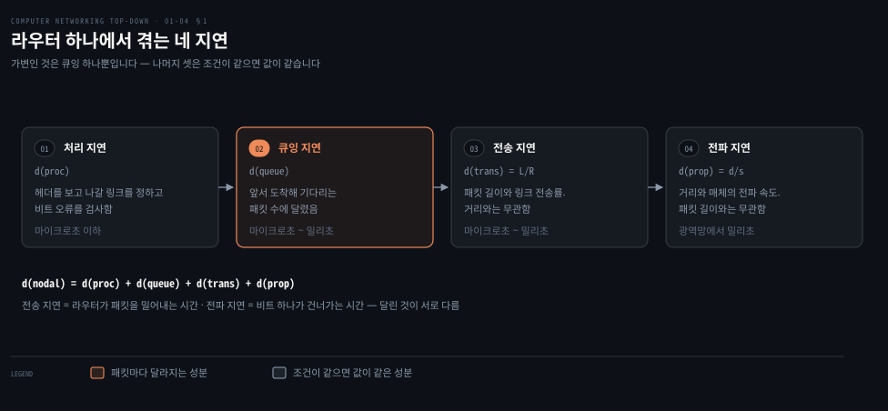
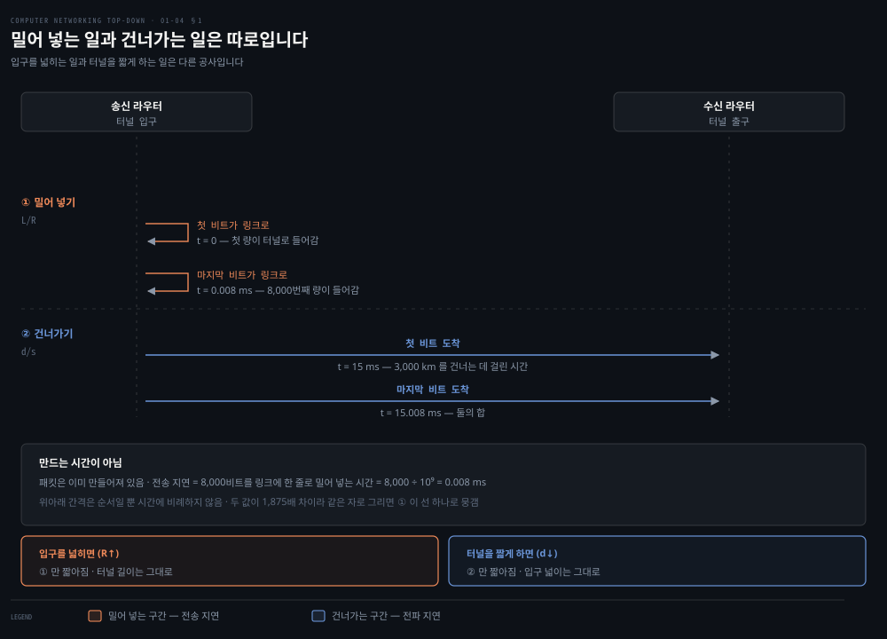
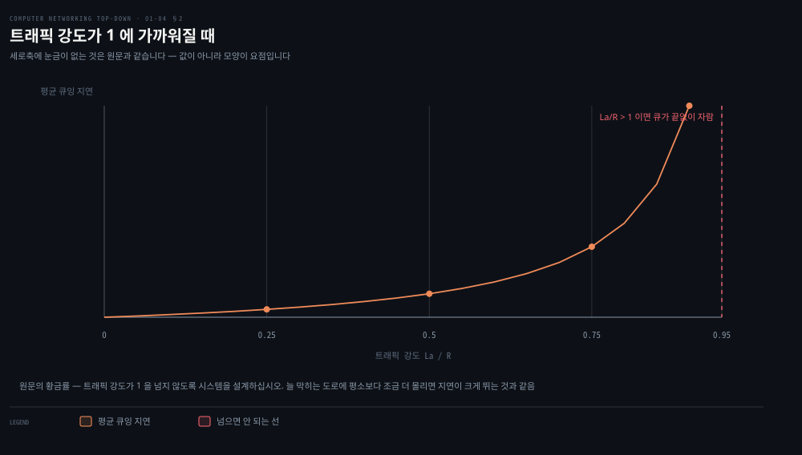
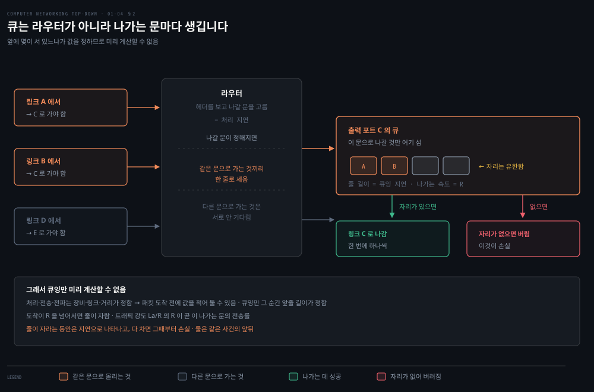
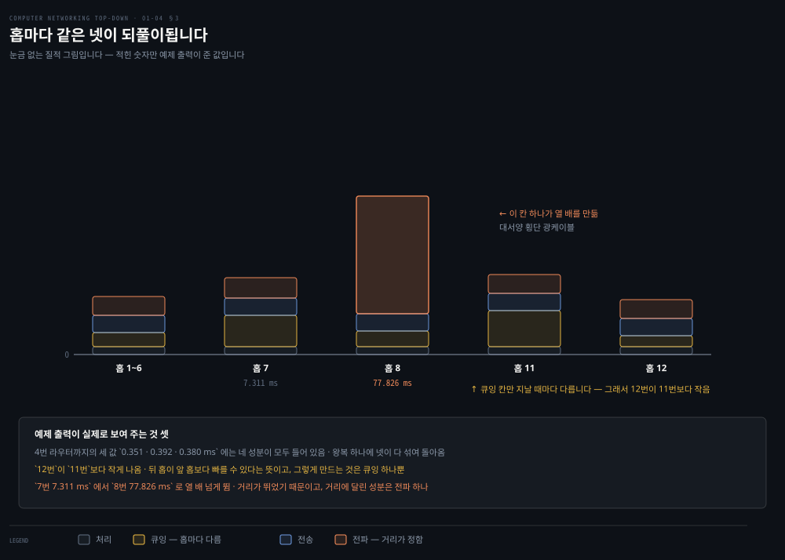
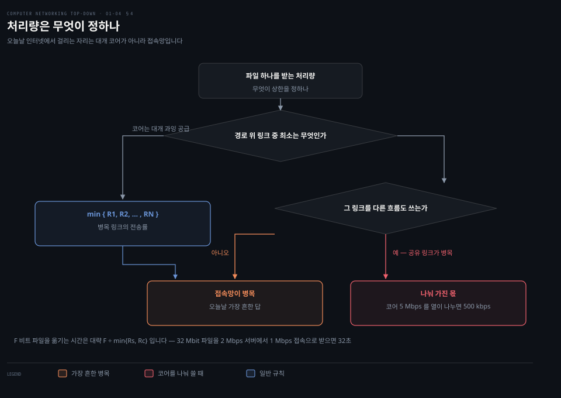

# 무엇이 느려지고 무엇이 사라지는가

---

> 앞 편이 패킷 교환의 대가를 예고했습니다. 이 편은 그 대가를 성분으로 분해하고 숫자로 잽니다. 그리고 그 성분을 노리는 공격까지 봅니다.

## 핵심 요약

> 이 편이 매달린 하나의 생각은 **지연은 한 덩어리가 아니라 서로 다른 것에 달린 네 성분의 합이며, 그중 하나만 가변이라는 것**입니다.

이 절은 이상과 현실을 대비하며 열립니다. **원하는 만큼의 데이터를 어느 두 종단 시스템 사이에서든 즉시, 손실 없이 옮기고 싶지만 그것은 현실에서 이룰 수 없는 목표입니다.** 그래서 컴퓨터 네트워크는 처리량을 제한하고 지연을 만들고 실제로 패킷을 잃습니다.

이 편의 쓸모는 그 셋을 하나로 뭉뚱그리지 않는 데 있습니다. 노드 지연은 처리·큐잉·전송·전파 네 성분의 합인데, 넷 중 가변인 것은 큐잉 하나뿐입니다. 전송 지연은 패킷 길이와 링크 속도에 달렸고 거리와 무관하며, 전파 지연은 거리에 달렸고 패킷 길이와 무관합니다. 이 구분이 서면 "느리다"는 신고를 성분별로 쪼갤 수 있습니다.

처리량 쪽에도 하나의 문장이 있습니다. 경로 위 가장 느린 링크가 상한을 정하고, 그 링크를 다른 흐름과 나눠 쓰면 나눈 몫이 상한이 됩니다.

마지막 절은 각도를 바꿉니다. 여기서 잰 성능을 일부러 무너뜨리는 방법이 §1.6 의 내용이고, 그 공격들이 왜 가능한지는 설계 시점의 가정에서 찾습니다.


## 학습 목표

> 이 편을 읽고 나면 아래 일곱 가지를 스스로 해낼 수 있습니다.

1. 노드 지연 네 성분을 들고, 각각이 무엇에 달려 있는지 말할 수 있습니다.
2. 전송 지연과 전파 지연을 혼동하지 않고 구분해 설명할 수 있습니다.
3. 트래픽 강도 La/R 을 계산하고, 그 값이 1 에 가까울 때 무슨 일이 생기는지 설명할 수 있습니다.
4. `traceroute` 출력에서 각 숫자가 무엇을 재는지 읽고 이상한 자리를 짚을 수 있습니다.
5. 처리량이 병목 링크로 결정되는 과정을 세 경우로 나눠 계산할 수 있습니다.
6. 네 성분 중 어느 것이 미리 계산되고 어느 것이 안 되는지 가르고, 그 이유를 말할 수 있습니다.
7. 병목 앞에서 지연이 손실로 바뀌는 과정을 설명하고, 그것이 왜 혼잡 제어의 출발점인지 말할 수 있습니다.


## 1. 지연은 네 성분의 합입니다

> 노드 하나에서 패킷은 네 가지 지연을 차례로 겪습니다. 넷은 서로 다른 것에 달려 있어 같이 움직이지 않습니다.



### "느리다"는 신고만으로는 아무것도 못 합니다

지연이 크다는 사실만으로는 어디를 손봐야 할지 알 수 없습니다. 링크를 늘려야 하는지, 경로를 바꿔야 하는지, 장비를 바꿔야 하는지가 **어느 성분이 큰가에 따라 완전히 달라집니다.**

### 네 성분

노드 지연은 넷으로 나뉩니다.

| 성분 | 무엇을 기다리는 시간인가 | 무엇이 정하나 | 미리 계산되나 | 실무 자릿수 |
|------|-------------------|-------------|------|-----------|
| 처리 지연 `d(proc)` | 헤더를 보고 나갈 링크를 정하고 비트 오류를 검사 | 장비의 처리 능력 | 됩니다 — 장비 사양 | 마이크로초 이하 |
| 큐잉 지연 `d(queue)` | 링크가 빌 때까지 버퍼에서 기다림 | 앞서 도착해 기다리는 패킷 수 | **안 됩니다** | 마이크로초 ~ 밀리초 |
| 전송 지연 `d(trans)` | 패킷의 모든 비트를 링크로 밀어 넣음 | 패킷 길이 L 과 링크 전송률 R | 됩니다 — `L/R` | 마이크로초 ~ 밀리초 |
| 전파 지연 `d(prop)` | 비트가 링크 반대편까지 건너감 | 거리 d 와 매체의 전파 속도 s | 됩니다 — `d/s` | 광역망에서 밀리초 |

**넷째 칸이 이 편의 갈림길입니다.** 셋은 패킷이 도착하기 전에 값을 적어 둘 수 있습니다. 링크 사양과 거리와 패킷 길이만 알면 되기 때문입니다. 큐잉만 그럴 수 없습니다. 값이 **그 순간 앞에 몇이 서 있느냐**에 달려 있어서, 같은 링크·같은 패킷이라도 지날 때마다 다릅니다. 다음 절이 이 한 칸을 통째로 다룹니다.

넷을 더한 것이 노드 지연입니다.

```properties
d(nodal) = d(proc) + d(queue) + d(trans) + d(prop)
```

전송 지연은 **L/R**, 전파 지연은 **d/s** 입니다. 전파 속도는 매체에 달려 있고 범위가 주어집니다. **초속 2×10⁸ 미터에서 3×10⁸ 미터**로, 빛의 속도와 같거나 조금 못 미칩니다.

### 헷갈리는 둘 — 전송과 전파



이 혼동은 대놓고 다뤄집니다. **"네트워킹 분야에 처음 온 사람은 전송 지연과 전파 지연의 차이를 이해하기 어려워하기도 합니다. 차이는 미묘하지만 중요합니다."**

| | 전송 지연 | 전파 지연 |
|---|---------|---------|
| 무엇의 함수인가 | 패킷 길이와 링크 전송률 | 두 라우터 사이 거리 |
| 무엇과 무관한가 | **거리와 무관** | **패킷 길이·전송률과 무관** |

톨게이트 비유가 이 둘을 갈라 줍니다. 100 km 마다 톨게이트가 있는 고속도로에서, **자동차 한 대가 비트이고 열 대로 이루어진 대열이 패킷**입니다.

| 비유 속 사건 | 값 | 무엇에 해당하나 |
|------------|-----|---------------|
| 톨게이트가 대열 전체를 통과시킴 | 10대 ÷ 분당 5대 = **2분** | 전송 지연 |
| 차 한 대가 다음 톨게이트까지 달림 | 100 km ÷ 시속 100 km = **1시간** | 전파 지연 |
| 대열이 다음 톨게이트 앞에 설 때까지 | 2분 + 60분 = **62분** | 둘의 합 |

조건을 바꾸면 한 번 더 선명해집니다. 차가 시속 1,000 km 로 달리고 톨게이트가 분당 한 대를 처리하면, 이동은 **6분**인데 대열 처리는 **10분**입니다. 그러면 **대열의 앞 차들이 두 번째 톨게이트에 도착할 때 뒤 차들은 아직 첫 톨게이트를 떠나지 못했습니다.**

이 상황을 패킷으로 옮기면 이렇습니다. **"패킷의 첫 비트가 라우터에 도착하는데 나머지 비트 다수는 아직 앞 라우터에서 전송을 기다리고 있을 수 있습니다."**

### 어느 성분이 지배하는가

성분별 비중은 상황에 따라 크게 달라집니다.

- **전파 지연** — 같은 캠퍼스의 두 라우터 사이라면 몇 마이크로초로 무시할 만합니다. 정지궤도 위성 링크로 이어진 두 라우터 사이라면 수백 밀리초여서 **노드 지연을 지배하는 항**이 됩니다.
- **전송 지연** — 10 Mbps 이상이면 대개 무시할 만합니다. 저속 링크로 큰 패킷을 보내면 수백 밀리초가 될 수 있습니다.
- **처리 지연** — 대개 무시할 만하지만, **라우터의 최대 처리량에 강하게 영향을 줍니다.** 라우터가 초당 몇 패킷을 전달할 수 있는지가 여기서 정해집니다.

앞 편의 [코어 이야기](./01-03.코어는 어떻게 나르는가.md)와 이어지는 자리입니다. 저장 후 전달의 N·L/R 은 이 표에서 **전송 지연만 N 번 더한 값**이고, 나머지 세 성분은 그때 무시했던 것입니다.


## 2. 큐잉 지연 — 유일하게 가변인 성분

> 나머지 셋은 조건이 같으면 값이 같습니다. 큐잉만 패킷마다 다르고, 그래서 통계로 다룹니다.



### 평균만 보면 놓칩니다

같은 링크에서 어떤 패킷은 즉시 나가고 어떤 패킷은 오래 기다립니다. 예가 명확합니다. **빈 큐에 패킷 10개가 동시에 도착하면 첫 패킷은 큐잉 지연이 0 이고 마지막 패킷은 아홉 개를 기다립니다.**

그래서 다루는 방식이 못박혀 있습니다. **큐잉 지연을 특성화할 때는 평균 큐잉 지연, 큐잉 지연의 분산, 그리고 큐잉 지연이 특정 값을 넘을 확률 같은 통계적 척도를 씁니다.**

### 트래픽 강도 La/R

기호 셋을 세웁니다.

- **a** — 큐에 패킷이 도착하는 평균 속도(패킷/초)
- **R** — 링크의 전송률(비트/초)
- **L** — 패킷 길이(비트). 모두 같다고 가정합니다

그러면 비트가 큐에 도착하는 평균 속도가 **La 비트/초** 이고, 이것을 R 로 나눈 **La/R** 이 **트래픽 강도(traffic intensity)** 입니다.

판정은 단순합니다.

| 트래픽 강도 | 무슨 일이 생기나 |
|-----------|----------------|
| La/R > 1 | 도착 속도가 전송 속도를 넘습니다. **큐가 끝없이 자라고 큐잉 지연이 무한으로 갑니다** |
| La/R ≤ 1 | 도착 패턴에 달렸습니다. 주기적으로 하나씩 오면 지연이 0, 몰려 오면 평균 지연이 커집니다 |

여기서 규칙이 하나 섭니다.

> **"교통 공학의 황금률 하나는 이것입니다. 트래픽 강도가 1 을 넘지 않도록 시스템을 설계하십시오."**

### 1 에 다가갈 때가 진짜 문제입니다

위 그림이 보이는 것도 같은 질적 관계입니다. 요점은 곡선의 **끝부분**입니다.

서술은 이렇습니다. **"트래픽 강도가 1 에 가까워지면 평균 큐잉 지연이 급격히 커집니다. 강도가 백분율로 조금만 올라도 지연은 백분율로 훨씬 크게 늘어납니다."**

그리고 일상의 경험으로 연결합니다. **늘 막히는 도로를 정기적으로 다닌다면 그 도로의 트래픽 강도가 1 에 가깝다는 뜻이고, 평소보다 조금만 더 몰리는 사건이 생기면 겪는 지연이 엄청나게 커집니다.**

이것이 용량 계획의 실무적 함의입니다. **평균 사용률 70% 와 90% 는 30% 차이가 아니라 지연에서 몇 배 차이**입니다.

### 손실은 큐가 유한하기 때문입니다



지금까지의 논의는 큐가 무한히 크다고 가정했습니다. 실제 큐는 유한합니다. 그래서 곧바로 정정됩니다. **"큐 용량이 유한하므로 트래픽 강도가 1 에 다가가도 패킷 지연이 실제로 무한에 가지는 않습니다. 대신 패킷이 도착했을 때 큐가 꽉 차 있을 수 있습니다."** 그때 라우터는 그 패킷을 버립니다.

종단에서 보이는 모습도 적어 둡니다. **패킷 손실은 코어로 들어갔는데 목적지에서 나오지 않은 것처럼 보입니다.** 그래서 노드의 성능은 지연만이 아니라 **패킷 손실 확률**로도 잽니다.

여기서 3장이 예고됩니다. **잃어버린 패킷은 종단 간에 재전송될 수 있습니다.**


## 3. 종단 간 지연과 traceroute

> 노드 지연을 경로 전체로 더하면 종단 간 지연입니다. 그리고 그 값을 실제로 재는 도구가 있습니다.



### 계산과 측정을 둘 다 해야 합니다

식으로 구한 값과 실제로 잰 값이 다르면 그 차이가 정보입니다. **어디서 예상보다 커지는지가 조사의 출발점**입니다.

### 식 (1.2)

가정을 넷 둡니다.

- 출발지와 목적지 사이에 라우터가 N−1 개 있습니다.
- 혼잡이 없어 큐잉 지연을 무시할 수 있습니다.
- 각 노드의 처리 지연이 모두 `d(proc)` 로 같습니다.
- 각 링크의 전송률이 모두 R 이고 전파 지연이 모두 `d(prop)` 로 같습니다.

그러면 이렇게 됩니다.

```properties
d(end-end) = N × ( d(proc) + d(trans) + d(prop) )
```

두 식의 관계도 짚어 둡니다. **식 1.2 는 처리 지연과 전파 지연을 고려하지 않았던 식 1.1 의 일반화입니다.** 앞 편의 N·L/R 이 여기서 `N × d(trans)` 항으로 들어와 있습니다.

### traceroute 가 재는 것

도구의 동작은 이렇습니다. 출발지가 목적지 주소를 단 특별한 패킷들을 보내는데, **첫 번째는 1, 두 번째는 2 로 표시**돼 있습니다. 라우터는 이 표시를 하나 줄여 전달하지만, **표시가 0 이 되면 전달하지 않고 출발지로 메시지를 돌려보냅니다.**

출발지는 보낸 시각과 답이 온 시각의 차이를 기록하고, 답을 보낸 라우터의 이름과 주소도 기록합니다. 그래서 경로와 각 라우터까지의 **왕복 지연**을 재구성할 수 있습니다.

반복 횟수도 적혀 있습니다. **traceroute 는 이 실험을 세 번씩 반복하므로 출발지는 3N 개의 패킷을 보냅니다.** 자세한 것은 RFC 1393 에 있습니다.

### 예제 출력에서 읽어야 할 세 가지

실린 예제는 매사추세츠대에서 파리 소르본대까지의 추적이고, 거기서 세 가지를 짚습니다.

- **왕복 지연은 네 성분을 다 포함합니다.** 4번 라우터까지의 세 값 0.351 · 0.392 · 0.380 밀리초에는 전송·전파·처리·큐잉 지연이 모두 들어 있습니다.
- **뒤 라우터가 앞 라우터보다 빠를 수 있습니다.** 큐잉 지연이 시시각각 변하기 때문이고, 실제로 **12번 라우터까지의 지연이 11번보다 작습니다.**
- **7번에서 8번으로 갈 때 값이 크게 뜁니다.** 7.311 밀리초에서 77.826 밀리초로 열 배 넘게 뜁니다. 이유는 이렇습니다. **두 라우터 사이의 대서양 횡단 광케이블 때문이며, 전파 지연이 상대적으로 크기 때문입니다.**

세 번째가 이 편의 §1 과 이어집니다. **전파 지연은 거리에 달려 있고, 대서양은 멀다** — 그것이 출력의 그 자리에 그대로 찍혀 있습니다.

> **노트의 읽기**: 그 출력에는 저자가 언급하지 않는 자리가 둘 더 있습니다. 하나는 **6번과 7번 홉이 같은 이름과 같은 주소(`nox300gw1-umass-re.nox.org`)** 로 두 번 나온다는 점입니다. 실제 추적에서 흔한 현상이고, 같은 장비가 두 TTL 값에 응답했거나 내부 경로가 접힌 경우입니다. 다른 하나는 **11번과 12번 줄의 별표(`*`)** 로, 세 번 중 답이 오지 않은 시도를 뜻합니다. 본문이 앞에서 **"패킷 손실 때문에 세 개보다 적은 메시지를 받으면 라우터 번호 뒤에 별표를 찍는다"** 고 적어 두었으므로, 그 규칙이 실제로 발동한 자리입니다.

### 종단 시스템 쪽 지연

마지막에 네 성분 밖의 지연이 하나 더 나옵니다.

- **매체 접근을 위한 의도적 지연** — WiFi 나 케이블 모뎀처럼 매체를 공유하는 환경에서는 프로토콜의 일부로 전송을 일부러 늦춥니다. 6장의 주제입니다.
- **미디어 패킷화 지연** — 화상 회의에서 보내는 쪽은 부호화된 영상과 음성으로 패킷을 **채운 뒤에야** 인터넷에 넘깁니다.

두 번째가 실시간 통신의 체감을 설명합니다. **네트워크가 아무리 빨라도 패킷을 채우는 시간은 줄지 않습니다.**


## 4. 처리량 — 병목이 정합니다

> 지연이 "언제 도착하나"라면 처리량은 "초당 얼마나 오나"입니다. 답은 경로 위 가장 느린 링크입니다.



### 링크를 늘렸는데 왜 안 빨라지나

경로 위 링크 하나를 늘려도 체감이 그대로인 일이 있습니다. **늘린 것이 병목이 아니었기 때문입니다.** 어느 링크가 병목인지 아는 것이 먼저입니다.

### 두 가지 처리량

둘을 구분합니다. **순간 처리량**은 어느 순간에 받는 쪽이 파일을 받고 있는 속도이고, **평균 처리량**은 F 비트 파일을 T 초에 받았다면 F/T 입니다.

어느 쪽이 중요한지는 애플리케이션에 달렸습니다. **인터넷 전화는 지연이 낮고 순간 처리량이 어떤 문턱 위로 계속 유지되는 것이 바람직**한 반면(인터넷 전화에 24 kbps 이상, 실시간 영상에 256 kbps 이상이 예로 나옵니다), **파일 전송은 지연이 중요하지 않고 처리량이 높기만 하면 됩니다.**

### 액체와 파이프

비유가 계산을 쉽게 만듭니다. **비트를 액체로, 통신 링크를 파이프로** 생각합니다.

서버와 클라이언트가 라우터 하나를 사이에 두고 이어져 있고 링크 속도가 각각 Rs 와 Rc 라면, 서버는 Rs 보다 빨리 밀어 넣을 수 없고 라우터는 Rc 보다 빨리 전달할 수 없습니다. 그래서 처리량은 **min{Rs, Rc}** 이고, 이것이 **병목 링크의 전송률**입니다.

링크가 N 개면 같은 논리로 **min{R1, R2, …, RN}** 입니다.

수치 예는 이렇습니다.

```properties
F  = 32,000,000 비트 (MP3 파일)
Rs = 2 Mbps  (서버 쪽)
Rc = 1 Mbps  (내 접속 링크)
전송 시간 = F ÷ min{Rs, Rc} = 32,000,000 ÷ 1,000,000 = 32 초
```

근사라는 단서가 함께 달립니다. **이 식들은 저장 후 전달 지연과 처리 지연, 프로토콜 문제를 고려하지 않으므로 근사입니다.**

### 오늘날 병목은 어디인가

현실은 이렇습니다. **오늘날 인터넷의 코어는 혼잡이 거의 없는 고속 링크로 과잉 공급돼 있습니다.** 코어가 넓은 파이프라면 처리량은 다시 min{Rs, Rc} 입니다.

그래서 결론이 나옵니다. **"오늘날 인터넷에서 처리량을 제약하는 요인은 대개 접속망입니다."** 앞 편에서 접속망의 공유 지점을 따진 이유가 여기서 드러납니다.

### 다른 흐름이 있으면 달라집니다

마지막 예가 이 절의 반전입니다. 서버 10대와 클라이언트 10대가 있고 **다운로드 10개가 코어의 같은 링크 하나를 지납니다.**

```properties
Rs = 2 Mbps · Rc = 1 Mbps · 공유 링크 R = 5 Mbps
공유 링크가 10개 다운로드에 균등 분배 → 각 다운로드는 500 kbps
```

병목이 접속망에서 **코어의 공유 링크로 옮겨 갔습니다.** 정리하면 이렇습니다. **"전송률이 높은 링크라도 다른 데이터 흐름이 많이 지나가면 파일 전송의 병목 링크가 될 수 있습니다."**

**처리량은 링크의 전송률만이 아니라 그 링크를 지나는 다른 트래픽에도 달려 있습니다.** 이 문장이 3장 혼잡 제어와 공정성의 출발점입니다.

### 병목 앞에서 무슨 일이 일어나나

여기서부터는 **노트의 읽기**입니다. §2 의 손실과 이 절의 병목은 같은 사건의 두 이름인데 본문이 그 둘을 잇지 않습니다.

보내는 쪽이 1 Gbps 로 밀어 넣어도 경로 어딘가에 10 Mbps 링크가 있으면 그 앞에서 초당 990 메가비트가 갈 곳을 잃습니다. 그 라우터는 남는 것을 출력 큐에 쌓습니다. 큐가 차오르는 동안은 **지연**으로 나타나고, 다 차면 그때부터 **손실**입니다. 트래픽 강도 `La/R` 이 1 을 넘었다는 말과 같습니다.

**보내는 쪽은 그 링크가 어디인지도 몇 Mbps 인지도 모릅니다.** 경로 중간의 라우터가 알려 주지 않기 때문입니다. 알 수 있는 것은 자기 손에 돌아오는 두 가지뿐입니다. 왕복이 길어졌다는 것과 무언가 사라졌다는 것.

**모르는 값을 손실과 지연만 보고 더듬어 찾는 것**이 혼잡 제어입니다. [03-05](./03-05.혼잡을%20어떻게%20다스리는가.md) 가 그 더듬기를 다룹니다. 올려 보다가 손실이 나면 물러서고 다시 올려 보는 톱니 모양이 나오는 이유가 여기 있습니다. 알 수 없는 값이라 재는 대신 **부딪혀 보는 것**입니다.


## 5. 그 성능을 노리는 공격

> 지금까지 잰 성능을 일부러 무너뜨리는 방법들입니다. 이것은 뒷장의 예고편으로 놓입니다.

### 왜 1장에 보안이 나오는가

여기 두는 이유도 밝혀져 있습니다. 아직 프로토콜 전문성이 없으므로 **오늘날 더 흔한 보안 문제들을 훑어 다음 장들의 논의에 식욕을 돋우겠다**는 것입니다. 그리고 이것이 이 교재의 특징이라고 덧붙입니다. **보안 문제를 앞으로 끌어냅니다.**

### 네 갈래

| 갈래 | 무엇을 하나 | 어느 장이 답하나 |
|------|-----------|----------------|
| 멀웨어 | 파일을 지우고 스파이웨어를 심고, 감염된 호스트를 **봇넷**에 편입시킵니다 | 8장 |
| 서비스 거부(DoS) | 네트워크·호스트·인프라를 정상 사용자가 못 쓰게 만듭니다 | 8장 |
| 패킷 스니핑 | 지나가는 패킷의 사본을 수동적으로 기록합니다 | 8장 (암호) |
| IP 스푸핑 | 거짓 출발지 주소로 패킷을 주입해 남인 척합니다 | 8장 (종단 인증) |

멀웨어의 성질 하나가 강조됩니다. **오늘날 멀웨어의 상당수가 자기 복제형이라, 한 호스트를 감염시키면 거기서 다른 호스트로 들어가고 그렇게 기하급수적으로 빠르게 퍼집니다.**

### DoS 의 세 종류

DoS 는 셋으로 나뉩니다. 이 구분이 중요한 이유는 **막는 방법이 서로 다르기 때문**입니다.

- **취약점 공격** — 잘 만든 메시지 몇 개를 취약한 애플리케이션이나 운영체제로 보냅니다. 올바른 순서의 패킷이 가면 서비스가 멈추거나 호스트가 죽습니다.
- **대역폭 홍수** — 접속 링크가 막히도록 패킷을 퍼부어 정상 패킷이 서버에 닿지 못하게 합니다.
- **연결 홍수** — 반쯤 열리거나 완전히 열린 TCP 연결을 대량으로 만들어, 호스트가 가짜 연결에 매여 정상 연결을 못 받게 합니다.

대역폭 홍수는 앞 절의 분석과 이어집니다. **서버의 접속 속도가 R bps 라면 공격자는 대략 R bps 로 트래픽을 보내야 피해를 줍니다.** 앞 절의 트래픽 강도가 여기서 공격의 목표치가 됩니다.

그런데 R 이 아주 크면 단일 출처로는 그만한 트래픽을 못 만듭니다. 게다가 **한 출처에서만 나오면 상류 라우터가 공격을 탐지해 서버 근처에 닿기 전에 차단할 수 있습니다.** 그래서 나오는 것이 **DDoS** 이고, 공격자가 여러 출처를 통제해 합계가 R 이 되게 합니다.

규모도 적혀 있습니다. **인터넷 인프라에 대한 주요 DDoS 공격이 매년 대략 100건** 있습니다.

### 스니핑이 특히 곤란한 이유

무선의 구조적 취약점이 여기 있습니다. **무선 송신기 근처에 수동 수신기를 두기만 하면 전송되는 모든 패킷의 사본을 얻을 수 있습니다.**

유선도 안전하지 않습니다. **이더넷 LAN 같은 유선 브로드캐스트 환경**에서도 스니퍼가 브로드캐스트 패킷의 사본을 얻고, **앞 편에서 본 케이블 접속 기술도 패킷을 브로드캐스트하므로 스니핑에 취약**합니다.

가장 곤란한 성질은 탐지 불가능성입니다. **패킷 스니퍼는 수동적이라 채널에 패킷을 주입하지 않으므로 탐지하기 어렵습니다.** 그래서 결론이 방어가 아니라 체념 섞인 전제입니다. **무선 채널로 패킷을 보낼 때는 누군가 사본을 기록하고 있을 가능성을 받아들여야 합니다.** 최선의 방어가 암호라는 말이 여기서 나옵니다.

자기 지시가 하나 딸려 있습니다. **이 책에 딸린 Wireshark 실습이 바로 그런 패킷 스니퍼를 씁니다.** 도구가 공격에도 분석에도 같이 쓰인다는 사실이 여기서도 확인됩니다.

### 왜 애초에 이렇게 만들었나

절을 닫으며 근본 원인이 나옵니다. 이 장에서 가장 인용할 만한 대목입니다.

> **"인터넷이 애초에 왜 이렇게 안전하지 않은 곳이 됐는지 생각해 볼 만합니다. 답은 본질적으로, 인터넷이 원래 그렇게 설계됐기 때문입니다. '투명한 네트워크에 붙은 서로 신뢰하는 사용자 집단'이라는 모델에 근거해서 말입니다. 정의상 보안이 필요 없는 모델입니다."**

그 가정이 남긴 흔적을 둘 듭니다.

- **한 사용자가 다른 어느 사용자에게든 패킷을 보낼 수 있는 것이 기본값**입니다. 요청하고 허가받는 권한이 아닙니다.
- **사용자 신원이 선언된 액면 그대로 받아들여집니다.** 기본적으로 인증되지 않습니다.

그리고 현실을 대비시킵니다. 오늘의 사용자는 서로 신뢰하지 않습니다. 익명으로 통신하고 싶을 수 있습니다. 제3자를 거쳐 간접적으로 통신하기도 합니다. **하드웨어와 소프트웨어와 심지어 통신하는 공기까지 불신할 수 있습니다.**

마지막 문장이 이 장의 태도를 요약합니다. **서로 신뢰하는 사용자 사이의 통신은 규칙이 아니라 예외입니다.**


## 성능 치트시트

| 물었을 때 | 답 |
|----------|-----|
| 노드 지연 네 성분 | 처리 · 큐잉 · 전송 · 전파 |
| 넷 중 가변인 것 | 큐잉 하나 |
| 전송 지연 | L/R. 거리와 무관합니다 |
| 전파 지연 | d/s. 패킷 길이와 무관합니다 |
| 전파 속도 범위 | 초속 2×10⁸ ~ 3×10⁸ 미터 |
| 트래픽 강도 | La/R |
| 넘으면 안 되는 값 | 1 |
| 처리량의 상한 | 경로 위 링크 전송률의 최소 |
| 오늘날 흔한 병목 | 접속망 |
| 공유 링크가 병목일 때 | 나눈 몫이 처리량 |
| traceroute 가 보내는 패킷 수 | 3N (홉마다 세 번) |
| DoS 세 종류 | 취약점 · 대역폭 홍수 · 연결 홍수 |


## 심화 학습

> 이 편의 성능 서술은 물리 법칙과 대기행렬 이론 위에 있어 판을 타지 않습니다.

| 책이 적은 것 | 현행(2026) | 성격 |
|------|-----------|------|
| 네 지연 성분과 d(nodal) | 그대로 | 유지 |
| 트래픽 강도 La/R 과 황금률 | 그대로 | 유지 |
| 식 (1.2) | 그대로 | 유지 |
| 처리량 = min{R1…RN} | 그대로 | 유지 |
| "병목은 대개 접속망" | 그대로 | 유지 |
| DDoS 연 100건 규모 | 인용한 2022년 자료 기준입니다 | 숫자가 움직임 |

책이 다루지 않는 축이 둘 있습니다.

첫째는 **버퍼를 크게 하면 손실 대신 지연이 커진다**는 점입니다. 본문은 큐가 유한해서 손실이 난다고만 적습니다. 반대로 버퍼를 아주 크게 잡으면 손실은 줄지만 **패킷이 큐에서 오래 기다려 지연이 걷잡을 수 없이 커집니다.** 이 현상에 이름이 붙어 있고(bufferbloat), 대응은 큐를 능동적으로 관리하는 쪽으로 갑니다. La/R 곡선이 왜 "1 근처에서 급격히"인지를 실무에서 만나는 자리입니다.

둘째는 **왕복 지연과 편도 지연이 다르다**는 점입니다. `traceroute` 가 재는 것은 왕복이고, 식 (1.2)가 계산하는 것은 편도입니다. 경로가 오갈 때 다를 수 있으므로(비대칭 경로) 왕복을 둘로 나눠 편도로 삼는 것은 근사입니다. **왕복 지연이 커졌을 때 어느 방향이 원인인지는 이 도구만으로는 갈리지 않습니다.**

```bash
# 이 편의 개념을 손으로 확인하기
traceroute -q 3 www.sorbonne-universite.fr   # 예제와 같은 3회 반복. 홉별 왕복 지연
ping -c 20 8.8.8.8 | tail -2                 # 최소/평균/최대/표준편차 — 편차가 큐잉 지연의 흔들림
# 병목 링크 찾기 — 홉마다 지연이 크게 뛰는 자리를 봅니다
mtr --report --report-cycles 20 8.8.8.8
```


## 면접 대비

### 한 줄 정의

"노드 지연은 처리·큐잉·전송·전파 네 성분의 합입니다. 그중 큐잉만 패킷마다 달라집니다. 처리량은 경로 위 가장 느린 링크와 그 링크를 함께 쓰는 다른 흐름이 정합니다."

### 핵심 포인트 세 가지

1. **전송 지연과 전파 지연은 다른 것에 달려 있습니다.** 전송은 패킷 길이와 링크 속도의 함수이고 거리와 무관하며, 전파는 거리의 함수이고 패킷 길이와 무관합니다. 링크를 빠르게 해도 전파 지연은 그대로입니다.
2. **트래픽 강도가 1 에 가까워지면 지연이 급격히 커집니다.** 사용률 70%와 90%의 차이는 20%p 가 아니라 지연에서 몇 배입니다. 용량 계획이 평균만 보면 안 되는 이유입니다.
3. **병목은 대개 접속망이지만 공유 링크가 있으면 옮겨 갑니다.** 코어는 과잉 공급돼 있어도 다른 흐름이 많이 지나가는 링크는 병목이 됩니다.

### 자주 묻는 질문

Q: 링크 대역폭을 두 배로 늘리면 지연이 절반이 됩니까?
A: 전송 지연만 절반이 됩니다. 전파 지연은 거리에 달려 있어 그대로이고, 처리 지연도 그대로입니다. 큐잉 지연은 트래픽 강도가 내려가므로 크게 줄 수 있습니다.

Q: traceroute 에서 뒤 홉이 앞 홉보다 빠르게 나옵니다.
A: 정상입니다. 큐잉 지연이 시시각각 변하기 때문이고, 예제 출력에서도 12번이 11번보다 작게 나옵니다.

Q: DoS 를 왜 세 종류로 나눕니까?
A: 막는 방법이 다르기 때문입니다. 취약점 공격은 패치로, 대역폭 홍수는 상류 차단과 용량으로, 연결 홍수는 연결 상태를 미리 잡지 않는 방식으로 대응합니다.


## 핵심 개념 체크리스트

- [ ] 노드 지연 네 성분을 들고 각각이 무엇에 달렸는지 말할 수 있습니까?
- [ ] 전송 지연과 전파 지연을 톨게이트 비유로 설명할 수 있습니까?
- [ ] 트래픽 강도 La/R 을 정의하고 1 을 넘을 때 무슨 일이 생기는지 말할 수 있습니까?
- [ ] 큐잉 지연을 왜 통계로 다뤄야 하는지 설명할 수 있습니까?
- [ ] 패킷 손실이 왜 생기는지 큐 용량으로 설명할 수 있습니까?
- [ ] 식 (1.2)가 식 (1.1)의 무엇을 일반화한 것인지 말할 수 있습니까?
- [ ] traceroute 출력에서 대서양 구간을 짚어낼 수 있습니까?
- [ ] 처리량이 병목으로 정해지는 세 경우를 계산할 수 있습니까?
- [ ] DoS 세 종류를 들고 각각의 성격을 말할 수 있습니까?
- [ ] 인터넷이 왜 안전하지 않게 설계됐는지 말할 수 있습니까?
- [ ] 전송 지연이 패킷을 만드는 시간이 아니라는 것을 설명할 수 있습니까?
- [ ] 링크를 빠르게 하는 것과 거리를 줄이는 것이 각각 어느 성분만 줄이는지 압니까?
- [ ] 큐가 라우터가 아니라 출력 링크마다 생긴다는 말의 뜻을 설명할 수 있습니까?
- [ ] 네 성분 중 큐잉만 미리 계산할 수 없는 이유를 말할 수 있습니까?
- [ ] 큐가 자라는 것과 패킷이 버려지는 것이 같은 사건의 앞뒤인 이유를 압니까?
- [ ] 보내는 쪽이 병목의 위치와 속도를 모른다는 사실이 왜 혼잡 제어를 부르는지 설명할 수 있습니까?


## 관련 문서

- [01-03 코어는 어떻게 나르는가](./01-03.코어는 어떻게 나르는가.md) — 이 편의 앞. 여기서 예고한 큐잉 지연을 이 편이 성분으로 분해합니다
- [Wireshark 책 03-02 TCP가 어긋날 때](../paw_packet-analysis-wireshark/03-02.TCP%EA%B0%80%20%EC%96%B4%EA%B8%8B%EB%82%A0%20%EB%95%8C.md) — 여기서 잰 지연과 손실이 캡처 화면에서 어떤 신호로 보이는지
- [Computer Networking — 정독 인덱스](./README.md) — 8개 장 전체 지도


## 참고 자료

- 원본: 《Computer Networking: A Top-Down Approach》 9판 (James F. Kurose · Keith W. Ross, Pearson)
- 다룬 범위: §1.4 Delay, Loss, and Throughput in Packet-Switched Networks · §1.6 Networks Under Attack
- [RFC 1393 — Traceroute Using an IP Option](https://www.rfc-editor.org/rfc/rfc1393.html) — 책이 traceroute 의 상세로 드는 문서
