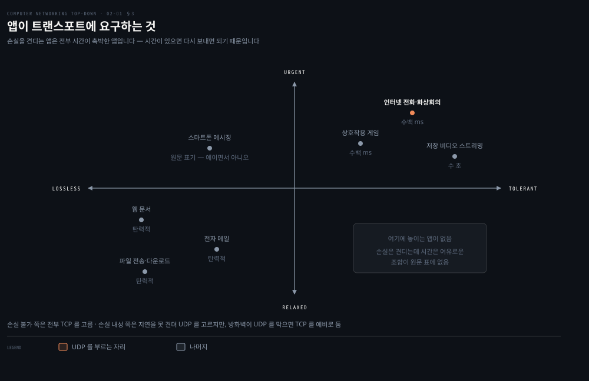
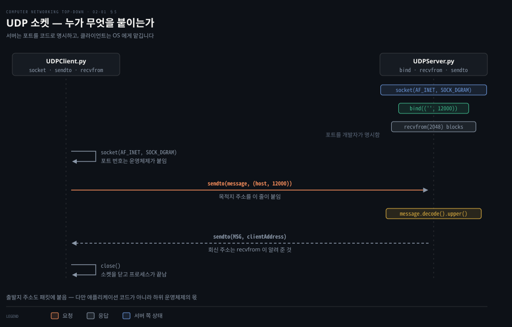
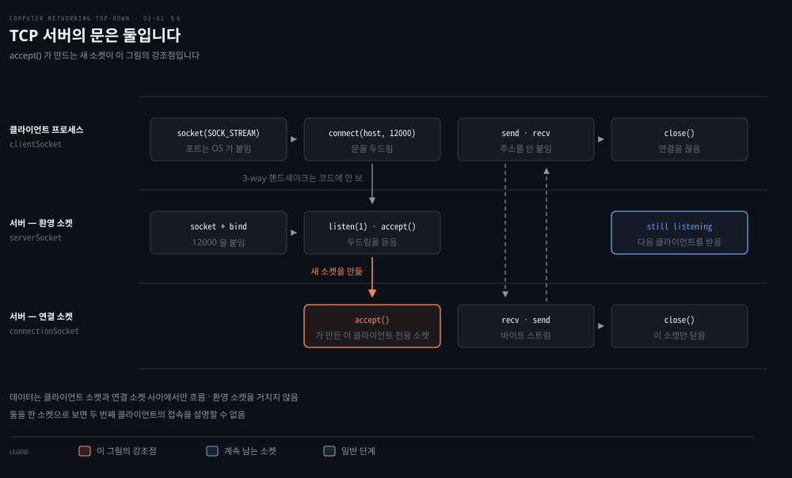
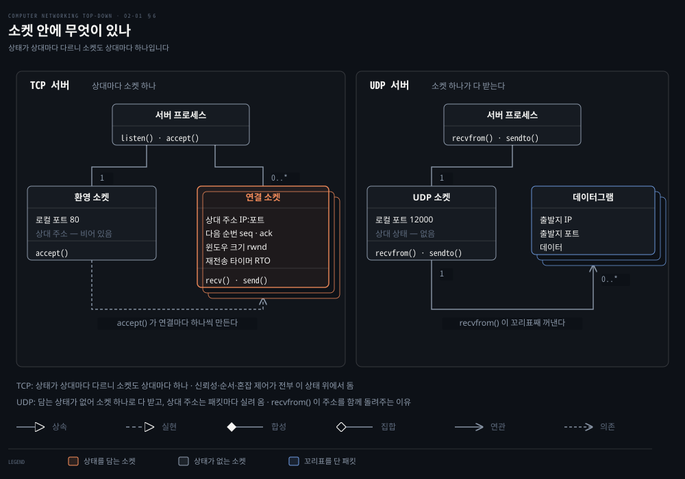

# 앱은 무엇을 고르고 무엇을 못 고르는가

---

> 1장이 인터넷을 밖에서 봤다면 2장은 그 위에 프로그램을 얹는 사람의 자리로 내려옵니다. 그 자리에서 개발자가 실제로 쥐는 결정은 생각보다 적습니다.

## 핵심 요약

> 이 편이 매달린 하나의 생각은 **애플리케이션 개발자는 종단 시스템 위의 코드만 쓰며, 소켓 아래로는 프로토콜 하나를 고르는 것 말고 통제권이 거의 없다**는 것입니다.

원문이 이 경계를 강한 문장으로 긋습니다. 라우터나 링크 계층 스위치에서 도는 소프트웨어는 쓸 필요가 없습니다. 그리고 원문은 한 걸음 더 나갑니다. **쓰고 싶어도 쓸 수 없습니다.** 코어 장비는 애플리케이션 층에서 동작하지 않기 때문입니다.

이 제약이 오히려 인터넷을 키웠습니다. 애플리케이션 소프트웨어를 종단 시스템에 가둔 설계 덕분에 수많은 앱이 빠르게 만들어지고 배포됐습니다. 새 앱을 내려고 라우터 제조사에 허락을 구할 일이 없습니다.

개발자가 트랜스포트 쪽에서 갖는 통제는 원문이 둘로 셉니다. 트랜스포트 프로토콜을 고르는 것, 그리고 최대 버퍼나 최대 세그먼트 크기 같은 파라미터 몇 개를 잡는 것입니다.

그래서 이 편의 절반은 **무엇을 고를 수 있나**이고 나머지 절반은 **고른 것을 코드로 어떻게 만지나**입니다. 뒤쪽에서 원서의 파이썬 예제를 실제로 돌립니다.


## 학습 목표

> 이 편을 읽고 나면 아래 다섯 가지를 스스로 해낼 수 있습니다.

1. 클라이언트-서버와 P2P 구조를 가르고, 자기 확장성이 무엇을 뜻하는지 설명할 수 있습니다.
2. 클라이언트와 서버를 역할이 아니라 원문의 정의로 가를 수 있습니다.
3. 트랜스포트 층에 요구할 수 있는 네 가지를 나열하고, 그중 인터넷이 실제로 주지 않는 둘을 짚을 수 있습니다.
4. TLS 가 왜 세 번째 트랜스포트 프로토콜이 아닌지 말할 수 있습니다.
5. UDP 소켓과 TCP 소켓의 호출 순서를 각각 쓰고, 서버 쪽 소켓이 TCP 에서만 둘인 이유를 설명할 수 있습니다.


## 1. 두 구조 — 항상 켜진 서버냐, 서로가 서버냐

> 코드를 짜기 전에 그 코드를 어느 기계에 어떻게 흩어 놓을지 먼저 정해야 합니다. 선택지는 실질적으로 둘입니다.

### 애플리케이션 구조는 네트워크 구조가 아닙니다

원문이 먼저 헷갈리기 쉬운 두 단어를 갈라 놓습니다. 1장에서 배운 다섯 계층은 **네트워크 구조**이고, 개발자에게는 고정된 것입니다. 바꿀 수 없고 그저 주어진 서비스를 받아 쓸 뿐입니다.

**애플리케이션 구조**는 다릅니다. 이건 개발자가 설계하며, 애플리케이션을 여러 종단 시스템 위에 어떻게 배치할지를 결정합니다. 같은 5계층 위에 전혀 다른 두 배치가 올라갈 수 있습니다.

### 클라이언트-서버

한쪽에 **항상 켜져 있는** 호스트가 있고 그것이 다른 많은 호스트의 요청을 처리합니다. 원문이 이 구조의 성질을 둘로 짚습니다.

- **클라이언트끼리는 직접 통신하지 않습니다**: 웹에서 브라우저 둘이 서로 말을 걸지 않습니다.
- **서버는 고정된 잘 알려진 주소를 갖습니다**: 항상 켜져 있고 주소가 고정이므로 클라이언트는 언제든 그 주소로 패킷을 보내 서버에 닿을 수 있습니다.

문제는 규모입니다. 인기 있는 사이트는 서버 한 대로 요청을 감당하지 못합니다. 그래서 **데이터센터**가 등장합니다. 많은 호스트를 모아 강력한 가상 서버 하나를 만드는 방식입니다.

원문은 대가도 함께 적습니다. 데이터센터에는 수십만 대의 서버가 있을 수 있고 그것을 모두 전기로 돌리고 관리해야 합니다. 게다가 서비스 제공자는 데이터센터에서 데이터를 내보내는 **상호접속 비용과 대역폭 비용을 계속 지불**합니다.

### P2P

반대쪽 끝에는 전용 서버에 대한 의존이 최소이거나 아예 없는 구조가 있습니다. 애플리케이션이 **간헐적으로 연결되는 호스트 쌍** 사이의 직접 통신을 이용합니다. 그 호스트를 피어라 부릅니다.

피어는 서비스 제공자의 소유가 아닙니다. 원문의 표현으로는 사용자가 통제하는 데스크톱과 랩톱이며, 대부분 가정·대학·사무실에 있습니다.

가장 눈에 띄는 성질이 **자기 확장성**입니다. 각 피어는 파일을 요청해서 부하를 만들지만, 동시에 다른 피어에게 파일을 나눠 주어 **시스템의 서비스 용량도 함께 보탭니다.** 사용자가 늘면 부하와 용량이 같이 늘어납니다.

### 그런데 원문의 결론은 클라이언트-서버입니다

자기 확장성과 비용 이점을 다 적어 놓고 원문이 절을 이렇게 닫습니다. P2P 애플리케이션은 고도로 분산된 구조 때문에 **보안·성능·신뢰성의 도전**에 부딪히고, 그 도전 때문에 **오늘날 대부분의 애플리케이션은 클라이언트-서버 구조**를 씁니다.

> **노트의 읽기**: 9판 2장에는 P2P 파일 배포를 정면으로 다루는 절이 없습니다. 장 전체에서 `peer-to-peer` 는 두 번, `BitTorrent` 는 두 번 나오고 모두 지나가는 예시입니다. 서문의 「9판에서 새로워진 것」도 2장 변경으로 HTTP/3·QUIC·CDN·스트리밍만 적습니다. 방금 인용한 저 문장이 이 배치를 그대로 설명합니다.


## 2. 프로세스와 문 — 소켓이 놓인 자리

> 통신하는 것은 프로그램이 아니라 프로세스입니다. 그리고 프로세스가 바깥과 만나는 지점이 소켓입니다.

### 클라이언트와 서버는 역할이 아니라 순서로 갈립니다

여기서 원문이 정의를 하나 못 박습니다. 이 정의는 시험에도 실무에도 계속 나옵니다.

> 한 쌍의 프로세스 사이 통신 세션이라는 맥락에서, **통신을 시작하는**(즉 세션의 시작에서 먼저 상대 프로세스에 접촉하는) 프로세스를 클라이언트라 하고, **접촉되기를 기다리는** 프로세스를 서버라 합니다.

"서버는 큰 기계"가 아닙니다. 먼저 말을 걸었으면 클라이언트이고 기다리고 있었으면 서버입니다. 같은 프로그램이 어떤 세션에서는 클라이언트, 다른 세션에서는 서버가 될 수 있습니다.

### 소켓은 집의 문입니다

원문의 비유가 이 편 전체를 관통합니다. 프로세스는 집이고 소켓은 그 집의 문입니다. 다른 호스트의 프로세스에 메시지를 보내려는 프로세스는 메시지를 자기 문 밖으로 밀어냅니다.

밀어낸 쪽은 문 반대편에 **운송 기반 시설이 있다고 가정**합니다. 그 기반 시설이 메시지를 목적지 프로세스의 문까지 날라 줍니다. 도착한 메시지는 받는 프로세스의 문을 통과해 안으로 들어갑니다.

문의 정확한 위치가 중요합니다. 소켓은 **한 호스트 안에서 애플리케이션 층과 트랜스포트 층 사이의 인터페이스**입니다. 그래서 애플리케이션과 네트워크 사이의 API 라고도 부릅니다.

이 문이 통제의 경계선이기도 합니다. 개발자는 소켓의 애플리케이션 층 쪽은 전부 통제하지만 트랜스포트 층 쪽은 거의 통제하지 못합니다. 남는 것은 프로토콜 선택과 파라미터 몇 개뿐입니다.

### 주소는 두 조각입니다

프로세스에 패킷을 보내려면 두 가지가 필요합니다. **호스트의 주소**와 **그 호스트 안에서 받는 프로세스를 지목하는 식별자**입니다.

호스트는 IP 주소로 지목합니다. 프로세스는, 더 정확히는 받는 소켓은 **목적지 포트 번호**로 지목합니다. 한 호스트가 여러 네트워크 애플리케이션을 돌리고 있을 수 있기 때문입니다.

원문이 두 개를 예로 답니다. 웹 서버는 포트 80, SMTP 를 쓰는 메일 서버 프로세스는 포트 25 입니다. 전체 목록은 IANA 가 관리합니다.[^iana]

> **노트의 읽기**: 원문은 여기서도 IP 주소를 "32비트 양"이라 적습니다. 다만 이번에는 **"지금으로서는 알아야 할 것은"** 이라는 유보를 앞에 달고 4장으로 미룹니다. [01-01](./01-01.인터넷을%20무엇이라%20부르는가.md) 에서 정오로 잡은 §1.1 의 DNS 문장에는 그 유보가 없었습니다. 같은 단순화라도 유보를 붙였느냐가 정오와 축약을 가릅니다.


## 3. 요구할 수 있는 네 가지, 실제로 받는 두 가지

> 새 앱을 만들 때 첫 결정이 TCP 냐 UDP 냐입니다. 그런데 무엇을 기준으로 고르는지부터 정해야 합니다.



### 기차냐 비행기냐

원문의 비유가 선택의 성격을 잘 잡습니다. 두 도시를 오갈 때 기차와 비행기 중 하나를 골라야 하고, 각 수단이 서로 다른 서비스를 냅니다. 기차는 도심에서 타고 내리고 비행기는 이동 시간이 짧습니다. 둘 다 가질 수는 없습니다.

트랜스포트 프로토콜도 같습니다. 쓸 수 있는 프로토콜들의 서비스를 살펴보고 내 애플리케이션의 요구에 가장 맞는 것을 고릅니다.

### 네 개의 축

원문은 트랜스포트 프로토콜이 낼 수 있는 서비스를 네 축으로 분류합니다.

- **신뢰적 데이터 전송**: 보낸 데이터가 오류 없이 온전히 도착함을 보장합니다. 메일·파일 전송·금융 앱에서는 손실이 치명적입니다. 반면 대화형 오디오·비디오 같은 **손실 내성** 앱은 약간의 손실을 잔글리치로 견딥니다.
- **처리량**: 보내는 프로세스가 받는 프로세스에게 비트를 전달하는 속도입니다. 초당 r 비트를 보장해 달라고 요구할 수 있습니다.
- **타이밍**: 보낸 비트가 100 밀리초 안에 도착한다는 식의 보장입니다. 인터넷 전화·화상회의·다중 사용자 게임처럼 상호작용하는 실시간 앱이 원합니다.
- **보안**: 보내는 호스트에서 암호화하고 받는 호스트에서 복호화해 두 프로세스 사이의 기밀성을 줍니다. 무결성과 종단 인증도 여기에 듭니다.

처리량 축에서 앱이 두 종류로 갈립니다. **대역폭 민감** 앱은 특정 처리량을 요구합니다. 32 kbps 로 음성을 부호화하는 인터넷 전화는 그 속도로 보내고 받아야 하며, 필요한 처리량의 절반은 거의 쓸모가 없습니다. **탄력적** 앱은 있는 만큼 씁니다. 메일·파일 전송·웹 전송이 여기 듭니다.

### 원문 Figure 2.4 를 그대로 옮기면

| 애플리케이션 | 데이터 손실 | 처리량 | 시간 민감 |
|---|---|---|---|
| 파일 전송·다운로드 | 손실 불가 | 탄력적 | 아니오 |
| 전자 메일 | 손실 불가 | 탄력적 | 아니오 |
| 웹 문서 | 손실 불가 | 탄력적 (수 kbps) | 아니오 |
| 인터넷 전화·화상회의 | 손실 내성 | 오디오 수 kbps~1 Mbps, 비디오 10 kbps~5 Mbps | 예, 수백 ms |
| 저장 오디오·비디오 스트리밍 | 손실 내성 | 위와 같음 | 예, 수 초 |
| 상호작용 게임 | 손실 내성 | 수 kbps~10 kbps | 예, 수백 ms |
| 스마트폰 메시징 | 손실 불가 | 탄력적 | 예이면서 아니오 |

이 대비는 **노트의 읽기**입니다. 처리량과 타이밍은 「속도」 하나로 뭉뚱그리기 쉬운데 다른 축입니다. 처리량은 초당 몇 비트가 지나가느냐, 곧 파이프의 굵기입니다. 타이밍은 보낸 비트가 몇 밀리초 안에 도착하느냐, 곧 파이프의 길이입니다. 화상회의는 둘 다 요구하고 인터넷은 둘 다 보장하지 않습니다. 길이 쪽을 가르는 전송 지연과 전파 지연은 [01-04](./01-04.%EB%AC%B4%EC%97%87%EC%9D%B4%20%EB%8A%90%EB%A0%A4%EC%A7%80%EA%B3%A0%20%EB%AC%B4%EC%97%87%EC%9D%B4%20%EC%82%AC%EB%9D%BC%EC%A7%80%EB%8A%94%EA%B0%80.md) 에 있습니다.

> **노트의 읽기**: 이 표를 손실 축과 시간 축의 사분면으로 다시 놓으면 **한 칸이 빕니다.** 손실은 견디는데 시간은 급하지 않은 앱이 없습니다. 이유는 표 안에 있습니다. 시간이 넉넉하면 잃은 것을 다시 보내면 되므로, 굳이 손실을 견딜 이유가 없습니다. 손실 내성은 시간이 없을 때만 값을 합니다.

> **노트의 읽기**: 손실 내성은 정보가 하찮아서가 아닙니다. 게임의 위치 패킷은 초당 수십 번 오고, 잃은 것을 되찾는 재전송 왕복도 수십 밀리초라, 되찾은 옛 위치는 도착했을 때 이미 늦습니다. 다음 갱신이 옛 것을 덮어쓰기 때문에 잃어도 감당이 됩니다. 메시지는 반대입니다. 다음 메시지가 앞 것을 대신하지 않고 뒤에 이어질 뿐이라 덮어쓸 것이 없습니다. 아래 표에서 스마트폰 메시징만 시간에 민감하면서도 손실 불가인 이유가 그것입니다.

### TCP 가 주는 것

TCP 의 서비스 모델은 둘입니다. **연결 지향 서비스**는 애플리케이션 메시지가 흐르기 전에 클라이언트와 서버가 트랜스포트 층 제어 정보를 주고받게 합니다. 이 핸드셰이킹이 끝나면 두 프로세스의 소켓 사이에 TCP 연결이 존재한다고 말하며, 이 연결은 양쪽이 동시에 보낼 수 있는 전이중입니다. **신뢰적 데이터 전송 서비스**는 보낸 바이트 스트림이 누락도 중복도 없이 같은 순서로 도착함을 보장합니다.

TCP 에는 하나가 더 붙습니다. **혼잡 제어**입니다. 원문이 이것의 성격을 정확히 짚습니다.

> 통신하는 프로세스의 직접적 이익보다는 **인터넷 전체의 복리를 위한** 서비스입니다.

내 앱을 위한 기능이 아니라 남을 위한 기능이라는 뜻입니다. 그래서 혼잡 제어를 피하고 싶은 앱이 생깁니다.

### UDP 가 주는 것

원문의 표현으로 UDP 는 군더더기 없는 가벼운 프로토콜이며 최소한의 서비스만 냅니다. 없는 것을 세는 편이 빠릅니다.

- **핸드셰이킹**: 없습니다. 비연결이므로 두 프로세스가 곧장 말을 시작합니다.
- **도착 보장**: 없습니다. 소켓에 넣은 메시지가 상대에게 닿는다는 보장이 없습니다.
- **순서 보장**: 없습니다. 도착한 메시지들이 보낸 순서와 다를 수 있습니다.
- **혼잡 제어**: 없습니다. 보내는 쪽이 원하는 속도로 하위 층에 데이터를 밀어 넣습니다.

다만 원문이 괄호로 단서를 답니다. 밀어 넣는 속도가 곧 실제 종단 처리량은 아닙니다. 중간 링크의 용량이나 혼잡 때문에 그보다 낮을 수 있습니다.

### 네 축 중 둘은 애초에 없습니다

여기가 이 절의 핵심입니다. 네 축 중에서 TCP 는 신뢰성을 주고 보안은 TLS 로 보탤 수 있습니다. 그런데 **처리량 보장과 타이밍 보장은 오늘날 인터넷의 트랜스포트 프로토콜이 주지 않습니다.**

그러면 화상회의는 어떻게 도는가. 원문이 답합니다. 그런 앱은 보장이 없다는 전제 아래 **최대한 견디도록 설계되어 왔기 때문에** 대체로 잘 돕니다. 다만 지연이 지나치거나 처리량이 부족하면 영리한 설계에도 한계가 있습니다.

실제 선택도 이 사정을 반영합니다. Zoom 같은 화상회의는 손실을 어느 정도 견디는 대신 최소 속도가 필요하므로 개발자들이 **UDP 를 선호**합니다. TCP 의 혼잡 제어와 패킷 오버헤드를 피하려는 것입니다. 그런데 많은 방화벽이 UDP 트래픽을 막도록 설정돼 있어서, 인터넷 전화 앱은 **UDP 가 실패하면 TCP 를 예비로 쓰도록** 설계되곤 합니다.

### TLS 는 세 번째 트랜스포트 프로토콜이 아닙니다

원문의 보안 상자가 자주 오해받는 지점을 미리 정리합니다. TCP 도 UDP 도 암호화를 제공하지 않습니다. 보내는 프로세스가 소켓에 넣은 평문 비밀번호는 평문 그대로 모든 링크를 지나갑니다.

그래서 TLS 가 나왔는데, 원문이 그 자리를 이렇게 못 박습니다.

> TLS 는 TCP·UDP 와 같은 층위의 세 번째 인터넷 트랜스포트 프로토콜이 **아니라** TCP 의 보강이며, 그 보강은 **애플리케이션 층에서 구현**됩니다.

그래서 앱이 TLS 를 쓰려면 클라이언트와 서버 양쪽 코드에 TLS 라이브러리를 넣어야 합니다. TLS 는 자기만의 소켓 API 를 갖고 그 모양은 기존 TCP 소켓 API 와 비슷합니다. 데이터는 평문으로 TLS 소켓에 들어가 암호문으로 TCP 소켓에 넘어가고, 받는 쪽에서 역순으로 풀립니다.


## 4. 애플리케이션 프로토콜은 애플리케이션이 아니다

> HTTP 를 안다고 웹을 아는 것이 아닙니다. 프로토콜은 애플리케이션의 한 조각입니다.

### 프로토콜이 정의하는 것

프로세스가 소켓으로 메시지를 주고받는다는 것까지는 알았습니다. 그러면 그 메시지는 어떤 구조인가, 필드의 뜻은 무엇인가, 언제 보내는가. 이 물음이 애플리케이션 층 프로토콜의 영역입니다.

원문은 애플리케이션 층 프로토콜이 정의하는 것을 넷으로 셉니다.

1. 주고받는 메시지의 **종류**입니다. 요청 메시지와 응답 메시지 같은 것입니다.
2. 각 메시지 종류의 **문법**입니다. 메시지 안에 어떤 필드가 있고 필드를 어떻게 구분하는지입니다.
3. 필드의 **의미**입니다. 그 안에 담긴 정보가 무엇을 뜻하는지입니다.
4. 프로세스가 **언제 어떻게** 메시지를 보내고 응답하는지의 규칙입니다.

일부 프로토콜은 RFC 로 공개돼 공용 영역에 있습니다. 브라우저 개발자가 HTTP RFC 의 규칙을 따르면 같은 규칙을 따른 어떤 웹 서버에서도 페이지를 받아 올 수 있습니다. 반대로 독점 프로토콜도 많습니다. 원문이 드는 예가 Zoom 입니다.

### 웹은 HTTP 보다 큽니다

원문이 둘을 갈라 놓는 데 한 문단을 씁니다. 웹 애플리케이션은 문서 형식 표준인 HTML, 브라우저, 웹 서버, 그리고 애플리케이션 층 프로토콜로 이뤄집니다. **HTTP 는 그중 한 조각**입니다. 결정적인 조각이지만 전부는 아닙니다.

Netflix 도 같습니다. 비디오를 저장하고 전송하는 서버, 과금과 클라이언트 기능을 관리하는 다른 서버들, 그리고 클라이언트 앱이 있고, DASH 는 서버와 클라이언트가 주고받는 메시지의 형식과 순서를 정할 뿐입니다.

### 원문 Figure 2.5 를 그대로 옮기면

| 애플리케이션 | 애플리케이션 층 프로토콜 | 하위 트랜스포트 프로토콜 |
|---|---|---|
| 전자 메일 | SMTP [RFC 5321] | TCP |
| 웹 | HTTP/2 [RFC 7540] | TCP |
| 파일 전송 | FTP [RFC 959] | TCP |
| 스트리밍 멀티미디어 | HTTP (예: YouTube), DASH | TCP |
| 인터넷 전화 | SIP [RFC 3261], RTP [RFC 3550], 또는 독점 (예: Zoom) | UDP 또는 TCP |

> **원문 정오**: 같은 장이 HTTP 의 정본 RFC 를 두 자리에서 다르게 적습니다. §2.1.5 는 **RFC 7230** 이라 적고, §2.6 은 HTTP 가 **"RFC 2616 에 정확히 정의되어 있다"** 고 적습니다. RFC 2616 은 2014년에 RFC 7230~7235 로 폐기됐으므로, §2.6 의 인용은 같은 책 §2.1.5 보다 한 세대 이전 문서를 가리킵니다.[^rfc2616]

> **지금은 다릅니다**: 책이 든 세 RFC 가 모두 폐기됐습니다. RFC 7230 은 **RFC 9110·9112** 로,[^rfc7230] TLS 를 가리킨 RFC 5246 은 **RFC 8446 과 RFC 9846** 으로 넘어갔습니다.[^rfc5246] RFC 9846 은 2026년 7월 문서라 이 책이 인쇄된 뒤에 나왔습니다.[^rfc9846] 책의 논지는 그대로 유효하고 문서 번호만 바뀐 자리입니다.


## 5. UDP 소켓 — 편지마다 주소를 붙인다

> 원리를 코드로 만져 봐야 소켓이 무엇인지 손에 남습니다. 원서가 여기서 파이썬을 꺼냅니다.



### 왜 파이썬인가

원문이 이유를 밝힙니다. Java·C·C++ 로 쓸 수도 있었지만 파이썬을 고른 것은 **소켓의 핵심 개념이 그대로 드러나기 때문**입니다. 줄 수가 적고 각 줄을 초보에게 어려움 없이 설명할 수 있습니다.

### UDP 가 요구하는 것

보내는 프로세스는 패킷을 문 밖으로 밀기 **전에 목적지 주소를 붙여야 합니다.** 주소는 두 조각입니다. 목적지 호스트의 IP 주소와 목적지 소켓의 포트 번호입니다.

출발지 주소도 패킷에 붙습니다. 그런데 원문이 여기서 한 가지를 짚습니다. **출발지 주소를 붙이는 일은 보통 UDP 애플리케이션 코드가 하지 않고 하위 운영체제가 자동으로 합니다.**

예제 시나리오는 넷입니다. UDP 판과 TCP 판이 같은 시나리오를 씁니다.

1. 클라이언트가 키보드에서 한 줄을 읽어 서버로 보냅니다.
2. 서버가 데이터를 받아 문자들을 대문자로 바꿉니다.
3. 서버가 바꾼 데이터를 클라이언트에게 돌려보냅니다.
4. 클라이언트가 받은 줄을 화면에 찍습니다.

### UDPClient.py

```python
from socket import *
serverName = 'hostname'
serverPort = 12000
clientSocket = socket(AF_INET, SOCK_DGRAM)
message = input('Input lowercase sentence:')
clientSocket.sendto(message.encode(), (serverName, serverPort))
modifiedMessage, serverAddress = clientSocket.recvfrom(2048)
print(modifiedMessage.decode())
clientSocket.close()
```

읽을 곳은 네 줄입니다.

- `socket(AF_INET, SOCK_DGRAM)`: 첫 인자는 주소 패밀리로 `AF_INET` 은 하위 네트워크가 IPv4 임을 뜻합니다. 둘째 인자 `SOCK_DGRAM` 이 이것을 UDP 소켓으로 만듭니다.
- **클라이언트 소켓의 포트를 지정하지 않습니다**: 운영체제가 대신 붙여 줍니다.
- `sendto()`: 목적지 주소를 메시지에 붙이고 그 결과 패킷을 소켓에 밀어 넣습니다. 바이트를 보내야 하므로 `encode()` 로 문자열을 바이트로 바꿉니다.
- `recvfrom(2048)`: 데이터는 `modifiedMessage` 로, 패킷의 **출발지 주소**는 `serverAddress` 로 들어갑니다. 클라이언트는 서버 주소를 이미 알고 있어 쓰지 않지만 파이썬이 어쨌든 돌려줍니다.

### UDPServer.py

```python
from socket import *
serverPort = 12000
serverSocket = socket(AF_INET, SOCK_DGRAM)
serverSocket.bind(('', serverPort))
print("The server is ready to receive")
while True:
    message, clientAddress = serverSocket.recvfrom(2048)
    modifiedMessage = message.decode().upper()
    serverSocket.sendto(modifiedMessage.encode(), clientAddress)
```

클라이언트와 크게 다른 줄이 둘입니다.

- `bind(('', serverPort))`: 포트 12000 을 서버 소켓에 **명시적으로** 배정합니다. 클라이언트에서는 운영체제가 하던 일을 여기서는 개발자가 적습니다. 이후 서버 IP 의 12000 으로 오는 패킷은 이 소켓으로 갑니다.
- `clientAddress` 의 용도: 서버는 이 주소를 **회신 주소**로 씁니다. 우편물의 발신인 주소와 같은 역할입니다. 이것이 없으면 서버는 답을 어디로 보낼지 모릅니다.

### 실제로 돌려 봤습니다

원서 코드를 그대로 두고 서버 이름만 넣어 돌렸습니다. 파이썬 3.14.4 에서 수정 없이 동작합니다.

```bash
python3 UDPServer.py &            # The server is ready to receive
echo "hello kurose" | python3 UDPClient.py 127.0.0.1
# HELLO KUROSE | from ('127.0.0.1', 12000)
```

`serverName` 에 `localhost` 를 넣어도 같았습니다. `AF_INET` 이 IPv4 만 요구하므로 이름 해석이 A 레코드 쪽으로 걸러집니다.


## 6. TCP 소켓 — 서버의 문이 둘인 이유

> 같은 응용을 TCP 로 다시 씁니다. 서버 쪽에 소켓이 하나 더 생기는데, 원문 자신이 여기서 학생들이 헷갈린다고 적습니다.



### 먼저 악수를 합니다

TCP 는 연결 지향입니다. 서로 데이터를 보내기 전에 악수를 하고 TCP 연결을 세웁니다. 연결의 한쪽 끝은 클라이언트 소켓에, 다른 끝은 서버 소켓에 붙습니다.

3-way 핸드셰이크는 **트랜스포트 층 안에서 일어나며 클라이언트와 서버 프로그램에는 전혀 보이지 않습니다.** 코드에는 `connect()` 한 줄뿐입니다.

연결이 서면 UDP 와 결정적으로 달라집니다. 한쪽이 보내고 싶으면 그냥 데이터를 소켓으로 떨어뜨립니다. **UDP 처럼 매번 목적지 주소를 붙이지 않습니다.**

### 문이 둘인 까닭

서버가 준비되어 있으려면 두 가지가 필요합니다. 첫째, 클라이언트보다 먼저 프로세스로 떠 있어야 합니다. 둘째, 임의의 호스트에서 오는 최초 접촉을 **맞이하는 특별한 문**이 있어야 합니다.

원문이 이것을 "환영하는 문을 두드린다"고 부릅니다. 서버가 두드리는 소리를 들으면 **새 문을 만듭니다.** 그 클라이언트 전용의 새 소켓입니다.

- **환영 소켓** `serverSocket`: 이 서버와 말하고 싶은 모든 클라이언트의 최초 접촉 지점입니다.
- **연결 소켓** `connectionSocket`: 접속한 클라이언트 하나마다 새로 생기는 전용 소켓입니다.

애플리케이션 관점에서 클라이언트 소켓과 서버의 연결 소켓은 **파이프로 직접 이어진 것처럼** 보입니다. 클라이언트가 임의의 바이트를 밀어 넣으면 TCP 가 보낸 순서 그대로 서버에 도착시킵니다.

### TCPClient.py 와 TCPServer.py

```python
# TCPClient.py
from socket import *
serverName = 'servername'
serverPort = 12000
clientSocket = socket(AF_INET, SOCK_STREAM)
clientSocket.connect((serverName, serverPort))
sentence = input('Input lowercase sentence:')
clientSocket.send(sentence.encode())
modifiedSentence = clientSocket.recv(1024)
print('From Server: ', modifiedSentence.decode())
clientSocket.close()
```

```python
# TCPServer.py
from socket import *
serverPort = 12000
serverSocket = socket(AF_INET, SOCK_STREAM)
serverSocket.bind(('', serverPort))
serverSocket.listen(1)
print('The server is ready to receive')
while True:
    connectionSocket, addr = serverSocket.accept()
    sentence = connectionSocket.recv(1024).decode()
    capitalizedSentence = sentence.upper()
    connectionSocket.send(capitalizedSentence.encode())
    connectionSocket.close()
```

UDP 판과 다른 줄을 짚습니다.

- `SOCK_STREAM`: 이것이 TCP 소켓을 뜻합니다. `SOCK_DGRAM` 자리입니다.
- `connect((serverName, serverPort))`: 이 줄이 실행되면 3-way 핸드셰이크가 수행되고 연결이 섭니다.
- `send()` 와 `sendto()`: TCP 에서는 목적지 주소를 붙이지 않고 바이트만 떨어뜨립니다.
- `listen(1)`: 클라이언트의 연결 요청을 듣습니다. 인자는 큐에 쌓아 둘 연결의 최대 수이며 최소 1 입니다.
- `accept()`: 클라이언트가 문을 두드리면 이 메서드가 새 소켓 `connectionSocket` 을 만듭니다.
- 서버는 `connectionSocket` 만 닫습니다. `serverSocket` 은 열려 있어서 다음 클라이언트가 문을 두드릴 수 있습니다.

### 원문이 여기서 두 번 어긋납니다

한 절 안에서 설명이 자기 코드와, 그리고 실제 동작과 각각 어긋납니다. 하나씩 봅니다.

> **원문 정오**: 클라이언트의 수신부를 설명하며 원문이 **"문자가 캐리지 리턴으로 줄이 끝날 때까지 `modifiedSentence` 에 계속 쌓인다"** 고 적습니다. `recv()` 는 캐리지 리턴을 기다리지 않습니다. 도착해 있는 바이트를 그때 돌려줄 뿐입니다. TCP 는 바이트 스트림이라 메시지 경계가 없으며, 이것이 애플리케이션이 스스로 경계를 정해야 하는 이유입니다. 바로 위의 `input()` 설명은 반대로 맞습니다. `input()` 은 실제로 줄 단위로 읽습니다.

원문 코드를 그대로 두고 서버만 응답을 두 조각으로 나눠 보내도록 고쳐 확인했습니다.

```bash
# 서버: 대문자로 바꾼 뒤 앞 5바이트를 보내고 0.3초 뒤 나머지 + CRLF 를 보냄
# 클라이언트: 원서 그대로 recv(1024) 한 번
python3 TCPServer_split.py & python3 TCPClient_one.py
# recv 1회가 돌려준 것: b'HELLO'
```

`\r\n` 이 뒤에 따라왔는데도 `recv` 는 `b'HELLO'` 에서 돌아왔습니다.

> **원문 정오**: 같은 절에서 코드 목록은 `modifiedSentence = clientSocket.recv(1024)` 인데, 바로 아래 줄별 설명은 같은 줄을 `clientSocket.recv(2048)` 로 인용합니다. 한 화면 안에서 자기 코드와 어긋납니다. 덧붙여 연결 소켓 설명의 마지막 문장은 `not only ... but also` 에서 `not` 이 빠져 있어, 글자대로 읽으면 "TCP 는 도착만 보장한다"는 반대 뜻이 됩니다.


## 7. QUIC API 는 무엇을 감추나

> HTTP/3 개발자는 UDP 소켓을 직접 만지지 않습니다. 원문이 절을 코드 없이 API 관점으로만 닫습니다.

### 악수가 하나로 합쳐집니다

브라우저가 HTTP/3 으로 페이지를 요청하면 전통적인 TCP 핸드셰이크 대신 **UDP 위에서 QUIC 핸드셰이크**를 시작합니다.

핵심은 합쳐졌다는 것입니다. QUIC 는 **TLS 1.3 핸드셰이크를 자기 핸드셰이크 안에 넣습니다.** 그래서 연결 수립과 암호화 수립이 **나란히** 이뤄집니다. HTTP/2 때는 이 둘이 차례로 일어났습니다.

UDP 는 비연결인데 그 위의 QUIC 는 연결 지향입니다. 덕분에 클라이언트와 서버가 서로 다른 HTTP 요청들 사이에도 연결 정보를 유지합니다.

### 스트림이라는 단위

서버는 보낼 메시지마다 QUIC API 로 **별도의 스트림과 스트림 ID** 를 만듭니다. 원문의 예로 스트림 1 은 HTML 기본 페이지, 스트림 2 는 CSS 객체, 스트림 3 은 이미지입니다. 셋을 연달아 같은 QUIC 연결에 밀어 넣습니다.

HTTP/3 이 메시지를 보낼 때 QUIC API 에 지정하는 것은 두 가지뿐입니다. QUIC 연결 ID 와 스트림 ID 입니다. 나머지는 QUIC 하위 층이 내부에서 처리합니다.

- 암호화
- 스트림을 더 작은 프레임으로 쪼개기
- 스트림 다중화

우선순위도 지정할 수 있습니다. HTML 이 페이지의 기본 구조를 이루므로 이미지나 자바스크립트보다 먼저 보내라고 QUIC 에 지시할 수 있습니다.

원문이 이 절을 한 문장으로 닫습니다. HTTP/3 코드는 **QUIC API 와 상호작용하지 하위 UDP 소켓 API 와 상호작용하지 않습니다.** 그래서 개발자 관점에서 HTTP/3 은 QUIC 라는 트랜스포트 프로토콜 위에서 돕니다.

> **노트의 읽기**: 앞의 두 절과 달리 이 절에는 실행할 코드가 없습니다. UDP 와 TCP 는 표준 라이브러리 `socket` 모듈로 열 줄이면 되지만, QUIC 는 파이썬 표준 라이브러리에 없어서 별도 구현체가 필요합니다. 원문이 코드를 넣지 않은 자리가 곧 생태계의 현재 상태를 보여 줍니다.


## 애플리케이션 층 치트시트

> 고를 때 무엇을 보는지, 코드에서 어느 줄이 갈리는지 두 장으로 줄였습니다.

**무엇을 고르나**

| 물음 | TCP 로 | UDP 로 |
|---|---|---|
| 한 바이트라도 잃으면 안 되나 | 예 | 아니오 |
| 순서가 중요한가 | 예 | 아니오 |
| 지연이 몇백 ms 안이어야 하나 | 아니오 | 예 |
| 혼잡 제어를 받아들이나 | 예 | 아니오, 피하고 싶음 |
| 방화벽을 반드시 통과해야 하나 | 예 | UDP 차단 시 TCP 예비 필요 |
| 암호화가 필요한가 | TLS 를 애플리케이션 층에 얹음 | QUIC 를 쓰면 내장 |

**코드에서 갈리는 줄**

| 단계 | UDP | TCP |
|---|---|---|
| 소켓 생성 | `socket(AF_INET, SOCK_DGRAM)` | `socket(AF_INET, SOCK_STREAM)` |
| 서버 포트 배정 | `bind(('', 12000))` | `bind(('', 12000))` |
### 연결 소켓은 무엇을 담는가



여기서부터는 **노트의 읽기**입니다. 2026-09-08 회차에서 「이게 소켓에 있어야 돌아가는 건지 흐름이 안 그려진다」는 물음이 나왔습니다. 문이 둘이라는 말만으로는 왜 둘이어야 하는지가 보이지 않습니다.

소켓은 문이면서 **상태를 담는 그릇**입니다. TCP 연결 소켓은 상대 주소, 다음 순번, 윈도우 크기, 재전송 타이머를 담습니다. 신뢰성과 순서와 혼잡 제어가 전부 이 상태 위에서 돕니다. 상태가 상대마다 다르니 소켓도 상대마다 하나여야 합니다. 환영 소켓이 상대를 비워 두고 `accept()` 가 연결마다 새 소켓을 만드는 까닭이 그것입니다.

UDP 소켓은 담는 상태가 없습니다. 그래서 하나로 모두 받고, 상대 주소는 패킷마다 실려 옵니다. `recvfrom()` 이 데이터와 함께 주소를 돌려주는 이유가 여기 있습니다. §5 의 `clientAddress` 가 바로 그 꼬리표입니다. 상태 변수 하나하나가 어떻게 움직이는지는 [03-03](./03-03.TCP%20%EB%8A%94%20%EC%96%B4%EB%96%BB%EA%B2%8C%20%EC%84%B8%EA%B3%A0%20%EC%96%B4%EB%96%BB%EA%B2%8C%20%EA%B8%B0%EB%8B%A4%EB%A6%AC%EB%8A%94%EA%B0%80.md) 과 [03-04](./03-04.%ED%9D%90%EB%A6%84%20%EC%A0%9C%EC%96%B4%EC%99%80%20%EC%97%B0%EA%B2%B0%20%EA%B4%80%EB%A6%AC%2C%20%EA%B7%B8%EB%A6%AC%EA%B3%A0%20%ED%98%BC%EC%9E%A1.md) 의 몫입니다.

| 대기 | 없음 | `listen(1)` 뒤 `accept()` |
| 클라이언트 연결 | 없음 | `connect((host, port))` |
| 송신 | `sendto(data, (host, port))` | `send(data)` |
| 수신 | `recvfrom(2048)` — 주소 함께 | `recv(1024)` — 주소 없음 |
| 서버 소켓 수 | 1 개 | 2 개 (환영 + 연결) |


## 심화 학습

> 원서 예제를 자기 기계에서 돌리고, 열린 소켓을 눈으로 확인하는 데까지 가면 이 편이 손에 남습니다.

원서 코드를 그대로 돌린 뒤 열려 있는 소켓을 확인해 보면, 지금까지 읽은 IP·포트·소켓의 관계가 한 줄로 보입니다.

```bash
# 서버를 띄운 뒤 UDP 12000 을 누가 잡고 있는지
lsof -nP -iUDP:12000

# TCP 로 바꿔 띄운 뒤, 환영 소켓은 LISTEN 상태로 남습니다
lsof -nP -iTCP:12000 -sTCP:LISTEN

# 잘 알려진 포트의 정본 등록부에서 확인
# https://www.iana.org/assignments/service-names-port-numbers/
```

원문이 권하는 변형도 그대로 해 볼 만합니다. 서버가 대문자로 바꾸는 대신 문자 `s` 가 몇 번 나오는지 세어 돌려주게 고치거나, 클라이언트가 한 번 받고 끝내지 않고 계속 문장을 보내게 고치는 것입니다. 뒤쪽 변형에서 TCP 판이 먼저 깨지는데, 서버가 `connectionSocket` 을 한 번 쓰고 닫기 때문입니다.


## 면접 대비

> 이 편에서 실제로 물어보는 자리는 소켓의 위치, 네 축 중 없는 둘, 그리고 서버 소켓이 둘인 이유입니다.

### 한 줄 정의

- **소켓**: 한 호스트 안에서 애플리케이션 층과 트랜스포트 층 사이의 인터페이스입니다.
- **클라이언트**: 세션에서 먼저 접촉을 시작하는 프로세스입니다.
- **자기 확장성**: 피어가 부하를 만들면서 동시에 서비스 용량도 보태는 성질입니다.
- **환영 소켓**: 모든 클라이언트의 최초 접촉을 받는 서버 소켓입니다.

### 핵심 포인트 세 가지

1. 인터넷 트랜스포트 층은 신뢰성은 주지만 **처리량 보장도 타이밍 보장도 주지 않습니다.**
2. TLS 는 세 번째 트랜스포트 프로토콜이 아니라 **애플리케이션 층에서 구현된 TCP 의 보강**입니다.
3. TCP 서버는 소켓이 둘입니다. 환영 소켓은 계속 남고 연결 소켓은 클라이언트마다 새로 생깁니다.

### 자주 묻는 질문

**"UDP 를 쓰면 왜 빠릅니까?"** 전송 속도가 빠른 것이 아니라 기다릴 일이 없는 것입니다. 핸드셰이크가 없고 재전송을 기다리지 않으며 혼잡 제어에 눌리지 않습니다. 링크 속도 자체는 그대로입니다.

**"TCP 를 쓰면 메시지 경계가 유지됩니까?"** 아닙니다. TCP 는 바이트 스트림입니다. `send()` 를 세 번 했다고 상대의 `recv()` 가 세 번 나뉘어 오지 않습니다. 이 편의 실측이 그 반례입니다.

**"화상회의는 왜 UDP 를 씁니까?"** 손실은 잔글리치로 견딜 수 있지만 지연은 못 견디기 때문입니다. 다만 방화벽이 UDP 를 막는 환경이 많아 TCP 예비 경로를 함께 둡니다.


## 핵심 개념 체크리스트

> 아래를 보지 않고 말할 수 있으면 이 편은 통과입니다.

- [ ] 애플리케이션 구조와 네트워크 구조의 차이를 말할 수 있습니다.
- [ ] 클라이언트-서버와 P2P 를 가르고 자기 확장성을 설명할 수 있습니다.
- [ ] 클라이언트와 서버를 원문의 정의로 가를 수 있습니다.
- [ ] 소켓이 어느 두 층 사이에 있는지 말할 수 있습니다.
- [ ] 프로세스를 지목하는 데 필요한 두 조각을 댈 수 있습니다.
- [ ] 트랜스포트 서비스의 네 축을 나열할 수 있습니다.
- [ ] 대역폭 민감 앱과 탄력적 앱을 구별할 수 있습니다.
- [ ] 인터넷이 주지 않는 두 보장을 짚을 수 있습니다.
- [ ] TLS 가 어느 층에서 구현되는지 말할 수 있습니다.
- [ ] 애플리케이션 층 프로토콜이 정의하는 네 가지를 셀 수 있습니다.
- [ ] UDP 소켓과 TCP 소켓의 호출 순서를 각각 쓸 수 있습니다.
- [ ] 환영 소켓과 연결 소켓의 차이를 설명할 수 있습니다.
- [ ] QUIC 핸드셰이크가 TCP 대비 무엇을 합쳤는지 말할 수 있습니다.


## 관련 문서

- [01-01 인터넷을 무엇이라 부르는가](./01-01.인터넷을%20무엇이라%20부르는가.md) — 이 편이 딛고 선 다섯 계층과 캡슐화
- [02-02 웹은 어떻게 주고받는가](./02-02.웹은%20어떻게%20주고받는가.md) — 이 편의 다음. 고른 TCP 위에서 HTTP 가 실제로 무엇을 하는지
- [Computer Networking — 정독 인덱스](./README.md) — 8개 장 전체 지도


## 참고 자료

- 원본: 《Computer Networking: A Top-Down Approach》 9판 (James F. Kurose · Keith W. Ross, Pearson)
- 다룬 범위: §2.1 Principles of Network Applications · §2.6 Socket Programming
- [Python `socket` 모듈 문서](https://docs.python.org/3/library/socket.html) — 이 편에서 돌린 예제의 API 정본

[^iana]: IANA — Service Name and Transport Protocol Port Number Registry. 원문이 "모든 인터넷 표준 프로토콜의 잘 알려진 포트 목록"의 출처로 드는 곳입니다. <https://www.iana.org/assignments/service-names-port-numbers/service-names-port-numbers.xhtml>
[^rfc2616]: RFC Editor — RFC 2616 정보 페이지. "This RFC is now obsolete, see RFC 7230, RFC 7231, RFC 7232, RFC 7233, RFC 7234, RFC 7235." <https://www.rfc-editor.org/info/rfc2616>
[^rfc7230]: RFC Editor — RFC 7230 정보 페이지. "This RFC is now obsolete, see RFC 9110, RFC 9112." <https://www.rfc-editor.org/info/rfc7230>
[^rfc5246]: RFC Editor — RFC 5246 정보 페이지. "This RFC is now obsolete, see RFC 8446, RFC 9846." <https://www.rfc-editor.org/info/rfc5246>
[^rfc9846]: RFC Editor — RFC 9846 "The Transport Layer Security (TLS) Protocol Version 1.3" (2026년 7월). "This document obsoletes RFC 8446, which specified TLS 1.3. This document obsoletes RFC 5246 (specifying TLS 1.2)..." <https://www.rfc-editor.org/info/rfc9846>
