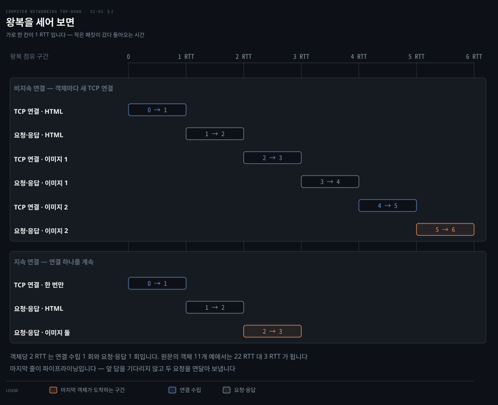
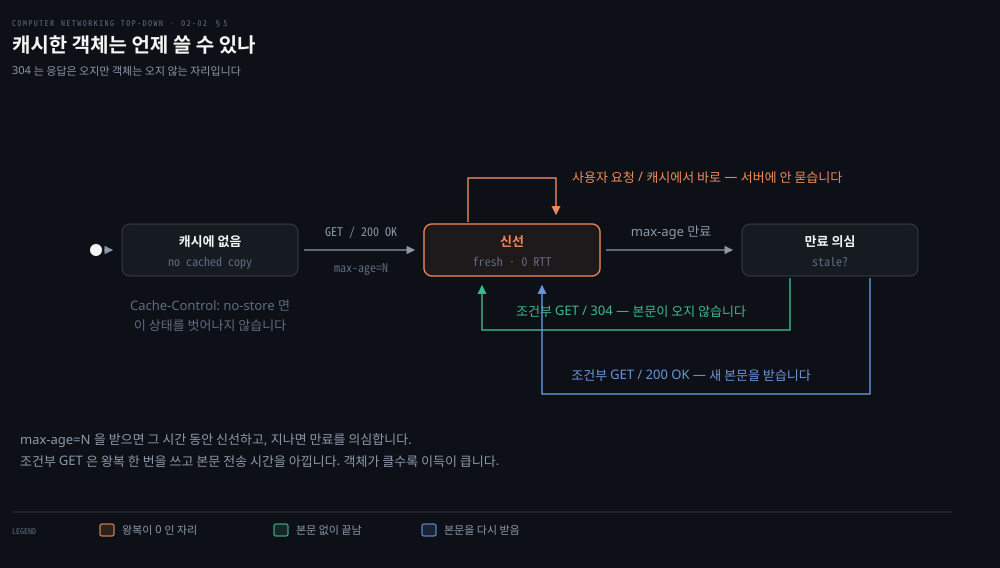
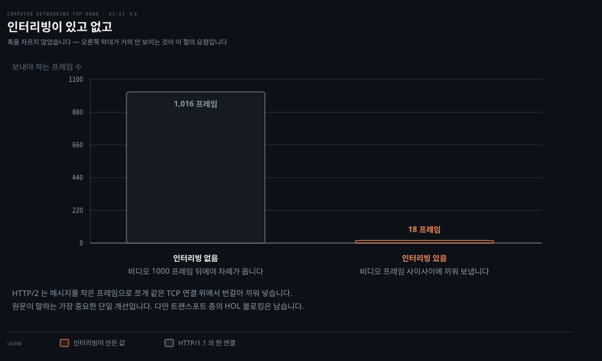
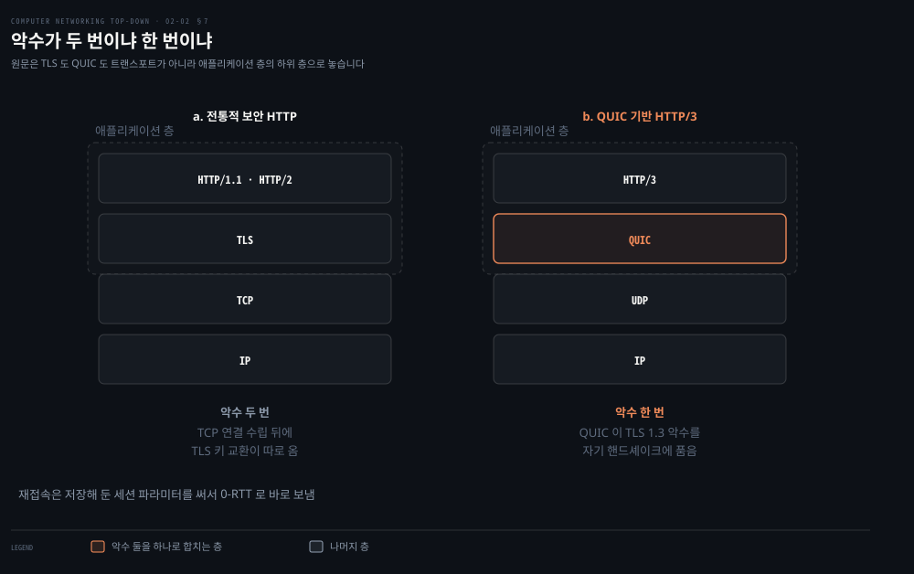

# 웹은 어떻게 주고받는가

---

> 앞 편에서 TCP 를 골랐습니다. 이제 그 위에서 무엇을 주고받는지 봅니다. 놀랄 만큼 단순한 텍스트인데, 그 단순함이 만든 지연을 세 번에 걸쳐 걷어낸 것이 HTTP 의 역사입니다.

## 핵심 요약

> 이 편이 매달린 하나의 생각은 **HTTP 는 상태를 갖지 않는 텍스트 요청·응답이며, 그 설계가 만든 왕복 비용을 줄여 온 과정이 HTTP/1.1 과 2 와 3 이다**라는 것입니다.

원문이 HTTP 의 성격을 한 단어로 못 박습니다. **무상태**입니다. 같은 클라이언트가 몇 초 사이에 같은 객체를 두 번 요청해도 서버는 "방금 보내 드렸는데요"라고 하지 않습니다. 앞서 무엇을 했는지 완전히 잊었기 때문에 그냥 다시 보냅니다.

이 망각이 서버를 가볍게 만들었습니다. 덕분에 수천 개의 동시 TCP 연결을 처리하는 고성능 웹 서버가 가능했습니다. 대신 값을 치릅니다. 사용자를 알아보려면 쿠키를 얹어야 하고, 매번 새로 물으면 왕복이 쌓입니다.

**이 편의 절반은 그 왕복을 줄이는 이야기입니다.** 원문은 최소 지연을 2 RTT 로 잡고 시작합니다. 연결을 세우는 데 한 번, 요청하고 받는 데 한 번입니다. 여기서 세 번의 감축이 이어집니다.

1. **연결을 재사용합니다.** 지속 연결이 객체마다 붙던 연결 수립 왕복을 없앱니다.
2. **아예 안 물어봅니다.** 브라우저 캐시가 요청 자체를 지웁니다.
3. **악수를 합칩니다.** HTTP/3 은 연결 수립과 암호화 수립을 한 왕복에 끝냅니다.

그런데 이 장은 **상호 참조가 여러 자리에서 어긋납니다.** 그 자리를 각각 표시해 두었습니다.


## 학습 목표

> 이 편을 읽고 나면 아래 다섯 가지를 스스로 해낼 수 있습니다.

1. HTTP 가 무상태라는 말의 뜻과 그 대가를 설명할 수 있습니다.
2. 비지속 연결의 객체당 지연을 RTT 단위로 계산할 수 있습니다.
3. 요청 메시지와 응답 메시지의 구조를 각각 세 부분으로 나눠 말할 수 있습니다.
4. 조건부 GET 이 무엇을 아끼는지, 304 응답이 무엇을 담지 않는지 말할 수 있습니다.
5. HOL 블로킹이 HTTP/1.1·2·3 에서 각각 어떻게 다루어지는지 구별할 수 있습니다.


## 1. HTTP 의 자리와 무상태라는 선택

> 웹 페이지는 객체의 묶음이고, HTTP 는 그 객체를 하나씩 요청하고 받는 규칙입니다. 그리고 서버는 아무것도 기억하지 않습니다.

### 페이지가 아니라 객체를 나릅니다

웹 페이지는 **객체**로 이뤄집니다. 객체란 URL 하나로 주소가 매겨지는 파일입니다. HTML 파일, JPEG 이미지, 자바스크립트 파일, CSS 스타일시트, 비디오 클립이 모두 객체입니다.

대부분의 페이지는 **기반 HTML 파일 하나와 그것이 참조하는 여러 객체**로 됩니다. 원문의 예로 HTML 텍스트와 JPEG 다섯 장이 있으면 그 페이지는 객체가 여섯 개입니다.

URL 은 두 조각입니다. 객체를 가진 서버의 호스트 이름과 객체의 경로 이름입니다.

```properties
http://www.someSchool.edu/someDepartment/picture.gif
       └────── 호스트 이름 ──────┘└─── 경로 이름 ────┘
```

### 계층이 벌어 주는 것

HTTP 클라이언트가 먼저 TCP 연결을 세우고, 그다음부터 브라우저와 서버는 소켓 인터페이스로 TCP 에 접근합니다. 클라이언트가 메시지를 소켓에 넣는 순간 그 메시지는 **클라이언트의 손을 떠나 TCP 의 손에 들어갑니다.**

원문이 여기서 계층 구조의 이득을 짚습니다. TCP 가 신뢰적 전송을 주므로 **HTTP 는 데이터 손실을 걱정할 필요도, TCP 가 손실과 순서 뒤바뀜에서 어떻게 회복하는지 알 필요도 없습니다.** 그건 TCP 와 그 아래 층의 일입니다.

### 무상태

서버는 요청받은 파일을 보내면서 **클라이언트에 관한 어떤 상태 정보도 저장하지 않습니다.** 그래서 HTTP 를 무상태 프로토콜이라 부릅니다.

이 선택이 무엇을 벌었는지 원문이 뒤의 쿠키 절에서 밝힙니다. 서버 설계가 단순해졌고, 그 덕분에 **수천 개의 동시 TCP 연결을 처리하는 고성능 웹 서버**를 만들 수 있었습니다.

### 버전은 넷입니다

| 버전 | 표준 | 하위 트랜스포트 |
|---|---|---|
| HTTP/1.0 | 1990년대 초 | TCP |
| HTTP/1.1 | 1997년 표준화 | TCP |
| HTTP/2 | 2015년 표준화 | TCP |
| HTTP/3 | 2022년 표준화 | UDP 위의 QUIC |

> **원문 정오**: 원문이 이 자리에서 **"HTTP 1.1 [RFC 7320]"** 이라 적습니다. RFC 7320 은 HTTP/1.1 이 아니라 **"URI Design and Ownership"(BCP 190)** 입니다.[^rfc7320] HTTP/1.1 의 메시지 문법은 **RFC 7230** 이고, 바로 앞 문단의 목록에는 7230 이 제대로 적혀 있습니다. 숫자 하나가 뒤바뀐 자리입니다.


## 2. 연결을 끊느냐 두느냐 — 왕복을 세어 보는 문제

> 객체마다 연결을 새로 세우면 객체마다 왕복이 두 번씩 듭니다. 열한 개짜리 페이지에서 그 차이가 스물두 번과 두 번으로 벌어집니다.



### 개발자가 내려야 하는 결정

클라이언트가 요청을 연달아 하고 서버가 각각에 답하는 상황에서, 개발자는 하나를 정해야 합니다. **요청·응답 쌍마다 별도의 TCP 연결을 쓸 것인가, 아니면 모든 요청과 응답을 같은 연결로 보낼 것인가.** 앞쪽이 비지속 연결이고 뒤쪽이 지속 연결입니다.

### RTT 라는 단위

**왕복 시간(RTT)** 은 작은 패킷이 클라이언트에서 서버로 갔다가 돌아오는 데 걸리는 시간입니다. 여기에는 세 가지가 들어갑니다.

- 패킷 전파 지연
- 중간 라우터와 스위치에서의 패킷 큐잉 지연
- 패킷 처리 지연

앞 장에서 성분으로 분해했던 그 지연들입니다. [01-04](./01-04.무엇이%20느려지고%20무엇이%20사라지는가.md) 가 이 넷을 다뤘습니다.

### 객체 하나에 2 RTT

사용자가 링크를 누르면 브라우저가 TCP 연결을 시작합니다. 3-way 핸드셰이크의 **처음 두 부분이 1 RTT** 를 씁니다.

그다음이 영리합니다. 핸드셰이크의 세 번째 부분인 확인 응답에 **HTTP 요청 메시지를 실어서** 함께 보냅니다. 요청이 서버에 닿으면 서버가 HTML 파일을 연결에 흘려보냅니다. 이 요청·응답이 **또 1 RTT** 를 씁니다.

그래서 대략적인 총 응답 시간이 이렇습니다.

```properties
총 응답 시간 ≈ 2 x RTT + 서버에서 HTML 파일을 내보내는 전송 시간
```

### 비지속 연결이 치르는 값

원문의 예는 기반 HTML 하나와 JPEG 열 장, 모두 열한 개 객체입니다. 비지속 연결에서는 **각 TCP 연결이 정확히 요청 하나와 응답 하나만 나릅니다.** 그래서 이 페이지 한 장에 **TCP 연결이 열한 개** 생깁니다.

원문이 단점을 둘로 셉니다.

1. 요청되는 객체마다 새 연결을 세우고 유지해야 합니다. 연결마다 TCP 버퍼를 할당하고 TCP 변수를 클라이언트와 서버 양쪽에 둬야 하는데, 수백 클라이언트를 동시에 받는 서버에는 상당한 부담입니다.
2. 객체마다 2 RTT 의 전달 지연을 겪습니다. 연결을 세우는 데 1 RTT, 요청하고 받는 데 1 RTT 입니다.

### 지속 연결이 바꾸는 것

HTTP/1.1 과 HTTP/2 가 쓰는 방식입니다. 서버가 응답을 보낸 뒤에도 **TCP 연결을 열어 둡니다.** 같은 클라이언트와 서버 사이의 이후 요청과 응답이 같은 연결로 갑니다.

원문이 범위를 두 단계로 넓힙니다. 페이지 하나 전체를 단일 지속 연결로 보낼 수 있고, 나아가 **같은 서버에 있는 여러 페이지도 같은 지속 연결 하나로** 보낼 수 있습니다.

여기에 **파이프라이닝**이 붙습니다. 앞선 요청의 답을 기다리지 않고 요청을 연달아 보내는 것입니다. 서버는 연달아 온 요청을 받으면 객체를 연달아 돌려보냅니다.

연결은 언제 닫히나. 원문의 답은 시간입니다. 서버는 보통 **일정 시간 쓰이지 않으면** 연결을 닫으며, 그 시간은 설정 가능한 값입니다.


## 3. 메시지는 그냥 텍스트입니다

> HTTP 메시지를 처음 보면 맥이 빠집니다. 사람이 읽을 수 있는 평범한 ASCII 텍스트 몇 줄입니다.

### 요청 메시지

```properties
GET /somedir/page.html HTTP/1.1
Host: www.someschool.edu
Connection: close
User-agent: Mozilla/5.0
Accept-language: fr
```

첫 줄이 **요청 줄**이고 나머지가 **헤더 줄**입니다. 각 줄은 캐리지 리턴과 라인 피드로 끝나고, 마지막 줄 뒤에 캐리지 리턴과 라인 피드가 하나 더 붙습니다. 이 빈 줄이 헤더의 끝을 알립니다.

요청 줄에는 필드가 셋 있습니다. **메서드**, **URL**, **HTTP 버전**입니다.

| 메서드 | 쓰임 |
|---|---|
| GET | 객체를 요청합니다. HTTP 요청의 절대다수가 이것입니다 |
| POST | 폼에 입력한 내용을 개체 본문에 담아 보냅니다 |
| HEAD | GET 과 같되 서버가 **요청된 객체를 빼고** 응답합니다. 디버깅에 씁니다 |
| PUT | 특정 웹 서버의 특정 경로에 객체를 올립니다 |
| DELETE | 웹 서버의 객체를 지웁니다 |

헤더 줄에서 하나만 짚습니다. `Host:` 는 불필요해 보입니다. 이미 그 호스트로 TCP 연결이 서 있기 때문입니다. 원문은 이 줄이 **웹 프록시 캐시에 필요하다**고 설명합니다.

> **원문 정오**: 원문이 그 설명을 **"§2.2.5 에서 보겠다"** 며 미룹니다. 그런데 9판의 §2.2.5 는 제목이 **「브라우저 캐싱」** 이고 프록시 캐시도 `Host:` 헤더도 다루지 않습니다. 같은 절이 뒤에서 한 번 더 **"§2.2.5 에서 네트워크 웹 캐싱을 논할 때"** 라고 가리키는데 그 내용도 §2.2.5 에 없습니다. 장 전체에서 `proxy` 는 이 예고와 지나가는 괄호 하나, 그리고 DNS 절과 장 끝 프로그래밍 과제에만 나옵니다. 판을 고치며 프록시 캐시 절이 빠지고 그것을 가리키던 예고만 남은 자리로 보입니다.

### 폼은 꼭 POST 가 아닙니다

원문이 흔한 오해를 하나 풀어 줍니다. 폼으로 만든 요청이 반드시 POST 를 쓸 필요는 없습니다. HTML 폼은 GET 을 쓰면서 입력값을 **요청 URL 에 실어** 보내는 경우가 많습니다.

```properties
www.somesite.com/animalsearch?monkeys&bananas
```

### 응답 메시지

```properties
HTTP/1.1 200 OK
Connection: close
Date: Mon, 21 Oct 2024 18:58:21 GMT
Server: Apache/2.2.3 (CentOS)
Last-Modified: Sun, 20 Oct 2024 13:20:46 GMT
Content-Length: 6821
Content-Type: text/html

(data data data data data ...)
```

세 부분입니다. **상태 줄**, **헤더 줄들**, **개체 본문**입니다. 상태 줄에도 필드가 셋 있습니다. 프로토콜 버전, 상태 코드, 그에 대응하는 상태 메시지입니다.

두 헤더를 혼동하기 쉬워 갈라 둡니다.

- **`Date:`**: 서버가 응답을 만들어 보낸 시각입니다. 객체가 만들어지거나 고쳐진 시각이 아닙니다. 서버가 파일 시스템에서 객체를 꺼내 응답에 넣어 보낸 시각입니다.
- **`Last-Modified:`**: 객체가 만들어지거나 마지막으로 고쳐진 시각입니다. 캐싱의 핵심 재료입니다.

원문이 한 줄을 괄호로 덧붙이는데 실무에서 자주 걸리는 대목입니다. **객체의 타입은 파일 확장자가 아니라 `Content-Type:` 헤더가 공식적으로 정합니다.**

상태 코드는 다섯 개를 듭니다.

| 코드 | 뜻 |
|---|---|
| 200 OK | 요청이 성공했고 정보가 응답에 담겼습니다 |
| 301 Moved Permanently | 객체가 영구히 옮겨졌고 새 URL 이 `Location:` 헤더에 있습니다 |
| 400 Bad Request | 서버가 요청을 이해하지 못했다는 일반 오류입니다 |
| 404 Not Found | 요청한 문서가 이 서버에 없습니다 |
| 505 HTTP Version Not Supported | 요청한 HTTP 버전을 서버가 지원하지 않습니다 |

### 원문이 시키는 명령을 실제로 돌리면

원문이 직접 해 보라며 명령 하나를 줍니다. 저자들의 교재 홈페이지입니다.

```bash
curl -v http://gaia.cs.umass.edu/kurose_ross/index.php
```

돌려 봤습니다. 200 이 아니라 **301** 이 왔습니다.

```properties
> GET /kurose_ross/index.php HTTP/1.1
> Host: gaia.cs.umass.edu
< HTTP/1.1 301 Moved Permanently
< Location: https://gaia.cs.umass.edu//kurose_ross/index.php
```

> **지금은 다릅니다**: 저자들의 서버가 평문 HTTP 를 HTTPS 로 돌려세웁니다. 그래서 이 명령은 본문이 예시로 든 `200 OK` 대신 바로 위 표의 **301** 을 보여 줍니다. 실습이 어긋난 것이 아니라 표의 두 번째 줄이 실물로 나타난 것이라, `Location:` 헤더까지 그대로 확인할 수 있습니다. 200 을 보려면 `-L` 을 붙여 재지향을 따라가면 됩니다.


## 4. 무상태 위에 상태를 얹는 법 — 쿠키

> 서버가 아무것도 기억하지 않는데 장바구니는 어떻게 유지될까요. 기억을 클라이언트에게 맡기고 매 요청마다 되돌려 받습니다.

### 왜 필요한가

무상태는 서버를 가볍게 했지만, 사이트가 사용자를 알아봐야 할 때가 있습니다. 접근을 제한하려는 경우, 또는 사용자에 따라 다른 내용을 보여 주려는 경우입니다.

### 네 부품

원문이 쿠키 기술을 네 부품으로 셉니다. 어느 하나만 봐서는 그림이 안 그려집니다.

1. HTTP **응답** 메시지의 쿠키 헤더 줄입니다.
2. HTTP **요청** 메시지의 쿠키 헤더 줄입니다.
3. 사용자 종단 시스템에 있고 브라우저가 관리하는 **쿠키 파일**입니다.
4. 웹 사이트의 **백엔드 데이터베이스**입니다.

### 원문의 예를 따라가면

Susan 이 집 PC 에서 Amazon 에 처음 접속합니다. 요청이 들어오면 서버가 **고유 식별 번호를 만들고** 그 번호로 색인된 항목을 백엔드 데이터베이스에 만듭니다. 그리고 응답에 헤더를 하나 실어 보냅니다.

```properties
Set-cookie: 1678
```

브라우저는 이 헤더를 보고 자기가 관리하는 쿠키 파일에 줄을 하나 덧붙입니다. 그 줄에는 **서버의 호스트 이름과 식별 번호**가 들어갑니다.

이후 Susan 이 그 사이트에서 페이지를 요청할 때마다, 브라우저가 쿠키 파일을 뒤져 이 사이트의 식별 번호를 꺼내 요청에 실어 보냅니다.

```properties
Cookie: 1678
```

### 무엇이 가능해지나

원문이 결과를 담담하게 적는데 읽어 보면 서늘합니다. Amazon 은 Susan 의 이름을 반드시 알지는 못하지만, **사용자 1678 이 어떤 페이지를 어떤 순서로 언제 방문했는지는 정확히 압니다.**

일주일 뒤 다시 와도 브라우저는 계속 `Cookie: 1678` 을 붙입니다. 여기에 Susan 이 이름과 메일 주소와 신용카드 정보를 등록하면, Amazon 은 그 정보를 데이터베이스에 넣어 **이름과 식별 번호를 잇습니다.** 원클릭 구매가 이렇게 만들어집니다.

정리하면 쿠키는 **무상태 HTTP 위에 사용자 세션 층을 만듭니다.** 로그인한 뒤 세션이 유지되는 것이 이 원리입니다.

원문은 대가도 한 문단으로 적습니다. 쿠키는 쇼핑을 편하게 하지만 **사생활 침해로 여겨질 수 있어 논쟁적**이며, 사이트는 쿠키와 사용자가 제공한 계정 정보를 합쳐 많은 것을 알아내고 그것을 제삼자에게 팔 수도 있습니다.


## 5. 요청을 아예 안 보내기 — 브라우저 캐싱

> 2 RTT 를 1 RTT 로 줄이는 이야기를 했는데, 여기서는 0 을 노립니다. 이미 갖고 있으면 묻지 않는 것입니다.



### 0 이 가능한가

원문이 물음을 이렇게 세웁니다. 최소 지연이 2 RTT 이고 HTTP/3 이 많은 경우 1 RTT 로 줄였는데, 그보다 더 줄일 수 있는가. **지연이 0 이면 좋지 않겠는가.**

물리 법칙을 어기는 것처럼 들리지만 가능합니다. 브라우저 캐싱입니다. 브라우저가 최근에 받은 객체를 자기 캐시에 저장해 두고, 사용자가 그 객체를 요청하면 **서버에 새 요청을 하지 않고 곧바로 보여 줍니다.**

원문이 규모도 답니다. 한 추정에 따르면 **웹 요청의 75% 가 명시적인 브라우저 캐싱 지시를 담은 응답을 받습니다.**

### 그러면 언제 낡은 것인가

여기가 문제입니다. 브라우저는 서버에 있는 객체가 캐시한 뒤에 바뀌었는지 알 방법이 필요합니다. 이미지·자바스크립트·CSS 는 잘 안 바뀌지만 텍스트는 자주 바뀝니다.

HTTP 는 이 판정을 위해 두 장치를 둡니다.

- **`Cache-Control`**: 응답 메시지에서 **서버가** 캐싱 방식을 지정합니다. `no-store` 는 저장하지 말라는 뜻이라 브라우저가 매번 다시 요청해야 합니다. `max-age=3600` 은 3600초 동안 캐시해도 되고 그 뒤에는 다시 요청하라는 뜻입니다.
- **`If-Modified-Since`**: 요청 메시지에서 **클라이언트가** 자기가 가진 사본의 시각을 알립니다. 이 헤더가 붙은 GET 을 **조건부 GET** 이라 부릅니다.

> **원문 정오**: 원문이 두 장치의 근거로 모두 **RFC 7232** 를 답니다. `If-Modified-Since` 는 맞습니다. RFC 7232 의 제목이 **"HTTP/1.1: Conditional Requests"**[^rfc7232] 이기 때문입니다. 그런데 **"다른 여러 `Cache-Control` 지시자가 RFC 7232 에 정의되어 있다"** 는 문장은 틀립니다. `Cache-Control` 은 **RFC 7234 "HTTP/1.1: Caching"** 의 소관입니다.[^rfc7234] 조건부 요청과 캐싱은 이웃한 두 문서로 나뉘어 있고, 원문은 그중 하나만 적었습니다.

### 조건부 GET 이 아끼는 것

브라우저가 `kiwi.jpg` 를 갖고 있는데 신선한지 확신이 없습니다. 이런 상황이 셋 있습니다.

1. 서버가 캐시 제어 정보를 준 적이 없습니다.
2. 서버가 준 `max-age` 가 만료됐습니다.
3. 서버가 캐시하되 **매번 신선도를 확인하라**고 지시했습니다.

그러면 조건부 GET 을 보냅니다.

```properties
GET /fruit/kiwi.jpg HTTP/1.1
Host: www.exotiquecuisine.com
If-modified-since: Fri, 13 Sep 2024 09:23:24
```

바뀌지 않았다면 서버는 이렇게 답합니다.

```properties
HTTP/1.1 304 Not Modified
Date: Fri, 8 Nov 2024 12:07:29
Server: Apache/2.4.62 (Unix)

(개체 본문 없음)
```

핵심은 **응답은 오지만 객체는 안 온다**는 것입니다. 304 는 캐시의 사본이 지금도 유효하니 그대로 쓰라는 신호입니다. 객체를 다시 실어 보내면 대역폭만 낭비하고, 객체가 크면 응답 시간까지 늘어납니다.

> **노트의 읽기**: 원문이 예시로 든 `Server: Apache/2.4.62` 는 지어낸 값이 아닙니다. 앞 절의 `curl` 실측에서 저자들의 서버가 돌려준 헤더가 `Apache/2.4.62 (AlmaLinux)` 였습니다. 괄호 안의 배포판만 다릅니다.


## 6. HOL 블로킹과 프레임 — HTTP/2

> 연결 하나로 페이지를 보내면 앞의 큰 객체가 뒤의 작은 객체를 막습니다. HTTP/2 는 메시지를 잘게 쪼개 섞어 보내는 것으로 답합니다.



### 지속 연결이 만든 새 문제

HTTP/1.1 의 지속 연결은 연결 하나로 페이지 하나를 보냅니다. 서버의 소켓 수가 줄고 페이지마다 대역폭을 공평하게 나눠 갖습니다. 그런데 브라우저 개발자들이 곧 문제를 발견했습니다. **HOL(Head of Line) 블로킹**입니다.

원문의 상황을 그대로 옮깁니다. 페이지 위쪽에 큰 비디오 클립이 있고 그 아래에 작은 객체가 여럿 있습니다. 경로 어딘가에 느린 무선 링크 같은 병목이 있습니다. 연결 하나를 쓰면 **비디오가 병목을 통과하는 동안 작은 객체들이 그 뒤에서 기다립니다.**

HTTP/1.1 브라우저의 우회책은 **병렬 TCP 연결을 여러 개 여는 것**이었습니다.

### 그런데 여기에 다른 동기가 섞입니다

원문이 솔직하게 적는 대목입니다. TCP 혼잡 제어는 병목 링크를 나눠 쓰는 연결들에게 대략 균등한 몫을 주려 합니다. 연결이 n 개면 각각 대략 n 분의 1 을 갖습니다.

그러니 브라우저가 연결을 여러 개 열면 **더 큰 몫을 가져갈 수 있습니다.** 원문의 표현대로 브라우저가 "속임수를 쓰는" 것입니다. 많은 HTTP/1.1 브라우저가 **최대 여섯 개**의 병렬 TCP 연결을 열었고, 이유는 HOL 블로킹 회피만이 아니라 대역폭을 더 얻는 것이기도 했습니다.

HTTP/2 의 주 목표 중 하나가 이 병렬 연결을 없애거나 줄이는 것입니다. 서버가 열어 두는 소켓 수가 줄고, **혼잡 제어가 원래 의도대로 동작합니다.**

### 프레이밍

해법은 각 메시지를 작은 **프레임**으로 쪼개고, 같은 TCP 연결 위에서 요청·응답 메시지들을 **번갈아 끼워 넣는** 것입니다.

원문의 수치 예가 이 방식의 이득을 정확히 보여 줍니다. 비디오 클립 하나와 작은 객체 여덟 개, 모두 아홉 개의 요청이 있습니다. 프레임 길이는 모두 같고, 비디오는 1000 프레임, 작은 객체는 각각 2 프레임입니다.

| 방식 | 작은 객체가 전부 도착할 때까지 보내야 하는 프레임 수 |
|---|---|
| 인터리빙 있음 | 18 |
| 인터리빙 없음 | 1016 |

셈이 맞는지 따라가 봤습니다. 인터리빙에서는 비디오 1프레임을 보낸 뒤 작은 객체 여덟 개의 첫 프레임을 보내고(9), 비디오 2프레임을 보낸 뒤 작은 객체 여덟 개의 마지막 프레임을 보냅니다(9). 합이 18 입니다. 인터리빙이 없으면 비디오 1000 프레임을 다 보낸 뒤 작은 객체 16 프레임이 가므로 1016 입니다. 원문의 두 수가 모두 맞습니다.

원문은 이 능력을 **HTTP/2 의 가장 중요한 단일 개선**이라 부릅니다. 프레이밍 하위 층이 응답을 프레임으로 쪼개는데, **헤더 필드가 프레임 하나가 되고 본문이 하나 이상의 프레임**이 됩니다. 그리고 프레임을 이진으로 부호화합니다. 이진 프로토콜은 파싱이 효율적이고 프레임이 조금 작아지며 오류가 덜 납니다.

### 우선순위와 서버 푸시

클라이언트는 동시 요청에 **1 부터 256 사이의 가중치**를 매겨 우선순위를 표시할 수 있습니다. 숫자가 클수록 높습니다. 나아가 어떤 메시지가 다른 메시지에 의존하는지를 그 메시지의 ID 로 지정할 수도 있습니다.

**서버 푸시**는 클라이언트의 요청 하나에 서버가 응답 여러 개를 보내는 기능입니다. 기반 HTML 이 어떤 객체가 필요한지 이미 알려 주므로, 서버가 HTML 을 분석해 필요한 객체를 **요청이 오기 전에** 먼저 보냅니다.

> **지금은 다릅니다**: 원문이 근거로 드는 RFC 7540 은 **RFC 9113 "HTTP/2"** 로 대체됐고, 새 문서는 방금 설명한 우선순위 방식을 **폐기했습니다.** RFC 9113 §5.3.1 이 `"This revision of HTTP/2 deprecates the priority signaling scheme from [RFC7540]."` 라 적고, `PRIORITY` 프레임과 `HEADERS` 프레임 안의 우선순위 신호를 각각 폐기 대상으로 표시합니다.[^rfc9113] 가중치와 의존성 ID 라는 설계 자체는 이해할 값이 있지만, 지금 이대로 구현하지는 않습니다.

> **원문 정오**: 원문이 같은 장에서 QUIC 의 이름을 두 가지로 풉니다. 절을 열 때는 **"Quick UDP Internet Connections"** 인데, 뒤에서 "Quick 이라는 단어가 여기서 나왔다"고 설명하며 **"Quick Internet UDP Connections"** 라 적습니다. 가운데 두 단어의 순서가 뒤바뀌었습니다. 앞의 것이 맞습니다.


## 7. TCP 를 버리다 — HTTP/3 과 QUIC

> 앞의 세 버전은 모두 TCP 위에서 돌았습니다. HTTP/3 은 그 전제를 깹니다.



### 트랜스포트 프로토콜이 셋이 됐나

원문이 독자의 반문을 먼저 적어 놓고 답합니다. 인터넷의 트랜스포트 프로토콜이 TCP 와 UDP 둘이라고 계속 말해 놓고 이제 QUIC 이 세 번째라는 것인가.

답은 이렇습니다. **엄밀히 말해 인터넷에는 여전히 트랜스포트 프로토콜이 둘뿐입니다.** QUIC 은 트랜스포트 층 프로토콜이 아니라 **애플리케이션 층의 하위 층**이며, 인터넷으로 패킷을 주고받는 데 UDP 를 씁니다. 이름의 UDP 가 그것입니다.

다만 개발자의 관점에서는 트랜스포트 프로토콜입니다. TCP·UDP 소켓을 만들듯 QUIC 소켓을 만들 수 있고, QUIC 소켓을 세우면 **QUIC 하위 층이 UDP 소켓을 대신 만듭니다.**

[02-01](./02-01.앱은%20무엇을%20고르고%20무엇을%20못%20고르는가.md) 에서 본 TLS 의 자리와 같은 논법입니다. 원문은 TLS 도 QUIC 도 트랜스포트 프로토콜이 아니라 애플리케이션 층 하위 층으로 놓습니다.

### 왜 새 프로토콜이 필요했나

2005년 무렵까지는 대부분의 웹 거래가 암호화 없이 TCP 위에서 돌았습니다. 그 뒤 암호화와 인증이 기본 요구가 되면서 TLS 가 TCP 위에 얹혔습니다.

그런데 이 **"TCP 위의 TLS"** 설계는 악수를 두 번 요구합니다. 하나는 TCP 연결을 세우는 국면이고, 다른 하나는 암호 키를 나누는 국면입니다. 대화형 애플리케이션에는 달갑지 않은 지연입니다.

QUIC 의 가장 중요한 기능이 이 이중 악수를 없애는 것입니다. **TLS 1.3 을 QUIC 프로토콜 안으로 직접 통합해** 별도의 TLS 핸드셰이크를 없앴습니다. 연결 수립과 암호화 수립을 **한 왕복**에 끝냅니다. 재접속할 때는 이전에 저장한 세션과 암호 파라미터를 써서 **0-RTT** 로 데이터를 보낼 수도 있습니다.

### HTTP/2 가 못 푼 HOL 블로킹

원문이 여기서 앞 절의 이야기를 뒤집습니다. **HTTP/2 는 HOL 블로킹을 완전히 풀지 못했습니다.**

HTTP/2 는 메시지를 프레임으로 쪼개 한 TCP 연결에 다중화했습니다. 그런데 그 연결에서 **패킷 하나가 손실되면** TCP 는 그 패킷이 재전송되어 처리될 때까지 다른 패킷을 넘겨주지 않습니다. 잃어버린 패킷과 아무 상관 없는 메시지들까지 함께 지연됩니다.

**한 HTTP 메시지의 패킷 하나가 다른 HTTP 메시지들의 전달을 막는 것**입니다. 손실률이 높은 무선 환경에서 특히 심합니다. HTTP/2 는 문제를 애플리케이션 층에서 풀었는데, 그 아래 트랜스포트 층에 같은 문제가 그대로 남아 있었습니다.

QUIC 은 TCP 대신 UDP 를 쓰고 **같은 QUIC 연결 안에서 메시지마다 따로 신뢰적 전송을 적용**합니다. 그래서 한 스트림의 패킷이 손실되면 그 스트림만 영향을 받고 나머지는 계속 주고받습니다.

### QUIC 이 주는 것

TCP 와 같은 것과 그 너머가 나뉩니다.

| TCP 와 같은 것 | TCP 를 넘어서는 것 |
|---|---|
| 연결 지향 — 데이터를 보내기 전에 연결을 세웁니다 | **내장 암호화** — TLS 1.3 이 프로토콜에 통합돼 기본으로 암호화됩니다 |
| 신뢰적 데이터 전송 — 보낸 메시지가 결국 도착합니다 | **독립 스트림** — 한 스트림의 손실이 다른 스트림에 영향을 주지 않습니다 |
| 혼잡 제어와 흐름 제어 | **0-RTT 핸드셰이크** — 재접속 클라이언트는 악수를 기다리지 않고 바로 보냅니다 |
| | **연결 이전** — 클라이언트 IP 가 바뀌어도 연결이 유지됩니다 |

마지막 항목이 실제로 크게 와닿는 자리입니다. Wi-Fi 에서 셀룰러로 넘어가도 연결이 살아 있습니다.

HTTP/3 이 HTTP/2 에 대해 바꾼 것은 하나뿐이라고 원문이 못 박습니다. **메시지 형식은 그대로이고, 지속 TCP 연결 대신 지속 QUIC 연결을 쓴다는 것**입니다.

> **원문 정오**: 원문이 두 곳에서 자리를 잘못 가리킵니다. TLS 설명을 **"§2.3 의 'Security in Focus' 곁상자"** 로 미루는데, 그 곁상자는 제목이 **「Focus on Security — Securing TCP」** 이고 위치는 **§2.1.4** 입니다. §2.3(전자 메일)에는 보안이나 TLS 를 다루는 문장이 하나도 없습니다. 이름과 절 번호가 함께 어긋났습니다.

> **원문 정오**: 같은 절의 한 문장이 **"HTTP 3 는 TCP 가 아니라 UTP 위에서 돈다"** 로 인쇄돼 있습니다. UDP 의 오타입니다.

### 실제로 무엇이 협상되는지 재 보면

지금 이 기계에서 두 서버에 물어봤습니다.

```bash
curl -sI https://www.google.com -o /dev/null -w '%{http_version}\n'      # 2
curl -sI https://gaia.cs.umass.edu/kurose_ross/index.php -w '%{http_version}\n'  # 1.1
curl -sI https://www.google.com | grep -i alt-svc
# alt-svc: h3=":443"; ma=2592000,h3-29=":443"; ma=2592000
```

> **노트의 읽기**: 원문은 HTTP/3 이 어떻게 **발견되는지**를 설명하지 않습니다. 첫 접속은 TCP 위 HTTP/1.1 이나 HTTP/2 로 이뤄지고, 서버가 응답에 `Alt-Svc` 헤더를 실어 "같은 443 포트에서 h3 도 받는다"고 알립니다. 위 실측이 그 헤더입니다. `ma=2592000` 은 이 광고를 30일 동안 기억해도 된다는 뜻입니다. 이 기계의 curl 은 기능 목록에 `HTTP2` 는 있고 HTTP/3 은 없어서, 광고는 읽어도 h3 로 붙지는 못합니다.
>
> 덧붙여 **저자들의 교재 서버는 아직 HTTP/1.1** 입니다. 책이 HTTP/3 의 확산을 설명하는 동안에도 웹의 상당 부분은 여전히 1.1 위에 있습니다.


## HTTP 치트시트

> 왕복이 어디서 생기고 무엇이 그것을 줄였는지, 그리고 판마다 무엇이 바뀌었는지 두 장으로 줄였습니다.

**왕복을 줄여 온 순서**

| 단계 | 무엇을 없앴나 | 남은 비용 |
|---|---|---|
| 비지속 연결 | 없음 | 객체마다 2 RTT |
| 지속 연결 (1.1) | 객체마다 붙던 연결 수립 1 RTT | 페이지당 연결 수립 1 RTT |
| 브라우저 캐시 | 요청 자체 | 신선도 확인이 필요하면 조건부 GET 1 RTT |
| 조건부 GET + 304 | 객체 본문의 전송 시간 | 왕복 1 RTT |
| QUIC (3) | TLS 악수 1 RTT, 재접속 시 전부 | 첫 접속 1 RTT |

**버전별로 무엇이 바뀌었나**

| | 1.0 | 1.1 | 2 | 3 |
|---|---|---|---|---|
| 트랜스포트 | TCP | TCP | TCP | QUIC on UDP |
| 연결 | 객체마다 새로 | 지속 | 지속 | 지속 |
| 다중화 | 없음 | 파이프라이닝 | 프레임 인터리빙 | QUIC 스트림 |
| 부호화 | 텍스트 | 텍스트 | 이진 | 이진 |
| HOL 블로킹 | 있음 | 있음 | 애플리케이션 층에서 해소, 트랜스포트 층에 남음 | 스트림 단위로 해소 |
| 암호화 | 별도 TLS | 별도 TLS | 별도 TLS | 내장 (TLS 1.3) |


## 심화 학습

> 이 편의 내용은 전부 자기 기계에서 눈으로 확인할 수 있습니다. HTTP 가 텍스트라는 사실이 그 이유입니다.

원문의 `curl -v` 를 조금 넓히면 이 편의 개념 대부분을 직접 볼 수 있습니다.

```bash
# 요청·응답 헤더 전체 (원문의 명령)
curl -v http://gaia.cs.umass.edu/kurose_ross/index.php

# 조건부 GET 을 손으로 만들어 304 를 받아 보기
curl -sI https://example.com | grep -i last-modified
curl -sI https://example.com -H 'If-Modified-Since: <위에서 받은 값>' | head -1

# 협상된 버전과 HTTP/3 광고
curl -sI https://www.cloudflare.com -o /dev/null -w '%{http_version}\n'
curl -sI https://www.cloudflare.com | grep -i alt-svc

# 본문 없이 헤더만 — 원문의 HEAD 메서드
curl -X HEAD -i https://example.com
```

브라우저 개발자 도구의 Network 탭도 같은 것을 보여 줍니다. Protocol 열을 켜면 객체마다 `http/1.1`·`h2`·`h3` 중 무엇으로 받았는지 나오고, 304 로 끝난 요청과 캐시에서 나온 요청이 구별됩니다.


## 면접 대비

> 이 편에서 실제로 묻는 자리는 무상태의 대가, 2 RTT 의 출처, 그리고 HTTP/2 와 3 이 각각 어떤 HOL 블로킹을 풀었는지입니다.

### 한 줄 정의

- **무상태 프로토콜**: 서버가 클라이언트에 관한 정보를 요청 사이에 보관하지 않는 프로토콜입니다.
- **지속 연결**: 응답을 보낸 뒤에도 TCP 연결을 열어 두어 이후 요청에 재사용하는 방식입니다.
- **조건부 GET**: `If-Modified-Since` 헤더를 붙여 바뀐 경우에만 객체를 달라고 하는 GET 입니다.
- **HOL 블로킹**: 앞선 것이 끝날 때까지 뒤의 것이 기다려야 하는 현상입니다.

### 핵심 포인트 세 가지

1. 객체 하나의 최소 지연은 **2 RTT** 입니다. 연결 수립 1 회, 요청·응답 1 회입니다.
2. HTTP/2 는 **애플리케이션 층의** HOL 블로킹을 풀었고, **트랜스포트 층의** HOL 블로킹은 남겼습니다. QUIC 이 그것을 풉니다.
3. QUIC 은 트랜스포트 프로토콜이 아니라 **애플리케이션 층 하위 층**입니다. 개발자에게만 트랜스포트처럼 보입니다.

### 자주 묻는 질문

**"HTTP/2 가 있는데 왜 HTTP/3 이 필요했습니까?"** HTTP/2 의 다중화가 TCP 한 연결 위에 있었기 때문입니다. 패킷 하나가 손실되면 TCP 가 순서를 지키느라 무관한 스트림까지 세웁니다. 애플리케이션 층에서 아무리 잘 쪼개도 아래 층이 다시 묶어 버립니다.

**"브라우저가 왜 연결을 여섯 개나 열었습니까?"** 두 가지 이유가 겹쳤습니다. HOL 블로킹을 피하는 것이 하나이고, 혼잡 제어가 연결마다 몫을 나눠 주므로 **연결이 많을수록 대역폭을 더 가져가는 것**이 다른 하나입니다.

**"304 응답에는 무엇이 들어 있습니까?"** 상태 줄과 헤더뿐이고 개체 본문이 없습니다. 그래서 왕복은 들지만 전송 시간은 들지 않습니다.


## 핵심 개념 체크리스트

> 아래를 보지 않고 말할 수 있으면 이 편은 통과입니다.

- [ ] 웹 페이지와 객체의 관계를 말할 수 있습니다.
- [ ] HTTP 가 무상태라는 말의 뜻과 그것이 서버에 준 이득을 설명할 수 있습니다.
- [ ] 비지속 연결에서 객체 열한 개짜리 페이지에 연결이 몇 개 생기는지 답할 수 있습니다.
- [ ] 2 RTT 가 어떤 두 왕복인지 나눠 말할 수 있습니다.
- [ ] 요청 줄의 세 필드와 상태 줄의 세 필드를 각각 댈 수 있습니다.
- [ ] `Date:` 와 `Last-Modified:` 를 혼동하지 않습니다.
- [ ] 쿠키 기술의 네 부품을 셀 수 있습니다.
- [ ] `Cache-Control` 과 `If-Modified-Since` 중 누가 어느 방향의 메시지에 붙는지 압니다.
- [ ] 304 응답에 무엇이 없는지 말할 수 있습니다.
- [ ] HOL 블로킹을 설명하고 HTTP/1.1 브라우저의 우회책을 댈 수 있습니다.
- [ ] 프레임 인터리빙이 18 과 1016 을 가르는 계산을 따라갈 수 있습니다.
- [ ] QUIC 이 왜 트랜스포트 프로토콜이 아닌지 설명할 수 있습니다.
- [ ] QUIC 이 TCP 를 넘어서 주는 네 가지를 댈 수 있습니다.


## 관련 문서

- [02-01 앱은 무엇을 고르고 무엇을 못 고르는가](./02-01.앱은%20무엇을%20고르고%20무엇을%20못%20고르는가.md) — 이 편의 앞. TLS 와 QUIC 이 어느 층에 놓이는지
- [02-03 메일과 이름은 어떻게 찾아가는가](./02-03.메일과%20이름은%20어떻게%20찾아가는가.md) — 이 편의 다음. HTTP 와 반대 방향으로 미는 SMTP
- [01-04 무엇이 느려지고 무엇이 사라지는가](./01-04.무엇이%20느려지고%20무엇이%20사라지는가.md) — RTT 를 이루는 네 지연 성분
- [Computer Networking — 정독 인덱스](./README.md) — 8개 장 전체 지도


## 참고 자료

- 원본: 《Computer Networking: A Top-Down Approach》 9판 (James F. Kurose · Keith W. Ross, Pearson)
- 다룬 범위: §2.2 The Web and HTTP
- [RFC 9110 — HTTP Semantics](https://www.rfc-editor.org/info/rfc9110) — 지금의 HTTP 의미론 정본
- [RFC 9114 — HTTP/3](https://www.rfc-editor.org/info/rfc9114) · [RFC 9000 — QUIC](https://www.rfc-editor.org/info/rfc9000)

[^rfc7320]: RFC Editor — RFC 7320 정보 페이지. 제목은 "URI Design and Ownership", 상태는 "Best Current Practice", "BCP: 190". <https://www.rfc-editor.org/info/rfc7320>
[^rfc7232]: RFC Editor — RFC 7232 정보 페이지. 제목은 "Hypertext Transfer Protocol (HTTP/1.1): Conditional Requests". "This RFC is now obsolete, see RFC 9110." <https://www.rfc-editor.org/info/rfc7232>
[^rfc7234]: RFC Editor — RFC 7234 정보 페이지. 제목은 "Hypertext Transfer Protocol (HTTP/1.1): Caching". "This RFC is now obsolete, see RFC 9111." <https://www.rfc-editor.org/info/rfc7234>
[^rfc9113]: RFC 9113 "HTTP/2" (Obsoletes 7540, 8740). §5.3.1 "This revision of HTTP/2 deprecates the priority signaling scheme from [RFC7540]." · §6.3 "The PRIORITY frame (type=0x02) is deprecated". <https://www.rfc-editor.org/rfc/rfc9113.html>
