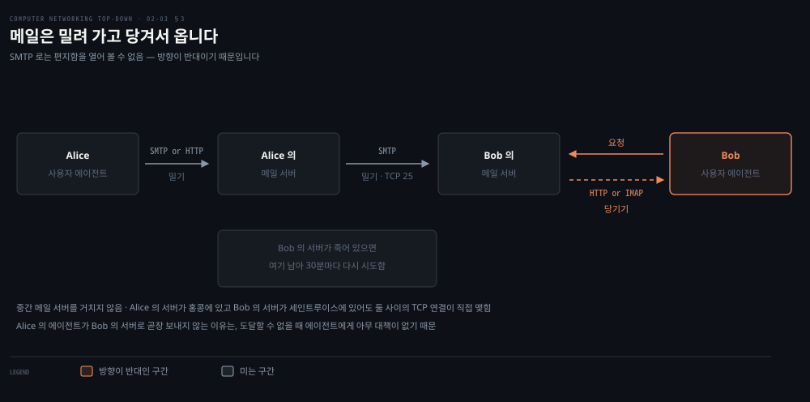
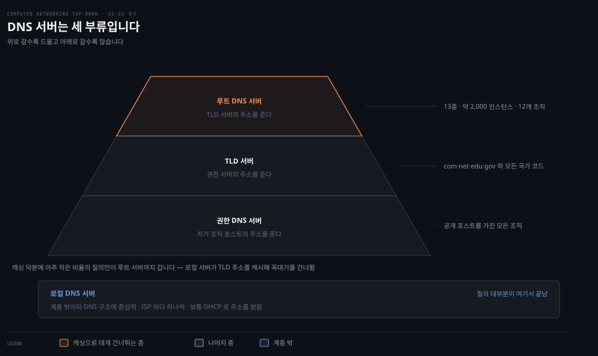
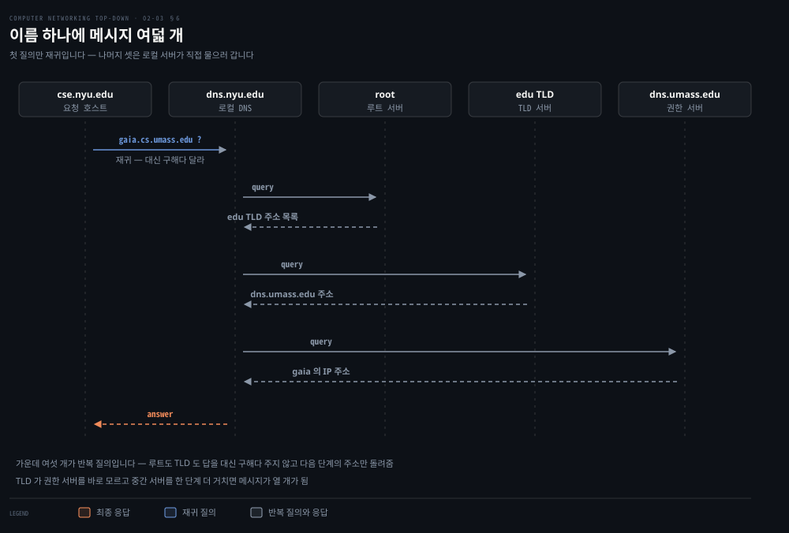

# 메일과 이름은 어떻게 찾아가는가

---

> 웹보다 오래된 두 응용을 나란히 봅니다. 하나는 웹과 반대 방향으로 밀고, 다른 하나는 사용자가 부른 적이 없는데도 모든 접속의 앞에 섭니다.

## 핵심 요약

> 이 편이 매달린 하나의 생각은 **메일과 DNS 가 각각 HTTP 와 반대되는 성질 하나씩을 보여 준다**는 것입니다. SMTP 는 미는 프로토콜이고, DNS 는 사용자가 직접 부르지 않는 프로토콜입니다.

HTTP 는 받는 쪽이 요청해서 가져옵니다. **SMTP 는 보내는 쪽이 밀어 넣습니다.** 이 방향 차이 하나가 메일 시스템의 구조를 전부 설명합니다. 밀어 넣기만 하는 프로토콜로는 내 편지함을 열어 볼 수 없어서, 가져오는 일에는 다른 프로토콜이 따로 필요합니다.

DNS 의 특이함은 다른 데 있습니다. 원문의 곁상자가 이렇게 적습니다. 웹·파일 전송·메일과 달리 **DNS 는 사용자가 직접 상호작용하는 응용이 아닙니다.** 다른 응용과 소프트웨어를 위해 핵심 기능 하나를 대신 수행합니다.

그런데도 DNS 는 애플리케이션 층에 있습니다. 이것이 1장에서 본 설계 철학의 또 다른 사례라고 원문은 말합니다. **이름을 주소로 바꾸는 핵심 기능조차 망 가장자리의 클라이언트와 서버로 구현**한 것입니다.

두 응용 모두 오래됐습니다. SMTP 의 원본 RFC 는 1982년이고, 그때 정한 제약 하나가 지금도 남아 있습니다.


## 학습 목표

> 이 편을 읽고 나면 아래 다섯 가지를 스스로 해낼 수 있습니다.

1. 메일 시스템의 세 부품을 대고, 메시지가 지나는 경로를 순서대로 말할 수 있습니다.
2. SMTP 명령과 메일 헤더 줄이 왜 다른 것인지 설명할 수 있습니다.
3. 메일을 가져오는 데 SMTP 를 쓸 수 없는 이유를 한 단어로 답할 수 있습니다.
4. DNS 를 중앙집중으로 만들면 안 되는 이유를 네 가지로 나눌 수 있습니다.
5. 재귀 질의와 반복 질의를 구별하고, 실제 배치에서 어느 구간이 어느 쪽인지 말할 수 있습니다.


## 1. 메일의 세 부품과 미는 프로토콜

> 메일 시스템은 부품이 셋뿐입니다. 그리고 그중 프로토콜 하나가 이 시스템의 모든 성질을 결정합니다.

### 세 부품

원문이 메일 시스템을 셋으로 나눕니다.

- **사용자 에이전트**: 읽고 답장하고 전달하고 저장하고 작성하게 해 줍니다. Outlook, Apple Mail, 웹 Gmail, 스마트폰의 Gmail 앱이 모두 여기 듭니다.
- **메일 서버**: 인프라의 핵심입니다. 수신자마다 편지함이 어느 메일 서버 하나에 있습니다.
- **SMTP**: 보내는 쪽 메일 서버에서 받는 쪽 메일 서버로 메일을 옮기는 주 프로토콜입니다.

메시지의 여정은 이렇습니다. 보내는 사람의 사용자 에이전트에서 시작해 보내는 사람의 메일 서버로 가고, 거기서 받는 사람의 메일 서버로 가서 그 사람의 편지함에 놓입니다.

### 실패는 시간으로 처리합니다

Alice 의 서버가 Bob 의 서버에 배달하지 못하면 메시지를 큐에 두고 나중에 다시 시도합니다. **재시도는 보통 30분마다** 이뤄집니다. 며칠이 지나도 성공하지 못하면 서버가 메시지를 지우고 **발신자에게 메일로 알립니다.**

### 모든 메일 서버가 양쪽 다입니다

여기가 HTTP 와 다른 자리입니다. SMTP 에도 클라이언트 쪽과 서버 쪽이 있는데, **모든 메일 서버에서 양쪽이 다 돕니다.** 다른 서버로 메일을 보낼 때는 SMTP 클라이언트로 동작하고, 받을 때는 SMTP 서버로 동작합니다.

### 1982년의 제약이 남아 있습니다

SMTP 는 RFC 5321 에 정의돼 있고 HTTP 보다 훨씬 오래됐습니다. 원본 SMTP RFC 는 1982년으로 거슬러 올라가며 그 전부터 쓰였습니다.

원문이 유산 기술의 흔적을 하나 짚습니다. SMTP 는 **헤더뿐 아니라 본문까지 모든 메일 메시지를 단순한 7비트 ASCII 로 제한합니다.** 1980년대 초에는 전송 용량이 귀했고 큰 첨부를 보내는 사람도 없었으니 말이 됐습니다.

지금은 부담입니다. 이진 멀티미디어 데이터를 SMTP 로 보내기 전에 ASCII 로 부호화해야 하고, 받은 뒤 다시 이진으로 복호화해야 합니다. **HTTP 는 그런 요구를 하지 않습니다.**

### 중간 서버를 거치지 않습니다

원문이 특별히 강조하는 대목입니다. SMTP 는 보통 중간 메일 서버를 쓰지 않습니다. 두 메일 서버가 지구 반대편에 있어도 마찬가지입니다.

Alice 의 서버가 홍콩에 있고 Bob 의 서버가 세인트루이스에 있으면 **그 둘 사이의 TCP 연결이 직접 맺힙니다.** Bob 의 서버가 죽어 있으면 메시지는 Alice 의 서버에 남아 재시도를 기다립니다. 어떤 중간 서버에도 놓이지 않습니다.

### 대화를 그대로 옮기면

SMTP 클라이언트는 TCP 로 서버의 **포트 25** 에 연결합니다. 연결이 서면 사람이 서로 통성명하듯 애플리케이션 층 악수를 합니다.

```properties
S: 220 hamburger.edu
C: HELO crepes.fr
S: 250 Hello crepes.fr, pleased to meet you
C: MAIL FROM: <alice@crepes.fr>
S: 250 alice@crepes.fr ... Sender ok
C: RCPT TO: <bob@hamburger.edu>
S: 250 bob@hamburger.edu ... Recipient ok
C: DATA
S: 354 Enter mail, end with "." on a line by itself
C: Do you like ketchup?
C: How about pickles?
C: .
S: 250 Message accepted for delivery
C: QUIT
S: 221 hamburger.edu closing connection
```

명령은 다섯입니다. `HELO`, `MAIL FROM`, `RCPT TO`, `DATA`, `QUIT` 입니다. 마침표 하나만 있는 줄이 메시지의 끝을 알립니다. ASCII 용어로는 각 메시지가 `CRLF.CRLF` 로 끝납니다.

SMTP 도 지속 연결을 씁니다. 같은 수신 서버로 보낼 메시지가 여럿이면 같은 TCP 연결로 다 보내고, `QUIT` 은 전부 보낸 뒤에야 냅니다.

> **지금은 다릅니다**: 원문이 `telnet serverName 25` 로 직접 대화해 보기를 강력히 권합니다. 지금 이 실습은 대체로 막힙니다. 대부분의 가정용 ISP 가 나가는 25번 포트를 차단하고, 공개 메일 서버는 인증 없이 중계하지 않으며, 실제 제출은 587번 포트에서 TLS 와 인증을 거칩니다. 대화의 문법을 눈으로 보는 것이 목적이라면 위 전사를 읽는 것으로 충분하고, 손으로 쳐 보고 싶다면 로컬에 메일 서버를 띄우는 편이 확실합니다.


## 2. 헤더는 명령이 아닙니다

> `MAIL FROM` 과 `From:` 은 다른 것입니다. 이름이 닮아서 헷갈리는데, 사는 층이 다릅니다.

### 봉투와 편지지

Alice 가 손편지를 쓸 때 편지지 맨 위에 주소와 날짜를 적듯, 메일 메시지도 본문 앞에 헤더가 붙습니다. 이 헤더 줄들은 **RFC 5322** 가 정의합니다.

헤더와 본문은 빈 줄 하나로 나뉩니다. 각 헤더 줄은 HTTP 와 마찬가지로 읽을 수 있는 텍스트이며, 키워드 다음에 콜론, 그다음 값이 옵니다.

```properties
From: alice@crepes.fr
To: bob@hamburger.edu
Subject: Searching for the meaning of life.
```

`From:` 과 `To:` 는 **모든 헤더에 반드시 있어야 하고**, `Subject:` 는 선택입니다.

### 왜 구별해야 하나

원문이 한 문장을 굳이 넣어 경고합니다. 이 헤더 줄들은 앞 절의 SMTP 명령과 **다른 것**입니다. `from` 이나 `to` 같은 단어가 겹쳐서 헷갈리지만 역할이 다릅니다.

- **SMTP 명령**: 악수 프로토콜의 일부입니다. 두 메일 서버가 주고받는 봉투에 해당합니다.
- **헤더 줄**: 메일 메시지 자체의 일부입니다. 편지지에 적힌 내용입니다.

봉투의 수신인과 편지지의 수신인이 다를 수 있다는 뜻이기도 합니다. 스팸 필터와 메일 위조 논의가 전부 이 구별 위에 서 있습니다.


## 3. 미는 것과 가져오는 것

> SMTP 로는 내 편지함을 열어 볼 수 없습니다. 프로토콜의 방향이 반대이기 때문입니다.



### 내 PC 에 메일 서버를 두면 안 되나

Bob 이 자기 노트북에서 사용자 에이전트를 돌리니, 메일 서버도 거기 두면 될 것 같습니다. 그러면 Alice 의 서버가 Bob 의 PC 와 직접 대화할 텐데요.

문제가 있습니다. 메일 서버는 편지함을 관리하고 SMTP 의 양쪽을 돌립니다. Bob 의 메일 서버가 그의 노트북에 있으면 **그 노트북이 항상 켜져 있고 인터넷에 붙어 있어야 합니다.** 메일은 언제든 도착할 수 있기 때문입니다. 많은 사용자에게 비현실적입니다.

그래서 보통은 사용자 에이전트만 로컬에서 돌리고, 편지함은 **항상 켜져 있는 공유 메일 서버**에 둡니다.

### 왜 두 단계인가

Alice 의 사용자 에이전트가 Bob 의 메일 서버로 곧장 보내면 될 것 같은데 실제로는 그러지 않습니다. Alice 의 에이전트가 자기 서버로 보내고, 그 서버가 SMTP 클라이언트로서 Bob 의 서버에 중계합니다.

이유가 하나뿐입니다. **도달할 수 없는 목적지 서버에 대해 사용자 에이전트에게는 아무 대책이 없기 때문**입니다. 자기 메일 서버에 맡겨 두면 그 서버가 Bob 의 서버가 살아날 때까지 30분마다 다시 시도해 줍니다.

### 밀기와 당기기

마지막 조각이 남습니다. Bob 은 서버에 놓인 메시지를 어떻게 가져오나. 원문의 답이 한 줄입니다.

> 메시지를 얻는 것은 **당기는(pull) 동작**인데 SMTP 는 **미는(push) 프로토콜**이므로, Bob 의 사용자 에이전트는 SMTP 로 메시지를 가져올 수 없습니다.

그래서 가져오는 쪽은 다른 프로토콜입니다. 오늘날 방법이 둘입니다.

- **HTTP**: 웹 메일이나 스마트폰 앱을 쓰면 사용자 에이전트가 HTTP 로 가져옵니다. 이 경우 Bob 의 메일 서버는 SMTP 인터페이스와 **HTTP 인터페이스를 함께** 가져야 합니다.
- **IMAP**: Outlook 같은 메일 클라이언트가 쓰는 방식입니다. RFC 3501 에 정의돼 있습니다.

둘 다 Bob 이 서버에 있는 폴더를 관리하게 해 줍니다. 폴더로 옮기고 지우고 중요 표시를 하는 일이 모두 서버 쪽에서 일어납니다.

> **노트의 읽기**: 9판의 이 절에는 **POP3 가 없습니다.** 메일 접근 프로토콜로 HTTP 와 IMAP 둘만 듭니다. 이 배치가 현실을 반영합니다. 폴더를 서버에 두고 여러 기기에서 같은 상태를 보는 사용 방식에서는, 메시지를 내려받고 서버에서 지우는 모델이 설 자리가 없습니다.


## 4. 이름을 주소로 — DNS 가 실제로 하는 네 가지

> 사람은 이름을 좋아하고 라우터는 고정 길이 숫자를 좋아합니다. 그 사이를 메우는 것이 DNS 인데, 하는 일이 번역만은 아닙니다.

### 두 개의 식별자

호스트를 가리키는 방법이 둘입니다. **호스트 이름**은 기억하기 좋아서 사람이 좋아하지만 인터넷 안에서 그 호스트가 어디 있는지는 거의 알려 주지 않습니다. 게다가 길이가 들쭉날쭉한 문자열이라 라우터가 처리하기 어렵습니다.

**IP 주소**는 엄격한 계층 구조를 갖습니다. 왼쪽에서 오른쪽으로 읽어 갈수록 그 호스트가 어느 망 안에 있는지 점점 구체적으로 알게 됩니다. 원문이 우편 주소를 아래에서 위로 읽는 것에 비유합니다.

### DNS 는 두 가지입니다

원문의 정의가 둘로 나뉘어 있어 옮겨 둡니다.

1. 계층을 이룬 DNS 서버들로 구현된 **분산 데이터베이스**입니다.
2. 호스트가 그 분산 데이터베이스에 질의하게 해 주는 **애플리케이션 층 프로토콜**입니다.

> **지금은 다릅니다**: 원문이 "DNS 프로토콜은 UDP 위에서 돌며 포트 53 을 쓴다"고 적고, 뒤에서 다시 "모든 DNS 질의와 응답 메시지는 포트 53 으로 가는 UDP 데이터그램 안에 담겨 보내진다"고 적습니다. TCP 도 씁니다. **RFC 7766 §5 는 `"All general-purpose DNS implementations MUST support both UDP and TCP transport."` 라고 못 박습니다.**[^rfc7766] 응답이 커서 UDP 한 장에 안 들어가면 TCP 로 넘어갑니다. 이 기계에서 `dig +tcp` 로 물어봐도 정상적으로 답이 옵니다. 여기에 DoT 와 DoH 처럼 853 번 포트나 HTTPS 위로 나르는 방식도 널리 쓰입니다.

### 번역 말고 세 가지를 더 합니다

- **호스트 별칭**: 복잡한 정규 이름을 가진 호스트가 기억하기 좋은 별칭을 여럿 가질 수 있습니다. `relay1.west-coast.enterprise.com` 이 정규 이름이고 `enterprise.com` 과 `www.enterprise.com` 이 별칭인 식입니다.
- **메일 서버 별칭**: `bob@yahoo.com` 처럼 짧은 주소를 쓰려면 메일 서버의 복잡한 정규 이름을 감춰야 합니다. MX 레코드가 이 일을 하며, 덕분에 **회사의 웹 서버와 메일 서버가 같은 이름을 쓸 수 있습니다.**
- **부하 분산**: 바쁜 사이트는 여러 서버에 복제되고 각각 다른 IP 를 갖습니다. DNS 는 그 주소 집합 전체를 응답으로 주되 **응답할 때마다 순서를 돌립니다.** 클라이언트가 보통 첫 번째 주소로 붙기 때문에 이 회전이 트래픽을 나눕니다.

### 사용자가 부르지 않는 유일한 응용

원문의 곁상자가 DNS 의 자리를 정리합니다. DNS 도 HTTP·SMTP 처럼 애플리케이션 층 프로토콜입니다. 종단 시스템 사이에서 클라이언트-서버 방식으로 돌고, 아래의 종단 간 트랜스포트 프로토콜에 기대어 메시지를 나릅니다.

다른 점은 **사용자가 직접 상호작용하지 않는다**는 것입니다. DNS 는 다른 응용과 소프트웨어를 위해 핵심 인터넷 기능 하나를 대신 수행합니다.

그런데도 가장자리에 있습니다. [01-01](./01-01.인터넷을%20무엇이라%20부르는가.md) 에서 본 "복잡함은 가장자리에" 라는 설계 철학의 사례라고 원문이 짚습니다.


## 5. 왜 중앙집중이 안 되는가

> DNS 서버를 하나만 두면 안 되는 이유가 넷입니다. 그 넷이 지금의 계층 구조를 만들었습니다.



### 하나로 하면 안 되는 이유 넷

- **단일 장애점**: 그 DNS 서버가 죽으면 인터넷 전체가 죽습니다.
- **트래픽 양**: 수억 대 호스트가 만드는 모든 HTTP 요청과 메일의 질의를 서버 하나가 감당해야 합니다.
- **먼 거리**: 뉴욕에 한 대를 두면 호주에서 오는 질의는 지구 반대편까지 가야 합니다.
- **유지보수**: 인터넷의 모든 호스트 레코드를 한 데이터베이스가 갖고 있어야 하고, 새 호스트가 생길 때마다 갱신해야 합니다.

원문의 결론은 간단합니다. **규모가 안 됩니다.** 그래서 DNS 는 설계상 분산입니다.

### 세 부류

| 부류 | 무엇을 아나 | 규모 |
|---|---|---|
| 루트 DNS 서버 | TLD 서버의 IP 주소 | 13종의 사본이 전 세계에 약 2,000 인스턴스, 12개 조직이 관리, IANA 가 조율 |
| TLD 서버 | 권한 DNS 서버의 IP 주소 | `com`·`org`·`net`·`edu`·`gov` 와 모든 국가 코드마다 하나 또는 서버 군집 |
| 권한 DNS 서버 | 자기 조직 호스트의 IP 주소 | 공개 호스트를 가진 모든 조직 |

`com` 의 TLD 서버는 Verisign Global Registry Services 가, `edu` 는 Educause 가 운영합니다. 루트 서버 수치는 원문이 2024년 기준으로 제시한 값입니다.

### 계층에 속하지 않는 넷째

원문이 넷째 종류를 따로 소개합니다. **로컬 DNS 서버**입니다. 원문의 표현으로 이것은 서버 계층에 **엄밀히 속하지 않지만** DNS 구조에 중심적입니다.

ISP 마다 로컬 DNS 서버가 하나씩 있습니다. 호스트가 접속하면 ISP 가 그 주소를 알려 주는데 보통 DHCP 를 통해서입니다.

거리도 가깝습니다. 기관 ISP 라면 호스트와 같은 LAN 에 있을 수 있고, 가정용이라면 라우터 몇 개 건너에 있습니다.

ISP 의 것 대신 상용 제공자를 쓸 수도 있습니다. 원문이 드는 예가 구글의 `8.8.8.8` 입니다.

호스트가 질의를 내면 그 질의는 로컬 DNS 서버로 가고, 로컬 서버가 **프록시처럼** 계층 안으로 질의를 전달합니다.


## 6. 질의는 어떻게 도는가 — 재귀와 반복

> 이름 하나를 푸는 데 메시지가 여덟 개 오갑니다. 그 여덟 개 중 어느 것이 재귀이고 어느 것이 반복인지가 이 절의 요점입니다.



### 원문의 예를 따라가면

`cse.nyu.edu` 가 `gaia.cs.umass.edu` 의 IP 주소를 원합니다. NYU 의 로컬 DNS 서버는 `dns.nyu.edu` 이고, 목표의 권한 서버는 `dns.umass.edu` 입니다.

1. 호스트가 로컬 DNS 서버에 질의를 보냅니다.
2. 로컬 서버가 루트 DNS 서버에 전달합니다. 루트는 `edu` 접미사를 보고 `edu` 담당 TLD 서버들의 IP 주소 목록을 돌려줍니다.
3. 로컬 서버가 그중 하나에 다시 질의합니다. TLD 서버는 `umass.edu` 접미사를 보고 `dns.umass.edu` 의 IP 주소로 답합니다.
4. 로컬 서버가 `dns.umass.edu` 에 직접 질의하고, 거기서 `gaia.cs.umass.edu` 의 IP 주소를 받습니다.

**이름 하나에 메시지 여덟 개입니다.** 질의 넷과 응답 넷입니다.

TLD 서버가 권한 서버를 바로 아는 것은 일반적인 경우가 아닙니다. 중간 DNS 서버를 한 단계 거치면 **메시지가 열 개**가 됩니다.

### 두 종류의 질의

- **재귀 질의**: 받은 쪽이 **대신 답을 구해다 주기를** 요구하는 질의입니다. 위 예에서 호스트가 로컬 서버에 보낸 첫 질의가 이것입니다.
- **반복 질의**: 응답이 **곧바로 물어본 쪽에 돌아오는** 질의입니다. 위 예의 나머지 세 질의가 이것입니다. 루트는 "내가 모르니 TLD 에 물어봐"라며 다음 단계의 주소만 줍니다.

이론적으로는 어느 질의든 반복이거나 재귀일 수 있습니다. 원문이 모든 질의가 재귀인 사슬도 그림으로 보여 줍니다. **실제 배치는 위 예의 형태**입니다. 호스트에서 로컬 서버까지는 재귀, 그 뒤로는 반복입니다.


## 7. 캐싱이 실제로 하는 일

> 계층을 매번 다 타면 이름 하나에 여덟 개씩 듭니다. 실제로는 그런 일이 거의 없습니다.

### 원리는 단순합니다

질의 사슬에서 DNS 서버가 응답을 받으면 그 매핑을 로컬 메모리에 캐시합니다. 같은 이름에 대한 질의가 다시 오면, **그 이름의 권한 서버가 아니어도** 캐시에서 답할 수 있습니다.

효과가 큰 자리는 따로 있습니다. 로컬 DNS 서버는 **TLD 서버의 IP 주소도 캐시**할 수 있습니다. 그래서 질의 사슬에서 루트를 건너뜁니다. 원문의 표현으로 **캐싱 덕분에 아주 작은 비율의 질의만이 루트 서버까지 갑니다.**

### 얼마나 오래 두나

원문이 "종종 이틀로 설정된다"고 적습니다. 이 값을 실제로 재 봤습니다.

| 이름 | 실측 TTL | 이틀 대비 |
|---|---|---|
| `cnn.com` | 60초 | 1/2880 |
| `www.google.com` | 81초 | 1/2133 |
| `www.amazon.com` | 825초 | 1/210 |
| `gaia.cs.umass.edu` | 2,822초 | 1/61 |

```bash
dig +noall +answer cnn.com A | awk '{print $2}'
```

> **지금은 다릅니다**: 실측 넷 모두 이틀(172,800초)과 두세 자릿수 차이가 납니다. 원문이 캐싱 예로 든 바로 그 `cnn.com` 이 **60초**입니다. 짧은 TTL 은 값을 치릅니다. 캐시 적중이 줄어 질의가 늘어납니다. 그 값을 치르고 사는 이유는 CDN 과 장애 대응 때문입니다. 사용자를 어느 서버로 보낼지 DNS 응답으로 조종하려면 그 응답이 오래 굳어 있으면 안 됩니다. 이름 해석이 **부하 분산 장치**가 되면서 TTL 이 짧아진 것이고, 그 쓰임은 원문 자신이 앞 절에서 부하 분산으로 설명한 바로 그것입니다. 다음 편의 CDN 이 이 이야기를 이어받습니다.


## 8. 자원 레코드와 메시지

> 분산 데이터베이스에 실제로 무엇이 들어 있는지 봅니다. 네 칸짜리 튜플입니다.

### 네 칸

자원 레코드(RR)는 네 칸으로 된 튜플입니다.

```properties
(Name, Value, Type, TTL)
```

`TTL` 은 이 레코드를 캐시에서 언제 지울지 정합니다. `Name` 과 `Value` 의 뜻은 `Type` 에 따라 달라집니다.

| Type | Name | Value | 원문의 예 |
|---|---|---|---|
| A | 호스트 이름 | 그 이름의 IP 주소 | `(relay1.bar.foo.com, 145.37.93.126, A)` |
| NS | 도메인 | 그 도메인의 호스트 주소를 아는 권한 DNS 서버의 이름 | `(foo.com, dns.foo.com, NS)` |
| CNAME | 별칭 이름 | 그 별칭의 정규 이름 | `(foo.com, relay1.bar.foo.com, CNAME)` |
| MX | 별칭 이름 | 그 별칭을 쓰는 메일 서버의 정규 이름 | `(foo.com, mail.bar.foo.com, MX)` |

MX 가 따로 있는 이유가 여기서 드러납니다. 회사가 웹 서버와 메일 서버에 **같은 이름을 쓸 수 있습니다.** 메일 서버의 정규 이름을 얻으려면 MX 를 묻고, 다른 서버의 정규 이름을 얻으려면 CNAME 을 물으면 되기 때문입니다.

권한 서버냐 아니냐로 갖는 레코드가 갈립니다.

- **권한 서버**: 그 호스트 이름의 A 레코드를 갖습니다.
- **권한 서버가 아닌 경우**: 그 호스트를 포함하는 도메인의 NS 레코드를 갖고, 그 NS 가 가리키는 DNS 서버의 IP 주소를 담은 A 레코드도 함께 갖습니다.

### 메시지는 두 종류뿐입니다

질의와 응답, 둘뿐이고 **형식도 같습니다.**

- **헤더 (첫 12바이트)**: 질의를 식별하는 16비트 번호가 맨 앞에 있습니다. 이 번호가 응답에 복사되어 오므로 클라이언트가 응답과 질의를 짝지을 수 있습니다. 플래그로는 질의인지 응답인지(1비트), 응답하는 서버가 그 이름의 권한 서버인지(1비트), 재귀를 원하는지(1비트), 재귀를 지원하는지(1비트)가 있습니다.
- **질문 절**: 질의하는 이름과 질문의 종류가 들어갑니다.
- **답변 절**: 원래 질의한 이름의 자원 레코드가 들어갑니다. 한 이름에 IP 주소가 여럿일 수 있으므로 레코드가 여러 개 올 수 있습니다.
- **권한 절**: 다른 권한 서버들의 레코드가 들어갑니다.
- **추가 절**: 도움이 되는 다른 레코드가 들어갑니다. MX 질의의 응답이면 답변 절에 메일 서버의 정규 이름이 오고, 추가 절에 그 이름의 A 레코드가 함께 옵니다.

> **지금은 다릅니다**: 원문이 직접 질의를 보내는 도구로 `nslookup` 을 권합니다. 지금은 `dig` 가 사실상의 표준입니다. 응답의 절 구분과 TTL 과 플래그를 그대로 보여 주기 때문에, 방금 읽은 메시지 형식을 눈으로 대조하기에 알맞습니다.

### 레코드는 어떻게 들어가나

도메인 이름을 **등록 대행자**에게 등록합니다. 등록 대행자가 하는 일이 셋입니다.

- 그 이름이 아직 쓰이지 않았는지 확인합니다.
- DNS 데이터베이스에 그 이름을 넣습니다.
- 그 대가로 적은 수수료를 받습니다.

1999년 이전에는 Network Solutions 한 곳이 `com`·`net`·`org` 등록을 독점했습니다. 지금은 여러 대행자가 경쟁하고 **ICANN** 이 이들을 인증합니다. 원문은 2024년 측정 기준으로 **하루에 약 7만 5천 개**의 새 도메인 이름이 등록된다고 적습니다.

등록할 때 주 권한 서버와 부 권한 서버의 이름과 IP 주소를 함께 줍니다. 그러면 대행자가 `com` TLD 서버에 NS 레코드와 A 레코드를 넣습니다.

```properties
(networkutopia.com, dns1.networkutopia.com, NS)
(dns1.networkutopia.com, 212.212.212.1, A)
```

> **원문 정오**: 바로 위 A 레코드의 주소가 두 줄 앞 산문과 어긋납니다. 산문은 주 권한 서버의 주소를 **`212.2.212.1`** 이라 적는데, 레코드에는 **`212.212.212.1`** 이 들어가고, 이 절 끝의 확인 시나리오에서도 로컬 DNS 서버가 `212.212.212.1` 로 질의합니다. 인쇄면을 확대해 확인한 결과 추출 오류가 아니라 원문의 오타이며, 셋 중 산문 하나만 다릅니다. 뒤의 둘이 맞습니다.


## 메일·DNS 치트시트

> 어느 프로토콜이 어느 방향인지, 그리고 이름 하나를 푸는 데 무엇이 관여하는지 두 장으로 줄였습니다.

**메일의 네 구간**

| 구간 | 프로토콜 | 방향 |
|---|---|---|
| Alice 에이전트 → Alice 서버 | SMTP 또는 HTTP | 밀기 |
| Alice 서버 → Bob 서버 | SMTP (포트 25, TCP) | 밀기 |
| Bob 서버 → Bob 에이전트 | HTTP 또는 IMAP | 당기기 |
| 실패 시 | 30분마다 재시도, 며칠 뒤 발신자에게 통보 | Alice 서버가 보관 |

**DNS 를 볼 때 짚는 자리**

| 물음 | 어디를 보나 |
|---|---|
| 이 이름의 주소는 | A 레코드 |
| 이 이름의 정규 이름은 | CNAME 레코드 |
| 이 도메인은 누가 답하나 | NS 레코드 |
| 이 도메인의 메일은 어디로 | MX 레코드 |
| 얼마나 캐시되나 | TTL |
| 답한 서버가 권한 서버인가 | 헤더의 authoritative 플래그 |
| 응답이 커서 잘렸나 | TCP 로 재질의 (RFC 7766) |


## 심화 학습

> 이 편의 DNS 개념은 `dig` 한 줄씩으로 전부 눈으로 확인할 수 있습니다.

```bash
# 레코드 타입별로 물어보기 — 본문의 표와 그대로 대응합니다
dig +noall +answer www.github.com A
dig +noall +answer www.github.com CNAME
dig +noall +answer github.com NS
dig +noall +answer github.com MX

# 계층을 손으로 타 보기 — 반복 질의를 사람이 대신합니다
dig +trace www.amazon.com

# 캐시 효과 — 같은 이름을 두 번 물으면 TTL 이 줄어 있습니다
dig +noall +answer cnn.com A
dig +noall +answer cnn.com A

# 권한 서버에 직접 물으면 TTL 이 원래 값으로 돌아옵니다
dig +noall +answer @$(dig +short NS cnn.com | head -1) cnn.com A

# 응답 절 구분과 플래그를 그대로 보기 — 본문 §8 의 메시지 형식
dig www.google.com A
```

`dig +trace` 가 특히 볼만합니다. 루트에서 시작해 TLD 를 거쳐 권한 서버까지 내려가는 과정이 한 화면에 나오는데, 이것이 §6 의 반복 질의를 사람 손으로 재현한 것입니다.


## 면접 대비

> 이 편에서 실제로 묻는 자리는 push 와 pull 의 구별, DNS 계층의 세 부류, 그리고 재귀와 반복의 차이입니다.

### 한 줄 정의

- **SMTP**: 보내는 쪽 메일 서버에서 받는 쪽 메일 서버로 메일을 미는 프로토콜입니다.
- **정규 이름**: 별칭이 최종적으로 가리키는 본래 호스트 이름입니다.
- **재귀 질의**: 받은 서버가 대신 답을 구해다 주기를 요구하는 질의입니다.
- **TTL**: 자원 레코드를 캐시에 얼마나 둘 수 있는지 정하는 값입니다.

### 핵심 포인트 세 가지

1. 메일을 **가져오는** 데 SMTP 를 못 쓰는 것은 SMTP 가 미는 프로토콜이기 때문입니다.
2. 로컬 DNS 서버는 **계층에 속하지 않습니다.** 그런데 실제 질의의 대부분이 이것에서 끝납니다.
3. 실제 배치에서 호스트에서 로컬 서버까지만 재귀이고 그 위로는 반복입니다.

### 자주 묻는 질문

**"메일 서버가 왜 클라이언트이면서 서버입니까?"** 메일 서버는 다른 서버로 보내기도 하고 받기도 하기 때문입니다. 보낼 때는 SMTP 클라이언트, 받을 때는 SMTP 서버로 동작합니다. 웹 서버가 늘 서버인 것과 다릅니다.

**"DNS 가 UDP 를 쓰는데 응답이 크면 어떻게 합니까?"** TCP 로 넘어갑니다. RFC 7766 이 모든 범용 구현에 UDP 와 TCP 를 **둘 다** 지원하도록 요구합니다. 책의 "UDP 를 쓴다"는 서술은 흔한 경우를 적은 것입니다.

**"TTL 을 짧게 잡으면 무엇이 나빠집니까?"** 캐시 적중이 줄어 질의가 늘고 이름 해석 지연이 커집니다. 그 값을 치르는 대신 얻는 것이 응답을 바꿔 트래픽을 옮길 수 있는 자유입니다.


## 핵심 개념 체크리스트

> 아래를 보지 않고 말할 수 있으면 이 편은 통과입니다.

- [ ] 메일 시스템의 세 부품을 댈 수 있습니다.
- [ ] 메일 서버가 SMTP 의 양쪽을 다 도는 이유를 설명할 수 있습니다.
- [ ] SMTP 의 7비트 ASCII 제약이 무엇을 강제하는지 말할 수 있습니다.
- [ ] SMTP 가 중간 메일 서버를 쓰지 않는다는 뜻을 설명할 수 있습니다.
- [ ] SMTP 명령 다섯 개를 순서대로 댈 수 있습니다.
- [ ] `MAIL FROM` 과 `From:` 의 차이를 말할 수 있습니다.
- [ ] 메일 수신에 SMTP 를 못 쓰는 이유를 한 단어로 답할 수 있습니다.
- [ ] DNS 를 두 문장으로 정의할 수 있습니다.
- [ ] DNS 가 번역 말고 하는 세 가지를 댈 수 있습니다.
- [ ] 중앙집중이 안 되는 이유 넷을 셀 수 있습니다.
- [ ] 루트·TLD·권한 서버가 각각 무엇의 주소를 주는지 말할 수 있습니다.
- [ ] 로컬 DNS 서버가 계층에 속하지 않는다는 말의 뜻을 압니다.
- [ ] 이름 하나에 메시지가 여덟 개인 이유를 셀 수 있습니다.
- [ ] 재귀 질의와 반복 질의를 구별할 수 있습니다.
- [ ] A·NS·CNAME·MX 의 Name 과 Value 가 각각 무엇인지 말할 수 있습니다.


## 관련 문서

- [02-02 웹은 어떻게 주고받는가](./02-02.웹은%20어떻게%20주고받는가.md) — 이 편의 앞. 당기는 프로토콜의 표준형
- [02-04 영상은 어떻게 끊기지 않는가](./02-04.영상은%20어떻게%20끊기지%20않는가.md) — 이 편의 다음. 짧아진 TTL 을 쓰는 쪽인 CDN
- [01-01 인터넷을 무엇이라 부르는가](./01-01.인터넷을%20무엇이라%20부르는가.md) — 복잡함을 가장자리에 두는 설계 철학
- [Computer Networking — 정독 인덱스](./README.md) — 8개 장 전체 지도


## 참고 자료

- 원본: 《Computer Networking: A Top-Down Approach》 9판 (James F. Kurose · Keith W. Ross, Pearson)
- 다룬 범위: §2.3 Electronic Mail in the Internet · §2.4 DNS
- [RFC 5321 — SMTP](https://www.rfc-editor.org/info/rfc5321) · [RFC 5322 — Internet Message Format](https://www.rfc-editor.org/info/rfc5322)
- [RFC 1034·1035 — DNS](https://www.rfc-editor.org/info/rfc1035) — 원문이 정본으로 드는 두 문서
- [Root Server Technical Operations Association](https://root-servers.org/) — 루트 서버 인스턴스의 현재 수와 위치

[^rfc7766]: RFC 7766 "DNS Transport over TCP - Implementation Requirements" §5. "All general-purpose DNS implementations MUST support both UDP and TCP transport." <https://www.rfc-editor.org/rfc/rfc7766.html>
