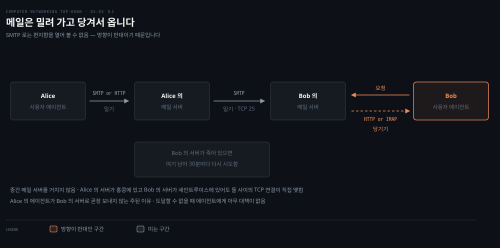
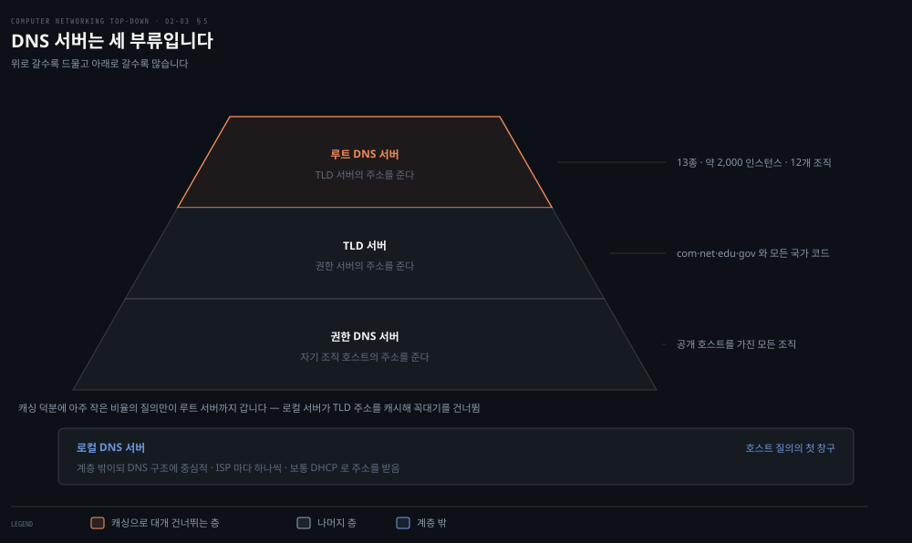
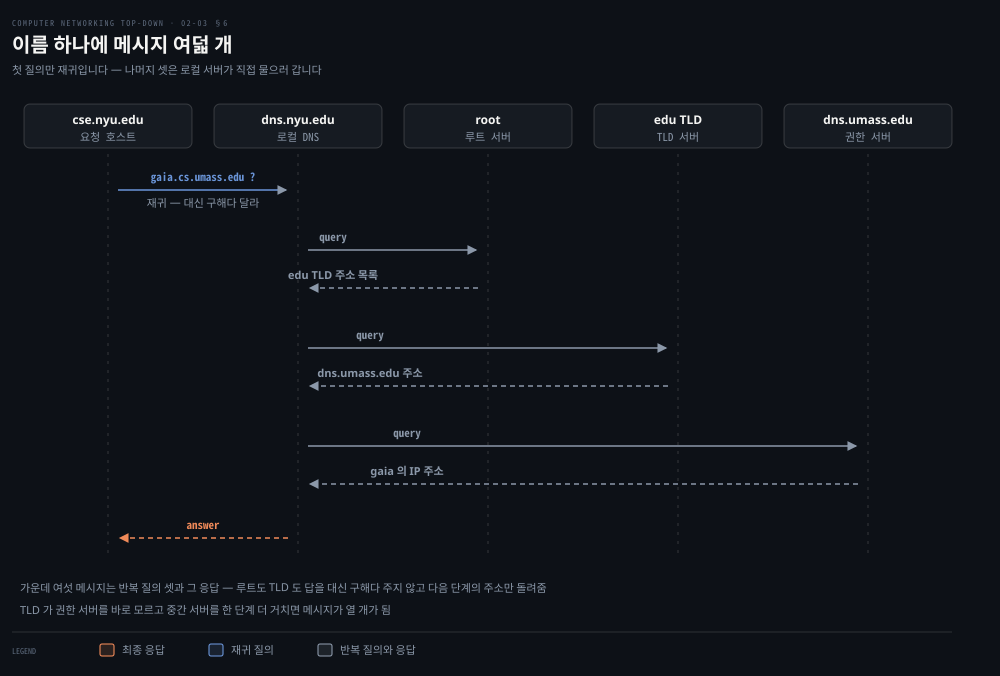

# 메일과 이름은 어떻게 찾아가는가

---

> 웹보다 오래된 두 응용을 나란히 봅니다. 하나는 웹과 반대 방향으로 밀고, 다른 하나는 사용자가 부른 적이 없는데도 모든 접속의 앞에 섭니다.

## 핵심 요약

> 이 편이 매달린 하나의 생각은 메일과 DNS 가 각각 HTTP 와 반대되는 성질 하나씩을 보여 준다는 것입니다. SMTP 는 미는 프로토콜이고, DNS 는 사용자가 직접 부르지 않는 프로토콜입니다.

HTTP 는 받는 쪽이 요청해서 가져오는 데 비해 SMTP 는 보내는 쪽이 밀어 넣습니다. 이 방향 차이 하나가 메일 시스템의 구조를 전부 설명합니다. 밀어 넣기만 하는 프로토콜로는 내 편지함을 열어 볼 수 없어서 가져오는 일에는 다른 프로토콜이 따로 필요합니다.

DNS 의 특이함은 다른 데 있습니다. 원문의 곁상자에 따르면 웹·파일 전송·메일과 달리 DNS 는 사용자가 직접 상호작용하는 응용이 아닙니다. 다른 응용과 소프트웨어를 위해 핵심 기능 하나를 대신 수행합니다.

그런데도 DNS 는 애플리케이션 층에 있습니다. 이것이 1장에서 본 설계 철학의 또 다른 사례라고 원문은 말합니다. 이름을 주소로 바꾸는 핵심 기능조차 망 가장자리의 클라이언트와 서버로 구현한 것입니다.

두 응용 모두 오래됐습니다. SMTP 의 원본 RFC 는 1982년이고 그때 정한 7비트 제약은 확장이 나온 지금도 기본값으로 남아 있습니다.


## 학습 목표

> 이 편을 읽고 나면 아래 다섯 가지를 스스로 해낼 수 있습니다.

1. 메일 시스템의 세 부품을 대고, 메시지가 지나는 경로를 순서대로 말할 수 있습니다.
2. SMTP 명령과 메일 헤더 줄이 왜 다른 것인지 설명할 수 있습니다.
3. 메일을 가져오는 데 SMTP 를 쓸 수 없는 이유를 한 단어로 답할 수 있습니다.
4. DNS 를 중앙집중으로 만들면 안 되는 이유를 네 가지로 나눌 수 있습니다.
5. 재귀 질의와 반복 질의를 구별하고, 실제 배치에서 어느 구간이 어느 쪽인지 말할 수 있습니다.

이 편에서 새로 만나는 낱말입니다. `어디서` 는 그 낱말이 실제로 설명되는 절입니다.

| 키워드 | 뜻 | 학습 포인트·연결 개념 | 어디서 |
|---|---|---|---|
| 메일의 세 부품 | 메일을 이루는 세 조각 | 사용자 에이전트 · 메일 서버 · SMTP | §1 |
| SMTP | 서버끼리 메일을 미는 프로토콜 | 포트 25 · TCP · 보통 중간 서버 없이 직접 | §1 |
| 7비트 ASCII 제약 | 1982년 규격이 남긴 기본값 | 확장 없는 SMTP 는 8비트를 못 실음 · 8BITMIME 이 텍스트 본문을 풂 | §1 |
| 봉투와 편지지 | SMTP 명령과 메일 헤더 | 헤더 줄은 명령이 아님 | §2 |
| 밀기 · 당기기 | SMTP 는 밀고 IMAP 은 당김 | 가져오기에 SMTP 를 못 쓰는 이유 | §3 |
| DNS | 이름을 주소로 바꾸는 분산 DB | 번역 말고 세 가지를 더 함 | §4 |
| 중앙집중이 안 되는 이유 | 하나로 하면 깨지는 네 가지 | 단일 장애점 · 트래픽 · 거리 · 유지 | §5 |
| 세 부류 | 루트 · TLD · 책임 서버 | 계층을 이루는 쪽 | §5 |
| 로컬 DNS 서버 | 계층 밖에서 대리로 물어 줌 | 프록시 노릇 · 캐시가 여기 앉음 | §5 |
| 재귀 질의 · 반복 질의 | 떠맡기기와 되돌려 주기 | 실제 배치는 앞 구간만 재귀 | §6 |
| TTL (DNS) | 캐시에 두고 쓰는 시간 | **홉 수를 세는 IP TTL 과 다른 것** | §7 |
| 자원 레코드 네 칸 | 네 칸짜리 DNS 항목 | Name·Value·Type·TTL · A·CNAME·NS·MX | §8 |


## 1. 메일의 세 부품과 미는 프로토콜

> 메일 시스템은 부품이 셋뿐입니다. 그리고 그중 프로토콜 하나가 이 시스템의 모든 성질을 결정합니다.

### 세 부품

원문이 메일 시스템을 셋으로 나눕니다.

- **사용자 에이전트**: 읽고 답장하고 전달하고 저장하고 작성하게 해 줍니다. Outlook, Apple Mail, 웹 Gmail, 스마트폰의 Gmail 앱이 모두 여기 듭니다.
- **메일 서버**: 인프라의 핵심입니다. 수신자마다 편지함이 어느 메일 서버 하나에 있습니다.
- **SMTP**: 보내는 쪽 메일 서버에서 받는 쪽 메일 서버로 메일을 옮기는 주 프로토콜입니다.

메시지의 여정은 이렇습니다. 보내는 사람의 사용자 에이전트에서 시작해 보내는 사람의 메일 서버로 간 다음 거기서 받는 사람의 메일 서버로 가서 그 사람의 편지함에 놓입니다.

### 실패는 시간으로 처리합니다

Alice 의 서버가 Bob 의 서버에 배달하지 못하면 메시지를 큐에 두고 나중에 다시 시도합니다. 재시도는 보통 30분마다 이뤄집니다. 며칠이 지나도 성공하지 못하면 서버가 메시지를 지우고 발신자에게 메일로 알립니다.

### 모든 메일 서버가 양쪽 다입니다

SMTP 에도 클라이언트 쪽과 서버 쪽이 있는데 HTTP 와 달리 모든 메일 서버에서 양쪽이 다 돕니다. 다른 서버로 메일을 보낼 때는 SMTP 클라이언트로, 받을 때는 SMTP 서버로 동작합니다.

### 1982년의 제약이 남아 있습니다

SMTP 는 RFC 5321 에 정의돼 있고 HTTP 보다 훨씬 오래됐습니다. 원본 SMTP RFC 는 1982년으로 거슬러 올라가며 그 전부터 쓰였습니다.

원문은 유산 기술의 흔적 하나를 짚습니다. 확장 없는 SMTP 는 헤더뿐 아니라 본문까지 모든 메일 메시지를 단순한 7비트 ASCII 로 제한합니다. 1980년대 초에는 전송 용량이 귀했고 큰 첨부를 보내는 사람도 없었으니 말이 됐습니다.

원문은 지금 이 제약이 부담이라고 적습니다. 이진 멀티미디어 데이터는 SMTP 로 보내기 전에 ASCII 로 부호화했다가 받은 뒤 다시 이진으로 복호화해야 합니다. HTTP 는 그런 요구를 하지 않습니다.

> **원문 단순화**: 원문은 7비트 ASCII 제약을 SMTP 전체의 현재 성질로 적습니다. 지금 규격에서 이 제약은 확장을 쓰지 않은 SMTP 의 기본값입니다. RFC 5321 §2.4 는 확장 없는 SMTP 가 7비트만 나른다고 적고, 확장을 협상하지 못한 클라이언트에게만 8비트 전송을 금합니다.[^rfc5321-7bit] 그 확장 가운데 하나가 RFC 6152 의 8BITMIME 입니다. US-ASCII 범위 밖 옥텟이 든 텍스트 본문을 SMTP 로 중계하게 해 줍니다.[^rfc6152]

### 중간 서버를 거치지 않습니다

SMTP 는 보통 중간 메일 서버를 쓰지 않습니다. 원문이 특별히 강조하는 대목으로, 두 메일 서버가 지구 반대편에 있어도 마찬가지입니다.

Alice 의 서버가 홍콩에 있고 Bob 의 서버가 세인트루이스에 있으면 그 둘 사이의 TCP 연결이 직접 맺힙니다. Bob 의 서버가 죽어 있으면 메시지는 Alice 의 서버에 남아 재시도를 기다릴 뿐 어떤 중간 서버에도 놓이지 않습니다.

### 대화를 그대로 옮기면

SMTP 클라이언트는 TCP 로 서버의 포트 25 에 연결합니다. 연결이 서면 사람이 서로 통성명하듯 애플리케이션 층 악수를 합니다.

```properties
S: 220 hamburger.edu
C: HELO crepes.fr
S: 250 Hello crepes.fr, pleased to meet you
C: MAIL FROM: <alice@crepes.fr>
S: 250 alice@crepes.fr ... Sender ok
C: RCPT TO: <bob@hamburger.edu>
S: 250 bob@hamburger.edu ... Recipient ok
C: DATA
S: 354 Enter mail, end with "." on a line by itself
C: Do you like ketchup?
C: How about pickles?
C: .
S: 250 Message accepted for delivery
C: QUIT
S: 221 hamburger.edu closing connection
```

명령은 `HELO`, `MAIL FROM`, `RCPT TO`, `DATA`, `QUIT` 다섯입니다. 마침표 하나만 있는 줄이 메시지의 끝을 알립니다. ASCII 용어로는 각 메시지가 `CRLF.CRLF` 로 끝납니다.

> **원문 단순화**: 원문의 대화는 `HELO` 로 시작합니다. RFC 5321 §4.1.1.1 은 클라이언트가 `EHLO` 로 세션을 열어야 한다고 적습니다(SHOULD). `EHLO` 는 서버가 지원하는 확장 목록을 돌려받는 인사이고, `HELO` 는 확장을 지원하지 못하는 옛 시스템이나 이번 세션에 확장이 필요 없는 클라이언트가 쓸 수 있습니다(MAY).[^rfc5321-ehlo]

SMTP 도 지속 연결을 씁니다. 같은 수신 서버로 보낼 메시지가 여럿이면 같은 TCP 연결로 다 보내고 `QUIT` 은 전부 보낸 뒤에야 냅니다.

> **지금은 다릅니다**: 원문이 `telnet serverName 25` 로 직접 대화해 보기를 강력히 권합니다. 지금 이 실습은 대체로 막힙니다. 대부분의 가정용 ISP 가 나가는 25번 포트를 차단하고, 공개 메일 서버는 인증 없이 중계하지 않습니다. 실제 제출은 587번 포트나 465번 포트에서 TLS 와 인증을 거칩니다. RFC 8314 는 연결하자마자 TLS 를 여는 465번 쪽을 권합니다.[^rfc8314] 대화의 문법을 눈으로 보는 것이 목적이라면 위 전사를 읽는 것으로 충분하고, 손으로 쳐 보고 싶다면 로컬에 메일 서버를 띄우는 편이 확실합니다.


## 2. 헤더는 명령이 아닙니다

> `MAIL FROM` 과 `From:` 은 다른 것입니다. 이름이 닮아서 헷갈리는데, 사는 층이 다릅니다.

### 봉투와 편지지

Alice 가 손편지를 쓸 때 편지지 맨 위에 주소와 날짜를 적듯, 메일 메시지도 본문 앞에 헤더가 붙습니다. 이 헤더 줄들은 RFC 5322 가 정의합니다.

헤더와 본문은 빈 줄 하나로 나뉩니다. 각 헤더 줄은 HTTP 와 마찬가지로 읽을 수 있는 텍스트이며 키워드 다음에 콜론, 그다음 값이 옵니다.

```properties
From: alice@crepes.fr
To: bob@hamburger.edu
Subject: Searching for the meaning of life.
```

원문은 `From:` 과 `To:` 가 모든 헤더에 반드시 있어야 하고 `Subject:` 는 선택이라고 적습니다.

> **원문 정오**: RFC 5322 §3.6 이 필수로 정한 헤더는 `Date:` 와 `From:` 둘입니다. 나머지 헤더는 문법상 모두 선택이라고 같은 절이 적습니다.[^rfc5322] `To:` 는 필수가 아니고, 빠진 필수 헤더는 `Date:` 쪽입니다.

### 왜 구별해야 하나

원문은 한 문장을 굳이 넣어 이 헤더 줄들이 앞 절의 SMTP 명령과 다른 것이라고 경고합니다. `from` 이나 `to` 같은 단어가 겹쳐서 헷갈리지만 역할이 다릅니다.

- **SMTP 명령**: 악수 프로토콜의 일부입니다. 두 메일 서버가 주고받는 봉투에 해당합니다.
- **헤더 줄**: 메일 메시지 자체의 일부입니다. 편지지에 적힌 내용입니다.

봉투의 수신인과 편지지의 수신인이 다를 수 있다는 뜻이기도 합니다. 원문 밖의 노트의 읽기를 덧붙이면 메일 위조를 따지는 논의가 이 구별에서 자주 출발합니다.


## 3. 미는 것과 가져오는 것

> SMTP 로는 내 편지함을 열어 볼 수 없습니다. 프로토콜의 방향이 반대이기 때문입니다.



### 내 PC 에 메일 서버를 두면 안 되나

Bob 이 자기 노트북에서 사용자 에이전트를 돌리니, 메일 서버도 거기 두면 될 것 같습니다. 그러면 Alice 의 서버가 Bob 의 PC 와 직접 대화할 텐데요.

그런데 메일 서버는 편지함을 관리하고 SMTP 의 양쪽을 돌립니다. 메일은 언제든 도착할 수 있으므로 Bob 의 메일 서버가 그의 노트북에 있으면 그 노트북이 항상 켜져 있고 인터넷에 붙어 있어야 합니다. 많은 사용자에게 비현실적입니다.

그래서 보통은 사용자 에이전트만 로컬에서 돌리고 편지함은 항상 켜져 있는 공유 메일 서버에 둡니다.

### 왜 두 단계인가

Alice 의 사용자 에이전트가 Bob 의 메일 서버로 곧장 보내면 될 것 같은데 실제로는 그러지 않습니다. Alice 의 에이전트가 자기 서버로 보내고 그 서버가 SMTP 클라이언트로서 Bob 의 서버에 중계합니다.

원문이 드는 주된 이유는 이것입니다. 도달할 수 없는 목적지 서버에 대해 사용자 에이전트에게는 아무 대책이 없기 때문입니다. 자기 메일 서버에 맡겨 두면 §1 에서 본 재시도를 그 서버가 대신 맡아 줍니다.

### 밀기와 당기기

마지막 조각은 Bob 이 서버에 놓인 메시지를 어떻게 가져오느냐입니다. 원문의 답은 한 줄입니다.

> 메시지를 얻는 것은 당기는(pull) 동작인데 SMTP 는 미는(push) 프로토콜이므로, Bob 의 사용자 에이전트는 SMTP 로 메시지를 가져올 수 없습니다.

그래서 가져오는 쪽은 다른 프로토콜입니다. 오늘날 방법이 둘입니다.

- **HTTP**: 웹 메일이나 스마트폰 앱을 쓰면 사용자 에이전트가 HTTP 로 가져옵니다. 이 경우 Bob 의 메일 서버는 SMTP 인터페이스와 HTTP 인터페이스를 함께 갖춰야 합니다.
- **IMAP**: Outlook 같은 메일 클라이언트가 쓰는 방식입니다. 원문은 RFC 3501 을 정의 문서로 듭니다.

둘 다 Bob 이 서버에 있는 폴더를 관리하게 해 줍니다. 폴더로 옮기고 지우고 중요 표시를 하는 일이 모두 서버 쪽에서 일어납니다.

> **원문 정오**: 원문이 인용한 RFC 3501 은 책이 나오기 전인 2021년 8월에 RFC 9051 로 폐기됐습니다. RFC 9051 은 IMAP4rev2 를 정의하며, 머리에 `Obsoletes: 3501` 이 적혀 있습니다.[^rfc9051]

> **노트의 읽기**: 9판의 이 절에는 POP3 가 없습니다. 메일 접근 프로토콜로 HTTP 와 IMAP 둘만 듭니다. RFC 1939 는 POP3 의 쓰임을 내려받은 뒤 지우는 모델로 적습니다.[^rfc1939] 폴더를 서버에 두고 여러 기기에서 같은 상태를 보는 방식과는 이 모델이 맞지 않습니다. 이 배치는 POP3 의 비중이 줄어든 현실을 반영한 것으로 읽힙니다. POP3 가 폐기된 것은 아니며 RFC 1939 는 지금도 STD 53 입니다.


## 4. 이름을 주소로 — DNS 가 실제로 하는 네 가지

> 사람은 이름을 좋아하고 라우터는 고정 길이 숫자를 좋아합니다. 그 사이를 메우는 것이 DNS 인데, 하는 일이 번역만은 아닙니다.

### 두 개의 식별자

호스트를 가리키는 방법이 둘입니다. **호스트 이름**은 기억하기 좋아서 사람이 좋아하지만 인터넷 안에서 그 호스트가 어디 있는지는 거의 알려 주지 않습니다. 게다가 길이가 들쭉날쭉한 문자열이라 라우터가 처리하기 어렵습니다.

**IP 주소**는 엄격한 계층 구조로 되어 있습니다. 왼쪽에서 오른쪽으로 읽어 갈수록 그 호스트가 어느 망 안에 있는지 점점 구체적으로 알게 됩니다. 원문이 우편 주소를 아래에서 위로 읽는 것에 비유합니다.

### DNS 는 두 가지입니다

원문의 정의가 둘로 나뉘어 있어 옮겨 둡니다.

1. 계층을 이룬 DNS 서버들로 구현된 분산 데이터베이스입니다.
2. 호스트가 그 분산 데이터베이스에 질의하게 해 주는 애플리케이션 층 프로토콜입니다.

> **원문 단순화**: 원문이 "DNS 프로토콜은 UDP 위에서 돌며 포트 53 을 쓴다"고 적고, 뒤에서 다시 "모든 DNS 질의와 응답 메시지는 포트 53 으로 가는 UDP 데이터그램 안에 담겨 보내진다"고 적습니다. DNS 는 처음부터 TCP 도 썼습니다. 1987년의 RFC 1035 §4.2 가 이미 포트 53 에서 TCP 접근과 UDP 접근을 함께 규정합니다.[^rfc1035] RFC 7766 §5 는 `"All general-purpose DNS implementations MUST support both UDP and TCP transport."` 라고 못 박습니다.[^rfc7766] 응답이 커서 UDP 한 장에 안 들어가면 TCP 로 넘어갑니다. 이 기계에서 `dig +tcp` 로 물어봐도 정상적으로 답이 옵니다. 여기에 TLS 로 감싸 853번 포트로 나르는 DNS over TLS 와 HTTPS 위로 나르는 DNS over HTTPS 도 널리 쓰입니다. 줄여서 DoT 와 DoH 라 부릅니다.

### 번역 말고 세 가지를 더 합니다

- **호스트 별칭**: 복잡한 정규 이름을 가진 호스트가 기억하기 좋은 별칭을 여럿 가질 수 있습니다. 원문의 예로는 `relay1.west-coast.enterprise.com` 이 정규 이름이고 `enterprise.com` 과 `www.enterprise.com` 이 별칭입니다. 이 가운데 `enterprise.com` 은 별칭이 될 수 없습니다. 그 까닭은 §8 끝의 정오에서 봅니다.
- **메일 서버 별칭**: `bob@yahoo.com` 처럼 짧은 주소를 쓰려면 메일 서버의 복잡한 정규 이름을 감춰야 합니다. MX 레코드가 이 일을 하며, 덕분에 회사의 웹 서버와 메일 서버가 같은 이름을 쓸 수 있습니다.
- **부하 분산**: 바쁜 사이트는 여러 서버에 복제되고 각각 다른 IP 를 갖습니다. DNS 는 그 주소 집합 전체를 응답으로 주되 응답할 때마다 순서를 돌립니다. 클라이언트가 보통 첫 번째 주소로 붙기 때문에 이 회전이 트래픽을 나눕니다.

### 사용자가 부르지 않는 응용

원문의 곁상자에 따르면 DNS 도 HTTP·SMTP 처럼 애플리케이션 층 프로토콜입니다. 종단 시스템 사이에서 클라이언트-서버 방식으로 돌며 아래의 종단 간 트랜스포트 프로토콜에 기대어 메시지를 나릅니다.

다른 점은 사용자가 직접 상호작용하지 않는다는 것입니다. DNS 는 다른 응용과 소프트웨어를 위해 핵심 인터넷 기능 하나를 대신 수행합니다.

그런데도 DNS 는 가장자리에 있습니다. 원문은 이를 [01-01](./01-01.인터넷을%20무엇이라%20부르는가.md) 에서 본 "복잡함은 가장자리에" 라는 설계 철학의 사례로 짚습니다.


## 5. 왜 중앙집중이 안 되는가

> DNS 서버를 하나만 두면 안 되는 이유가 넷입니다. 그 넷이 지금의 계층 구조를 만들었습니다.



### 하나로 하면 안 되는 이유 넷

- **단일 장애점**: 그 DNS 서버가 죽으면 인터넷 전체가 죽습니다.
- **트래픽 양**: 수억 대 호스트가 만드는 모든 HTTP 요청과 메일의 질의를 서버 하나가 감당해야 합니다.
- **먼 거리**: 뉴욕에 한 대를 두면 호주에서 오는 질의는 지구 반대편까지 가야 합니다.
- **유지보수**: 인터넷의 모든 호스트 레코드를 한 데이터베이스가 갖고 있어야 하고, 새 호스트가 생길 때마다 갱신해야 합니다.

원문의 결론은 간단합니다. 규모가 안 되기 때문에 DNS 는 설계상 분산입니다.

### 세 부류

| 부류 | 무엇을 아나 | 규모 |
|---|---|---|
| 루트 DNS 서버 | TLD 서버의 IP 주소 | 13종의 사본이 전 세계에 약 2,000 인스턴스, 12개 조직이 관리, IANA 가 조율 |
| TLD 서버 | 권한 DNS 서버의 IP 주소 | `com`·`org`·`net`·`edu`·`gov` 와 모든 국가 코드마다 하나 또는 서버 군집 |
| 권한 DNS 서버 | 자기 조직 호스트의 IP 주소 | 공개 호스트를 가진 모든 조직 |

원문은 `com` 의 TLD 서버를 Verisign Global Registry Services 가, `edu` 의 TLD 서버를 Educause 가 관리한다고 적습니다. 루트 서버 수치는 원문이 2024년 기준으로 제시한 값입니다.

> **노트의 읽기**: 원문은 `edu` 의 TLD 서버를 Educause 가 관리한다고 적습니다. IANA 루트 DB 에서 EDUCAUSE 는 `edu` 의 후원 기관이자 관리 연락처이고, 기술 연락처는 VeriSign Global Registry 입니다.[^iana-edu] 도메인을 맡은 기관은 EDUCAUSE, 서버를 돌리는 쪽은 VeriSign 으로 나눠 읽습니다.

### 계층에 속하지 않는 넷째

원문은 넷째 종류로 **로컬 DNS 서버**를 따로 듭니다. 원문의 표현으로 이것은 서버 계층에 엄밀히 속하지 않지만 DNS 구조에 중심적입니다.

ISP 마다 로컬 DNS 서버가 하나씩 있습니다. 호스트가 접속하면 ISP 가 그 주소를 알려 주는데 보통 DHCP 를 통해서입니다.

거리도 가깝습니다. 기관 ISP 라면 호스트와 같은 LAN 에 있을 수 있고 가정용이라면 라우터 몇 개 건너에 있습니다.

ISP 의 것 대신 상용 제공자를 쓸 수도 있습니다. 원문이 드는 예가 구글의 `8.8.8.8` 입니다.

호스트가 질의를 내면 그 질의는 로컬 DNS 서버로 가고 로컬 서버가 프록시처럼 계층 안으로 질의를 전달합니다.


## 6. 질의는 어떻게 도는가 — 재귀와 반복

> 이름 하나를 푸는 데 메시지가 여덟 개 오갑니다. 그 여덟 개 중 어느 것이 재귀이고 어느 것이 반복인지가 이 절의 요점입니다.



### 원문의 예를 따라가면

`cse.nyu.edu` 가 `gaia.cs.umass.edu` 의 IP 주소를 원합니다. NYU 의 로컬 DNS 서버는 `dns.nyu.edu` 이고, 목표의 권한 서버는 `dns.umass.edu` 입니다.

1. 호스트가 로컬 DNS 서버에 질의를 보냅니다.
2. 로컬 서버가 루트 DNS 서버에 전달합니다. 루트는 `edu` 접미사를 보고 `edu` 담당 TLD 서버들의 IP 주소 목록을 돌려줍니다.
3. 로컬 서버가 그중 하나에 다시 질의합니다. TLD 서버는 `umass.edu` 접미사를 보고 `dns.umass.edu` 의 IP 주소로 답합니다.
4. 로컬 서버가 `dns.umass.edu` 에 직접 질의하고, 거기서 `gaia.cs.umass.edu` 의 IP 주소를 받습니다.

이름 하나에 질의 넷과 응답 넷, 메시지 여덟 개가 오갑니다.

TLD 서버가 권한 서버를 바로 아는 것은 일반적인 경우가 아닙니다. 중간 DNS 서버를 한 단계 거치면 메시지가 열 개가 됩니다.

### 두 종류의 질의

- **재귀 질의**: 받은 쪽이 대신 답을 구해다 주기를 요구하는 질의입니다. 위 예에서 호스트가 로컬 서버에 보낸 첫 질의가 이것입니다.
- **반복 질의**: 응답이 곧바로 물어본 쪽에 돌아오는 질의입니다. 위 예의 나머지 세 질의가 이것입니다. 루트는 "내가 모르니 TLD 에 물어봐"라며 다음 단계의 주소만 줍니다.

이론적으로는 어느 질의든 반복이거나 재귀일 수 있습니다. 원문이 모든 질의가 재귀인 사슬도 그림으로 보여 줍니다. 실제 배치는 위 예처럼 호스트에서 로컬 서버까지는 재귀, 그 뒤로는 반복입니다.

질의가 루트에서 권한 서버까지 내려가는 순서를 그림으로 따라갈 수 있습니다.

<iframe src="https://unseel.com/embed/cs/dns-resolution.html"
        width="100%" height="600" loading="lazy" allow="autoplay" frameborder="0"
        title="DNS Resolution — interactive visualization"></iframe>

> **이 창이 비어 있다면**: 재생은 MkDocs 로 배포된 사이트에서만 됩니다. GitHub 저장소 뷰나 마크다운 편집기에서는 [Unseel — DNS Resolution](https://unseel.com/cs/dns-resolution) 을 직접 엽니다. 사이트가 스스로 `AI-generated content` 라고 밝히고 있으니, 움직임을 눈에 익히는 용도로만 쓰고 사실 확인은 본문과 원문으로 합니다.


## 7. 캐싱이 실제로 하는 일

> 계층을 매번 다 타면 이름 하나에 여덟 개씩 듭니다. 실제로는 그런 일이 거의 없습니다.

### 원리는 단순합니다

질의 사슬에서 DNS 서버가 응답을 받으면 그 매핑을 로컬 메모리에 캐시합니다. 같은 이름에 대한 질의가 다시 오면 그 이름의 권한 서버가 아니어도 캐시에서 답할 수 있습니다.

효과가 더 큰 쪽은 로컬 DNS 서버가 TLD 서버의 IP 주소까지 캐시하는 경우입니다. 그러면 질의 사슬에서 루트를 건너뜁니다. 원문의 표현으로 캐싱 덕분에 아주 작은 비율의 질의만이 루트 서버까지 갑니다.

### 얼마나 오래 두나

원문이 "종종 이틀로 설정된다"고 적습니다. 이 값을 2026-09-28 에 `dig +norecurse` 로 각 이름의 권한 서버에 직접 물어 재 봤습니다. 재귀 리졸버에 물으면 캐시에 남은 시간이 나와 물을 때마다 줄어듭니다. 레코드에 설정된 값은 권한 서버에서 읽어야 합니다.

표의 `NS` 는 한 영역을 맡은 이름 서버를 가리키는 레코드입니다. 위임은 상위 영역이 하위 영역을 그 이름 서버에 넘기는 일이고, 루트 존은 루트 서버가 들고 있는 최상위 영역입니다. `A`·`CNAME` 같은 레코드 종류는 §8 에서 자세히 봅니다.

| 이름 | 레코드 | 권한 서버가 준 TTL | 이틀 대비 |
|---|---|---|---|
| `com.` | NS · 루트 존의 위임 | 172,800초 | 같음 |
| `umass.edu.` | NS · `edu` TLD 의 위임 | 172,800초 | 같음 |
| `cnn.com` | A | 60초 | 1/2880 |
| `www.google.com` | A | 300초 | 1/576 |
| `www.amazon.com` | CNAME | 1,800초 | 1/96 |
| `gaia.cs.umass.edu` | A | 3,600초 | 1/48 |

```bash
dig +norecurse +noall +answer @ns3.google.com www.google.com A
dig +norecurse +noall +authority @a.root-servers.net com NS
```

> **노트의 읽기**: 원문의 "이틀"은 어느 레코드를 가리키느냐에 따라 두 가지로 읽힙니다. 위임 레코드로 읽으면 지금도 맞습니다. 루트 존의 `com.` NS 와 `a.gtld-servers.net` 의 A 가 모두 172,800초입니다.[^rootzone] 원문이 조금 뒤에 드는 TLD 서버 주소 캐시가 이 레코드입니다. 다만 원문의 이유절은 호스트 이름과 주소의 매핑을 겨냥하므로, 원문이 뜻한 쪽은 아래 호스트 레코드에 가깝습니다. 호스트 레코드로 읽으면 지금은 다릅니다. 표의 호스트 넷은 이틀보다 48배에서 2,880배 짧습니다. 원문이 캐싱 예로 든 바로 그 `cnn.com` 이 60초입니다. 짧은 TTL 은 값을 치릅니다. 캐시 적중이 줄어 질의가 늘어납니다. 그 값을 치르고 사는 이유는 CDN 과 장애 대응 때문입니다. 사용자를 어느 서버로 보낼지 DNS 응답으로 조종하려면 그 응답이 오래 굳어 있으면 안 됩니다. 이름 해석이 부하 분산 장치가 되면서 호스트 레코드의 TTL 이 짧아진 것이고, 그 쓰임은 원문 자신이 앞 절에서 부하 분산으로 설명한 바로 그것입니다. 다음 편의 CDN 이 이 이야기를 이어받습니다.


## 8. 자원 레코드와 메시지

> 분산 데이터베이스에 실제로 무엇이 들어 있는지 봅니다. 네 칸짜리 튜플입니다.

### 네 칸

자원 레코드(RR)는 네 칸으로 된 튜플입니다.

```properties
(Name, Value, Type, TTL)
```

`TTL` 은 이 레코드를 캐시에서 언제 지울지 정합니다. `Name` 과 `Value` 의 뜻은 `Type` 에 따라 달라집니다.

| Type | Name | Value | 원문의 예 |
|---|---|---|---|
| A | 호스트 이름 | 그 이름의 IP 주소 | `(relay1.bar.foo.com, 145.37.93.126, A)` |
| NS | 도메인 | 그 도메인의 호스트 주소를 아는 권한 DNS 서버의 이름 | `(foo.com, dns.foo.com, NS)` |
| CNAME | 별칭 이름 | 그 별칭의 정규 이름 | `(foo.com, relay1.bar.foo.com, CNAME)` |
| MX | 별칭 이름 | 그 별칭을 쓰는 메일 서버의 정규 이름 | `(foo.com, mail.bar.foo.com, MX)` |

원문은 MX 가 따로 있는 이유를 여기서 설명합니다. 회사가 웹 서버와 메일 서버에 같은 이름을 쓸 수 있습니다. 메일 서버의 정규 이름을 얻으려면 MX 를 묻고 다른 서버의 정규 이름을 얻으려면 CNAME 을 물으면 된다고 원문은 적습니다.

> **원문 정오**: 원문의 CNAME 예는 DNS 규칙을 어깁니다. RFC 1034 §3.6.2 는 CNAME 이 있는 이름에 다른 데이터를 두지 말라고 적습니다.[^rfc1034] RFC 2181 §10.1 은 DNSSEC 레코드 말고는 둘 수 없다고 더 좁힙니다.[^rfc2181] 표의 `foo.com` 은 NS 와 MX 를 가지므로 CNAME 을 함께 둘 수 없습니다. MX 와 CNAME 을 한 이름에서 나눠 묻는 방법도 같은 까닭으로 성립하지 않습니다. §4 의 `enterprise.com` 도 등록된 도메인의 꼭대기라 NS 를 가지므로 별칭이 될 수 없습니다. 같은 이름을 웹과 메일에 함께 쓰는 실제 방법은 그 이름에 A 와 MX 를 나란히 두는 것입니다. 2026-09-28 에 `google.com` 의 권한 서버는 A 와 MX 를 함께 돌려주고 CNAME 은 돌려주지 않았습니다.

권한 서버냐 아니냐로 갖는 레코드가 갈립니다.

- **권한 서버**: 그 호스트 이름의 A 레코드를 갖습니다.
- **권한 서버가 아닌 경우**: 그 호스트를 포함하는 도메인의 NS 레코드를 갖고, 그 NS 가 가리키는 DNS 서버의 IP 주소를 담은 A 레코드도 함께 갖습니다.

### 메시지는 두 종류뿐입니다

질의와 응답, 둘뿐이고 형식도 같습니다.

- **헤더 (첫 12바이트)**: 질의를 식별하는 16비트 번호가 맨 앞에 있습니다. 이 번호가 응답에 복사되어 오므로 클라이언트가 응답과 질의를 짝지을 수 있습니다. 뒤이어 1비트 플래그 넷이 옵니다.
    - 질의인지 응답인지
    - 응답하는 서버가 그 이름의 권한 서버인지
    - 재귀를 원하는지
    - 재귀를 지원하는지
- **질문 절**: 질의하는 이름과 질문의 종류가 들어갑니다.
- **답변 절**: 원래 질의한 이름의 자원 레코드가 들어갑니다. 한 이름에 IP 주소가 여럿일 수 있으므로 레코드가 여러 개 올 수 있습니다.
- **권한 절**: 다른 권한 서버들의 레코드가 들어갑니다.
- **추가 절**: 도움이 되는 다른 레코드가 들어갑니다. MX 질의의 응답이면 답변 절에 메일 서버의 정규 이름이 오고, 추가 절에 그 이름의 A 레코드가 함께 옵니다.

> **지금은 다릅니다**: 원문이 직접 질의를 보내는 도구로 `nslookup` 을 권합니다. 지금은 `dig` 가 사실상의 표준입니다. 응답의 절 구분과 TTL 과 플래그를 그대로 보여 주기 때문에, 방금 읽은 메시지 형식을 눈으로 대조하기에 알맞습니다.

### 레코드는 어떻게 들어가나

도메인 이름을 **등록 대행자**에게 등록합니다. 등록 대행자가 하는 일이 셋입니다.

- 그 이름이 아직 쓰이지 않았는지 확인합니다.
- DNS 데이터베이스에 그 이름을 넣습니다.
- 그 대가로 적은 수수료를 받습니다.

1999년 이전에는 Network Solutions 한 곳이 `com`·`net`·`org` 등록을 독점했습니다. 지금은 여러 대행자가 경쟁하고 ICANN 이 이들을 인증합니다. 원문은 2024년 측정 기준으로 하루에 약 7만 5천 개의 새 도메인 이름이 등록된다고 적습니다.

등록할 때 주 권한 서버와 부 권한 서버의 이름과 IP 주소를 함께 줍니다. 그러면 대행자가 `com` TLD 서버에 NS 레코드와 A 레코드를 넣습니다.

```properties
(networkutopia.com, dns1.networkutopia.com, NS)
(dns1.networkutopia.com, 212.212.212.1, A)
```

> **원문 정오**: 바로 위 A 레코드의 주소가 두 줄 앞 산문과 어긋납니다. 산문은 주 권한 서버의 주소를 `212.2.212.1` 이라 적는데, 레코드에는 `212.212.212.1` 이 들어가고, 이 절 끝의 확인 시나리오에서도 로컬 DNS 서버가 `212.212.212.1` 로 질의합니다. 인쇄면을 확대해 확인한 결과 추출 오류가 아니라 원문의 오타이며, 셋 중 산문 하나만 다릅니다. 뒤의 둘이 맞습니다.


## 메일·DNS 치트시트

> 어느 프로토콜이 어느 방향인지, 그리고 이름 하나를 푸는 데 무엇이 관여하는지 두 장으로 줄였습니다.

메일의 네 구간

| 구간 | 프로토콜 | 방향 |
|---|---|---|
| Alice 에이전트 → Alice 서버 | SMTP 또는 HTTP | 밀기 |
| Alice 서버 → Bob 서버 | SMTP (포트 25, TCP) | 밀기 |
| Bob 서버 → Bob 에이전트 | HTTP 또는 IMAP | 당기기 |
| 실패 시 | 30분마다 재시도, 며칠 뒤 발신자에게 통보 | Alice 서버가 보관 |

DNS 를 볼 때 짚는 자리

| 물음 | 어디를 보나 |
|---|---|
| 이 이름의 주소는 | A 레코드 |
| 이 이름의 정규 이름은 | CNAME 레코드 |
| 이 도메인은 누가 답하나 | NS 레코드 |
| 이 도메인의 메일은 어디로 | MX 레코드 |
| 얼마나 캐시되나 | TTL |
| 답한 서버가 권한 서버인가 | 헤더의 authoritative 플래그 |
| 응답이 커서 잘렸나 | TCP 로 재질의 (RFC 7766) |


## 심화 학습

> 이 편의 DNS 개념은 `dig` 한 줄씩으로 전부 눈으로 확인할 수 있습니다.

```bash
# 레코드 타입별로 물어보기 — 본문의 표와 그대로 대응합니다
dig +noall +answer www.github.com A
dig +noall +answer www.github.com CNAME
dig +noall +answer github.com NS
dig +noall +answer github.com MX

# 계층을 손으로 타 보기 — 반복 질의를 사람이 대신합니다
dig +trace www.amazon.com

# 캐시 효과 — 같은 이름을 두 번 물으면 TTL 이 줄어 있습니다
dig +noall +answer cnn.com A
dig +noall +answer cnn.com A

# 권한 서버에 직접 물으면 TTL 이 원래 값으로 돌아옵니다
dig +noall +answer @$(dig +short NS cnn.com | head -1) cnn.com A

# 응답 절 구분과 플래그를 그대로 보기 — 본문 §8 의 메시지 형식
dig www.google.com A
```

`dig +trace` 가 특히 볼만합니다. 루트에서 시작해 TLD 를 거쳐 권한 서버까지 내려가는 과정이 한 화면에 나오는데 이것이 §6 의 반복 질의를 사람 손으로 재현한 것입니다.


## 면접 대비

> 이 편에서 실제로 묻는 자리는 push 와 pull 의 구별, DNS 계층의 세 부류, 그리고 재귀와 반복의 차이입니다.

### 한 줄 정의

- **SMTP**: 보내는 쪽 메일 서버에서 받는 쪽 메일 서버로 메일을 미는 프로토콜입니다.
- **정규 이름**: 별칭이 최종적으로 가리키는 본래 호스트 이름입니다.
- **재귀 질의**: 받은 서버가 대신 답을 구해다 주기를 요구하는 질의입니다.
- **TTL**: 자원 레코드를 캐시에 얼마나 둘 수 있는지 정하는 값입니다.

### 핵심 포인트 세 가지

1. 메일을 가져오는 데 SMTP 를 못 쓰는 것은 SMTP 가 미는 프로토콜이기 때문입니다.
2. 로컬 DNS 서버는 계층에 속하지 않습니다. 그런데 호스트의 질의는 모두 이것을 먼저 거치고 캐싱 덕분에 루트까지 가는 질의는 아주 작은 비율뿐입니다.
3. 실제 배치에서 호스트에서 로컬 서버까지만 재귀이고 그 위로는 반복입니다.

### 자주 묻는 질문

"메일 서버가 왜 클라이언트이면서 서버입니까?" 메일 서버는 다른 서버로 보내기도 하고 받기도 하기 때문입니다. 보낼 때는 SMTP 클라이언트, 받을 때는 SMTP 서버로 동작합니다. 웹 서버가 늘 서버인 것과 다릅니다.

"DNS 가 UDP 를 쓰는데 응답이 크면 어떻게 합니까?" TCP 로 넘어갑니다. RFC 7766 이 모든 범용 구현에 UDP 와 TCP 를 둘 다 지원하도록 요구합니다. 책의 "UDP 를 쓴다"는 서술은 흔한 경우를 적은 것이고 TCP 는 1987년의 RFC 1035 부터 규격에 있었습니다.

"TTL 을 짧게 잡으면 무엇이 나빠집니까?" 캐시 적중이 줄어 질의가 늘고 이름 해석 지연이 커집니다. 그 값을 치르는 대신 얻는 것이 응답을 바꿔 트래픽을 옮길 수 있는 자유입니다.


## 핵심 개념 체크리스트

> 아래를 보지 않고 말할 수 있으면 이 편은 통과입니다.

- [ ] 메일 시스템의 세 부품을 댈 수 있습니다.
- [ ] 메일 서버가 SMTP 의 양쪽을 다 도는 이유를 설명할 수 있습니다.
- [ ] SMTP 의 7비트 ASCII 제약이 무엇을 강제했고 어떤 확장이 그것을 푸는지 말할 수 있습니다.
- [ ] SMTP 가 중간 메일 서버를 쓰지 않는다는 뜻을 설명할 수 있습니다.
- [ ] SMTP 명령 다섯 개를 순서대로 대고, 세션을 `HELO` 대신 `EHLO` 로 여는 이유를 말할 수 있습니다.
- [ ] `MAIL FROM` 과 `From:` 의 차이를 말할 수 있습니다.
- [ ] 메일 수신에 SMTP 를 못 쓰는 이유를 한 단어로 답할 수 있습니다.
- [ ] DNS 를 두 문장으로 정의할 수 있습니다.
- [ ] DNS 가 번역 말고 하는 세 가지를 댈 수 있습니다.
- [ ] 중앙집중이 안 되는 이유 넷을 셀 수 있습니다.
- [ ] 루트·TLD·권한 서버가 각각 무엇의 주소를 주는지 말할 수 있습니다.
- [ ] 로컬 DNS 서버가 계층에 속하지 않는다는 말의 뜻을 압니다.
- [ ] 이름 하나에 메시지가 여덟 개인 이유를 셀 수 있습니다.
- [ ] 재귀 질의와 반복 질의를 구별할 수 있습니다.
- [ ] A·NS·CNAME·MX 의 Name 과 Value 가 각각 무엇인지 말할 수 있습니다.


## 관련 문서

- [02-02 웹은 어떻게 주고받는가](./02-02.웹은%20어떻게%20주고받는가.md) — 이 편의 앞. 당기는 프로토콜의 표준형
- [02-04 영상은 어떻게 끊기지 않는가](./02-04.영상은%20어떻게%20끊기지%20않는가.md) — 이 편의 다음. 짧아진 TTL 을 쓰는 쪽인 CDN
- [01-01 인터넷을 무엇이라 부르는가](./01-01.인터넷을%20무엇이라%20부르는가.md) — 복잡함을 가장자리에 두는 설계 철학
- [Computer Networking — 정독 인덱스](./README.md) — 8개 장 전체 지도


## 참고 자료

- 원본: 《Computer Networking: A Top-Down Approach》 9판 (James F. Kurose · Keith W. Ross, Pearson)
- 다룬 범위: §2.3 Electronic Mail in the Internet · §2.4 DNS
- [RFC 5321 — SMTP](https://www.rfc-editor.org/info/rfc5321) · [RFC 5322 — Internet Message Format](https://www.rfc-editor.org/info/rfc5322)
- [RFC 1034·1035 — DNS](https://www.rfc-editor.org/info/rfc1035) — 원문이 정본으로 드는 두 문서
- [Root Server Technical Operations Association](https://root-servers.org/) — 루트 서버 인스턴스의 현재 수와 위치

[^rfc7766]: RFC 7766 "DNS Transport over TCP - Implementation Requirements" §5. "All general-purpose DNS implementations MUST support both UDP and TCP transport." <https://www.rfc-editor.org/rfc/rfc7766.html>

[^rfc5321-7bit]: RFC 5321 "Simple Mail Transfer Protocol" §2.4. "More specifically, the unextended SMTP service provides 7-bit transport only. An originating SMTP client that has not successfully negotiated an appropriate extension with a particular server (see the next paragraph) MUST NOT transmit messages with information in the high-order bit of octets." <https://www.rfc-editor.org/rfc/rfc5321.txt> (2026-09-28 조회)
[^rfc6152]: RFC 6152 "SMTP Service Extension for 8-bit MIME Transport" 초록. "This memo defines an extension to the SMTP service whereby an SMTP content body consisting of text containing octets outside of the US-ASCII octet range (hex 00-7F) may be relayed using SMTP." <https://www.rfc-editor.org/rfc/rfc6152.txt> (2026-09-28 조회)
[^rfc5321-ehlo]: RFC 5321 §4.1.1.1. "A client SMTP SHOULD start an SMTP session by issuing the EHLO command." §3.2. "Older SMTP systems that are unable to support service extensions, and contemporary clients that do not require service extensions in the mail session being initiated, MAY use HELO instead of EHLO." <https://www.rfc-editor.org/rfc/rfc5321.txt> (2026-09-28 조회)
[^rfc8314]: RFC 8314 "Cleartext Considered Obsolete: Use of TLS for Email Submission and Access" §3.3. "When a TCP connection is established for the "submissions" service (default port 465), a TLS handshake begins immediately." §3. "this specification now recommends the use of Implicit TLS for POP, IMAP, SMTP Submission, and all other protocols used between an MUA and an MSP." <https://www.rfc-editor.org/rfc/rfc8314.txt> (2026-09-28 조회)
[^rfc5322]: RFC 5322 "Internet Message Format" §3.6. "The only required header fields are the origination date field and the originator address field(s). All other header fields are syntactically optional." <https://www.rfc-editor.org/rfc/rfc5322.txt> (2026-09-28 조회)
[^rfc9051]: RFC 9051 "Internet Message Access Protocol (IMAP) - Version 4rev2" 머리말. "Obsoletes: 3501" · "August 2021". <https://www.rfc-editor.org/rfc/rfc9051.txt> (2026-09-28 조회)
[^rfc1939]: RFC 1939 "Post Office Protocol - Version 3" (STD 53) §1. "POP3 is not intended to provide extensive manipulation operations of mail on the server; normally, mail is downloaded and then deleted." <https://www.rfc-editor.org/rfc/rfc1939.txt> (2026-09-28 조회)
[^rfc1035]: RFC 1035 "Domain Names - Implementation and Specification" §4.2. "The Internet supports name server access using TCP [RFC-793] on server port 53 (decimal) as well as datagram access using UDP [RFC-768] on UDP port 53 (decimal)." <https://www.rfc-editor.org/rfc/rfc1035.txt> (2026-09-28 조회)
[^iana-edu]: IANA Root Zone Database, `.edu` 항목. "Sponsoring Organisation EDUCAUSE" · "Administrative Contact Information Services Administration EDUCAUSE" · "Technical Contact Registry Customer Service VeriSign Global Registry". <https://www.iana.org/domains/root/db/edu.html> (2026-09-28 조회)
[^rootzone]: IANA 루트 존 파일 발췌. "com. 172800 IN NS a.gtld-servers.net." · "a.gtld-servers.net. 172800 IN A 192.5.6.30". <https://www.internic.net/domain/root.zone> (2026-09-28 조회). 같은 날 `dig +norecurse @a.edu-servers.net gaia.cs.umass.edu A` 의 권한 절도 "umass.edu. 172800 IN NS ns1.umass.edu." 였습니다.
[^rfc1034]: RFC 1034 "Domain Names - Concepts and Facilities" §3.6.2. "If a CNAME RR is present at a node, no other data should be present; this ensures that the data for a canonical name and its aliases cannot be different." §4.2.1. "In the data that makes up a zone, NS RRs are found at the top node of the zone (and are authoritative)" <https://www.rfc-editor.org/rfc/rfc1034.txt> (2026-09-28 조회)
[^rfc2181]: RFC 2181 "Clarifications to the DNS Specification" §10.1. "An alias name (label of a CNAME record) may, if DNSSEC is in use, have SIG, NXT, and KEY RRs, but may have no other data." <https://www.rfc-editor.org/rfc/rfc2181.txt> (2026-09-28 조회)
