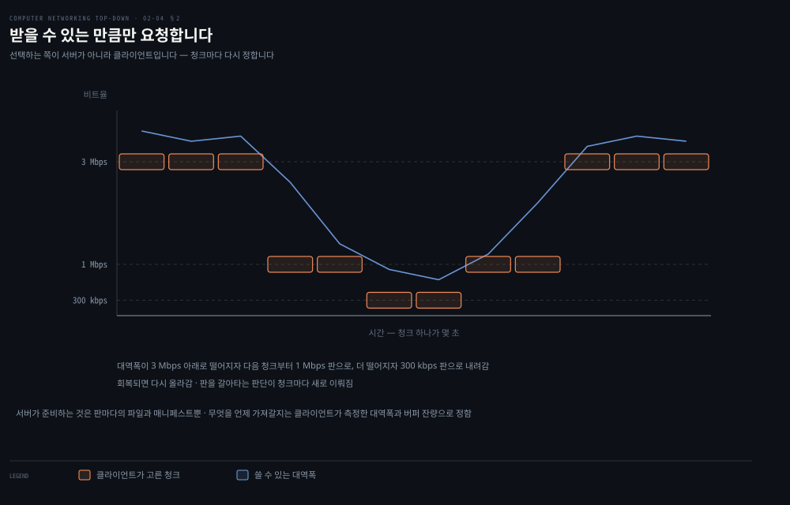
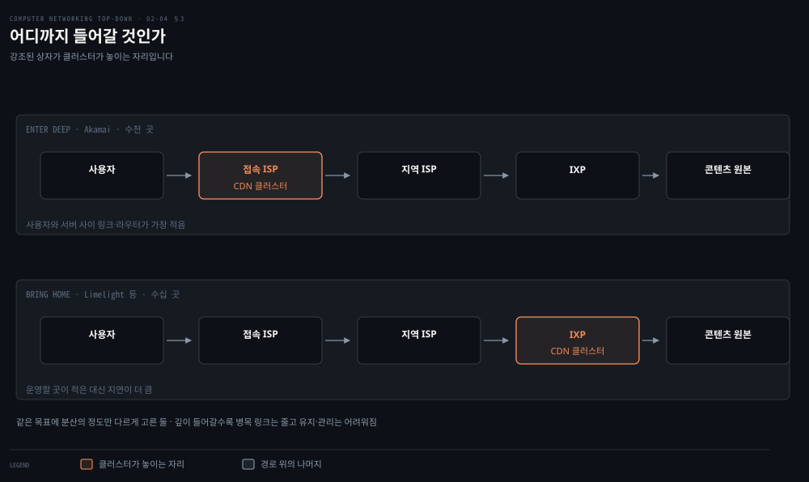
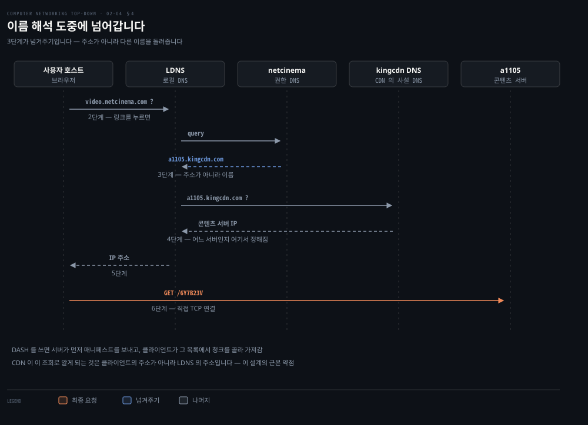

# 영상은 어떻게 끊기지 않는가

---

> 인터넷 트래픽의 절반을 훌쩍 넘는 것이 영상입니다. 그런데 트랜스포트 층은 처리량도 지연도 보장해 주지 않습니다. 그 간극을 애플리케이션 층이 두 가지 방법으로 메웁니다.

## 핵심 요약

> 이 편이 매달린 하나의 생각은 **보장이 없는 망 위에서 영상을 끊기지 않게 하는 방법이 둘이라는 것**입니다. 하나는 화질을 낮추는 것이고, 다른 하나는 서버를 시청자 가까이 옮기는 것입니다.

원문이 규모부터 답니다. 스트리밍 영상이 **전 세계 인터넷 트래픽의 65% 이상**이고 **모바일 망 트래픽의 75% 가까이**를 차지합니다. 이 정도 비중이면 인터넷의 설계가 아니라 사용 실태 자체가 영상 중심이라는 뜻입니다.

영상의 결정적 성질은 **비트율이 높다**는 것입니다. 압축된 인터넷 영상이 낮은 화질에서 100 kbps, 초고화질에서 25 Mbps 입니다. 7 Mbps 영상 한 시간이면 저장과 트래픽으로 각각 3 기가바이트가 듭니다.

그래서 가장 중요한 성능 지표가 하나로 좁혀집니다. **평균 종단 처리량**입니다. 끊김 없이 재생하려면 망이 내주는 평균 처리량이 최소한 압축된 영상의 비트율만큼은 되어야 합니다.

여기서 두 갈래의 답이 나옵니다.

1. **요구를 낮춥니다.** 같은 영상을 여러 비트율로 만들어 두고, 지금 받을 수 있는 만큼만 요청합니다. 이것이 DASH 입니다.
2. **거리를 줄입니다.** 병목이 될 링크를 적게 지나도록 서버를 시청자 가까이 옮깁니다. 이것이 CDN 입니다.

두 방법 모두 [01-04](./01-04.무엇이%20느려지고%20무엇이%20사라지는가.md) 에서 본 병목 링크 이야기의 응용입니다. 종단 처리량은 경로에서 가장 느린 링크가 정하므로, 링크를 적게 지날수록 병목을 만날 확률이 줄어듭니다.


## 학습 목표

> 이 편을 읽고 나면 아래 다섯 가지를 스스로 해낼 수 있습니다.

1. 영상 스트리밍의 가장 중요한 성능 지표가 무엇이고 왜 그것인지 말할 수 있습니다.
2. 단순 HTTP 스트리밍의 한계와 DASH 가 그것을 어떻게 푸는지 설명할 수 있습니다.
3. 데이터센터 하나로 영상을 뿌릴 때의 문제 셋을 댈 수 있습니다.
4. Enter Deep 과 Bring Home 의 차이와 각각의 대가를 말할 수 있습니다.
5. CDN 이 DNS 를 어떻게 가로채 재지향하는지 여섯 단계로 설명할 수 있습니다.


## 1. 영상이라는 매체

> 네트워크 관점에서 영상의 성질은 하나로 요약됩니다. 비트율이 높고, 그 비트율을 우리가 고를 수 있다는 것입니다.

### 압축이 선택지를 만듭니다

영상은 이미지의 연속입니다. 보통 초당 24장이나 30장의 고정 속도로 표시됩니다. 압축하지 않은 이미지는 픽셀의 배열이고 각 픽셀은 휘도와 색을 나타내는 비트로 부호화됩니다.

중요한 성질은 **압축할 수 있다**는 것입니다. 화질과 비트율을 맞바꿀 수 있습니다. 원문의 표현으로 오늘날의 기성 압축 알고리즘은 **사실상 원하는 어떤 비트율로도** 영상을 압축할 수 있습니다.

이 성질이 이 편의 전반부를 결정합니다. 같은 영상을 여러 품질로 만들어 둘 수 있다는 뜻이기 때문입니다. 원문의 예로 300 kbps, 1 Mbps, 3 Mbps 세 판을 만들어 두면 고속 회선 사용자는 3 Mbps 를, 이동 중인 스마트폰 사용자는 300 kbps 를 고를 수 있습니다.

### 지표는 하나입니다

원문이 성능 지표를 하나로 좁힙니다. **평균 종단 처리량**입니다. 연속 재생을 하려면 망이 스트리밍 응용에 내주는 평균 처리량이 **최소한 압축된 영상의 비트율만큼** 되어야 합니다.

지연이 아니라 처리량인 것이 핵심입니다. 저장된 영상은 미리 버퍼에 쌓아 둘 수 있으므로 몇 초의 지연은 견딥니다. 처리량이 모자라면 버퍼가 마르고, 버퍼가 마르면 화면이 멈춥니다.


## 2. 화질을 낮춰서 버티기 — HTTP 스트리밍과 DASH

> 모두에게 같은 화질을 보내면 느린 쪽이 끊깁니다. 그래서 요청하는 쪽이 매번 화질을 고르게 했습니다.



### 단순 HTTP 스트리밍

영상을 HTTP 서버에 그냥 파일 하나로 두고 URL 을 붙입니다. 클라이언트가 TCP 연결을 세우고 그 URL 로 GET 을 냅니다. 서버는 망과 트래픽 상황이 허락하는 한 **최대한 빨리** 영상 파일을 응답으로 보냅니다.

클라이언트 쪽에서는 바이트가 응용 버퍼에 쌓입니다. 버퍼의 바이트 수가 정해 둔 문턱을 넘으면 재생을 시작합니다. 그 뒤로는 버퍼에서 프레임을 꺼내 압축을 풀고 화면에 그리는 일을 되풀이합니다. **뒷부분을 계속 받으면서 앞부분을 보여 주는** 것입니다.

YouTube 도 초기부터 이 방식을 널리 썼습니다. 그런데 큰 결함이 있습니다.

> **모든 클라이언트가 같은 부호화를 받습니다.** 클라이언트마다 쓸 수 있는 대역폭이 크게 다르고, 같은 클라이언트도 시간에 따라 달라지는데도 그렇습니다.

### DASH 가 바꾼 것

**Dynamic Adaptive Streaming over HTTP** 입니다. 영상을 여러 판으로 부호화해 두고, 클라이언트가 **몇 초 길이의 청크를 하나씩 동적으로 요청**합니다. 쓸 수 있는 대역폭이 넉넉하면 높은 비트율 판에서, 부족하면 낮은 판에서 고릅니다.

서버 쪽 준비물은 둘입니다.

- **각 판의 파일**: 판마다 다른 URL 을 갖습니다.
- **매니페스트 파일**: 각 판의 URL 과 비트율을 알려 줍니다.

클라이언트의 절차도 둘입니다.

1. 먼저 매니페스트를 요청해 어떤 판들이 있는지 알아냅니다.
2. 그다음 청크를 하나씩 고릅니다. **URL 과 바이트 범위**를 HTTP GET 에 지정하는 방식입니다.

청크를 내려받는 동안 클라이언트는 받은 대역폭을 **측정**하고, 비율 결정 알고리즘을 돌려 다음에 요청할 청크를 고릅니다. 버퍼에 쌓인 영상이 많고 측정된 대역폭이 높으면 높은 비트율 판에서, 반대면 낮은 판에서 고릅니다.

### 결정권이 옮겨 간 것이 요점입니다

여기가 이 절의 핵심입니다. 화질을 정하는 주체가 **서버에서 클라이언트로** 넘어갔습니다. 서버는 판들을 늘어놓기만 하고, 무엇을 언제 가져갈지는 클라이언트가 매 청크마다 새로 정합니다.

이동 중인 사용자에게 특히 중요합니다. 기지국과의 거리가 바뀌면서 대역폭이 계속 출렁이는데, DASH 는 세션 도중에도 판을 자유롭게 갈아탈 수 있습니다.

> **노트의 읽기**: DASH 가 HTTP 위에 앉는다는 점이 조용히 큰 이득입니다. 새 프로토콜을 만들지 않았으므로 방화벽을 그대로 통과하고, 기존 웹 캐시와 CDN 을 그대로 씁니다. [02-02](./02-02.웹은%20어떻게%20주고받는가.md) 에서 본 `Range` 방식의 부분 요청이 여기서 청크 단위 적응의 도구가 됩니다. 새 문제를 새 프로토콜이 아니라 있는 프로토콜의 조합으로 푼 사례입니다.


## 3. 거리를 줄이기 — CDN 의 두 철학

> 데이터센터 하나로 전 세계에 영상을 뿌리면 세 가지가 동시에 잘못됩니다. 그래서 서버를 흩뿌립니다.



### 거대한 데이터센터 하나로 하면

가장 단순한 방법은 데이터센터 하나에 영상을 다 넣고 거기서 전 세계로 보내는 것입니다. 원문이 문제를 셋으로 셉니다.

1. **병목**: 클라이언트가 멀면 패킷이 많은 링크와 여러 ISP 를 지납니다. 그중 하나라도 처리량이 영상 소비율보다 낮으면 종단 처리량도 그 아래로 떨어져 화면이 멈춥니다. 경로의 링크 수가 늘수록 그런 링크를 만날 확률이 커집니다.
2. **같은 바이트를 반복 전송**: 인기 있는 영상이 같은 링크로 몇 번이고 다시 갑니다. 대역폭 낭비인 데다, 영상 회사가 **같은 바이트를 인터넷에 내보내는 값을 반복해서 지불**합니다.
3. **단일 장애점**: 데이터센터나 그 인터넷 회선이 죽으면 아무것도 못 내보냅니다.

### CDN 이 하는 일

CDN 이 하는 일이 셋입니다.

- 지리적으로 흩어진 여러 위치에서 서버를 운영합니다.
- 영상과 그 밖의 콘텐츠 사본을 그 서버들에 저장합니다.
- **각 사용자 요청을 가장 좋은 경험을 줄 위치로 보내려** 합니다.

소유 형태로 둘로 갈립니다.

- **사설 CDN**: 콘텐츠 제공자가 직접 소유합니다. 구글의 CDN 이 YouTube 영상을 나릅니다.
- **제삼자 CDN**: 여러 제공자를 대신해 콘텐츠를 나릅니다. Akamai, Cloudflare, Amazon CloudFront 가 여기 듭니다.

### 어디까지 들어갈 것인가

서버를 어디 둘지에 두 철학이 있습니다. 이 대비가 이 절의 요점입니다.

| | Enter Deep | Bring Home |
|---|---|---|
| 개척자 | Akamai | Limelight 등 다수 |
| 어디에 두나 | 전 세계 접속 ISP 안으로 깊이 들어가 클러스터를 둡니다 | IXP 에 큰 클러스터를 둡니다 |
| 규모 | 수천 곳 | 수십 곳 |
| 노리는 것 | 사용자와 CDN 서버 사이의 링크와 라우터 수를 줄여 지연과 처리량을 개선 | 유지·관리 부담을 줄임 |
| 대가 | 클러스터 유지·관리가 어려워집니다 | 지연이 더 크고 처리량이 낮아질 수 있습니다 |

같은 목표를 놓고 **분산의 정도**를 다르게 고른 것입니다. 더 깊이 들어갈수록 사용자에게 가깝지만 운영할 곳이 많아집니다.

### 무엇을 어디에 둘 것인가

클러스터를 놓고 나면 콘텐츠를 복제해야 합니다. 그런데 모든 클러스터에 모든 영상을 둘 필요는 없습니다. 거의 안 보는 영상도 있고 특정 국가에서만 인기 있는 영상도 있습니다.

그래서 많은 CDN 이 **끌어오는 전략**을 씁니다. 클라이언트가 그 클러스터에 없는 영상을 요청하면, 클러스터가 중앙 저장소나 다른 클러스터에서 그 영상을 가져오면서 **동시에 클라이언트에게 스트리밍하고** 사본을 로컬에 저장합니다. 저장 공간이 차면 자주 요청되지 않는 영상을 지웁니다.

반대편 전략도 있습니다. **미는 전략**은 CDN 이 각 지역에서 어떤 영상의 수요가 클지 예측해 미리 보내 둡니다. 뒤에서 볼 Netflix 가 이 방식입니다.


## 4. CDN 은 DNS 를 가로챕니다

> 브라우저가 영상 URL 로 요청하면 CDN 이 그 요청을 낚아채야 합니다. 그 낚아채기를 DNS 로 합니다.



### 무엇을 해야 하나

브라우저가 특정 영상을 가져오라는 지시를 받으면 CDN 이 두 가지를 해야 합니다.

1. 그 클라이언트에게 그 시점에 알맞은 **CDN 서버 클러스터를 정합니다.**
2. 클라이언트의 요청을 그 클러스터의 서버로 **돌려세웁니다.**

대부분의 CDN 이 이 둘을 DNS 로 합니다.

### 원문의 여섯 단계

콘텐츠 제공자 NetCinema 가 제삼자 CDN 인 KingCDN 을 씁니다. NetCinema 의 영상 URL 에는 `video` 라는 문자열과 영상 고유 식별자가 들어갑니다.

```properties
http://video.netcinema.com/6Y7B23V
```

1. 사용자가 NetCinema 웹 페이지를 방문합니다.
2. 링크를 누르면 사용자 호스트가 `video.netcinema.com` 에 대한 DNS 질의를 냅니다.
3. 로컬 DNS 서버가 NetCinema 의 권한 DNS 서버로 질의를 넘깁니다. 그 서버는 호스트 이름 안의 `video` 문자열을 알아보고, **IP 주소 대신 KingCDN 도메인의 호스트 이름**을 돌려줍니다. 예를 들면 `a1105.kingcdn.com` 입니다.
4. 여기서부터 질의가 KingCDN 의 사설 DNS 안으로 들어갑니다. 로컬 DNS 서버가 `a1105.kingcdn.com` 에 대해 두 번째 질의를 내고, KingCDN 의 DNS 가 콘텐츠 서버의 IP 주소를 돌려줍니다. **어느 서버가 콘텐츠를 줄지가 정해지는 곳이 바로 여기**입니다.
5. 로컬 DNS 서버가 그 IP 주소를 사용자 호스트에 전달합니다.
6. 클라이언트가 그 주소로 TCP 연결을 직접 세우고 영상에 대한 HTTP GET 을 냅니다. DASH 를 쓴다면 서버가 먼저 매니페스트를 보냅니다.

3단계가 이 구조의 핵심입니다. **권한 서버가 주소 대신 다른 이름을 돌려주는 것**이 넘겨주기의 방법입니다.

### 실제로 재 보면 그대로 보입니다

이 기계에서 Netflix 이름을 물어보면 넘겨주기가 그대로 나옵니다.

```bash
dig +noall +answer www.netflix.com
# www.netflix.com.          26  IN  CNAME  www.prod.ftl.netflix.com.
# www.prod.ftl.netflix.com. 44  IN  A      207.45.72.1
# www.prod.ftl.netflix.com. 44  IN  A      207.45.73.1
```

이름이 다른 이름으로 한 번 넘어간 뒤에야 주소가 나옵니다. Netflix 는 사설 CDN 이라 넘어간 이름도 자기 도메인 안입니다. TTL 이 26초와 44초인 것도 [02-03](./02-03.메일과%20이름은%20어떻게%20찾아가는가.md) 에서 본 그대로입니다.

리졸버를 바꿔 물으면 답이 갈립니다.

```bash
dig +short @8.8.8.8 i.ytimg.com   # 142.251.118.119 · 172.217.211.119
dig +short @1.1.1.1 i.ytimg.com   # 142.251.119.119 · 172.217.209.119
```

같은 이름인데 주소가 다릅니다. 4단계에서 말한 클러스터 선택이 실제로 리졸버마다 다르게 이뤄진 것입니다.

### 클러스터를 무엇으로 고르나

여기서 원문이 이 설계의 약점을 드러냅니다. CDN 이 DNS 조회로 알게 되는 것은 **클라이언트의 IP 주소가 아니라 클라이언트가 쓰는 로컬 DNS 서버의 IP 주소**입니다. 그 주소를 근거로 클러스터를 골라야 합니다.

방법이 둘 있습니다.

- **지리적으로 가장 가까운 클러스터**: 상용 위치 데이터베이스로 로컬 DNS 서버의 IP 를 위치로 바꾸고, 직선거리가 가장 짧은 클러스터를 고릅니다. 상당수 클라이언트에게 잘 맞습니다. 다만 지리적으로 가까운 것이 **경로의 길이나 홉 수로도 가깝다는 보장은 없습니다.**
- **실시간 측정**: 클러스터가 전 세계 로컬 DNS 서버로 주기적으로 탐침을 보내 지연과 손실을 잽니다. 문제는 **많은 로컬 DNS 서버가 그런 탐침에 응답하지 않도록 설정돼 있다**는 것입니다.

그리고 DNS 기반 방식 전체에 공통된 문제가 하나 더 있습니다. **일부 사용자는 멀리 있는 로컬 DNS 서버를 쓰도록 설정돼 있어서, 로컬 DNS 서버의 위치가 클라이언트의 위치와 멀 수 있습니다.**

> **노트의 읽기**: 원문은 이 문제를 짚고 넘어가지만 배포된 완화책은 적지 않습니다. **RFC 7871 "Client Subnet in DNS Queries"** 가 그것입니다.[^rfc7871] 초록의 첫 문장이 이 확장을 `"in active use to carry information about the network that originated a DNS query"` 라고 설명합니다. 리졸버가 질의에 **원래 질의를 낸 망의 주소 대역**을 실어 보내면, CDN 이 로컬 DNS 서버가 아니라 클라이언트 쪽 망을 보고 클러스터를 고를 수 있습니다. 위에서 공개 리졸버 둘이 서로 다른 주소를 돌려준 것도 이 계열의 동작입니다. 책이 문제를 정확히 진술한 자리에 답이 이미 나와 있습니다.


## 5. 같은 원리, 다른 선택 — Netflix 와 YouTube

> 둘 다 사설 CDN 을 쓰는데 캐싱 전략과 재지향 방식이 정반대입니다. 그 차이가 두 서비스의 성격을 드러냅니다.

### Netflix

배포가 두 덩어리로 나뉩니다. **아마존 클라우드**와 **자체 사설 CDN** 입니다.

아마존 클라우드가 맡는 일은 웹 사이트만이 아닙니다. 회원 가입과 로그인, 과금, 카탈로그, 추천 시스템이 여기서 돌고, 여기에 셋이 더 붙습니다.

- **콘텐츠 수집**: 스튜디오 마스터 판을 받아 클라우드 호스트로 올립니다.
- **콘텐츠 처리**: 데스크톱·스마트폰·게임 콘솔 등 다양한 재생기에 맞는 여러 형식을, 각각 여러 비트율로 만듭니다. DASH 를 쓰기 위한 판들입니다.
- **CDN 으로 업로드**: 만들어진 판들을 자기 CDN 으로 올립니다.

CDN 은 **Open Connect** 입니다. 2007년 스트리밍을 시작할 때는 제삼자 CDN 세 곳을 썼지만 지금은 자체 CDN 에서만 내보냅니다. 랙을 IXP 안과 가정용 ISP 안에 직접 설치했고, IXP 위치만 200곳이 넘습니다.

랙의 규격도 원문이 답니다. 서버마다 10 Gbps 이더넷 포트가 여럿이고 저장 용량이 100 테라바이트를 넘습니다. IXP 설치는 서버 수십 대로 **전체 라이브러리**를 담습니다. 다 담지 못하는 위치에는 인기작만 밀어 넣는데, 그 목록을 **날마다 다시 정합니다.**

두 가지가 다른 CDN 과 다릅니다.

- **DNS 재지향을 쓰지 않습니다.** 아마존 클라우드에서 도는 Netflix 소프트웨어가 클라이언트에게 **어느 CDN 서버를 쓰라고 직접 알려 줍니다.** 사설 CDN 이 영상만 나르므로 설계를 단순하게 만들 수 있었던 것입니다.
- **미는 캐싱을 씁니다.** 캐시 미스가 났을 때 동적으로 채우는 대신, **비혼잡 시간대에 미리** 밀어 넣습니다.

청크 길이는 약 4초입니다. 청크를 받는 동안 클라이언트가 처리량을 재고 다음 청크의 품질을 정합니다.

### YouTube

구글도 사설 CDN 을 쓰고 수백 곳의 IXP·ISP 위치에 서버 클러스터를 두었습니다. 여기까지는 Netflix 와 같습니다. 그런데 나머지가 반대입니다.

- **끌어오는 캐싱**을 씁니다.
- **DNS 재지향**을 씁니다.

클러스터 선택 기준도 원문이 밝힙니다. 대개 **클라이언트와 클러스터 사이 RTT 가 가장 낮은 곳**으로 보내되, 클러스터 간 부하를 고르게 하려고 **때로는 더 먼 클러스터로** 보냅니다.

업로드도 HTTP 입니다. 영상이 서버에서 클라이언트로 HTTP 로 흐를 뿐 아니라, 올리는 사람도 HTTP 로 올립니다. 받은 영상은 구글 데이터센터 안에서 YouTube 형식으로 변환되고 여러 비트율 판이 만들어집니다.

### 나란히 두면

| | Netflix | YouTube |
|---|---|---|
| CDN 소유 | 사설 (Open Connect) | 사설 (구글) |
| 캐시 채우기 | 밀기 — 비혼잡 시간대에 미리 | 끌어오기 — 요청이 오면 |
| 서버 지정 | 아마존 클라우드가 직접 알려 줌 | DNS 재지향 |
| 클러스터 선택 | ISP 안 랙 우선, 없으면 가까운 IXP | RTT 최소, 부하 분산 시 더 먼 곳 |
| 콘텐츠 성격 | 편수가 한정되고 인기 예측이 가능 | 편수가 방대하고 롱테일 |

마지막 줄이 앞 네 줄을 설명합니다. **무엇을 밀어 둘지 예측할 수 있으면 미는 캐싱이 낫습니다.** 예측이 안 되면 끌어오는 캐싱이 낫습니다.

Netflix 는 오늘 인기작을 날마다 다시 계산할 수 있습니다. 분마다 수백 시간이 올라오는 YouTube 는 그럴 수 없습니다.

> **노트의 읽기**: 원문이 Netflix 절에서 캐싱 전략을 설명하며 **"2.5.4절에서 설명한 pull-caching"** 이라 두 번 적습니다. 미는 캐싱과 끌어오는 캐싱은 **2.5.3절**의 「CDN 캐싱」 항목에서 설명됩니다. 2.5.4 는 이 문장이 들어 있는 절 자신입니다. 바로 다음 YouTube 문단은 같은 개념을 **"2.5.3절에서 설명한 대로"** 라며 제대로 가리킵니다. 한 절 안에서 같은 참조가 두 번 틀리고 한 번 맞습니다.
>
> 2장에서 이런 어긋난 상호 참조를 세 자리에서 찾았습니다. §2.2.3 이 프록시 캐시 설명을 §2.2.5 로 미루는데 그 절에는 그 내용이 없고, §2.2.7 이 TLS 곁상자를 §2.3 이라 적는데 실제로는 §2.1.4 에 있으며, 여기가 세 번째입니다. 판을 거듭하며 절이 옮겨지고 그것을 가리키던 문장만 남은 자국으로 보입니다.

> **노트의 읽기**: 구글 데이터센터 수가 이 책 안에서 세 번 다르게 나옵니다. §1.2 는 **"2024년 말 기준 33개"**, §1.3.3 은 **"주요 데이터센터 20개 이상"**, §2.5.3 은 **"메가 데이터센터 23개"** 라 적고 셋 다 같은 출처를 답니다. 대륙 범위도 §1.2 는 네 대륙, §2.5.3 은 남북 아메리카·유럽·아시아로 사실상 같습니다. "전체"와 "메가"를 다른 범주로 읽으면 33과 23이 어긋나지 않지만, 원문은 그 구분을 명시하지 않습니다.


## 스트리밍 치트시트

> 무엇이 어느 문제를 푸는지, 그리고 두 캐싱 전략이 언제 갈리는지 두 장으로 줄였습니다.

**문제와 답**

| 문제 | 답 | 누가 결정하나 |
|---|---|---|
| 클라이언트마다 대역폭이 다름 | 여러 비트율 판 + DASH | 클라이언트가 청크마다 |
| 세션 도중 대역폭이 출렁임 | 청크 단위 적응 | 클라이언트가 측정해서 |
| 경로가 길어 병목을 만남 | CDN 으로 서버를 가까이 | CDN 의 클러스터 선택 |
| 같은 바이트를 반복 전송 | 클러스터에 사본 보관 | 캐싱 전략 |
| 단일 장애점 | 지리적 분산 | CDN 배치 철학 |

**밀기냐 끌어오기냐**

| | 미는 캐싱 | 끌어오는 캐싱 |
|---|---|---|
| 언제 채우나 | 요청 전에 미리 | 캐시 미스가 났을 때 |
| 필요한 조건 | 수요를 예측할 수 있어야 | 예측이 필요 없음 |
| 첫 시청자 | 기다리지 않음 | 중앙에서 가져오는 동안 기다림 |
| 저장 공간 | 예측이 빗나가면 낭비 | 실제 수요만큼만 |
| 사례 | Netflix | YouTube |


## 심화 학습

> 이 편의 CDN 구조는 `dig` 와 `curl` 로 바깥에서 관찰할 수 있습니다.

```bash
# 이름이 다른 이름으로 넘어가는가 — 재지향 3단계의 흔적
dig +noall +answer www.netflix.com
dig +noall +answer www.bbc.co.uk

# 리졸버를 바꾸면 다른 클러스터가 오는가 — 4단계의 클러스터 선택
for r in 8.8.8.8 1.1.1.1 9.9.9.9; do printf "%-10s " $r; dig +short @$r i.ytimg.com | head -1; done

# 어느 CDN 이 응답했는지 헤더로 짐작하기
curl -sI https://www.cloudflare.com | grep -iE 'server|cf-ray|age'

# 부분 요청 — DASH 가 청크를 고르는 방법
curl -sI -r 0-1023 https://speed.cloudflare.com/__down?bytes=100000 | head -3
```

마지막 명령이 DASH 의 청크 요청과 같은 형태입니다. `Range` 헤더로 파일의 일부만 달라고 하면 서버가 `206 Partial Content` 로 답합니다. 매니페스트에서 얻은 URL 에 바이트 범위를 붙여 청크를 고른다는 본문의 서술이 이 한 줄로 확인됩니다.


## 면접 대비

> 이 편에서 실제로 묻는 자리는 DASH 에서 누가 화질을 정하는가, CDN 이 왜 DNS 를 쓰는가, 그리고 push 와 pull 이 언제 갈리는가입니다.

### 한 줄 정의

- **DASH**: 여러 비트율 판을 두고 클라이언트가 청크마다 판을 고르는 HTTP 기반 적응 스트리밍입니다.
- **매니페스트**: 각 판의 URL 과 비트율을 담은 파일입니다.
- **Enter Deep**: 접속 ISP 안까지 깊이 들어가 클러스터를 두는 배치 철학입니다.
- **미는 캐싱**: 수요를 예측해 요청 전에 콘텐츠를 채워 두는 전략입니다.

### 핵심 포인트 세 가지

1. DASH 에서 화질을 정하는 주체는 **클라이언트**입니다. 서버는 판을 늘어놓기만 합니다.
2. CDN 은 클라이언트의 IP 가 아니라 **로컬 DNS 서버의 IP** 를 보고 클러스터를 고릅니다. 이것이 이 설계의 근본 약점입니다.
3. 미는 캐싱은 **수요를 예측할 수 있을 때만** 성립합니다.

### 자주 묻는 질문

**"영상 스트리밍에서 왜 지연보다 처리량이 중요합니까?"** 저장된 영상은 버퍼로 지연을 흡수할 수 있기 때문입니다. 처리량이 비트율보다 낮으면 버퍼가 결국 마르고 재생이 멈춥니다. 실시간 화상회의는 반대로 지연이 지배합니다.

**"CDN 이 왜 하필 DNS 를 씁니까?"** 브라우저가 서버에 붙기 *전에* 개입할 수 있는 유일한 지점이기 때문입니다. 이름 해석은 모든 접속의 앞에 서므로, 여기서 다른 주소를 주면 요청 자체가 다른 서버로 갑니다.

**"Netflix 는 왜 DNS 재지향이 필요 없습니까?"** 사설 CDN 이 영상만 나르고, 어느 서버를 쓸지 정하는 소프트웨어가 이미 클라이언트와 대화하고 있기 때문입니다. 재생 시작 시점에 서버 IP 와 매니페스트를 함께 건네면 됩니다.


## 핵심 개념 체크리스트

> 아래를 보지 않고 말할 수 있으면 이 편은 통과입니다.

- [ ] 영상 스트리밍의 가장 중요한 성능 지표를 대고 그 이유를 말할 수 있습니다.
- [ ] 단순 HTTP 스트리밍의 결함을 한 문장으로 말할 수 있습니다.
- [ ] DASH 에서 매니페스트가 무엇을 담는지 말할 수 있습니다.
- [ ] 클라이언트가 다음 청크를 고르는 두 근거를 댈 수 있습니다.
- [ ] 데이터센터 하나로 뿌릴 때의 문제 셋을 셀 수 있습니다.
- [ ] Enter Deep 과 Bring Home 을 가르고 각각의 대가를 말할 수 있습니다.
- [ ] DNS 재지향 6단계에서 넘겨주기가 일어나는 단계를 짚을 수 있습니다.
- [ ] CDN 이 클러스터 선택에 쓰는 IP 주소가 누구의 것인지 압니다.
- [ ] 미는 캐싱과 끌어오는 캐싱이 갈리는 조건을 말할 수 있습니다.
- [ ] Netflix 가 DNS 재지향을 쓰지 않는 이유를 설명할 수 있습니다.


## 관련 문서

- [02-03 메일과 이름은 어떻게 찾아가는가](./02-03.메일과%20이름은%20어떻게%20찾아가는가.md) — 이 편의 앞. CDN 이 도구로 쓰는 DNS
- [02-02 웹은 어떻게 주고받는가](./02-02.웹은%20어떻게%20주고받는가.md) — DASH 가 올라타는 HTTP 와 부분 요청
- [01-04 무엇이 느려지고 무엇이 사라지는가](./01-04.무엇이%20느려지고%20무엇이%20사라지는가.md) — 종단 처리량을 정하는 병목 링크
- [Computer Networking — 정독 인덱스](./README.md) — 8개 장 전체 지도


## 참고 자료

- 원본: 《Computer Networking: A Top-Down Approach》 9판 (James F. Kurose · Keith W. Ross, Pearson)
- 다룬 범위: §2.5 Video Streaming and Content Distribution Networks
- [Netflix Open Connect](https://openconnect.netflix.com/) — 원문이 IXP·ISP 랙 목록의 출처로 드는 곳
- [RFC 7871 — Client Subnet in DNS Queries](https://www.rfc-editor.org/info/rfc7871) — 로컬 DNS 서버 위치 문제의 완화책

[^rfc7871]: RFC 7871 "Client Subnet in DNS Queries" (Informational). 초록 첫 문장 — "This document describes an Extension Mechanisms for DNS (EDNS0) option that is in active use to carry information about the network that originated a DNS query and the network for which the subsequent response can be cached." <https://www.rfc-editor.org/info/rfc7871>
