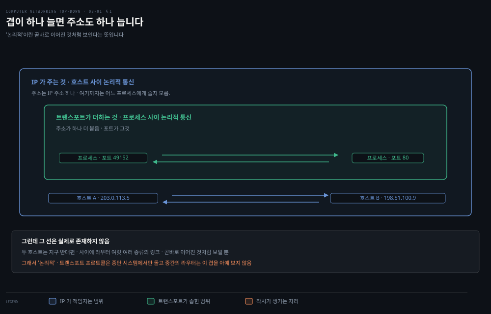
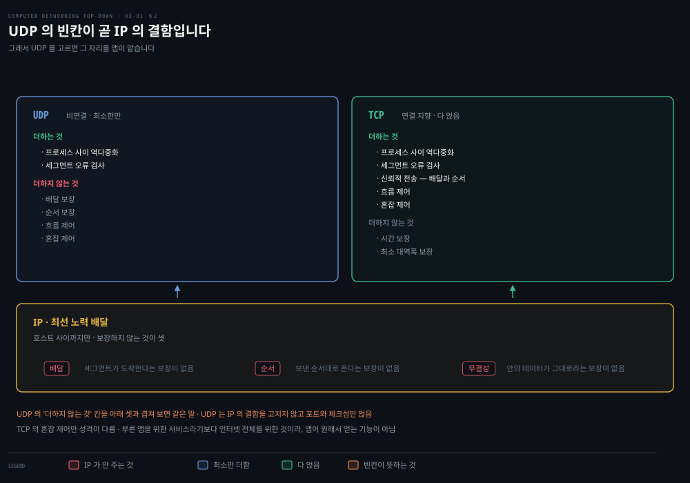
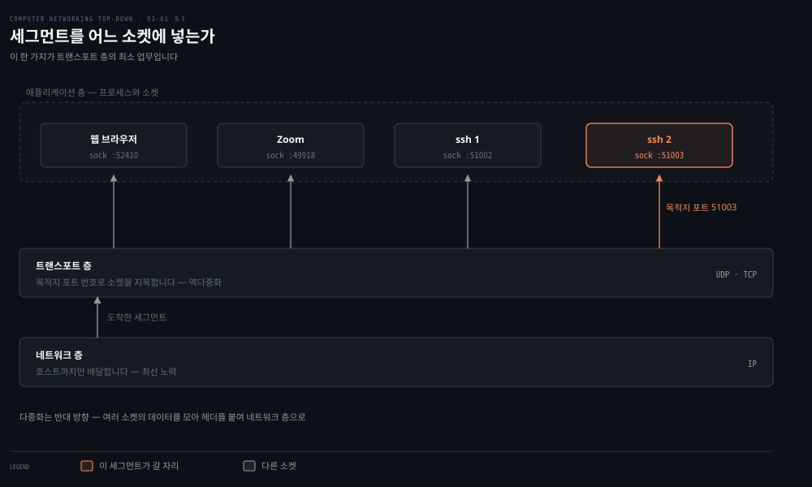
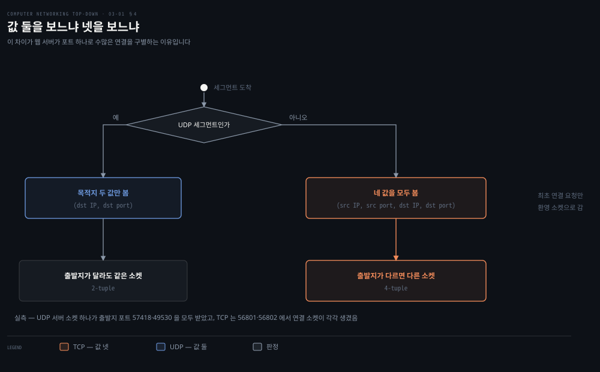
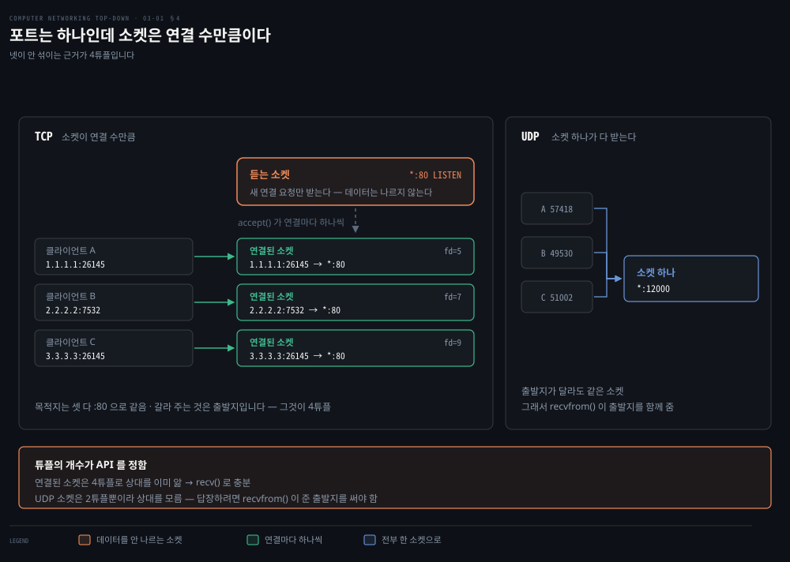
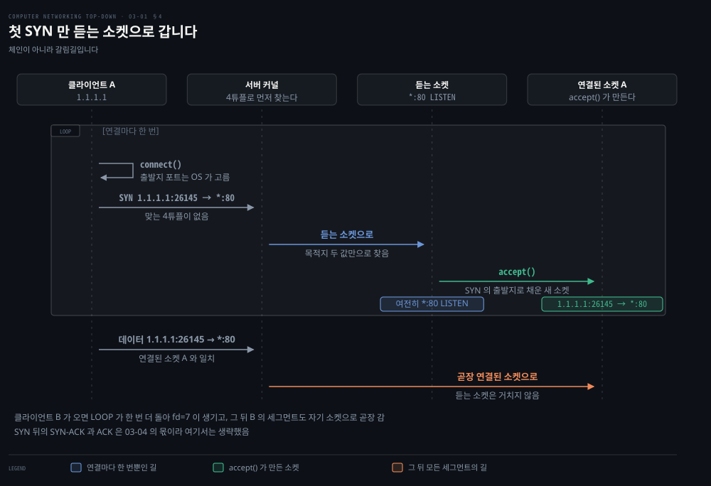
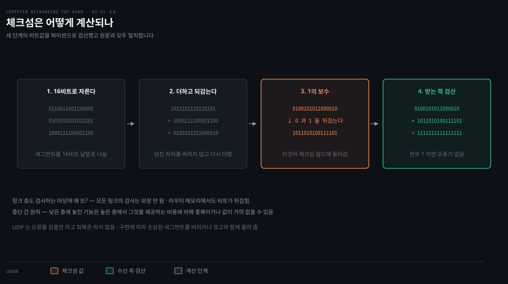

# 트랜스포트는 무엇을 더하는가

---

> 2장에서 소켓 위에 앉아 프로토콜을 골랐습니다. 이제 소켓 아래로 내려갑니다. 트랜스포트 층이 실제로 더하는 것이 무엇인지, 그중 가장 적게 더하는 쪽부터 봅니다.

## 핵심 요약

> 이 편이 매달린 하나의 생각은 **트랜스포트 층의 최소한의 일이 호스트 사이 배달을 프로세스 사이 배달로 넓히는 것이며, 거기에 오류 검출만 더한 것이 UDP** 라는 것입니다.

이 층의 자리를 한 단어가 잡습니다. **논리적 통신**입니다. 애플리케이션의 관점에서는 두 호스트가 직접 연결된 것처럼 보이는데, 실제로는 지구 반대편에 있고 수많은 라우터와 온갖 링크를 거칩니다.

위치도 못 박습니다. **트랜스포트 층 프로토콜은 종단 시스템에만 구현되고 라우터에는 없습니다.** 라우터는 데이터그램의 네트워크 층 필드만 보고, 그 안에 캡슐화된 트랜스포트 세그먼트의 필드는 들여다보지 않습니다.

그러면 트랜스포트가 더하는 것은 무엇인가. 답이 정확히 둘입니다.

1. **프로세스 대 프로세스 데이터 전달**: IP 는 호스트까지만 배달합니다. 그것을 프로세스까지 넓히는 일이 다중화와 역다중화입니다.
2. **오류 검사**: 세그먼트 헤더에 오류 검출 필드를 넣습니다.

**이 두 최소 서비스가 UDP 가 제공하는 전부입니다.** 나머지는 전부 TCP 가 더하는 것이며, 다음 편부터가 그 이야기입니다.

이 편은 그래서 뺄셈으로 읽는 편입니다. 가장 적게 더한 프로토콜을 먼저 보면 TCP 가 무엇을 왜 더했는지가 선명해집니다.


## 학습 목표

> 이 편을 읽고 나면 아래 아홉 가지를 스스로 해낼 수 있습니다.

1. 논리적 통신이 무엇인지 말하고, 트랜스포트 층과 네트워크 층의 책임을 가를 수 있습니다.
2. 아래 층이 못 주는 서비스를 위 층이 줄 수 있는 경우와 없는 경우를 구별할 수 있습니다.
3. 다중화와 역다중화가 각각 어느 쪽 호스트에서 일어나는 일인지 말할 수 있습니다.
4. UDP 소켓과 TCP 소켓의 식별자가 몇 개의 값으로 이뤄지는지 답하고 그 차이의 결과를 설명할 수 있습니다.
5. UDP 체크섬을 손으로 계산하고, 그것이 왜 링크 층 검사와 별개로 필요한지 말할 수 있습니다.
6. 듣는 소켓과 연결된 소켓이 어떻게 다른지 말하고, 연결이 셋일 때 서버 쪽 소켓이 몇 개인지 셀 수 있습니다.
7. `recvfrom()` 과 `recv()` 의 차이가 2튜플과 4튜플의 귀결임을 설명할 수 있습니다.
8. 링크 층 검사를 아무리 이어 붙여도 종단 간 검사가 되지 않는 이유를 라우터 메모리로 설명할 수 있습니다.
9. UDP 가 더하지 않는 것과 IP 가 보장하지 않는 것이 왜 같은 목록인지 설명할 수 있습니다.


## 1. 논리적 통신 — 앤과 빌의 비유

> 트랜스포트 층과 네트워크 층의 차이는 한 단어로 갈립니다. 하나는 프로세스 사이를 잇고 다른 하나는 호스트 사이를 잇습니다.



### 두 집안의 편지

두 집안 이야기가 이 구분을 풉니다. 동해안 집과 서해안 집에 각각 열두 명의 아이가 있고 서로 사촌입니다. 매주 각자가 모든 사촌에게 편지를 쓰니 집 하나가 **주당 144통**을 보냅니다.

각 집에 우편을 모으고 나눠 주는 아이가 하나씩 있습니다. 서해안의 앤과 동해안의 빌입니다. 앤은 형제자매를 돌며 편지를 모아 우체부에게 넘기고, 도착한 편지를 형제자매에게 나눠 줍니다.

대응이 이렇습니다.

| 비유 | 실제 |
|---|---|
| 봉투에 든 편지 | 애플리케이션 메시지 |
| 사촌들 | 프로세스 |
| 집 | 호스트, 즉 종단 시스템 |
| 앤과 빌 | 트랜스포트 층 프로토콜 |
| 우편 서비스와 우체부 | 네트워크 층 프로토콜 |

**우편 서비스는 집과 집 사이를 잇습니다. 사람과 사람 사이가 아닙니다.** 앤과 빌이 사촌들 사이를 잇습니다. 이 한 줄에 두 층의 차이가 다 들어 있습니다.

비유가 하나를 더 잡아 줍니다. 앤과 빌은 **자기 집 안에서만** 일합니다. 중간 우편집중국에서 편지를 분류하거나 집중국 사이로 옮기는 일에는 관여하지 않습니다. 트랜스포트 프로토콜이 종단 시스템에만 사는 것이 그렇습니다.

### 서비스 모델이 여럿일 수 있습니다

앤과 빌이 휴가를 가면 다른 사촌 쌍인 수전과 하비가 대신합니다. 그런데 이 둘은 어리다 보니 우편을 덜 자주 걷어 가고 가끔 편지를 잃어버립니다.

같은 우편 서비스 위에서 **서로 다른 서비스 모델**이 성립한다는 뜻입니다. 인터넷에 TCP 와 UDP 가 함께 있는 이유가 그것입니다.

### 아래 층이 상한을 정합니다

앤과 빌이 줄 수 있는 서비스는 우편 서비스가 줄 수 있는 것에 묶입니다. 우편이 배달 시간 상한을 보장하지 않으면 앤과 빌도 사촌들에게 상한을 약속할 수 없습니다.

그런데 예외가 있습니다. 이것이 이 장 전체의 전제입니다.

> 아래 네트워크 프로토콜이 대응하는 서비스를 주지 않아도 **트랜스포트 프로토콜이 줄 수 있는 서비스가 있습니다.** 네트워크 층이 패킷을 잃고 망가뜨리고 중복시켜도, 트랜스포트 프로토콜은 애플리케이션에 신뢰적 전송을 줄 수 있습니다.

무엇이 되고 무엇이 안 되는지가 갈립니다.

- **못 주는 것**: 지연 보장과 대역폭 보장입니다. 아래가 안 주면 위도 못 줍니다.
- **줄 수 있는 것**: 신뢰성과 기밀성입니다. 아래가 안 줘도 위에서 만들 수 있습니다.

다음 편이 그 "만들 수 있다"를 어떻게 만드는지 처음부터 짓습니다.


## 2. IP 가 주는 것과 그 위의 둘

> IP 의 서비스 모델은 한 단어로 최선 노력입니다. 그 말은 아무것도 보장하지 않는다는 뜻입니다.



### 최선 노력

IP 는 호스트 사이의 논리적 통신을 줍니다. 서비스 모델은 **최선 노력 배달**이며, 보장하지 않는 것이 셋입니다.

- 세그먼트가 배달된다는 보장이 없습니다.
- 세그먼트가 순서대로 배달된다는 보장이 없습니다.
- 세그먼트 안 데이터의 무결성 보장이 없습니다.

그래서 IP 를 **비신뢰적** 서비스라 부릅니다.

### 용어 하나를 정리하고 갑니다

여기서 이름 하나가 헷갈립니다. 인터넷 문헌은 TCP 의 트랜스포트 층 패킷을 **세그먼트**라 부르고 UDP 의 것을 흔히 **데이터그램**이라 부르는데, 같은 문헌이 네트워크 층 패킷도 데이터그램이라 부릅니다.

그래서 이 책은 이렇게 정합니다. **TCP 와 UDP 의 패킷을 모두 세그먼트라 하고, 데이터그램은 네트워크 층 패킷에만 씁니다.** 이 노트도 그 규약을 따릅니다.

### 두 프로토콜이 각각 더하는 것

| | UDP | TCP |
|---|---|---|
| 프로세스 대 프로세스 배달 | 있음 | 있음 |
| 오류 검사 | 있음 | 있음 |
| 신뢰적 데이터 전송 | 없음 | 있음 |
| 순서 보장 | 없음 | 있음 |
| 흐름 제어 | 없음 | 있음 |
| 혼잡 제어 | **없음** | 있음 |
| 헤더 크기 | 8바이트 | 20바이트 |

혼잡 제어의 성격이 여기서도 다시 못 박힙니다. 2장에서 본 그 문장입니다. **호출한 애플리케이션에 주는 서비스라기보다 인터넷 전체를 위한, 공익을 위한 서비스입니다.** 반대로 **UDP 트래픽은 규제되지 않습니다.** UDP 를 쓰는 애플리케이션은 원하는 속도로 원하는 만큼 보낼 수 있습니다.


## 3. 다중화와 역다중화

> **호스트까지 온 세그먼트를 어느 소켓에 넣을 것인가?**. 이 물음 하나가 트랜스포트 층의 최소 업무입니다.



### 두 방향의 일

상황은 이렇습니다. 웹 페이지를 내려받으면서 Zoom 세션 하나와 ssh 세션 둘을 돌리고 있습니다. 네트워크 응용 프로세스가 넷입니다. 네트워크 층에서 데이터가 올라오면 트랜스포트 층은 그것을 이 넷 중 하나로 보내야 합니다.

- **역다중화**: 받는 쪽에서 세그먼트의 데이터를 **올바른 소켓으로** 배달하는 일입니다.
- **다중화**: 보내는 쪽에서 여러 소켓의 데이터 조각을 모으고, 각 조각에 헤더를 붙여 세그먼트를 만들고, 네트워크 층으로 넘기는 일입니다.

앤과 빌의 비유가 여기에도 맞습니다. 빌이 우체부에게서 편지 뭉치를 받아 수신인을 보고 나눠 주는 것이 역다중화이고, 앤이 형제자매에게서 편지를 걷어 우체부에게 넘기는 것이 다중화입니다.

### 두 가지가 필요합니다

요구 조건이 둘입니다.

1. **소켓마다 고유한 식별자**가 있어야 합니다.
2. **각 세그먼트에 어느 소켓으로 갈지 알려 주는 필드**가 있어야 합니다.

그 필드가 **출발지 포트 번호**와 **목적지 포트 번호**입니다. 각각 16비트라서 0부터 65535 까지입니다. 그중 0부터 1023 은 **잘 알려진 포트 번호**로 예약돼 있습니다. HTTP 가 80, FTP 가 21 입니다.

> **지금은 다릅니다**: 잘 알려진 포트 목록의 출처로 **RFC 1700** 이 실려 있습니다. RFC 1700 "Assigned Numbers" 는 **RFC 3232 로 폐기**됐습니다.[^rfc1700] 뒤에 "iana.org 에서 갱신된다 [RFC 3232]"가 덧붙으므로 방향은 맞습니다. 지금 이 목록의 정본은 문서가 아니라 IANA 의 온라인 등록부입니다.

### 출발지 포트는 왜 있나

이 물음은 굳이 세워 답할 값이 있습니다. 출발지 포트 번호는 **회신 주소의 일부**입니다. B 가 A 에게 답을 보낼 때, B-to-A 세그먼트의 목적지 포트가 A-to-B 세그먼트의 출발지 포트 값을 그대로 씁니다.

2장에서 돌린 코드가 바로 그것이었습니다. `UDPServer.py` 가 `recvfrom()` 으로 클라이언트 쪽 포트를 꺼내 회신의 목적지로 삼았습니다.

> **책의 오기**: 그 코드를 **"§2.7 에서 공부한 UDP 서버 프로그램"** 이라 가리키는데, 그 프로그램은 **§2.6.1** 에 있고 §2.7 은 2장의 요약입니다. 2장 안에서 찾은 어긋난 상호 참조 셋에 이어 네 번째입니다.


## 4. UDP 소켓은 값 둘, TCP 소켓은 값 넷

> 같은 목적지 포트로 온 두 세그먼트가 같은 소켓에 가느냐 다른 소켓에 가느냐. 이 하나가 두 프로토콜의 구조를 가릅니다.



### 못 박아 둘 두 문장

- **UDP 소켓은 목적지 IP 주소와 목적지 포트 번호로 이뤄진 2튜플로 완전히 식별됩니다.** 그래서 출발지 IP 나 출발지 포트가 달라도, 목적지가 같으면 **같은 소켓**으로 갑니다.
- **TCP 소켓은 (출발지 IP, 출발지 포트, 목적지 IP, 목적지 포트) 4튜플로 식별됩니다.** 그래서 출발지가 다르면 목적지가 같아도 **다른 소켓**으로 갑니다.

TCP 에는 예외가 하나 붙습니다. **최초의 연결 수립 요청을 나르는 세그먼트**만은 환영 소켓으로 갑니다. 그 뒤로 만들어진 연결 소켓이 4튜플로 식별됩니다.

### 실제로 돌려 보면

이 기계에서 확인했습니다. UDP 는 서버 소켓 하나가 서로 다른 출발지 포트 둘의 세그먼트를 모두 받습니다.

```bash
python3 demux.py
# UDP  서버 소켓 1개가 받은 것: [('from-57418', 57418), ('from-49530', 49530)]
# TCP  환영 소켓 하나에서 생긴 연결 소켓:
#      fd=5  4튜플 = 127.0.0.1:56801 → 127.0.0.1:12101
#      fd=7  4튜플 = 127.0.0.1:56802 → 127.0.0.1:12101
```

TCP 쪽은 환영 소켓 하나에서 파일 서술자가 다른 연결 소켓 **둘**이 나왔고, 넷 중 출발지 포트 하나만 다릅니다. [02-01](./02-01.앱은%20무엇을%20고르고%20무엇을%20못%20고르는가.md) 에서 본 환영 소켓과 연결 소켓의 구분이 여기서 4튜플로 설명됩니다.

> **지금은 다릅니다**: 바인딩하지 않은 UDP 소켓에 운영체제가 **"1024 에서 65535 사이"** 의 포트를 붙인다고 적혀 있습니다. 
>
> 실제 범위는 그보다 좁습니다. 이 맥에서 재 보면 **49152~65535** 입니다. 위 실측에서 나온 57418·49530·56801·56802 가 모두 그 안에 듭니다. 1024~65535 는 규격상 쓸 수 있는 범위이고, 운영체제가 실제로 고르는 창은 IANA 가 권고한 동적 포트 구간입니다.
>
> ```bash
> sysctl net.inet.ip.portrange.first net.inet.ip.portrange.last
> # net.inet.ip.portrange.first: 49152
> # net.inet.ip.portrange.last: 65535
> ```

### 웹 서버가 포트 80 하나로 버티는 이유

이 구조의 실용적 결과가 여기서 나옵니다. 아파치가 포트 80 에서 돌면 **모든 클라이언트의 모든 세그먼트가 목적지 포트 80** 으로 옵니다. 연결 수립 세그먼트도 HTTP 요청도 전부 80 입니다.

그런데 서버는 출발지 IP 와 출발지 포트로 구별합니다. 클라이언트 하나가 연결 둘을 열어 출발지 포트로 26145 와 7532 를 쓰고, 다른 클라이언트가 우연히 같은 26145 를 골랐다고 해 봅니다. 그래도 섞이지 않습니다. **출발지 IP 가 다르기 때문입니다.**

현실이 하나 더 붙습니다. 연결 소켓과 프로세스가 반드시 일대일은 아닙니다. **오늘날의 고성능 웹 서버는 프로세스 하나만 쓰고 새 연결마다 스레드와 연결 소켓을 만듭니다.** 그러면 소켓 여럿이 같은 프로세스에 붙습니다.

지속 HTTP 와 비지속 HTTP 의 차이도 여기서 비용이 됩니다. **지속**은 한 번 맺은 연결로 요청 여럿을 잇달아 보내고 **비지속**은 요청·응답 하나마다 연결을 새로 맺고 끊습니다. 그 왕복 회계를 센 것이 [02-02](./02-02.%EC%9B%B9%EC%9D%80%20%EC%96%B4%EB%96%BB%EA%B2%8C%20%EC%A3%BC%EA%B3%A0%EB%B0%9B%EB%8A%94%EA%B0%80.md) 입니다. 비지속이면 소켓도 그때마다 만들고 닫아야 하는데, 이 잦은 생성과 소멸이 **바쁜 웹 서버의 성능을 심하게 깎을 수 있습니다.**

### 듣는 소켓과 연결된 소켓

여기서부터는 **노트의 읽기**입니다. 앞에서 「환영 소켓」과 「연결 소켓」은 이름만 지나갔습니다. 여기서는 같은 둘을 **역다중화의 눈으로** 다시 봅니다. 같은 둘을 소켓 API 로 만드는 순서에서 본 것이 [02-01](./02-01.%EC%95%B1%EC%9D%80%20%EB%AC%B4%EC%97%87%EC%9D%84%20%EA%B3%A0%EB%A5%B4%EA%B3%A0%20%EB%AC%B4%EC%97%87%EC%9D%84%20%EB%AA%BB%20%EA%B3%A0%EB%A5%B4%EB%8A%94%EA%B0%80.md) 인데, 필요한 만큼은 아래 표에 다시 적었으니 먼저 읽고 오지 않아도 됩니다.

**한 소켓이 두 일을 겸할 수 없다**는 것이 출발점입니다. 서버가 하는 일은 둘입니다. **새 연결을 받는 일**과 **연결된 상대와 데이터를 주고받는 일**입니다. 소켓은 자기 튜플이 곧 정체성인데, 이 두 일이 요구하는 튜플이 서로 어긋납니다. 새 손님을 받으려면 누가 올지 모르니 출발지를 **비워** 둬야 하고, 데이터를 주고받으려면 누구 것인지 알아야 하니 출발지가 **채워져** 있어야 합니다.

회사 대표번호와 통화 회선의 관계와 같습니다. 대표번호는 누가 걸지 모르니 상대를 비워 두고, 전화가 오면 담당자 회선으로 넘긴 뒤 곧바로 다음 전화를 기다립니다. 대표번호가 직접 통화를 붙들고 있으면 그동안 아무도 걸 수 없습니다.

TCP 라서 더 그렇습니다. TCP 는 **바이트 스트림**이라 메시지 경계가 없어 두 클라이언트의 바이트가 한 소켓에 섞이면 어디서 끊을지 알 방법이 없습니다. UDP 는 세그먼트 경계가 살아 있어 하나씩 꺼내며 「이건 누구 것」을 물어볼 수 있고, 그래서 소켓 하나로 버팁니다.

그래서 서버의 소켓이 둘로 갈립니다.

| | 듣는 소켓 | 연결된 소켓 |
|---|---|---|
| 만드는 것 | `socket()` → `bind()` → `listen()` | `accept()` 가 연결마다 하나씩 |
| 튜플 | `*:80` — 출발지가 비어 있습니다 | 4튜플 — 출발지까지 채워집니다 |
| 하는 일 | 새 연결 요청만 받습니다 | 데이터를 주고받습니다 |
| 개수 | 포트당 하나 | 연결 수만큼 |
| 책에서 부르는 이름 | 환영 소켓 | 연결 소켓 |

man page 가 이 표를 그대로 뒷받침합니다. `listen()` 은 그 소켓을 「`accept(2)` 로 들어오는 연결 요청을 받는 데 쓰일 소켓」으로 표시하고,[^listen] `accept()` 는 대기 큐에서 첫 요청을 꺼내 **새 연결된 소켓**을 만들어 돌려줍니다. 새로 만든 소켓은 듣는 상태가 아니며 **원래 소켓은 이 호출에 영향을 받지 않습니다.**[^accept] 듣는 소켓이 그대로 남아 다음 연결을 기다린다는 뜻입니다.

그러니 연결이 셋이면 서버 쪽 소켓은 **넷**입니다.



**포트는 80 하나인데 소켓은 연결 수만큼입니다.** 넷이 안 섞이는 근거가 앞에서 본 4튜플입니다. 목적지는 셋 다 `<서버 IP>:80` 으로 같지만 출발지가 다르므로, 도착한 세그먼트마다 갈 소켓이 하나로 정해집니다. 바로 앞 절의 「포트 80 하나로 버티는 이유」가 그림으로는 이 모양입니다.

### 첫 SYN 만 듣는 소켓으로 갑니다



여기도 노트의 읽기입니다.

세그먼트가 듣는 소켓을 **거쳐서** 연결된 소켓으로 가는 것은 아닙니다. 커널은 도착한 4튜플로 연결된 소켓을 먼저 찾습니다. 맞는 것이 없을 때만 `*:80` 듣는 소켓으로 보냅니다. 그래서 듣는 소켓이 손대는 것은 연결마다 **첫 SYN 하나**뿐입니다. 그 뒤의 모든 세그먼트는 연결된 소켓으로 곧장 갑니다. **체인이 아니라 갈림길입니다.**

듣는 소켓은 출발지가 비어 있으므로 목적지 두 값만으로 찾습니다. 4튜플은 `accept()` 의 조건이 아니라 결과입니다. SYN 이 실어 온 출발지 두 값을 듣는 소켓의 목적지 두 값과 합쳐 새 소켓을 채웁니다. 그 소켓이 큐에 오르기까지의 SYN-ACK 과 ACK 도 듣는 소켓 쪽에서 처리되며, 그 순서는 [03-04](./03-04.흐름%20제어와%20연결%20관리,%20그리고%20혼잡.md) 의 몫입니다. 듣는 소켓은 그 뒤에도 비어 있습니다. 비어 있어야 다음 손님을 받습니다.

포트를 고르는 쪽은 둘로 갈립니다. 서버의 80 은 프로그램이 `bind()` 로 고릅니다. 클라이언트 쪽 포트는 `connect()` 때 운영체제가 고릅니다.[^connect] 이 맥에서 그 구간은 앞에서 잰 49152~65535 이고, 위 26145 는 원문 예시의 번호입니다. 클라이언트도 `bind()` 를 먼저 부르면 직접 고를 수 있지만 대개 그러지 않습니다. `accept()` 는 새 포트를 만들지 않습니다. 연결된 소켓의 로컬 포트는 80 그대로입니다. 위 실측에서 fd=5 와 fd=7 이 둘 다 `:12101` 인 것이 그 증거입니다.

### 튜플 개수가 API 를 정합니다

여기도 노트의 읽기입니다. 소켓이 상대를 아느냐 모르느냐가 데이터를 읽는 함수까지 갈라 놓습니다.

| | UDP 소켓 | TCP 의 연결된 소켓 |
|---|---|---|
| 식별자 | 2튜플 — 상대를 모릅니다 | 4튜플 — 상대를 압니다 |
| 받는 함수 | `recvfrom()` | `recv()` |
| 출발지는 | 데이터와 함께 돌려받습니다 | 물어볼 필요가 없습니다 |

UDP 소켓은 목적지만 맞으면 출발지가 누구든 같은 소켓으로 들어옵니다. 소켓이 하나뿐이라 답장하려면 방금 온 것이 누구에게서 왔는지를 따로 알아내야 하고, 그 자리를 `recvfrom()` 의 인자가 채웁니다. man page 는 「`src_addr` 이 NULL 이 아니고 하부 프로토콜이 메시지의 출발지 주소를 제공하면, 그 출발지 주소가 `src_addr` 이 가리키는 버퍼에 놓인다」고 적습니다.[^recvfrom]

TCP 는 그럴 필요가 없습니다. 연결된 소켓은 이미 4튜플로 상대를 알기 때문입니다. 같은 man page 가 그것을 등식으로 적어 둡니다. `recv()` 는 「보통 연결된 소켓에만 쓰며 `recvfrom(fd, buf, size, flags, NULL, NULL)` 과 같다」는 것입니다.[^recv] 출발지 자리에 `NULL` 을 넣어도 되는 것이 그 등식의 뜻입니다.

2장에서 `UDPServer.py` 만 `recvfrom()` 을 쓰고 `TCPServer.py` 는 `recv()` 를 쓴 것이 취향의 문제가 아니었습니다. **2튜플과 4튜플의 직접적 귀결입니다.**


## 5. 왜 UDP 를 고르나

> TCP 가 더 많이 주는데 왜 덜 주는 쪽을 고르는가. 이유가 넷입니다.

### 네 가지 이유

- **보낼 것과 보낼 시점을 앱이 직접 정합니다.** UDP 는 앱이 데이터를 넘기는 즉시 세그먼트로 싸서 네트워크 층으로 넘깁니다. TCP 는 혼잡할 때 송신 측을 조이고, 확인 응답이 올 때까지 **얼마가 걸리든** 재전송을 계속합니다. 최소 송신 속도가 필요하고 지연을 못 견디며 약간의 손실은 견디는 실시간 앱에 TCP 의 서비스 모델은 맞지 않습니다.
- **연결 수립이 없습니다.** TCP 는 3-way 핸드셰이크를 먼저 합니다. UDP 는 격식 없이 그냥 쏩니다. **DNS 가 TCP 대신 UDP 위에서 도는 주된 이유가 이것**입니다. TCP 로 돌면 훨씬 느려집니다.
- **연결 상태가 없습니다.** TCP 는 수신·송신 버퍼, 혼잡 제어 파라미터, 순서 번호와 확인 응답 번호를 종단 시스템에 들고 있어야 합니다. UDP 는 아무것도 안 들고 있습니다. 그래서 같은 서버가 **훨씬 많은 활성 클라이언트를 감당합니다.**
- **헤더가 작습니다.** TCP 는 세그먼트마다 20바이트, UDP 는 8바이트입니다.

### 그런데 값을 치릅니다

UDP 를 권하고 끝나지 않습니다. 한 문단을 들여 경고가 붙습니다.

혼잡 제어는 망이 **거의 아무 쓸모 있는 일도 못 하는 혼잡 상태**에 빠지지 않게 하는 장치입니다. 모두가 혼잡 제어 없이 고비트율 영상을 쏘면 라우터에서 넘침이 심해져 UDP 패킷조차 거의 목적지에 닿지 못합니다.

여기에 부작용이 하나 더 붙습니다. 그렇게 높아진 손실률이 **TCP 송신자들의 속도를 크게 떨어뜨립니다.** TCP 는 혼잡을 만나면 스스로 물러나기 때문입니다. 결국 혼잡 제어를 안 하는 UDP 가 TCP 세션을 밀어냅니다.

> **노트의 읽기**: 이 대목이 다음다음 편의 공정성 논의로 곧장 이어집니다. 규칙을 지키는 쪽만 손해를 보는 구조는 혼잡 제어를 **기술 문제이자 유인 문제**로 만듭니다. "모든 소스에게 적응적 혼잡 제어를 강제하는 새 방식이 여럿 제안됐다"는 한 줄로 넘어가는 자리인데, 그 제안들이 필요했던 이유가 이 유인 구조입니다.

### 신뢰성이 필요하면 앱이 만들면 됩니다

절이 이렇게 닫힙니다. UDP 를 쓰면서도 신뢰적 전송을 가질 수 있습니다. **신뢰성을 애플리케이션 자체에 넣으면** 됩니다. 확인 응답과 재전송 장치를 앱이 직접 구현하는 것입니다.

QUIC 이 정확히 그 길입니다. UDP 위에서 애플리케이션 층에 신뢰성을 구현했습니다. 이렇게 하면 애플리케이션이 **"떡을 갖고 있으면서 먹기도"** 합니다. TCP 혼잡 제어가 거는 전송률 제약을 받지 않으면서 신뢰적으로 통신하는 것입니다.


## 6. UDP 세그먼트와 체크섬

> 헤더가 네 필드뿐입니다. 그중 하나가 이 프로토콜이 제공하는 유일한 안전장치입니다.



### 네 필드

UDP 헤더는 각각 2바이트인 필드 넷으로 이뤄집니다. 합해서 8바이트입니다.

| 필드 | 크기 | 하는 일 |
|---|---|---|
| 출발지 포트 | 2바이트 | 회신 주소의 일부입니다 |
| 목적지 포트 | 2바이트 | 역다중화에 씁니다 |
| 길이 | 2바이트 | 헤더를 포함한 세그먼트의 바이트 수입니다. 데이터 필드 크기가 매번 다르므로 명시적으로 필요합니다 |
| 체크섬 | 2바이트 | 세그먼트에 오류가 들어갔는지 검사합니다 |

체크섬에 단서가 하나 붙습니다. 사실 체크섬은 UDP 세그먼트뿐 아니라 **IP 헤더의 몇 필드에 대해서도 계산됩니다.** 다만 숲을 보기 위해 그 세부는 생략한다고 밝힙니다.

### 계산 방법

보내는 쪽이 세그먼트의 모든 16비트 낱말을 더하고, 그 합의 **1의 보수**를 체크섬 필드에 넣습니다. 더하다 넘치면 그 넘침을 **되감아** 더합니다.

예로 든 16비트 낱말 셋을 그대로 검산해 봤습니다. 세 단계가 모두 맞습니다.

```python
w = [0b0110011001100000, 0b0101010101010101, 0b1000111100001100]
def add16(a, b):
    s = a + b
    return (s & 0xFFFF) + (s >> 16)      # 넘침을 되감기

s12  = add16(w[0], w[1])   # 1011101110110101  — 책의 값과 일치
s123 = add16(s12, w[2])    # 0100101011000010  — 책의 값과 일치
ck   = ~s123 & 0xFFFF      # 1011010100111101  — 책의 값과 일치
add16(s123, ck)            # 1111111111111111  — 수신 측 합계
```

받는 쪽은 체크섬을 포함해 네 개의 16비트 낱말을 모두 더합니다. 오류가 없으면 결과가 **전부 1** 이 됩니다. 비트 하나라도 0 이면 오류가 들어간 것입니다.

### 링크 층이 이미 검사하는데 왜 또 하나

이 물음에 답하는 자리에서 시스템 설계의 원칙 하나가 나옵니다. 이 절에서 가장 값진 대목입니다.

이유가 둘입니다.

1. **모든 링크가 오류 검사를 한다는 보장이 없습니다.** 경로의 어느 링크가 오류 검사 없는 링크 층 프로토콜을 쓸 수 있습니다.
2. **링크를 제대로 건너도 라우터 메모리에 저장돼 있는 동안 비트 오류가 생길 수 있습니다.**

링크별 신뢰성도 메모리 안 오류 검출도 보장되지 않으므로, 종단 간 데이터 전송이 오류 검출을 제공하려면 **트랜스포트 층이 종단 간으로 오류 검출을 해야 합니다.** 이것이 **종단 간 원칙**의 사례입니다.

> 어떤 기능은 종단 간으로 구현되어야 하므로, **"낮은 층에 놓인 기능은 높은 층에서 그것을 제공하는 비용에 비해 중복이거나 값이 거의 없을 수 있다."**

### 홉별 검사를 이어 붙여도 종단 간이 되지 않습니다

여기서부터는 노트의 읽기입니다. 앞은 이유 둘을 대고 곧장 종단 간 원칙으로 넘어가는데, **왜 링크 계층으로는 부족한가**의 그림이 없습니다. 그 그림을 그려 둡니다.

이더넷 프레임 끝의 CRC 는 **한 링크 안에서만 유효합니다.** 라우터는 프레임을 통째로 넘기지 않고, 들어온 프레임에서 데이터그램을 꺼내 그 링크에 맞는 **새 프레임을 만들어** 새 CRC 를 붙입니다. [06-03](./06-03.%EC%A3%BC%EC%86%8C%EA%B0%80%20%EB%91%98%EC%9D%B8%20%EC%9D%B4%EC%9C%A0%EC%99%80%20%EC%9D%B4%EB%8D%94%EB%84%B7.md) 이 「그 대가가 홉마다 프레임을 다시 만드는 일」이라고 적은 그 대목입니다.

여기에 틈이 생깁니다. 들어온 CRC 를 확인한 시점과 나가는 CRC 를 계산하는 시점 **사이**에 데이터그램은 라우터 메모리에 그냥 놓여 있습니다. 그 사이 비트가 뒤집히면 다음 링크가 **틀어진 값 위에 정상 도장을 찍습니다.** 새 CRC 가 틀어진 내용과 맞아떨어지니 받는 어댑터는 아무 이상도 못 봅니다.

RFC 3385 가 그 틈을 한 줄로 적습니다. CRC 재계산에 따르는 문제 둘 중 하나가 **「마지막 검사와 재계산 사이의 원치 않는 변경으로부터 패킷이 보호되지 않는다」**는 것입니다.[^crcgap] RFC 3819 는 같은 말을 설계 원칙 쪽에서 합니다. 신뢰적 배달이나 무결성 같은 기능은 **「홉별 서비스를 이어 붙이는 것만으로는 제공될 수 없다」**는 것입니다.[^hopbyhop]

중간에서 아무도 손대지 않는 검사만이 그것을 잡습니다. UDP 체크섬은 보내는 종단이 계산해 받는 종단이 검사할 때까지 **한 번도 다시 계산되지 않습니다.**

IP 헤더 체크섬이 정확히 반대편에 있습니다. RFC 791 이 그것을 「헤더에 대한 체크섬」이라 정의하면서, TTL 처럼 바뀌는 필드가 있으므로 **「인터넷 헤더가 처리되는 지점마다 다시 계산되고 검증된다」**고 적습니다.[^ipcksum] 다시 계산한다는 것은 계산하는 그 순간의 값을 봉인한다는 뜻이라, 직전에 생긴 오류가 있으면 그것까지 함께 봉인합니다. 게다가 덮는 범위가 헤더뿐이라 데이터는 애초에 보지 않습니다. 같은 저장소의 [Learning Modern Linux 07-01](../learning-modern-linux/07-01.%EA%B2%B0%EA%B5%AD%EC%9D%80%20%EC%84%A0%EA%B3%BC%20%EA%B3%B5%EA%B8%B0%EB%A5%BC%20%ED%83%80%EA%B3%A0%20%EB%8B%A4%EB%8B%88%EB%8A%94%20%EB%B9%84%ED%8A%B8%EB%8B%A4.md) 이 그 홉별 재계산을 산술로 보입니다.

### 검출은 하되 복구는 안 합니다

마지막 한 줄이 UDP 의 성격을 요약합니다. UDP 는 오류를 검사하지만 **오류로부터 회복하는 일은 아무것도 하지 않습니다.** 구현에 따라 손상된 세그먼트를 그냥 버리기도 하고, 경고와 함께 애플리케이션에 올려 주기도 합니다.


## 트랜스포트 치트시트

> 무엇이 어느 층의 책임인지, 그리고 소켓 식별자가 어떻게 갈리는지 두 장으로 줄였습니다.

**층별 책임**

| 물음 | 답 |
|---|---|
| 호스트와 호스트를 잇는 것은 | 네트워크 층 (IP) |
| 프로세스와 프로세스를 잇는 것은 | 트랜스포트 층 (TCP·UDP) |
| 라우터가 보는 것은 | 네트워크 층 필드까지 |
| 아래가 안 줘도 위가 줄 수 있는 것은 | 신뢰성, 기밀성 |
| 아래가 안 주면 위도 못 주는 것은 | 지연 보장, 대역폭 보장 |

**소켓 식별자**

| | UDP | TCP |
|---|---|---|
| 식별자 | 2튜플 (목적지 IP, 목적지 포트) | 4튜플 (출발지 IP·포트, 목적지 IP·포트) |
| 출발지가 다르면 | 같은 소켓 | 다른 소켓 |
| 서버 소켓 수 | 포트당 1개 | 환영 1개 + 연결마다 1개 |
| 예외 | 없음 | 최초 연결 요청은 환영 소켓으로 |


## 심화 학습

> 소켓 식별자와 포트 범위는 자기 기계에서 바로 확인할 수 있습니다.

```bash
# 이 기계가 실제로 쓰는 임시 포트 범위 (macOS)
sysctl net.inet.ip.portrange.first net.inet.ip.portrange.last
# 리눅스라면
# sysctl net.ipv4.ip_local_port_range

# 지금 열려 있는 소켓을 4튜플로 보기 — 같은 목적지 포트에 여러 연결이 붙어 있습니다
lsof -nP -iTCP -sTCP:ESTABLISHED | head

# 잘 알려진 포트의 정본 등록부 (RFC 1700 이 아니라 여기입니다)
# https://www.iana.org/assignments/service-names-port-numbers/

# UDP 헤더 8바이트를 눈으로 — 캡처해서 열어 보기
# sudo tcpdump -i lo0 -X -c 2 'udp port 12000'
```

`lsof` 출력의 `NAME` 열이 정확히 4튜플입니다. 같은 서버의 같은 포트로 붙은 연결이 여럿이면, 그 줄들이 출발지 포트에서만 갈리는 것을 볼 수 있습니다.

소켓 상태를 보는 명령은 **운영체제마다 다릅니다.** 리눅스 문서에서 흔히 보는 `ss` 는 iproute2 의 도구라 macOS 에는 아예 없고, 리눅스의 `netstat(8)` man page 는 자기를 대체로 폐기됐다고 적으며 `ss` 로 가라고 안내합니다. 그런데 그 세대 교체는 **리눅스 안의 이야기**입니다. macOS 의 `netstat(1)` man page 에는 그런 문구가 없고 지금도 현역입니다. 이 노트가 `lsof` 와 `netstat` 을 쓰는 것은 실습 기계가 맥이기 때문입니다.

```bash
# macOS — ss 는 없습니다. netstat 이나 lsof 를 씁니다
netstat -an -p tcp | head
lsof -nP -iTCP -sTCP:LISTEN

# 리눅스 — 같은 것을 ss 로 봅니다
# ss -tlnp
```


## 면접 대비

> 이 편에서 실제로 묻는 자리는 두 층의 책임 구분, 2튜플과 4튜플, 그리고 체크섬이 왜 중복이 아닌가입니다.

### 한 줄 정의

- **논리적 통신**: 물리적으로 멀리 있는 두 프로세스가 직접 이어진 것처럼 보이게 하는 추상입니다.
- **역다중화**: 도착한 세그먼트의 데이터를 올바른 소켓에 배달하는 일입니다.
- **최선 노력 배달**: 배달도 순서도 무결성도 보장하지 않는 IP 의 서비스 모델입니다.
- **종단 간 원칙**: 종단에서 구현되어야 하는 기능은 중간 층에 두어도 값이 크지 않다는 설계 원칙입니다.
- **듣는 소켓**: `listen()` 이 표시한 수동 소켓입니다. 새 연결 요청만 받고 데이터는 나르지 않습니다. 책에서 「환영 소켓」이라 부르는 것입니다.
- **연결된 소켓**: `accept()` 가 연결마다 새로 만들어 돌려주는 소켓입니다. 데이터는 여기서만 오갑니다.

### 핵심 포인트 세 가지

1. 트랜스포트 층은 **종단 시스템에만** 있습니다. 라우터는 이 층을 보지 않습니다.
2. UDP 가 IP 에 더하는 것은 **다중화·역다중화와 오류 검출** 둘뿐입니다.
3. TCP 소켓이 4튜플로 식별되기 때문에 웹 서버가 포트 하나로 수많은 연결을 구별합니다.
4. 연결이 셋이면 서버 쪽 소켓은 **넷**입니다. 듣는 소켓 하나는 `accept()` 뒤에도 그대로 남습니다.
5. 링크 층 CRC 는 홉마다 떼었다 새로 붙으므로, 그 검사를 이어 붙여도 종단 간 검사가 되지 않습니다.

### 자주 묻는 질문

**"UDP 에는 왜 체크섬이 있습니까? 이더넷이 이미 검사하는데요."** 경로의 모든 링크가 검사한다는 보장이 없고, 링크를 제대로 건너도 라우터 메모리에서 비트가 뒤집힐 수 있기 때문입니다. 종단 간 원칙의 교과서적 사례입니다.

**"DNS 는 왜 UDP 를 씁니까?"** 연결 수립 지연이 없기 때문입니다. 질의 하나에 1 RTT 도 아까운 일에 3-way 핸드셰이크를 먼저 하면 이름 해석이 훨씬 느려집니다.

**"같은 포트 번호를 두 클라이언트가 우연히 골라도 됩니까?"** TCP 라면 됩니다. 출발지 IP 가 다르면 4튜플이 달라 다른 소켓으로 갑니다. UDP 라면 목적지가 같은 이상 같은 소켓으로 갑니다.

**"듣는 소켓과 연결된 소켓이 따로 있습니까?"** 그렇습니다. `listen()` 이 만든 듣는 소켓은 새 연결 요청만 받고 데이터는 나르지 않습니다. `accept()` 가 연결마다 새 소켓을 만들어 돌려주고 데이터는 그쪽에서만 오갑니다. man page 도 원래 소켓은 `accept()` 에 영향을 받지 않는다고 못 박습니다. 그래서 연결이 셋이면 소켓은 넷입니다.

**"왜 UDP 만 `recvfrom()` 을 씁니까?"** 소켓이 상대를 모르기 때문입니다. UDP 소켓은 2튜플이라 출발지가 누구든 같은 소켓으로 들어오므로, 답장하려면 방금 온 것의 출발지를 데이터와 함께 받아야 합니다. TCP 의 연결된 소켓은 4튜플로 상대를 이미 알아서 `recv()` 로 충분하고, man page 도 `recv()` 를 출발지 자리에 `NULL` 을 넣은 `recvfrom()` 과 같다고 적습니다.


## 핵심 개념 체크리스트

> 아래를 보지 않고 말할 수 있으면 이 편은 통과입니다.

- [ ] 논리적 통신을 정의하고 트랜스포트와 네트워크 층의 차이를 말할 수 있습니다.
- [ ] 트랜스포트 층이 어디에 구현되고 어디에 없는지 말할 수 있습니다.
- [ ] 아래 층이 안 줘도 위가 줄 수 있는 서비스를 둘 댈 수 있습니다.
- [ ] 세그먼트와 데이터그램을 이 책의 규약대로 구별해 씁니다.
- [ ] IP 가 보장하지 않는 셋을 셀 수 있습니다.
- [ ] 다중화와 역다중화가 각각 보내는 쪽 일인지 받는 쪽 일인지 압니다.
- [ ] 포트 번호의 비트 수와 잘 알려진 포트의 범위를 답할 수 있습니다.
- [ ] 출발지 포트 번호의 용도를 말할 수 있습니다.
- [ ] UDP 소켓과 TCP 소켓의 식별자 개수를 답할 수 있습니다.
- [ ] UDP 를 고르는 이유 넷을 댈 수 있습니다.
- [ ] UDP 헤더의 네 필드를 댈 수 있습니다.
- [ ] 체크섬을 손으로 계산하고 수신 측 검증 방법을 말할 수 있습니다.
- [ ] 종단 간 원칙을 UDP 체크섬으로 설명할 수 있습니다.
- [ ] 듣는 소켓이 데이터를 나르지 않는다는 것과 그 근거를 말할 수 있습니다.
- [ ] 연결이 셋일 때 서버 쪽 소켓 개수를 세고 넷이 안 섞이는 근거를 댈 수 있습니다.
- [ ] `recvfrom()` 과 `recv()` 의 차이를 튜플 개수로 설명할 수 있습니다.
- [ ] 라우터 메모리에서 생긴 오류를 링크 층 CRC 가 왜 못 잡는지 말할 수 있습니다.
- [ ] 겹이 하나 늘 때 주소가 하나 는다는 것을 IP 주소와 포트로 설명할 수 있습니다.
- [ ] UDP 의 「더하지 않는 것」 목록과 IP 의 「보장하지 않는 것」 목록이 겹치는 이유를 말할 수 있습니다.
- [ ] 도착한 세그먼트가 듣는 소켓을 거쳐 연결된 소켓으로 가는 것이 아님을 조회 순서로 설명할 수 있습니다.


## 관련 문서

- [02-01 앱은 무엇을 고르고 무엇을 못 고르는가](./02-01.앱은%20무엇을%20고르고%20무엇을%20못%20고르는가.md) — 이 편의 앞. 소켓 위에서 본 같은 이야기
- [03-02 신뢰성은 어떻게 만들어지는가](./03-02.신뢰성은%20어떻게%20만들어지는가.md) — 이 편의 다음. 비신뢰적 채널 위에 신뢰성을 짓는 과정
- [Computer Networking — 정독 인덱스](./README.md) — 8개 장 전체 지도


## 참고 자료

- 원본: 《Computer Networking: A Top-Down Approach》 9판 (James F. Kurose · Keith W. Ross, Pearson)
- 다룬 범위: §3.1 Introduction and Transport-Layer Services · §3.2 Multiplexing and Demultiplexing · §3.3 Connectionless Transport: UDP
- [RFC 768 — User Datagram Protocol](https://www.rfc-editor.org/info/rfc768) — UDP 의 정본. 세 쪽입니다
- [IANA Service Name and Transport Protocol Port Number Registry](https://www.iana.org/assignments/service-names-port-numbers/service-names-port-numbers.xhtml) — 포트 번호의 현재 정본
- [RFC 791 — Internet Protocol](https://www.rfc-editor.org/rfc/rfc791.txt) — IP 헤더 체크섬이 홉마다 다시 계산된다는 근거
- [RFC 3385 — iSCSI CRC/Checksum Considerations](https://www.rfc-editor.org/rfc/rfc3385.txt) — CRC 재계산 사이의 무방비 구간
- [RFC 3819 — Advice for Internet Subnetwork Designers](https://www.rfc-editor.org/rfc/rfc3819.txt) — 홉별 서비스를 이어 붙여도 종단 간이 되지 않는다는 서술
- [Linux man-pages — `listen(2)`·`accept(2)`·`recvfrom(2)`](https://man7.org/linux/man-pages/) — 듣는 소켓과 연결된 소켓의 1차 자료

[^rfc1700]: RFC Editor — RFC 1700 정보 페이지. 제목은 "Assigned Numbers", 상태는 "This RFC is now obsolete, see RFC 3232". <https://www.rfc-editor.org/info/rfc1700>

[^listen]: `listen(2)` man page — "listen() marks the socket referred to by sockfd as a passive socket, that is, as a socket that will be used to accept incoming connection requests using accept(2)." <https://man7.org/linux/man-pages/man2/listen.2.html>

[^accept]: `accept(2)` man page — "It extracts the first connection request on the queue of pending connections for the listening socket, sockfd, creates a new connected socket, and returns a new file descriptor referring to that socket. The newly created socket is not in the listening state. The original socket sockfd is unaffected by this call." <https://man7.org/linux/man-pages/man2/accept.2.html>

[^connect]: POSIX `connect()` 규격 — "If the socket has not already been bound to a local address, connect() shall bind it to an address which, unless the socket's address family is AF_UNIX, is an unused local address." <https://pubs.opengroup.org/onlinepubs/9699919799/functions/connect.html>

[^recvfrom]: `recvfrom(2)` man page — "If src_addr is not NULL, and the underlying protocol provides the source address of the message, that source address is placed in the buffer pointed to by src_addr." 관심이 없으면 "src_addr and addrlen should be specified as NULL" 이라고 덧붙입니다. <https://man7.org/linux/man-pages/man2/recvfrom.2.html>

[^recv]: 같은 man page 의 `recv()` 항목 — "The recv() call is normally used only on a connected socket (see connect(2)). It is equivalent to the call: recvfrom(fd, buf, size, flags, NULL, NULL);" <https://man7.org/linux/man-pages/man2/recv.2.html>

[^crcgap]: RFC 3385 §6 Incremental CRC Updates — "In some protocols the packet header changes frequently. If the CRC includes the changing part, the CRC will have to be recomputed. This raises two issues: - the complete computation is expensive - the packet is not protected against unwanted changes between the last check and the recomputation" <https://www.rfc-editor.org/rfc/rfc3385.txt>

[^hopbyhop]: RFC 3819 §3 — "Such functions cannot be provided solely by the concatenation of hop-by-hop services; duplicating these functions at the lower protocol layers (i.e., within the subnetwork) can be needlessly redundant or even harmful to cost and performance." 같은 절이 그렇게 종단에서만 제대로 구현되는 기능의 예로 "ensuring the reliable delivery of data and the use of cryptography to provide confidentiality and message integrity" 를 듭니다. <https://www.rfc-editor.org/rfc/rfc3819.txt>

[^ipcksum]: RFC 791 — Header Checksum 필드의 정의는 "A checksum on the header only. Since some header fields change (e.g., time to live), this is recomputed and verified at each point that the internet header is processed." 입니다. <https://www.rfc-editor.org/rfc/rfc791.txt>
