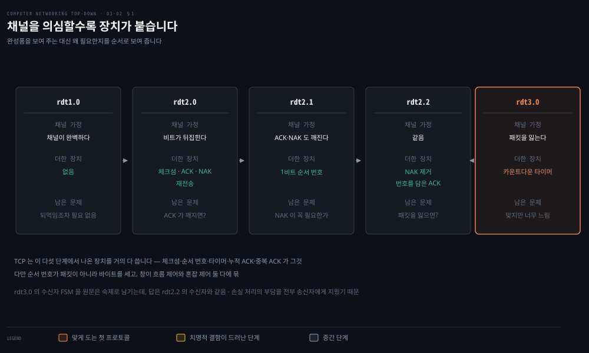
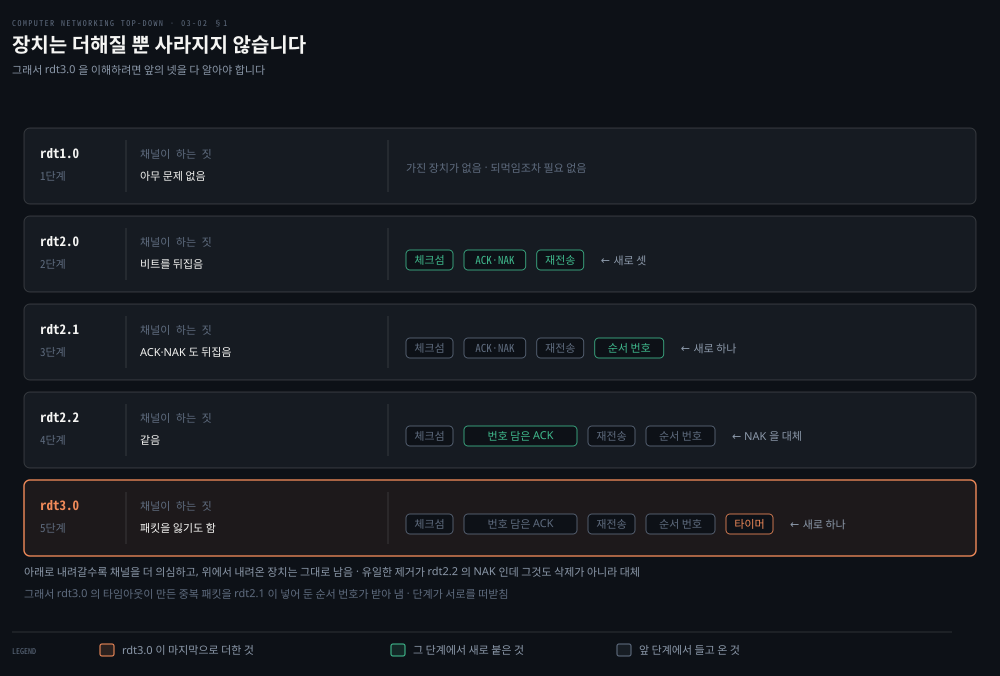
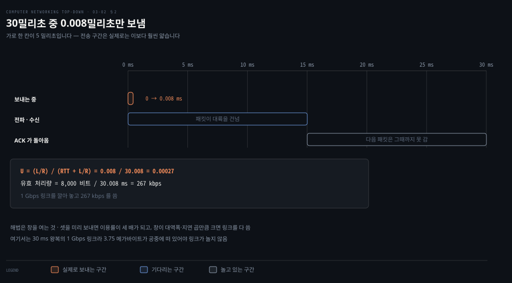
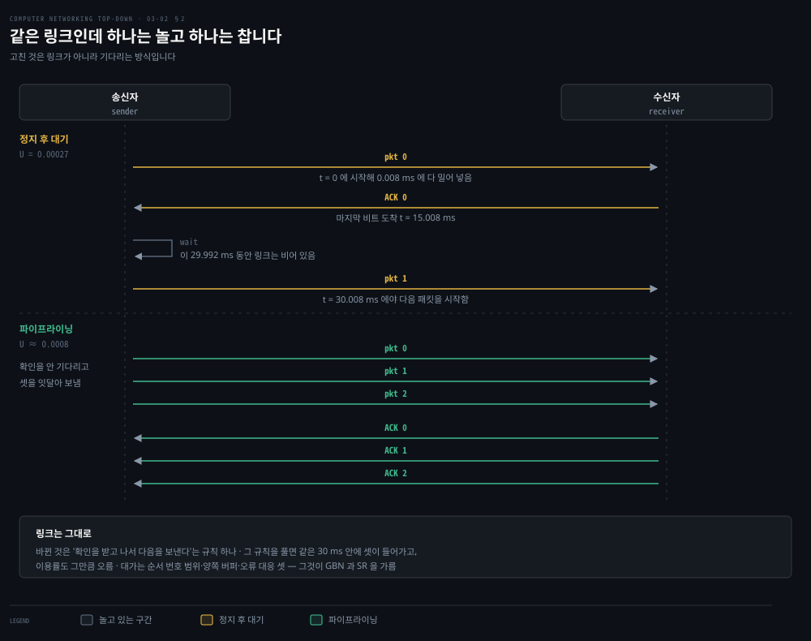
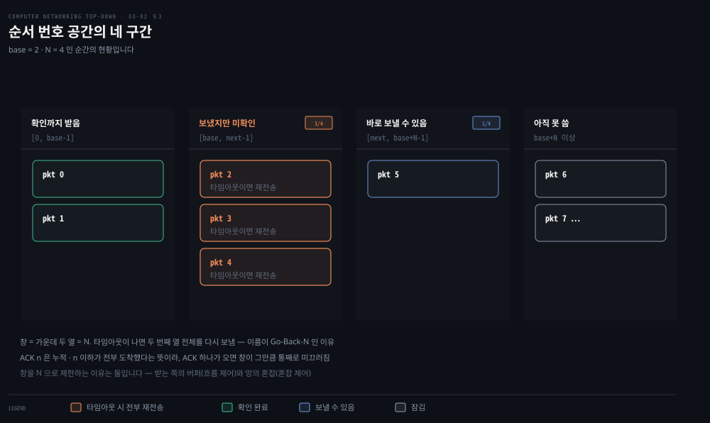
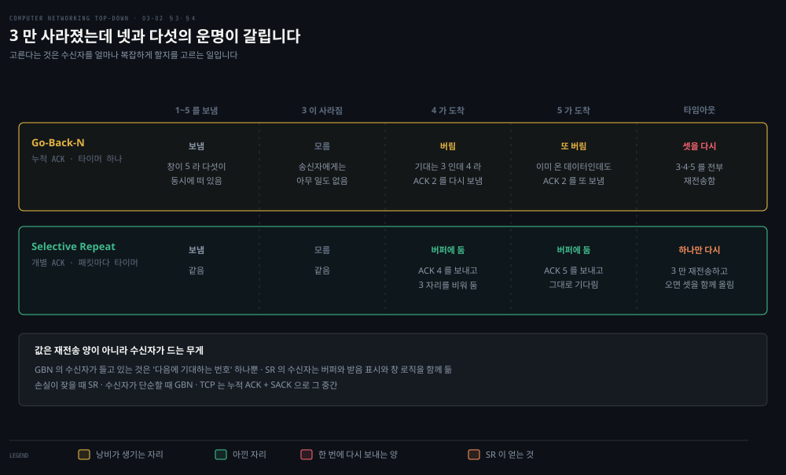
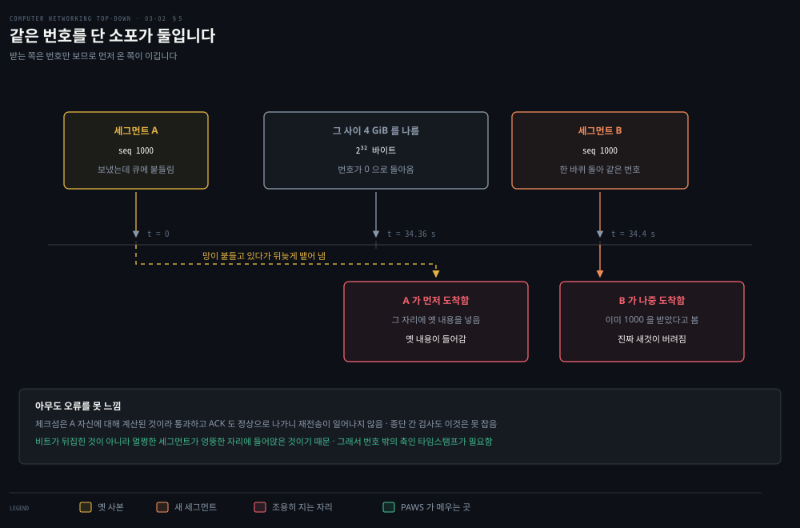

# 신뢰성은 어떻게 만들어지는가

---

> 앞 편에서 IP 가 아무것도 보장하지 않는다는 것을 봤습니다. 그 위에 **신뢰성을 어떻게 얹는가.** 완성된 답을 받는 대신 처음부터 함께 짓습니다.

## 핵심 요약

> 이 편이 매달린 하나의 생각은 **신뢰성이 채널의 결함을 하나씩 가정하며 장치를 하나씩 더해 가는 과정으로 만들어진다**는 것입니다.

이 절은 스스로 무게를 밝히고 시작합니다. 네트워킹 전체에서 근본적으로 중요한 문제 열 개를 꼽는다면 **이것이 그 목록의 첫머리에 올 후보**라고 적습니다. 트랜스포트 층뿐 아니라 링크 층과 애플리케이션 층에서도 같은 문제가 반복되기 때문입니다.

이 절의 서술 방식이 특이합니다. 완성된 프로토콜을 보여 주고 설명하지 않습니다. **채널이 무엇을 망가뜨릴 수 있는지를 한 단계씩 늘려 가며 프로토콜을 다시 짓습니다.** 그래서 각 장치가 왜 필요한지가 순서대로 드러납니다.

표의 `rdt` 는 **reliable data transfer**, 신뢰적 데이터 전송의 줄임입니다. 뒤의 숫자는 판 번호이고 숫자가 올라갈수록 채널이 더 고약해집니다.

| 프로토콜 | 채널이 하는 짓 | 더한 장치 |
|---|---|---|
| rdt1.0 | 아무 문제 없음 | 없음 |
| rdt2.0 | 비트를 뒤집음 | 체크섬 · ACK · NAK · 재전송 |
| rdt2.1 | ACK·NAK 도 뒤집음 | 1비트 순서 번호 |
| rdt2.2 | 같음 | NAK 제거 — 마지막 정상 패킷의 ACK 로 대신 |
| rdt3.0 | 패킷을 잃기도 함 | 카운트다운 타이머 |

여기까지가 맞게 도는 프로토콜입니다. 그런데 **너무 느립니다.** 1 Gbps 링크에서 이용률이 0.027% 밖에 안 나옵니다. 그래서 창을 열어 여러 패킷을 동시에 띄우는 두 방식이 나옵니다. Go-Back-N 과 Selective Repeat 입니다.

TCP 는 이 과정에서 나온 장치를 거의 다 씁니다. 다음 편이 그 이야기입니다.


## 학습 목표

> 이 편을 읽고 나면 아래 열 가지를 스스로 해낼 수 있습니다.

1. rdt1.0 에서 3.0 까지 각 단계가 어떤 채널 결함에 대응해 무엇을 더했는지 순서대로 말할 수 있습니다.
2. rdt2.0 의 치명적 결함이 무엇이고 순서 번호가 그것을 어떻게 푸는지 설명할 수 있습니다.
3. 정지 후 대기 프로토콜의 이용률을 식으로 쓰고 계산할 수 있습니다.
4. Go-Back-N 의 네 구간과 창 크기의 뜻을 말할 수 있습니다.
5. Go-Back-N 과 Selective Repeat 를 가르고 각각의 대가를 설명할 수 있습니다.
6. 전송 지연과 전파 지연을 가르고 각각 무엇에 달렸는지 말할 수 있습니다.
7. TCP 가 타임아웃 값을 정하는 식을 쓰고 그 안의 두 항이 각각 무슨 일을 하는지 설명할 수 있습니다.
8. 중복 ACK 를 하필 셋까지 기다리는 이유를 말할 수 있습니다.
9. SACK 이 누적 확인 응답과 어떻게 공존하는지, 그리고 왜 알릴 수 있는 구간이 서넛뿐인지 설명할 수 있습니다.
10. 순서 번호가 한 바퀴 도는 조건과 그때 무엇이 조용히 깨지는지 말할 수 있습니다.


## 1. 채널의 결함을 하나씩 가정한다

> 완성품을 보여 주는 대신 처음부터 짓습니다. 각 단계에서 무엇을 가정하고 무엇을 더하는지가 이 절의 전부입니다.



### 무대 설정

위층에 주는 서비스 추상은 **신뢰적 채널**입니다. 전송된 데이터 비트가 손상되지도 잃어버려지지도 않고, 보낸 순서 그대로 배달됩니다. **이것이 정확히 TCP 가 인터넷 애플리케이션에 주는 서비스 모델**입니다.

어려운 이유는 그 아래 층이 비신뢰적이기 때문입니다. 인터페이스는 넷입니다.

- `rdt_send()`: 위층이 보내는 쪽을 부릅니다.
- `udt_send()`: 양쪽이 비신뢰적 채널로 패킷을 내보냅니다.
- `rdt_rcv()`: 채널에서 패킷이 도착하면 불립니다.
- `deliver_data()`: 받는 쪽이 위층에 데이터를 올립니다.

가정도 하나 깔고 갑니다. **채널이 패킷의 순서를 바꾸지는 않습니다.** 잃을 수는 있어도 뒤바꾸지는 않습니다. 이 가정은 절의 맨 끝에서 다시 풀립니다.

### rdt1.0 — 완벽한 채널

가장 단순한 경우입니다. 보내는 쪽은 데이터를 받아 패킷을 만들어 내보내고, 받는 쪽은 패킷에서 데이터를 꺼내 올립니다. 상태는 각각 하나뿐입니다.

되먹임이 아예 없습니다. **완벽하게 신뢰적인 채널에서는 잘못될 것이 없으므로 받는 쪽이 아무 되먹임도 줄 필요가 없습니다.** 받는 쪽이 보내는 쪽만큼 빨리 받을 수 있다는 가정도 함께 깔려 있어서, 속도를 늦춰 달라고 할 일도 없습니다.

### rdt2.0 — 비트가 뒤집힌다

사람의 방식으로 먼저 풀면 이렇습니다. 전화로 긴 메시지를 불러 줄 때 받아 적는 쪽이 문장마다 "네"라고 하고, 잘 안 들리면 다시 말해 달라고 합니다. **긍정 확인 응답과 부정 확인 응답**입니다. 이런 재전송 기반 프로토콜을 **ARQ** 라 부릅니다.

비트 오류를 다루려면 능력 셋이 필요합니다.

1. **오류 검출**: 받는 쪽이 비트 오류를 알아챌 수단입니다. 앞 편의 체크섬이 이 일을 합니다.
2. **수신자 되먹임**: 보내는 쪽이 받는 쪽의 사정을 알 유일한 길은 받는 쪽이 명시적으로 알려 주는 것입니다. ACK 와 NAK 입니다. 원리상 **이 패킷은 1비트면 충분합니다.**
3. **재전송**: 오류로 받은 패킷을 보내는 쪽이 다시 보냅니다.

이 프로토콜에서 보내는 쪽은 ACK 나 NAK 를 받기 전에는 위층에서 새 데이터를 받지 못합니다. **확신하기 전에는 다음을 보내지 않습니다.** 그래서 이런 프로토콜을 **정지 후 대기**라 부릅니다.

### 그런데 치명적 결함이 있습니다

먼저 스스로 찾아보라고 권하는 자리입니다. **ACK 나 NAK 자체가 손상될 가능성을 고려하지 않았습니다.**

이것이 왜 어려운지가 핵심입니다. ACK 가 깨지면 보내는 쪽은 **받는 쪽이 마지막 데이터를 제대로 받았는지 알 방법이 없습니다.** 대응 셋을 검토합니다.

- **다시 물어본다**: "뭐라고 하셨죠?"라는 새 패킷 종류를 도입합니다. 그런데 그 물음이 또 깨지면 받는 쪽은 그것이 받아쓰기의 일부인지 재요청인지 모릅니다. **곤란한 길로 들어섭니다.**
- **오류 정정 비트를 충분히 넣는다**: 검출뿐 아니라 회복까지 하게 합니다. 손상은 시키되 잃지는 않는 채널에서는 이것으로 해결됩니다.
- **그냥 다시 보낸다**: 깨진 ACK·NAK 를 받으면 현재 데이터 패킷을 재전송합니다. 그런데 이러면 **중복 패킷**이 생기고, 받는 쪽은 도착한 패킷이 새것인지 재전송인지 미리 알 수 없습니다.

### rdt2.1 — 순서 번호가 답입니다

답이 못 박혀 있습니다. **거의 모든 기존 데이터 전송 프로토콜이 채택한 방법이며 TCP 도 그렇습니다.** 데이터 패킷에 필드를 하나 더해 **순서 번호**를 붙입니다. 받는 쪽은 그 번호만 보고 재전송인지 판별합니다.

정지 후 대기에서는 **1비트면 충분합니다.** 번호가 같으면 재전송이고 바뀌면 새 패킷입니다. 모듈로 2 산술에서 앞으로 나아가는 것입니다.

이 단계에서는 ACK·NAK 가 자기가 확인하는 패킷의 번호를 담을 필요가 없습니다. 채널이 패킷을 잃지 않는다고 가정하고 있으므로, **보내는 쪽은 도착한 ACK·NAK 가 자기가 가장 최근에 보낸 것에 대한 응답임을 압니다.**

### rdt2.2 — NAK 를 없앨 수 있습니다

NAK 대신 **마지막으로 제대로 받은 패킷의 ACK 를 보내면** 같은 효과가 납니다. 같은 패킷에 대한 ACK 를 두 번 받은 보내는 쪽은, 그 뒤 패킷을 받는 쪽이 제대로 받지 못했음을 압니다. **중복 ACK** 라는 개념이 여기서 나오고, 다음 편의 TCP 빠른 재전송이 이것을 그대로 씁니다.

대신 미묘한 변화가 하나 생깁니다. 받는 쪽이 **ACK 에 확인하는 패킷의 번호를 담아야** 하고, 보내는 쪽이 그 번호를 확인해야 합니다.

### rdt3.0 — 패킷을 잃는다



이제 채널이 손상뿐 아니라 손실도 일으킵니다. 물음이 둘 늘어납니다. **손실을 어떻게 알아채고, 알아채면 무엇을 할 것인가.** 뒤쪽은 이미 있는 장치로 됩니다. 앞쪽에 새 장치가 필요합니다.

부담을 어디에 지울지가 여기서 정해집니다. **손실을 검출하고 회복하는 부담을 보내는 쪽에 지웁니다.** 데이터 패킷이든 그 ACK 든 잃어버리면 보내는 쪽에는 아무 응답도 오지 않으므로, 충분히 오래 기다렸다가 재전송하면 됩니다.

문제는 "충분히"가 얼마인가입니다. 최소한 왕복 지연에 수신 처리 시간을 더한 만큼은 기다려야 하는데, 많은 망에서 **이 최악의 지연은 추정하기조차 어렵습니다.** 게다가 최악을 기다리면 회복이 한참 늦어집니다.

그래서 실무의 방법은 이렇습니다. **손실이 일어났을 법하지만 보장되지는 않는 시간 값을 신중하게 고릅니다.** 그 안에 ACK 가 안 오면 재전송합니다.

부작용이 생깁니다. 지연이 유난히 컸을 뿐인데 재전송이 나가면 중복 패킷이 생깁니다. 다행히 **rdt2.2 가 이미 순서 번호를 갖고 있어서** 그대로 처리됩니다.

보내는 쪽에서 보면 재전송이 **만병통치약**입니다. 데이터가 잃어버려졌는지 ACK 가 잃어버려졌는지 그냥 늦은 것인지 알 수 없지만, **어느 경우든 할 일은 같기 때문입니다.** 다시 보내면 됩니다.

순서 번호가 0 과 1 을 번갈아 쓰므로 rdt3.0 을 **교대 비트 프로토콜**이라고도 부릅니다.

> **노트의 읽기**: rdt3.0 의 **수신자 FSM 은 숙제로 남습니다.** 
>
> 답은 rdt2.2 의 수신자와 같습니다. 손실을 다루는 장치가 타이머 하나뿐이고 그 타이머가 전부 송신자 쪽에 있기 때문입니다. 받는 쪽이 할 일은 여전히 셋입니다. 손상됐으면 마지막 정상 패킷의 ACK 를 다시 보내고, 기대한 번호면 데이터를 올리며 그 번호의 ACK 를 보내고, 중복이면 데이터를 버리되 ACK 는 다시 보냅니다. 앞의 문장이 이 답을 지시합니다. **"손실을 검출하고 회복하는 부담을 보내는 쪽에 지웁니다."**

### 기다릴 시간을 실제로는 이렇게 정합니다

여기서부터는 **노트의 읽기**입니다. 「손실이 일어났을 법하지만 보장되지는 않는 시간 값을 신중하게 고릅니다」에서 *신중하게* 가 무엇인지는 위에 없습니다. TCP 는 그 값을 식으로 못 박아 두었습니다.

RFC 6298 이 규칙으로 적습니다. 첫 왕복을 재기 전에는 **1초**로 두고, 첫 측정값 `R` 이 나오면 `SRTT ← R` 과 `RTTVAR ← R/2` 를 잡은 뒤 `RTO ← SRTT + max(G, K·RTTVAR)` 로 정합니다. 여기서 **K 는 4** 입니다.[^rto] 이후 측정값이 올 때마다 `alpha=1/8` 과 `beta=1/4` 로 두 값을 갱신합니다.

핵심은 **평균만 쓰지 않는다**는 것입니다. `SRTT` 가 평균이고 `RTTVAR` 이 흔들림인데, 그 흔들림에 4를 곱해 얹습니다. 왕복이 들쭉날쭉한 경로일수록 타임아웃이 저절로 넉넉해집니다. 평균만 썼다면 절반은 타임아웃이 됐을 것입니다.

바닥과 천장도 있습니다. 계산값이 1초보다 작으면 **1초로 올림**하고, 상한을 둔다면 최소 60초는 돼야 합니다. 실제로 타임아웃이 나면 `RTO ← RTO × 2` 로 **두 배씩 물러섭니다.**[^rtobound]

왕복이 밀리초인 데이터센터에서도 최소 타임아웃이 1초라는 뜻입니다. 손실 한 번의 대가가 왕복 수백 번어치인 셈입니다. 다음 편의 **빠른 재전송**이 타이머를 기다리지 않으려 애쓰는 이유가 여기 있습니다.

### 중복 ACK 가 왜 하필 셋인가

이것도 노트의 읽기입니다. rdt2.2 가 NAK 를 없애면서 「같은 ACK 를 두 번 받으면 그다음이 안 갔다」는 신호를 얻었는데, 실제 TCP 는 두 번이 아니라 **세 번**을 기다립니다.

중복 ACK 가 손실 말고도 생기기 때문입니다. RFC 5681 이 원인을 셋으로 셉니다. 세그먼트가 떨어진 것, **망이 데이터 세그먼트의 순서를 바꾼 것**, 그리고 망이 ACK 나 데이터를 복제한 것입니다. 가운데 것에 단서가 괄호로 붙습니다. 「어떤 경로에서는 드문 일이 아니다」.[^dupack]

그래서 한 번이나 두 번으로는 못 자릅니다. 순서가 살짝 바뀐 것뿐인데 재전송을 쏘면 멀쩡한 데이터를 두 번 보내게 됩니다. 셋을 기다리면 단순 재정렬일 가능성이 크게 줄어듭니다. 확실성과 속도를 맞바꾼 자리이고, 그 눈금이 셋입니다.

셋이 모이면 타이머를 안 기다립니다. **「3 개의 중복 ACK 도착을 세그먼트가 잃어버려졌다는 표시로 삼고, 재전송 타이머가 만료되기를 기다리지 않고 없어 보이는 세그먼트를 재전송」**합니다.[^fastrt] 이것이 빠른 재전송입니다. §5 의 마지막 가정 풀기와 곧장 이어집니다 — 망이 순서를 바꾸기 때문에 굳이 셋을 세는 것입니다.


## 2. 맞게 도는데 너무 느립니다

> rdt3.0 은 기능적으로 옳습니다. 그런데 이 성능에 만족할 사람은 없습니다.



### 숫자로 보면

설정은 이렇습니다. 미국 동해안과 서해안 호스트 사이의 빛의 속도 왕복 전파 지연이 약 **30밀리초**이고, 전송률은 **1 Gbps**, 패킷 크기는 헤더 포함 **1,000바이트(8,000비트)** 입니다.

패킷 하나를 링크에 밀어 넣는 시간이 이렇습니다.

```properties
d_trans = L / R = 8,000 비트 / 10⁹ bps = 8 마이크로초
```

> **노트의 읽기**: `d_trans` 는 **전송 지연**입니다. 패킷을 *만드는* 시간이 아닙니다. 다 만든 패킷의 비트를 링크에 **밀어 넣는** 시간이고 값은 `패킷 길이 ÷ 링크 속도` 로 정해집니다. 거리와는 무관합니다.
>
> 위의 30밀리초는 다른 축입니다. 그쪽은 **전파 지연**이라 신호가 날아가는 시간이고 거리에 달렸습니다. 패킷 길이와는 무관합니다. 같은 링크를 두 배 멀리 늘리면 전파 지연만 두 배가 되고 전송 지연은 그대로입니다.
>
> [01-04](./01-04.무엇이%20느려지고%20무엇이%20사라지는가.md) 가 노드 지연을 처리·큐잉·전송·전파 넷으로 갈라 두었습니다. 로드맵을 3장부터 따라왔다면 이 편이 그 어휘를 정의 없이 쓰는 첫 자리입니다.

시간표를 따라가면 이렇습니다.

| 시각 | 무슨 일 |
|---|---|
| t = 0 | 첫 비트를 보내기 시작 |
| t = L/R = 0.008 ms | 마지막 비트가 채널에 들어감 |
| t = RTT/2 + L/R = 15.008 ms | 마지막 비트가 수신자에 도착 |
| t = RTT + L/R = 30.008 ms | ACK 가 송신자에 돌아옴 |

**30.008 밀리초 중에 보내고 있던 시간이 0.008 밀리초입니다.**

```properties
U_송신자 = (L/R) / (RTT + L/R) = 0.008 / 30.008 = 0.00027
```

**1퍼센트의 100분의 2.7** 만큼만 바빴습니다. 다르게 보면 30.008 밀리초에 1,000바이트를 보냈으니 유효 처리량이 **267 kbps** 입니다. 1 Gbps 링크를 깔아 놓고 말입니다.

이 수치들을 직접 검산해 봤습니다. 다섯 값이 모두 맞습니다.

```python
L, R, RTT = 8000, 1e9, 30e-3
dt = L / R
dt * 1e6            # 8.0        마이크로초
(RTT/2 + dt) * 1e3  # 15.008     밀리초
(RTT + dt) * 1e3    # 30.008     밀리초
dt / (RTT + dt)     # 0.0002666  → 0.00027
L / (RTT + dt) / 1e3  # 266.6    → 267 kbps
```

여기에 한 문장이 덧붙습니다. **네트워크 프로토콜이 하부 하드웨어의 능력을 어떻게 제한할 수 있는지 보여 주는 극적인 예**입니다. 게다가 이 계산은 하위 층 처리 시간과 중간 라우터의 처리·큐잉 지연을 무시한 것이라, 넣으면 더 나빠집니다.

### 답은 파이프라이닝



해법이 단순합니다. 정지 후 대기 대신 **확인 응답을 기다리지 않고 여러 패킷을 보내게** 합니다. 전송 중인 패킷들이 파이프를 채우는 모습이라 파이프라이닝이라 부릅니다. 셋을 미리 보낼 수 있게 하면 이용률이 사실상 세 배가 됩니다.

대가가 셋 따라옵니다.

1. **순서 번호의 범위를 넓혀야 합니다.** 전송 중인 패킷마다 고유한 번호가 있어야 하고 그런 패킷이 여럿이기 때문입니다.
2. **양쪽이 패킷을 여러 개 버퍼링해야 합니다.** 최소한 보내는 쪽은 보냈지만 확인되지 않은 패킷을 들고 있어야 합니다.
3. **필요한 번호 범위와 버퍼 크기가 오류 대응 방식에 달립니다.** 여기서 길이 둘로 갈립니다. Go-Back-N 과 Selective Repeat 입니다.


## 3. 창을 열어 파이프를 채운다 — Go-Back-N

> 보낸 뒤 확인되지 않은 패킷의 수에 상한 N 을 둡니다. 그 N 이 창의 크기입니다.



### 네 구간

`base` 를 확인되지 않은 가장 오래된 패킷의 번호, `nextseqnum` 을 아직 안 쓴 가장 작은 번호라 하면 번호 공간이 넷으로 갈립니다.

| 구간 | 뜻 |
|---|---|
| `[0, base-1]` | 이미 보냈고 확인까지 받았습니다 |
| `[base, nextseqnum-1]` | 보냈지만 아직 확인받지 못했습니다 |
| `[nextseqnum, base+N-1]` | 위층에서 데이터가 오면 곧바로 보낼 수 있습니다 |
| `base+N` 이상 | `base` 가 확인될 때까지 쓸 수 없습니다 |

가운데 두 구간을 합한 크기 N 이 **창**이고, 프로토콜이 돌면서 이 창이 번호 공간 위를 앞으로 **미끄러집니다.** 그래서 슬라이딩 윈도 프로토콜이라 부릅니다.

여기서 물음이 하나 서고 답은 미뤄집니다. **왜 굳이 N 으로 제한하는가.** 이유가 둘인데 하나는 흐름 제어이고 다른 하나는 혼잡 제어입니다. 답은 뒤로 미뤄집니다. 이 노트에서는 03-04 와 03-05 가 그 자리입니다.

번호는 헤더의 고정 길이 필드에 실립니다. k 비트면 범위가 `[0, 2^k − 1]` 이고 모든 산술이 **모듈로 2^k** 로 이뤄집니다. 번호 공간을 크기 2^k 의 고리로 생각하면 됩니다.

미리 알려 주는 사실이 하나 있습니다. **TCP 는 32비트 순서 번호 필드를 갖고, 그 번호가 패킷이 아니라 바이트 스트림의 바이트를 셉니다.** 다음 편의 출발점입니다.

32비트가 커 보이지만 **무엇을 세느냐**를 보면 다릅니다. 패킷을 센다면 43억 개까지 가니 넉넉하지만 바이트를 세면 **43억 바이트에서 끝납니다.** 4 GiB 를 나르는 순간 번호가 한 바퀴 돕니다. 영상 파일 하나가 그 크기를 넘는 일이 흔하니 큰 숫자가 아닙니다. §5 가 그 한 바퀴를 다룹니다.

### 송신자가 반응하는 세 사건

- **위에서 호출**: 창이 찼는지 봅니다. 안 찼으면 패킷을 만들어 보내고 변수를 갱신합니다. 찼으면 데이터를 위층에 되돌려 줍니다. 창이 찼다는 암묵적 신호입니다.
- **ACK 수신**: GBN 의 ACK 는 **누적 확인 응답**입니다. 번호 n 의 ACK 는 **n 을 포함해 그 이하 모든 패킷이 제대로 도착했다**는 뜻입니다.
- **타임아웃**: 이름이 여기서 나옵니다. 타임아웃이 나면 **보냈지만 확인되지 않은 패킷을 전부 다시 보냅니다.** 타이머는 하나뿐이고 가장 오래된 미확인 패킷의 것이라 생각하면 됩니다.

### 수신자는 단순합니다

번호 n 의 패킷이 제대로, 그리고 **순서대로** 왔으면 ACK n 을 보내고 데이터를 위층에 올립니다. **그 밖의 모든 경우에는 패킷을 버리고 가장 최근에 순서대로 받은 패킷의 ACK 를 다시 보냅니다.**

패킷을 한 번에 하나씩 올리므로, 패킷 k 를 올렸다면 k 보다 작은 번호는 모두 올린 것입니다. 그래서 **누적 확인 응답이 자연스러운 선택**이 됩니다.

버리는 것이 아깝습니다. n 을 기다리는데 n+2 가 오면 버립니다. 나중에 어차피 필요한 데이터인데도 그렇습니다. 이 대목은 그냥 넘어가지 않습니다. 버퍼링이 수신자를 복잡하게 하고 메모리를 더 쓰게 하지만 **실무에서는 실제로 흔히 수행됩니다.**

> **노트의 읽기**: 그러면 GBN 은 "수신자가 버퍼링하지 않는 방식"이라기보다 **"수신자가 버퍼링해도 프로토콜이 성립하는 방식"** 으로 읽는 편이 정확합니다. 규격이 요구하는 최소 동작과 구현이 실제로 하는 일이 다른 자리이고, 이런 자리는 프로토콜 문서를 읽을 때 계속 나옵니다.


## 4. 필요한 것만 다시 보낸다 — Selective Repeat

> 하나 잃었다고 창 전체를 다시 보내는 것이 GBN 의 값입니다. 창이 클수록 그 값이 커집니다.



### GBN 이 아픈 자리

창 크기와 대역폭·지연 곱이 둘 다 크면 파이프에 패킷이 많이 뜹니다. **패킷 하나의 오류가 많은 패킷의 재전송을 부릅니다.** 그중 상당수는 이미 제대로 도착해 버퍼에 있는데도 다시 옵니다. 오류 확률이 올라가면 파이프가 불필요한 재전송으로 채워집니다.

비유가 정확합니다. 받아쓰기에서 **단어 하나가 뭉갤 때마다 주위 1,000단어를 되풀이해야 한다면** 받아쓰기가 그 되풀이 때문에 느려집니다.

### SR 이 바꾸는 것

이름 그대로입니다. **오류로 받은 패킷만 골라서 다시 보냅니다.** 그러려면 받는 쪽이 제대로 받은 패킷을 **개별적으로** 확인해 줘야 합니다.

받는 쪽이 순서와 무관하게 확인 응답을 보내고, 순서에서 벗어난 패킷은 **빠진 것이 채워질 때까지 버퍼에 둡니다.** 빠진 것이 오면 한 묶음을 순서대로 위층에 올립니다.

### 창이 어긋납니다

이 절에서 가장 값진 관찰이 여기 있습니다. 받는 쪽은 이미 받은 패킷이라도 **창의 아래쪽에 있는 번호를 다시 확인해 줘야 합니다.** 무시하면 안 됩니다.

이유를 따라가면 이렇습니다. `send_base` 의 ACK 가 보내는 쪽에 닿지 않으면 그쪽은 결국 그 패킷을 다시 보냅니다. 받는 쪽은 이미 받았는데도 그렇습니다. 그리고 확인해 주지 않으면 **보내는 쪽의 창이 영영 앞으로 못 나갑니다.**

여기서 나오는 문장이 이 절의 결론입니다.

> 보내는 쪽과 받는 쪽이 **무엇이 제대로 도착했는지에 대해 늘 같은 그림을 갖지는 않습니다.** SR 에서 두 창은 항상 일치하지는 않습니다.

### 둘을 나란히 두면

| | Go-Back-N | Selective Repeat |
|---|---|---|
| ACK 의미 | 누적 — n 이하 전부 도착 | 개별 — 그 패킷만 도착 |
| 순서 밖 패킷 | 규격상 버림 (구현은 흔히 버퍼링) | 버퍼에 두었다가 묶어서 올림 |
| 타임아웃 시 | 미확인 패킷 전부 재전송 | 그 패킷만 재전송 |
| 타이머 | 하나 (가장 오래된 것) | 미확인 패킷마다 하나 |
| 수신자 복잡도 | 낮음 | 높음 |
| 손실 잦을 때 | 재전송이 폭증 | 손실한 만큼만 |

> **노트의 읽기**: 순서 번호 공간과 창 크기의 관계는 **장 끝 연습 문제로 미뤄집니다.** 결론만 적어 두면 SR 에서 **창 크기는 순서 번호 공간의 절반을 넘지 못합니다.** 이유는 위의 "두 창이 어긋난다"에서 곧장 나옵니다. 창이 절반을 넘으면, 받는 쪽이 기다리는 새 패킷의 번호와 이미 받은 옛 패킷의 번호가 겹쳐서 **재전송인지 새것인지 구별할 수 없는 경우**가 생깁니다. 정지 후 대기가 1비트로 되는 것도 같은 규칙의 극단입니다. 창 1, 공간 2 이니 정확히 절반입니다.

### TCP 는 둘을 섞어 씁니다 — SACK

여기서부터는 **노트의 읽기**입니다. GBN 과 SR 이 교과서의 양 끝이라면 실제 TCP 는 그 사이에 있습니다. 기본은 GBN 쪽의 누적 확인 응답인데, 옵션 하나를 얹어 SR 의 정보를 함께 나릅니다.

**별도의 패킷이 아닙니다.** ACK 세그먼트의 옵션 칸에 얹혀 갑니다. 담기는 것도 데이터가 아니라 **받은 구간의 좌표**뿐입니다. RFC 2018 은 그것을 「받아서 큐에 넣어 둔 **연속되지 않은 데이터 블록**을 데이터 송신자에게 알리려고 데이터 수신자가 보내는 것」이라 정의하고, 블록마다 **왼쪽 끝과 오른쪽 끝** 두 개의 32비트 값을 싣는다고 적습니다.[^sack]

누적 ACK 를 대체하지도 않습니다. 같은 문서가 못 박습니다. **「SACK 옵션은 확인 응답 번호 필드의 뜻을 바꾸지 않는다」**는 것입니다.[^sackack] 「여기까지는 빠짐없이 받았다」는 기존 신호를 그대로 두고, 그 너머에 흩어져 도착한 조각들의 좌표만 덧붙입니다.

쓰려면 먼저 합의해야 합니다. **SACK-permitted** 라는 두 바이트 옵션을 **SYN 에 실어** 보내고, 그것을 받지 못한 쪽은 SACK 옵션을 **보내면 안 됩니다.**[^sackperm] 연결 수립 때 정해지는 성질이라 연결이 열린 뒤에는 못 바꿉니다.

구간 수에는 상한이 있습니다. 블록 n 개면 옵션 길이가 `8n+2` 바이트인데 TCP 옵션 공간이 **40바이트**뿐이라 최대 넷이고, 타임스탬프 옵션을 함께 쓰면 **셋**으로 줄어듭니다.[^sacklimit] 구멍이 아무리 많아도 한 번에 알릴 수 있는 것은 서넛입니다.

마지막 성질이 중요합니다. SACK 은 약속이 아니라 **통보**입니다. 받는 쪽은 SACK 으로 알린 데이터를 나중에 버려도 됩니다. 그래서 보내는 쪽은 그 데이터를 누적 ACK 가 올라올 때까지 계속 들고 있어야 합니다. SR 의 개별 확인과 닮았지만 **버릴 권리가 남아 있다**는 점에서 다릅니다.


## 5. 순서가 뒤바뀌면 — 마지막 가정을 푼다

> 이 절 내내 채널이 순서를 바꾸지 않는다고 가정했습니다. 실제 망은 바꿉니다.



### 왜 바뀌는가

보내는 쪽과 받는 쪽이 물리적 선 하나로 이어져 있으면 순서가 바뀌지 않습니다. 그런데 그 사이가 **망**이면 재정렬이 일어납니다.

재정렬의 한 모습이 고약합니다. 순서 번호나 확인 응답 번호가 x 인 **옛 사본**이, 보내는 쪽 창에도 받는 쪽 창에도 x 가 없는 시점에 나타날 수 있습니다.

그림은 이렇습니다. 재정렬이 있으면 **채널을 패킷을 버퍼링해 두었다가 미래의 아무 시점에 제멋대로 뱉어 내는 것**으로 생각해야 합니다.

### 번호를 언제 다시 써도 되나

순서 번호는 유한하므로 언젠가 재사용됩니다. 그러면 옛 사본과 새 패킷이 같은 번호를 갖습니다. 실무의 방법은 이렇습니다.

> **이전에 보낸 번호 x 의 패킷이 더 이상 망에 없다고 확신할 때까지 그 번호를 다시 쓰지 않습니다.**

확신의 근거는 **패킷이 망에서 살 수 있는 최대 시간**에 상한이 있다는 가정입니다. 이 값이 TCP 의 `TIME_WAIT` 대기 시간과 순서 번호 되감김 논의의 뿌리이며, 다음다음 편에서 다시 나옵니다.

> **책의 오기**: 이 최대 수명을 **"TCP 확장 규격 [RFC 7323] 에서 약 3분으로 가정된다"** 고 적은 대목이 있습니다. 
>
> RFC 7323 전문을 내려받아 확인했더니 그 값이 없습니다. 이 문서가 적는 MSL 값은 셋입니다. §5.8 의 `"the recommended 2-minute MSL of TCP"`, 부록 B.1 의 `"The current TCP MSL of 2 minutes"`, 그리고 §5.4 의 최악 경우 `"the worst-case MSL is 255 seconds"` 입니다.[^rfc7323] 부록 B.2 는 여기서 `"a delay of 2*MSL in TIME-WAIT state ties up the socket pair for 4 minutes"` 를 끌어냅니다. 실무에서 만나는 숫자는 **MSL 2분, TIME_WAIT 4분**이며 3분은 어느 쪽도 아닙니다.

### 같은 번호가 두 번 나오는 것은 재전송이 아닐 수 있습니다

여기서부터는 **노트의 읽기**입니다. 위의 「번호를 언제 다시 써도 되나」가 왜 실제 문제인지는 숫자를 넣어야 보입니다.

캡처에서 순서 번호 1000 이 두 번 보이면 재전송을 의심하게 됩니다. 그런데 다른 답이 있습니다. **43억 바이트를 다 써서 번호가 0 으로 돌아온 뒤 다시 1000 에 닿은 것**일 수 있습니다. RFC 7323 이 그 조건을 적습니다. 순서 번호는 32비트이고 **「같은 세션에서 최소 4 GiB」** 를 충분히 빠르게 나르면, 세그먼트가 큐에서 지연되는 시간 안에 번호 공간이 한 바퀴 돌 수 있습니다.[^wrap]

송장번호로 보면 이렇습니다. 같은 송장번호를 단 소포가 둘 있고 받는 쪽은 번호만 봅니다. 어느 것이 먼저 오느냐가 결과를 정합니다.

고약한 것은 **옛것이 먼저 도착할 때**입니다. 받는 쪽은 옛 내용을 제자리에 넣고 뒤에 온 진짜 새것을 **중복이라며 버립니다.** 내용이 조용히 바뀝니다.

아무도 오류를 못 느낍니다. 체크섬은 옛 세그먼트 자신에 대해 계산된 것이라 통과하고 ACK 도 정상으로 나가니 재전송이 일어나지 않습니다. 앞 편이 말한 종단 간 검사가 **이 오류는 못 잡습니다.** 비트가 뒤집힌 것이 아니라 멀쩡한 세그먼트가 엉뚱한 자리에 들어앉은 것이기 때문입니다.

속도를 넣으면 이것이 이론이 아님이 보입니다.

```bash
# 32비트 순서 공간을 한 바퀴 도는 데 걸리는 시간
python3 -c "print(2**32 * 8 / 1e9, '초')"
# 34.359738368 초
```

**34초입니다.** 세그먼트의 최대 수명이 2분이므로 한 바퀴가 수명보다 짧습니다. 옛 사본이 아직 망에 떠 있는 동안 같은 번호가 재사용됩니다. 번호만으로는 못 가립니다.

그래서 번호 밖의 축이 하나 더 필요합니다. RFC 7323 의 **PAWS** 가 그것입니다. 타임스탬프 옵션을 써서 **「이 연결에서 최근에 받은 어떤 타임스탬프보다 작은 값을 달고 온 세그먼트는 옛 중복으로 보고 버릴 수 있다」**는 규칙입니다.[^paws] 순서 번호는 한 바퀴 돌아도 시계는 돌아가지 않으므로 옛것과 새것이 갈립니다.


## 신뢰적 전송 치트시트

> 각 장치가 어느 결함에 대응하는지, 그리고 두 파이프라인 방식이 어디서 갈리는지 두 장으로 줄였습니다.

**장치와 그것이 막는 것**

| 장치 | 막는 결함 | TCP 의 대응물 |
|---|---|---|
| 체크섬 | 비트 뒤집힘 | TCP 체크섬 |
| ACK | 도착 여부를 모름 | 누적 확인 응답 |
| 순서 번호 | 중복을 구별 못 함 | 32비트 바이트 번호 |
| 타이머 | 손실을 알아채지 못함 | 재전송 타임아웃 |
| 중복 ACK | NAK 없이 결손을 알림 | 빠른 재전송 |
| 창 | 파이프가 빈 채로 놀음 | 수신 창과 혼잡 창 |

**파이프라인 두 방식**

| 물음 | 답 |
|---|---|
| 이용률이 왜 낮았나 | 왕복을 기다리는 동안 링크를 놀렸기 때문 |
| 창을 열면 얼마나 좋아지나 | 창 크기에 비례해 늘어남 |
| 하나 잃으면 GBN 은 | 미확인 전부를 다시 보냄 |
| 하나 잃으면 SR 은 | 그것만 다시 보냄 |
| SR 창의 상한은 | 순서 번호 공간의 절반 |


## 심화 학습

> 이 절의 숫자는 손으로 다시 계산해 볼 때 가장 잘 남습니다.

```python
# 정지 후 대기의 이용률을 조건별로 재 보기
def U(L_bits, R_bps, rtt_s, window=1):
    dt = L_bits / R_bps
    return min(window * dt / (rtt_s + dt), 1.0)

U(8000, 1e9,  30e-3)          # 0.000267 — 위의 대륙 횡단
U(8000, 1e9,  30e-3, 3)       # 0.000800 — 셋을 미리 보내면
U(8000, 1e9,   1e-3)          # 0.00794  — RTT 가 1 ms 인 데이터센터 안
U(8000, 1e6,  30e-3)          # 0.2105   — 링크가 1 Mbps 로 느리면
U(12000, 1e9, 30e-3, 3000)    # 1.0      — 창이 충분히 크면 링크를 다 씁니다
```

마지막 줄이 창 크기의 의미를 보여 줍니다. **파이프를 가득 채우는 데 필요한 창은 대역폭과 왕복 지연의 곱**입니다. 30 ms 왕복의 1 Gbps 링크라면 3.75 메가바이트가 공중에 떠 있어야 링크가 놀지 않습니다.

함께 권하는 대화형 애니메이션도 있습니다. GBN 과 SR 의 동작을 창을 움직여 가며 보여 주는 것으로, 출판사 동반 사이트에 있습니다.


## 면접 대비

> 이 편에서 실제로 묻는 자리는 순서 번호가 왜 필요한가, 이용률 식, GBN 과 SR 의 차이, 그리고 타임아웃 값입니다.

### 한 줄 정의

- **ARQ**: 오류 검출과 재전송으로 신뢰성을 만드는 프로토콜 계열입니다.
- **정지 후 대기**: 확인 응답을 받기 전에는 다음 패킷을 보내지 않는 방식입니다.
- **누적 확인 응답**: 번호 n 의 ACK 가 n 이하 전부의 도착을 뜻하는 방식입니다.
- **슬라이딩 윈도**: 미확인 패킷 수의 상한을 창으로 두고 그 창이 번호 공간 위를 미끄러지는 방식입니다.
- **rdt**: reliable data transfer, 신뢰적 데이터 전송의 줄임입니다. 뒤의 숫자는 판 번호입니다.
- **RTO**: 재전송 타임아웃입니다. 왕복 시간의 평균에 흔들림의 네 배를 더해 잡습니다.
- **SACK**: ACK 의 옵션 칸에 받은 구간의 좌표를 실어 보내는 선택적 확인 응답입니다.
- **PAWS**: 타임스탬프로 옛 중복을 걸러 순서 번호 되감김을 막는 장치입니다.

### 핵심 포인트 다섯 가지

1. **순서 번호는 중복을 구별하려고 생긴 것**입니다. 순서를 맞추는 것은 그 뒤에 따라온 쓰임입니다.
2. 정지 후 대기의 이용률은 `(L/R) / (RTT + L/R)` 이고, RTT 가 크고 링크가 빠를수록 나빠집니다.
3. GBN 과 SR 의 차이는 결국 **수신자 복잡도와 재전송 낭비의 맞바꿈**입니다.
4. 타임아웃은 **평균이 아니라 평균 더하기 흔들림**으로 잡습니다. 흔들리는 경로일수록 저절로 넉넉해집니다.
5. 32비트 순서 번호가 큰 값이 아닌 이유는 **패킷이 아니라 바이트를 세기 때문**입니다. 4 GiB 면 한 바퀴입니다.

### 자주 묻는 질문

**"NAK 없이도 되는 이유가 무엇입니까?"** 같은 패킷의 ACK 를 두 번 받으면 그 다음 패킷이 도착하지 않았다는 뜻이기 때문입니다. 중복 ACK 가 NAK 를 대신합니다. TCP 의 빠른 재전송이 정확히 이 원리입니다.

**"타임아웃 값을 크게 잡으면 안 됩니까?"** 안전하지만 회복이 늦어집니다. 반대로 짧으면 멀쩡한 패킷을 다시 보내 낭비합니다. 다음 편의 RTT 추정이 이 값을 정하는 방법입니다.

**"창 크기는 무엇이 정합니까?"** 셋이 정합니다. 순서 번호 공간, 받는 쪽의 버퍼, 그리고 망의 혼잡 상태입니다. 뒤의 둘이 TCP 의 수신 창과 혼잡 창입니다.

**"중복 ACK 를 왜 셋까지 기다립니까?"** 중복 ACK 는 손실 말고 **망의 재정렬**로도 생기기 때문입니다. 한둘로 자르면 순서가 살짝 바뀐 것뿐인데 멀쩡한 데이터를 다시 보내게 됩니다. 셋이 확실성과 속도의 눈금입니다.

**"SACK 이 있으면 누적 ACK 는 필요 없지 않습니까?"** 아닙니다. SACK 은 확인 응답 번호 필드의 뜻을 바꾸지 않습니다. 「여기까지는 빠짐없이 받았다」는 신호 위에 흩어진 조각의 좌표를 얹을 뿐이고, 받는 쪽이 그 조각을 나중에 버려도 되므로 누적 ACK 가 최종 근거로 남습니다.

**"같은 순서 번호가 두 번 보이면 재전송입니까?"** 꼭 그렇지는 않습니다. 4 GiB 를 나르면 번호가 한 바퀴 돌아 같은 값이 다시 나옵니다. 1 Gbps 면 34초라 세그먼트 최대 수명 2분보다 짧습니다. 가르려면 타임스탬프가 필요합니다.


## 핵심 개념 체크리스트

> 아래를 보지 않고 말할 수 있으면 이 편은 통과입니다.

- [ ] rdt1.0 에서 3.0 까지 각 단계의 채널 가정과 더한 장치를 순서대로 댈 수 있습니다.
- [ ] rdt2.0 의 치명적 결함을 말할 수 있습니다.
- [ ] 순서 번호가 정지 후 대기에서 1비트면 되는 이유를 설명할 수 있습니다.
- [ ] NAK 를 없앨 수 있는 원리를 말할 수 있습니다.
- [ ] rdt3.0 의 수신자가 rdt2.2 와 같은 이유를 설명할 수 있습니다.
- [ ] 정지 후 대기의 이용률 식을 쓰고 계산할 수 있습니다.
- [ ] 파이프라이닝이 요구하는 대가 셋을 댈 수 있습니다.
- [ ] GBN 의 네 구간을 말할 수 있습니다.
- [ ] 누적 확인 응답의 뜻을 정확히 말할 수 있습니다.
- [ ] GBN 의 타임아웃이 무엇을 재전송하는지 압니다.
- [ ] SR 의 수신자가 창 아래 번호를 다시 확인해야 하는 이유를 설명할 수 있습니다.
- [ ] SR 창 크기의 상한과 그 이유를 말할 수 있습니다.
- [ ] 순서 번호를 언제 재사용해도 되는지의 기준을 말할 수 있습니다.
- [ ] `rdt` 가 무엇의 줄임인지 압니다.
- [ ] 전송 지연이 패킷을 만드는 시간이 아니라는 것과, 무엇으로 정해지는지 말할 수 있습니다.
- [ ] 전송 지연과 전파 지연 중 어느 쪽이 거리에 달렸는지 압니다.
- [ ] rdt3.0 이 가진 장치가 타이머 하나가 아니라 넷이라는 것을 셀 수 있습니다.
- [ ] RTO 식에서 `RTTVAR` 에 4를 곱해 얹는 이유를 설명할 수 있습니다.
- [ ] 계산된 RTO 가 1초보다 작으면 어떻게 되는지 압니다.
- [ ] 중복 ACK 를 둘이 아니라 셋까지 기다리는 이유를 말할 수 있습니다.
- [ ] SACK 이 별도 패킷이 아니라는 것과 무엇을 싣는지 말할 수 있습니다.
- [ ] SACK 구간이 최대 넷이고 타임스탬프와 함께 쓰면 셋인 이유를 압니다.
- [ ] SACK 이 약속이 아니라 통보라는 말의 뜻을 설명할 수 있습니다.
- [ ] 32비트 순서 번호가 4 GiB 에서 한 바퀴 도는 이유를 압니다.
- [ ] 되감김으로 옛 사본이 이길 때 체크섬이 왜 이것을 못 잡는지 설명할 수 있습니다.
- [ ] PAWS 가 무엇을 축으로 삼아 옛것과 새것을 가르는지 말할 수 있습니다.


## 관련 문서

- [03-01 트랜스포트는 무엇을 더하는가](./03-01.트랜스포트는%20무엇을%20더하는가.md) — 이 편의 앞. 체크섬과 종단 간 원칙
- [03-03 TCP 는 어떻게 세고 어떻게 기다리는가](./03-03.TCP%20는%20어떻게%20세고%20어떻게%20기다리는가.md) — 이 편의 다음. 여기서 만든 장치가 TCP 에서 어떤 모습이 되는지
- [Computer Networking — 정독 인덱스](./README.md) — 8개 장 전체 지도


## 참고 자료

- 원본: 《Computer Networking: A Top-Down Approach》 9판 (James F. Kurose · Keith W. Ross, Pearson)
- 다룬 범위: §3.4 Principles of Reliable Data Transfer
- [RFC 7323 — TCP Extensions for High Performance](https://www.rfc-editor.org/info/rfc7323) — 책이 패킷 최대 수명의 근거로 드는 문서. 순서 번호 되감김과 PAWS 도 여기
- [RFC 6298 — Computing TCP's Retransmission Timer](https://www.rfc-editor.org/info/rfc6298) — 「충분히 오래」가 실제로 어떤 식인지
- [RFC 5681 — TCP Congestion Control](https://www.rfc-editor.org/info/rfc5681) — 중복 ACK 의 원인 셋과 빠른 재전송
- [RFC 2018 — TCP Selective Acknowledgement Options](https://www.rfc-editor.org/info/rfc2018) — SACK 옵션의 형식과 협상

[^rfc7323]: RFC 7323 "TCP Extensions for High Performance" 전문에서 확인. §5.4 "the worst-case MSL is 255 seconds" · §5.8 "the recommended 2-minute MSL of TCP" · 부록 B.1 "The current TCP MSL of 2 minutes" · 부록 B.2 "a delay of 2*MSL in TIME-WAIT state ties up the socket pair for 4 minutes". <https://www.rfc-editor.org/rfc/rfc7323.txt>

[^rto]: RFC 6298 "Computing TCP's Retransmission Timer" §2 에서 확인. (2.1) "Until a round-trip time (RTT) measurement has been made for a segment sent between the sender and receiver, the sender SHOULD set RTO <- 1 second" · (2.2) "SRTT <- R", "RTTVAR <- R/2", "RTO <- SRTT + max (G, K*RTTVAR)" 와 "where K = 4." · (2.3) "The above SHOULD be computed using alpha=1/8 and beta=1/4". <https://www.rfc-editor.org/rfc/rfc6298.txt>

[^rtobound]: RFC 6298 (2.4) "Whenever RTO is computed, if it is less than 1 second, then the RTO SHOULD be rounded up to 1 second." · (2.5) "A maximum value MAY be placed on RTO provided it is at least 60 seconds." · (5.5) "The host MUST set RTO <- RTO * 2".

[^dupack]: RFC 5681 "TCP Congestion Control" §3.2 에서 확인. 원인 셋이 나란히 적혀 있습니다 — "they can be caused by dropped segments" · "duplicate ACKs can be caused by the re-ordering of data segments by the network (not a rare event along some network paths [Pax97])" · "duplicate ACKs can be caused by replication of ACK or data segments by the network". <https://www.rfc-editor.org/rfc/rfc5681.txt>

[^fastrt]: RFC 5681 §3.2 "The fast retransmit algorithm uses the arrival of 3 duplicate ACKs" · "After receiving 3 duplicate ACKs, TCP performs a retransmission of what appears to be the missing segment, without waiting for the retransmission timer to expire."

[^sack]: RFC 2018 "TCP Selective Acknowledgement Options" §3 에서 확인. "The SACK option is to be sent by a data receiver to inform the data sender of non-contiguous blocks of data that have been received and queued." · "Each contiguous block of data queued at the data receiver is defined in the SACK option by two 32-bit unsigned integers in network byte order". <https://www.rfc-editor.org/rfc/rfc2018.txt>

[^sackack]: RFC 2018 §3 "The SACK option does not change the meaning of the Acknowledgement Number field."

[^sackperm]: RFC 2018 §1 "The first is an enabling option, "SACK-permitted", which may be sent in a SYN segment to indicate that the SACK option can be used once the connection is established." · §2 "This two-byte option may be sent in a SYN by a TCP that has been extended to receive (and presumably process) the SACK option once the connection has opened.  It MUST NOT be sent on non-SYN segments." · §4 "If the data receiver has not received a SACK-Permitted option for a given connection, it MUST NOT send SACK options on that connection."

[^sacklimit]: RFC 2018 §3 "A SACK option that specifies n blocks will have a length of 8*n+2 bytes, so the 40 bytes available for TCP options can specify a maximum of 4 blocks." · "thus a maximum of 3 SACK blocks will be allowed in this case."

[^wrap]: RFC 7323 §1.2 "A TCP sequence number contains 32 bits. At a high enough transfer rate of large volumes of data (at least 4 GiB in the same session), the 32-bit sequence space may be "wrapped" (cycled) within the time that a segment is delayed in queues."

[^paws]: RFC 7323 §5.2 "The basic idea is that a segment can be discarded as an old duplicate if it is received with a timestamp SEG.TSval less than some timestamps recently received on this connection."
