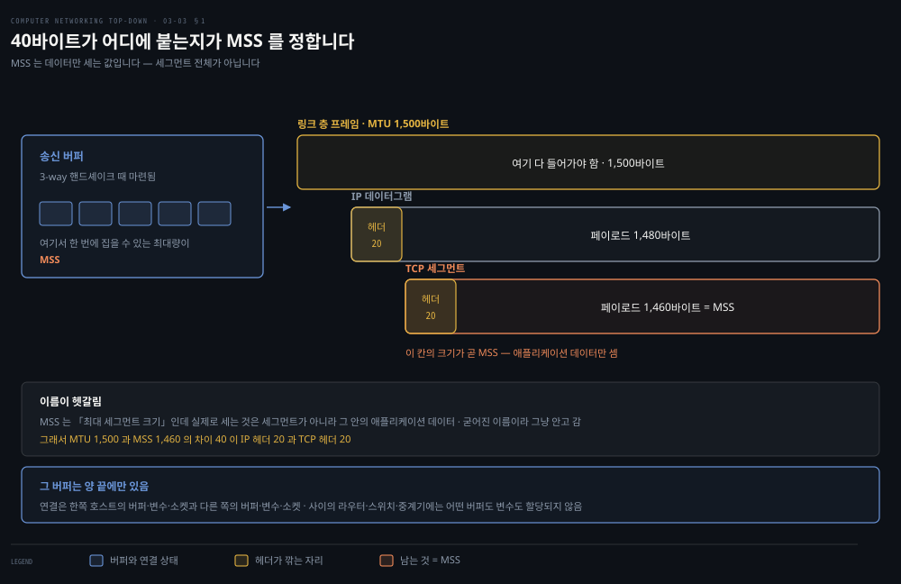
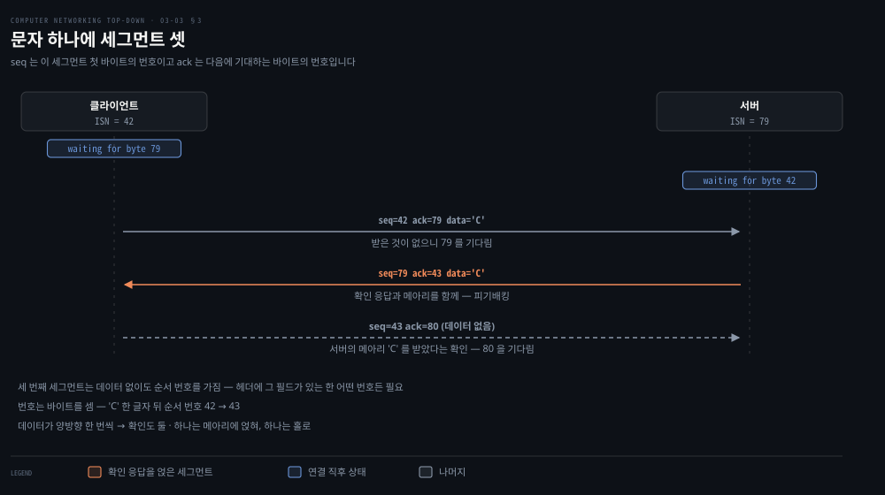
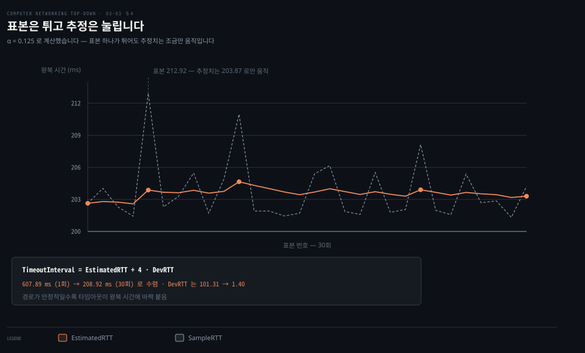
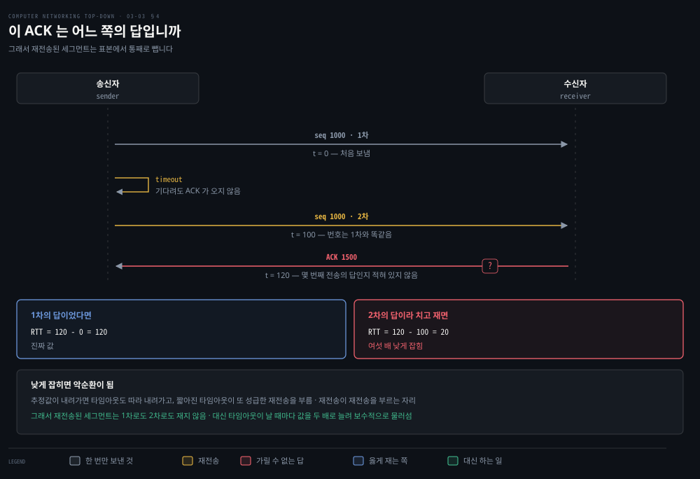
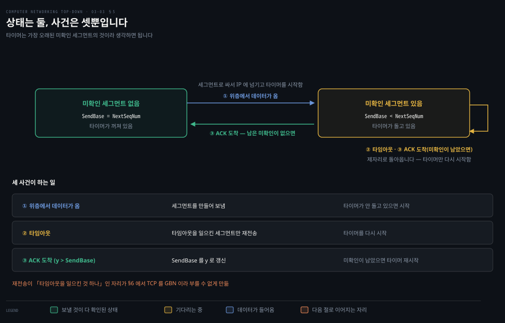
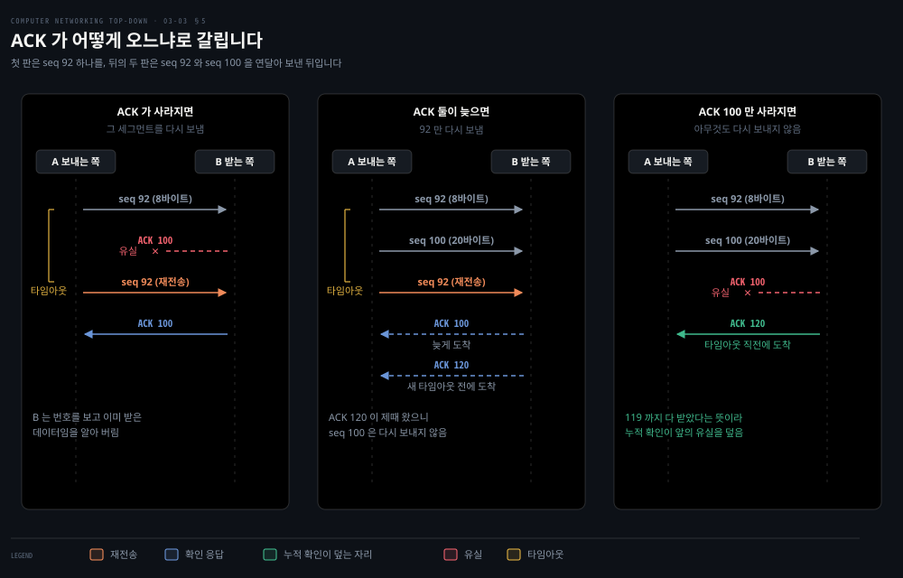
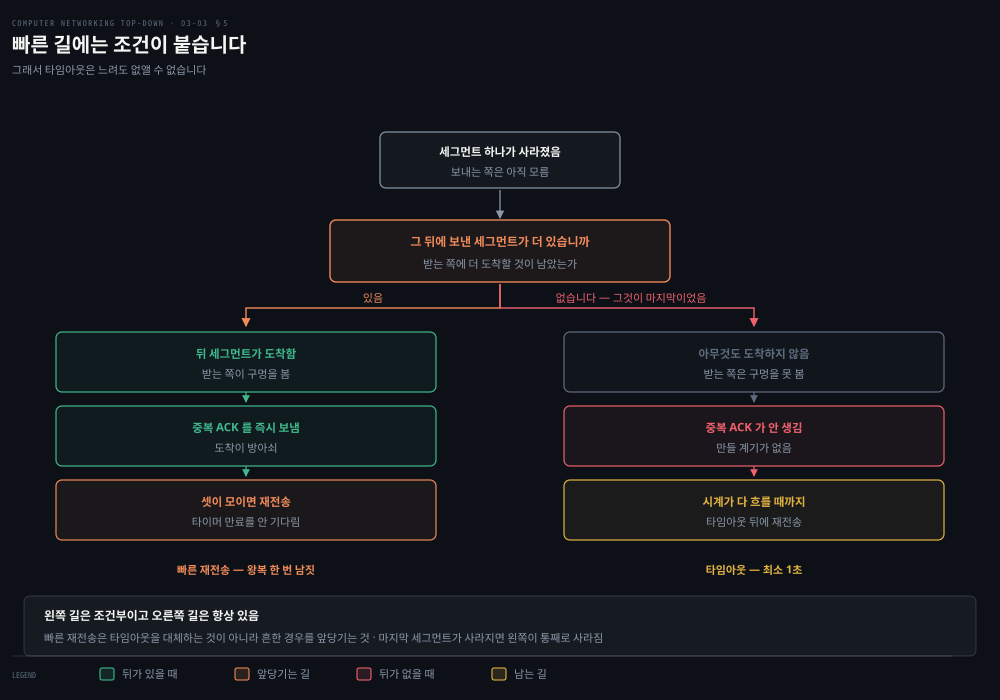
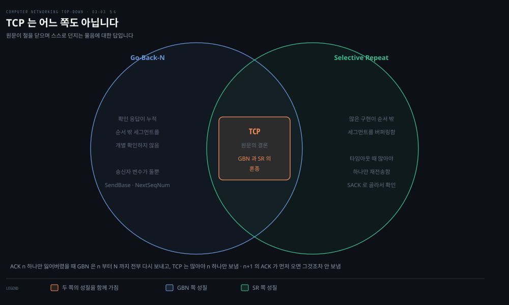
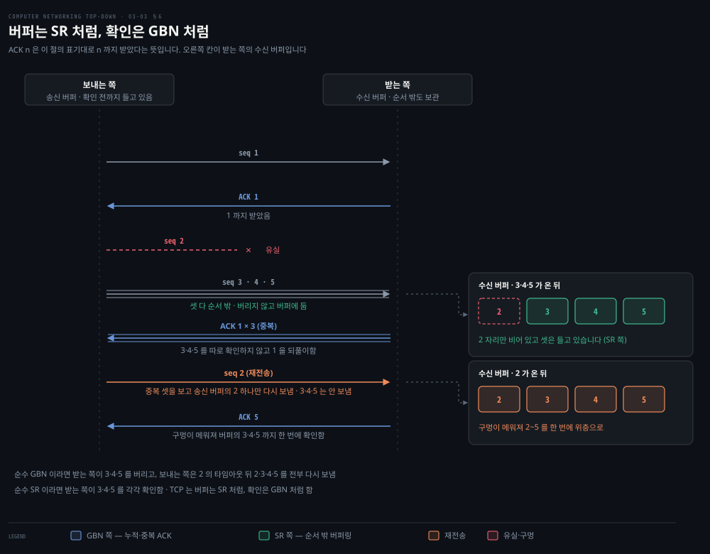
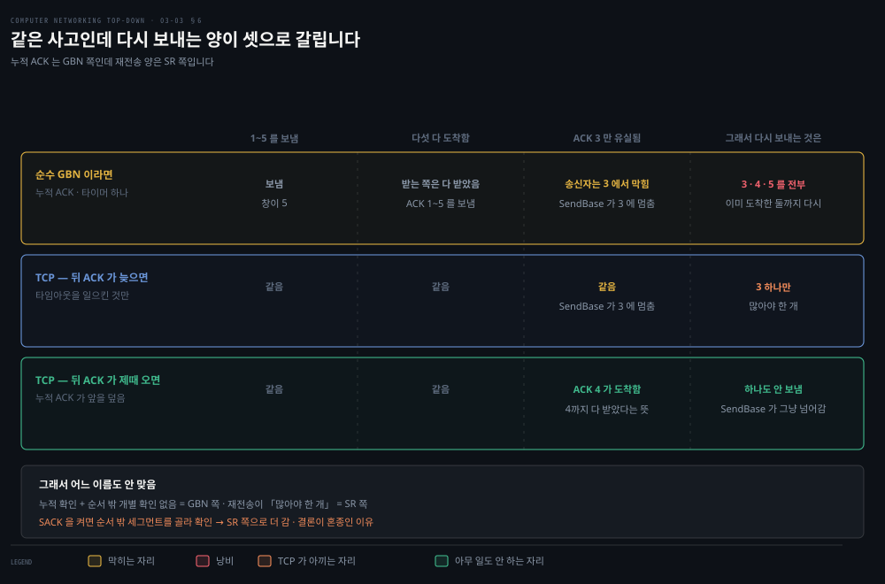

# TCP 는 어떻게 세고 어떻게 기다리는가

---

> 앞 편에서 신뢰성의 부품을 다 만들었습니다. 이제 TCP 가 그 부품을 어떻게 조립했는지 봅니다. 두 가지가 다릅니다. 번호가 바이트를 세고, 타이머가 하나뿐입니다.

## 핵심 요약

> 이 편이 매달린 하나의 생각은 **TCP 가 앞 편의 장치를 거의 다 쓰되 두 자리에서 다르며, 그 둘이 TCP 를 GBN 도 SR 도 아닌 혼종으로 만든다**는 것입니다.

이 절이 목록으로 시작합니다. TCP 는 오류 검출, 재전송, 누적 확인 응답, 타이머, 순서·확인 번호 헤더 필드를 **앞 절의 원리 그대로** 씁니다.

그런데 두 자리가 다릅니다.

1. **순서 번호가 세그먼트가 아니라 바이트를 셉니다.** TCP 는 데이터를 구조 없는 순서 있는 바이트 흐름으로 보고, 세그먼트의 순서 번호는 **그 세그먼트 첫 바이트의 바이트 흐름 번호**입니다.
2. **타이머가 하나뿐입니다.** 이론상으로는 미확인 세그먼트마다 타이머를 두는 편이 쉽지만, 관리 부담이 커서 권고 절차는 **단일 재전송 타이머**를 씁니다.

이 둘이 마지막 절의 물음으로 이어집니다. **TCP 는 GBN 인가 SR 인가.** 답은 둘 다 아니고 **혼종**입니다.

기다리는 시간도 이 편의 몫입니다. 얼마를 기다려야 손실이라 볼 것인가. TCP 는 왕복 시간을 지수 가중 이동 평균으로 추정하고 거기에 변동폭의 네 배를 더합니다. 이 편에서는 그 공식을 실제 왕복 시간 표본에 돌려 봅니다.

문서 상태도 짚고 갑니다. TCP 는 오랫동안 RFC 793 이었고, 그 뒤의 개정들이 **RFC 9293** 으로 모여 793 을 공식적으로 폐기했습니다.


## 학습 목표

> 이 편을 읽고 나면 아래 아홉 가지를 스스로 해낼 수 있습니다.

1. TCP 연결이 어디에 존재하고 어디에 존재하지 않는지 말할 수 있습니다.
2. MSS 와 MTU 의 관계를 설명하고 전형적인 값을 유도할 수 있습니다.
3. 순서 번호와 확인 번호가 각각 무엇을 가리키는지 예를 들어 답할 수 있습니다.
4. `EstimatedRTT`·`DevRTT`·`TimeoutInterval` 을 식으로 쓰고 계산할 수 있습니다.
5. TCP 를 GBN 과 SR 중 어느 쪽으로도 부를 수 없는 이유를 설명할 수 있습니다.
6. 재전송된 세그먼트를 RTT 표본에서 빼는 이유를 숫자로 보이고, 그 규칙의 부작용을 무엇으로 보완하는지 말할 수 있습니다.
7. 타임아웃과 중복 ACK 가 각각 어느 쪽에서 무엇을 방아쇠로 생기는지 가를 수 있습니다.
8. 빠른 재전송이 아예 못 쓰이는 경우를 하나 들고 그때 무엇이 남는지 말할 수 있습니다.
9. SACK 이 누적 확인 응답과 어떻게 공존하는지, 그리고 왜 알릴 수 있는 구간이 서넛뿐인지 설명할 수 있습니다.

이 편에서 새로 만나는 낱말입니다. `어디서` 는 그 낱말이 실제로 설명되는 절입니다.

| 키워드 | 뜻 | 학습 포인트·연결 개념 | 어디서 |
|---|---|---|---|
| MSS (Maximum Segment Size) | 한 세그먼트에 담는 데이터 상한 | MTU 1500 − 헤더 40 = 1460 · 헤더는 안 셈 | §1 |
| 순서 번호 (sequence number) | 그 세그먼트 첫 바이트의 흐름 번호 | 세그먼트가 아니라 바이트를 셈 | §3 |
| 확인 번호 (acknowledgment number) | 다음에 기대하는 바이트 번호 | 누적 확인 응답 · 그 앞은 다 받았다는 뜻 | §3 |
| 타임아웃 · RTT 추정 | 얼마나 기다릴지 정하는 값 | `EstimatedRTT` + 4×`DevRTT` | §4 |
| 빠른 재전송 (fast retransmit) | 중복 ACK 셋에 타이머 없이 재전송 | 마지막 세그먼트가 사라지면 못 씀 | §5 |
| SACK (Selective ACK) | 받은 구간 좌표를 옵션에 실음 | 누적 ACK 위에 얹힘 · 옵션 칸이 좁아 서넛 | §6 |


## 1. 연결이라는 것

> TCP 의 연결은 회선이 아닙니다. 양 끝 호스트의 메모리에만 존재하는 상태입니다.



### 어디에 있나

이 점이 강하게 못 박혀 있습니다. TCP 연결은 회선 교환망의 TDM·FDM 회선이 아닙니다. **논리적인 것이며, 공통 상태가 통신하는 두 종단 시스템의 TCP 안에만 존재합니다.**

중간 라우터와 링크 층 스위치는 TCP 연결 상태를 갖지 않습니다. 표현이 선명합니다.

> 중간 라우터들은 TCP 연결을 **전혀 알지 못합니다. 그들이 보는 것은 데이터그램이지 연결이 아닙니다.**

성질도 둘 짚습니다. **전이중**이라 양쪽이 동시에 보낼 수 있고, **항상 점대점**이라 한 번의 보내기로 여러 수신자에게 보내는 멀티캐스트가 불가능합니다. 여기에 농담이 하나 딸려 있습니다. TCP 에서 **호스트 둘은 동행이고 셋은 군중**입니다.

### 버퍼와 MSS

연결이 서면 3-way 핸드셰이크 도중에 마련된 **송신 버퍼**에 데이터가 들어갑니다. TCP 는 때때로 그 버퍼에서 덩어리를 집어 네트워크 층으로 넘깁니다.

언제 보내는지에 대한 인용이 재미있습니다. 원래 규격은 이 대목에 **느긋해서**, TCP 가 데이터를 **"자기 편한 때에 세그먼트로 보내라"** 고만 적었습니다.

한 번에 집을 수 있는 최대량이 **MSS**(Maximum Segment Size, 최대 세그먼트 크기)입니다. 정하는 순서는 이렇습니다.

1. 보내는 호스트가 내보낼 수 있는 가장 큰 링크 층 프레임의 길이를 봅니다. 이것이 **MTU**(Maximum Transmission Unit, 최대 전송 단위)입니다.
2. TCP 세그먼트가 IP 데이터그램에 담기고 거기에 **TCP/IP 헤더(보통 40바이트)** 가 붙어도 프레임 하나에 들어가도록 MSS 를 정합니다.

이더넷과 PPP 의 MTU 가 1,500바이트이므로 전형적인 MSS 가 **1,460바이트**입니다.

이 기계에서 확인해 봤습니다.

```bash
ifconfig en0 | head -1
# en0: flags=8863<UP,BROADCAST,...> mtu 1500      → 1500 - 40 = 1460
```

용어 혼란을 미리 정리하고 갑니다. **MSS 는 세그먼트 안 애플리케이션 데이터의 최대량이지 헤더를 포함한 세그먼트의 최대 크기가 아닙니다.** 이 용어는 혼란스럽지만 굳어져서 그냥 안고 가야 합니다.

### 연결이란 결국 무엇인가

정리하면 이렇습니다. TCP 연결은 한쪽 호스트의 **버퍼·변수·소켓 연결**과 다른 쪽 호스트의 **버퍼·변수·소켓 연결**로 이뤄집니다. 그리고 그 사이의 라우터·스위치·중계기에는 **어떤 버퍼도 변수도 할당되지 않습니다.**

세 번 오가는 순서를 움직이는 그림으로 따라갈 수 있습니다.

<iframe src="https://unseel.com/embed/cs/tcp-handshake.html"
        width="100%" height="600" loading="lazy" allow="autoplay" frameborder="0"
        title="TCP Handshake — interactive visualization"></iframe>

> **이 창이 비어 있다면**: 재생은 MkDocs 로 배포된 사이트에서만 됩니다. GitHub 저장소 뷰나 마크다운 편집기에서는 [Unseel — TCP Handshake](https://unseel.com/cs/tcp-handshake) 을 직접 엽니다. 사이트가 스스로 `AI-generated content` 라고 밝히고 있으니, 움직임을 눈에 익히는 용도로만 쓰고 사실 확인은 본문과 원문으로 합니다.


## 2. 세그먼트의 구조

> 헤더가 보통 20바이트입니다. UDP 보다 12바이트 많고, 그 12바이트가 TCP 가 더하는 모든 것을 실어 나릅니다.

### 필드

| 필드 | 크기 | 하는 일 |
|---|---|---|
| 출발지·목적지 포트 | 각 2바이트 | 다중화·역다중화 |
| 순서 번호 | 4바이트 | 이 세그먼트 첫 바이트의 바이트 흐름 번호 |
| 확인 번호 | 4바이트 | 다음에 기대하는 바이트의 번호 |
| 헤더 길이 | 4비트 | 헤더 길이를 32비트 낱말 수로. 옵션 때문에 가변입니다 |
| 플래그 | 아래 참조 | 제어 비트 |
| 수신 창 | 2바이트 | 받는 쪽이 받아들일 용의가 있는 바이트 수 — 흐름 제어 |
| 체크섬 | 2바이트 | 오류 검출 |
| 긴급 데이터 포인터 | 2바이트 | 긴급 데이터의 마지막 바이트 위치 |
| 옵션 | 가변 | MSS 협상, 창 크기 조정 인자, 타임스탬프 |

옵션이 비어 있는 것이 보통이라 **전형적인 헤더가 20바이트**입니다. 그래서 Telnet 이나 ssh 처럼 한 바이트를 실어 보내는 세그먼트가 **21바이트**가 됩니다.

### 플래그

플래그는 여덟 개입니다.

- **ACK**: 확인 번호 필드의 값이 유효함을 알립니다.
- **RST · SYN · FIN**: 연결 수립과 해제에 씁니다.
- **CWR · ECE**: 명시적 혼잡 통지에 씁니다.
- **PSH**: 받는 쪽이 데이터를 즉시 위층에 올리라는 표시입니다.
- **URG**: 이 세그먼트에 위층이 긴급하다고 표시한 데이터가 있음을 알립니다.

마지막은 실무 이야기입니다. **PSH·URG·긴급 데이터 포인터는 실제로는 쓰이지 않습니다.** 완결성을 위해 언급할 뿐입니다.

> **책의 오기**: **"플래그 필드는 6비트를 담는다"** 고 적고, 바로 이어서 여덟 개를 설명합니다. 
>
> 지금의 정본인 RFC 9293 이 이렇게 적습니다. `"The currently assigned control bits are CWR, ECE, URG, ACK, PSH, RST, SYN, and FIN."`[^rfc9293] **여덟 개이고 각각 1비트**입니다. 6이었던 것은 RFC 793 시절이고, 명시적 혼잡 통지가 예약 비트 둘을 가져가 CWR 과 ECE 가 되면서 여덟이 됐습니다. 같은 문단이 곧바로 CWR 과 ECE 를 설명하므로 한 문단 안에서 어긋납니다.

> **책의 오기**: 옵션 필드를 설명하며 **"자세한 내용은 RFC 854 와 RFC 1323 을 보라"** 고 적습니다. 
>
> **RFC 854 는 "TELNET PROTOCOL SPECIFICATION"** 이라 TCP 옵션과 관계가 없습니다.[^rfc854] 같은 절이 두 쪽 뒤에서 **"Telnet 은 RFC 854 에 정의돼 있다"** 고 제대로 적으므로, 한 절 안에서 같은 번호를 서로 다른 두 가지로 씁니다. RFC 1323 도 **RFC 7323 으로 대체**됐고, 그 7323 은 §3.5 도입부가 이미 인용하고 있습니다.


## 3. 번호는 바이트를 셉니다

> 순서 번호와 확인 번호가 무엇을 가리키는지는 예로만 설명됩니다. 그 예를 그대로 따라가는 편이 빠릅니다.



### 순서 번호

TCP 는 데이터를 **구조는 없지만 순서는 있는 바이트 흐름**으로 봅니다. 그래서 번호가 세그먼트가 아니라 바이트에 붙습니다. 세그먼트의 순서 번호는 **그 세그먼트 데이터 필드 첫 바이트의 번호**입니다.

예로 500,000바이트 파일을 MSS 1,000바이트로 보내면 세그먼트가 500개 나옵니다. 번호는 0, 1000, 2000 순으로 붙습니다.

### 확인 번호

이쪽이 까다롭습니다. 정의를 그대로 옮깁니다.

> 호스트 A 가 자기 세그먼트에 넣는 확인 번호는 **A 가 B 로부터 다음에 기대하는 바이트의 순서 번호**입니다.

예로 A 가 B 에게서 0번부터 535번까지를 다 받았으면 536 을 넣습니다. 그런데 A 가 0~535 와 900~1000 을 받고 536~899 를 못 받았다면 여전히 **536** 을 넣습니다. 첫 결손 바이트까지만 확인하기 때문이고, 이것이 **누적 확인 응답**입니다.

여기서 미묘한 물음이 섭니다. 순서 밖 세그먼트가 오면 어떻게 하나. 답이 뜻밖입니다.

> **TCP RFC 들은 여기에 아무 규칙도 부과하지 않고 구현자에게 맡깁니다.**

선택지는 둘입니다. 바로 버리거나(수신자 설계가 단순해집니다), 빠진 것이 채워질 때까지 들고 있거나입니다. 대역폭 면에서 뒤쪽이 효율적이고 **실무의 선택도 그쪽**입니다.

### 첫 번호는 0 이 아닙니다

예에서는 0 으로 두었을 뿐이고 진짜는 다릅니다. **양쪽이 초기 순서 번호를 무작위로 고릅니다.** 이유는 앞 편의 마지막 절과 같습니다. 이미 끝난 옛 연결의 세그먼트가 망에 남아 있다가 같은 포트 쌍의 새 연결에서 유효한 세그먼트로 오인되는 일을 줄이려는 것입니다.

### Telnet 으로 따라가면

화면에 찍히는 글자는 사실 서버가 되돌려 준 사본입니다. Telnet 은 원격 로그인 프로토콜인데, 2장의 대량 전송 응용과 달리 **대화형**입니다. 사용자가 글자 하나를 칠 때마다 그 글자가 서버로 가고, 서버는 받은 글자의 **사본을 되돌려** 보냅니다. 이 **메아리**로 사용자는 자기가 친 글자가 서버에 도착해 처리됐음을 확인합니다. 그래서 글자 하나가 키를 누른 순간부터 화면에 보이기까지 망을 두 번 건넙니다.

이 메아리가 이 예의 열쇠입니다. 데이터가 한쪽으로만 흐르는 것이 아니라 **양쪽으로 한 번씩** 흐릅니다.

사용자가 문자 `C` 하나를 치고 커피를 가지러 갑니다. 클라이언트 초기 번호가 42, 서버가 79 입니다. 연결은 맺어졌고 아직 데이터는 오가지 않았으므로, 클라이언트는 서버의 79번 바이트를 기다리고 서버는 클라이언트의 42번 바이트를 기다리는 상태에서 시작합니다.

| 순서 | 방향 | seq | ack | 데이터 | 뜻 |
|---|---|---|---|---|---|
| 1 | 클라이언트 → 서버 | 42 | 79 | `C` | 첫 바이트가 42번입니다. 아직 받은 것이 없으니 79 를 기다립니다 |
| 2 | 서버 → 클라이언트 | 79 | 43 | `C` | 42까지 받았고 43을 기다립니다. 메아리 `C` 를 **얹어** 보내는데, 서버가 보내는 첫 바이트라 79번입니다 |
| 3 | 클라이언트 → 서버 | 43 | 80 | 없음 | 서버의 79번 바이트를 받았으니 80을 기다립니다. 보낼 데이터는 없습니다 |

두 번째 세그먼트가 두 일을 겸합니다. 하나는 클라이언트가 보낸 `C` 를 받았다는 확인 응답이고, 다른 하나는 메아리 `C` 라는 서버 자신의 데이터입니다. 이렇게 확인 응답을 반대 방향 데이터 세그먼트에 얹어 보내는 것을 **피기배킹**이라 부릅니다.

세 번째 세그먼트의 **유일한 목적은 서버가 보낸 데이터를 확인하는 것**입니다. 두 번째 세그먼트에 실려 온 메아리 `C` 는 확인 응답이 아니라 데이터이므로, 그것을 받았다는 확인이 다시 필요합니다. 사용자가 자리를 비워 클라이언트에는 얹어 보낼 데이터가 없고, 그래서 확인 응답이 빈 세그먼트로 홀로 갑니다.

여기서부터는 **노트의 읽기**입니다. 화살표를 「전송 하나에 응답 하나」로 세면 둘이어야 할 것 같은데, 그 셈은 데이터가 한 방향으로만 흐를 때 맞습니다. TCP 는 방향마다 따로 신뢰성을 보장하므로 데이터가 두 방향으로 흐르면 확인도 두 번 필요합니다. 본래는 데이터·확인·데이터·확인 넷인데, 서버가 첫 확인을 자기 데이터에 얹어 하나가 줄고 셋이 남습니다.

| 서버의 동작 | 세그먼트 수 |
|---|---|
| 메아리 없이 확인만 보냄 | 2 |
| 메아리에 확인을 얹어 보냄 (이 예) | 3 |
| 확인과 메아리를 따로 보냄 | 4 |

실제 구현은 세 번째 같은 홀로 가는 확인 응답을 곧바로 보내지 않고 잠깐 기다립니다. 다음 글자가 곧 오면 그 데이터에 확인을 얹는 편이 싸기 때문입니다. RFC 5681 은 이 **지연 ACK** 를 권고하되, 첫 미확인 패킷이 도착한 뒤 500 밀리초 안에는 반드시 보내라고 못 박습니다.[^delack] 이 예에서는 사용자가 자리를 비워 얹을 데이터가 오지 않으므로 확인만 따로 나갑니다.

세 번째 세그먼트에는 데이터가 없는데도 순서 번호가 붙습니다. 이유는 한 줄입니다. **TCP 헤더에 순서 번호 필드가 있으므로 세그먼트는 어떤 번호든 가져야 하기 때문입니다.**

> **지금은 다릅니다**: 각주에도 밝혀져 있듯 Telnet 은 비밀번호를 포함한 데이터를 암호화하지 않아 도청에 취약하므로 **지금은 SSH 를 씁니다.** 번호가 오가는 모양을 보는 예로는 여전히 좋지만, 실제로 이 프로토콜로 원격 접속하지는 않습니다.


## 4. 얼마나 기다릴 것인가

> 타임아웃이 왕복 시간보다 커야 한다는 것은 분명합니다. 문제는 얼마나 더 커야 하는가입니다.



얼마나 기다릴지를 정하려면 먼저 한 번 갔다 오는 데 얼마나 걸리는지를 알아야 합니다. **왕복 시간(Round-Trip Time, RTT)** 은 세그먼트를 보낸 순간부터 그 확인 응답이 돌아오기까지의 시간입니다. [02-02](./02-02.웹은%20어떻게%20주고받는가.md) 에서 작은 패킷이 갔다가 돌아오는 시간으로 처음 나온 그 값이고, 여기서는 세그먼트와 그 확인 응답을 짝으로 잽니다. 이 절에는 RTT 가 붙은 이름이 셋 나오는데, 같은 시간을 다른 단계에서 부르는 이름입니다.

- `SampleRTT`: 세그먼트 하나를 실제로 재서 얻은 **표본**입니다. 잴 때마다 흔들립니다.
- `EstimatedRTT`: 표본들을 평균해 얻은 **추정값**입니다. 흔들림을 눌러 「보통 이 정도」를 나타냅니다.
- `DevRTT`: 표본이 추정값에서 보통 얼마나 **벗어나는지**를 잰 값입니다. 흔들림의 크기입니다.

표본을 재고 평균을 내고 흔들림을 잰 뒤 타임아웃을 정합니다. 아래 소절이 그 순서입니다.

### 표본을 어떻게 뽑나

`SampleRTT` 는 세그먼트를 IP 에 넘긴 시각부터 그것의 확인 응답을 받은 시각까지입니다. 모든 세그먼트에 대해 재지 않고, **한 번에 하나씩만** 잽니다. 그래서 대략 왕복 시간마다 새 표본이 하나 나옵니다.

규칙이 하나 더 있습니다. **재전송된 세그먼트에 대해서는 표본을 잡지 않습니다.** 한 번만 보낸 세그먼트만 잽니다. 어느 전송에 대한 응답인지 알 수 없기 때문입니다.

### Karn 의 알고리즘 — 못 쓰는 표본을 걸러 냅니다

여기서부터는 **노트의 읽기**입니다. 위의 한 줄에는 이름이 있고, 왜 그래야 하는지는 숫자를 넣으면 한 번에 보입니다.

출발점은 **ACK 에 몇 번째 전송에 대한 답인지가 적혀 있지 않다**는 것입니다. 재전송한 세그먼트는 순서 번호가 1차와 똑같으므로 돌아온 ACK 만 보고는 어느 쪽 답인지 가릴 수 없습니다.



```bash
# 같은 세그먼트를 두 번 보내고 ACK 를 하나 받았을 때
t = 0      1차 전송
t = 100    타임아웃 뒤 2차 전송
t = 120    ACK 도착        ← 이것은 어느 쪽의 답인가

# 1차의 답이라면   RTT = 120 - 0   = 120
# 2차의 답이라면   RTT = 120 - 100 = 20
```

여섯 배 차이입니다. 2차 시각부터 재면 **20** 으로 잡히는데 진짜가 120 이었다면 추정값이 통째로 내려앉습니다. 추정값이 내려가면 타임아웃도 따라 내려가고 짧아진 타임아웃이 또 성급한 재전송을 부릅니다. 재전송이 재전송을 부르는 자리입니다.

그래서 **재전송이 일어난 세그먼트는 1차로도 2차로도 재지 않고 표본에서 통째로 뺍니다.** RFC 6298 이 이것을 규범으로 못 박습니다. 「RTT 표본은 재전송된 세그먼트로 만들어서는 **안 된다**」는 것이고, 괄호로 이유가 붙습니다. 「그 응답이 패킷의 첫 번째 것에 대한 것인지 나중 것에 대한 것인지 모호하기 때문」입니다.[^karn]

빼기만 하면 새 구멍이 생깁니다. 재전송이 이어지는 동안은 표본이 하나도 안 들어와 추정값을 갱신할 수 없습니다. 그래서 보완이 붙습니다. **타임아웃이 날 때마다 타임아웃 값을 두 배로 늘립니다.**[^backoff] 잴 수 없으니 재는 대신 보수적으로 물러서는 것입니다.

빠져나갈 길도 하나 있습니다. **타임스탬프 옵션**을 쓰면 어느 전송이 그 확인 응답을 불렀는지가 세그먼트에 실려 오므로 모호함이 사라지고, 그때는 재전송된 세그먼트에서도 표본을 잡을 수 있습니다.[^karn] [03-02](./03-02.신뢰성은%20어떻게%20만들어지는가.md) 의 PAWS 가 쓰는 그 옵션입니다.

### 세 개의 공식

표본이 흔들리므로 평균을 냅니다. 그 평균이 `EstimatedRTT` 입니다. 최근 표본에 더 큰 무게를 두는 **지수 가중 이동 평균(EWMA)** 인데, 최근 표본이 지금의 혼잡을 더 잘 반영하기 때문입니다. 옛 표본의 무게는 갱신이 거듭될수록 지수적으로 빠르게 줄어듭니다. 이름의 「지수」가 거기서 왔습니다.

```properties
EstimatedRTT = (1 − α) · EstimatedRTT + α · SampleRTT      α = 0.125
DevRTT       = (1 − β) · DevRTT + β · |SampleRTT − EstimatedRTT|      β = 0.25
TimeoutInterval = EstimatedRTT + 4 · DevRTT
```

`DevRTT` 는 표본이 추정치에서 보통 얼마나 벗어나는지를 재는 값입니다. 흔들림이 작으면 작아지고 크면 커집니다.

마지막 식의 뜻이 이렇습니다. 타임아웃은 추정치보다 커야 하되 지나치게 크면 손실 회복이 늦어집니다. 그래서 **추정치에 여유를 더하되, 그 여유를 흔들림에 비례**시킵니다.

권고값도 둘 있습니다. **최초 `TimeoutInterval` 은 1초**이고, **타임아웃이 나면 값을 두 배로 늘립니다.** 곧 확인될 다음 세그먼트에서 성급한 타임아웃이 나는 것을 막기 위해서입니다. 세그먼트를 받아 `EstimatedRTT` 가 갱신되면 다시 위 공식으로 계산합니다.

### 실제로 돌려 봤습니다

그림 예로 쓰는 서버가 저자들의 `gaia.cs.umass.edu` 입니다. 그 서버까지 왕복 시간을 30번 재고, 그 표본에 위 세 공식을 그대로 돌렸습니다.

```bash
# ping 은 응답마다 time=205.857 ms 같은 필드를 찍습니다. 그 숫자만 뽑으면 한 줄이 SampleRTT 하나입니다
# --line-buffered 가 없으면 grep 이 끝까지 모았다가 한꺼번에 찍어, 15초 동안 아무것도 안 보입니다
ping -c 30 -i 0.5 gaia.cs.umass.edu | grep --line-buffered -oE 'time=[0-9.]+' | cut -d= -f 2
```


화면에 찍히는 것은 200 안팎에서 조금씩 흔들리는 숫자 30줄뿐입니다. 그것이 아래 표의 `SampleRTT` 열입니다. 위에서부터 n 번째 줄이 n 번째 표본입니다. 나머지 세 열은 화면에 나오지 않습니다. 그 숫자를 위 세 공식에 차례로 넣어 계산한 값이기 때문이고, 계산 코드는 심화 학습 절의 `timer` 함수입니다. 첫 표본에서는 RFC 6298 대로 `EstimatedRTT` 를 첫 표본 값으로, `DevRTT` 를 그 절반으로 시작합니다.[^rtoinit] 표 1행의 202.63 과 101.31 이 그 초기값입니다. 화면과 표는 서로 다른 실행이라 숫자가 조금 다릅니다.

| n | SampleRTT | EstimatedRTT | DevRTT | TimeoutInterval |
|---|---|---|---|---|
| 1 | 202.63 | 202.63 | 101.31 | 607.89 |
| 2 | 204.03 | 202.80 | 76.29 | 507.97 |
| 4 | 201.43 | 202.58 | 43.29 | 375.72 |
| 27 | 202.68 | 203.52 | 1.77 | 210.61 |
| 30 | 204.21 | 203.30 | 1.40 | 208.92 |

단위는 밀리초입니다. 표본 30개의 최솟값이 201.3, 최댓값이 212.9, 평균이 203.7 이었습니다.

보이는 것이 셋입니다.

1. **`EstimatedRTT` 가 표본의 출렁임을 눌러 줍니다.** 212.92 라는 표본이 하나 튀어도 추정치는 202.58 에서 203.87 로만 움직입니다.
2. **`DevRTT` 가 빠르게 줄어듭니다.** 처음에 크게 잡아 둔 값이 표본이 쌓이면서 1.4 밀리초까지 내려옵니다. 이 경로가 안정적이라는 뜻입니다.
3. **`TimeoutInterval` 이 608 밀리초에서 209 밀리초로 수렴합니다.** 왕복 시간이 203 밀리초이니 여유가 6 밀리초 남짓입니다. 경로가 안정적일수록 타임아웃이 왕복 시간에 바짝 붙습니다.

> **노트의 읽기**: 이 실측은 ICMP 왕복 시간을 표본으로 삼은 것이라 TCP 의 `SampleRTT` 와 완전히 같지는 않습니다. 
>
> 그래도 공식이 표본에 어떻게 반응하는지는 그대로 보입니다. 특히 3번이 값집니다. **경로가 흔들리면 여유가 커지고 안정적이면 여유가 사라진다**는 설계 의도가 숫자로 드러납니다. 무선 구간처럼 변동이 큰 경로에서 `DevRTT` 가 커지면 타임아웃도 함께 늘어나, 멀쩡한 세그먼트를 다시 보내는 낭비를 막습니다.


## 5. TCP 의 신뢰적 전송

> 송신자가 반응하는 사건이 셋뿐입니다. 그 셋으로 앞 편의 모든 시나리오가 처리됩니다.



세 사건을 이해하려면 송신자가 무엇을 들고 있는지부터 알아야 합니다. 도식과 아래 설명에 이름이 넷 나오는데, 원문 Figure 3.32 의 송신자 의사코드가 쓰는 변수들입니다.

| 이름 | 뜻 | 언제 바뀌나 |
|---|---|---|
| `NextSeqNum` | 다음에 보낼 바이트의 번호. 새 세그먼트의 순서 번호가 이 값입니다 | 세그먼트를 보낼 때마다 데이터 길이만큼 늘어납니다 |
| `SendBase` | 확인되지 않은 가장 오래된 바이트의 번호. `SendBase − 1` 까지는 받는 쪽에 순서대로 도착했다고 확인된 바이트입니다 | `y > SendBase` 인 ACK 가 오면 `y` 로 올라갑니다 |
| `y` | 도착한 ACK 의 확인 번호. 받는 쪽이 다음에 기대하는 바이트이고, 누적 확인이라 `y` 앞의 바이트를 전부 받았다는 뜻입니다 | 받는 쪽이 정합니다 |
| `TimeoutInterval` | 타이머가 만료되기까지의 시간 | §4 의 공식으로 `EstimatedRTT` 와 `DevRTT` 에서 계산합니다 |

- `SendBase` 부터 `NextSeqNum` 앞까지가 보냈지만 아직 확인되지 않은 구간입니다. 
- 둘이 같으면 미확인이 없어 타이머가 꺼져 있고 `SendBase` 가 작으면 미확인이 있어 타이머가 돕니다. 도식의 두 상태가 그것입니다.

### 세 사건

- **위층에서 데이터가 옴**: `NextSeqNum` 을 순서 번호로 삼아 세그먼트로 싸서 IP 에 넘기고, `NextSeqNum` 을 데이터 길이만큼 올립니다. 다른 세그먼트 때문에 타이머가 이미 돌고 있지 않으면 타이머를 시작합니다. **타이머는 가장 오래된 미확인 세그먼트의 것**이라 생각하면 됩니다.
- **타임아웃**: 타임아웃을 일으킨 세그먼트를 재전송하고 타이머를 다시 시작합니다.
- **ACK 도착**: 값 `y` 를 `SendBase` 와 비교합니다. `y > SendBase` 면 이전에 확인되지 않았던 세그먼트가 확인된 것이므로 `SendBase` 를 `y` 로 갱신하고, 미확인 세그먼트가 남아 있으면 타이머를 다시 시작합니다.

### 세 시나리오

세그먼트를 보낸 뒤 ACK 가 어떻게 오느냐에 따라 다시 보내는 양이 갈립니다. ACK 가 사라지면 그 세그먼트를 다시 보냅니다. 92 와 100 을 연달아 보냈는데 ACK 둘이 다 늦으면 92 만 다시 보냅니다. ACK 100 만 사라져도 ACK 120 이 타임아웃 전에 오면 아무것도 다시 보내지 않습니다.



- ACK 번호가 100 과 120 인 이유는 §3 의 규칙 그대로입니다. 확인 번호는 다음에 기대하는 바이트이므로 순서 번호에 받은 데이터 길이를 더한 값이 됩니다. 
- 92번부터 8바이트를 받으면 99번까지이니 100 을 돌려보내고 100번부터 20바이트를 받으면 119번까지이니 120 을 돌려보냅니다. 

세 번째가 누적 확인 응답의 이득을 보여 줍니다. 나중 ACK 하나가 앞의 손실을 덮습니다.

ACK 100 이 사라졌는데 괜찮은 이유는 사라진 것이 확인 응답이지 데이터가 아니기 때문입니다. 두 세그먼트는 B 에 다 도착했습니다. ACK 120 은 119번까지 전부 받았다는 뜻이라 92~99 도 그 안에 들어 있습니다. A 는 `y = 120 > SendBase` 이므로 `SendBase` 를 120 으로 올리고 둘 다 확인된 것으로 처리합니다. 만약 데이터 92 가 사라졌다면 B 는 구멍을 보고 ACK 120 이 아니라 ACK 92 를 되풀이했을 것입니다. 그때는 이 절 뒤쪽의 빠른 재전송이 맡습니다.

### 빠른 재전송

타임아웃 기반 재전송의 문제는 **기다리는 시간이 길다**는 것입니다. 그런데 송신자는 타임아웃 전에 손실을 짐작할 수 있습니다. **중복 ACK** 를 세면 됩니다.

받는 쪽이 기대하는 번호보다 큰 번호의 세그먼트를 받으면 데이터 흐름에 구멍을 발견한 것입니다. TCP 는 누적 ACK 를 쓰므로, 구멍을 발견하면 **마지막으로 순서대로 받은 바이트의 ACK 를 다시 보냅니다.**

송신자가 파이프라이닝을 하고 있으므로 전송 중인 세그먼트가 여럿이고, 그중 하나가 잃어버려지면 **중복 ACK 가 연달아** 옵니다. 같은 데이터에 대해 중복 ACK 를 **셋** 받으면, 네 번 확인된 그 세그먼트의 다음 세그먼트가 잃어버려졌다고 보고 타이머 만료 전에 다시 보냅니다.

이것에 붙은 이름이 있습니다. **암묵적 NAK** 입니다. 앞 편의 rdt2.2 에서 NAK 를 없앤 바로 그 원리가 여기 그대로 있습니다.

### 중복 ACK 는 타임아웃과 무관합니다

여기서부터는 **노트의 읽기**입니다. 둘이 나란히 나오다 보니 「중복 ACK 는 타임아웃이 세 번 나야 생기는 것」으로 읽히기 쉬운데, 그렇지 않습니다. 서로 다른 쪽에서 일어나는 다른 일입니다.

| | 타임아웃 | 중복 ACK |
|---|---|---|
| 누가 만드나 | **보내는 쪽** | **받는 쪽** |
| 무엇이 방아쇠인가 | 자기 시계가 다 흐르는 것 | 순서에 안 맞는 세그먼트가 도착하는 것 |
| 언제 | 기다린 뒤 | 즉시 |

RFC 5681 이 받는 쪽의 동작을 이렇게 적습니다. 「순서에서 벗어난 세그먼트가 도착하면 TCP 수신자는 **즉시** 중복 ACK 를 보내야 한다」.[^dupimm] 방아쇠가 도착이므로 보내는 쪽 시계와는 아무 상관이 없습니다.

그래서 **타임아웃이 한 번도 안 나도 중복 ACK 는 셋이 모입니다.** 오히려 그것이 빠른 이유입니다. 시계가 다 흐르기를 기다리는 대신 뒤에 오는 세그먼트들이 대신 알려 주기 때문입니다.

### 마지막 세그먼트가 사라지면 그 길이 없습니다

이것도 노트의 읽기입니다. 빠른 재전송이 성립하는 조건을 뒤집으면 못 쓰는 경우가 드러납니다.

중복 ACK 는 **잃어버린 것 뒤에 다른 세그먼트가 계속 도착해야** 생깁니다. 받는 쪽이 구멍을 발견하려면 구멍 너머의 데이터가 와야 하기 때문입니다.

그런데 **마지막 세그먼트가 사라지면 뒤가 없습니다.** 받는 쪽에는 더 도착할 것이 없으므로 중복 ACK 를 만들 계기가 아예 생기지 않습니다. 받는 쪽은 아무 말도 하지 않고 보내는 쪽은 아무 소식도 받지 못합니다.



그때 남는 것은 타임아웃 하나뿐입니다. **느리다고 없앨 수 없는 최후의 수단**인 이유가 이것입니다. 빠른 재전송은 타임아웃을 대체하는 것이 아니라 흔한 경우를 앞당기는 것입니다.

[03-02](./03-02.신뢰성은%20어떻게%20만들어지는가.md) 를 읽으며 「1~9 는 왔는데 10 이 없는 걸 어떻게 아느냐」고 물었다면 정확히 이 자리입니다. 9까지 온 것만으로는 10이 사라졌는지 아직 안 왔는지 가릴 수 없고, 10 뒤의 11이 도착해야 그때 알 수 있습니다. 11이 없으면 시계밖에 없습니다.

SACK 이 구멍을 짚어 주는 장면을 그림으로 볼 수 있습니다.

<iframe src="https://unseel.com/embed/cs/tcp-selective-acknowledgment.html"
        width="100%" height="600" loading="lazy" allow="autoplay" frameborder="0"
        title="TCP Selective Acknowledgment — interactive visualization"></iframe>

> **이 창이 비어 있다면**: 재생은 MkDocs 로 배포된 사이트에서만 됩니다. GitHub 저장소 뷰나 마크다운 편집기에서는 [Unseel — TCP Selective Acknowledgment](https://unseel.com/cs/tcp-selective-acknowledgment) 을 직접 엽니다. 사이트가 스스로 `AI-generated content` 라고 밝히고 있으니, 움직임을 눈에 익히는 용도로만 쓰고 사실 확인은 본문과 원문으로 합니다.


## 6. GBN 인가 SR 인가

> 이 절은 물음 하나로 닫힙니다. 답이 어느 쪽도 아니라는 데 이 편의 요점이 있습니다.



### GBN 쪽 성질

확인 응답이 **누적**이고, 순서 밖 세그먼트를 받는 쪽이 **개별적으로 확인해 주지 않습니다.** 그래서 송신자는 변수 둘만 들고 있으면 됩니다. `SendBase` 와 `NextSeqNum` 입니다. 이 점에서 **TCP 는 GBN 처럼 많이 보입니다.**

### SR 쪽 성질

그런데 **뚜렷한 차이**가 있습니다.

- 많은 구현이 **순서 밖 세그먼트를 버퍼링합니다.**
- 세그먼트 1부터 N 까지 다 도착했는데 **ACK n 하나만 유실**되고 나머지가 제때 왔다고 해 봅니다. GBN 은 n 부터 N 까지 전부 다시 보냅니다. **TCP 는 많아야 한 개, 즉 n 만 다시 보냅니다.** 게다가 n+1 의 ACK 가 n 의 타임아웃 전에 오면 **n 조차 다시 보내지 않습니다.**

### 한 흐름에서 둘을 같이 봅니다

여기서부터는 **노트의 읽기**입니다. 위의 성질들이 한 연결 안에서 어떻게 번갈아 나오는지는 세그먼트 하나가 사라진 흐름 하나로 다 보입니다. 1부터 5까지 보내는데 2가 사라진 경우입니다. 도식의 ACK n 은 이 절의 표기대로 「n 까지 받았다」는 뜻이고 §3 의 확인 번호처럼 다음에 기대하는 바이트를 적은 것이 아닙니다. 양쪽 버퍼의 이름은 §1 의 **송신 버퍼**와 [03-04](./03-04.흐름%20제어와%20연결%20관리,%20그리고%20혼잡.md) 의 **수신 버퍼**입니다. 순서 밖 세그먼트가 머무는 곳이 수신 버퍼이고, 보내는 쪽은 확인이 올 때까지 송신 버퍼에 데이터를 들고 있어야 다시 보낼 수 있습니다.



1. 3·4·5 가 연달아 순서 밖으로 도착합니다. 받는 쪽은 버리지 않고 **버퍼에 둡니다.** 도식 오른쪽 버퍼 칸에 2 자리만 비어 있는 것이 그 상태이고 SR 쪽입니다.
2. 그런데 받는 쪽은 3·4·5 를 따로 확인해 주지 않습니다. **ACK 1 을 되풀이**할 뿐입니다. 확인이 누적이라 그렇고 GBN 쪽입니다.
3. 중복 ACK 가 셋 모이면 보내는 쪽은 §5 의 빠른 재전송으로 **2 하나만** 다시 보냅니다. 3·4·5 를 다시 보내지 않으니 SR 쪽입니다.
4. 2 가 도착해 구멍이 메워지면 받는 쪽은 버퍼의 3·4·5 까지 **ACK 5 하나로** 확인하고 2~5 를 한 번에 위층으로 올립니다. 확인 쪽은 다시 GBN 쪽입니다.

순수 GBN 이라면 받는 쪽이 3·4·5 를 버리고 보내는 쪽은 2 의 타임아웃 뒤 2·3·4·5 를 전부 다시 보냈을 것입니다. 순수 SR 이라면 받는 쪽이 3·4·5 를 각각 확인했을 것입니다. TCP 는 **버퍼는 SR 처럼, 확인은 GBN 처럼** 합니다.

### 그래서 혼종입니다



여기에 **선택적 확인 응답**이 더해집니다. 받는 쪽이 순서 밖 세그먼트를 누적이 아니라 골라서 확인해 줍니다. 이것과 선택적 재전송을 합치면 **TCP 는 일반적인 SR 프로토콜을 많이 닮아 보입니다.**

결론은 이렇습니다.

> TCP 의 오류 회복 장치는 **GBN 과 SR 의 혼종**으로 분류하는 편이 아마 가장 낫습니다.

> **지금은 다릅니다**: 선택적 확인 응답을 **"TCP 에 제안된 수정"** 이라 소개합니다. RFC 2018 은 1996년의 Proposed Standard 이고 지금은 사실상 어디에나 켜져 있습니다. 이 맥에서도 기본값이 켜짐입니다.
>
> ```bash
> sysctl net.inet.tcp.sack
> # net.inet.tcp.sack: 1
> ```
>
> - "제안"이라는 말은 표준화 절차상의 단계 이름이지 배포 상태가 아닙니다. 두 가지를 섞어 읽으면 현행 TCP 를 실제보다 GBN 쪽으로 오해하게 됩니다.

### SACK 은 누적 ACK 위에 얹히는 좌표입니다

여기서부터는 **노트의 읽기**입니다. GBN 과 SR 이 교과서의 양 끝이라면 실제 TCP 는 그 사이에 있습니다. 기본은 GBN 쪽의 누적 확인 응답인데, 옵션 하나를 얹어 SR 의 정보를 함께 나릅니다.

**별도의 패킷이 아닙니다.** ACK 세그먼트의 옵션 칸에 얹혀 갑니다. 담기는 것도 데이터가 아니라 **받은 구간의 좌표**뿐입니다. RFC 2018 은 그것을 「받아서 큐에 넣어 둔 **연속되지 않은 데이터 블록**을 데이터 송신자에게 알리려고 데이터 수신자가 보내는 것」이라 정의하고, 블록마다 **왼쪽 끝과 오른쪽 끝** 두 개의 32비트 값을 싣는다고 적습니다.[^sack]

누적 ACK 를 대체하지도 않습니다. 같은 문서가 못 박습니다. **「SACK 옵션은 확인 응답 번호 필드의 뜻을 바꾸지 않는다」**는 것입니다.[^sackack] 「여기까지는 빠짐없이 받았다」는 기존 신호를 그대로 두고, 그 너머에 흩어져 도착한 조각들의 좌표만 덧붙입니다.

쓰려면 먼저 합의해야 합니다. **SACK-permitted** 라는 두 바이트 옵션을 **SYN 에 실어** 보내고, 그것을 받지 못한 쪽은 SACK 옵션을 **보내면 안 됩니다.**[^sackperm] 연결 수립 때 정해지는 성질이라 연결이 열린 뒤에는 못 바꿉니다.

구간 수에는 상한이 있습니다. 블록 n 개면 옵션 길이가 `8n+2` 바이트인데 TCP 옵션 공간이 **40바이트**뿐이라 최대 넷이고, 타임스탬프 옵션을 함께 쓰면 **셋**으로 줄어듭니다.[^sacklimit] 구멍이 아무리 많아도 한 번에 알릴 수 있는 것은 서넛입니다.

마지막 성질이 중요합니다. SACK 은 약속이 아니라 **통보**입니다. 받는 쪽은 SACK 으로 알린 데이터를 나중에 버려도 됩니다. 그래서 보내는 쪽은 그 데이터를 누적 ACK 가 올라올 때까지 계속 들고 있어야 합니다. SR 의 개별 확인과 닮았지만 **버릴 권리가 남아 있다**는 점에서 다릅니다.


## TCP 세그먼트 치트시트

> 번호가 무엇을 가리키는지와 타임아웃이 어떻게 정해지는지 두 장으로 줄였습니다.

**번호와 값**

| 물음 | 답 |
|---|---|
| 순서 번호가 세는 것은 | 바이트 (세그먼트가 아닙니다) |
| 세그먼트의 순서 번호는 | 데이터 필드 첫 바이트의 번호 |
| 확인 번호는 | 다음에 기대하는 바이트의 번호 |
| 첫 번호는 | 양쪽이 무작위로 고릅니다 |
| 전형적 헤더 크기 | 20바이트 (UDP 보다 12 많음) |
| 전형적 MSS | 1460바이트 (MTU 1500 − 헤더 40) |
| 제어 비트 수 | 8개 (CWR·ECE·URG·ACK·PSH·RST·SYN·FIN) |

**타이머**

| 항목 | 값 |
|---|---|
| α (EstimatedRTT 가중치) | 0.125 |
| β (DevRTT 가중치) | 0.25 |
| 여유 배수 | DevRTT 의 4배 |
| 최초 TimeoutInterval | 1초 |
| 타임아웃 발생 시 | 값을 두 배로 |
| 재전송 세그먼트의 표본 | 잡지 않습니다 |
| 타이머 개수 | 1개 (가장 오래된 미확인 세그먼트) |
| 빠른 재전송 조건 | 중복 ACK 3개 |


## 심화 학습

> 이 편의 공식은 자기 경로의 왕복 시간에 돌려 볼 때 가장 잘 이해됩니다.

```bash
# 경로를 바꿔 가며 표본을 뽑고 위 세 공식을 돌려 보기
ping -c 30 -i 0.5 gaia.cs.umass.edu | grep -oE 'time=[0-9.]+' | cut -d= -f2 > rtt.txt

# 이 기계의 MTU 와 SACK 설정
ifconfig en0 | head -1
sysctl net.inet.tcp.sack net.inet.tcp.mssdflt

# 연결마다 실제로 오가는 번호를 보려면 (관리자 권한 필요)
# sudo tcpdump -i en0 -n 'tcp[tcpflags] & (tcp-syn) != 0' -c 4
```

```python
# 위의 세 공식을 그대로 옮긴 것
def timer(samples, a=0.125, b=0.25):
    est, dev = samples[0], samples[0] / 2
    for x in samples[1:]:
        est = (1 - a) * est + a * x
        dev = (1 - b) * dev + b * abs(x - est)
        yield est, dev, est + 4 * dev
```

가까운 경로와 먼 경로를 각각 재 보면 `DevRTT` 의 차이가 눈에 띕니다. 같은 건물 안 서버는 흔들림이 거의 없어 타임아웃이 왕복 시간에 바짝 붙고, 무선이나 대륙 간 경로는 여유가 크게 잡힙니다.


## 면접 대비

> 이 편에서 실제로 묻는 자리는 확인 번호의 정의, MSS 와 MTU, 그리고 빠른 재전송의 조건입니다.

### 한 줄 정의

- **MSS**: 세그먼트에 담을 수 있는 애플리케이션 데이터의 최대량입니다. 헤더는 포함하지 않습니다.
- **확인 번호**: 보내는 쪽이 다음에 기대하는 바이트의 순서 번호입니다.
- **피기배킹**: 확인 응답을 반대 방향 데이터 세그먼트에 얹어 보내는 것입니다.
- **빠른 재전송**: 중복 ACK 셋을 받으면 타이머 만료 전에 다시 보내는 것입니다.
- **SACK**: ACK 의 옵션 칸에 받은 구간의 좌표를 실어 보내는 선택적 확인 응답입니다.

### 핵심 포인트 다섯 가지

1. TCP 의 순서 번호는 **바이트**를 셉니다. 그래서 세그먼트 경계가 바뀌어도 번호 공간이 흔들리지 않습니다.
2. `TimeoutInterval = EstimatedRTT + 4·DevRTT` 입니다. **여유가 흔들림에 비례**하는 것이 설계의 핵심입니다.
3. TCP 는 GBN 도 SR 도 아닌 **혼종**입니다. 누적 ACK 는 GBN 쪽, 선택적 재전송과 버퍼링은 SR 쪽입니다.
4. 재전송된 세그먼트로는 RTT 를 재지 않습니다. **Karn 의 알고리즘**이고, 잴 수 없는 동안은 타임아웃을 두 배씩 늘려 버팁니다.
5. **타임아웃은 보내는 쪽의 시계이고 중복 ACK 는 받는 쪽의 반응**입니다. 서로 조건이 아니라 별개의 두 감지 경로입니다.

### 자주 묻는 질문

**"MSS 가 1460 인데 MTU 는 왜 1500 입니까?"** MSS 는 애플리케이션 데이터만 세고, MTU 는 링크 층 프레임의 페이로드 전체를 셉니다. IP 헤더 20 과 TCP 헤더 20 이 그 차이입니다.

**"왜 중복 ACK 를 세 개나 기다립니까?"** 하나나 둘은 망에서 순서가 뒤바뀐 것만으로도 생길 수 있기 때문입니다. 셋이면 순서 뒤바뀜보다 손실일 가능성이 훨씬 큽니다.

**"재전송한 세그먼트의 RTT 표본을 왜 안 씁니까?"** 돌아온 ACK 가 첫 전송에 대한 것인지 재전송에 대한 것인지 구별할 수 없어서, 어느 쪽으로 재도 추정이 망가지기 때문입니다. 이 규칙의 이름이 **Karn 의 알고리즘**입니다. 빼기만 하면 재전송이 이어지는 동안 표본이 끊기므로, 대신 타임아웃이 날 때마다 값을 두 배로 늘려 물러섭니다.

**"중복 ACK 는 타임아웃이 세 번 나야 생기는 것 아닙니까?"** 아닙니다. 타임아웃은 보내는 쪽의 시계가 다 흘렀을 때 나고, 중복 ACK 는 받는 쪽이 순서에 안 맞는 세그먼트를 받을 때마다 즉시 만듭니다. 타임아웃이 한 번도 안 나도 중복 ACK 는 셋이 모입니다. 그것이 빠른 이유이기도 합니다.

**"빠른 재전송이 있는데 타임아웃은 왜 남겨 둡니까?"** 중복 ACK 는 잃어버린 것 **뒤에** 세그먼트가 더 도착해야 생기기 때문입니다. 마지막 세그먼트가 사라지면 뒤가 없어 받는 쪽이 아무 말도 하지 않고, 그때는 타임아웃 말고 알아챌 길이 없습니다.

**"SACK 이 있으면 누적 ACK 는 필요 없지 않습니까?"** 아닙니다. SACK 은 확인 응답 번호 필드의 뜻을 바꾸지 않습니다. 「여기까지는 빠짐없이 받았다」는 신호 위에 흩어진 조각의 좌표를 얹을 뿐이고, 받는 쪽이 그 조각을 나중에 버려도 되므로 누적 ACK 가 최종 근거로 남습니다.


## 핵심 개념 체크리스트

> 아래를 보지 않고 말할 수 있으면 이 편은 통과입니다.

- [ ] TCP 연결이 어디에 존재하고 어디에 없는지 말할 수 있습니다.
- [ ] MSS 를 MTU 에서 유도할 수 있습니다.
- [ ] MSS 가 헤더를 포함하지 않는다는 것을 압니다.
- [ ] 순서 번호가 무엇을 세는지 답할 수 있습니다.
- [ ] 확인 번호의 정의를 예를 들어 말할 수 있습니다.
- [ ] 초기 순서 번호를 무작위로 고르는 이유를 압니다.
- [ ] 피기배킹이 무엇인지 말할 수 있습니다.
- [ ] `EstimatedRTT`·`DevRTT`·`TimeoutInterval` 을 식으로 쓸 수 있습니다.
- [ ] 재전송된 세그먼트의 표본을 왜 안 쓰는지 설명할 수 있습니다.
- [ ] TCP 송신자가 반응하는 세 사건을 댈 수 있습니다.
- [ ] 누적 확인 응답이 재전송을 어떻게 아끼는지 예로 설명할 수 있습니다.
- [ ] 빠른 재전송의 조건과 그것이 왜 암묵적 NAK 인지 말할 수 있습니다.
- [ ] TCP 가 GBN 도 SR 도 아닌 이유를 두 가지씩 대며 설명할 수 있습니다.
- [ ] 재전송된 세그먼트의 ACK 로 RTT 를 재면 왜 값이 낮게 잡히는지 숫자로 보일 수 있습니다.
- [ ] 추정값이 낮게 잡히면 어떤 악순환이 생기는지 말할 수 있습니다.
- [ ] Karn 의 알고리즘이 만든 구멍을 무엇으로 메우는지 압니다.
- [ ] 타임스탬프 옵션이 있으면 왜 재전송된 세그먼트에서도 표본을 잡을 수 있는지 설명할 수 있습니다.
- [ ] 타임아웃과 중복 ACK 를 누가 무엇을 보고 만드는지 갈라 말할 수 있습니다.
- [ ] 빠른 재전송이 못 쓰이는 경우를 들고 그때 남는 수단을 말할 수 있습니다.
- [ ] MTU 1,500 과 MSS 1,460 의 차이 40 이 어디에 붙는 헤더인지 댈 수 있습니다.
- [ ] 송신자의 상태가 둘이고 사건이 셋이라는 것을 그려 보일 수 있습니다.
- [ ] ACK 3 만 유실됐을 때 순수 GBN 과 TCP 가 각각 몇 개를 다시 보내는지 답할 수 있습니다.
- [ ] SACK 이 별도 패킷이 아니라는 것과 무엇을 싣는지 말할 수 있습니다.
- [ ] SACK 구간이 최대 넷이고 타임스탬프와 함께 쓰면 셋인 이유를 압니다.
- [ ] SACK 이 약속이 아니라 통보라는 말의 뜻을 설명할 수 있습니다.


## 관련 문서

- [03-02 신뢰성은 어떻게 만들어지는가](./03-02.신뢰성은%20어떻게%20만들어지는가.md) — 이 편의 앞. 여기 쓰인 장치가 어떻게 만들어졌는지
- [03-04 흐름 제어와 연결 관리, 그리고 혼잡](./03-04.흐름%20제어와%20연결%20관리,%20그리고%20혼잡.md) — 이 편의 다음. 수신 창과 3-way 핸드셰이크
- [03-01 트랜스포트는 무엇을 더하는가](./03-01.트랜스포트는%20무엇을%20더하는가.md) — 세그먼트와 데이터그램의 구분
- [Computer Networking — 정독 인덱스](./README.md) — 8개 장 전체 지도


## 참고 자료

- 원본: 《Computer Networking: A Top-Down Approach》 9판 (James F. Kurose · Keith W. Ross, Pearson)
- 다룬 범위: §3.5.1 The TCP Connection · §3.5.2 TCP Segment Structure · §3.5.3 Round-Trip Time Estimation and Timeout · §3.5.4 Reliable Data Transfer
- [RFC 9293 — Transmission Control Protocol (TCP)](https://www.rfc-editor.org/info/rfc9293) — RFC 793 을 폐기한 현행 정본
- [RFC 6298 — Computing TCP's Retransmission Timer](https://www.rfc-editor.org/info/rfc6298) — 이 편의 세 공식과 권고값의 출처
- [RFC 2018 — TCP Selective Acknowledgment Options](https://www.rfc-editor.org/info/rfc2018) — SACK 옵션의 형식과 협상
- [RFC 6298 — Computing TCP's Retransmission Timer](https://www.rfc-editor.org/info/rfc6298) — RTT 표본 규칙(Karn)과 타임아웃 계산·백오프
- [RFC 5681 — TCP Congestion Control](https://www.rfc-editor.org/info/rfc5681) — 중복 ACK 의 발생 조건과 빠른 재전송

[^rfc9293]: RFC 9293 "Transmission Control Protocol (TCP)" §3.1 Header Format. "Control bits: The control bits are also known as 'flags'. … The currently assigned control bits are CWR, ECE, URG, ACK, PSH, RST, SYN, and FIN." 여덟 개가 각각 1비트로 정의됩니다. <https://www.rfc-editor.org/rfc/rfc9293.txt>
[^rfc854]: RFC 854 의 제목 줄은 "TELNET PROTOCOL SPECIFICATION" 입니다. <https://www.rfc-editor.org/rfc/rfc854.txt>

[^karn]: RFC 6298 "Computing TCP's Retransmission Timer" §3 에서 확인. "TCP MUST use Karn's algorithm [KP87] for taking RTT samples.  That is, RTT samples MUST NOT be made using segments that were retransmitted (and thus for which it is ambiguous whether the reply was for the first instance of the packet or a later instance)." 타임스탬프 예외도 같은 절에 있습니다 — "The only case when TCP can safely take RTT samples from retransmitted segments is when the TCP timestamp option [JBB92] is employed, since the timestamp option removes the ambiguity regarding which instance of the data segment triggered the acknowledgment." <https://www.rfc-editor.org/rfc/rfc6298.txt>

[^backoff]: RFC 6298 §5 (5.5) "The host MUST set RTO <- RTO * 2".

[^rtoinit]: RFC 6298 §2 (2.2) "When the first RTT measurement R is made, the host MUST set SRTT <- R, RTTVAR <- R/2, RTO <- SRTT + max (G, K*RTTVAR) where K = 4." SRTT 가 이 편의 EstimatedRTT, RTTVAR 이 DevRTT 입니다. <https://www.rfc-editor.org/rfc/rfc6298.txt>

[^sack]: RFC 2018 "TCP Selective Acknowledgement Options" §3 에서 확인. "The SACK option is to be sent by a data receiver to inform the data sender of non-contiguous blocks of data that have been received and queued." · "Each contiguous block of data queued at the data receiver is defined in the SACK option by two 32-bit unsigned integers in network byte order". <https://www.rfc-editor.org/rfc/rfc2018.txt>

[^sackack]: RFC 2018 §3 "The SACK option does not change the meaning of the Acknowledgement Number field."

[^sackperm]: RFC 2018 §1 "The first is an enabling option, "SACK-permitted", which may be sent in a SYN segment to indicate that the SACK option can be used once the connection is established." · §2 "This two-byte option may be sent in a SYN by a TCP that has been extended to receive (and presumably process) the SACK option once the connection has opened.  It MUST NOT be sent on non-SYN segments." · §4 "If the data receiver has not received a SACK-Permitted option for a given connection, it MUST NOT send SACK options on that connection."

[^sacklimit]: RFC 2018 §3 "A SACK option that specifies n blocks will have a length of 8*n+2 bytes, so the 40 bytes available for TCP options can specify a maximum of 4 blocks." · "thus a maximum of 3 SACK blocks will be allowed in this case."

[^dupimm]: RFC 5681 "TCP Congestion Control" §3.2 "A TCP receiver SHOULD send an immediate duplicate ACK when an out-of-order segment arrives.  The purpose of this ACK is to inform the sender that a segment was received out-of-order and which sequence number is expected." <https://www.rfc-editor.org/rfc/rfc5681.txt>

[^delack]: RFC 5681 "TCP Congestion Control" §4.2 Generating Acknowledgments. "The delayed ACK algorithm specified in [RFC1122] SHOULD be used by a TCP receiver.  When using delayed ACKs, a TCP receiver MUST NOT excessively delay acknowledgments.  Specifically, an ACK SHOULD be generated for at least every second full-sized segment, and MUST be generated within 500 ms of the arrival of the first unacknowledged packet." <https://www.rfc-editor.org/rfc/rfc5681.txt>
